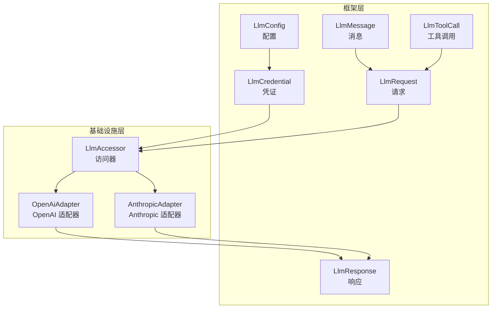
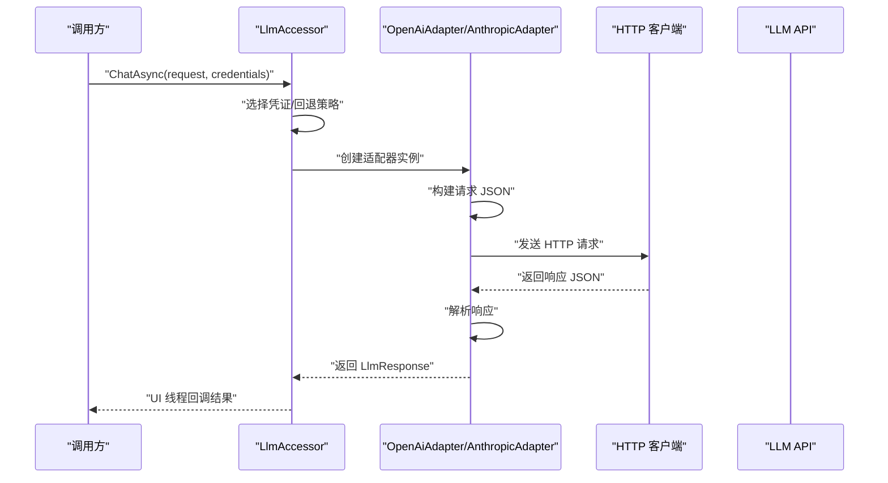
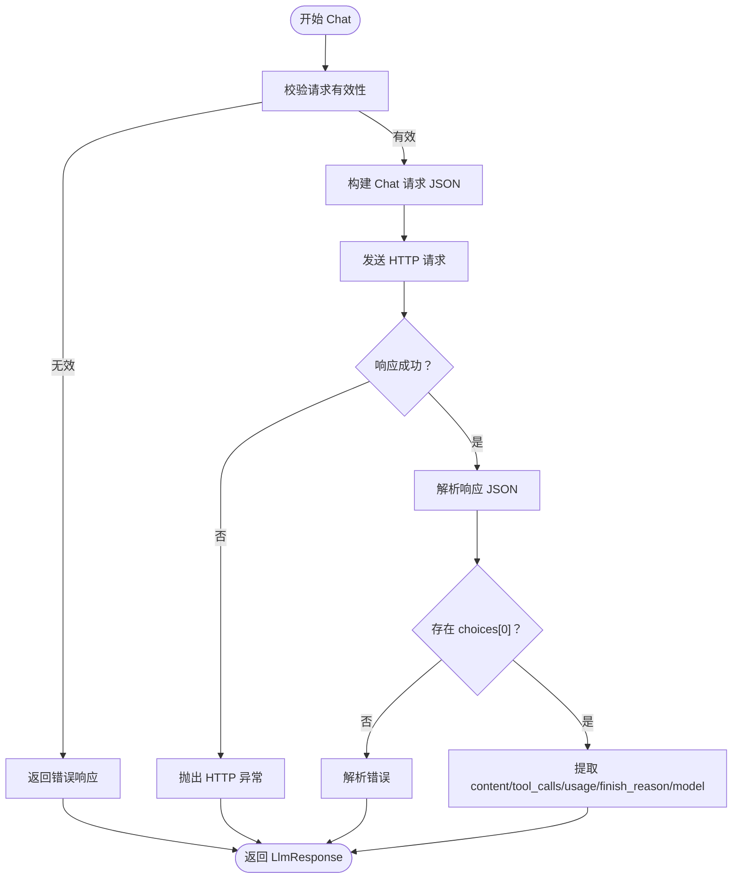
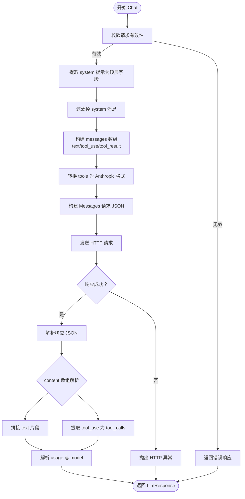
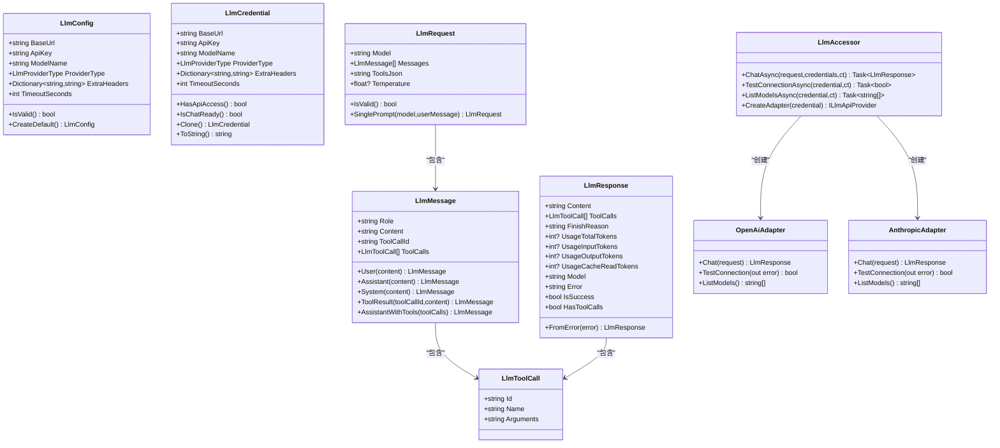
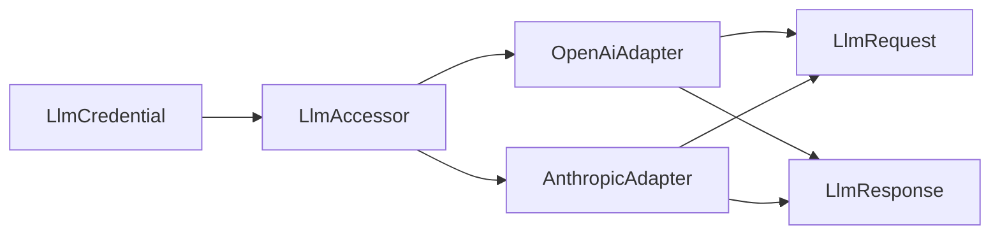

# LLM 适配器

<cite>
**本文档引用的文件**
- [OpenAiAdapter.cs](file://ext/NPCLife/src/NPCLife/Infrastructure/Llm/OpenAiAdapter.cs)
- [AnthropicAdapter.cs](file://ext/NPCLife/src/NPCLife/Infrastructure/Llm/AnthropicAdapter.cs)
- [LlmAccessor.cs](file://ext/NPCLife/src/NPCLife/Infrastructure/Llm/LlmAccessor.cs)
- [LlmConfig.cs](file://ext/NPCLife/src/NPCLife/Framework/Llm/LlmConfig.cs)
- [LlmCredential.cs](file://ext/NPCLife/src/NPCLife/Framework/Llm/LlmCredential.cs)
- [LlmRequest.cs](file://ext/NPCLife/src/NPCLife/Framework/Llm/LlmRequest.cs)
- [LlmMessage.cs](file://ext/NPCLife/src/NPCLife/Framework/Llm/LlmMessage.cs)
- [LlmToolCall.cs](file://ext/NPCLife/src/NPCLife/Framework/Llm/LlmToolCall.cs)
- [LlmResponse.cs](file://ext/NPCLife/src/NPCLife/Framework/Llm/LlmResponse.cs)
</cite>

## 目录
1. [简介](#简介)
2. [项目结构](#项目结构)
3. [核心组件](#核心组件)
4. [架构总览](#架构总览)
5. [组件详解](#组件详解)
6. [依赖关系分析](#依赖关系分析)
7. [性能考量](#性能考量)
8. [故障排除指南](#故障排除指南)
9. [结论](#结论)
10. [附录](#附录)

## 简介
本文件面向 LLM 适配器组件，系统性阐述 OpenAI 适配器与 Anthropic 适配器的实现原理与功能特性。重点说明适配器如何将内部统一格式转换为各提供商的 API 请求/响应格式；文档化 HTTP 通信机制、请求构建与响应解析流程；解释配置项（基础 URL、API 密钥、超时、额外头部）、连接测试与模型发现能力；并提供使用示例与常见问题排查建议。

## 项目结构
- 适配器位于基础设施层，分别针对 OpenAI 及兼容 API（如 Ollama/vLLM/中转代理）与 Anthropic Messages API。
- 适配器不直接暴露给外部，而是由 LlmAccessor 统一调度，支持多凭证回退、异步回调与 UI 线程安全分发。
- 内部统一的数据模型（LlmRequest/LlmResponse/LlmMessage/LlmToolCall）贯穿适配器与上层服务。

图示来源
- [LlmAccessor.cs:1-331](file://ext/NPCLife/src/NPCLife/Infrastructure/Llm/LlmAccessor.cs#L1-L331)
- [OpenAiAdapter.cs:1-392](file://ext/NPCLife/src/NPCLife/Infrastructure/Llm/OpenAiAdapter.cs#L1-L392)
- [AnthropicAdapter.cs:1-434](file://ext/NPCLife/src/NPCLife/Infrastructure/Llm/AnthropicAdapter.cs#L1-L434)
- [LlmConfig.cs:1-69](file://ext/NPCLife/src/NPCLife/Framework/Llm/LlmConfig.cs#L1-L69)
- [LlmCredential.cs:1-84](file://ext/NPCLife/src/NPCLife/Framework/Llm/LlmCredential.cs#L1-L84)
- [LlmRequest.cs:1-46](file://ext/NPCLife/src/NPCLife/Framework/Llm/LlmRequest.cs#L1-L46)
- [LlmMessage.cs:1-63](file://ext/NPCLife/src/NPCLife/Framework/Llm/LlmMessage.cs#L1-L63)
- [LlmToolCall.cs:1-19](file://ext/NPCLife/src/NPCLife/Framework/Llm/LlmToolCall.cs#L1-L19)
- [LlmResponse.cs:1-58](file://ext/NPCLife/src/NPCLife/Framework/Llm/LlmResponse.cs#L1-L58)

章节来源
- [LlmAccessor.cs:1-331](file://ext/NPCLife/src/NPCLife/Infrastructure/Llm/LlmAccessor.cs#L1-L331)
- [OpenAiAdapter.cs:1-392](file://ext/NPCLife/src/NPCLife/Infrastructure/Llm/OpenAiAdapter.cs#L1-L392)
- [AnthropicAdapter.cs:1-434](file://ext/NPCLife/src/NPCLife/Infrastructure/Llm/AnthropicAdapter.cs#L1-L434)

## 核心组件
- LlmAccessor：无状态访问器，负责根据凭证类型选择适配器、发起异步调用、回退逻辑与 UI 线程回调。
- OpenAiAdapter：将内部统一格式转换为 OpenAI Chat Completions 请求/响应格式，支持工具调用与 token 使用统计。
- AnthropicAdapter：将内部统一格式转换为 Anthropic Messages 请求/响应格式，处理 system 提示、tool_result 与 content 数组。
- 数据模型：LlmConfig/LlmCredential 定义配置与凭证；LlmRequest/LlmMessage/LlmToolCall/LlmResponse 描述统一的请求/响应契约。

章节来源
- [LlmAccessor.cs:26-331](file://ext/NPCLife/src/NPCLife/Infrastructure/Llm/LlmAccessor.cs#L26-L331)
- [OpenAiAdapter.cs:18-392](file://ext/NPCLife/src/NPCLife/Infrastructure/Llm/OpenAiAdapter.cs#L18-L392)
- [AnthropicAdapter.cs:23-434](file://ext/NPCLife/src/NPCLife/Infrastructure/Llm/AnthropicAdapter.cs#L23-L434)
- [LlmConfig.cs:23-69](file://ext/NPCLife/src/NPCLife/Framework/Llm/LlmConfig.cs#L23-L69)
- [LlmCredential.cs:12-84](file://ext/NPCLife/src/NPCLife/Framework/Llm/LlmCredential.cs#L12-L84)
- [LlmRequest.cs:9-46](file://ext/NPCLife/src/NPCLife/Framework/Llm/LlmRequest.cs#L9-L46)
- [LlmMessage.cs:8-63](file://ext/NPCLife/src/NPCLife/Framework/Llm/LlmMessage.cs#L8-L63)
- [LlmToolCall.cs:7-19](file://ext/NPCLife/src/NPCLife/Framework/Llm/LlmToolCall.cs#L7-L19)
- [LlmResponse.cs:9-58](file://ext/NPCLife/src/NPCLife/Framework/Llm/LlmResponse.cs#L9-L58)

## 架构总览
适配器采用“统一数据模型 + 适配器模式”的设计，上层通过 LlmAccessor 以异步方式调用，适配器负责：
- HTTP 客户端初始化（基础 URL、超时、默认与扩展头部）
- 请求构建（消息序列、system 提示、工具定义、采样温度）
- 响应解析（内容、工具调用、结束原因、token 使用）
- 连接测试与模型发现（部分适配器支持）

图示来源
- [LlmAccessor.cs:47-191](file://ext/NPCLife/src/NPCLife/Infrastructure/Llm/LlmAccessor.cs#L47-L191)
- [OpenAiAdapter.cs:38-74](file://ext/NPCLife/src/NPCLife/Infrastructure/Llm/OpenAiAdapter.cs#L38-L74)
- [AnthropicAdapter.cs:43-68](file://ext/NPCLife/src/NPCLife/Infrastructure/Llm/AnthropicAdapter.cs#L43-L68)

## 组件详解

### OpenAI 适配器（OpenAiAdapter）
- 职责：将内部统一格式转换为 OpenAI Chat Completions 请求/响应格式，支持工具调用与 token 使用统计。
- HTTP 通信：
  - 基础 URL 清理尾部斜杠，设置默认超时（秒），添加 Authorization: Bearer 头与 Accept: application/json。
  - 支持额外头部（ExtraHeaders）。
  - 同步发送请求（在后台工作线程中），非异步等待。
- 请求构建：
  - 顶层字段：model、temperature、tools（原始 JSON）。
  - messages 数组：role/content/tool_call_id/tool_calls（function 类型）。
- 响应解析：
  - choices[0].message.content 或 tool_calls。
  - usage：total_tokens/prompt_tokens/completion_tokens/cached_tokens。
  - finish_reason 映射至内部统一字段。
- 连接测试与模型发现：
  - 先尝试 GET /v1/models，失败则发送最小聊天请求进行验证。
  - 支持列出模型（解析 data[].id）。
- 错误处理：
  - 捕获 HTTP 异常、超时异常与通用异常，统一包装为 LlmResponse.Error。

图示来源
- [OpenAiAdapter.cs:38-74](file://ext/NPCLife/src/NPCLife/Infrastructure/Llm/OpenAiAdapter.cs#L38-L74)
- [OpenAiAdapter.cs:206-267](file://ext/NPCLife/src/NPCLife/Infrastructure/Llm/OpenAiAdapter.cs#L206-L267)
- [OpenAiAdapter.cs:273-354](file://ext/NPCLife/src/NPCLife/Infrastructure/Llm/OpenAiAdapter.cs#L273-L354)

章节来源
- [OpenAiAdapter.cs:18-392](file://ext/NPCLife/src/NPCLife/Infrastructure/Llm/OpenAiAdapter.cs#L18-L392)

### Anthropic 适配器（AnthropicAdapter）
- 职责：将内部统一格式转换为 Anthropic Messages 请求/响应格式。
- 关键差异：
  - system 提示为顶层字段，而非消息数组元素。
  - tool_result 使用特殊的 user content 块（tool_result）。
  - 响应中 tool_use 位于 content 数组，finish_reason 需要映射。
- HTTP 通信：
  - 使用 x-api-key 头与 anthropic-version 头，其余与 OpenAI 类似。
- 请求构建：
  - 提取第一个 system 角色消息作为顶层 system 字段。
  - 过滤 system 消息后构建 messages 数组。
  - content 为数组：text、tool_use；tool_result 以 user+tool_result 形式传递。
  - tools 转换：OpenAI function 结构转换为 Anthropic input_schema。
- 响应解析：
  - content 数组解析 text 与 tool_use；tool_calls 聚合。
  - usage：input_tokens/output_tokens 与 cache_read_input_tokens。
  - finish_reason 映射：end_turn→stop、tool_use→tool_calls、max_tokens→length。
- 连接测试与模型发现：
  - 无 /v1/models 接口，直接发送最小请求测试。
  - 不支持模型列表查询，返回空数组。

图示来源
- [AnthropicAdapter.cs:43-68](file://ext/NPCLife/src/NPCLife/Infrastructure/Llm/AnthropicAdapter.cs#L43-L68)
- [AnthropicAdapter.cs:152-185](file://ext/NPCLife/src/NPCLife/Infrastructure/Llm/AnthropicAdapter.cs#L152-L185)
- [AnthropicAdapter.cs:210-283](file://ext/NPCLife/src/NPCLife/Infrastructure/Llm/AnthropicAdapter.cs#L210-L283)
- [AnthropicAdapter.cs:332-419](file://ext/NPCLife/src/NPCLife/Infrastructure/Llm/AnthropicAdapter.cs#L332-L419)

章节来源
- [AnthropicAdapter.cs:23-434](file://ext/NPCLife/src/NPCLife/Infrastructure/Llm/AnthropicAdapter.cs#L23-L434)

### 统一数据模型与访问器
- LlmConfig：提供默认 OpenAI 基础 URL、API 密钥、模型名、提供商类型、超时与扩展头；包含配置有效性校验。
- LlmCredential：纯数据传递对象，包含 BaseUrl/ApiKey/ModelName/ProviderType/ExtraHeaders/TimeoutSeconds；提供 API 访问级与聊天级校验。
- LlmRequest/LlmMessage/LlmToolCall/LlmResponse：内部统一格式，适配器负责转换为各提供商格式。
- LlmAccessor：根据 ProviderType 动态创建适配器；支持多凭证回退、异步回调与 UI 线程分发；提供连接测试与模型列表查询。

图示来源
- [LlmConfig.cs:23-69](file://ext/NPCLife/src/NPCLife/Framework/Llm/LlmConfig.cs#L23-L69)
- [LlmCredential.cs:12-84](file://ext/NPCLife/src/NPCLife/Framework/Llm/LlmCredential.cs#L12-L84)
- [LlmRequest.cs:9-46](file://ext/NPCLife/src/NPCLife/Framework/Llm/LlmRequest.cs#L9-L46)
- [LlmMessage.cs:8-63](file://ext/NPCLife/src/NPCLife/Framework/Llm/LlmMessage.cs#L8-L63)
- [LlmToolCall.cs:7-19](file://ext/NPCLife/src/NPCLife/Framework/Llm/LlmToolCall.cs#L7-L19)
- [LlmResponse.cs:9-58](file://ext/NPCLife/src/NPCLife/Framework/Llm/LlmResponse.cs#L9-L58)
- [LlmAccessor.cs:26-331](file://ext/NPCLife/src/NPCLife/Infrastructure/Llm/LlmAccessor.cs#L26-L331)
- [OpenAiAdapter.cs:18-392](file://ext/NPCLife/src/NPCLife/Infrastructure/Llm/OpenAiAdapter.cs#L18-L392)
- [AnthropicAdapter.cs:23-434](file://ext/NPCLife/src/NPCLife/Infrastructure/Llm/AnthropicAdapter.cs#L23-L434)

章节来源
- [LlmConfig.cs:1-69](file://ext/NPCLife/src/NPCLife/Framework/Llm/LlmConfig.cs#L1-L69)
- [LlmCredential.cs:1-84](file://ext/NPCLife/src/NPCLife/Framework/Llm/LlmCredential.cs#L1-L84)
- [LlmRequest.cs:1-46](file://ext/NPCLife/src/NPCLife/Framework/Llm/LlmRequest.cs#L1-L46)
- [LlmMessage.cs:1-63](file://ext/NPCLife/src/NPCLife/Framework/Llm/LlmMessage.cs#L1-L63)
- [LlmToolCall.cs:1-19](file://ext/NPCLife/src/NPCLife/Framework/Llm/LlmToolCall.cs#L1-L19)
- [LlmResponse.cs:1-58](file://ext/NPCLife/src/NPCLife/Framework/Llm/LlmResponse.cs#L1-L58)
- [LlmAccessor.cs:1-331](file://ext/NPCLife/src/NPCLife/Infrastructure/Llm/LlmAccessor.cs#L1-L331)

## 依赖关系分析
- 适配器依赖于统一数据模型（LlmRequest/LlmMessage/LlmToolCall/LlmResponse）与 LlmCredential。
- LlmAccessor 作为门面，按 ProviderType 分派到具体适配器，并负责异步调度与回退。
- 适配器内部使用 HttpClient 发起请求，遵循各提供商的头部与路径规范。

图示来源
- [LlmAccessor.cs:290-303](file://ext/NPCLife/src/NPCLife/Infrastructure/Llm/LlmAccessor.cs#L290-L303)
- [OpenAiAdapter.cs:20-29](file://ext/NPCLife/src/NPCLife/Infrastructure/Llm/OpenAiAdapter.cs#L20-L29)
- [AnthropicAdapter.cs:25-37](file://ext/NPCLife/src/NPCLife/Infrastructure/Llm/AnthropicAdapter.cs#L25-L37)

章节来源
- [LlmAccessor.cs:287-303](file://ext/NPCLife/src/NPCLife/Infrastructure/Llm/LlmAccessor.cs#L287-L303)
- [OpenAiAdapter.cs:18-29](file://ext/NPCLife/src/NPCLife/Infrastructure/Llm/OpenAiAdapter.cs#L18-L29)
- [AnthropicAdapter.cs:23-37](file://ext/NPCLife/src/NPCLife/Infrastructure/Llm/AnthropicAdapter.cs#L23-L37)

## 性能考量
- 线程模型：适配器在后台工作线程中同步执行 HTTP 请求，避免阻塞 UI；LlmAccessor 通过 MainThreadDispatcher 回调结果。
- 超时控制：基于 LlmCredential.TimeoutSeconds 设置 HttpClient.Timeout，默认 120 秒。
- 连接复用：适配器每次调用创建新的 HttpClient 实例（随凭证创建），适合短生命周期调用；若需长期运行，可在上层复用 LlmAccessor 并减少频繁实例化。
- 日志与调试：适配器在关键节点记录请求/响应摘要，便于诊断。
- 工具调用与消息序列：尽量合并文本片段，减少不必要的 content 数组拆分。

## 故障排除指南
- 常见错误类型
  - HTTP 错误：状态码非成功时读取响应体并抛出异常；检查基础 URL、API 密钥与网络连通性。
  - 超时：调整 TimeoutSeconds；确认代理/防火墙未阻断请求。
  - 请求无效：确保 LlmRequest.Model 与 Messages 非空；使用 LlmRequest.SinglePrompt 快捷构造。
  - 解析错误：检查响应 JSON 结构是否符合预期；适配器对异常进行捕获并返回错误响应。
- 连接测试
  - OpenAI：优先尝试 GET /v1/models；失败则发送最小聊天请求验证。
  - Anthropic：直接发送最小请求验证。
- 模型发现
  - OpenAI：解析 /v1/models 的 data[].id。
  - Anthropic：不支持模型列表，返回空数组。
- 多凭证回退
  - LlmAccessor 支持按顺序尝试多个凭证，遇到成功即停止；全部失败返回最后错误。

章节来源
- [OpenAiAdapter.cs:79-143](file://ext/NPCLife/src/NPCLife/Infrastructure/Llm/OpenAiAdapter.cs#L79-L143)
- [AnthropicAdapter.cs:70-100](file://ext/NPCLife/src/NPCLife/Infrastructure/Llm/AnthropicAdapter.cs#L70-L100)
- [LlmAccessor.cs:47-191](file://ext/NPCLife/src/NPCLife/Infrastructure/Llm/LlmAccessor.cs#L47-L191)

## 结论
该适配器体系通过统一数据模型与适配器模式，实现了对 OpenAI 与 Anthropic 的一致接入。LlmAccessor 提供了异步、可回退的调用体验，适配器专注于各提供商的请求/响应差异与错误处理。配合完善的连接测试与模型发现能力，能够满足多数集成场景的需求。

## 附录

### 配置选项与使用要点
- 基础 URL：适配器会清理尾部斜杠并设置为 HttpClient.BaseAddress。
- API 密钥：OpenAI 使用 Authorization: Bearer；Anthropic 使用 x-api-key。
- 超时设置：TimeoutSeconds 控制 HttpClient.Timeout。
- 额外头部：ExtraHeaders 逐项添加，适合代理/鉴权场景。
- 模型发现：OpenAI 支持；Anthropic 不支持。
- 连接测试：两适配器均提供 TestConnection 方法。

章节来源
- [OpenAiAdapter.cs:149-177](file://ext/NPCLife/src/NPCLife/Infrastructure/Llm/OpenAiAdapter.cs#L149-L177)
- [AnthropicAdapter.cs:106-133](file://ext/NPCLife/src/NPCLife/Infrastructure/Llm/AnthropicAdapter.cs#L106-L133)
- [LlmConfig.cs:26-41](file://ext/NPCLife/src/NPCLife/Framework/Llm/LlmConfig.cs#L26-L41)
- [LlmCredential.cs:14-30](file://ext/NPCLife/src/NPCLife/Framework/Llm/LlmCredential.cs#L14-L30)

### 示例：如何使用适配器（步骤说明）
- 准备凭证：创建 LlmCredential（包含 BaseUrl、ApiKey、ModelName、ProviderType、TimeoutSeconds、ExtraHeaders）。
- 准备请求：构造 LlmRequest（设置 Model、Messages、ToolsJson、Temperature）。
- 发起对话：调用 LlmAccessor.ChatAsync(request, [credential], ct)，在回调中接收 LlmResponse。
- 处理结果：判断 IsSuccess；若 HasToolCalls，则根据 ToolCalls 调用工具并回传结果消息。
- 连接测试：调用 LlmAccessor.TestConnectionAsync(credential, ct)。
- 模型发现：调用 LlmAccessor.ListModelsAsync(credential, ct)（OpenAI 有效）。

章节来源
- [LlmAccessor.cs:47-281](file://ext/NPCLife/src/NPCLife/Infrastructure/Llm/LlmAccessor.cs#L47-L281)
- [LlmRequest.cs:9-46](file://ext/NPCLife/src/NPCLife/Framework/Llm/LlmRequest.cs#L9-L46)
- [LlmCredential.cs:12-84](file://ext/NPCLife/src/NPCLife/Framework/Llm/LlmCredential.cs#L12-L84)
- [LlmResponse.cs:9-58](file://ext/NPCLife/src/NPCLife/Framework/Llm/LlmResponse.cs#L9-L58)