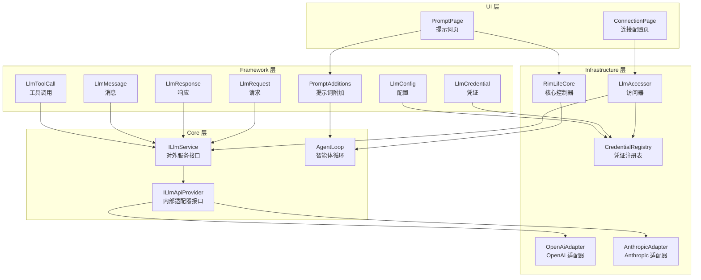
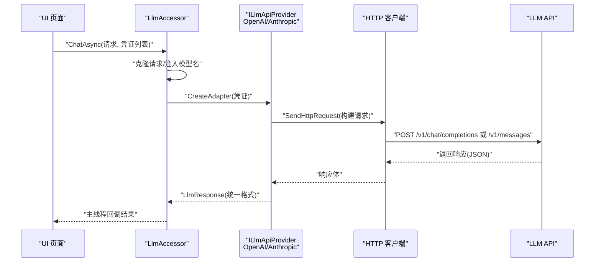
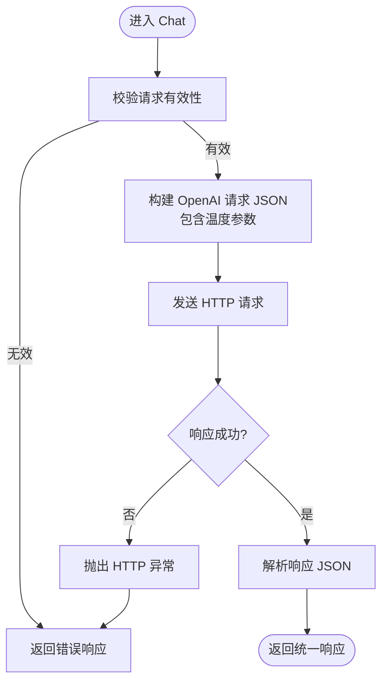
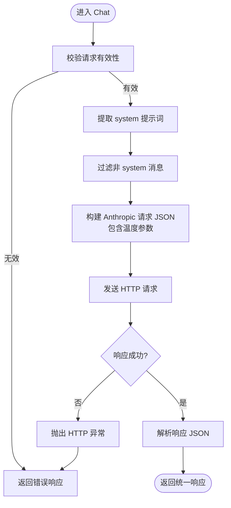
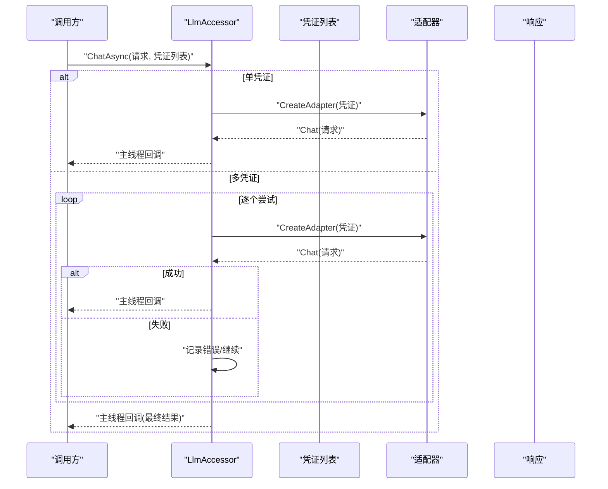
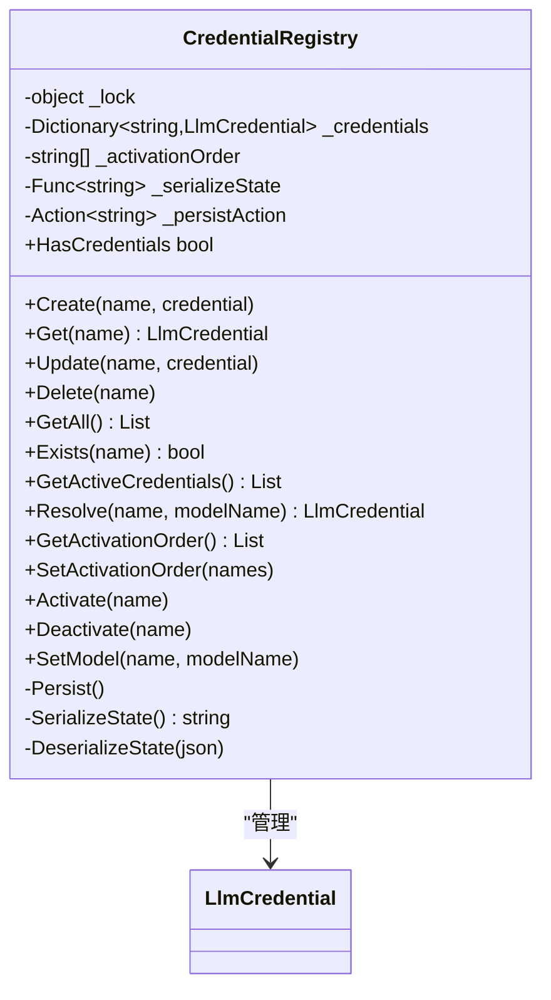
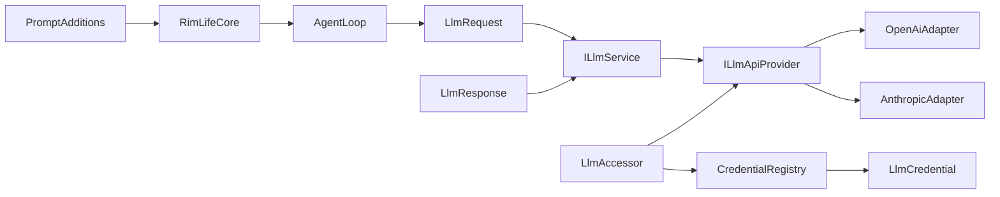

# LLM 集成系统

<cite>
**本文引用的文件**
- [CredentialRegistry.cs](file://ext/NPCLife/src/NPCLife/Infrastructure/Llm/CredentialRegistry.cs)
- [OpenAiAdapter.cs](file://ext/NPCLife/src/NPCLife/Infrastructure/Llm/OpenAiAdapter.cs)
- [AnthropicAdapter.cs](file://ext/NPCLife/src/NPCLife/Infrastructure/Llm/AnthropicAdapter.cs)
- [LlmAccessor.cs](file://ext/NPCLife/src/NPCLife/Infrastructure/Llm/LlmAccessor.cs)
- [ILlmService.cs](file://ext/NPCLife/src/NPCLife/Core/ILlmService.cs)
- [ILlmApiProvider.cs](file://ext/NPCLife/src/NPCLife/Core/ILlmApiProvider.cs)
- [LlmCredential.cs](file://ext/NPCLife/src/NPCLife/Framework/Llm/LlmCredential.cs)
- [LlmRequest.cs](file://ext/NPCLife/src/NPCLife/Framework/Llm/LlmRequest.cs)
- [LlmResponse.cs](file://ext/NPCLife/src/NPCLife/Framework/Llm/LlmResponse.cs)
- [LlmMessage.cs](file://ext/NPCLife/src/NPCLife/Framework/Llm/LlmMessage.cs)
- [LlmToolCall.cs](file://ext/NPCLife/src/NPCLife/Framework/Llm/LlmToolCall.cs)
- [LlmConfig.cs](file://ext/NPCLife/src/NPCLife/Framework/Llm/LlmConfig.cs)
- [ConnectionPage.cs](file://Source/UI/Pages/ConnectionPage.cs)
- [PromptPage.cs](file://Source/UI/Pages/PromptPage.cs)
- [PromptAdditions.cs](file://Source/Infrastructure/PromptAdditions.cs)
- [RimLifeCore.cs](file://Source/Infrastructure/RimLifeCore.cs)
- [DirectorPrompt.txt](file://ext/NPCLife/src/NPCLife/Prompts/DirectorPrompt.txt)
- [FreelancerPrompt.txt](file://ext/NPCLife/src/NPCLife/Prompts/FreelancerPrompt.txt)
- [ScreenwriterPrompt.txt](file://ext/NPCLife/src/NPCLife/Prompts/ScreenwriterPrompt.txt)
- [AgentLoop.cs](file://ext/NPCLife/src/NPCLife/Agent/AgentLoop.cs)
</cite>

## 更新摘要
**所做更改**
- 更新提示词管理系统章节，反映从 PromptConfig 到 PromptAdditions 的迁移
- 新增温度参数管理章节，详细说明 Temperature 参数的使用方式
- 更新全局风格指令管理章节，说明 StyleInstruction 的作用机制
- 更新 UI 配置页面章节，反映新的 PromptAdditions 配置界面
- 更新系统提示词构建章节，说明新的提示词组合方式

## 目录
1. [简介](#简介)
2. [项目结构](#项目结构)
3. [核心组件](#核心组件)
4. [架构总览](#架构总览)
5. [详细组件分析](#详细组件分析)
6. [依赖关系分析](#依赖关系分析)
7. [性能考虑](#性能考虑)
8. [故障排除指南](#故障排除指南)
9. [结论](#结论)
10. [附录](#附录)

## 简介
本文件面向 LLM 集成系统，系统基于统一的数据模型与适配器模式，支持 OpenAI 及兼容 API（如 Ollama/vLLM/中转代理）与 Anthropic Messages API。系统提供凭证管理、模型发现、连通性测试、多凭证回退调用、工具调用（Tool Use）以及统一的提示词管理能力。文档涵盖适配器实现细节、API 接口与配置方法、调用流程、响应处理与错误恢复、性能优化与成本控制、常见问题排查，既适合初学者快速上手，也为有经验的开发者提供足够的技术深度。

**更新** 系统现已从传统的 PromptConfig 迁移到 PromptAdditions，提供更灵活的提示词管理方式，包括独立的温度参数控制和全局风格指令管理。

## 项目结构
系统采用分层与模块化设计：
- Framework 层：定义统一的 LLM 数据模型（请求/响应/消息/工具调用）、配置与提供商类型枚举，确保跨适配器的一致性。
- Core 层：定义对外服务接口（ILlmService）与内部 API 提供者接口（ILlmApiProvider），约束调用契约与线程模型。
- Infrastructure 层：实现具体适配器（OpenAI、Anthropic）、访问器（LlmAccessor）与凭证注册表（CredentialRegistry），完成 HTTP 交互与数据转换。
- UI 层：提供连接配置页面与提示词页面，支撑用户进行凭证配置与提示词管理。
- Prompts 层：提供预置提示词模板，便于快速启用叙事驱动的 AI 行为。
- PromptAdditions 层：新增的提示词附加管理模块，提供独立的温度参数和风格指令配置。

**图表来源**
- [LlmAccessor.cs:26-331](file://ext/NPCLife/src/NPCLife/Infrastructure/Llm/LlmAccessor.cs#L26-L331)
- [ILlmService.cs:17-51](file://ext/NPCLife/src/NPCLife/Core/ILlmService.cs#L17-L51)
- [ILlmApiProvider.cs:12-37](file://ext/NPCLife/src/NPCLife/Core/ILlmApiProvider.cs#L12-L37)
- [OpenAiAdapter.cs:18-392](file://ext/NPCLife/src/NPCLife/Infrastructure/Llm/OpenAiAdapter.cs#L18-L392)
- [AnthropicAdapter.cs:23-434](file://ext/NPCLife/src/NPCLife/Infrastructure/Llm/AnthropicAdapter.cs#L23-L434)
- [CredentialRegistry.cs:19-329](file://ext/NPCLife/src/NPCLife/Infrastructure/Llm/CredentialRegistry.cs#L19-L329)
- [PromptAdditions.cs:11-69](file://Source/Infrastructure/PromptAdditions.cs#L11-L69)
- [AgentLoop.cs:87-113](file://ext/NPCLife/src/NPCLife/Agent/AgentLoop.cs#L87-L113)
- [RimLifeCore.cs:883-908](file://Source/Infrastructure/RimLifeCore.cs#L883-L908)

**章节来源**
- [LlmAccessor.cs:11-331](file://ext/NPCLife/src/NPCLife/Infrastructure/Llm/LlmAccessor.cs#L11-L331)
- [ILlmService.cs:8-51](file://ext/NPCLife/src/NPCLife/Core/ILlmService.cs#L8-L51)
- [ILlmApiProvider.cs:6-37](file://ext/NPCLife/src/NPCLife/Core/ILlmApiProvider.cs#L6-L37)

## 核心组件
- 统一数据模型
  - 请求：包含模型名、消息列表、工具定义 JSON、采样温度。
  - 响应：包含文本内容、工具调用请求、结束原因、Token 消耗、模型名与错误信息。
  - 消息：支持 system/user/assistant/tool 四类角色，含工具调用 ID 与工具调用列表。
  - 工具调用：包含调用 ID、工具名与参数 JSON。
  - 凭证：包含基础 URL、API Key、模型名、提供商类型、扩展头、超时秒数；提供 API 访问级与聊天级校验。
  - 配置：提供默认 OpenAI 配置，包含基础 URL、API Key、模型名、提供商类型、扩展头、超时秒数。
  - **新增** 提示词附加：包含导演、编剧、自由人附加指令，全局风格指令和采样温度参数。
- 服务接口
  - ILlmService：对外统一异步接口，支持多凭证回退、连通性测试与模型列表查询。
  - ILlmApiProvider：内部适配器接口，规范各提供商的 HTTP 调用与格式转换。
- 访问器
  - LlmAccessor：无状态实现，按凭证动态创建适配器，支持多凭证回退、异步回调、主线程调度。
- 凭证注册表
  - CredentialRegistry：管理"凭证名 → API 凭证"映射，支持 CRUD、激活顺序、模型设置与持久化。
- **新增** 智能体循环
  - AgentLoop：管理 LLM 对话循环，处理工具调用、消息历史管理和温度参数传递。

**章节来源**
- [LlmRequest.cs:9-46](file://ext/NPCLife/src/NPCLife/Framework/Llm/LlmRequest.cs#L9-L46)
- [LlmResponse.cs:9-58](file://ext/NPCLife/src/NPCLife/Framework/Llm/LlmResponse.cs#L9-L58)
- [LlmMessage.cs:8-63](file://ext/NPCLife/src/NPCLife/Framework/Llm/LlmMessage.cs#L8-L63)
- [LlmToolCall.cs:7-19](file://ext/NPCLife/src/NPCLife/Framework/Llm/LlmToolCall.cs#L7-L19)
- [LlmCredential.cs:12-84](file://ext/NPCLife/src/NPCLife/Framework/Llm/LlmCredential.cs#L12-L84)
- [LlmConfig.cs:23-69](file://ext/NPCLife/src/NPCLife/Framework/Llm/LlmConfig.cs#L23-L69)
- [PromptAdditions.cs:11-69](file://Source/Infrastructure/PromptAdditions.cs#L11-L69)
- [ILlmService.cs:17-51](file://ext/NPCLife/src/NPCLife/Core/ILlmService.cs#L17-L51)
- [ILlmApiProvider.cs:12-37](file://ext/NPCLife/src/NPCLife/Core/ILlmApiProvider.cs#L12-L37)
- [LlmAccessor.cs:26-331](file://ext/NPCLife/src/NPCLife/Infrastructure/Llm/LlmAccessor.cs#L26-L331)
- [CredentialRegistry.cs:19-329](file://ext/NPCLife/src/NPCLife/Infrastructure/Llm/CredentialRegistry.cs#L19-L329)
- [AgentLoop.cs:87-113](file://ext/NPCLife/src/NPCLife/Agent/AgentLoop.cs#L87-L113)

## 架构总览
系统采用"服务接口 + 适配器 + 访问器 + 凭证管理 + 提示词附加"的分层架构。UI 通过访问器发起异步调用，访问器根据凭证提供商类型选择对应适配器，适配器将统一请求转换为特定 API 的请求格式并发起 HTTP 调用，再将响应转换为统一响应格式返回给 UI。凭证注册表负责持久化与激活顺序管理，支持多凭证回退。提示词附加模块提供独立的温度参数和风格指令管理，通过 RimLifeCore 统一管理。

**图表来源**
- [LlmAccessor.cs:47-191](file://ext/NPCLife/src/NPCLife/Infrastructure/Llm/LlmAccessor.cs#L47-L191)
- [OpenAiAdapter.cs:38-74](file://ext/NPCLife/src/NPCLife/Infrastructure/Llm/OpenAiAdapter.cs#L38-L74)
- [AnthropicAdapter.cs:43-68](file://ext/NPCLife/src/NPCLife/Infrastructure/Llm/AnthropicAdapter.cs#L43-L68)

## 详细组件分析

### OpenAI 适配器（OpenAiAdapter）
- 功能特性
  - 将统一请求转换为 OpenAI Chat Completions 格式，支持消息、温度、工具定义与工具调用。
  - 支持连通性测试与模型列表查询。
  - 统一响应解析，包含内容、工具调用、Token 消耗与模型名。
- API 接口
  - Chat：同步工作线程调用，返回统一响应。
  - TestConnection：先尝试 /v1/models，失败则发送最小聊天请求验证。
  - ListModels：调用 /v1/models 并解析返回的模型 ID 列表。
- 配置要点
  - 基础 URL 自动去除尾部斜杠，设置默认 Accept 与 Authorization 头。
  - 支持 ExtraHeaders 扩展头，超时时间来自凭证配置。
  - **更新** 温度参数通过 LlmRequest.Temperature 传递，支持 0-2 范围内的浮点值。
- 错误处理
  - 捕获 HTTP 异常、超时异常与通用异常，统一包装为错误响应。

**图表来源**
- [OpenAiAdapter.cs:38-74](file://ext/NPCLife/src/NPCLife/Infrastructure/Llm/OpenAiAdapter.cs#L38-L74)
- [OpenAiAdapter.cs:206-229](file://ext/NPCLife/src/NPCLife/Infrastructure/Llm/OpenAiAdapter.cs#L206-L229)
- [OpenAiAdapter.cs:273-354](file://ext/NPCLife/src/NPCLife/Infrastructure/Llm/OpenAiAdapter.cs#L273-L354)

**章节来源**
- [OpenAiAdapter.cs:18-392](file://ext/NPCLife/src/NPCLife/Infrastructure/Llm/OpenAiAdapter.cs#L18-L392)

### Anthropic 适配器（AnthropicAdapter）
- 功能特性
  - 将统一请求转换为 Anthropic Messages API 格式，关键差异包括：system 提升为顶层字段、tool messages 使用特殊 content 块、tool_use 在 content 数组中。
  - 支持连通性测试（直接最小请求）、模型列表查询（返回空数组）。
  - 统一响应解析，包含内容、工具调用、Token 消耗与模型名。
- API 接口
  - Chat：同步工作线程调用，返回统一响应。
  - TestConnection：发送最小请求验证。
  - ListModels：返回空数组（Anthropic 不支持）。
- 配置要点
  - 使用 x-api-key 与 anthropic-version 头，基础 URL 处理与 OpenAI 类似。
  - 工具定义转换：将 OpenAI function 格式转换为 Anthropic input_schema 格式。
  - **更新** 温度参数通过 LlmRequest.Temperature 传递，支持 0-2 范围内的浮点值。
- 错误处理
  - 捕获 HTTP 异常、超时异常与通用异常，统一包装为错误响应。

**图表来源**
- [AnthropicAdapter.cs:43-68](file://ext/NPCLife/src/NPCLife/Infrastructure/Llm/AnthropicAdapter.cs#L43-L68)
- [AnthropicAdapter.cs:152-185](file://ext/NPCLife/src/NPCLife/Infrastructure/Llm/AnthropicAdapter.cs#L152-L185)
- [AnthropicAdapter.cs:332-419](file://ext/NPCLife/src/NPCLife/Infrastructure/Llm/AnthropicAdapter.cs#L332-L419)

**章节来源**
- [AnthropicAdapter.cs:23-434](file://ext/NPCLife/src/NPCLife/Infrastructure/Llm/AnthropicAdapter.cs#L23-L434)

### LLM 服务访问器（LlmAccessor）
- 功能特性
  - 无状态实现，按凭证动态创建适配器，支持多凭证回退、异步回调、主线程调度。
  - ChatAsync 支持单凭证与多凭证路径，多凭证时按顺序尝试，成功即返回，失败自动切换。
  - TestConnectionAsync 与 ListModelsAsync 提供连通性测试与模型列表查询。
- 调用流程
  - 单凭证：直接创建适配器并调用 Chat。
  - 多凭证：循环尝试，每次使用请求副本避免污染，记录最后错误。
  - 所有操作在工作线程执行，完成后通过 MainThreadDispatcher 回调 UI。
- 错误处理
  - 捕获取消、异常与失败响应，统一包装为最终响应或异常。

**图表来源**
- [LlmAccessor.cs:47-191](file://ext/NPCLife/src/NPCLife/Infrastructure/Llm/LlmAccessor.cs#L47-L191)
- [LlmAccessor.cs:290-303](file://ext/NPCLife/src/NPCLife/Infrastructure/Llm/LlmAccessor.cs#L290-L303)

**章节来源**
- [LlmAccessor.cs:26-331](file://ext/NPCLife/src/NPCLife/Infrastructure/Llm/LlmAccessor.cs#L26-L331)
- [ILlmService.cs:17-51](file://ext/NPCLife/src/NPCLife/Core/ILlmService.cs#L17-L51)

### 凭证管理系统（CredentialRegistry）
- 功能特性
  - 管理"凭证名 → API 凭证"映射，支持 CRUD、激活顺序、模型设置与持久化。
  - 运行时通过 GetActiveCredentials 获取激活顺序中的可用凭证，HasCredentials 判断是否存在可用凭证。
  - 持久化采用 JSON 序列化，字段兼容旧版本（aliases、activeAliases）。
- API 接口
  - Create/Get/Update/Delete/Exists：标准 CRUD。
  - GetAll/Resolve：批量获取与解析指定凭证。
  - GetActivationOrder/SetActivationOrder/Activate/Deactivate：激活顺序管理。
  - SetModel：为指定凭证设置模型名。
- 配置要点
  - 激活顺序决定多凭证回退优先级。
  - 持久化委托允许注入自定义存储后端，失败不影响运行时。

**图表来源**
- [CredentialRegistry.cs:19-329](file://ext/NPCLife/src/NPCLife/Infrastructure/Llm/CredentialRegistry.cs#L19-L329)
- [LlmCredential.cs:12-84](file://ext/NPCLife/src/NPCLife/Framework/Llm/LlmCredential.cs#L12-L84)

**章节来源**
- [CredentialRegistry.cs:19-329](file://ext/NPCLife/src/NPCLife/Infrastructure/Llm/CredentialRegistry.cs#L19-L329)

### 提示词管理系统（PromptAdditions）
- **更新** 系统提示词配置
  - 通过 UI 的 PromptPage 与 ConnectionPage 管理提示词与连接配置，支持不同角色（导演、自由人、编剧）的提示词模板。
  - **新增** PromptAdditions 类提供独立的提示词附加管理，包含导演、编剧、自由人的附加指令。
  - **新增** 全局风格指令 StyleInstruction，运行时追加到所有 Agent 的 system prompt 末尾。
  - **新增** 采样温度 Temperature 参数，范围 0-2，默认值 0.7。
- 提示词模板
  - DirectorPrompt.txt：导演角色提示词模板。
  - FreelancerPrompt.txt：自由人角色提示词模板。
  - ScreenwriterPrompt.txt：编剧角色提示词模板。
- **新增** 温度参数控制
  - LlmRequest 支持 Temperature 参数（0~2），null 表示使用 API 默认值。
  - AgentLoop 将 PromptAdditions.Temperature 传递给 LlmRequest。
  - 适配器在构建请求时按需写入温度字段。

**章节来源**
- [PromptPage.cs](file://Source/UI/Pages/PromptPage.cs)
- [ConnectionPage.cs](file://Source/UI/Pages/ConnectionPage.cs)
- [PromptAdditions.cs:11-69](file://Source/Infrastructure/PromptAdditions.cs#L11-L69)
- [LlmRequest.cs:20-21](file://ext/NPCLife/src/NPCLife/Framework/Llm/LlmRequest.cs#L20-L21)
- [AgentLoop.cs:444-452](file://ext/NPCLife/src/NPCLife/Agent/AgentLoop.cs#L444-L452)
- [DirectorPrompt.txt](file://ext/NPCLife/src/NPCLife/Prompts/DirectorPrompt.txt)
- [FreelancerPrompt.txt](file://ext/NPCLife/src/NPCLife/Prompts/FreelancerPrompt.txt)
- [ScreenwriterPrompt.txt](file://ext/NPCLife/src/NPCLife/Prompts/ScreenwriterPrompt.txt)

### RimLifeCore 核心控制器
- **更新** 系统提示词构建
  - 通过 RimLifeCore.PromptAdditions 管理全局提示词附加配置。
  - 导演、编剧、自由人系统提示词分别构建，支持附加指令和风格指令。
  - 工作空间上下文动态注入到系统提示词中。
- **新增** 温度参数传递
  - AgentLoop 构建 LlmRequest 时，从 PromptAdditions.Temperature 获取温度值。
  - 温度参数通过 LlmRequest.Temperature 传递给适配器。
- **新增** 提示词持久化
  - LoadPromptAdditions：从缓存存储加载 PromptAdditions 配置。
  - SavePromptAdditions：将 PromptAdditions 配置保存到缓存存储。
  - 支持热重载，修改后调用 RebuildAgents 重建智能体。

**章节来源**
- [RimLifeCore.cs:883-908](file://Source/Infrastructure/RimLifeCore.cs#L883-L908)
- [RimLifeCore.cs:833-842](file://Source/Infrastructure/RimLifeCore.cs#L833-L842)
- [RimLifeCore.cs:604-616](file://Source/Infrastructure/RimLifeCore.cs#L604-L616)
- [RimLifeCore.cs:639-652](file://Source/Infrastructure/RimLifeCore.cs#L639-L652)
- [RimLifeCore.cs:699-711](file://Source/Infrastructure/RimLifeCore.cs#L699-L711)

## 依赖关系分析
- 组件耦合
  - LlmAccessor 通过 ILlmApiProvider 抽象依赖具体适配器，降低耦合度。
  - CredentialRegistry 与 LlmCredential 解耦，仅依赖 JSON 序列化与持久化委托。
  - **新增** PromptAdditions 与 AgentLoop 解耦，通过 RimLifeCore 统一管理。
- 外部依赖
  - HTTP 客户端：OpenAI/Anthropic 适配器各自创建 HttpClient，设置超时与头部。
  - JSON 解析/写入：适配器与注册表使用内部 JsonParser/JsonWriter 进行序列化。
  - **新增** 缓存存储：RimLifeCore 使用 CacheStore 持久化 PromptAdditions 配置。
- 循环依赖
  - 未发现循环依赖，接口与实现分离清晰。

**图表来源**
- [ILlmService.cs:17-51](file://ext/NPCLife/src/NPCLife/Core/ILlmService.cs#L17-L51)
- [ILlmApiProvider.cs:12-37](file://ext/NPCLife/src/NPCLife/Core/ILlmApiProvider.cs#L12-L37)
- [LlmAccessor.cs:290-303](file://ext/NPCLife/src/NPCLife/Infrastructure/Llm/LlmAccessor.cs#L290-L303)
- [OpenAiAdapter.cs:18-392](file://ext/NPCLife/src/NPCLife/Infrastructure/Llm/OpenAiAdapter.cs#L18-L392)
- [AnthropicAdapter.cs:23-434](file://ext/NPCLife/src/NPCLife/Infrastructure/Llm/AnthropicAdapter.cs#L23-L434)
- [CredentialRegistry.cs:19-329](file://ext/NPCLife/src/NPCLife/Infrastructure/Llm/CredentialRegistry.cs#L19-L329)
- [LlmCredential.cs:12-84](file://ext/NPCLife/src/NPCLife/Framework/Llm/LlmCredential.cs#L12-L84)
- [LlmRequest.cs:9-46](file://ext/NPCLife/src/NPCLife/Framework/Llm/LlmRequest.cs#L9-L46)
- [LlmResponse.cs:9-58](file://ext/NPCLife/src/NPCLife/Framework/Llm/LlmResponse.cs#L9-L58)
- [PromptAdditions.cs:11-69](file://Source/Infrastructure/PromptAdditions.cs#L11-L69)
- [RimLifeCore.cs:883-908](file://Source/Infrastructure/RimLifeCore.cs#L883-L908)
- [AgentLoop.cs:444-452](file://ext/NPCLife/src/NPCLife/Agent/AgentLoop.cs#L444-L452)

**章节来源**
- [LlmAccessor.cs:290-303](file://ext/NPCLife/src/NPCLife/Infrastructure/Llm/LlmAccessor.cs#L290-L303)
- [CredentialRegistry.cs:234-275](file://ext/NPCLife/src/NPCLife/Infrastructure/Llm/CredentialRegistry.cs#L234-L275)

## 性能考虑
- 线程与并发
  - 所有 HTTP 调用在工作线程执行，完成后通过 MainThreadDispatcher 回调 UI，避免阻塞主线程。
  - 多凭证回退采用逐个尝试策略，减少不必要的并发开销。
- 资源管理
  - 适配器每次调用创建新的 HttpClient，避免连接池复用导致的状态污染；在高并发场景下可考虑复用或限制并发数量。
- 序列化与日志
  - 适配器在调试模式下记录请求/响应 JSON，注意生产环境关闭或限流日志输出。
  - **新增** PromptAdditions 序列化采用 JsonWriter，支持高效 JSON 序列化。
- Token 与成本控制
  - 统一响应包含输入/输出/缓存读取 Token，便于统计与成本控制；建议在 UI 中展示 Token 使用情况。
  - **新增** 温度参数影响生成长度和 Token 消耗，建议根据任务需求调整。
- 超时与重试
  - 凭证配置支持超时秒数；多凭证回退可作为轻量级"重试"策略，复杂场景建议结合指数退避与熔断。
- **新增** 提示词缓存
  - 系统提示词构建结果可缓存，避免重复构建造成的性能损耗。

## 故障排除指南
- 连接失败
  - 使用 TestConnectionAsync 或适配器 TestConnection：先尝试 /v1/models，失败则发送最小聊天请求验证。
  - 检查基础 URL、API Key、网络连通性与代理设置。
- 模型不可用
  - OpenAI：调用 ListModels 获取可用模型列表；确认模型名正确。
  - Anthropic：不支持模型列表查询，返回空数组；请手动确认模型名。
- 响应为空或解析错误
  - 检查请求格式（模型名、消息列表、工具定义 JSON）；适配器会捕获解析异常并返回错误响应。
  - **新增** 检查温度参数范围（0-2），超出范围可能导致 API 拒绝请求。
- 工具调用失败
  - 确认工具定义 JSON 符合 MCP 标准；Anthropic 适配器会将 OpenAI function 格式转换为 input_schema。
- 多凭证回退
  - 检查激活顺序与凭证有效性；最后错误会作为最终响应返回，便于定位问题。
- **新增** 提示词配置问题
  - 检查 PromptAdditions 配置是否正确保存和加载。
  - 确认附加指令格式正确，避免影响系统提示词结构。
  - 验证全局风格指令不会与基础提示词冲突。

**章节来源**
- [LlmAccessor.cs:196-240](file://ext/NPCLife/src/NPCLife/Infrastructure/Llm/LlmAccessor.cs#L196-L240)
- [OpenAiAdapter.cs:79-112](file://ext/NPCLife/src/NPCLife/Infrastructure/Llm/OpenAiAdapter.cs#L79-L112)
- [AnthropicAdapter.cs:70-92](file://ext/NPCLife/src/NPCLife/Infrastructure/Llm/AnthropicAdapter.cs#L70-L92)
- [LlmResponse.cs:47-55](file://ext/NPCLife/src/NPCLife/Framework/Llm/LlmResponse.cs#L47-L55)
- [PromptAdditions.cs:43-65](file://Source/Infrastructure/PromptAdditions.cs#L43-L65)

## 结论
该 LLM 集成系统通过统一数据模型与适配器模式，实现了对 OpenAI 与 Anthropic 的一致接入，配合凭证注册表与访问器的多凭证回退机制，提供了稳定、可扩展且易维护的集成方案。**更新** 系统现已迁移到 PromptAdditions 提示词管理模式，提供独立的温度参数控制和全局风格指令管理，通过 RimLifeCore 统一管理配置。系统在 UI 层提供直观的配置与提示词管理能力，并通过 Token 统计与连通性测试辅助成本控制与问题排查。对于初学者，可从 UI 页面与提示词模板入手；对于高级用户，可通过自定义适配器与凭证持久化进一步扩展。

## 附录

### A. 适配器与提供商特点对比
- OpenAI 适配器
  - 优势：生态成熟、模型丰富、支持工具调用与模型列表查询。
  - 注意：需遵循 OpenAI 请求/响应格式，注意温度与工具定义的兼容性。
- Anthropic 适配器
  - 优势：prompt caching、更安全的工具调用体验。
  - 注意：system 提升为顶层字段、tool messages 使用特殊 content 块、不支持模型列表查询。
  - **更新** 两者都支持温度参数传递，但参数名称和位置可能有所不同。

**章节来源**
- [OpenAiAdapter.cs:18-392](file://ext/NPCLife/src/NPCLife/Infrastructure/Llm/OpenAiAdapter.cs#L18-L392)
- [AnthropicAdapter.cs:23-434](file://ext/NPCLife/src/NPCLife/Infrastructure/Llm/AnthropicAdapter.cs#L23-L434)

### B. 配置示例与最佳实践
- 凭证配置
  - 基础 URL：指向 OpenAI 或兼容网关。
  - API Key：对应提供商密钥。
  - 模型名：OpenAI 示例 gpt-4o/gpt-3.5-turbo；Anthropic 示例 claude-3-haiku。
  - 超时秒数：根据网络状况调整。
- **更新** 提示词附加配置
  - 使用 PromptAdditions 类管理导演、编剧、自由人的附加指令。
  - 全局风格指令 StyleInstruction 运行时追加到所有 Agent 的 system prompt 末尾。
  - 温度参数 Temperature 控制生成创造性，默认 0.7。
- 多凭证回退
  - 将备用提供商加入激活顺序，实现高可用与成本优化。
- **新增** 性能优化建议
  - 合理设置温度参数：0.3-0.5 适合需要确定性的任务，0.7-1.0 适合创意任务。
  - 使用工作空间上下文动态注入，避免静态提示词过长。
  - 定期清理不需要的附加指令，保持提示词简洁有效。

**章节来源**
- [LlmCredential.cs:14-30](file://ext/NPCLife/src/NPCLife/Framework/Llm/LlmCredential.cs#L14-L30)
- [LlmConfig.cs:26-41](file://ext/NPCLife/src/NPCLife/Framework/Llm/LlmConfig.cs#L26-L41)
- [CredentialRegistry.cs:171-208](file://ext/NPCLife/src/NPCLife/Infrastructure/Llm/CredentialRegistry.cs#L171-L208)
- [PromptAdditions.cs:11-69](file://Source/Infrastructure/PromptAdditions.cs#L11-L69)
- [PromptPage.cs](file://Source/UI/Pages/PromptPage.cs)
- [DirectorPrompt.txt](file://ext/NPCLife/src/NPCLife/Prompts/DirectorPrompt.txt)
- [FreelancerPrompt.txt](file://ext/NPCLife/src/NPCLife/Prompts/FreelancerPrompt.txt)
- [ScreenwriterPrompt.txt](file://ext/NPCLife/src/NPCLife/Prompts/ScreenwriterPrompt.txt)