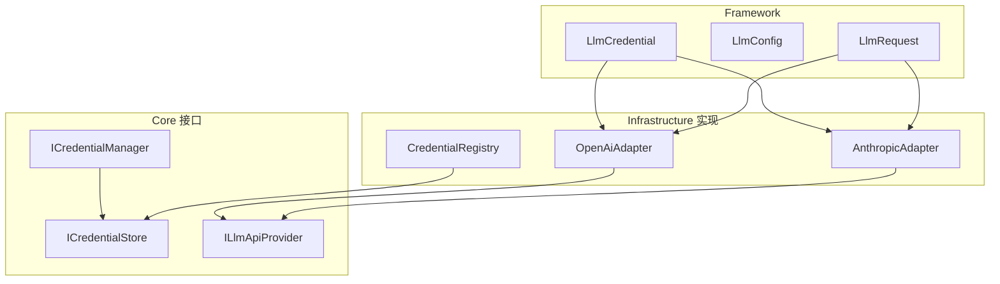
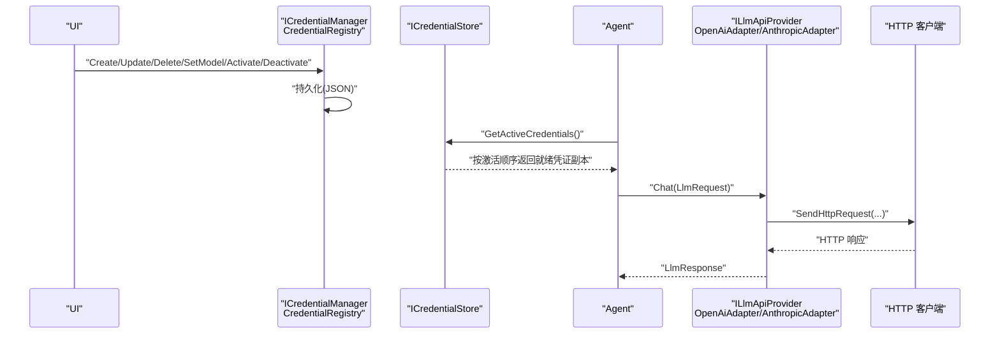
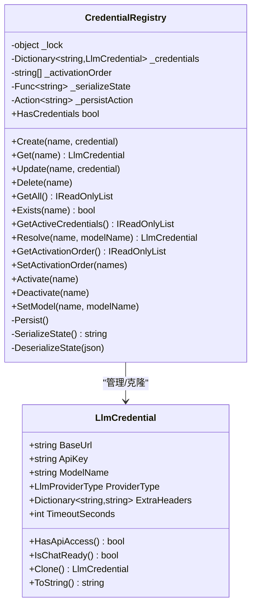
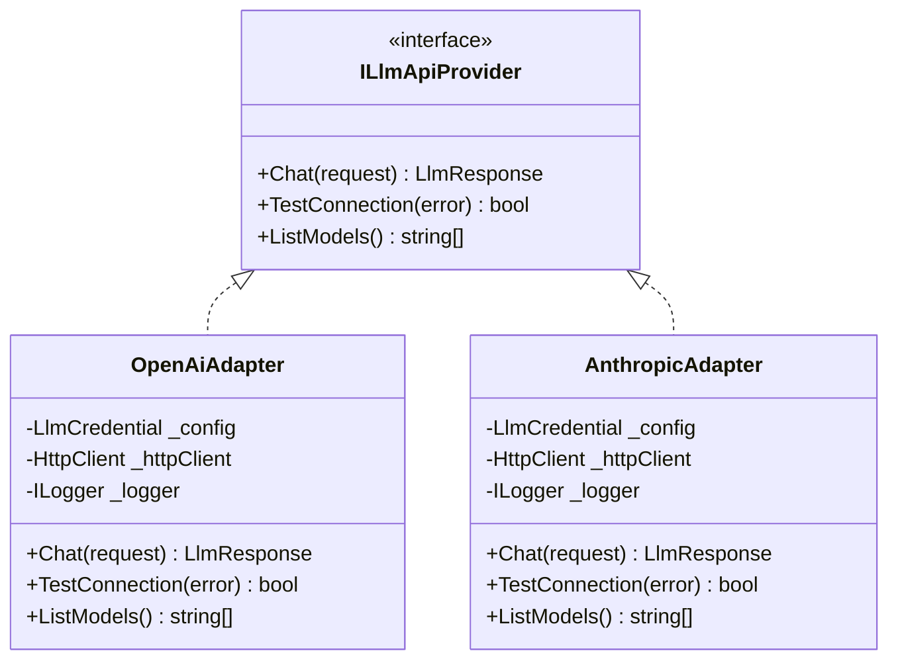
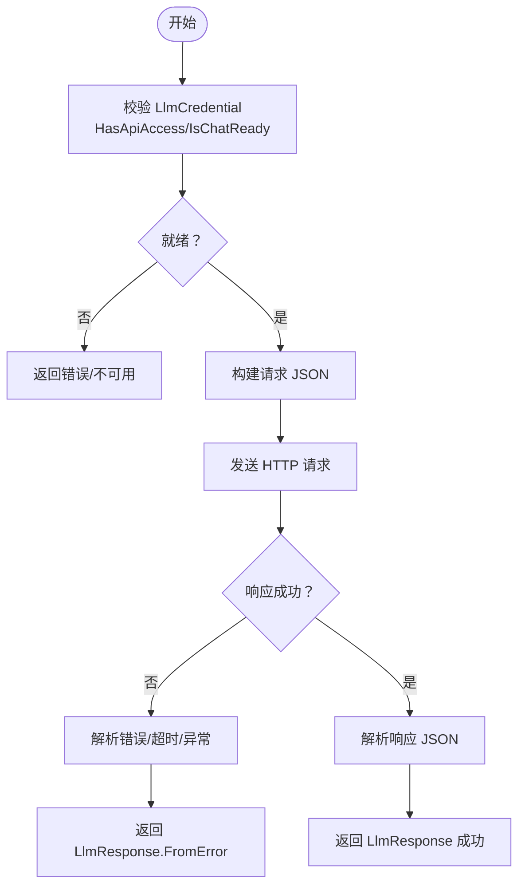
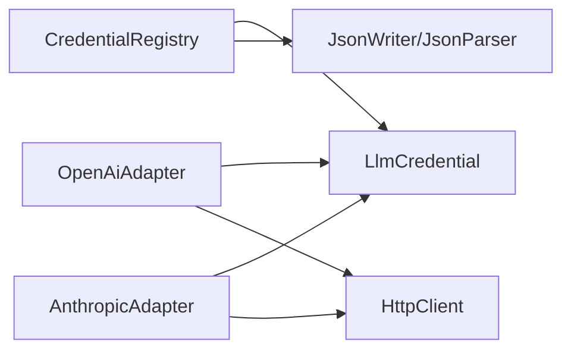

# 凭证管理系统

<cite>
**本文引用的文件**
- [LlmCredential.cs](file://ext/NPCLife/src/NPCLife/Framework/Llm/LlmCredential.cs)
- [CredentialRegistry.cs](file://ext/NPCLife/src/NPCLife/Infrastructure/Llm/CredentialRegistry.cs)
- [OpenAiAdapter.cs](file://ext/NPCLife/src/NPCLife/Infrastructure/Llm/OpenAiAdapter.cs)
- [AnthropicAdapter.cs](file://ext/NPCLife/src/NPCLife/Infrastructure/Llm/AnthropicAdapter.cs)
- [LlmConfig.cs](file://ext/NPCLife/src/NPCLife/Framework/Llm/LlmConfig.cs)
- [ICredentialManager.cs](file://ext/NPCLife/src/NPCLife/Core/ICredentialManager.cs)
- [ICredentialStore.cs](file://ext/NPCLife/src/NPCLife/Core/ICredentialStore.cs)
- [ILlmApiProvider.cs](file://ext/NPCLife/src/NPCLife/Core/ILlmApiProvider.cs)
- [LlmRequest.cs](file://ext/NPCLife/src/NPCLife/Framework/Llm/LlmRequest.cs)
</cite>

## 目录
1. [简介](#简介)
2. [项目结构](#项目结构)
3. [核心组件](#核心组件)
4. [架构总览](#架构总览)
5. [详细组件分析](#详细组件分析)
6. [依赖关系分析](#依赖关系分析)
7. [性能考量](#性能考量)
8. [故障排查指南](#故障排查指南)
9. [结论](#结论)
10. [附录](#附录)

## 简介
本文件系统性阐述凭证管理系统的实现与使用，重点覆盖以下方面：
- LlmCredential 的设计与功能：API 密钥管理、基础 URL 配置、模型名称设置、超时参数与校验逻辑。
- CredentialRegistry 的注册与管理机制：凭据的存储、检索、更新、删除、激活顺序与持久化。
- 凭证的安全存储策略与加密机制：当前实现采用明文 JSON 序列化，建议结合外部安全存储。
- 凭证的验证流程与错误处理：运行时校验、连接测试、异常捕获与降级。
- 多提供商凭据管理与切换机制：通过 ProviderType 选择适配器，支持 OpenAI 与 Anthropic。
- 凭证生命周期管理与自动清理：基于激活顺序与持久化策略的运行期行为。
- 最佳实践与安全建议：配置与使用的安全准则。

## 项目结构
凭证管理相关代码主要分布在以下模块：
- Framework 层：LlmCredential、LlmConfig、LlmRequest 等数据模型与配置。
- Core 接口层：ICredentialManager、ICredentialStore、ILlmApiProvider 定义抽象契约。
- Infrastructure 层：CredentialRegistry 实现凭据注册表；OpenAiAdapter、AnthropicAdapter 实现不同提供商的适配器。

图表来源
- [LlmCredential.cs:1-84](file://ext/NPCLife/src/NPCLife/Framework/Llm/LlmCredential.cs#L1-L84)
- [CredentialRegistry.cs:1-329](file://ext/NPCLife/src/NPCLife/Infrastructure/Llm/CredentialRegistry.cs#L1-L329)
- [OpenAiAdapter.cs:1-392](file://ext/NPCLife/src/NPCLife/Infrastructure/Llm/OpenAiAdapter.cs#L1-L392)
- [AnthropicAdapter.cs:1-434](file://ext/NPCLife/src/NPCLife/Infrastructure/Llm/AnthropicAdapter.cs#L1-L434)
- [LlmConfig.cs:1-69](file://ext/NPCLife/src/NPCLife/Framework/Llm/LlmConfig.cs#L1-L69)
- [ICredentialManager.cs:1-82](file://ext/NPCLife/src/NPCLife/Core/ICredentialManager.cs#L1-L82)
- [ICredentialStore.cs:1-32](file://ext/NPCLife/src/NPCLife/Core/ICredentialStore.cs#L1-L32)
- [ILlmApiProvider.cs:1-37](file://ext/NPCLife/src/NPCLife/Core/ILlmApiProvider.cs#L1-L37)

章节来源
- [LlmCredential.cs:1-84](file://ext/NPCLife/src/NPCLife/Framework/Llm/LlmCredential.cs#L1-L84)
- [CredentialRegistry.cs:1-329](file://ext/NPCLife/src/NPCLife/Infrastructure/Llm/CredentialRegistry.cs#L1-L329)
- [OpenAiAdapter.cs:1-392](file://ext/NPCLife/src/NPCLife/Infrastructure/Llm/OpenAiAdapter.cs#L1-L392)
- [AnthropicAdapter.cs:1-434](file://ext/NPCLife/src/NPCLife/Infrastructure/Llm/AnthropicAdapter.cs#L1-L434)
- [LlmConfig.cs:1-69](file://ext/NPCLife/src/NPCLife/Framework/Llm/LlmConfig.cs#L1-L69)
- [ICredentialManager.cs:1-82](file://ext/NPCLife/src/NPCLife/Core/ICredentialManager.cs#L1-L82)
- [ICredentialStore.cs:1-32](file://ext/NPCLife/src/NPCLife/Core/ICredentialStore.cs#L1-L32)
- [ILlmApiProvider.cs:1-37](file://ext/NPCLife/src/NPCLife/Core/ILlmApiProvider.cs#L1-L37)

## 核心组件
- LlmCredential：纯数据载体，包含基础 URL、API 密钥、模型名、提供商类型、扩展头与超时秒数，并提供 HasApiAccess、IsChatReady 等校验方法与 Clone 深拷贝能力。
- CredentialRegistry：实现 ICredentialManager/ICredentialStore，维护“凭证名 → 凭证”映射与激活顺序，提供 CRUD、激活/停用、按名解析与持久化。
- OpenAiAdapter/AnthropicAdapter：分别对接 OpenAI/兼容 API 与 Anthropic Messages API，负责 HTTP 请求构建、发送、响应解析与连接测试。
- LlmConfig：全局配置对象，提供默认值与 IsValid 校验，便于初始化与 UI 显示。
- 接口契约：ICredentialManager/ICredentialStore/ILlmApiProvider 定义了运行时与 UI 的职责边界与交互协议。

章节来源
- [LlmCredential.cs:12-82](file://ext/NPCLife/src/NPCLife/Framework/Llm/LlmCredential.cs#L12-L82)
- [CredentialRegistry.cs:19-329](file://ext/NPCLife/src/NPCLife/Infrastructure/Llm/CredentialRegistry.cs#L19-L329)
- [OpenAiAdapter.cs:18-392](file://ext/NPCLife/src/NPCLife/Infrastructure/Llm/OpenAiAdapter.cs#L18-L392)
- [AnthropicAdapter.cs:23-434](file://ext/NPCLife/src/NPCLife/Infrastructure/Llm/AnthropicAdapter.cs#L23-L434)
- [LlmConfig.cs:23-67](file://ext/NPCLife/src/NPCLife/Framework/Llm/LlmConfig.cs#L23-L67)
- [ICredentialManager.cs:11-82](file://ext/NPCLife/src/NPCLife/Core/ICredentialManager.cs#L11-L82)
- [ICredentialStore.cs:11-32](file://ext/NPCLife/src/NPCLife/Core/ICredentialStore.cs#L11-L32)
- [ILlmApiProvider.cs:12-37](file://ext/NPCLife/src/NPCLife/Core/ILlmApiProvider.cs#L12-L37)

## 架构总览
凭证管理的运行时流程如下：
- UI 通过 ICredentialManager 管理凭证（创建、更新、删除、激活顺序、模型设置）。
- 运行时 Agent 通过 ICredentialStore 获取“激活顺序 + 就绪状态”的凭证列表。
- 每个凭证被适配器根据 ProviderType 选择对应实现（OpenAI 或 Anthropic）。
- 适配器使用 LlmCredential 的 BaseUrl、ApiKey、ModelName、TimeoutSeconds、ExtraHeaders 构建 HTTP 请求并解析响应。

图表来源
- [CredentialRegistry.cs:57-228](file://ext/NPCLife/src/NPCLife/Infrastructure/Llm/CredentialRegistry.cs#L57-L228)
- [ICredentialStore.cs:17-29](file://ext/NPCLife/src/NPCLife/Core/ICredentialStore.cs#L17-L29)
- [OpenAiAdapter.cs:38-74](file://ext/NPCLife/src/NPCLife/Infrastructure/Llm/OpenAiAdapter.cs#L38-L74)
- [AnthropicAdapter.cs:43-68](file://ext/NPCLife/src/NPCLife/Infrastructure/Llm/AnthropicAdapter.cs#L43-L68)

## 详细组件分析

### LlmCredential 设计与功能
- 字段与职责
  - BaseUrl：API 基础地址，适配器会去除尾部斜杠并设置 HttpClient.BaseAddress。
  - ApiKey：认证密钥，OpenAI 使用 Authorization: Bearer，Anthropic 使用 x-api-key。
  - ModelName：模型标识，用于请求与 UI 显示。
  - ProviderType：决定使用 OpenAI 或 Anthropic 适配器。
  - ExtraHeaders：扩展 HTTP 头，用于代理或特殊网关场景。
  - TimeoutSeconds：请求超时（秒），默认 120。
- 校验逻辑
  - HasApiAccess：要求 BaseUrl 与 ApiKey 非空，适合连接测试与模型发现。
  - IsChatReady：在 HasApiAccess 基础上要求 ModelName 非空，适合对话请求。
  - Clone：浅拷贝字符串与字典引用，避免外部修改影响内部状态。
- 用途与约束
  - 无状态数据类，零外部依赖，不持有持久化状态。
  - 与 LlmConfig 的区别：LlmConfig 提供默认值与全局状态假设，LlmCredential 是纯数据传递对象。

章节来源
- [LlmCredential.cs:14-82](file://ext/NPCLife/src/NPCLife/Framework/Llm/LlmCredential.cs#L14-L82)

### CredentialRegistry 注册与管理机制
- 存储与并发
  - 内部使用 Dictionary<string, LlmCredential> 与 List<string> 维护激活顺序，键名不区分大小写。
  - 所有公共方法使用锁保护，确保线程安全。
- 运行时获取
  - GetActiveCredentials：按激活顺序遍历，仅返回 IsChatReady 的凭证副本。
  - HasCredentials：检查是否存在至少一个 HasApiAccess 的凭证。
  - Resolve：按名称获取凭证并可覆盖模型名后返回。
- CRUD 与模型设置
  - Create/Get/Update/Delete：对凭证进行增删改查，均进行参数校验与克隆保存。
  - SetModel：按名称更新模型名并持久化。
- 激活顺序与回退链
  - GetActivationOrder/SetActivationOrder/Activate/Deactivate：维护多提供商回退链，仅包含存在的凭证名。
- 持久化
  - Persist：序列化当前状态并调用外部持久化委托；失败不影响运行时。
  - SerializeState/DeserializeState：将凭证与激活顺序写入/解析 JSON，字段名兼容旧版本。

图表来源
- [CredentialRegistry.cs:19-329](file://ext/NPCLife/src/NPCLife/Infrastructure/Llm/CredentialRegistry.cs#L19-L329)
- [LlmCredential.cs:12-82](file://ext/NPCLife/src/NPCLife/Framework/Llm/LlmCredential.cs#L12-L82)

章节来源
- [CredentialRegistry.cs:57-228](file://ext/NPCLife/src/NPCLife/Infrastructure/Llm/CredentialRegistry.cs#L57-L228)

### 多提供商适配与切换机制
- ProviderType 决策
  - OpenAI：使用 OpenAiAdapter，请求路径为 /v1/chat/completions，支持 /v1/models 查询与最小请求连通性测试。
  - Anthropic：使用 AnthropicAdapter，请求路径为 /v1/messages，使用 x-api-key 与特定版本头。
- 适配器内部细节
  - OpenAiAdapter：构建 OpenAI 格式请求，解析 choices/message/content/tool_calls，统计 usage。
  - AnthropicAdapter：构建 Anthropic 格式请求，处理 system 顶层字段、content 数组与 tool_use 块，解析 stop_reason 并映射 finish_reason。
- 超时与头部
  - 两者均使用 LlmCredential.TimeoutSeconds 设置 HttpClient.Timeout。
  - OpenAI 使用 Authorization: Bearer，Anthropic 使用 x-api-key 与 anthropic-version。

图表来源
- [ILlmApiProvider.cs:12-37](file://ext/NPCLife/src/NPCLife/Core/ILlmApiProvider.cs#L12-L37)
- [OpenAiAdapter.cs:18-392](file://ext/NPCLife/src/NPCLife/Infrastructure/Llm/OpenAiAdapter.cs#L18-L392)
- [AnthropicAdapter.cs:23-434](file://ext/NPCLife/src/NPCLife/Infrastructure/Llm/AnthropicAdapter.cs#L23-L434)

章节来源
- [OpenAiAdapter.cs:18-177](file://ext/NPCLife/src/NPCLife/Infrastructure/Llm/OpenAiAdapter.cs#L18-L177)
- [AnthropicAdapter.cs:23-133](file://ext/NPCLife/src/NPCLife/Infrastructure/Llm/AnthropicAdapter.cs#L23-L133)

### 凭证生命周期与自动清理
- 生命周期阶段
  - 创建：Create(name, credential) 将凭证克隆并入库，随后持久化。
  - 激活：SetActivationOrder/Activate/Deactivate 维护回退链，GetActiveCredentials 仅返回 IsChatReady 的凭证副本。
  - 更新：Update/SetModel 修改后立即持久化。
  - 删除：Delete 移除凭证与激活项，随后持久化。
- 自动清理
  - 运行时不会自动清理无效凭证；若凭证不再 IsChatReady，将不会出现在 GetActiveCredentials 结果中。
  - 激活顺序中不存在的名称会被 SetActivationOrder 过滤，避免悬挂引用。

章节来源
- [CredentialRegistry.cs:97-228](file://ext/NPCLife/src/NPCLife/Infrastructure/Llm/CredentialRegistry.cs#L97-L228)

### 凭证验证流程与错误处理
- 运行时校验
  - LlmCredential.HasApiAccess：用于连接测试与模型发现。
  - LlmCredential.IsChatReady：用于对话请求前的完整校验。
  - LlmRequest.IsValid：确保 Model 与 Messages 非空。
- 连接测试
  - OpenAiAdapter.TestConnection：先尝试 /v1/models，失败则发送最小聊天请求。
  - AnthropicAdapter.TestConnection：直接发送最小请求。
- 异常处理
  - HTTP 请求异常、超时、解析异常均被捕获并封装为 LlmResponse.FromError。
  - 持久化失败被吞掉，不影响运行时。

图表来源
- [LlmCredential.cs:36-49](file://ext/NPCLife/src/NPCLife/Framework/Llm/LlmCredential.cs#L36-L49)
- [OpenAiAdapter.cs:79-112](file://ext/NPCLife/src/NPCLife/Infrastructure/Llm/OpenAiAdapter.cs#L79-L112)
- [AnthropicAdapter.cs:70-92](file://ext/NPCLife/src/NPCLife/Infrastructure/Llm/AnthropicAdapter.cs#L70-L92)
- [LlmRequest.cs:26-31](file://ext/NPCLife/src/NPCLife/Framework/Llm/LlmRequest.cs#L26-L31)

章节来源
- [LlmCredential.cs:36-49](file://ext/NPCLife/src/NPCLife/Framework/Llm/LlmCredential.cs#L36-L49)
- [OpenAiAdapter.cs:38-74](file://ext/NPCLife/src/NPCLife/Infrastructure/Llm/OpenAiAdapter.cs#L38-L74)
- [AnthropicAdapter.cs:43-68](file://ext/NPCLife/src/NPCLife/Infrastructure/Llm/AnthropicAdapter.cs#L43-L68)
- [LlmRequest.cs:26-43](file://ext/NPCLife/src/NPCLife/Framework/Llm/LlmRequest.cs#L26-L43)

### 凭证安全存储策略与加密机制
- 当前实现
  - 凭证以 JSON 形式序列化并持久化，字段包含 baseUrl、apiKey、modelName、providerType、timeoutSeconds 等。
  - 未内置加密，属于明文存储。
- 安全建议
  - 结合外部安全存储（如操作系统密钥库、环境变量注入、受控文件权限）。
  - 在 UI 层对敏感字段进行掩码显示与输入限制。
  - 严格控制持久化委托的访问范围与日志输出，避免泄露 JSON。

章节来源
- [CredentialRegistry.cs:251-326](file://ext/NPCLife/src/NPCLife/Infrastructure/Llm/CredentialRegistry.cs#L251-L326)

### 凭证配置与使用示例（路径指引）
- 创建与更新凭证
  - 创建：[CredentialRegistry.Create:97-111](file://ext/NPCLife/src/NPCLife/Infrastructure/Llm/CredentialRegistry.cs#L97-L111)
  - 更新：[CredentialRegistry.Update:123-137](file://ext/NPCLife/src/NPCLife/Infrastructure/Llm/CredentialRegistry.cs#L123-L137)
- 设置激活顺序与模型
  - 激活顺序：[CredentialRegistry.SetActivationOrder:179-188](file://ext/NPCLife/src/NPCLife/Infrastructure/Llm/CredentialRegistry.cs#L179-L188)
  - 模型设置：[CredentialRegistry.SetModel:214-228](file://ext/NPCLife/src/NPCLife/Infrastructure/Llm/CredentialRegistry.cs#L214-L228)
- 运行时获取与解析
  - 获取活跃凭证：[ICredentialStore.GetActiveCredentials:17-17](file://ext/NPCLife/src/NPCLife/Core/ICredentialStore.cs#L17-L17)
  - 按名解析：[ICredentialStore.Resolve:29-29](file://ext/NPCLife/src/NPCLife/Core/ICredentialStore.cs#L29-L29)
- 发起对话请求
  - 构造请求：[LlmRequest.SinglePrompt:36-43](file://ext/NPCLife/src/NPCLife/Framework/Llm/LlmRequest.cs#L36-L43)
  - 发送请求：[OpenAiAdapter.Chat:38-74](file://ext/NPCLife/src/NPCLife/Infrastructure/Llm/OpenAiAdapter.cs#L38-L74) / [AnthropicAdapter.Chat:43-68](file://ext/NPCLife/src/NPCLife/Infrastructure/Llm/AnthropicAdapter.cs#L43-L68)

章节来源
- [CredentialRegistry.cs:97-228](file://ext/NPCLife/src/NPCLife/Infrastructure/Llm/CredentialRegistry.cs#L97-L228)
- [ICredentialStore.cs:17-29](file://ext/NPCLife/src/NPCLife/Core/ICredentialStore.cs#L17-L29)
- [LlmRequest.cs:36-43](file://ext/NPCLife/src/NPCLife/Framework/Llm/LlmRequest.cs#L36-L43)
- [OpenAiAdapter.cs:38-74](file://ext/NPCLife/src/NPCLife/Infrastructure/Llm/OpenAiAdapter.cs#L38-L74)
- [AnthropicAdapter.cs:43-68](file://ext/NPCLife/src/NPCLife/Infrastructure/Llm/AnthropicAdapter.cs#L43-L68)

## 依赖关系分析
- 组件耦合
  - CredentialRegistry 依赖 LlmCredential 与 JSON 工具（JsonWriter/JsonParser），并通过外部委托完成持久化。
  - 适配器依赖 LlmCredential 的字段与 HttpClient，不依赖具体存储。
  - Agent 仅依赖 ICredentialStore，不感知 UI 管理接口。
- 外部依赖
  - System.Net.Http 用于 HTTP 通信。
  - JSON 序列化/反序列化用于持久化与请求/响应构建。

图表来源
- [CredentialRegistry.cs:251-326](file://ext/NPCLife/src/NPCLife/Infrastructure/Llm/CredentialRegistry.cs#L251-L326)
- [OpenAiAdapter.cs:149-200](file://ext/NPCLife/src/NPCLife/Infrastructure/Llm/OpenAiAdapter.cs#L149-L200)
- [AnthropicAdapter.cs:106-146](file://ext/NPCLife/src/NPCLife/Infrastructure/Llm/AnthropicAdapter.cs#L106-L146)

章节来源
- [CredentialRegistry.cs:251-326](file://ext/NPCLife/src/NPCLife/Infrastructure/Llm/CredentialRegistry.cs#L251-L326)
- [OpenAiAdapter.cs:149-200](file://ext/NPCLife/src/NPCLife/Infrastructure/Llm/OpenAiAdapter.cs#L149-L200)
- [AnthropicAdapter.cs:106-146](file://ext/NPCLife/src/NPCLife/Infrastructure/Llm/AnthropicAdapter.cs#L106-L146)

## 性能考量
- 线程安全与锁粒度
  - 所有公共方法使用细粒度锁，避免长时间持锁导致阻塞。
- 序列化与反序列化
  - SerializeState/DeserializeState 使用流式写入，减少内存峰值。
- HTTP 超时
  - 适配器以 TimeoutSeconds 设置 HttpClient.Timeout，避免长时间等待。
- 激活顺序遍历
  - GetActiveCredentials 按激活顺序线性遍历，顺序数量有限，开销可接受。

## 故障排查指南
- 常见问题与定位
  - 无法连接：检查 BaseUrl 与 ApiKey 是否正确；使用 TestConnection 获取错误详情。
  - 请求超时：增大 TimeoutSeconds；检查网络与代理设置。
  - 模型不可用：确认模型名正确且提供商支持该模型；使用 ListModels 获取可用列表（OpenAI 支持）。
  - 凭证未生效：确认凭证处于激活顺序中且 IsChatReady；检查 ExtraHeaders 是否冲突。
- 日志与调试
  - 适配器在关键节点输出请求/响应摘要日志，便于快速定位问题。
- 持久化失败
  - 持久化异常被吞掉，不影响运行时；可通过调试模式查看序列化结果。

章节来源
- [OpenAiAdapter.cs:79-112](file://ext/NPCLife/src/NPCLife/Infrastructure/Llm/OpenAiAdapter.cs#L79-L112)
- [AnthropicAdapter.cs:70-92](file://ext/NPCLife/src/NPCLife/Infrastructure/Llm/AnthropicAdapter.cs#L70-L92)
- [CredentialRegistry.cs:234-249](file://ext/NPCLife/src/NPCLife/Infrastructure/Llm/CredentialRegistry.cs#L234-L249)

## 结论
凭证管理系统通过清晰的数据模型与接口契约实现了多提供商的统一接入与灵活管理。LlmCredential 提供简洁稳定的凭据载体，CredentialRegistry 提供完善的注册与持久化能力，适配器层屏蔽了不同提供商的差异。建议在生产环境中结合外部安全存储与严格的权限控制，进一步提升安全性与可靠性。

## 附录
- 最佳实践与安全建议
  - 使用强密码学安全的密钥存储服务，避免明文落盘。
  - 限制凭证的可见范围与操作权限，遵循最小权限原则。
  - 在 UI 层对敏感字段进行掩码显示与输入校验。
  - 定期轮换 API 密钥，启用审计日志追踪变更。
  - 对持久化 JSON 进行完整性校验与备份恢复演练。