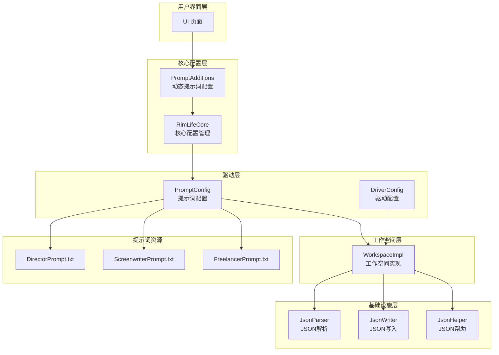
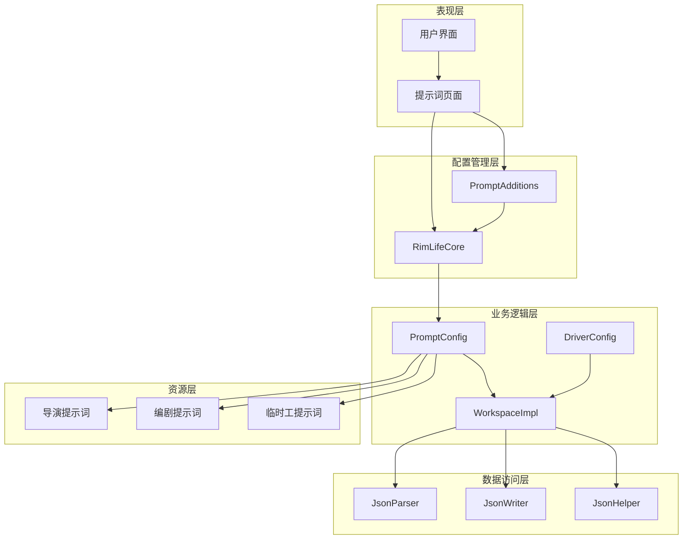
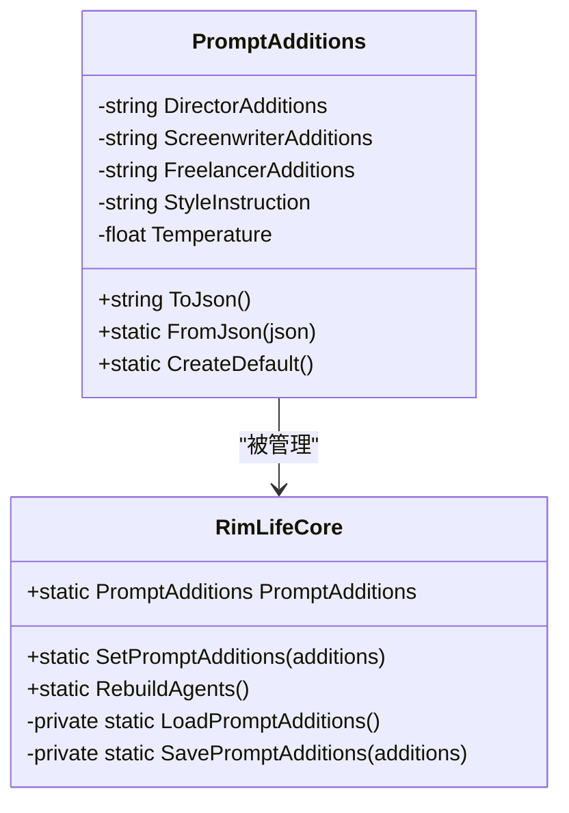
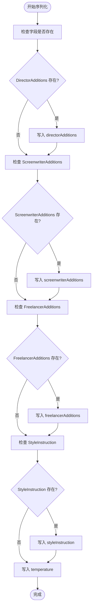
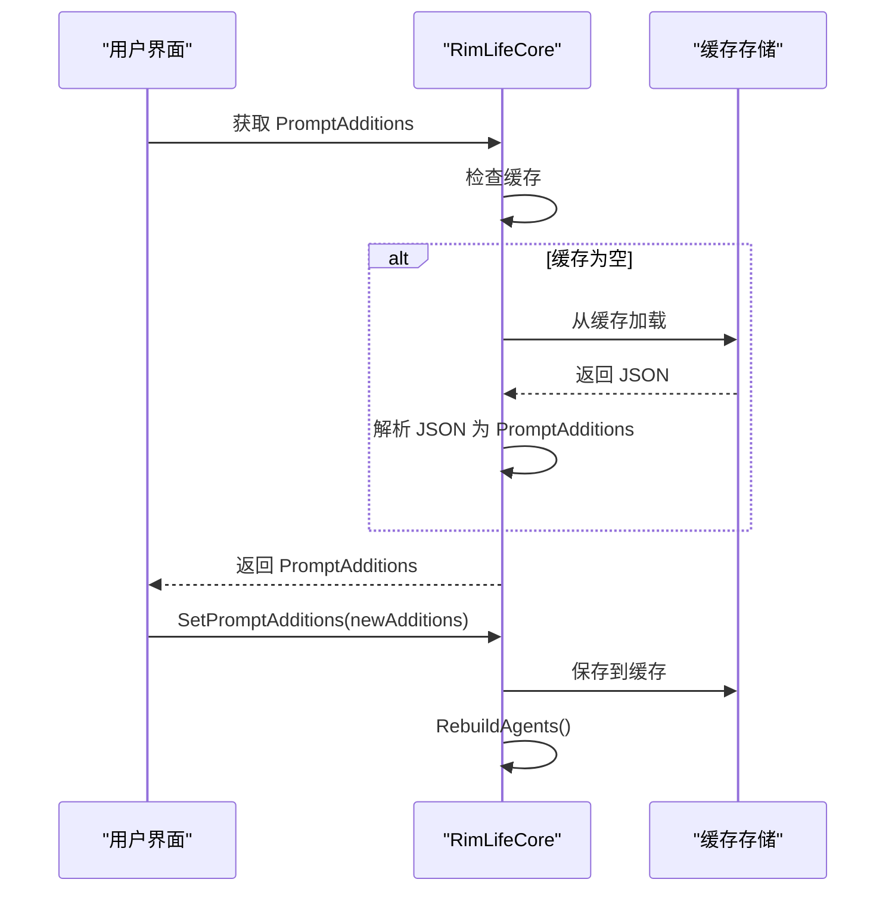
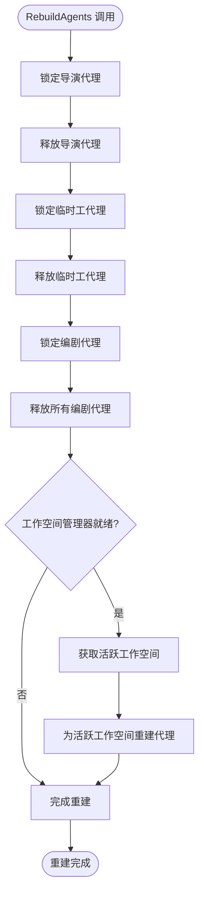
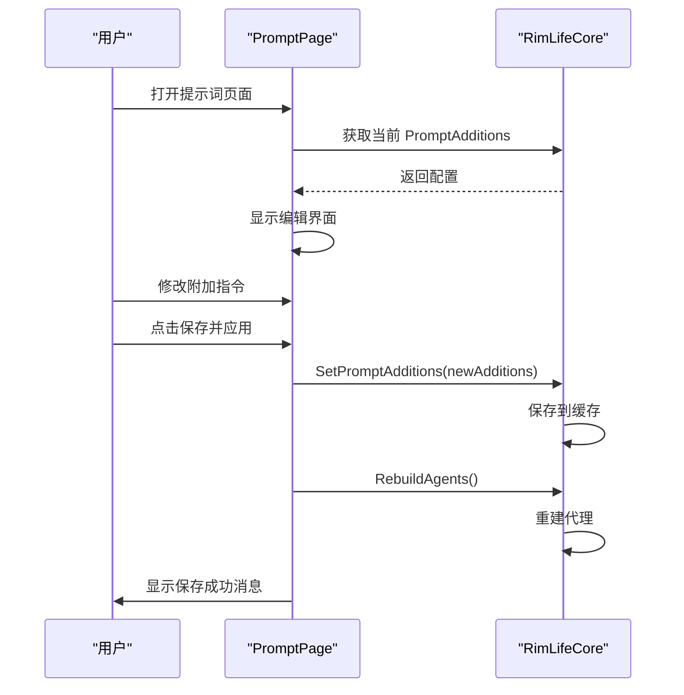
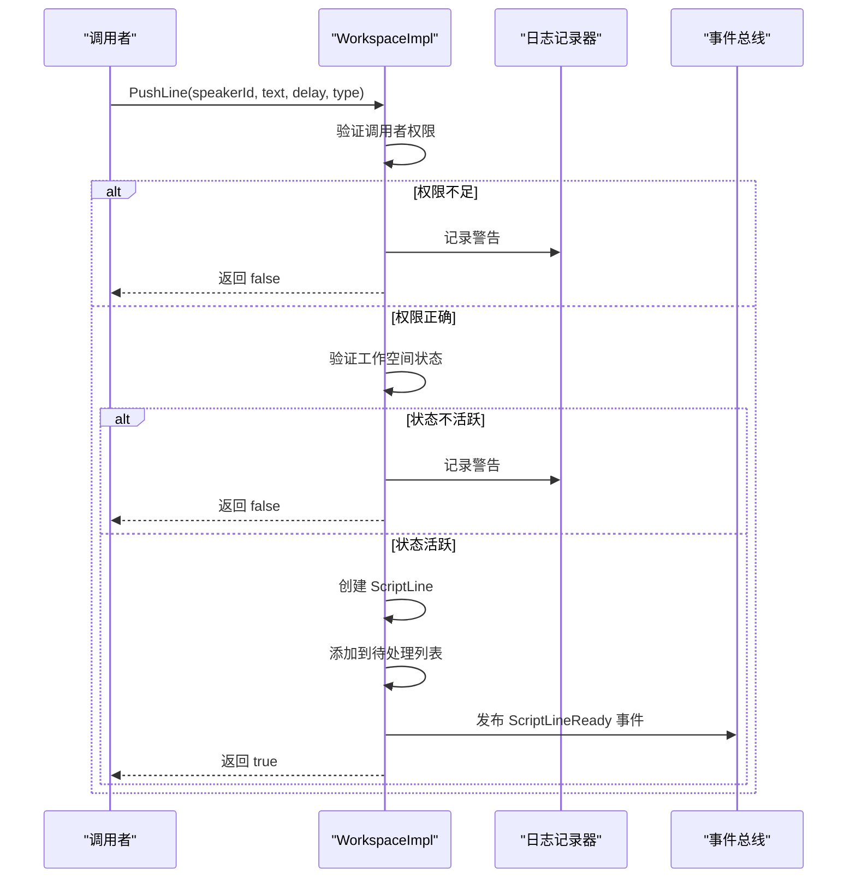
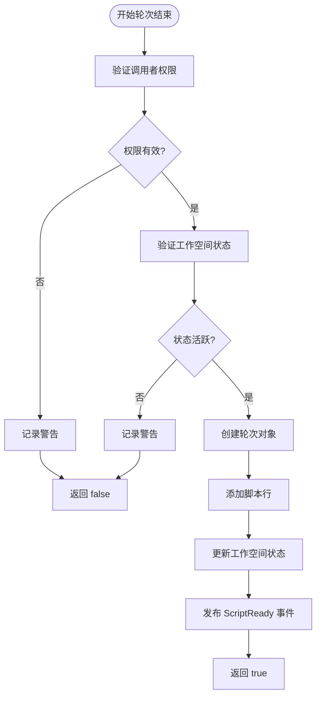
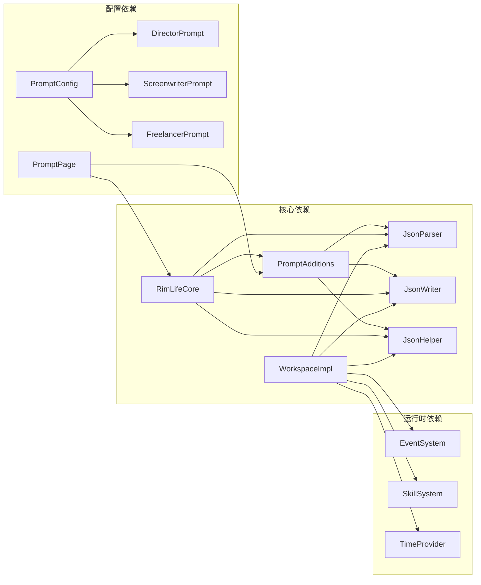

# 提示词管理系统

<cite>
**本文档引用的文件**
- [PromptAdditions.cs](file://Source/Infrastructure/PromptAdditions.cs)
- [RimLifeCore.cs](file://Source/Infrastructure/RimLifeCore.cs)
- [PromptPage.cs](file://Source/UI/Pages/PromptPage.cs)
- [DirectorPrompt.txt](file://ext/NPCLife/src/NPCLife/Prompts/DirectorPrompt.txt)
- [ScreenwriterPrompt.txt](file://ext/NPCLife/src/NPCLife/Prompts/ScreenwriterPrompt.txt)
- [FreelancerPrompt.txt](file://ext/NPCLife/src/NPCLife/Prompts/FreelancerPrompt.txt)
- [JsonHelper.cs](file://ext/NPCLife/src/NPCLife/Framework/JsonHelper.cs)
- [JsonParser.cs](file://ext/NPCLife/src/NPCLife/Framework/JsonParser.cs)
- [JsonWriter.cs](file://ext/NPCLife/src/NPCLife/Framework/JsonWriter.cs)
- [WorkspaceImpl.cs](file://ext/NPCLife/src/NPCLife/Workspace/WorkspaceImpl.cs)
- [PromptConfig.cs](file://ext/NPCLife/src/NPCLife/Driver/PromptConfig.cs)
- [DriverConfig.cs](file://ext/NPCLife/src/NPCLife/Driver/DriverConfig.cs)
</cite>

## 更新摘要
**所做更改**
- 更新架构概览以反映从静态提示词文件到动态 PromptAdditions 系统的重构
- 新增 PromptAdditions 类的详细说明和使用模式
- 更新提示词管理流程以体现新的动态配置机制
- 移除对静态提示词文件的依赖说明
- 新增基于 UI 的提示词编辑和持久化流程

## 目录
1. [简介](#简介)
2. [项目结构](#项目结构)
3. [核心组件](#核心组件)
4. [架构概览](#架构概览)
5. [详细组件分析](#详细组件分析)
6. [依赖关系分析](#依赖关系分析)
7. [性能考虑](#性能考虑)
8. [故障排除指南](#故障排除指南)
9. [结论](#结论)
10. [附录](#附录)

## 简介
本系统是一个基于 RimWorld 的 NPC 剧情生成框架，专注于提示词管理与 LLM 采样控制。系统通过三个核心角色实现分层叙事：导演（Director）负责事件路由与剧情规划，编剧（Screenwriter）负责具体场景的台词创作，临时工（Freelancer）负责突发性事件的即时响应。系统现已重构为基于 PromptAdditions 的动态配置系统，支持运行时的提示词编辑和参数调整。

## 项目结构
系统采用模块化设计，主要分为以下几个层次：



**图表来源**
- [PromptAdditions.cs:1-70](file://Source/Infrastructure/PromptAdditions.cs#L1-L70)
- [RimLifeCore.cs:87-120](file://Source/Infrastructure/RimLifeCore.cs#L87-L120)
- [PromptPage.cs:120-180](file://Source/UI/Pages/PromptPage.cs#L120-180)

**章节来源**
- [PromptAdditions.cs:1-70](file://Source/Infrastructure/PromptAdditions.cs#L1-L70)
- [RimLifeCore.cs:87-120](file://Source/Infrastructure/RimLifeCore.cs#L87-L120)
- [PromptPage.cs:120-180](file://Source/UI/Pages/PromptPage.cs#L120-180)

## 核心组件
系统的核心由四个主要组件构成：

### PromptAdditions - 动态提示词配置
负责管理游戏侧的附加提示词配置，包括角色专用附加指令和全局风格指令。

### RimLifeCore - 核心配置管理
提供统一的配置入口，管理 PromptAdditions 的加载、保存和重建机制。

### PromptConfig - 提示词配置管理
负责管理 NPCLife 基础身份的提示词配置，保持不可编辑的基础身份。

### DriverConfig - 驱动配置管理  
控制事件池触发阈值、定时器脉冲等运行时参数。

**章节来源**
- [PromptAdditions.cs:11-68](file://Source/Infrastructure/PromptAdditions.cs#L11-L68)
- [RimLifeCore.cs:90-115](file://Source/Infrastructure/RimLifeCore.cs#L90-L115)
- [PromptConfig.cs:14-162](file://ext/NPCLife/src/NPCLife/Driver/PromptConfig.cs#L14-L162)
- [DriverConfig.cs:9-105](file://ext/NPCLife/src/NPCLife/Driver/DriverConfig.cs#L9-L105)

## 架构概览
系统采用分层架构设计，确保职责分离和可扩展性。新的架构通过 PromptAdditions 实现动态配置管理：



**图表来源**
- [PromptPage.cs:120-180](file://Source/UI/Pages/PromptPage.cs#L120-180)
- [RimLifeCore.cs:90-115](file://Source/Infrastructure/RimLifeCore.cs#L90-L115)
- [PromptAdditions.cs:11-68](file://Source/Infrastructure/PromptAdditions.cs#L11-L68)

## 详细组件分析

### PromptAdditions 组件深度分析

#### 数据结构与属性
PromptAdditions 采用纯 POCO 设计，包含以下关键属性：



**图表来源**
- [PromptAdditions.cs:11-68](file://Source/Infrastructure/PromptAdditions.cs#L11-L68)
- [RimLifeCore.cs:90-115](file://Source/Infrastructure/RimLifeCore.cs#L90-L115)

#### JSON 序列化与反序列化
系统实现了完整的 JSON 序列化机制，支持配置的持久化和恢复：



**图表来源**
- [PromptAdditions.cs:28-41](file://Source/Infrastructure/PromptAdditions.cs#L28-L41)

**章节来源**
- [PromptAdditions.cs:11-68](file://Source/Infrastructure/PromptAdditions.cs#L11-L68)

### RimLifeCore 配置管理

#### PromptAdditions 属性管理
RimLifeCore 提供了完整的 PromptAdditions 生命周期管理：



**图表来源**
- [RimLifeCore.cs:90-115](file://Source/Infrastructure/RimLifeCore.cs#L90-L115)
- [RimLifeCore.cs:883-908](file://Source/Infrastructure/RimLifeCore.cs#L883-L908)

#### 代理重建机制
修改配置后需要重建代理以应用新设置：



**图表来源**
- [RimLifeCore.cs:914-946](file://Source/Infrastructure/RimLifeCore.cs#L914-L946)

**章节来源**
- [RimLifeCore.cs:90-115](file://Source/Infrastructure/RimLifeCore.cs#L90-L115)
- [RimLifeCore.cs:883-908](file://Source/Infrastructure/RimLifeCore.cs#L883-L908)
- [RimLifeCore.cs:914-946](file://Source/Infrastructure/RimLifeCore.cs#L914-L946)

### PromptPage 用户界面

#### 提示词编辑流程
用户界面提供了完整的提示词编辑功能：



**图表来源**
- [PromptPage.cs:120-180](file://Source/UI/Pages/PromptPage.cs#L120-180)

**章节来源**
- [PromptPage.cs:120-180](file://Source/UI/Pages/PromptPage.cs#L120-180)

### 角色专用提示词模板

#### 导演 Agent 提示词
导演负责整体剧情规划和事件路由，其提示词强调：
- 事件审查与筛选
- 剧情线选择与路由
- 工作空间管理（创建、分支、合并）

#### 编剧 Agent 提示词  
编剧专注于具体场景的创作，要求：
- 事件上下文获取
- 台词逐句创作
- 轮次总结与收尾
- 与导演的协作沟通

#### 临时工 Agent 提示词
临时工处理突发性事件，特点：
- 独立任务处理
- 即时响应能力
- 轻快叙事风格
- 事件重新路由

**章节来源**
- [DirectorPrompt.txt:1-18](file://ext/NPCLife/src/NPCLife/Prompts/DirectorPrompt.txt#L1-L18)
- [ScreenwriterPrompt.txt:1-17](file://ext/NPCLife/src/NPCLife/Prompts/ScreenwriterPrompt.txt#L1-L17)
- [FreelancerPrompt.txt:1-18](file://ext/NPCLife/src/NPCLife/Prompts/FreelancerPrompt.txt#L1-L18)

### JSON 处理工具链

#### JsonParser - JSON 解析器
提供了轻量级的 JSON 解析功能，支持：
- 对象字典解析
- 嵌套结构处理
- 字符串反转义
- 数组解析

#### JsonWriter - JSON 写入器  
实现了高效的 JSON 序列化：
- 最小化内存分配
- 类型安全的属性写入
- 原始 JSON 值支持
- 批量数组写入

#### JsonHelper - JSON 辅助工具
提供字符串转义和引用功能：
- 特殊字符转义
- Unicode 处理
- JSON 标准兼容

**章节来源**
- [JsonParser.cs:13-267](file://ext/NPCLife/src/NPCLife/Framework/JsonParser.cs#L13-L267)
- [JsonWriter.cs:11-135](file://ext/NPCLife/src/NPCLife/Framework/JsonWriter.cs#L11-L135)
- [JsonHelper.cs:8-53](file://ext/NPCLife/src/NPCLife/Framework/JsonHelper.cs#L8-L53)

### 工作空间操作流程

#### 台词推送机制
工作空间实现了严格的台词推送控制：



**图表来源**
- [WorkspaceImpl.cs:85-125](file://ext/NPCLife/src/NPCLife/Workspace/WorkspaceImpl.cs#L85-L125)

#### 轮次结束流程
轮次结束时执行完整的收尾操作：



**图表来源**
- [WorkspaceImpl.cs:127-184](file://ext/NPCLife/src/NPCLife/Workspace/WorkspaceImpl.cs#L127-L184)

**章节来源**
- [WorkspaceImpl.cs:85-184](file://ext/NPCLife/src/NPCLife/Workspace/WorkspaceImpl.cs#L85-L184)

## 依赖关系分析

### 组件耦合度分析
系统采用松耦合设计，主要依赖关系如下：



**图表来源**
- [PromptAdditions.cs:1-70](file://Source/Infrastructure/PromptAdditions.cs#L1-L70)
- [RimLifeCore.cs:87-120](file://Source/Infrastructure/RimLifeCore.cs#L87-L120)
- [PromptPage.cs:120-180](file://Source/UI/Pages/PromptPage.cs#L120-180)

### 外部依赖与集成点
系统尽量减少外部依赖，仅使用必要的 .NET 基础类库：
- System.IO - 文件流操作
- System.Reflection - 嵌入式资源访问
- System.Text - 字符编码处理
- System.Collections.Generic - 泛型集合

**章节来源**
- [PromptAdditions.cs:1-70](file://Source/Infrastructure/PromptAdditions.cs#L1-L70)
- [JsonParser.cs:1-5](file://ext/NPCLife/src/NPCLife/Framework/JsonParser.cs#L1-L5)

## 性能考虑
系统在设计时充分考虑了性能优化：

### 内存管理
- 使用 StringBuilder 减少字符串拼接开销
- JsonWriter 采用结构体避免堆分配
- PromptAdditions 的懒加载机制减少初始化时间

### 缓存策略
- PromptAdditions 内容缓存在静态字段中
- 避免重复的文件读取操作
- 基于缓存存储的高效访问

### 序列化优化
- 批量写入减少内存分配
- 条件属性写入避免空值处理
- 类型安全的数值格式化

## 故障排除指南

### 常见问题诊断
1. **提示词配置加载失败**
   - 检查缓存存储是否正常工作
   - 验证 JSON 格式是否正确
   - 查看异常信息确认具体错误原因

2. **代理重建失败**
   - 检查配置验证是否通过
   - 验证工作空间管理器状态
   - 确认代理实例是否正确释放

3. **UI 编辑功能异常**
   - 检查 PromptAdditions 属性绑定
   - 验证保存按钮事件处理
   - 确认状态消息显示正常

**章节来源**
- [RimLifeCore.cs:883-908](file://Source/Infrastructure/RimLifeCore.cs#L883-L908)
- [PromptPage.cs:120-180](file://Source/UI/Pages/PromptPage.cs#L120-180)

## 结论
本提示词管理系统通过精心设计的分层架构和模块化组件，实现了灵活而高效的 NPC 剧情生成能力。系统的主要优势包括：

1. **动态配置管理** - 基于 PromptAdditions 的运行时配置修改能力
2. **清晰的职责分离** - 不同角色拥有专门的提示词模板
3. **强大的配置管理** - 支持动态修改和持久化存储
4. **高性能的实现** - 优化的内存管理和序列化机制
5. **良好的扩展性** - 模块化设计便于功能扩展

通过合理的提示词工程实践和持续的调优，系统能够为 RimWorld 游戏提供丰富而连贯的叙事体验。

## 附录

### 提示词配置模板
以下是最小化的配置模板示例：

```json
{
  "directorAdditions": "导演专用附加提示词内容",
  "screenwriterAdditions": "编剧专用附加提示词内容", 
  "freelancerAdditions": "临时工专用附加提示词内容",
  "styleInstruction": "全局风格指令",
  "temperature": 0.7
}
```

### 最佳实践建议
1. **提示词编写原则**
   - 明确角色职责边界
   - 提供具体的行动指导
   - 包含适当的约束条件

2. **参数调优策略**
   - Temperature: 0.3-0.7 适合剧情创作，0.7-1.0 适合创意探索
   - 结合具体场景调整采样策略
   - 定期评估生成质量进行微调

3. **版本管理建议**
   - 基于 Git 进行版本控制
   - 为重大修改创建分支
   - 保留历史配置以便回溯

4. **动态配置使用建议**
   - 修改后记得点击"保存并应用"
   - 配置变更需要重建代理才能生效
   - 建议先测试再大规模应用