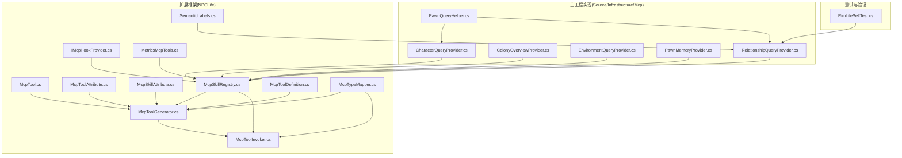
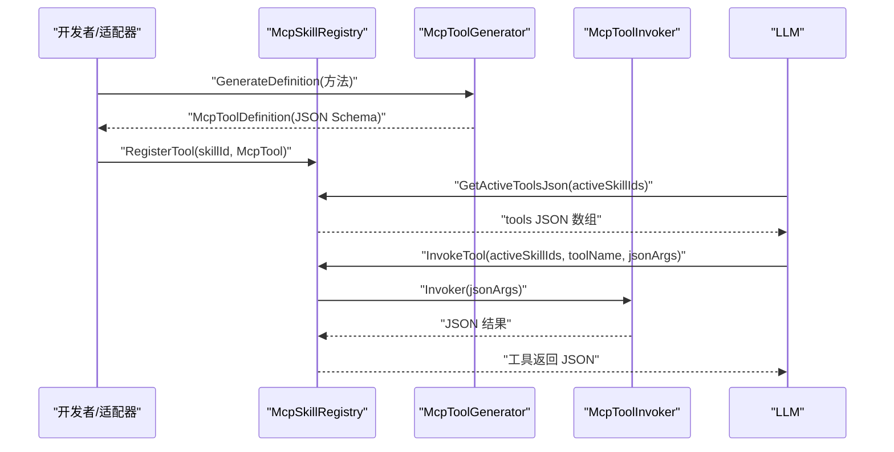
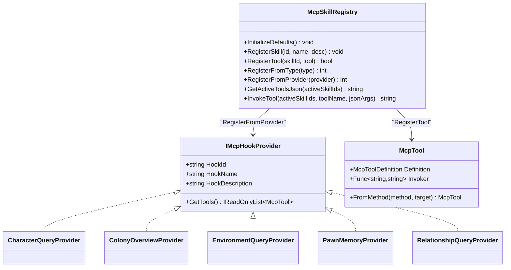
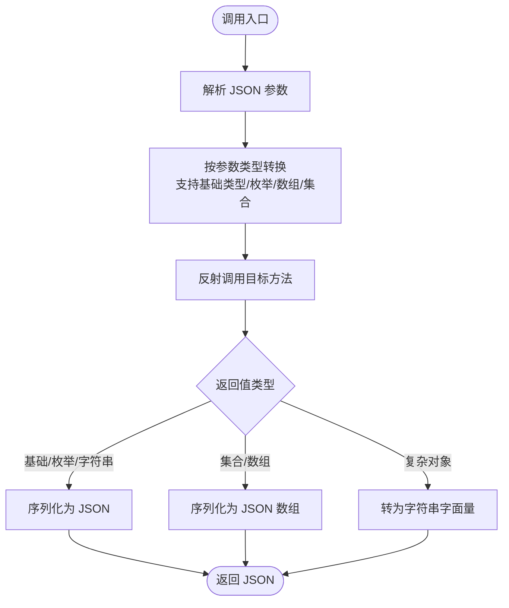
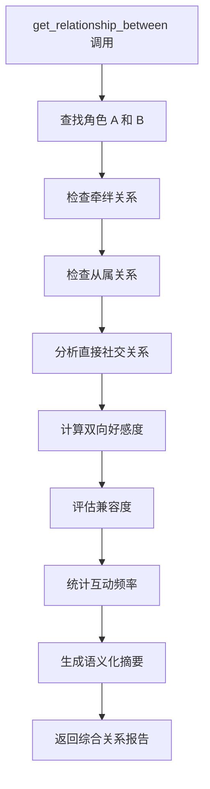
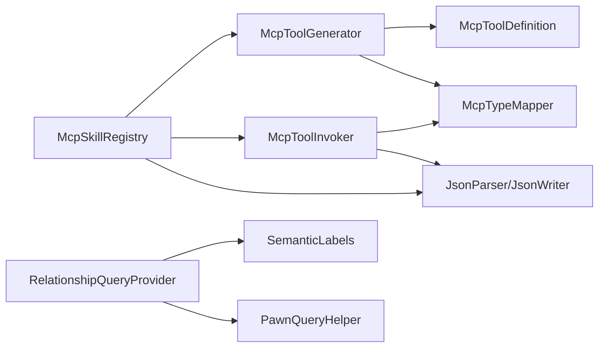

# MCP 工具协议

<cite>
**本文引用的文件**
- [IMcpHookProvider.cs](file://ext\NPCLife\src\NPCLife\Framework\Mcp\IMcpHookProvider.cs)
- [McpTool.cs](file://ext\NPCLife\src\NPCLife\Framework\Mcp\McpTool.cs)
- [McpToolAttribute.cs](file://ext\NPCLife\src\NPCLife\Framework\Mcp\McpToolAttribute.cs)
- [McpSkillAttribute.cs](file://ext\NPCLife\src\NPCLife\Framework\Mcp\McpSkillAttribute.cs)
- [McpSkillRegistry.cs](file://ext\NPCLife\src\NPCLife\Framework\Mcp\McpSkillRegistry.cs)
- [McpToolDefinition.cs](file://ext\NPCLife\src\NPCLife\Framework\Mcp\McpToolDefinition.cs)
- [McpToolGenerator.cs](file://ext\NPCLife\src\NPCLife\Framework\Mcp\McpToolGenerator.cs)
- [McpToolInvoker.cs](file://ext\NPCLife\src\NPCLife\Framework\Mcp\McpToolInvoker.cs)
- [McpTypeMapper.cs](file://ext\NPCLife\src\NPCLife\Framework\Mcp\McpTypeMapper.cs)
- [MetricsMcpTools.cs](file://ext\NPCLife\src\NPCLife\Framework\Mcp\MetricsMcpTools.cs)
- [CharacterQueryProvider.cs](file://Source\Infrastructure\Mcp\CharacterQueryProvider.cs)
- [ColonyOverviewProvider.cs](file://Source\Infrastructure\Mcp\ColonyOverviewProvider.cs)
- [EnvironmentQueryProvider.cs](file://Source\Infrastructure\Mcp\EnvironmentQueryProvider.cs)
- [PawnMemoryProvider.cs](file://Source\Infrastructure\Mcp\PawnMemoryProvider.cs)
- [RelationshipQueryProvider.cs](file://Source\Infrastructure\Mcp\RelationshipQueryProvider.cs)
- [PawnQueryHelper.cs](file://Source\Infrastructure\Mcp\PawnQueryHelper.cs)
- [SemanticLabels.cs](file://ext\NPCLife\src\NPCLife\Framework\SemanticLabels.cs)
- [RimLifeSelfTest.cs](file://Source\Tool\RimLifeSelfTest.cs)
</cite>

## 更新摘要
**变更内容**
- 新增关系查询工具的双向关系分析功能
- 添加 `get_relationship_between` 工具的详细文档
- 更新关系查询工具的架构图和使用示例
- 增强关系查询工具的综合分析能力说明

## 目录
1. [简介](#简介)
2. [项目结构](#项目结构)
3. [核心组件](#核心组件)
4. [架构总览](#架构总览)
5. [详细组件分析](#详细组件分析)
6. [依赖关系分析](#依赖关系分析)
7. [性能考量](#性能考量)
8. [故障排查指南](#故障排查指南)
9. [结论](#结论)
10. [附录](#附录)

## 简介
本文件系统性阐述 Model Context Protocol（MCP）在 RimLife 扩展中的工具协议与实现，重点覆盖：
- 工具注册机制与 IMcpHookProvider 接口
- 工具定义规范与调用协议
- 角色查询、环境查询、关系查询、角色记忆查询等工具的职责与使用方法
- 工具属性系统与技能注册机制
- 工具安全性与权限控制思路
- 扩展机制与自定义工具开发
- 常见问题与调试方法

**更新** 新增双向关系分析功能，提供更全面的角色关系洞察能力。

## 项目结构
围绕 MCP 的核心位于扩展项目 NPCLife 的 Framework/Mcp 目录，包含接口、工具定义、生成器、调用器、类型映射以及度量工具等模块；同时在主工程 Source/Infrastructure/Mcp 下提供了具体业务 Provider 的实现。

**图表来源**
- [IMcpHookProvider.cs:1-38](file://ext\NPCLife\src\NPCLife\Framework\Mcp\IMcpHookProvider.cs#L1-L38)
- [McpTool.cs:1-40](file://ext\NPCLife\src\NPCLife\Framework\Mcp\McpTool.cs#L1-L40)
- [McpToolAttribute.cs:1-18](file://ext\NPCLife\src\NPCLife\Framework\Mcp\McpToolAttribute.cs#L1-L18)
- [McpSkillAttribute.cs:1-22](file://ext\NPCLife\src\NPCLife\Framework\Mcp\McpSkillAttribute.cs#L1-L22)
- [McpSkillRegistry.cs:1-470](file://ext\NPCLife\src\NPCLife\Framework\Mcp\McpSkillRegistry.cs#L1-L470)
- [McpToolDefinition.cs:1-50](file://ext\NPCLife\src\NPCLife\Framework\Mcp\McpToolDefinition.cs#L1-L50)
- [McpToolGenerator.cs:1-214](file://ext\NPCLife\src\NPCLife\Framework\Mcp\McpToolGenerator.cs#L1-L214)
- [McpToolInvoker.cs:1-238](file://ext\NPCLife\src\NPCLife\Framework\Mcp\McpToolInvoker.cs#L1-L238)
- [McpTypeMapper.cs:1-85](file://ext\NPCLife\src\NPCLife\Framework\Mcp\McpTypeMapper.cs#L1-L85)
- [MetricsMcpTools.cs:1-56](file://ext\NPCLife\src\NPCLife\Framework\Mcp\MetricsMcpTools.cs#L1-L56)
- [SemanticLabels.cs:1-205](file://ext\NPCLife\src\NPCLife\Framework\SemanticLabels.cs#L1-L205)
- [CharacterQueryProvider.cs](file://Source\Infrastructure\Mcp\CharacterQueryProvider.cs)
- [ColonyOverviewProvider.cs](file://Source\Infrastructure\Mcp\ColonyOverviewProvider.cs)
- [EnvironmentQueryProvider.cs](file://Source\Infrastructure\Mcp\EnvironmentQueryProvider.cs)
- [PawnMemoryProvider.cs](file://Source\Infrastructure\Mcp\PawnMemoryProvider.cs)
- [RelationshipQueryProvider.cs](file://Source\Infrastructure\Mcp\RelationshipQueryProvider.cs)
- [PawnQueryHelper.cs](file://Source\Infrastructure\Mcp\PawnQueryHelper.cs)
- [RimLifeSelfTest.cs:915-935](file://Source\Tool\RimLifeSelfTest.cs#L915-L935)

**章节来源**
- [McpSkillRegistry.cs:1-470](file://ext\NPCLife\src\NPCLife\Framework\Mcp\McpSkillRegistry.cs#L1-L470)
- [IMcpHookProvider.cs:1-38](file://ext\NPCLife\src\NPCLife\Framework\Mcp\IMcpHookProvider.cs#L1-L38)

## 核心组件
- 工具定义与生成
  - McpToolDefinition：封装工具名称、描述与输入参数 JSON Schema
  - McpTool：统一工具载体，包含 Definition 与 Invoker 委托
  - McpToolGenerator：基于反射与特性生成工具定义，并序列化为标准 JSON
- 工具调用与类型映射
  - McpToolInvoker：将 JSON 参数反序列化、反射调用、序列化返回值
  - McpTypeMapper：C# 类型到 JSON Schema 类型的映射
- 技能与注册
  - McpSkillAttribute：为方法或类标注所属技能 ID
  - McpSkillRegistry：技能元数据与工具注册、查询、调用的中心枢纽
- 钩子提供者
  - IMcpHookProvider：面向外部 Hook 的提供者接口，通过 RegisterFromProvider 注册到指定技能
- 度量工具
  - MetricsMcpTools：system 技能下的运行时度量查询工具集
- 语义标签系统
  - SemanticLabels：提供数值到语义标签的映射，确保输出的一致性和可理解性

**更新** 新增语义标签系统，为关系分析提供标准化的数值映射。

**章节来源**
- [McpToolDefinition.cs:1-50](file://ext\NPCLife\src\NPCLife\Framework\Mcp\McpToolDefinition.cs#L1-L50)
- [McpTool.cs:1-40](file://ext\NPCLife\src\NPCLife\Framework\Mcp\McpTool.cs#L1-L40)
- [McpToolGenerator.cs:1-214](file://ext\NPCLife\src\NPCLife\Framework\Mcp\McpToolGenerator.cs#L1-L214)
- [McpToolInvoker.cs:1-238](file://ext\NPCLife\src\NPCLife\Framework\Mcp\McpToolInvoker.cs#L1-L238)
- [McpTypeMapper.cs:1-85](file://ext\NPCLife\src\NPCLife\Framework\Mcp\McpTypeMapper.cs#L1-L85)
- [McpSkillAttribute.cs:1-22](file://ext\NPCLife\src\NPCLife\Framework\Mcp\McpSkillAttribute.cs#L1-L22)
- [McpSkillRegistry.cs:1-470](file://ext\NPCLife\src\NPCLife\Framework\Mcp\McpSkillRegistry.cs#L1-L470)
- [IMcpHookProvider.cs:1-38](file://ext\NPCLife\src\NPCLife\Framework\Mcp\IMcpHookProvider.cs#L1-L38)
- [MetricsMcpTools.cs:1-56](file://ext\NPCLife\src\NPCLife\Framework\Mcp\MetricsMcpTools.cs#L1-L56)
- [SemanticLabels.cs:1-205](file://ext\NPCLife\src\NPCLife\Framework\SemanticLabels.cs#L1-L205)

## 架构总览
MCP 工具协议在本项目中的运行路径如下：
- 工具定义阶段：通过特性标注与反射生成工具定义 JSON
- 注册阶段：将工具注册到技能下，支持从类型扫描与 Hook 提供者两种方式
- 查询阶段：根据激活技能集合返回工具定义，用于 LLM 的 tools 字段
- 调用阶段：在激活技能范围内查找工具并执行，失败时回退到 system 技能

**图表来源**
- [McpSkillRegistry.cs:1-470](file://ext\NPCLife\src\NPCLife\Framework\Mcp\McpSkillRegistry.cs#L1-L470)
- [McpToolGenerator.cs:1-214](file://ext\NPCLife\src\NPCLife\Framework\Mcp\McpToolGenerator.cs#L1-L214)
- [McpToolInvoker.cs:1-238](file://ext\NPCLife\src\NPCLife\Framework\Mcp\McpToolInvoker.cs#L1-L238)

## 详细组件分析

### 工具注册机制与 IMcpHookProvider
- IMcpHookProvider 接口
  - 作用：作为外部 Hook 的提供者，将一组 McpTool 自动注册到指定技能下
  - 关键字段：HookId（即 SkillId）、HookName（Skill 名）、HookDescription（Skill 描述）
  - GetTools：返回该提供者暴露的工具列表
- 注册流程
  - RegisterFromProvider：确保技能元数据存在并覆盖描述，随后批量注册工具
  - RegisterFromType：扫描类型上的 [McpTool] 方法，结合 [McpSkill] 决定归属技能
  - RegisterTool：按工具名去重，避免重复注册

**图表来源**
- [IMcpHookProvider.cs:1-38](file://ext\NPCLife\src\NPCLife\Framework\Mcp\IMcpHookProvider.cs#L1-L38)
- [McpSkillRegistry.cs:1-470](file://ext\NPCLife\src\NPCLife\Framework\Mcp\McpSkillRegistry.cs#L1-L470)
- [McpTool.cs:1-40](file://ext\NPCLife\src\NPCLife\Framework\Mcp\McpTool.cs#L1-L40)
- [CharacterQueryProvider.cs](file://Source\Infrastructure\Mcp\CharacterQueryProvider.cs)
- [ColonyOverviewProvider.cs](file://Source\Infrastructure\Mcp\ColonyOverviewProvider.cs)
- [EnvironmentQueryProvider.cs](file://Source\Infrastructure\Mcp\EnvironmentQueryProvider.cs)
- [PawnMemoryProvider.cs](file://Source\Infrastructure\Mcp\PawnMemoryProvider.cs)
- [RelationshipQueryProvider.cs](file://Source\Infrastructure\Mcp\RelationshipQueryProvider.cs)

**章节来源**
- [IMcpHookProvider.cs:1-38](file://ext\NPCLife\src\NPCLife\Framework\Mcp\IMcpHookProvider.cs#L1-L38)
- [McpSkillRegistry.cs:1-470](file://ext\NPCLife\src\NPCLife\Framework\Mcp\McpSkillRegistry.cs#L1-L470)

### 工具定义规范与调用协议
- 工具定义
  - 名称与描述：可通过 [McpTool] 覆盖，否则从方法名/签名推导
  - 输入参数：基于方法参数生成 JSON Schema，支持 Required 推断与数组元素类型
  - 序列化：生成标准 function 类型 JSON，包含 name/description/parameters
- 调用协议
  - 参数：JSON 对象字符串，键名为参数名或特性覆盖名
  - 返回：JSON 字符串；异常会被捕获并返回 error 字段
  - 回退：若在激活技能中未找到，回退到 system 技能

**图表来源**
- [McpToolInvoker.cs:1-238](file://ext\NPCLife\src\NPCLife\Framework\Mcp\McpToolInvoker.cs#L1-L238)
- [McpToolGenerator.cs:1-214](file://ext\NPCLife\src\NPCLife\Framework\Mcp\McpToolGenerator.cs#L1-L214)
- [McpTypeMapper.cs:1-85](file://ext\NPCLife\src\NPCLife\Framework\Mcp\McpTypeMapper.cs#L1-L85)

**章节来源**
- [McpToolDefinition.cs:1-50](file://ext\NPCLife\src\NPCLife\Framework\Mcp\McpToolDefinition.cs#L1-L50)
- [McpToolGenerator.cs:1-214](file://ext\NPCLife\src\NPCLife\Framework\Mcp\McpToolGenerator.cs#L1-L214)
- [McpToolInvoker.cs:1-238](file://ext\NPCLife\src\NPCLife\Framework\Mcp\McpToolInvoker.cs#L1-L238)
- [McpTypeMapper.cs:1-85](file://ext\NPCLife\src\NPCLife\Framework\Mcp\McpTypeMapper.cs#L1-L85)

### 角色查询工具（character_query）
- 职责
  - 获取角色完整人物卡
  - 按条件筛选殖民者
  - 列出全部角色
- 实现位置
  - 提供者：CharacterQueryProvider
  - 辅助：PawnQueryHelper（封装查询逻辑）
- 使用建议
  - 通过激活 character_query 技能后，LLM 可调用相应工具
  - 参数遵循 JSON Schema，注意 Required 字段与数组元素类型

**章节来源**
- [CharacterQueryProvider.cs](file://Source\Infrastructure\Mcp\CharacterQueryProvider.cs)
- [PawnQueryHelper.cs](file://Source\Infrastructure\Mcp\PawnQueryHelper.cs)

### 环境查询工具（environment_query）
- 职责
  - 查询角色当前所处的环境信息（室内外、温光、天气、房间）
- 实现位置
  - 提供者：EnvironmentQueryProvider

**章节来源**
- [EnvironmentQueryProvider.cs](file://Source\Infrastructure\Mcp\EnvironmentQueryProvider.cs)

### 关系查询工具（relationship_query）
- 职责
  - 查询角色社交关系
  - 查询交互历史流水
  - **新增** 双向关系分析：获取两个角色之间的综合关系摘要
- 实现位置
  - 提供者：RelationshipQueryProvider
  - 辅助：PawnQueryHelper（复用筛选与查询能力）
- 新增功能详解
  - `get_relationship_between`：提供双向关系分析，包括社交关系、牵绊、从属、双向好感、兼容度、互动频率等综合信息
  - 支持社会关系、动物纽带关系和机械关系的综合分析
  - 所有数值均经过语义化处理，提供易理解的关系状态描述

**更新** 新增双向关系分析功能，提供更全面的角色关系洞察。

**图表来源**
- [RelationshipQueryProvider.cs:236-343](file://Source\Infrastructure\Mcp\RelationshipQueryProvider.cs#L236-L343)

**章节来源**
- [RelationshipQueryProvider.cs](file://Source\Infrastructure\Mcp\RelationshipQueryProvider.cs)
- [PawnQueryHelper.cs](file://Source\Infrastructure\Mcp\PawnQueryHelper.cs)

### 角色记忆查询工具（pawn_memory）
- 职责
  - 读写角色个体记忆与经历
- 实现位置
  - 提供者：PawnMemoryProvider

**章节来源**
- [PawnMemoryProvider.cs](file://Source\Infrastructure\Mcp\PawnMemoryProvider.cs)

### 殖民地全局概览工具（colony_overview）
- 职责
  - 殖民地概览、近期事件、活跃目标、资源库存
- 实现位置
  - 提供者：ColonyOverviewProvider

**章节来源**
- [ColonyOverviewProvider.cs](file://Source\Infrastructure\Mcp\ColonyOverviewProvider.cs)

### 工具属性系统与技能注册机制
- 属性系统
  - [McpTool]：覆盖工具名称与描述
  - [McpParam]：覆盖参数名、描述与 Required（配合默认值推断）
  - [McpSkill]：为类或方法指定技能 ID，默认继承类级标注
- 注册流程
  - InitializeDefaults：预置业务技能元数据
  - RegisterFromType：扫描类型并注册工具
  - RegisterFromProvider：从 Hook 提供者注册
  - GetActiveToolsJson：返回激活技能下的工具定义，供 LLM prompt 使用
  - InvokeTool：在激活技能与 system 技能中查找并调用

**章节来源**
- [McpToolAttribute.cs:1-18](file://ext\NPCLife\src\NPCLife\Framework\Mcp\McpToolAttribute.cs#L1-L18)
- [McpSkillAttribute.cs:1-22](file://ext\NPCLife\src\NPCLife\Framework\Mcp\McpSkillAttribute.cs#L1-L22)
- [McpSkillRegistry.cs:1-470](file://ext\NPCLife\src\NPCLife\Framework\Mcp\McpSkillRegistry.cs#L1-L470)

### system 技能与度量工具
- system 技能
  - system 技能始终可用且隐式激活，用于系统级工具
- 度量工具集（MetricsMcpTools）
  - metrics_snapshot：获取运行时度量快照（Token 消耗、工具调用频率、知识库命中率等）
  - metrics_reset：重置度量计数器
- 注册
  - 通过 [McpSkill(SystemSkillId)] 标注，自动注册到 system 技能

**章节来源**
- [McpSkillRegistry.cs:1-470](file://ext\NPCLife\src\NPCLife\Framework\Mcp\McpSkillRegistry.cs#L1-L470)
- [MetricsMcpTools.cs:1-56](file://ext\NPCLife\src\NPCLife\Framework\Mcp\MetricsMcpTools.cs#L1-L56)

### 语义标签系统
- 功能概述
  - 将数值型指标转换为人类可理解的语义标签
  - 提供统一的关系状态描述标准
  - 支持社交关系、情感状态、环境条件等多种指标的语义化
- 主要应用
  - 社交关系：将好感度转换为 Adoring/Friendly/Warm/Neutral/Cold/Hostile 等标签
  - 兼容度评估：将兼容性评分转换为 Great/Good/Average/Poor/Incompatible 等等级
  - 互动频率：将互动次数转换为 none/rare/occasional/frequent 等频次等级

**更新** 新增语义标签系统，为关系查询提供标准化的数值映射。

**章节来源**
- [SemanticLabels.cs:1-205](file://ext\NPCLife\src\NPCLife\Framework\SemanticLabels.cs#L1-L205)

## 依赖关系分析
- 组件耦合
  - McpSkillRegistry 为核心枢纽，依赖 McpToolGenerator、McpToolInvoker、JsonWriter/JsonHelper 等基础设施
  - McpToolGenerator 依赖特性与类型映射，生成标准化工具定义
  - McpToolInvoker 依赖类型映射与 JSON 解析/序列化
  - RelationshipQueryProvider 依赖 SemanticLabels 进行数值语义化
- 外部依赖
  - 仅依赖基础反射与文本处理，保持零外部依赖，便于集成与部署

**图表来源**
- [McpSkillRegistry.cs:1-470](file://ext\NPCLife\src\NPCLife\Framework\Mcp\McpSkillRegistry.cs#L1-L470)
- [McpToolGenerator.cs:1-214](file://ext\NPCLife\src\NPCLife\Framework\Mcp\McpToolGenerator.cs#L1-L214)
- [McpToolInvoker.cs:1-238](file://ext\NPCLife\src\NPCLife\Framework\Mcp\McpToolInvoker.cs#L1-L238)
- [McpTypeMapper.cs:1-85](file://ext\NPCLife\src\NPCLife\Framework\Mcp\McpTypeMapper.cs#L1-L85)
- [RelationshipQueryProvider.cs:1-365](file://Source\Infrastructure\Mcp\RelationshipQueryProvider.cs#L1-L365)
- [SemanticLabels.cs:1-205](file://ext\NPCLife\src\NPCLife\Framework\SemanticLabels.cs#L1-L205)
- [PawnQueryHelper.cs:1-114](file://Source\Infrastructure\Mcp\PawnQueryHelper.cs#L1-L114)

**章节来源**
- [McpSkillRegistry.cs:1-470](file://ext\NPCLife\src\NPCLife\Framework\Mcp\McpSkillRegistry.cs#L1-L470)
- [McpToolGenerator.cs:1-214](file://ext\NPCLife\src\NPCLife\Framework\Mcp\McpToolGenerator.cs#L1-L214)
- [McpToolInvoker.cs:1-238](file://ext\NPCLife\src\NPCLife\Framework\Mcp\McpToolInvoker.cs#L1-L238)
- [McpTypeMapper.cs:1-85](file://ext\NPCLife\src\NPCLife\Framework\Mcp\McpTypeMapper.cs#L1-L85)
- [RelationshipQueryProvider.cs:1-365](file://Source\Infrastructure\Mcp\RelationshipQueryProvider.cs#L1-L365)
- [SemanticLabels.cs:1-205](file://ext\NPCLife\src\NPCLife\Framework\SemanticLabels.cs#L1-L205)
- [PawnQueryHelper.cs:1-114](file://Source\Infrastructure\Mcp\PawnQueryHelper.cs#L1-L114)

## 性能考量
- 反射与序列化
  - 工具生成与调用均通过反射完成，建议在启动阶段完成注册与预热，减少运行时开销
- JSON 处理
  - 使用流式写入器（JsonWriter）降低内存分配，避免大对象频繁 GC
- 并发安全
  - 注册与查询均使用锁保护，避免并发冲突；调用时采用最小锁范围策略
- 缓存与去重
  - 工具名去重避免重复注册；可结合业务场景缓存常用查询结果
- 关系查询优化
  - 双向关系分析涉及多次关系查询，建议在高并发场景下考虑缓存策略

**更新** 新增关系查询性能考量，特别是双向关系分析的优化建议。

## 故障排查指南
- 工具未出现在 tools 列表
  - 检查是否正确初始化技能元数据与注册工具
  - 确认激活技能集合包含目标技能 ID
- 工具调用报错
  - 查看返回的 error JSON，定位参数缺失或类型不匹配
  - 检查参数 Required 与默认值推断是否符合预期
- 类型转换异常
  - 确认参数字符串可被解析为目标类型（布尔支持宽松匹配）
  - 数组/集合参数需传入 JSON 字符串数组
- system 技能不可用
  - system 技能默认隐式激活，检查是否被错误禁用或未正确注册度量工具
- 关系查询异常
  - 检查角色 ID 是否有效且角色存在于当前地图
  - 验证双向关系分析的参数传递是否正确
  - 查看语义标签映射是否正常工作

**更新** 新增关系查询相关的故障排查指导。

**章节来源**
- [McpSkillRegistry.cs:1-470](file://ext\NPCLife\src\NPCLife\Framework\Mcp\McpSkillRegistry.cs#L1-L470)
- [McpToolInvoker.cs:1-238](file://ext\NPCLife\src\NPCLife\Framework\Mcp\McpToolInvoker.cs#L1-L238)
- [RelationshipQueryProvider.cs:1-365](file://Source\Infrastructure\Mcp\RelationshipQueryProvider.cs#L1-L365)

## 结论
本实现以清晰的接口与纯静态工具链构建了 MCP 工具协议的完整闭环：从工具定义、注册、查询到调用，均具备良好的可扩展性与可维护性。通过 IMcpHookProvider 与 [McpSkill]/[McpTool] 属性系统，开发者可以快速将任意方法暴露为 MCP 工具，并按技能维度进行组织与激活。system 技能与度量工具进一步增强了系统的可观测性与运维能力。

**更新** 新增的双向关系分析功能显著提升了角色关系查询的深度和实用性，为故事叙述和角色互动提供了更丰富的数据支持。语义标签系统的引入确保了输出的一致性和可理解性，使得 AI 系统能够更好地理解和利用这些关系数据。

## 附录
- 开发最佳实践
  - 使用 [McpTool] 与 [McpParam] 明确定义工具与参数，提升 LLM 可理解性
  - 将工具按功能拆分到不同技能，避免 tools 过大导致上下文膨胀
  - 在启动阶段完成注册与预热，减少首次调用延迟
  - 利用语义标签系统确保输出的一致性和可理解性
- 安全与权限控制建议
  - 在 Invoker 之前增加鉴权与参数校验层，限制敏感操作
  - 对返回数据进行脱敏与裁剪，避免泄露内部实现细节
  - 通过 Workspace/Role 维度控制技能激活范围，实现最小权限原则
- 关系查询使用建议
  - 双向关系分析适用于需要深入了解角色间复杂关系的场景
  - 建议结合其他查询工具使用，获得更完整的角色画像
  - 注意性能影响，在大量关系分析时考虑缓存策略

**更新** 新增关系查询和语义标签系统的使用建议。