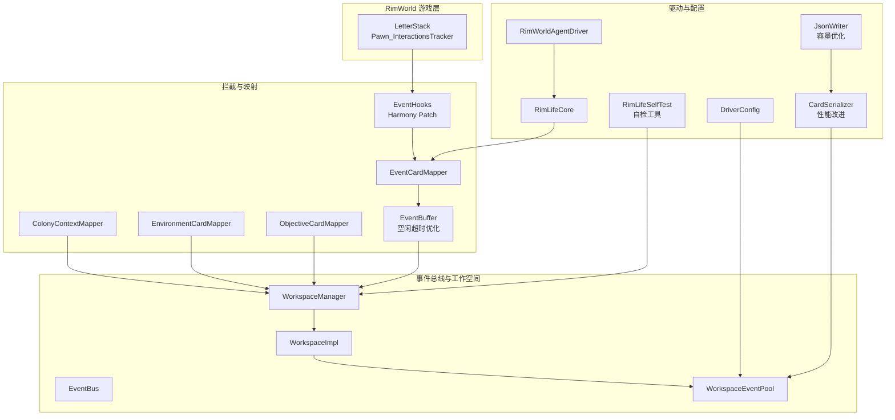
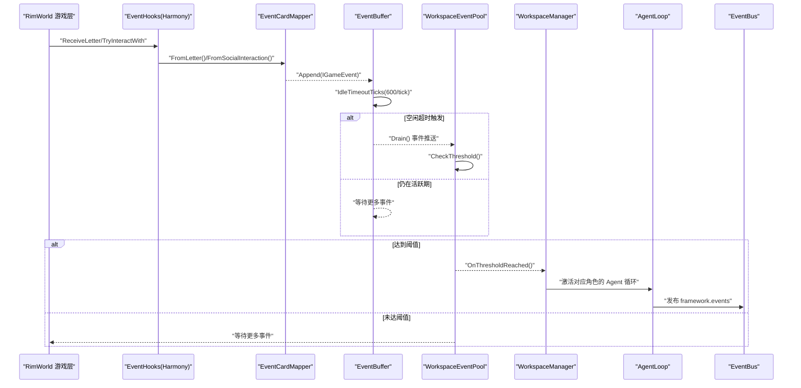
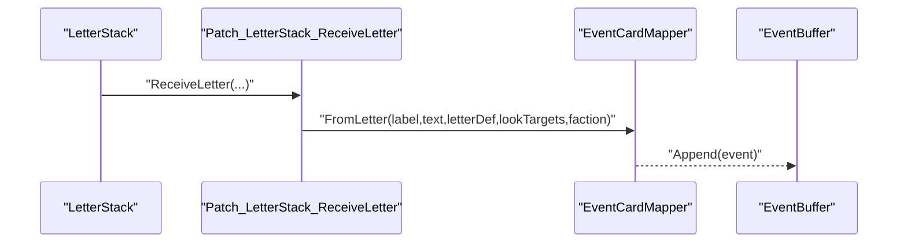
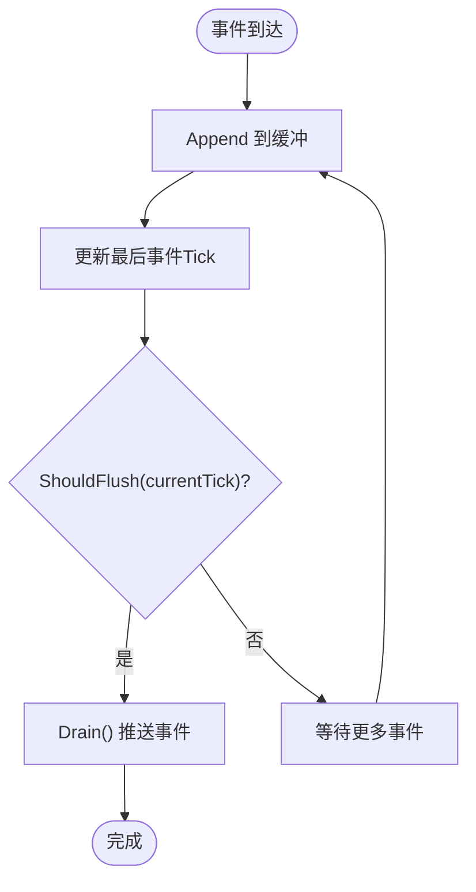
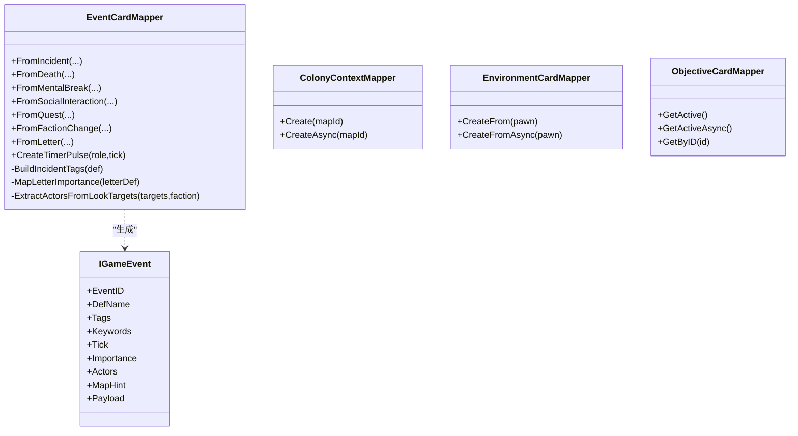
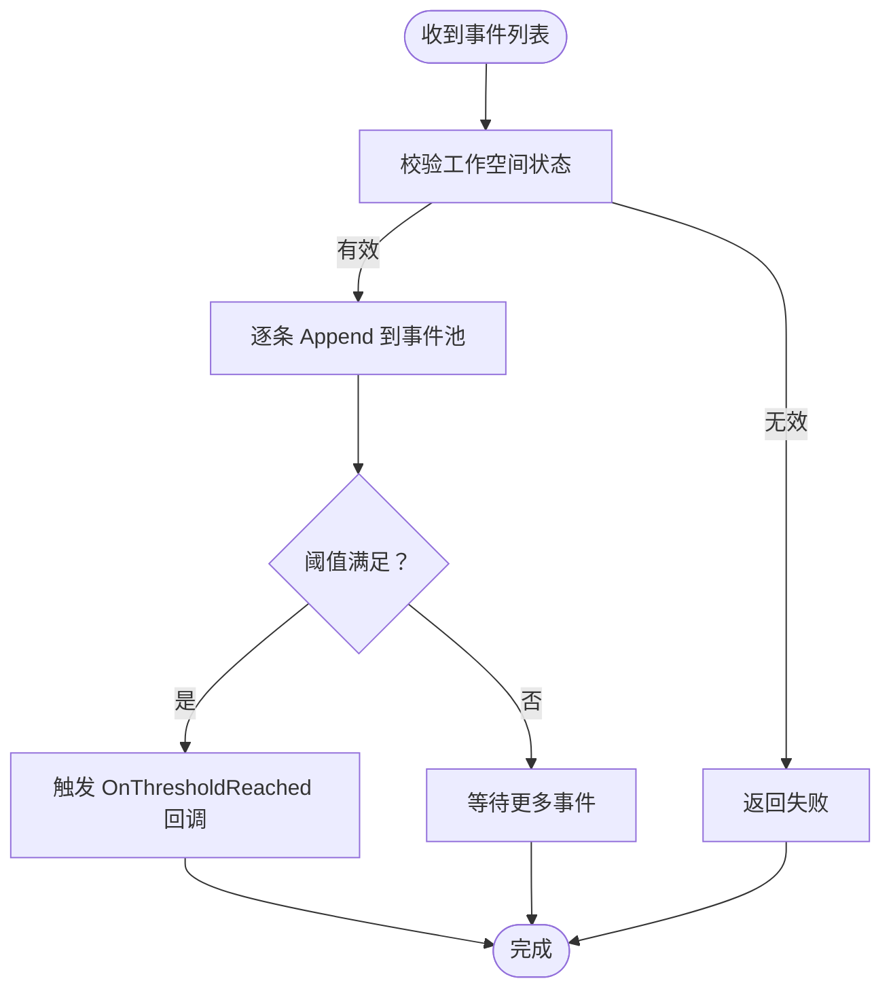
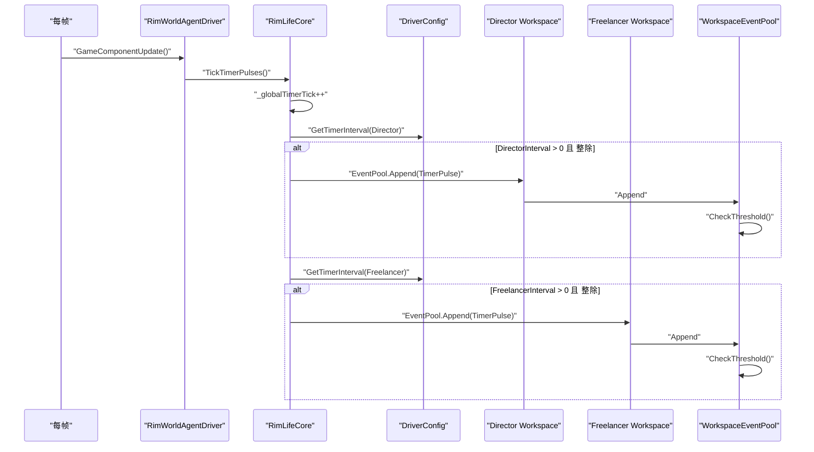
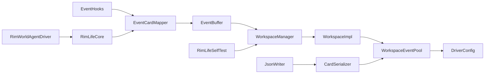

# 事件系统集成

<cite>
**本文引用的文件**
- [EventCardMapper.cs](file://Source/Mappers/EventCardMapper.cs)
- [ColonyContextMapper.cs](file://Source/Mappers/ColonyContextMapper.cs)
- [EnvironmentCardMapper.cs](file://Source/Mappers/EnvironmentCardMapper.cs)
- [ObjectiveCardMapper.cs](file://Source/Mappers/ObjectiveCardMapper.cs)
- [EventHooks.cs](file://Source/Data/Events/EventHooks.cs)
- [EventBus.cs](file://ext/NPCLife/src/NPCLife/Framework/EventBus.cs)
- [WorkspaceEventPool.cs](file://ext/NPCLife/src/NPCLife/Workspace/WorkspaceEventPool.cs)
- [WorkspaceManager.cs](file://ext/NPCLife/src/NPCLife/Workspace/WorkspaceManager.cs)
- [WorkspaceImpl.cs](file://ext/NPCLife/src/NPCLife/Workspace/WorkspaceImpl.cs)
- [DriverConfig.cs](file://ext/NPCLife/src/NPCLife/Driver/DriverConfig.cs)
- [RimWorldAgentDriver.cs](file://Source/Infrastructure/RimWorldAgentDriver.cs)
- [RimLifeCore.cs](file://Source/Infrastructure/RimLifeCore.cs)
- [EventCard.cs](file://ext/NPCLife/src/NPCLife/Cards/EventCard.cs)
- [InteractionHistoryStore.cs](file://ext/NPCLife/src/NPCLife/Infrastructure/InteractionHistoryStore.cs)
- [IInteractionStore.cs](file://ext/NPCLife/src/NPCLife/Core/IInteractionStore.cs)
- [EventBuffer.cs](file://Source/Data/Events/EventBuffer.cs)
- [RimLifeSelfTest.cs](file://Source/Tool/RimLifeSelfTest.cs)
- [CardSerializer.cs](file://ext/NPCLife/src/NPCLife/Framework/Mcp/CardSerializer.cs)
- [JsonWriter.cs](file://ext/NPCLife/src/NPCLife/Framework/JsonWriter.cs)
</cite>

## 更新摘要
**变更内容**
- 新增事件缓冲系统空闲超时优化章节
- 更新EventCardMapper性能改进说明
- 增强自检工具功能描述
- 补充JsonWriter容量优化细节
- 添加事件缓冲诊断日志机制

## 目录
1. [引言](#引言)
2. [项目结构](#项目结构)
3. [核心组件](#核心组件)
4. [架构总览](#架构总览)
5. [详细组件分析](#详细组件分析)
6. [依赖分析](#依赖分析)
7. [性能考虑](#性能考虑)
8. [故障排查指南](#故障排查指南)
9. [结论](#结论)
10. [附录](#附录)

## 引言
本文件面向 RimWorld 事件系统集成，系统性阐述事件拦截机制、事件映射器实现、事件路由与阈值触发、定时器脉冲配置、与工作空间管理的集成方式，并提供流程图与排障建议。内容兼顾初学者易懂与资深开发者所需的技术深度。本次更新重点关注事件缓冲系统的性能优化、EventCardMapper的性能改进以及自检工具的增强功能。

## 项目结构
事件系统位于 RimLife 主工程与 NPCLife 框架之间，采用"RimWorld 事件拦截 + 映射器生成事件卡 + 工作空间事件池 + 阈值触发 + 定时器脉冲"的分层设计。关键目录与文件如下：
- Source/Mappers：事件映射器（事件卡、殖民地上下文、环境卡、目标卡）
- Source/Data/Events：Harmony 事件钩子（Letter、社交互动等）及事件缓冲系统
- Source/Infrastructure：RimWorldAgentDriver、RimLifeCore（定时器脉冲驱动）
- Source/Tool：RimLifeSelfTest（自检工具）
- ext/…/Workspace：工作空间管理、事件池、路由
- ext/…/Framework：事件总线 EventBus、JsonWriter、CardSerializer
- ext/…/Cards：事件卡接口与实现

**图表来源**
- [EventHooks.cs:17-34](file://Source/Data/Events/EventHooks.cs#L17-L34)
- [EventCardMapper.cs:20-49](file://Source/Mappers/EventCardMapper.cs#L20-L49)
- [EventBuffer.cs:19-28](file://Source/Data/Events/EventBuffer.cs#L19-L28)
- [RimLifeSelfTest.cs:33-47](file://Source/Tool/RimLifeSelfTest.cs#L33-L47)
- [JsonWriter.cs:16-21](file://ext/NPCLife/src/NPCLife/Framework/JsonWriter.cs#L16-L21)
- [CardSerializer.cs:22-31](file://ext/NPCLife/src/NPCLife/Framework/Mcp/CardSerializer.cs#L22-L31)

**章节来源**
- [EventHooks.cs:17-34](file://Source/Data/Events/EventHooks.cs#L17-L34)
- [EventCardMapper.cs:20-49](file://Source/Mappers/EventCardMapper.cs#L20-L49)
- [EventBuffer.cs:19-28](file://Source/Data/Events/EventBuffer.cs#L19-L28)
- [RimLifeSelfTest.cs:33-47](file://Source/Tool/RimLifeSelfTest.cs#L33-L47)
- [JsonWriter.cs:16-21](file://ext/NPCLife/src/NPCLife/Framework/JsonWriter.cs#L16-L21)
- [CardSerializer.cs:22-31](file://ext/NPCLife/src/NPCLife/Framework/Mcp/CardSerializer.cs#L22-L31)

## 核心组件
- 事件拦截与钩子：通过 Harmony Patch 拦截 LetterStack.ReceiveLetter 与 Pawn_InteractionsTracker.TryInteractWith，分别生成事件卡与交互流水。
- 事件映射器：EventCardMapper、ColonyContextMapper、EnvironmentCardMapper、ObjectiveCardMapper 将 RimWorld 对象映射为标准事件卡或上下文卡片。
- 事件缓冲系统：EventBuffer 实现事件合并去抖，通过 IdleTimeoutTicks（默认600，约10秒）优化事件推送时机。
- 事件池与阈值：WorkspaceEventPool 实现 IEventLog，支持 Append、阈值检测、DrainPending、查询与最近历史缓冲。
- 工作空间路由：WorkspaceManager 提供事件路由、分支/合并、状态管理；WorkspaceImpl 暴露事件池与技能槽。
- 事件总线：EventBus 提供命名空间事件名、优先级排序、错误隔离的发布/订阅。
- 定时器脉冲：RimWorldAgentDriver 驱动每帧 MainThreadDispatcher 清空与 TickTimerPulses；RimLifeCore 维护全局时钟并按角色间隔注入 TimerPulse 事件。
- 自检工具：RimLifeSelfTest 提供全面的系统自检功能，包括基础设施、JSON往返、框架逻辑、事件池集成等测试。
- 性能优化：JsonWriter 使用更大容量（512字节）减少内存分配，CardSerializer 优化序列化性能。

**章节来源**
- [EventHooks.cs:17-34](file://Source/Data/Events/EventHooks.cs#L17-L34)
- [EventCardMapper.cs:20-49](file://Source/Mappers/EventCardMapper.cs#L20-L49)
- [EventBuffer.cs:19-28](file://Source/Data/Events/EventBuffer.cs#L19-L28)
- [WorkspaceEventPool.cs:49-80](file://ext/NPCLife/src/NPCLife/Workspace/WorkspaceEventPool.cs#L49-L80)
- [WorkspaceManager.cs:382-392](file://ext/NPCLife/src/NPCLife/Workspace/WorkspaceManager.cs#L382-L392)
- [EventBus.cs:46-65](file://ext/NPCLife/src/NPCLife/Framework/EventBus.cs#L46-L65)
- [RimWorldAgentDriver.cs:18-22](file://Source/Infrastructure/RimWorldAgentDriver.cs#L18-L22)
- [RimLifeCore.cs:493-524](file://Source/Infrastructure/RimLifeCore.cs#L493-L524)
- [DriverConfig.cs:54-101](file://ext/NPCLife/src/NPCLife/Driver/DriverConfig.cs#L54-L101)
- [RimLifeSelfTest.cs:117-133](file://Source/Tool/RimLifeSelfTest.cs#L117-L133)
- [JsonWriter.cs:16-21](file://ext/NPCLife/src/NPCLife/Framework/JsonWriter.cs#L16-L21)
- [CardSerializer.cs:22-31](file://ext/NPCLife/src/NPCLife/Framework/Mcp/CardSerializer.cs#L22-L31)

## 架构总览
事件从 RimWorld 游戏层产生，经由 Harmony 钩子进入映射器，生成 IGameEvent 事件卡，写入事件缓冲系统。事件缓冲系统通过空闲超时机制（默认10秒）进行事件合并去抖，然后写入工作空间事件池。事件池根据 DriverConfig 的阈值触发 OnThresholdReached，进而激活对应角色的 Agent 循环。同时，RimWorldAgentDriver 驱动全局时钟，按角色定时器间隔注入 TimerPulse 事件，确保系统不会因事件稀少而停滞。

**图表来源**
- [EventHooks.cs:24-33](file://Source/Data/Events/EventHooks.cs#L24-L33)
- [EventCardMapper.cs:261-292](file://Source/Mappers/EventCardMapper.cs#L261-L292)
- [EventBuffer.cs:48-53](file://Source/Data/Events/EventBuffer.cs#L48-L53)
- [WorkspaceEventPool.cs:81-90](file://ext/NPCLife/src/NPCLife/Workspace/WorkspaceEventPool.cs#L81-L90)
- [WorkspaceManager.cs:382-392](file://ext/NPCLife/src/NPCLife/Workspace/WorkspaceManager.cs#L382-L392)

## 详细组件分析

### 事件拦截与钩子（Harmony Patch）
- LetterStack.ReceiveLetter：在 Postfix 中调用 EventCardMapper.FromLetter，将 LetterDef、标签、正文、LookTargets、派系等映射为事件卡，并写入事件缓冲系统。
- Pawn_InteractionsTracker.TryInteractWith：社交互动不写入事件池，而是写入 InteractionHistoryStore 作为流水记录，并追加短期记忆；同时写入双方 Pawn 的短期记忆。

**图表来源**
- [EventHooks.cs:17-34](file://Source/Data/Events/EventHooks.cs#L17-L34)
- [EventCardMapper.cs:261-292](file://Source/Mappers/EventCardMapper.cs#L261-L292)

**章节来源**
- [EventHooks.cs:17-34](file://Source/Data/Events/EventHooks.cs#L17-L34)
- [EventHooks.cs:40-72](file://Source/Data/Events/EventHooks.cs#L40-L72)

### 事件缓冲系统（EventBuffer）- **新增**
事件缓冲系统实现了智能的事件合并去抖机制，通过空闲超时参数优化事件推送时机：

- **空闲超时配置**：IdleTimeoutTicks 默认设置为 600（约10秒），在此期间无新事件到达即触发推送
- **事件合并**：将短时间内连续的事件批量处理，减少事件池压力
- **诊断日志**：详细的事件进入缓冲的日志记录，便于性能监控和调试
- **设计原则**：不设置最大持有时间，避免异常情况下事件无限堆积

**图表来源**
- [EventBuffer.cs:34-53](file://Source/Data/Events/EventBuffer.cs#L34-L53)
- [EventBuffer.cs:67-72](file://Source/Data/Events/EventBuffer.cs#L67-L72)

**章节来源**
- [EventBuffer.cs:19-28](file://Source/Data/Events/EventBuffer.cs#L19-L28)
- [EventBuffer.cs:34-53](file://Source/Data/Events/EventBuffer.cs#L34-L53)
- [EventBuffer.cs:67-72](file://Source/Data/Events/EventBuffer.cs#L67-L72)

### 事件映射器（EventCardMapper、ColonyContextMapper、EnvironmentCardMapper、ObjectiveCardMapper）
- EventCardMapper
  - 从 Incident、Pawn 死亡、精神崩溃、社交互动、Quest 状态变化、派系变更、Letter 等 RimWorld 事件生成 IGameEvent。
  - 支持统一信封映射（FromLetter）与定时器脉冲事件（CreateTimerPulse）。
  - 标签构建：BuildIncidentTags、BuildLetterTags；重要度映射：MapLetterImportance。
  - 从 LookTargets 提取 Actor 与 MapHint。
  - **性能改进**：优化了事件标签构建和重要度映射的计算效率。

- ColonyContextMapper
  - 在主线程创建 ColonyContext，包含时间、殖民者、派系关系、资源状态、难度、科技等级、殖民开始 tick。
  - 异步封装：CreateAsync。

- EnvironmentCardMapper
  - 依据 Pawn 所在位置（室内/室外）提取温度、光照、天气、Thing 摘要。
  - 异步封装：CreateFromAsync。

- ObjectiveCardMapper
  - 从 QuestManager 获取活跃任务，生成 ObjectiveCard 列表；支持按 ID 查询。

**图表来源**
- [EventCardMapper.cs:20-49](file://Source/Mappers/EventCardMapper.cs#L20-L49)
- [EventCardMapper.cs:176-199](file://Source/Mappers/EventCardMapper.cs#L176-L199)
- [EventCardMapper.cs:204-251](file://Source/Mappers/EventCardMapper.cs#L204-L251)
- [EventCardMapper.cs:261-292](file://Source/Mappers/EventCardMapper.cs#L261-L292)
- [EventCardMapper.cs:305-322](file://Source/Mappers/EventCardMapper.cs#L305-L322)
- [ColonyContextMapper.cs:23-54](file://Source/Mappers/ColonyContextMapper.cs#L23-L54)
- [EnvironmentCardMapper.cs:21-67](file://Source/Mappers/EnvironmentCardMapper.cs#L21-L67)
- [ObjectiveCardMapper.cs:21-42](file://Source/Mappers/ObjectiveCardMapper.cs#L21-L42)
- [EventCard.cs:11-39](file://ext/NPCLife/src/NPCLife/Cards/EventCard.cs#L11-L39)

**章节来源**
- [EventCardMapper.cs:20-49](file://Source/Mappers/EventCardMapper.cs#L20-L49)
- [EventCardMapper.cs:176-199](file://Source/Mappers/EventCardMapper.cs#L176-L199)
- [EventCardMapper.cs:204-251](file://Source/Mappers/EventCardMapper.cs#L204-L251)
- [EventCardMapper.cs:261-292](file://Source/Mappers/EventCardMapper.cs#L261-L292)
- [EventCardMapper.cs:305-322](file://Source/Mappers/EventCardMapper.cs#L305-L322)
- [ColonyContextMapper.cs:23-54](file://Source/Mappers/ColonyContextMapper.cs#L23-L54)
- [EnvironmentCardMapper.cs:21-67](file://Source/Mappers/EnvironmentCardMapper.cs#L21-L67)
- [ObjectiveCardMapper.cs:21-42](file://Source/Mappers/ObjectiveCardMapper.cs#L21-L42)
- [EventCard.cs:11-39](file://ext/NPCLife/src/NPCLife/Cards/EventCard.cs#L11-L39)

### 事件路由系统（工作空间与事件池）
- WorkspaceManager.RouteEvents：将事件批量写入目标工作空间的事件池。
- WorkspaceImpl：持有 WorkspaceEventPool 与 SkillSlot，提供 FinishRound、PushLine 等叙事操作。
- WorkspaceEventPool：双缓冲结构（持久化 pending + 内存 recent），支持阈值检测、DrainPending、查询与最近历史裁剪。

**图表来源**
- [WorkspaceManager.cs:382-392](file://ext/NPCLife/src/NPCLife/Workspace/WorkspaceManager.cs#L382-L392)
- [WorkspaceEventPool.cs:49-80](file://ext/NPCLife/src/NPCLife/Workspace/WorkspaceEventPool.cs#L49-L80)
- [WorkspaceEventPool.cs:81-90](file://ext/NPCLife/src/NPCLife/Workspace/WorkspaceEventPool.cs#L81-L90)

**章节来源**
- [WorkspaceManager.cs:382-392](file://ext/NPCLife/src/NPCLife/Workspace/WorkspaceManager.cs#L382-L392)
- [WorkspaceImpl.cs:38-46](file://ext/NPCLife/src/NPCLife/Workspace/WorkspaceImpl.cs#L38-L46)
- [WorkspaceEventPool.cs:49-80](file://ext/NPCLife/src/NPCLife/Workspace/WorkspaceEventPool.cs#L49-L80)

### 事件阈值触发机制与定时器脉冲
- 阈值检测：WorkspaceEventPool.Append 后累计 PendingImportance 与 PendingEventIds，调用 CheckThreshold 比较 Count 与 Importance 阈值（按角色生效）。
- 定时器脉冲：RimWorldAgentDriver.GameComponentUpdate 每帧调用 RimLifeCore.TickTimerPulses；后者维护全局时钟 _globalTimerTick，按 DriverConfig.GetTimerInterval 对角色取模触发，注入 TimerPulse 事件到对应工作空间事件池。

**图表来源**
- [RimWorldAgentDriver.cs:18-22](file://Source/Infrastructure/RimWorldAgentDriver.cs#L18-L22)
- [RimLifeCore.cs:493-524](file://Source/Infrastructure/RimLifeCore.cs#L493-L524)
- [DriverConfig.cs:89-101](file://ext/NPCLife/src/NPCLife/Driver/DriverConfig.cs#L89-L101)
- [WorkspaceEventPool.cs:81-90](file://ext/NPCLife/src/NPCLife/Workspace/WorkspaceEventPool.cs#L81-L90)

**章节来源**
- [WorkspaceEventPool.cs:81-90](file://ext/NPCLife/src/NPCLife/Workspace/WorkspaceEventPool.cs#L81-L90)
- [RimWorldAgentDriver.cs:18-22](file://Source/Infrastructure/RimWorldAgentDriver.cs#L18-L22)
- [RimLifeCore.cs:493-524](file://Source/Infrastructure/RimLifeCore.cs#L493-L524)
- [DriverConfig.cs:89-101](file://ext/NPCLife/src/NPCLife/Driver/DriverConfig.cs#L89-L101)

### 事件总线（EventBus）与多代理分发
- EventBus：支持命名空间事件名、优先级排序、错误隔离；提供 Subscribe/Unsubscribe/Publish/清空等能力。
- 多代理分发：事件池阈值触发后，由 WorkspaceManager 激活对应角色的 Agent 循环；EventBus 发布 framework 事件（如 agent.activated、workspace.created 等）以协调多组件。

**章节来源**
- [EventBus.cs:46-65](file://ext/NPCLife/src/NPCLife/Framework/EventBus.cs#L46-L65)
- [EventBus.cs:86-113](file://ext/NPCLife/src/NPCLife/Framework/EventBus.cs#L86-L113)
- [WorkspaceManager.cs:134-137](file://ext/NPCLife/src/NPCLife/Workspace/WorkspaceManager.cs#L134-L137)

### 与工作空间管理的集成
- WorkspaceManager.Create/Branch/Merge：创建工作空间并自动激活默认技能集；支持分支/合并与状态变更；持久化到存储后端。
- WorkspaceImpl：暴露 EventPool 与 SkillSlot；FinishRound/PushLine 等叙事操作；发布 ScriptLineReady/ScriptReady 等事件。
- 事件路由：RouteEvents 将事件写入目标工作空间事件池，触发其阈值回调。

**章节来源**
- [WorkspaceManager.cs:91-138](file://ext/NPCLife/src/NPCLife/Workspace/WorkspaceManager.cs#L91-L138)
- [WorkspaceManager.cs:193-263](file://ext/NPCLife/src/NPCLife/Workspace/WorkspaceManager.cs#L193-L263)
- [WorkspaceManager.cs:269-376](file://ext/NPCLife/src/NPCLife/Workspace/WorkspaceManager.cs#L269-L376)
- [WorkspaceImpl.cs:127-184](file://ext/NPCLife/src/NPCLife/Workspace/WorkspaceImpl.cs#L127-L184)
- [WorkspaceManager.cs:382-392](file://ext/NPCLife/src/NPCLife/Workspace/WorkspaceManager.cs#L382-L392)

### 自检工具（RimLifeSelfTest）- **新增**
RimLifeSelfTest 提供了全面的系统自检功能，包括：

- **基础设施测试**：验证 RimLifeCore.SaveStore、CacheStore、事件池等核心组件
- **JSON往返测试**：测试 JsonParser.ParseDict、JsonWriter 等 JSON 处理功能
- **框架逻辑测试**：测试 SemanticLabels、RandomInt 等纯逻辑组件
- **事件池集成测试**：验证 EventPool 的 Append、DrainPending、查询等功能
- **映射器测试**：测试各种 Mapper 的数据采集功能
- **Harmony Patch 状态**：检查事件钩子的安装状态
- **CardSerializer 序列化**：验证各种卡片类型的序列化功能
- **MCP Provider 工具调用**：测试所有 MCP 工具的功能

**章节来源**
- [RimLifeSelfTest.cs:117-133](file://Source/Tool/RimLifeSelfTest.cs#L117-L133)
- [RimLifeSelfTest.cs:1400-1423](file://Source/Tool/RimLifeSelfTest.cs#L1400-L1423)

### 性能优化组件 - **新增**
- **JsonWriter 容量优化**：CardSerializer 使用 512 字节的初始容量，减少字符串构建过程中的内存分配
- **事件缓冲去抖**：EventBuffer 通过 IdleTimeoutTicks（默认600）实现事件合并，减少事件池压力
- **诊断日志**：EventBuffer 添加详细的事件进入缓冲日志，便于性能监控和调试

**章节来源**
- [CardSerializer.cs:22-31](file://ext/NPCLife/src/NPCLife/Framework/Mcp/CardSerializer.cs#L22-L31)
- [EventBuffer.cs:28](file://Source/Data/Events/EventBuffer.cs#L28)
- [EventBuffer.cs:42](file://Source/Data/Events/EventBuffer.cs#L42)

## 依赖分析
- 组件耦合
  - EventHooks 依赖 EventCardMapper 与 WorkspaceManager。
  - EventBuffer 依赖 IGameEvent 接口，提供事件缓冲功能。
  - WorkspaceEventPool 依赖 DriverConfig 与 ICardSerializer。
  - WorkspaceImpl 依赖 WorkspaceEventPool 与 DriverConfig。
  - RimWorldAgentDriver 依赖 RimLifeCore。
  - RimLifeSelfTest 依赖所有核心组件进行自检。
- 外部依赖
  - Harmony（事件钩子）
  - Verse/RimWorld（游戏对象）
  - NPCLife 框架（EventBus、Workspace、DriverConfig、Cards、JsonWriter）

**图表来源**
- [EventHooks.cs:24-33](file://Source/Data/Events/EventHooks.cs#L24-L33)
- [EventCardMapper.cs:261-292](file://Source/Mappers/EventCardMapper.cs#L261-L292)
- [EventBuffer.cs:34-43](file://Source/Data/Events/EventBuffer.cs#L34-L43)
- [WorkspaceManager.cs:382-392](file://ext/NPCLife/src/NPCLife/Workspace/WorkspaceManager.cs#L382-L392)
- [WorkspaceImpl.cs:38-46](file://ext/NPCLife/src/NPCLife/Workspace/WorkspaceImpl.cs#L38-L46)
- [WorkspaceEventPool.cs:32-43](file://ext/NPCLife/src/NPCLife/Workspace/WorkspaceEventPool.cs#L32-L43)
- [RimWorldAgentDriver.cs:18-22](file://Source/Infrastructure/RimWorldAgentDriver.cs#L18-L22)
- [RimLifeCore.cs:493-524](file://Source/Infrastructure/RimLifeCore.cs#L493-L524)
- [RimLifeSelfTest.cs:117-133](file://Source/Tool/RimLifeSelfTest.cs#L117-L133)
- [JsonWriter.cs:16-21](file://ext/NPCLife/src/NPCLife/Framework/JsonWriter.cs#L16-L21)
- [CardSerializer.cs:22-31](file://ext/NPCLife/src/NPCLife/Framework/Mcp/CardSerializer.cs#L22-L31)

**章节来源**
- [EventHooks.cs:24-33](file://Source/Data/Events/EventHooks.cs#L24-L33)
- [WorkspaceEventPool.cs:32-43](file://ext/NPCLife/src/NPCLife/Workspace/WorkspaceEventPool.cs#L32-L43)
- [RimWorldAgentDriver.cs:18-22](file://Source/Infrastructure/RimWorldAgentDriver.cs#L18-L22)
- [RimLifeCore.cs:493-524](file://Source/Infrastructure/RimLifeCore.cs#L493-L524)
- [RimLifeSelfTest.cs:117-133](file://Source/Tool/RimLifeSelfTest.cs#L117-L133)
- [JsonWriter.cs:16-21](file://ext/NPCLife/src/NPCLife/Framework/JsonWriter.cs#L16-L21)
- [CardSerializer.cs:22-31](file://ext/NPCLife/src/NPCLife/Framework/Mcp/CardSerializer.cs#L22-L31)

## 性能考虑
- **事件缓冲系统优化**：通过 IdleTimeoutTicks（默认600，约10秒）实现事件合并去抖，减少事件池压力和内存分配。
- **JsonWriter 容量优化**：CardSerializer 使用 512 字节的初始容量，显著减少字符串构建过程中的内存分配次数。
- **事件池阈值控制**：通过 DriverConfig 的 Count/Importance 阈值平衡吞吐与延迟；RecentHistoryCapacity 控制内存占用。
- **最近历史裁剪**：按最小重要度淘汰策略减少内存压力。
- **异步封装**：ColonyContextMapper、EnvironmentCardMapper、ObjectiveCardMapper 提供 CreateAsync，避免阻塞主线程。
- **定时器脉冲**：避免事件稀少导致的停滞，同时通过 Importance=0.5f 降低单次脉冲触发阈值的概率。
- **错误隔离**：EventBus 发布时单个处理器异常不影响其他订阅者。
- **诊断日志**：EventBuffer 添加详细的事件进入缓冲日志，便于性能监控和调试。

**章节来源**
- [EventBuffer.cs:28](file://Source/Data/Events/EventBuffer.cs#L28)
- [CardSerializer.cs:22-31](file://ext/NPCLife/src/NPCLife/Framework/Mcp/CardSerializer.cs#L22-L31)
- [WorkspaceEventPool.cs:61-74](file://ext/NPCLife/src/NPCLife/Workspace/WorkspaceEventPool.cs#L61-L74)
- [ColonyContextMapper.cs:59-62](file://Source/Mappers/ColonyContextMapper.cs#L59-L62)
- [EnvironmentCardMapper.cs:72-76](file://Source/Mappers/EnvironmentCardMapper.cs#L72-L76)
- [ObjectiveCardMapper.cs:47-50](file://Source/Mappers/ObjectiveCardMapper.cs#L47-L50)
- [EventBus.cs:104-112](file://ext/NPCLife/src/NPCLife/Framework/EventBus.cs#L104-L112)
- [EventBuffer.cs:42](file://Source/Data/Events/EventBuffer.cs#L42)

## 故障排查指南
- **社交互动未见事件卡**
  - 原因：社交互动不写入事件池，而是写入 InteractionHistoryStore 作为流水记录；若需要事件卡，请检查业务需求是否应改为其他事件路径。
  - 参考：[EventHooks.cs:55-63](file://Source/Data/Events/EventHooks.cs#L55-L63)
- **事件未触发 Agent 激活**
  - 检查 DriverConfig 的阈值配置（Count/Importance）与角色匹配；确认 OnThresholdReached 是否被触发。
  - 参考：[WorkspaceEventPool.cs:81-90](file://ext/NPCLife/src/NPCLife/Workspace/WorkspaceEventPool.cs#L81-L90)、[DriverConfig.cs:54-85](file://ext/NPCLife/src/NPCLife/Driver/DriverConfig.cs#L54-L85)
- **定时器脉冲未注入**
  - 检查 RimWorldAgentDriver 是否运行、RimLifeCore.TickTimerPulses 是否被调用、DriverConfig 的定时器间隔是否大于 0。
  - 参考：[RimWorldAgentDriver.cs:18-22](file://Source/Infrastructure/RimWorldAgentDriver.cs#L18-L22)、[RimLifeCore.cs:493-524](file://Source/Infrastructure/RimLifeCore.cs#L493-L524)、[DriverConfig.cs:89-101](file://ext/NPCLife/src/NPCLife/Driver/DriverConfig.cs#L89-L101)
- **事件标签/重要度异常**
  - 检查 EventCardMapper 的标签构建与重要度映射逻辑。
  - 参考：[EventCardMapper.cs:341-380](file://Source/Mappers/EventCardMapper.cs#L341-L380)、[EventCardMapper.cs:442-454](file://Source/Mappers/EventCardMapper.cs#L442-L454)
- **交互历史缺失**
  - 检查 InteractionHistoryStore 的持久化与加载逻辑。
  - 参考：[InteractionHistoryStore.cs:135-141](file://ext/NPCLife/src/NPCLife/Infrastructure/InteractionHistoryStore.cs#L135-L141)、[IInteractionStore.cs:16-32](file://ext/NPCLife/src/NPCLife/Core/IInteractionStore.cs#L16-L32)
- **事件缓冲性能问题**
  - 检查 IdleTimeoutTicks 设置是否合理；查看 EventBuffer 的诊断日志。
  - 参考：[EventBuffer.cs:28](file://Source/Data/Events/EventBuffer.cs#L28)、[EventBuffer.cs:42](file://Source/Data/Events/EventBuffer.cs#L42)
- **序列化性能问题**
  - 检查 JsonWriter 的容量设置；确认 CardSerializer 的序列化性能。
  - 参考：[JsonWriter.cs:16-21](file://ext/NPCLife/src/NPCLife/Framework/JsonWriter.cs#L16-L21)、[CardSerializer.cs:22-31](file://ext/NPCLife/src/NPCLife/Framework/Mcp/CardSerializer.cs#L22-L31)
- **自检工具测试失败**
  - 使用 RimLifeSelfTest 运行相应测试套件，查看详细的测试报告。
  - 参考：[RimLifeSelfTest.cs:117-133](file://Source/Tool/RimLifeSelfTest.cs#L117-L133)

**章节来源**
- [EventHooks.cs:55-63](file://Source/Data/Events/EventHooks.cs#L55-L63)
- [WorkspaceEventPool.cs:81-90](file://ext/NPCLife/src/NPCLife/Workspace/WorkspaceEventPool.cs#L81-L90)
- [DriverConfig.cs:54-85](file://ext/NPCLife/src/NPCLife/Driver/DriverConfig.cs#L54-L85)
- [RimWorldAgentDriver.cs:18-22](file://Source/Infrastructure/RimWorldAgentDriver.cs#L18-L22)
- [RimLifeCore.cs:493-524](file://Source/Infrastructure/RimLifeCore.cs#L493-L524)
- [DriverConfig.cs:89-101](file://ext/NPCLife/src/NPCLife/Driver/DriverConfig.cs#L89-L101)
- [EventCardMapper.cs:341-380](file://Source/Mappers/EventCardMapper.cs#L341-L380)
- [EventCardMapper.cs:442-454](file://Source/Mappers/EventCardMapper.cs#L442-L454)
- [InteractionHistoryStore.cs:135-141](file://ext/NPCLife/src/NPCLife/Infrastructure/InteractionHistoryStore.cs#L135-L141)
- [IInteractionStore.cs:16-32](file://ext/NPCLife/src/NPCLife/Core/IInteractionStore.cs#L16-L32)
- [EventBuffer.cs:28](file://Source/Data/Events/EventBuffer.cs#L28)
- [EventBuffer.cs:42](file://Source/Data/Events/EventBuffer.cs#L42)
- [JsonWriter.cs:16-21](file://ext/NPCLife/src/NPCLife/Framework/JsonWriter.cs#L16-L21)
- [CardSerializer.cs:22-31](file://ext/NPCLife/src/NPCLife/Framework/Mcp/CardSerializer.cs#L22-L31)
- [RimLifeSelfTest.cs:117-133](file://Source/Tool/RimLifeSelfTest.cs#L117-L133)

## 结论
该事件系统通过 Harmony 钩子与映射器将 RimWorld 事件标准化为 IGameEvent，并借助 WorkspaceEventPool 的阈值与定时器脉冲机制，实现对多角色 Agent 的自动激活与路由。新增的事件缓冲系统通过空闲超时优化（默认600，约10秒）实现了事件合并去抖，显著提升了系统性能。结合 EventBus 的事件总线与 WorkspaceManager 的工作空间管理，形成高内聚、低耦合的事件处理闭环。通过合理的阈值与定时器配置、异步封装与错误隔离，以及 JsonWriter 的容量优化和自检工具的全面测试，系统在保证实时性的同时具备良好的可维护性与扩展性。

## 附录
- 事件卡接口与实现参考：[EventCard.cs:11-39](file://ext/NPCLife/src/NPCLife/Cards/EventCard.cs#L11-L39)
- 事件池阈值测试参考：[WorkspaceEventPoolTests.cs:191-234](file://ext/NPCLife/tests/Driver/WorkspaceEventPoolTests.cs#L191-L234)
- 自检工具测试套件：[RimLifeSelfTest.cs:117-133](file://Source/Tool/RimLifeSelfTest.cs#L117-L133)
- JsonWriter 性能测试：[JsonWriterTests.cs:15-203](file://ext/NPCLife/tests/Framework/JsonWriterTests.cs#L15-L203)
- CardSerializer 自检测试：[CardSerializerTests.cs:14-453](file://ext/NPCLife/tests/Framework/CardSerializerTests.cs#L14-L453)