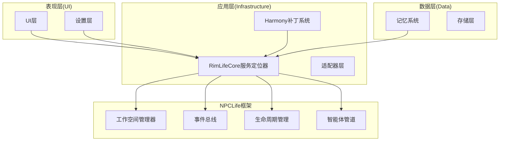
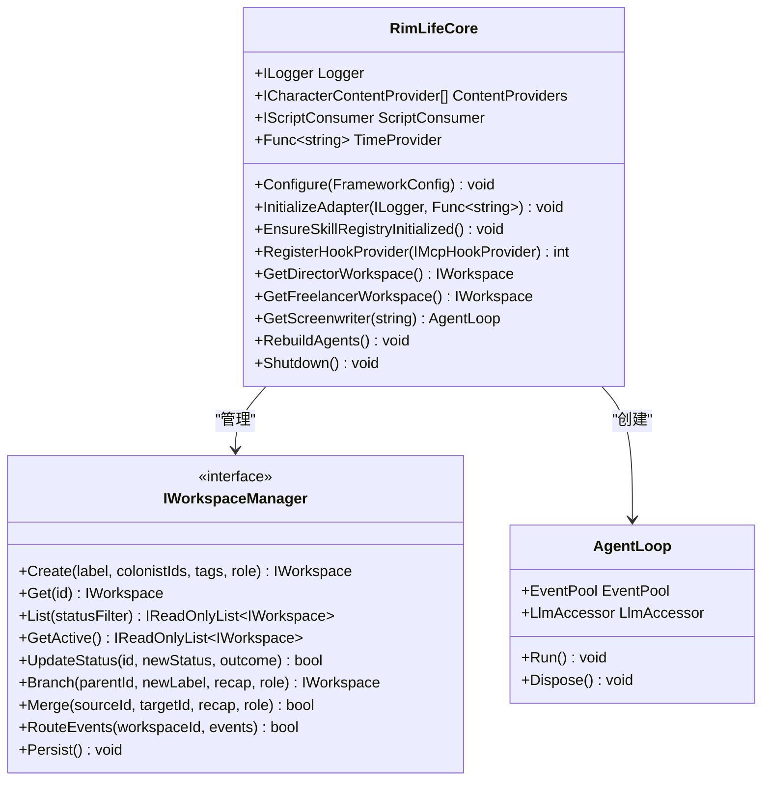
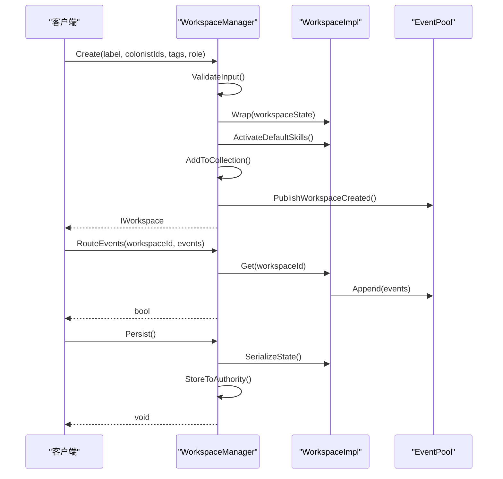
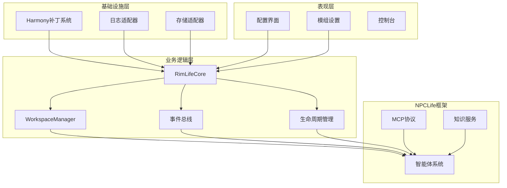
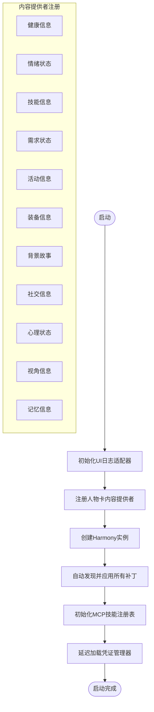
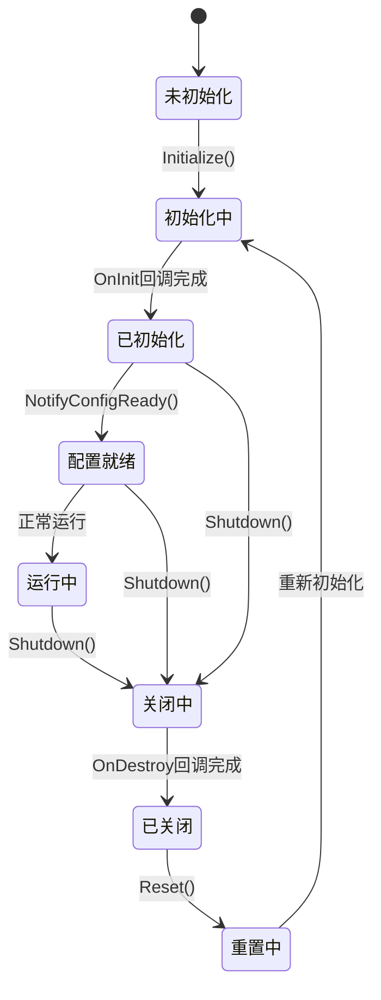
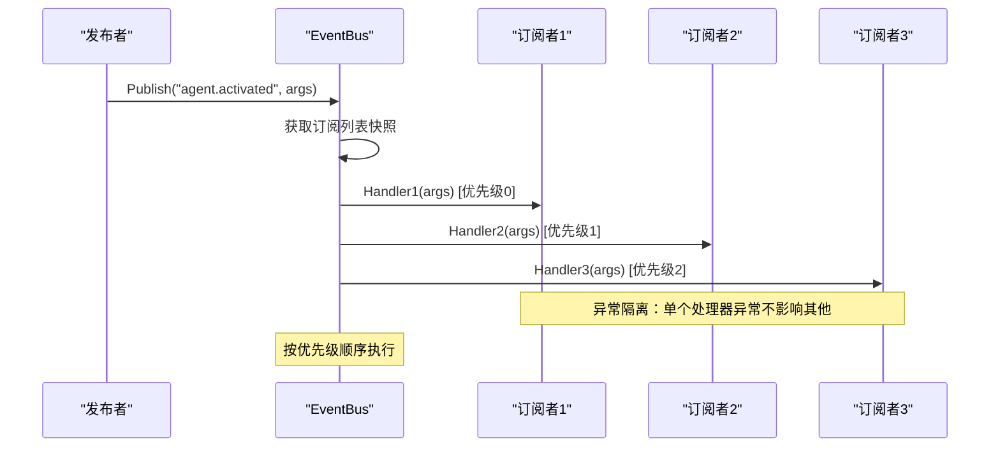
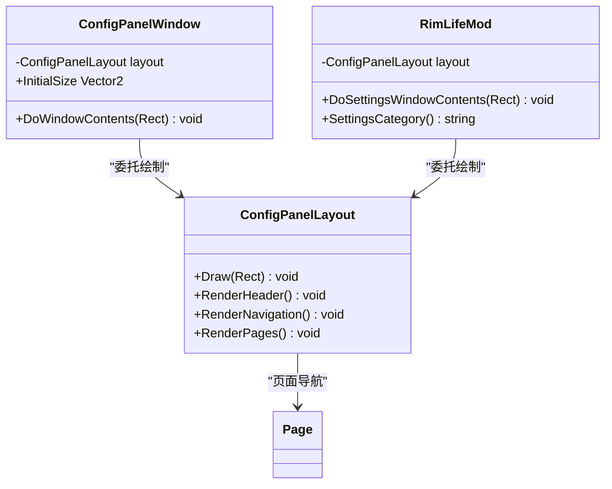
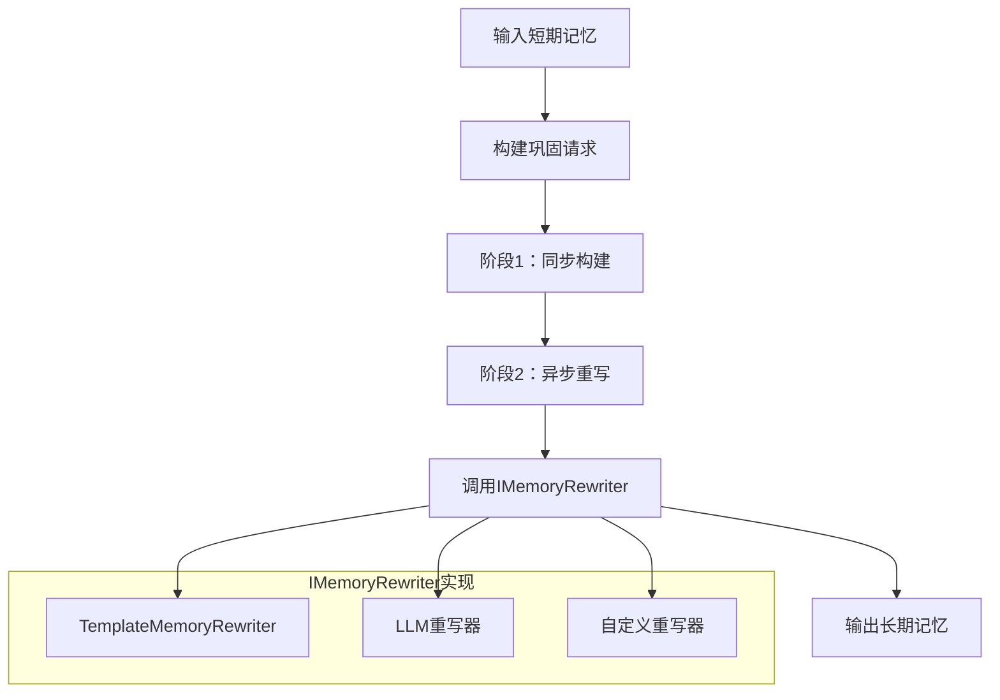
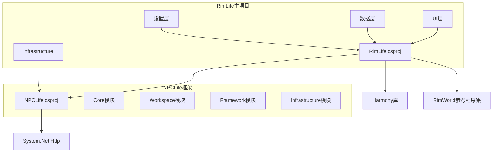

# 代码架构说明

<cite>
**本文档引用的文件**
- [RimLifeCore.cs](file://Source/Infrastructure/RimLifeCore.cs)
- [IWorkspaceManager.cs](file://ext/NPCLife/src/NPCLife/Core/IWorkspaceManager.cs)
- [RimLifeHarmony.cs](file://Source/Infrastructure/RimLifeHarmony.cs)
- [WorkspaceManager.cs](file://ext/NPCLife/src/NPCLife/Workspace/WorkspaceManager.cs)
- [LifecycleManager.cs](file://ext/NPCLife/src/NPCLife/Framework/LifecycleManager.cs)
- [EventBus.cs](file://ext/NPCLife/src/NPCLife/Framework/EventBus.cs)
- [RimLifeMod.cs](file://Source/Settings/RimLifeMod.cs)
- [ConfigPanelWindow.cs](file://Source/UI/ConfigPanelWindow.cs)
- [MemoryConsolidator.cs](file://Source/Data/PawnPro/Memory/MemoryConsolidator.cs)
- [NPCLife.csproj](file://ext/NPCLife/src/NPCLife/NPCLife.csproj)
- [RimLife.csproj](file://RimLife.csproj)
</cite>

## 目录
1. [引言](#引言)
2. [项目结构](#项目结构)
3. [核心组件](#核心组件)
4. [架构概览](#架构概览)
5. [详细组件分析](#详细组件分析)
6. [依赖分析](#依赖分析)
7. [性能考虑](#性能考虑)
8. [故障排除指南](#故障排除指南)
9. [结论](#结论)

## 引言

RimLife 是一个基于 RimWorld 的叙事增强模组，采用分层架构设计，集成了 NPCLife 框架实现多智能体叙事系统。该项目通过服务定位器模式、接口抽象和插件化架构实现了高度模块化的代码组织。

## 项目结构

项目采用清晰的分层架构，主要分为以下层次：

**图表来源**
- [RimLifeCore.cs:18-1095](file://Source/Infrastructure/RimLifeCore.cs#L18-L1095)
- [WorkspaceManager.cs:19-622](file://ext/NPCLife/src/NPCLife/Workspace/WorkspaceManager.cs#L19-L622)
- [EventBus.cs:17-243](file://ext/NPCLife/src/NPCLife/Framework/EventBus.cs#L17-L243)

**章节来源**
- [RimLife.csproj:1-120](file://RimLife.csproj#L1-L120)
- [NPCLife.csproj:1-38](file://ext/NPCLife/src/NPCLife/NPCLife.csproj#L1-L38)

## 核心组件

### RimLifeCore 服务定位器

RimLifeCore 是整个系统的中央服务定位器，提供了统一的依赖注入和组件管理功能：

**图表来源**
- [RimLifeCore.cs:24-1095](file://Source/Infrastructure/RimLifeCore.cs#L24-L1095)
- [IWorkspaceManager.cs:14-57](file://ext/NPCLife/src/NPCLife/Core/IWorkspaceManager.cs#L14-L57)

### 工作空间管理器

工作空间管理器实现了 IWorkspaceManager 接口，提供工作空间的完整生命周期管理：

**图表来源**
- [WorkspaceManager.cs:91-392](file://ext/NPCLife/src/NPCLife/Workspace/WorkspaceManager.cs#L91-L392)

**章节来源**
- [WorkspaceManager.cs:19-622](file://ext/NPCLife/src/NPCLife/Workspace/WorkspaceManager.cs#L19-L622)
- [IWorkspaceManager.cs:14-57](file://ext/NPCLife/src/NPCLife/Core/IWorkspaceManager.cs#L14-L57)

## 架构概览

RimLife 采用了典型的三层架构设计，结合了插件化和事件驱动的模式：

**图表来源**
- [RimLifeHarmony.cs:12-58](file://Source/Infrastructure/RimLifeHarmony.cs#L12-L58)
- [RimLifeCore.cs:24-1095](file://Source/Infrastructure/RimLifeCore.cs#L24-L1095)
- [EventBus.cs:17-243](file://ext/NPCLife/src/NPCLife/Framework/EventBus.cs#L17-L243)

## 详细组件分析

### Harmony 补丁系统

Harmony 补丁系统是 RimLife 的插件化扩展机制：

**图表来源**
- [RimLifeHarmony.cs:16-48](file://Source/Infrastructure/RimLifeHarmony.cs#L16-L48)

**章节来源**
- [RimLifeHarmony.cs:12-58](file://Source/Infrastructure/RimLifeHarmony.cs#L12-L58)

### 生命周期管理系统

LifecycleManager 实现了统一的组件生命周期管理：

**图表来源**
- [LifecycleManager.cs:23-264](file://ext/NPCLife/src/NPCLife/Framework/LifecycleManager.cs#L23-L264)

**章节来源**
- [LifecycleManager.cs:23-264](file://ext/NPCLife/src/NPCLife/Framework/LifecycleManager.cs#L23-L264)

### 事件驱动架构

EventBus 提供了松耦合的事件通信机制：

**图表来源**
- [EventBus.cs:86-113](file://ext/NPCLife/src/NPCLife/Framework/EventBus.cs#L86-L113)

**章节来源**
- [EventBus.cs:17-243](file://ext/NPCLife/src/NPCLife/Framework/EventBus.cs#L17-L243)

### UI 层架构

UI 层采用委托模式，通过 ConfigPanelLayout 统一管理界面绘制：

**图表来源**
- [ConfigPanelWindow.cs:10-28](file://Source/UI/ConfigPanelWindow.cs#L10-L28)
- [RimLifeMod.cs:47-68](file://Source/Settings/RimLifeMod.cs#L47-L68)

**章节来源**
- [ConfigPanelWindow.cs:10-28](file://Source/UI/ConfigPanelWindow.cs#L10-L28)
- [RimLifeMod.cs:47-68](file://Source/Settings/RimLifeMod.cs#L47-L68)

### 记忆系统架构

记忆巩固器实现了两阶段的记忆处理流程：

**图表来源**
- [MemoryConsolidator.cs:12-61](file://Source/Data/PawnPro/Memory/MemoryConsolidator.cs#L12-L61)

**章节来源**
- [MemoryConsolidator.cs:12-61](file://Source/Data/PawnPro/Memory/MemoryConsolidator.cs#L12-L61)

## 依赖分析

项目采用模块化依赖管理，通过 NuGet 和项目引用实现松耦合：

**图表来源**
- [RimLife.csproj:48-58](file://RimLife.csproj#L48-L58)
- [NPCLife.csproj:27-29](file://ext/NPCLife/src/NPCLife/NPCLife.csproj#L27-L29)

**章节来源**
- [RimLife.csproj:48-58](file://RimLife.csproj#L48-L58)
- [NPCLife.csproj:27-29](file://ext/NPCLife/src/NPCLife/NPCLife.csproj#L27-L29)

## 性能考虑

### 缓存策略
- **PromptConfig 缓存**：提示词配置使用本地文件缓存，避免频繁磁盘IO
- **驱动配置缓存**：Agent 驱动配置缓存到本地存储
- **技能注册表缓存**：MCP 技能注册表幂等初始化，避免重复扫描

### 并发控制
- **读写锁**：工作空间管理器使用 ReaderWriterLockSlim 实现高效并发
- **线程安全**：所有全局状态访问都使用锁保护
- **异步处理**：记忆巩固器支持异步重写，不阻塞主线程

### 内存管理
- **延迟初始化**：所有服务组件都支持延迟初始化，按需创建
- **资源清理**：LifecycleManager 提供统一的资源清理机制
- **弱引用**：事件订阅使用弱引用避免内存泄漏

## 故障排除指南

### 常见问题诊断

1. **Harmony 补丁失败**
   - 检查静态构造函数异常日志
   - 验证补丁类的 [HarmonyPatch] 特性正确性
   - 确认目标方法签名匹配

2. **工作空间持久化失败**
   - 检查 IAuthorityStore 实现
   - 验证 JSON 序列化/反序列化逻辑
   - 确认存储权限和路径有效性

3. **事件总线订阅问题**
   - 检查事件名大小写敏感性
   - 验证订阅优先级设置
   - 确认处理器异常不会影响其他订阅者

**章节来源**
- [RimLifeHarmony.cs:50-56](file://Source/Infrastructure/RimLifeHarmony.cs#L50-L56)
- [WorkspaceManager.cs:453-456](file://ext/NPCLife/src/NPCLife/Workspace/WorkspaceManager.cs#L453-L456)
- [EventBus.cs:108-112](file://ext/NPCLife/src/NPCLife/Framework/EventBus.cs#L108-L112)

## 结论

RimLife 项目展现了优秀的软件架构设计，通过以下关键特性实现了高质量的代码组织：

1. **清晰的分层架构**：基础设施层、业务逻辑层、表现层职责明确
2. **插件化设计**：Harmony 补丁系统和内容提供者机制支持扩展
3. **事件驱动架构**：EventBus 提供松耦合的组件通信
4. **生命周期管理**：LifecycleManager 确保资源正确管理
5. **模块化依赖**：NPCLife 框架与 RimLife 解耦，便于维护

该架构为后续功能扩展奠定了坚实基础，特别是在 AI 驱动的叙事系统方面具有良好的可扩展性和维护性。