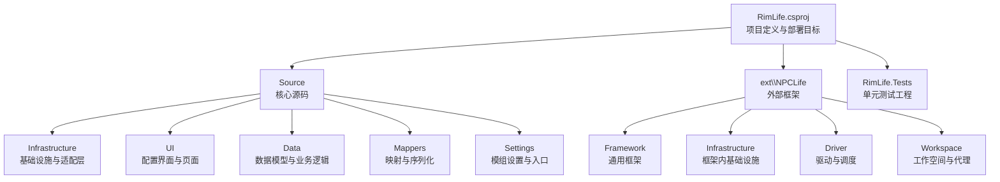
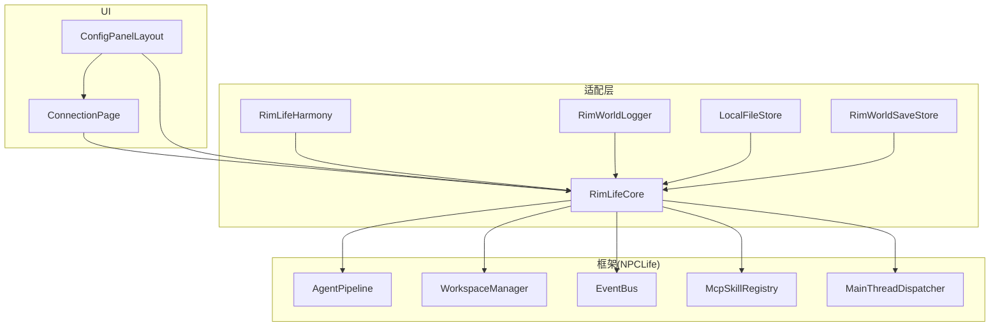
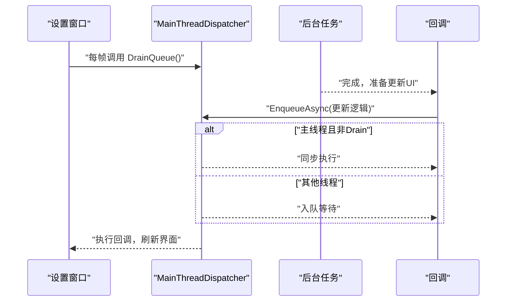
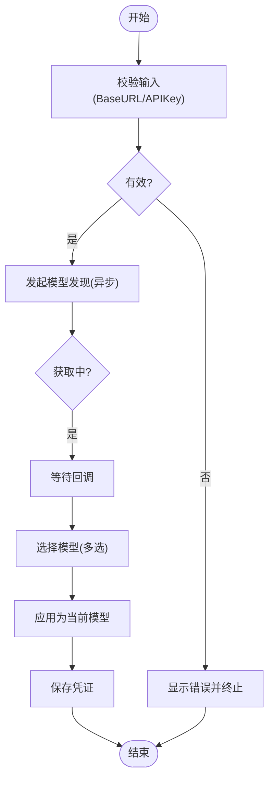
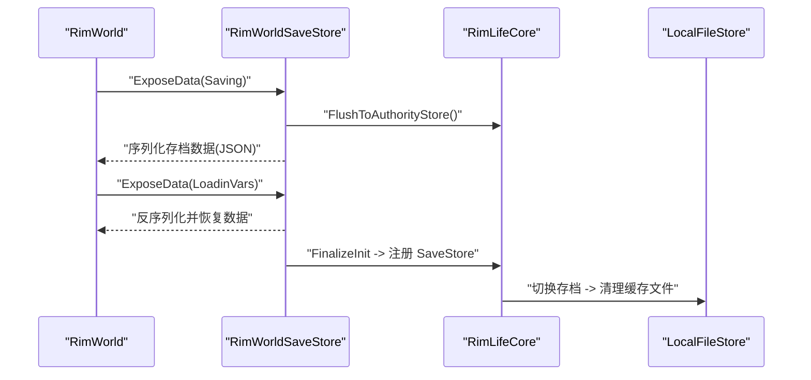
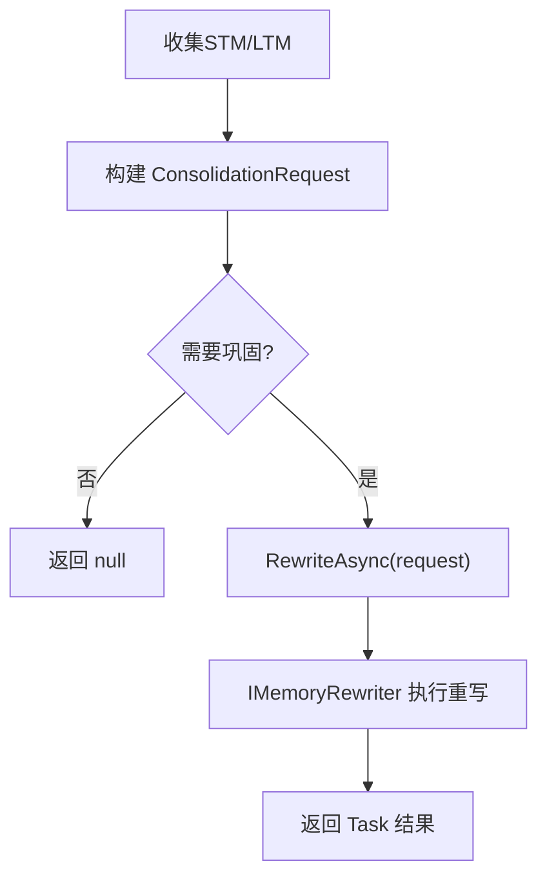
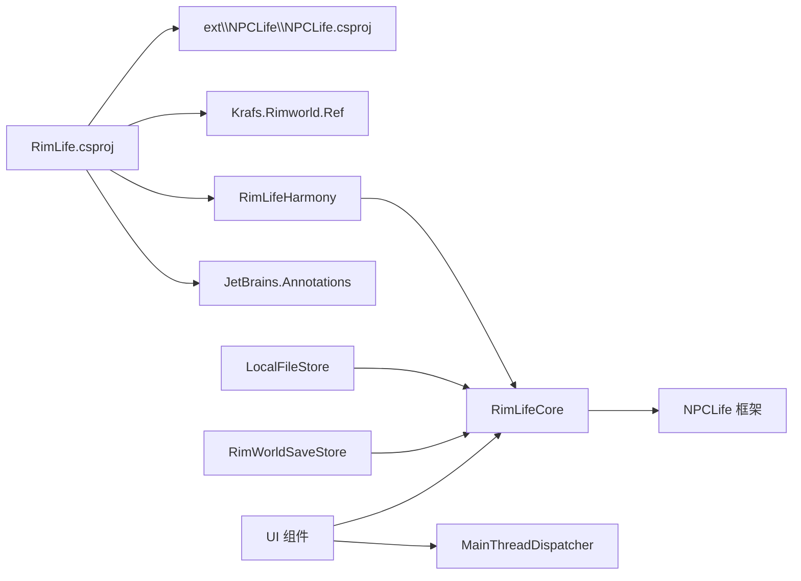

# 代码规范与最佳实践

<cite>
**本文引用的文件**
- [RimLife.csproj](file://RimLife.csproj)
- [About.xml](file://About/About.xml)
- [RimLifeMod.cs](file://Source/Settings/RimLifeMod.cs)
- [RimLifeCore.cs](file://Source/Infrastructure/RimLifeCore.cs)
- [RimWorldLogger.cs](file://Source/Infrastructure/RimWorldLogger.cs)
- [RimLifeHarmony.cs](file://Source/Infrastructure/RimLifeHarmony.cs)
- [ConfigPanelLayout.cs](file://Source/UI/ConfigPanelLayout.cs)
- [ConnectionPage.cs](file://Source/UI/Pages/ConnectionPage.cs)
- [LocalFileStore.cs](file://Source/Infrastructure/LocalFileStore.cs)
- [RimWorldSaveStore.cs](file://Source/Infrastructure/RimWorldSaveStore.cs)
- [MainThreadDispatcher.cs](file://ext/npclife/src/Npclife/Framework/MainThreadDispatcher.cs)
- [MemoryConsolidator.cs](file://Source/Data/PawnPro/Memory/MemoryConsolidator.cs)
- [RimLife.Tests.csproj](file://RimLife.Tests/RimLife.Tests.csproj)
</cite>

## 目录
1. [引言](#引言)
2. [项目结构](#项目结构)
3. [核心组件](#核心组件)
4. [架构总览](#架构总览)
5. [详细组件分析](#详细组件分析)
6. [依赖关系分析](#依赖关系分析)
7. [性能考量](#性能考量)
8. [故障排查指南](#故障排查指南)
9. [结论](#结论)
10. [附录](#附录)

## 引言
本指南面向 RimWorld 模组开发者，结合本项目的实际实现，总结一套可落地的 C# 编码规范与最佳实践。内容涵盖命名约定、代码格式、注释规范、异步编程与主线程调度、内存与资源管理、错误处理与异常管理、性能优化、代码审查清单以及重构与可维护性建议。文中所有要点均基于仓库现有代码进行提炼，并给出对应的“章节来源”以便追溯。

## 项目结构
该项目采用“功能域+层次”的混合组织方式：
- Source 下按领域划分（Data、Infrastructure、UI、Mappers、Settings 等），并在各域内按职责进一步细分。
- ext 子模块作为 NPCLife 框架的外部依赖，通过项目引用集成。
- Tests 采用独立测试工程，便于隔离验证与持续集成。

图示来源
- [RimLife.csproj:1-120](file://RimLife.csproj#L1-L120)
- [RimLife.Tests.csproj:1-24](file://RimLife.Tests/RimLife.Tests.csproj#L1-L24)

章节来源
- [RimLife.csproj:1-120](file://RimLife.csproj#L1-L120)
- [About.xml:1-13](file://About/About.xml#L1-L13)

## 核心组件
- 模组入口与设置
  - 模组主类负责注册配置面板布局与渲染，同时在设置窗口每帧主动驱动主线程派发器，保证异步回调在 UI 线程执行。
  - 设置类通过持久化机制保存凭据等全局配置，支持立即落盘。
- 核心服务定位器
  - 提供统一的框架配置、提示词配置、日志适配、内容提供者注册、技能注册表初始化、工作空间与代理管理、事件总线与生命周期管理、运行时度量等。
  - 支持幂等初始化与安全关闭，确保资源正确释放。
- UI 配置面板
  - 三区布局（侧栏导航、内容区、状态栏）复用，页面按职责拆分，支持滚动高度追踪与双帧收敛。
- 存档与缓存存储
  - AuthorityStore（世界组件嵌入 RimWorld 存档）与 CacheStore（本地文件按存档 GUID 命名）分离，职责清晰。
- Harmony 补丁
  - 静态构造中集中注册补丁与内容提供者，异常捕获与日志输出完善。
- 日志适配
  - 将框架日志桥接到 Verse.Log，便于在 RimWorld 环境中统一输出。

章节来源
- [RimLifeMod.cs:1-69](file://Source/Settings/RimLifeMod.cs#L1-L69)
- [RimLifeCore.cs:1-1095](file://Source/Infrastructure/RimLifeCore.cs#L1-L1095)
- [ConfigPanelLayout.cs:1-217](file://Source/UI/ConfigPanelLayout.cs#L1-L217)
- [LocalFileStore.cs:1-145](file://Source/Infrastructure/LocalFileStore.cs#L1-L145)
- [RimWorldSaveStore.cs:1-113](file://Source/Infrastructure/RimWorldSaveStore.cs#L1-L113)
- [RimLifeHarmony.cs:1-60](file://Source/Infrastructure/RimLifeHarmony.cs#L1-L60)
- [RimWorldLogger.cs:1-15](file://Source/Infrastructure/RimWorldLogger.cs#L1-L15)

## 架构总览
整体采用“框架 + 适配层 + UI + 数据域”的分层架构。NPCLife 框架提供代理、工作空间、事件总线、MCP 工具、度量等通用能力；RimLife 在适配层完成日志、存档、UI、内容提供者等对接；UI 通过配置面板与页面承载用户交互；数据域封装业务模型与内存巩固流程。

图示来源
- [RimLifeCore.cs:1-1095](file://Source/Infrastructure/RimLifeCore.cs#L1-L1095)
- [ConfigPanelLayout.cs:1-217](file://Source/UI/ConfigPanelLayout.cs#L1-L217)
- [ConnectionPage.cs:1-1117](file://Source/UI/Pages/ConnectionPage.cs#L1-L1117)
- [RimLifeHarmony.cs:1-60](file://Source/Infrastructure/RimLifeHarmony.cs#L1-L60)
- [LocalFileStore.cs:1-145](file://Source/Infrastructure/LocalFileStore.cs#L1-L145)
- [RimWorldSaveStore.cs:1-113](file://Source/Infrastructure/RimWorldSaveStore.cs#L1-L113)
- [RimWorldLogger.cs:1-15](file://Source/Infrastructure/RimWorldLogger.cs#L1-L15)
- [MainThreadDispatcher.cs:104-146](file://ext/npclife/src/Npclife/Framework/MainThreadDispatcher.cs#L104-L146)

## 详细组件分析

### 组件一：主线程调度与异步回调（MainThreadDispatcher）
- 设计要点
  - 在 UI 每帧主动 Drain 队列，确保异步回调（如模型发现、凭证测试）在 UI 线程执行。
  - EnqueueAsync 支持在主线程且非 Drain 状态时同步执行，减少不必要的任务切换。
- 最佳实践
  - 所有 UI 更新必须回到主线程；后台任务完成后通过 EnqueueAsync 包裹 UI 更新。
  - 对外暴露 Task 接口，内部根据当前线程状态决定同步或异步入队。
- 性能影响
  - 同步路径避免了线程切换开销；批量回调通过 DrainQueue 控制频率，避免 UI 卡顿。

图示来源
- [RimLifeMod.cs:59-66](file://Source/Settings/RimLifeMod.cs#L59-L66)
- [MainThreadDispatcher.cs:104-146](file://ext/npclife/src/Npclife/Framework/MainThreadDispatcher.cs#L104-L146)

章节来源
- [RimLifeMod.cs:59-66](file://Source/Settings/RimLifeMod.cs#L59-L66)
- [MainThreadDispatcher.cs:104-146](file://ext/npclife/src/Npclife/Framework/MainThreadDispatcher.cs#L104-L146)

### 组件二：凭证管理与异步模型发现（ConnectionPage）
- 设计要点
  - 每张凭证卡片自包含 BaseUrl、ApiKey、ModelName 与提供商类型；模型发现内聚在卡片内部。
  - UI 状态使用局部集合与字典管理，异步操作状态通过字典记录；支持取消令牌控制。
  - 模型列表支持搜索与多选，选中首个模型作为当前模型。
- 最佳实践
  - 异步操作前先校验输入；失败时记录错误并反馈 UI。
  - 使用 CancellationTokenSource 管理长耗时任务；在 UI 生命周期结束时取消。
  - 模型列表采用 BeginScrollView + 自适应高度，提升滚动体验。
- 性能影响
  - 正则过滤在无效时回退到包含匹配，避免异常导致 UI 卡死。
  - 滚动位置与高度追踪使用双帧收敛策略，减少重绘。

图示来源
- [ConnectionPage.cs:1-1117](file://Source/UI/Pages/ConnectionPage.cs#L1-L1117)

章节来源
- [ConnectionPage.cs:1-1117](file://Source/UI/Pages/ConnectionPage.cs#L1-L1117)

### 组件三：存档与缓存存储（RimWorldSaveStore 与 LocalFileStore）
- 设计要点
  - AuthorityStore 通过 WorldComponent 将数据嵌入 RimWorld 存档，ExposeData 负责序列化/反序列化。
  - CacheStore 将缓存写入 mod 配置目录下的独立 JSON 文件，按存档 GUID 命名，避免跨存档污染。
- 最佳实践
  - 存档切换时重置依赖存档的组件，发布 SaveUnloaded/SaveLoaded 事件，确保一致性。
  - 缓存读写失败时记录警告，不影响主流程；提供 Try/FetchOrRebuild 等幂等接口。
- 性能影响
  - 按存档隔离缓存，避免重复加载与冲突；序列化/反序列化采用 JSON 解析器，注意大对象分批处理。

图示来源
- [RimWorldSaveStore.cs:1-113](file://Source/Infrastructure/RimWorldSaveStore.cs#L1-L113)
- [LocalFileStore.cs:1-145](file://Source/Infrastructure/LocalFileStore.cs#L1-L145)
- [RimLifeCore.cs:413-426](file://Source/Infrastructure/RimLifeCore.cs#L413-L426)

章节来源
- [RimWorldSaveStore.cs:1-113](file://Source/Infrastructure/RimWorldSaveStore.cs#L1-L113)
- [LocalFileStore.cs:1-145](file://Source/Infrastructure/LocalFileStore.cs#L1-L145)
- [RimLifeCore.cs:413-426](file://Source/Infrastructure/RimLifeCore.cs#L413-L426)

### 组件四：内存巩固与异步重写（MemoryConsolidator）
- 设计要点
  - 两阶段巩固：Phase1 构建 ConsolidationRequest，Phase2 异步调用 IMemoryRewriter 执行重写。
  - 默认重写器可替换，便于接入 LLM 或模板重写。
- 最佳实践
  - Phase1 返回 null 表示无需巩固，避免无效异步调用。
  - Phase2 返回 Task，调用方负责 await 或基于回调更新 UI。
- 性能影响
  - 异步化避免阻塞主线程；重写器可插拔，便于扩展与测试。

图示来源
- [MemoryConsolidator.cs:1-61](file://Source/Data/PawnPro/Memory/MemoryConsolidator.cs#L1-L61)

章节来源
- [MemoryConsolidator.cs:1-61](file://Source/Data/PawnPro/Memory/MemoryConsolidator.cs#L1-L61)

### 组件五：日志适配与错误处理（RimWorldLogger 与 RimLifeHarmony）
- 设计要点
  - 日志适配器将框架日志桥接至 Verse.Log，统一输出。
  - Harmony 静态构造集中注册补丁与内容提供者，捕获异常并输出详细堆栈。
- 最佳实践
  - 所有异常捕获后记录错误日志并抛出，便于诊断。
  - 初始化顺序重要：先注入日志，再注册补丁，最后初始化技能注册表。

章节来源
- [RimWorldLogger.cs:1-15](file://Source/Infrastructure/RimWorldLogger.cs#L1-L15)
- [RimLifeHarmony.cs:1-60](file://Source/Infrastructure/RimLifeHarmony.cs#L1-L60)

## 依赖关系分析
- 项目依赖
  - 通过项目引用引入 ext\NPCLife\src\NPCLife\NPCLife.csproj。
  - 使用 JetBrains.Annotations、Krafs.Rimworld.Ref、Lib.Harmony.Ref 等包。
- 外部接口
  - Verse、RimWorld.Planet、UnityEngine（通过 Rimworld 反射库）。
- 内部耦合
  - UI 依赖 RimLifeCore 与 MainThreadDispatcher；存档/缓存依赖 SaveIdResolver 与 JsonParser；Harmony 依赖内容提供者注册。

图示来源
- [RimLife.csproj:47-58](file://RimLife.csproj#L47-L58)
- [RimLife.csproj:54-57](file://RimLife.csproj#L54-L57)

章节来源
- [RimLife.csproj:47-58](file://RimLife.csproj#L47-L58)
- [RimLife.csproj:54-57](file://RimLife.csproj#L54-L57)

## 性能考量
- 异步与主线程
  - 后台任务完成后尽量在主线程执行 UI 更新；利用 EnqueueAsync 的同步路径减少切换。
  - UI 每帧 Drain 队列，避免积压导致卡顿。
- 存储与序列化
  - AuthorityStore 与 CacheStore 分离，按存档隔离；读写失败仅记录警告，不中断流程。
  - 大对象序列化建议分批处理，避免一次性占用过多内存。
- UI 渲染
  - 使用 BeginScrollView 与滚动高度追踪，配合双帧收敛策略，减少重绘。
  - 模型列表搜索采用正则过滤，无效时回退到包含匹配，避免异常。
- 定时器与全局脉冲
  - 全局时钟按 tick 递增，定时器通过取模判断触发，降低轮询成本。

章节来源
- [RimLifeMod.cs:59-66](file://Source/Settings/RimLifeMod.cs#L59-L66)
- [MainThreadDispatcher.cs:104-146](file://ext/npclife/src/Npclife/Framework/MainThreadDispatcher.cs#L104-L146)
- [ConnectionPage.cs:426-446](file://Source/UI/Pages/ConnectionPage.cs#L426-L446)
- [RimLifeCore.cs:486-527](file://Source/Infrastructure/RimLifeCore.cs#L486-L527)

## 故障排查指南
- 日志输出
  - 使用 RimWorldLogger 将框架日志桥接至 Verse.Log，便于在日志窗口查看。
- 常见问题
  - 凭证测试失败：检查 BaseURL 与 API Key 是否为空；查看错误消息并重试。
  - UI 不更新：确认是否在主线程执行；检查每帧是否调用 DrainQueue。
  - 存档数据丢失：检查 AuthorityStore 序列化/反序列化过程；确认 SaveIdResolver 已设置。
- 建议流程
  - 启用详细日志模式（若可用）；逐步缩小问题范围；必要时重启游戏验证。

章节来源
- [RimWorldLogger.cs:1-15](file://Source/Infrastructure/RimWorldLogger.cs#L1-L15)
- [ConnectionPage.cs:365-371](file://Source/UI/Pages/ConnectionPage.cs#L365-L371)
- [RimLifeHarmony.cs:50-56](file://Source/Infrastructure/RimLifeHarmony.cs#L50-L56)
- [RimWorldSaveStore.cs:82-96](file://Source/Infrastructure/RimWorldSaveStore.cs#L82-L96)

## 结论
本指南基于项目现有实现，总结了 RimWorld 模组开发中的编码规范与最佳实践。通过明确的分层设计、严格的主线程调度、完善的存档与缓存策略、健壮的日志与错误处理，以及针对 UI 与异步场景的优化，能够显著提升代码质量与运行稳定性。建议在后续迭代中持续遵循这些规范，并结合测试工程完善自动化验证。

## 附录

### A. 命名约定与代码格式
- 命名
  - 类型：帕斯卡拼写（如 RimLifeCore、ConfigPanelLayout）。
  - 方法/属性：帕斯卡拼写（如 ExposeData、SetPromptConfig）。
  - 字段：私有字段使用下划线前缀（如 _expanded、_scrollPosition）。
  - 常量：全大写加下划线（如 SidebarWidth、BtnWidthMedium）。
- 注释
  - 类/公共方法使用 XML 注释，说明用途、参数、返回值与异常。
  - 复杂逻辑添加行内注释，解释关键步骤与边界条件。
- 格式
  - 缩进：4 空格；行尾不保留空白；括号后空格。
  - 代码块：大括号独占一行；空行分隔逻辑段落。

章节来源
- [RimLifeCore.cs:18-81](file://Source/Infrastructure/RimLifeCore.cs#L18-L81)
- [ConfigPanelLayout.cs:15-54](file://Source/UI/ConfigPanelLayout.cs#L15-L54)
- [ConnectionPage.cs:22-90](file://Source/UI/Pages/ConnectionPage.cs#L22-L90)

### B. 异步编程与主线程调度最佳实践
- 在后台执行 I/O 或网络请求；完成后通过 EnqueueAsync 回到主线程更新 UI。
- UI 每帧调用 DrainQueue，确保异步回调及时执行。
- 对长耗时任务提供取消支持，使用 CancellationTokenSource 管理生命周期。

章节来源
- [RimLifeMod.cs:59-66](file://Source/Settings/RimLifeMod.cs#L59-L66)
- [MainThreadDispatcher.cs:104-146](file://ext/npclife/src/Npclife/Framework/MainThreadDispatcher.cs#L104-L146)

### C. 内存与资源管理
- 使用 using/Dispose 模式管理可释放对象；在 Shutdown 中统一清理代理、工作空间、LLM 组件与服务。
- 缓存与存档分离，按存档 GUID 命名文件，避免跨存档引用失效。
- 避免在 UI 线程执行阻塞操作；对大列表采用虚拟滚动与高度追踪。

章节来源
- [RimLifeCore.cs:148-185](file://Source/Infrastructure/RimLifeCore.cs#L148-L185)
- [LocalFileStore.cs:94-141](file://Source/Infrastructure/LocalFileStore.cs#L94-L141)
- [RimWorldSaveStore.cs:99-112](file://Source/Infrastructure/RimWorldSaveStore.cs#L99-L112)

### D. 错误处理与异常管理
- 捕获异常并记录详细信息；对外抛出以便上层处理。
- 对可恢复错误提供降级方案（如缓存回退、默认配置）。
- UI 层对错误进行可视化反馈，便于用户感知。

章节来源
- [RimLifeHarmony.cs:50-56](file://Source/Infrastructure/RimLifeHarmony.cs#L50-L56)
- [LocalFileStore.cs:59-62](file://Source/Infrastructure/LocalFileStore.cs#L59-L62)
- [ConnectionPage.cs:365-371](file://Source/UI/Pages/ConnectionPage.cs#L365-L371)

### E. 性能优化与常见陷阱
- 避免在 UI 线程做序列化/反序列化与 I/O；将耗时操作移至后台。
- 使用双帧收敛与滚动高度追踪，减少重绘与布局抖动。
- 正则表达式搜索无效时回退到包含匹配，防止异常与卡顿。
- 定时器使用取模判断，避免轮询开销。

章节来源
- [ConnectionPage.cs:426-446](file://Source/UI/Pages/ConnectionPage.cs#L426-L446)
- [RimLifeCore.cs:486-527](file://Source/Infrastructure/RimLifeCore.cs#L486-L527)

### F. 代码审查清单
- 命名与注释：类型/方法/字段命名一致；XML 注释完整。
- 异步与线程：UI 更新是否回到主线程；是否存在死锁或卡顿风险。
- 资源管理：是否正确释放可释放对象；是否存在内存泄漏。
- 错误处理：异常是否被捕获并记录；是否有降级策略。
- 性能：是否存在阻塞 UI 的操作；是否使用了合适的缓存与存储策略。
- 可测试性：是否具备清晰的接口与可替换组件（如 IMemoryRewriter）。

### G. 重构与维护性建议
- 将 UI 与业务逻辑解耦，保持页面职责单一。
- 将可插拔组件（如重写器、存储实现）抽象为接口，便于替换与测试。
- 对复杂流程进行模块化拆分，增加单元测试覆盖率。

章节来源
- [MemoryConsolidator.cs:14-17](file://Source/Data/PawnPro/Memory/MemoryConsolidator.cs#L14-L17)
- [RimLife.Tests.csproj:1-24](file://RimLife.Tests/RimLife.Tests.csproj#L1-L24)