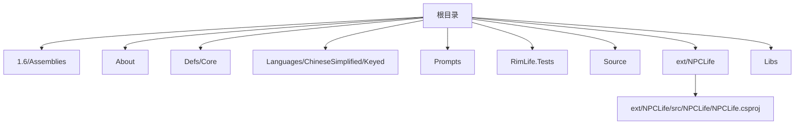
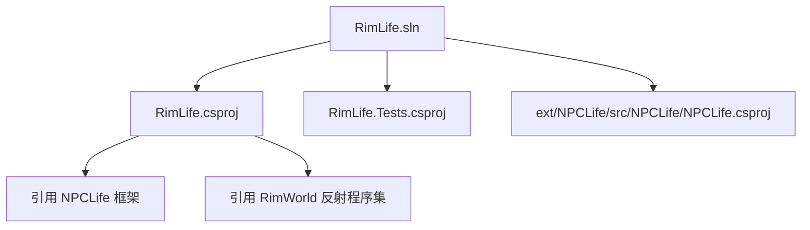
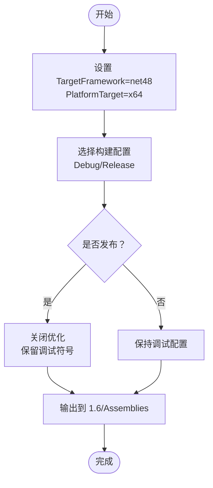
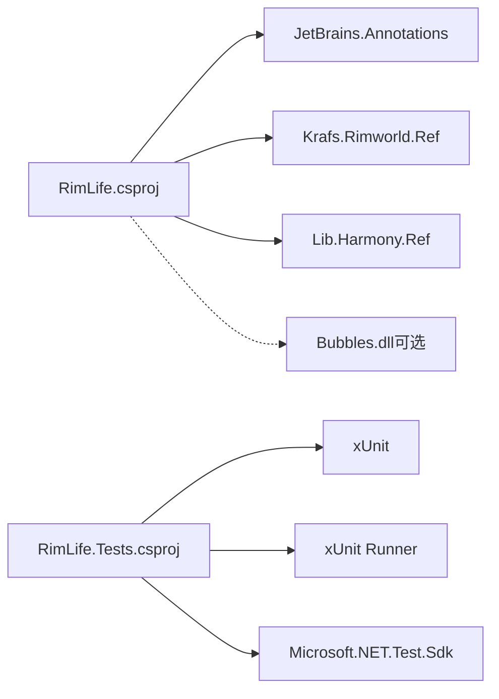
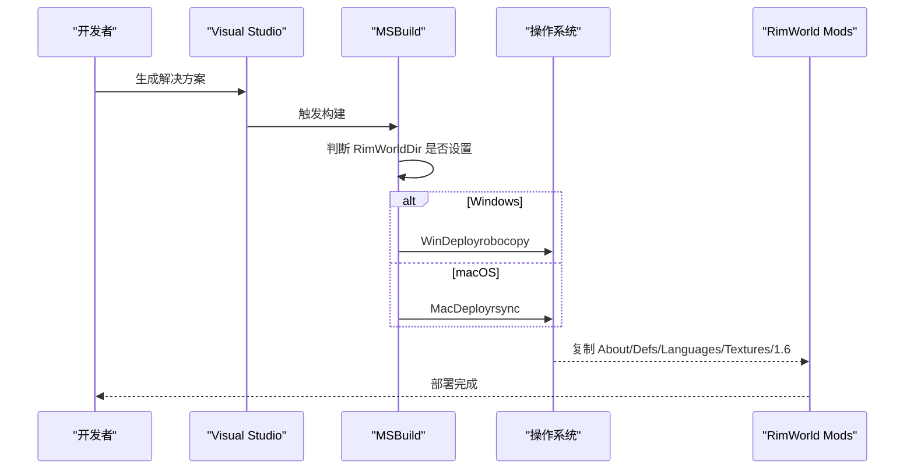

# 开发环境搭建

<cite>
**本文引用的文件**
- [RimLife.csproj](file://RimLife.csproj)
- [RimLife.sln](file://RimLife.sln)
- [nuget.config](file://nuget.config)
- [.gitmodules](file://.gitmodules)
- [dotnet-tools.json](file://dotnet-tools.json)
- [RimLife.Tests.csproj](file://RimLife.Tests\RimLife.Tests.csproj)
- [NPCLife.csproj](file://ext\NPCLife\src\NPCLife\NPCLife.csproj)
- [RimLifeMod.cs](file://Source\Settings\RimLifeMod.cs)
- [About.xml](file://About\About.xml)
- [Bubbles.ps1](file://Libs\Bubbles.ps1)
- [Bubbles.sh](file://Libs\Bubbles.sh)
</cite>

## 目录
1. [简介](#简介)
2. [系统要求与前置条件](#系统要求与前置条件)
3. [项目结构概览](#项目结构概览)
4. [开发工具与IDE设置](#开发工具与ide设置)
5. [克隆与依赖初始化](#克隆与依赖初始化)
6. [解决方案与项目结构](#解决方案与项目结构)
7. [构建配置与模式](#构建配置与模式)
8. [NuGet包管理与外部依赖](#nuget包管理与外部依赖)
9. [部署到RimWorld客户端](#部署到rimworld客户端)
10. [常见问题排查](#常见问题排查)
11. [性能与最佳实践](#性能与最佳实践)
12. [结论](#结论)

## 简介
本指南面向开发者，帮助你在本地快速搭建 RimLife 模组的开发环境。内容涵盖系统要求、前置条件、项目克隆与依赖初始化、解决方案结构、构建配置、NuGet 包管理、部署流程以及常见问题排查。RimLife 是基于 .NET Framework 4.8 的 RimWorld 模组，使用 Visual Studio 进行开发，并通过子模块引入 NPCLife 框架。

## 系统要求与前置条件
- 操作系统
  - Windows：推荐 Windows 10/11，支持 rsync/robocopy 部署脚本。
  - macOS：需要安装 rsync，用于自动部署到 Mods 目录。
- .NET Framework 4.8
  - 项目目标框架为 net48，需确保系统已安装 .NET Framework 4.8。
- Visual Studio
  - 使用 Visual Studio 2022 或更高版本打开解决方案文件进行开发与调试。
- RimWorld SDK
  - 通过 NuGet 引入 RimWorld 反射程序集（Krafs.Rimworld.Ref），无需手动拷贝 DLL。
- 可选：Bubbles 交互气泡库
  - 若启用 EnableBubbles，则需要 Libs/Bubbles.dll；可通过 PowerShell 或 Shell 脚本自动下载与提取。

章节来源
- [RimLife.csproj:3-18](file://RimLife.csproj#L3-L18)
- [RimLife.csproj:53-58](file://RimLife.csproj#L53-L58)

## 项目结构概览
- 根目录包含模组元数据、定义、语言文件、提示词、测试项目与源码。
- ext/NPCLife 为子模块，提供通用 NPC/叙事框架能力。
- Libs 提供 Bubbles 的自动下载脚本（PowerShell 与 Shell）。
- 1.6/Assemblies 输出目录按游戏版本组织。

图表来源
- [RimLife.csproj:47-50](file://RimLife.csproj#L47-L50)
- [About.xml:1-13](file://About\About.xml#L1-L13)

章节来源
- [RimLife.csproj:1-120](file://RimLife.csproj#L1-L120)
- [RimLife.sln:1-71](file://RimLife.sln#L1-L71)

## 开发工具与IDE设置
- 推荐使用 Visual Studio 2022+ 打开解决方案文件进行开发与调试。
- 在解决方案中包含以下项目：
  - RimLife（主模组）
  - RimLife.Tests（单元测试）
  - ext/NPCLife（子模块框架）
- 建议启用“仅生成测试项目”或“全部生成”，以便在调试时同时构建测试与主项目。

章节来源
- [RimLife.sln:6-13](file://RimLife.sln#L6-L13)

## 克隆与依赖初始化
- 克隆仓库后，初始化并更新子模块以获取 NPCLife 框架：
  - git submodule update --init --recursive
- 若首次克隆缺少子模块，请先执行上述命令。
- 如需更新子模块至最新版本：
  - git submodule update --remote --merge

章节来源
- [.gitmodules:1-4](file://.gitmodules#L1-L4)

## 解决方案与项目结构
- 解决方案文件包含三个主要项目：
  - RimLife.csproj：主模组项目，目标框架 net48，输出到 1.6/Assemblies。
  - RimLife.Tests.csproj：单元测试项目，引用主项目。
  - ext/NPCLife：NPCLife 框架项目，作为子模块被主项目引用。
- 构建配置平台支持 Any CPU、x86、x64，调试与发布均可用。

图表来源
- [RimLife.sln:6-13](file://RimLife.sln#L6-L13)
- [RimLife.csproj:47-50](file://RimLife.csproj#L47-L50)
- [NPCLife.csproj:1-38](file://ext\NPCLife\src\NPCLife\NPCLife.csproj#L1-L38)

章节来源
- [RimLife.sln:1-71](file://RimLife.sln#L1-L71)
- [RimLife.csproj:47-50](file://RimLife.csproj#L47-L50)

## 构建配置与模式
- 目标框架与平台
  - 主项目目标框架：net48，平台 x64。
  - 测试项目目标框架：net48，平台 x64。
  - NPCLife 框架支持多目标框架（net48;netstandard2.0）。
- 调试与发布差异
  - 发布模式下优化关闭但保留调试符号，生成程序集信息可禁用。
  - 测试项目默认启用测试特性标记。
- 版本常量
  - 通过 GameVersion 动态定义编译常量 V1_6 等，便于版本分支逻辑。

图表来源
- [RimLife.csproj:3-18](file://RimLife.csproj#L3-L18)
- [RimLife.csproj:25-30](file://RimLife.csproj#L25-L30)
- [RimLife.Tests.csproj:3-11](file://RimLife.Tests\RimLife.Tests.csproj#L3-L11)
- [NPCLife.csproj:3-15](file://ext\NPCLife\src\NPCLife\NPCLife.csproj#L3-L15)

章节来源
- [RimLife.csproj:3-30](file://RimLife.csproj#L3-L30)
- [RimLife.Tests.csproj:3-11](file://RimLife.Tests\RimLife.Tests.csproj#L3-L11)
- [NPCLife.csproj:3-21](file://ext\NPCLife\src\NPCLife\NPCLife.csproj#L3-L21)

## NuGet包管理与外部依赖
- 包源配置
  - nuget.config 清空默认源并指定 nuget.org 作为唯一源。
- 主项目依赖
  - JetBrains.Annotations：注解与静态分析支持。
  - Krafs.Rimworld.Ref：RimWorld 反射程序集（随 GameVersion 动态版本）。
  - Lib.Harmony.Ref：Harmony API 反射程序集。
- 测试项目依赖
  - xUnit、xUnit Runner、Microsoft.NET.Test.Sdk。
- 外部库
  - Bubbles：可选交互气泡库，通过 Libs/Bubbles.dll 提供；可通过 PowerShell/Shell 脚本自动下载与提取。

图表来源
- [RimLife.csproj:52-58](file://RimLife.csproj#L52-L58)
- [RimLife.Tests.csproj:13-17](file://RimLife.Tests\RimLife.Tests.csproj#L13-L17)
- [nuget.config:1-8](file://nuget.config#L1-L8)
- [Bubbles.ps1:1-56](file://Libs\Bubbles.ps1#L1-L56)
- [Bubbles.sh:1-56](file://Libs\Bubbles.sh#L1-L56)

章节来源
- [RimLife.csproj:52-58](file://RimLife.csproj#L52-L58)
- [RimLife.Tests.csproj:13-17](file://RimLife.Tests\RimLife.Tests.csproj#L13-L17)
- [nuget.config:1-8](file://nuget.config#L1-L8)

## 部署到RimWorld客户端
- 自动部署
  - 构建完成后，若设置了 RimWorldDir 环境变量，MSBuild 目标会自动将 About、Defs、Languages、Textures 与 1.6 目录复制到客户端 Mods/RimLife。
- 平台差异
  - Windows：使用 robocopy。
  - macOS：使用 rsync。
- 手动部署
  - 若未设置 RimWorldDir 或需要自定义路径，可手动将输出目录内容复制到对应 Mods/RimLife。

图表来源
- [RimLife.csproj:76-112](file://RimLife.csproj#L76-L112)

章节来源
- [RimLife.csproj:76-112](file://RimLife.csproj#L76-L112)

## 常见问题排查
- 子模块未初始化
  - 现象：无法找到 ext/NPCLife。
  - 处理：执行 git submodule update --init --recursive。
- 缺少 Bubbles.dll
  - 现象：启用 EnableBubbles 后编译失败。
  - 处理：运行 Libs/Bubbles.ps1（Windows）或 Libs/Bubbles.sh（macOS/Linux）自动下载并提取。
- 无法连接 NuGet 源
  - 现象：包还原失败。
  - 处理：确认 nuget.config 指向 nuget.org；检查网络代理与防火墙。
- 部署失败（RimWorldDir 未设置）
  - 现象：构建成功但未复制到 Mods。
  - 处理：设置 RIMWORLD_DIR 环境变量指向 RimWorld 安装目录，或手动复制。
- 平台不匹配
  - 现象：运行时加载错误。
  - 处理：确保 PlatformTarget 为 x64，且目标机器为 64 位。

章节来源
- [.gitmodules:1-4](file://.gitmodules#L1-L4)
- [Bubbles.ps1:1-56](file://Libs\Bubbles.ps1#L1-L56)
- [Bubbles.sh:1-56](file://Libs\Bubbles.sh#L1-L56)
- [nuget.config:1-8](file://nuget.config#L1-L8)
- [RimLife.csproj:12-14](file://RimLife.csproj#L12-L14)

## 性能与最佳实践
- 使用 Release 配置进行性能测试与打包，保留调试符号以便回溯。
- 将测试项目与主项目一起生成，避免测试引用缺失。
- 保持子模块更新同步，定期执行 git submodule update --remote --merge。
- 在 CI 环境中固定 NuGet 源与包版本，减少构建波动。

## 结论
按照本指南完成系统要求准备、项目克隆与子模块初始化、解决方案打开与构建配置后，你即可在 Visual Studio 中进行 RimLife 模组的开发与调试。通过自动部署目标，你可以快速将构建产物部署到 RimWorld 客户端 Mods 目录，配合 Bubbles 脚本与 NuGet 包管理器，确保开发环境稳定可靠。