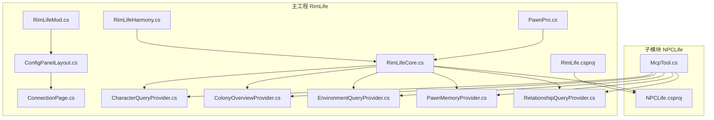
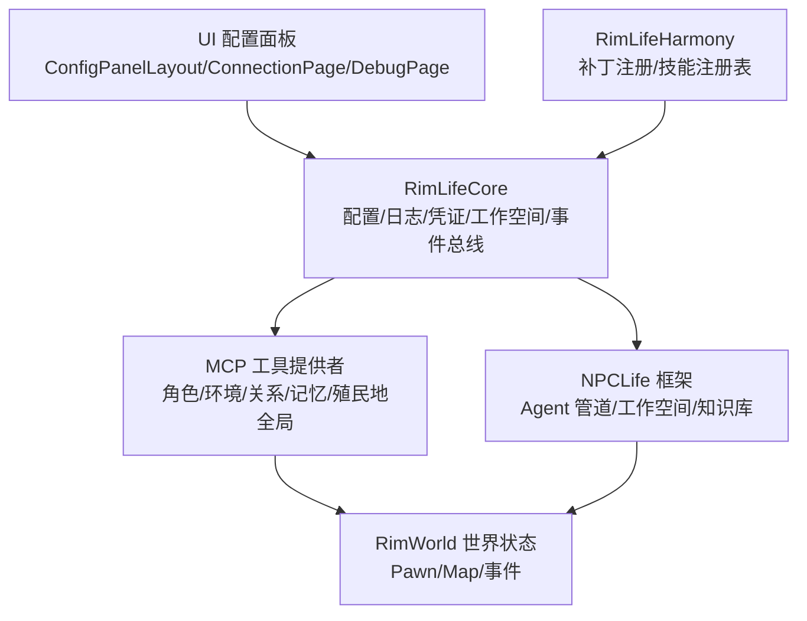
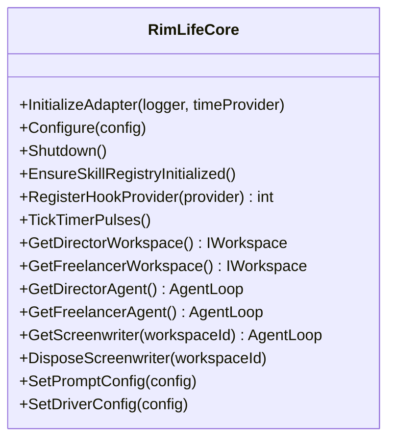
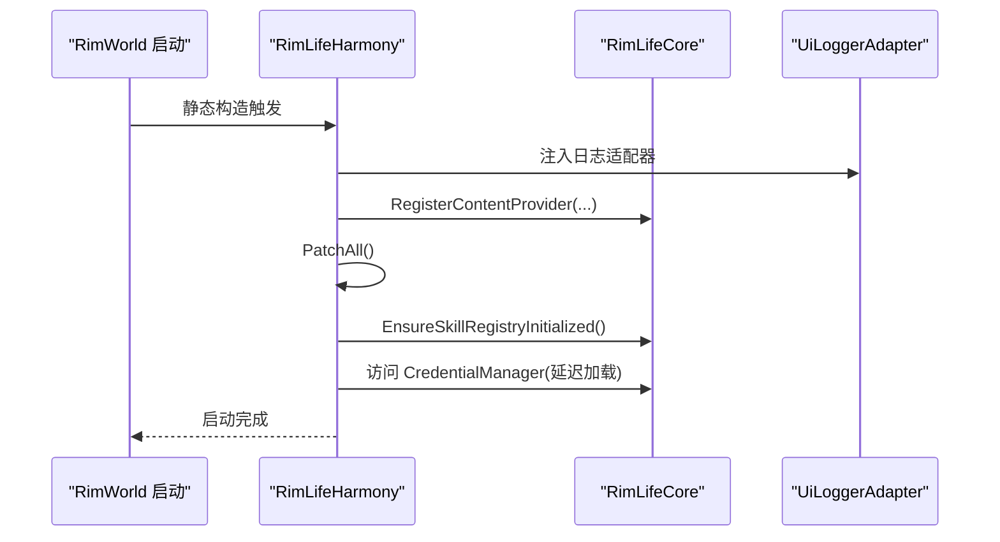
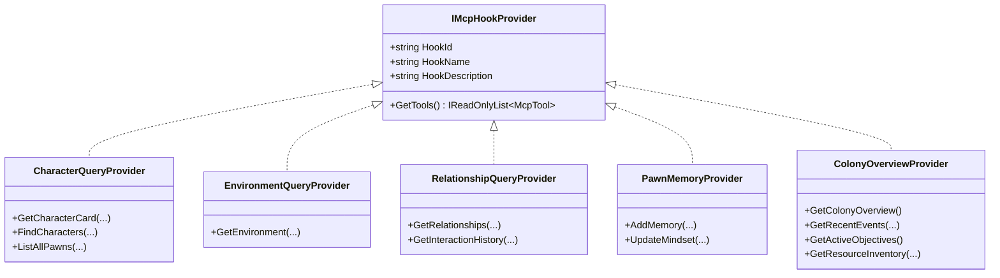
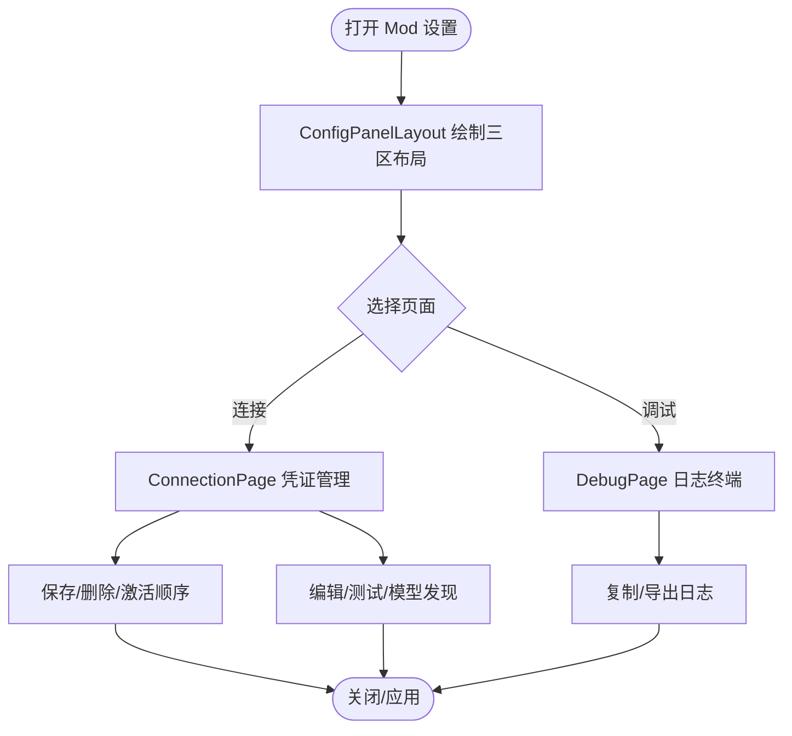
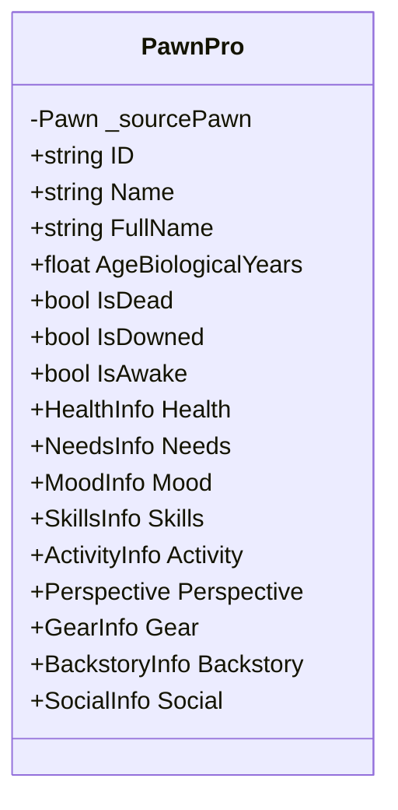
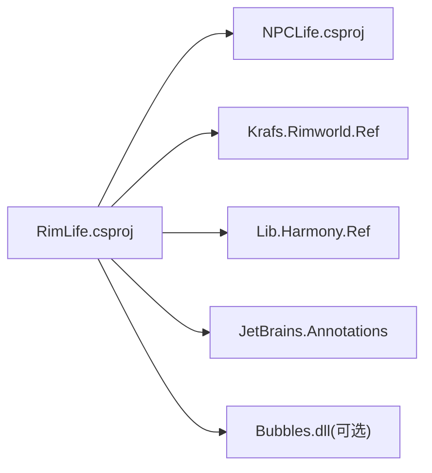
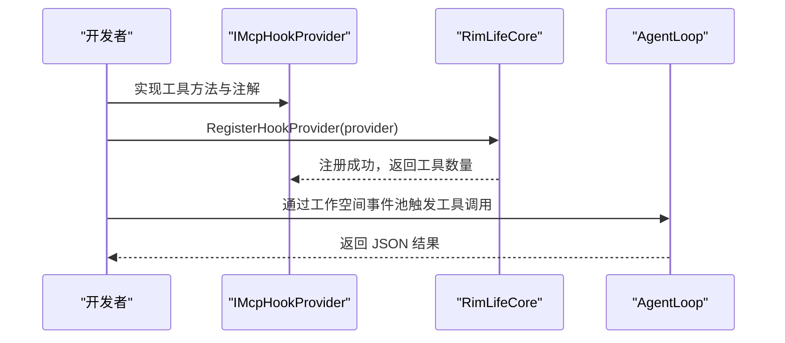

# 开发者指南

<cite>
**本文引用的文件**
- [RimLife.csproj](file://RimLife.csproj)
- [NPCLife.csproj](file://ext\NPCLife\src\NPCLife\NPCLife.csproj)
- [RimLifeMod.cs](file://Source\Settings\RimLifeMod.cs)
- [RimLifeCore.cs](file://Source\Infrastructure\RimLifeCore.cs)
- [RimLifeHarmony.cs](file://Source\Infrastructure\RimLifeHarmony.cs)
- [CharacterQueryProvider.cs](file://Source\Infrastructure\Mcp\CharacterQueryProvider.cs)
- [ColonyOverviewProvider.cs](file://Source\Infrastructure\Mcp\ColonyOverviewProvider.cs)
- [EnvironmentQueryProvider.cs](file://Source\Infrastructure\Mcp\EnvironmentQueryProvider.cs)
- [PawnMemoryProvider.cs](file://Source\Infrastructure\Mcp\PawnMemoryProvider.cs)
- [RelationshipQueryProvider.cs](file://Source\Infrastructure\Mcp\RelationshipQueryProvider.cs)
- [ConfigPanelLayout.cs](file://Source\UI\ConfigPanelLayout.cs)
- [ConnectionPage.cs](file://Source\UI\Pages\ConnectionPage.cs)
- [DebugPage.cs](file://Source\UI\Pages\DebugPage.cs)
- [PawnPro.cs](file://Source\Data\PawnPro\PawnPro.cs)
- [McpTool.cs](file://ext\NPCLife\src\NPCLife\Framework\Mcp\McpTool.cs)
</cite>

## 目录
1. [简介](#简介)
2. [项目结构](#项目结构)
3. [核心组件](#核心组件)
4. [架构总览](#架构总览)
5. [详细组件分析](#详细组件分析)
6. [依赖分析](#依赖分析)
7. [性能考虑](#性能考虑)
8. [故障排查指南](#故障排查指南)
9. [结论](#结论)
10. [附录](#附录)

## 简介
本指南面向 RimLife 项目的开发者，系统阐述项目结构、代码组织原则、模块职责与依赖关系，提供开发环境搭建、调试技巧与工作流、扩展开发（MCP 工具、会话管理器、自定义事件处理器）、代码规范与最佳实践，并结合 Harmony 补丁与热补丁机制给出性能优化与内存管理建议。

## 项目结构
RimLife 采用“主工程 + 子模块（NPCLife）”的双工程组织方式：
- 主工程 RimLife：面向 RimWorld 的适配层、UI、MCP 提供者、Harmony 补丁与生命周期管理。
- 子模块 NPCLife：通用的 LLM 驱动叙事框架，提供 Agent 管道、MCP 工具协议、工作空间与知识库抽象。

**图表来源**
- [RimLife.csproj:48-50](file://RimLife.csproj#L48-L50)
- [NPCLife.csproj:1-38](file://ext\NPCLife\src\NPCLife\NPCLife.csproj#L1-L38)
- [RimLifeCore.cs:1-120](file://Source\Infrastructure\RimLifeCore.cs#L1-L120)
- [RimLifeHarmony.cs:1-60](file://Source\Infrastructure\RimLifeHarmony.cs#L1-L60)
- [RimLifeMod.cs:1-69](file://Source\Settings\RimLifeMod.cs#L1-L69)
- [ConfigPanelLayout.cs:1-217](file://Source\UI\ConfigPanelLayout.cs#L1-L217)
- [ConnectionPage.cs:1-1117](file://Source\UI\Pages\ConnectionPage.cs#L1-L1117)
- [CharacterQueryProvider.cs:1-256](file://Source\Infrastructure\Mcp\CharacterQueryProvider.cs#L1-L256)
- [ColonyOverviewProvider.cs:1-185](file://Source\Infrastructure\Mcp\ColonyOverviewProvider.cs#L1-L185)
- [EnvironmentQueryProvider.cs:1-51](file://Source\Infrastructure\Mcp\EnvironmentQueryProvider.cs#L1-L51)
- [PawnMemoryProvider.cs:1-94](file://Source\Infrastructure\Mcp\PawnMemoryProvider.cs#L1-L94)
- [RelationshipQueryProvider.cs:1-81](file://Source\Infrastructure\Mcp\RelationshipQueryProvider.cs#L1-L81)
- [PawnPro.cs:1-138](file://Source\Data\PawnPro\PawnPro.cs#L1-L138)
- [McpTool.cs:1-40](file://ext\NPCLife\src\NPCLife\Framework\Mcp\McpTool.cs#L1-L40)

**章节来源**
- [RimLife.csproj:1-120](file://RimLife.csproj#L1-L120)
- [NPCLife.csproj:1-38](file://ext\NPCLife\src\NPCLife\NPCLife.csproj#L1-L38)

## 核心组件
- 适配层与服务定位器：RimLifeCore 提供统一配置、日志、凭证、工作空间、知识库、脚本交付、事件总线、生命周期管理与运行时指标等全局服务入口。
- Harmony 补丁与启动：RimLifeHarmony 在静态构造中注册补丁、初始化 MCP 技能注册表、注入 UI 日志适配器并延迟加载凭证管理器。
- UI 配置面板：ConfigPanelLayout 统一三区布局（侧栏/内容/状态栏），ConnectionPage 管理 LLM 凭证与模型发现，DebugPage 提供日志终端。
- MCP 工具提供者：围绕角色、环境、关系、记忆与殖民地全局提供一组 Hook Provider，统一收敛到 McpTool。

**章节来源**
- [RimLifeCore.cs:24-310](file://Source\Infrastructure\RimLifeCore.cs#L24-L310)
- [RimLifeHarmony.cs:11-58](file://Source\Infrastructure\RimLifeHarmony.cs#L11-L58)
- [ConfigPanelLayout.cs:15-217](file://Source\UI\ConfigPanelLayout.cs#L15-L217)
- [ConnectionPage.cs:22-90](file://Source\UI\Pages\ConnectionPage.cs#L22-L90)
- [DebugPage.cs:14-175](file://Source\UI\Pages\DebugPage.cs#L14-L175)
- [McpTool.cs:14-38](file://ext\NPCLife\src\NPCLife\Framework\Mcp\McpTool.cs#L14-L38)

## 架构总览
RimLife 的运行时架构以 RimLifeCore 为中心，向上承载 UI 与 MCP 工具，向下对接 NPCLife 框架与 RimWorld 世界状态。Harmony 在启动阶段完成补丁注册与技能注册表初始化，随后根据配置与存档状态构建 Agent 管道与工作空间。

**图表来源**
- [RimLifeCore.cs:120-310](file://Source\Infrastructure\RimLifeCore.cs#L120-L310)
- [RimLifeHarmony.cs:16-48](file://Source\Infrastructure\RimLifeHarmony.cs#L16-L48)
- [CharacterQueryProvider.cs:17-31](file://Source\Infrastructure\Mcp\CharacterQueryProvider.cs#L17-L31)
- [ColonyOverviewProvider.cs:18-33](file://Source\Infrastructure\Mcp\ColonyOverviewProvider.cs#L18-L33)
- [EnvironmentQueryProvider.cs:13-25](file://Source\Infrastructure\Mcp\EnvironmentQueryProvider.cs#L13-L25)
- [PawnMemoryProvider.cs:14-27](file://Source\Infrastructure\Mcp\PawnMemoryProvider.cs#L14-L27)
- [RelationshipQueryProvider.cs:14-27](file://Source\Infrastructure\Mcp\RelationshipQueryProvider.cs#L14-L27)

## 详细组件分析

### 组件 A：核心服务定位器 RimLifeCore
- 职责：全局配置、日志、凭证、工作空间、知识库、脚本交付、事件总线、生命周期管理、运行时指标。
- 关键流程：EnsureSkillRegistryInitialized 注册系统与游戏侧 Hook Provider；TickTimerPulses 全局时钟脉冲驱动；Agent 获取与创建；提示词与驱动配置持久化。
- 性能要点：延迟加载与幂等初始化；缓存与锁保护；事件订阅与度量采集。

**图表来源**
- [RimLifeCore.cs:24-310](file://Source\Infrastructure\RimLifeCore.cs#L24-L310)

**章节来源**
- [RimLifeCore.cs:24-310](file://Source\Infrastructure\RimLifeCore.cs#L24-L310)

### 组件 B：Harmony 补丁与启动
- 职责：集中注册 Harmony 补丁；注册人物卡内容提供者钩子；初始化 MCP 技能注册表；注入 UI 日志适配器；延迟加载凭证管理器。
- 注意：静态构造失败会记录错误并抛出异常，确保启动链路可见性。

**图表来源**
- [RimLifeHarmony.cs:16-48](file://Source\Infrastructure\RimLifeHarmony.cs#L16-L48)

**章节来源**
- [RimLifeHarmony.cs:11-58](file://Source\Infrastructure\RimLifeHarmony.cs#L11-L58)

### 组件 C：MCP 工具提供者（角色/环境/关系/记忆/殖民地全局）
- 职责：将 RimWorld 世界状态映射为 MCP 工具，供 LLM 调用。
- 设计：IMcpHookProvider 接口统一注册；McpTool.FromMethod 反射包装；参数注解与 Required 标记；错误捕获与日志警告。
- 示例工具：
  - 角色查询：获取人物卡、按条件筛选、列举全部。
  - 环境感知：获取角色当前环境信息。
  - 关系网络：查询社交关系与交互历史。
  - 个体记忆：追加短期记忆与更新即时心境。
  - 殖民地全局：概览、近期事件、活跃目标、资源库存。

**图表来源**
- [CharacterQueryProvider.cs:17-31](file://Source\Infrastructure\Mcp\CharacterQueryProvider.cs#L17-L31)
- [EnvironmentQueryProvider.cs:13-25](file://Source\Infrastructure\Mcp\EnvironmentQueryProvider.cs#L13-L25)
- [RelationshipQueryProvider.cs:14-27](file://Source\Infrastructure\Mcp\RelationshipQueryProvider.cs#L14-L27)
- [PawnMemoryProvider.cs:14-27](file://Source\Infrastructure\Mcp\PawnMemoryProvider.cs#L14-L27)
- [ColonyOverviewProvider.cs:18-33](file://Source\Infrastructure\Mcp\ColonyOverviewProvider.cs#L18-L33)

**章节来源**
- [CharacterQueryProvider.cs:17-256](file://Source\Infrastructure\Mcp\CharacterQueryProvider.cs#L17-L256)
- [EnvironmentQueryProvider.cs:13-51](file://Source\Infrastructure\Mcp\EnvironmentQueryProvider.cs#L13-L51)
- [RelationshipQueryProvider.cs:14-81](file://Source\Infrastructure\Mcp\RelationshipQueryProvider.cs#L14-L81)
- [PawnMemoryProvider.cs:14-94](file://Source\Infrastructure\Mcp\PawnMemoryProvider.cs#L14-L94)
- [ColonyOverviewProvider.cs:18-185](file://Source\Infrastructure\Mcp\ColonyOverviewProvider.cs#L18-L185)

### 组件 D：UI 配置面板与调试
- ConfigPanelLayout：三区布局（侧栏导航/内容区/状态栏），支持页面切换与滚动高度追踪。
- ConnectionPage：凭证卡片管理（增删改查）、激活顺序、模型发现与测试、编辑缓冲区与状态提示。
- DebugPage：终端风格日志查看器，支持清空、自动滚动、复制与导出。

**图表来源**
- [ConfigPanelLayout.cs:60-215](file://Source\UI\ConfigPanelLayout.cs#L60-L215)
- [ConnectionPage.cs:77-90](file://Source\UI\Pages\ConnectionPage.cs#L77-L90)
- [DebugPage.cs:27-80](file://Source\UI\Pages\DebugPage.cs#L27-L80)

**章节来源**
- [ConfigPanelLayout.cs:15-217](file://Source\UI\ConfigPanelLayout.cs#L15-L217)
- [ConnectionPage.cs:22-1117](file://Source\UI\Pages\ConnectionPage.cs#L22-L1117)
- [DebugPage.cs:14-175](file://Source\UI\Pages\DebugPage.cs#L14-L175)

### 组件 E：数据快照与延迟加载（PawnPro）
- 职责：为 Pawn 提供轻量级代理，包含基本元数据与延迟加载的健康、需求、心情、技能、活动、视角、装备、背景、社交等模块。
- 特点：构造成本低，昂贵计算按需执行；非实时一致性，适合描述性/叙事用途。

**图表来源**
- [PawnPro.cs:44-138](file://Source\Data\PawnPro\PawnPro.cs#L44-L138)

**章节来源**
- [PawnPro.cs:1-138](file://Source\Data\PawnPro\PawnPro.cs#L1-L138)

## 依赖分析
- 项目依赖
  - RimLife.csproj 引用 ext\NPCLife\src\NPCLife\NPCLife.csproj。
  - 引入 JetBrains.Annotations、Krafs.Rimworld.Ref、Lib.Harmony.Ref。
  - 支持 EnableBubbles 条件编译与部署到 RimWorld Mods 目录。
- 子模块依赖
  - NPCLife.csproj 引入 System.Net.Http，提供网络请求能力。
- 组件耦合
  - RimLifeCore 与 NPCLife 框架强耦合（Agent 管道、工作空间、知识库、事件总线）。
  - MCP 工具提供者通过 IMcpHookProvider 与 RimLifeCore 技能注册表解耦。
  - UI 通过 ConfigPanelLayout 与具体页面解耦。

**图表来源**
- [RimLife.csproj:47-71](file://RimLife.csproj#L47-L71)
- [NPCLife.csproj:23-29](file://ext\NPCLife\src\NPCLife\NPCLife.csproj#L23-L29)

**章节来源**
- [RimLife.csproj:47-71](file://RimLife.csproj#L47-L71)
- [NPCLife.csproj:1-38](file://ext\NPCLife\src\NPCLife\NPCLife.csproj#L1-L38)

## 性能考虑
- 延迟初始化与幂等：EnsureSkillRegistryInitialized、DriverConfig/PromptConfig 的延迟加载与锁保护，避免重复初始化。
- 缓存与序列化：JsonWriter/JsonHelper 降低序列化开销；CardSerializer 用于 MCP 输出复用。
- 事件与度量：事件总线订阅与运行时指标采集，注意避免高频事件风暴；必要时增加采样或阈值。
- UI 与主线程：ConfigPanelLayout 在主页每帧 Drain 主线程队列，确保异步回调（模型发现、凭证测试）及时执行。
- 内存管理：PawnPro 的延迟加载模块按需计算并缓存；日志缓冲区限制大小，避免无限增长。

[本节为通用指导，无需特定文件引用]

## 故障排查指南
- 启动失败
  - 检查 Harmony 静态构造日志，定位注册补丁或技能初始化异常。
  - 确认日志适配器已注入，UI 能显示错误信息。
- 凭证与模型
  - 使用 ConnectionPage 的“测试连接”与“获取模型列表”，观察状态指示器与错误提示。
  - 确认 BaseURL、API Key、ProviderType 正确，模型名与激活顺序一致。
- MCP 工具调用
  - 检查工具定义与参数注解，确保 Required 字段满足；捕获异常并查看日志警告。
- 日志分析
  - 使用 DebugPage 的“复制全部/导出日志”功能，按时间戳与类型筛选问题。
  - 关注运行时指标（会话数、Token 消耗、工作空间操作计数）以定位瓶颈。

**章节来源**
- [RimLifeHarmony.cs:48-56](file://Source\Infrastructure\RimLifeHarmony.cs#L48-L56)
- [ConnectionPage.cs:370-409](file://Source\UI\Pages\ConnectionPage.cs#L370-L409)
- [DebugPage.cs:107-155](file://Source\UI\Pages\DebugPage.cs#L107-L155)
- [CharacterQueryProvider.cs:55-59](file://Source\Infrastructure\Mcp\CharacterQueryProvider.cs#L55-L59)

## 结论
RimLife 通过清晰的适配层与通用框架分离，实现了 RimWorld 与 LLM 叙事系统的深度集成。Harmony 补丁与 MCP 工具提供者构成了可扩展的外部接口，配合完善的 UI 配置与日志体系，为开发者提供了良好的扩展与调试体验。遵循本文的开发与扩展指南，可高效构建高质量的 MCP 工具与会话管理器。

[本节为总结，无需特定文件引用]

## 附录

### 开发环境搭建
- 工具与 SDK
  - .NET Framework 4.8（TargetFramework net48）
  - RimWorld 游戏目录变量（RIMWORLD_DIR）与版本号（GameVersion）
  - Harmony API（Lib.Harmony.Ref）
  - JetBrains.Annotations
- 依赖安装
  - 通过 NuGet 安装上述包引用
  - 子模块 NPCLife 作为项目引用
- 部署
  - 通过 MSBuild 目标自动部署到 Mods/RimLife 目录（Windows/macOS）

**章节来源**
- [RimLife.csproj:3-18](file://RimLife.csproj#L3-L18)
- [RimLife.csproj:53-71](file://RimLife.csproj#L53-L71)

### 调试技巧与工作流
- 断点设置
  - Harmony 静态构造与 PatchAll 调用点
  - RimLifeCore.EnsureSkillRegistryInitialized 中的 HookProvider 注册
  - MCP 工具方法入口（参数解析与调用）
- 日志分析
  - 使用 DebugPage 终端查看增量日志
  - 导出日志到剪贴板以便问题上报
- 性能分析
  - 启用运行时指标（会话数、Token 消耗、工作空间操作）
  - 关注高频事件与序列化路径

**章节来源**
- [RimLifeHarmony.cs:16-48](file://Source\Infrastructure\RimLifeHarmony.cs#L16-L48)
- [RimLifeCore.cs:248-307](file://Source\Infrastructure\RimLifeCore.cs#L248-L307)
- [DebugPage.cs:107-155](file://Source\UI\Pages\DebugPage.cs#L107-L155)

### 扩展开发指南
- 添加新的 MCP 工具
  - 实现 IMcpHookProvider，返回 McpTool 列表
  - 使用 [McpTool] 与 [McpParam] 注解声明工具定义
  - 通过 RimLifeCore.RegisterHookProvider 注册
- 扩展会话管理器
  - 基于工作空间（Workspace）抽象，按角色（导演/编剧/自由职业者）创建 AgentLoop
  - 使用事件池（EventPool）驱动 Agent 循环
- 自定义事件处理器
  - 通过事件总线（EventBus）发布/订阅事件
  - 在合适的时机（如 SaveLoaded/SaveUnloaded）重置依赖存档的组件

**图表来源**
- [RimLifeCore.cs:344-360](file://Source\Infrastructure\RimLifeCore.cs#L344-L360)
- [McpTool.cs:28-37](file://ext\NPCLife\src\NPCLife\Framework\Mcp\McpTool.cs#L28-L37)

**章节来源**
- [RimLifeCore.cs:344-360](file://Source\Infrastructure\RimLifeCore.cs#L344-L360)
- [McpTool.cs:14-38](file://ext\NPCLife\src\NPCLife\Framework\Mcp\McpTool.cs#L14-L38)

### 代码规范与最佳实践
- 命名约定
  - 类型与方法使用 PascalCase；常量使用 UPPER_SNAKE_CASE
  - 文件名与目录名与功能模块一致（如 Infrastructure、UI、Mcp）
- 错误处理
  - 工具方法内捕获异常并记录警告日志
  - 配置校验失败时返回错误而非崩溃
- 并发与线程
  - UI 每帧 Drain 主线程队列，确保异步回调执行
  - 关键共享状态使用锁保护（如 PromptConfig、DriverConfig、技能注册表）
- 可维护性
  - 将复杂逻辑拆分为小方法，保持单一职责
  - 使用延迟加载与缓存减少开销

**章节来源**
- [CharacterQueryProvider.cs:55-59](file://Source\Infrastructure\Mcp\CharacterQueryProvider.cs#L55-L59)
- [RimLifeCore.cs:124-129](file://Source\Infrastructure\RimLifeCore.cs#L124-L129)
- [ConfigPanelLayout.cs:64-68](file://Source\UI\ConfigPanelLayout.cs#L64-L68)

### Harmony 补丁与热补丁机制
- 使用 Harmony 对 RimWorld 类型进行补丁注册，集中于静态构造中一次性完成
- 补丁扫描通过 PatchAll() 自动发现标记类
- 热补丁：通过替换/增强现有方法实现运行时行为变更，需谨慎处理副作用与兼容性

**章节来源**
- [RimLifeHarmony.cs:16-40](file://Source\Infrastructure\RimLifeHarmony.cs#L16-L40)