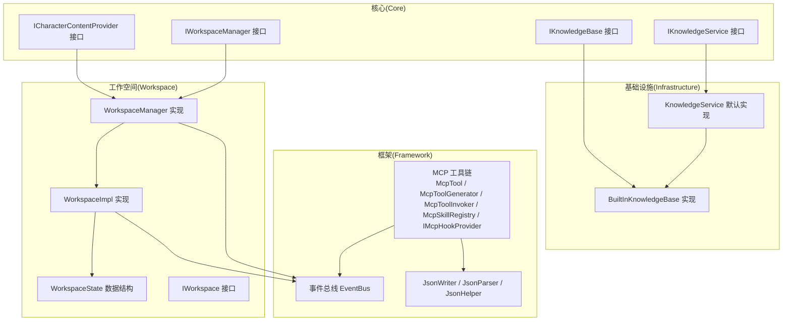
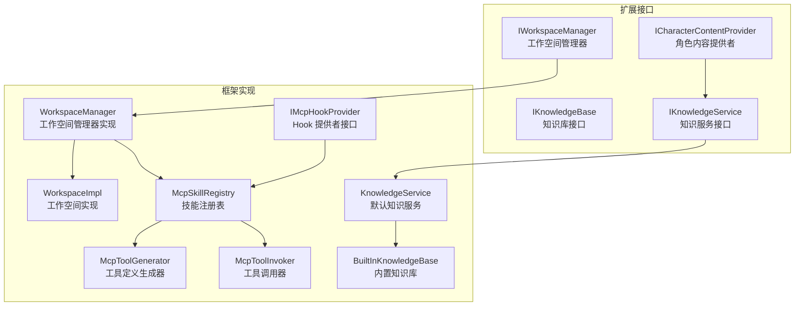
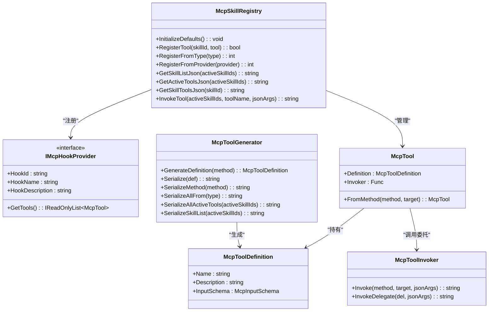
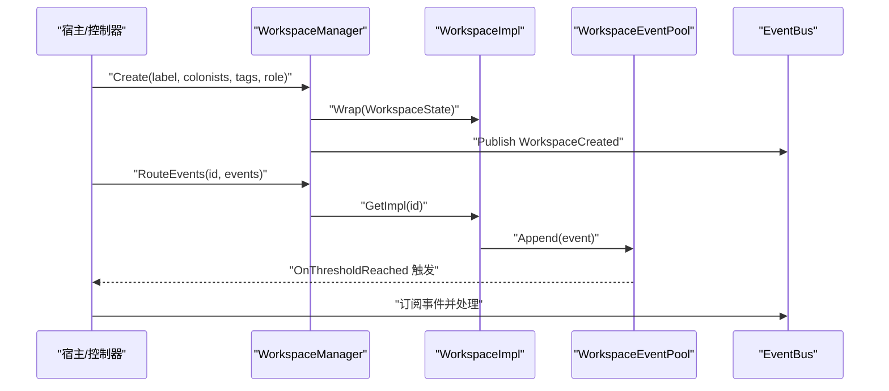
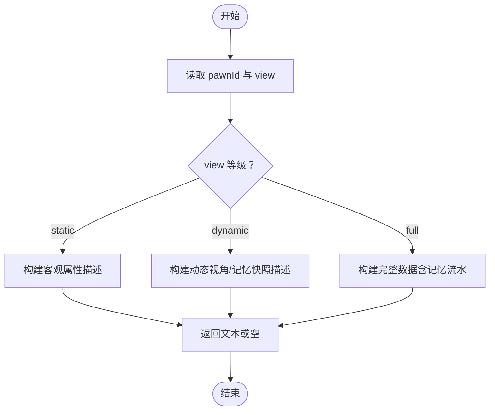
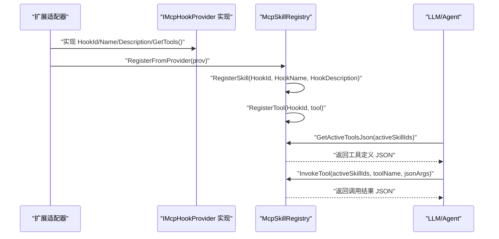
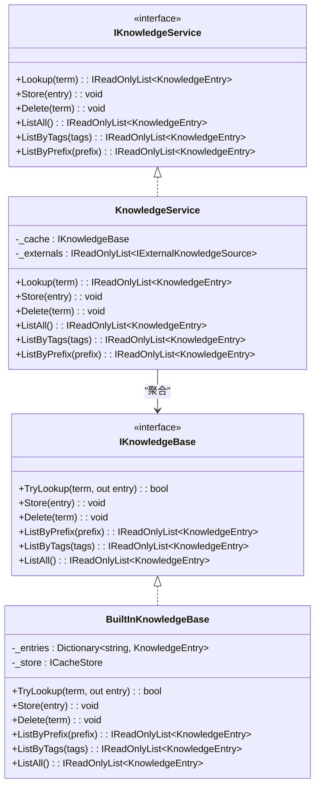
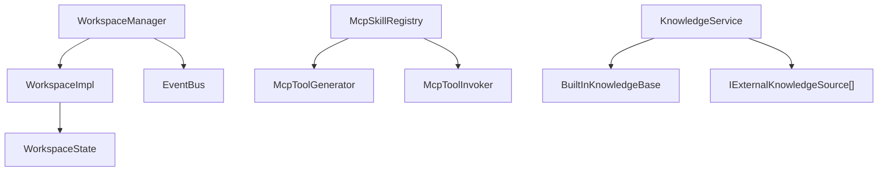

# 扩展开发指南

<cite>
**本文引用的文件**
- [ICharacterContentProvider.cs](file://ext/npclife/src/npclife/core/ICharacterContentProvider.cs)
- [IWorkspaceManager.cs](file://ext/npclife/src/npclife/core/IWorkspaceManager.cs)
- [WorkspaceManager.cs](file://ext/npclife/src/npclife/workspace/WorkspaceManager.cs)
- [IWorkspace.cs](file://ext/npclife/src/npclife/workspace/IWorkspace.cs)
- [WorkspaceImpl.cs](file://ext/npclife/src/npclife/workspace/WorkspaceImpl.cs)
- [WorkspaceState.cs](file://ext/npclife/src/npclife/workspace/WorkspaceState.cs)
- [McpTool.cs](file://ext/npclife/src/npclife/framework/mcp/McpTool.cs)
- [McpToolGenerator.cs](file://ext/npclife/src/npclife/framework/mcp/McpToolGenerator.cs)
- [McpToolInvoker.cs](file://ext/npclife/src/npclife/framework/mcp/McpToolInvoker.cs)
- [IMcpHookProvider.cs](file://ext/npclife/src/npclife/framework/mcp/IMcpHookProvider.cs)
- [McpSkillRegistry.cs](file://ext/npclife/src/npclife/framework/mcp/McpSkillRegistry.cs)
- [IKnowledgeBase.cs](file://ext/npclife/src/npclife/core/IKnowledgeBase.cs)
- [IKnowledgeService.cs](file://ext/npclife/src/npclife/core/IKnowledgeService.cs)
- [KnowledgeService.cs](file://ext/npclife/src/npclife/core/KnowledgeService.cs)
- [BuiltInKnowledgeBase.cs](file://ext/npclife/src/npclife/infrastructure/knowledge/BuiltInKnowledgeBase.cs)
</cite>

## 目录
1. [简介](#简介)
2. [项目结构](#项目结构)
3. [核心组件](#核心组件)
4. [架构总览](#架构总览)
5. [详细组件分析](#详细组件分析)
6. [依赖分析](#依赖分析)
7. [性能考量](#性能考量)
8. [故障排查指南](#故障排查指南)
9. [结论](#结论)
10. [附录](#附录)

## 简介
本指南面向希望在 NPCLife 扩展体系上进行二次开发的工程师，涵盖以下主题：
- 如何添加新的 MCP 工具：工具定义、参数映射与调用机制
- 扩展会话管理器（工作空间）的开发方法：工作空间扩展与事件处理器实现
- 自定义角色内容提供者（ICharacterContentProvider）的开发示例：数据提取与格式化规则
- Hook Provider 机制的使用与注册流程
- 知识库系统的扩展与自定义事件映射器
- 扩展点的发现与使用方法
- 扩展开发最佳实践与性能优化建议
- 扩展的打包与分发方式

## 项目结构
NPCLife 扩展体系位于 ext/npclife 目录，采用“核心接口 + 框架实现 + 基础设施”的分层设计：
- Core 层：定义扩展点接口（如 ICharacterContentProvider、IWorkspaceManager、IKnowledgeBase 等）
- Framework 层：MCP 工具链、事件总线、序列化与类型映射等通用能力
- Infrastructure 层：内置知识库、LLM 适配器、脚本投递等基础设施
- Workspace 层：工作空间管理器与工作空间实现，承载会话与事件流

图表来源
- [ICharacterContentProvider.cs:1-38](file://ext/npclife/src/npclife/core/ICharacterContentProvider.cs#L1-L38)
- [IWorkspaceManager.cs:1-58](file://ext/npclife/src/npclife/core/IWorkspaceManager.cs#L1-L58)
- [WorkspaceManager.cs:1-622](file://ext/npclife/src/npclife/workspace/WorkspaceManager.cs#L1-L622)
- [IWorkspace.cs:1-57](file://ext/npclife/src/npclife/workspace/IWorkspace.cs#L1-L57)
- [WorkspaceImpl.cs:1-199](file://ext/npclife/src/npclife/workspace/WorkspaceImpl.cs#L1-L199)
- [WorkspaceState.cs:1-162](file://ext/npclife/src/npclife/workspace/WorkspaceState.cs#L1-L162)
- [McpTool.cs:1-40](file://ext/npclife/src/npclife/framework/mcp/McpTool.cs#L1-L40)
- [McpToolGenerator.cs:1-214](file://ext/npclife/src/npclife/framework/mcp/McpToolGenerator.cs#L1-L214)
- [McpToolInvoker.cs:1-238](file://ext/npclife/src/npclife/framework/mcp/McpToolInvoker.cs#L1-L238)
- [IMcpHookProvider.cs:1-38](file://ext/npclife/src/npclife/framework/mcp/IMcpHookProvider.cs#L1-L38)
- [McpSkillRegistry.cs:1-470](file://ext/npclife/src/npclife/framework/mcp/McpSkillRegistry.cs#L1-L470)
- [IKnowledgeBase.cs:1-53](file://ext/npclife/src/npclife/core/IKnowledgeBase.cs#L1-L53)
- [IKnowledgeService.cs:1-36](file://ext/npclife/src/npclife/core/IKnowledgeService.cs#L1-L36)
- [KnowledgeService.cs:1-66](file://ext/npclife/src/npclife/core/KnowledgeService.cs#L1-L66)
- [BuiltInKnowledgeBase.cs:1-206](file://ext/npclife/src/npclife/infrastructure/knowledge/BuiltInKnowledgeBase.cs#L1-L206)

章节来源
- [ICharacterContentProvider.cs:1-38](file://ext/npclife/src/npclife/core/ICharacterContentProvider.cs#L1-L38)
- [IWorkspaceManager.cs:1-58](file://ext/npclife/src/npclife/core/IWorkspaceManager.cs#L1-L58)
- [WorkspaceManager.cs:1-622](file://ext/npclife/src/npclife/workspace/WorkspaceManager.cs#L1-L622)
- [IWorkspace.cs:1-57](file://ext/npclife/src/npclife/workspace/IWorkspace.cs#L1-L57)
- [WorkspaceImpl.cs:1-199](file://ext/npclife/src/npclife/workspace/WorkspaceImpl.cs#L1-L199)
- [WorkspaceState.cs:1-162](file://ext/npclife/src/npclife/workspace/WorkspaceState.cs#L1-L162)
- [McpTool.cs:1-40](file://ext/npclife/src/npclife/framework/mcp/McpTool.cs#L1-L40)
- [McpToolGenerator.cs:1-214](file://ext/npclife/src/npclife/framework/mcp/McpToolGenerator.cs#L1-L214)
- [McpToolInvoker.cs:1-238](file://ext/npclife/src/npclife/framework/mcp/McpToolInvoker.cs#L1-L238)
- [IMcpHookProvider.cs:1-38](file://ext/npclife/src/npclife/framework/mcp/IMcpHookProvider.cs#L1-L38)
- [McpSkillRegistry.cs:1-470](file://ext/npclife/src/npclife/framework/mcp/McpSkillRegistry.cs#L1-L470)
- [IKnowledgeBase.cs:1-53](file://ext/npclife/src/npclife/core/IKnowledgeBase.cs#L1-L53)
- [IKnowledgeService.cs:1-36](file://ext/npclife/src/npclife/core/IKnowledgeService.cs#L1-L36)
- [KnowledgeService.cs:1-66](file://ext/npclife/src/npclife/core/KnowledgeService.cs#L1-L66)
- [BuiltInKnowledgeBase.cs:1-206](file://ext/npclife/src/npclife/infrastructure/knowledge/BuiltInKnowledgeBase.cs#L1-L206)

## 核心组件
- 角色内容提供者接口 ICharacterContentProvider：用于按维度（健康、心情、技能等）输出自然语言描述，框架按 SectionName 组装为结构化 JSON
- 工作空间管理器 IWorkspaceManager 与实现 WorkspaceManager：负责工作空间的 CRUD、分支/合并、事件路由与持久化
- 工作空间接口 IWorkspace 与实现 WorkspaceImpl：封装 WorkspaceState，暴露事件池、技能槽与叙事操作
- MCP 工具链：McpTool、McpToolGenerator、McpToolInvoker、McpSkillRegistry、IMcpHookProvider，统一管理工具定义与调用
- 知识库接口 IKnowledgeBase 与服务 IKnowledgeService：默认实现 KnowledgeService 聚合内置知识库与外部只读源
- 内置知识库 BuiltInKnowledgeBase：唯一可写实现，基于字典缓存并持久化

章节来源
- [ICharacterContentProvider.cs:1-38](file://ext/npclife/src/npclife/core/ICharacterContentProvider.cs#L1-L38)
- [IWorkspaceManager.cs:1-58](file://ext/npclife/src/npclife/core/IWorkspaceManager.cs#L1-L58)
- [WorkspaceManager.cs:1-622](file://ext/npclife/src/npclife/workspace/WorkspaceManager.cs#L1-L622)
- [IWorkspace.cs:1-57](file://ext/npclife/src/npclife/workspace/IWorkspace.cs#L1-L57)
- [WorkspaceImpl.cs:1-199](file://ext/npclife/src/npclife/workspace/WorkspaceImpl.cs#L1-L199)
- [WorkspaceState.cs:1-162](file://ext/npclife/src/npclife/workspace/WorkspaceState.cs#L1-L162)
- [McpTool.cs:1-40](file://ext/npclife/src/npclife/framework/mcp/McpTool.cs#L1-L40)
- [McpToolGenerator.cs:1-214](file://ext/npclife/src/npclife/framework/mcp/McpToolGenerator.cs#L1-L214)
- [McpToolInvoker.cs:1-238](file://ext/npclife/src/npclife/framework/mcp/McpToolInvoker.cs#L1-L238)
- [IMcpHookProvider.cs:1-38](file://ext/npclife/src/npclife/framework/mcp/IMcpHookProvider.cs#L1-L38)
- [McpSkillRegistry.cs:1-470](file://ext/npclife/src/npclife/framework/mcp/McpSkillRegistry.cs#L1-L470)
- [IKnowledgeBase.cs:1-53](file://ext/npclife/src/npclife/core/IKnowledgeBase.cs#L1-L53)
- [IKnowledgeService.cs:1-36](file://ext/npclife/src/npclife/core/IKnowledgeService.cs#L1-L36)
- [KnowledgeService.cs:1-66](file://ext/npclife/src/npclife/core/KnowledgeService.cs#L1-L66)
- [BuiltInKnowledgeBase.cs:1-206](file://ext/npclife/src/npclife/infrastructure/knowledge/BuiltInKnowledgeBase.cs#L1-L206)

## 架构总览
下图展示了扩展开发的关键交互路径：角色内容提供者、工作空间、MCP 工具链与知识库之间的协作。

图表来源
- [ICharacterContentProvider.cs:1-38](file://ext/npclife/src/npclife/core/ICharacterContentProvider.cs#L1-L38)
- [IWorkspaceManager.cs:1-58](file://ext/npclife/src/npclife/core/IWorkspaceManager.cs#L1-L58)
- [WorkspaceManager.cs:1-622](file://ext/npclife/src/npclife/workspace/WorkspaceManager.cs#L1-L622)
- [WorkspaceImpl.cs:1-199](file://ext/npclife/src/npclife/workspace/WorkspaceImpl.cs#L1-L199)
- [McpSkillRegistry.cs:1-470](file://ext/npclife/src/npclife/framework/mcp/McpSkillRegistry.cs#L1-L470)
- [McpToolGenerator.cs:1-214](file://ext/npclife/src/npclife/framework/mcp/McpToolGenerator.cs#L1-L214)
- [McpToolInvoker.cs:1-238](file://ext/npclife/src/npclife/framework/mcp/McpToolInvoker.cs#L1-L238)
- [IMcpHookProvider.cs:1-38](file://ext/npclife/src/npclife/framework/mcp/IMcpHookProvider.cs#L1-L38)
- [IKnowledgeService.cs:1-36](file://ext/npclife/src/npclife/core/IKnowledgeService.cs#L1-L36)
- [KnowledgeService.cs:1-66](file://ext/npclife/src/npclife/core/KnowledgeService.cs#L1-L66)
- [BuiltInKnowledgeBase.cs:1-206](file://ext/npclife/src/npclife/infrastructure/knowledge/BuiltInKnowledgeBase.cs#L1-L206)

## 详细组件分析

### MCP 工具开发与调用机制
- 工具定义生成：通过特性标注（McpTool、McpParam、McpSkill）与反射，自动生成工具定义 JSON；支持必填/可选参数、数组元素类型推断
- 工具调用：将 JSON 参数反序列化为方法参数，反射调用目标方法，并序列化返回值；异常会被捕获并返回标准化错误
- 注册与激活：通过 McpSkillRegistry 注册工具与技能元数据；按激活的技能集合返回工具定义 JSON；支持 Hook Provider 动态注册
- Hook Provider：实现 IMcpHookProvider 接口，提供 HookId/HookName/HookDescription 与工具列表，注册后自动成为对应技能下的工具

图表来源
- [McpTool.cs:1-40](file://ext/npclife/src/npclife/framework/mcp/McpTool.cs#L1-L40)
- [McpToolGenerator.cs:1-214](file://ext/npclife/src/npclife/framework/mcp/McpToolGenerator.cs#L1-L214)
- [McpToolInvoker.cs:1-238](file://ext/npclife/src/npclife/framework/mcp/McpToolInvoker.cs#L1-L238)
- [IMcpHookProvider.cs:1-38](file://ext/npclife/src/npclife/framework/mcp/IMcpHookProvider.cs#L1-L38)
- [McpSkillRegistry.cs:1-470](file://ext/npclife/src/npclife/framework/mcp/McpSkillRegistry.cs#L1-L470)

章节来源
- [McpTool.cs:1-40](file://ext/npclife/src/npclife/framework/mcp/McpTool.cs#L1-L40)
- [McpToolGenerator.cs:1-214](file://ext/npclife/src/npclife/framework/mcp/McpToolGenerator.cs#L1-L214)
- [McpToolInvoker.cs:1-238](file://ext/npclife/src/npclife/framework/mcp/McpToolInvoker.cs#L1-L238)
- [IMcpHookProvider.cs:1-38](file://ext/npclife/src/npclife/framework/mcp/IMcpHookProvider.cs#L1-L38)
- [McpSkillRegistry.cs:1-470](file://ext/npclife/src/npclife/framework/mcp/McpSkillRegistry.cs#L1-L470)

### 扩展会话管理器（工作空间）开发
- 管理器职责：工作空间的创建、查询、列表、状态更新、分支/合并、事件路由与持久化
- 工作空间接口：IWorkspace 暴露只读元数据、内部组件（事件池、技能槽）以及叙事操作（推送台词、结束轮次）
- 实现要点：WorkspaceImpl 包装 WorkspaceState，维护事件池与技能槽；通过事件总线发布状态变更；支持按角色权限控制操作
- 事件处理器：通过 WorkspaceManager.RouteEvents 将事件路由至工作空间事件池；事件池在阈值达到时被动激活 Agent

图表来源
- [WorkspaceManager.cs:1-622](file://ext/npclife/src/npclife/workspace/WorkspaceManager.cs#L1-L622)
- [WorkspaceImpl.cs:1-199](file://ext/npclife/src/npclife/workspace/WorkspaceImpl.cs#L1-L199)
- [IWorkspace.cs:1-57](file://ext/npclife/src/npclife/workspace/IWorkspace.cs#L1-L57)

章节来源
- [IWorkspaceManager.cs:1-58](file://ext/npclife/src/npclife/core/IWorkspaceManager.cs#L1-L58)
- [WorkspaceManager.cs:1-622](file://ext/npclife/src/npclife/workspace/WorkspaceManager.cs#L1-L622)
- [IWorkspace.cs:1-57](file://ext/npclife/src/npclife/workspace/IWorkspace.cs#L1-L57)
- [WorkspaceImpl.cs:1-199](file://ext/npclife/src/npclife/workspace/WorkspaceImpl.cs#L1-L199)
- [WorkspaceState.cs:1-162](file://ext/npclife/src/npclife/workspace/WorkspaceState.cs#L1-L162)

### 自定义角色内容提供者开发
- 接口职责：按 SectionName 输出自然语言描述；view 参数控制数据层级（static/dynamic/full）
- 组装规则：框架收集所有 Provider 的产出，按 SectionName 组装为结构化 JSON
- 开发步骤：
  1) 实现 ICharacterContentProvider，定义 SectionName
  2) 在 GetContent 中根据 pawnId 与 view 生成描述文本
  3) 将 Provider 注册到框架（通常通过模块初始化或依赖注入）

图表来源
- [ICharacterContentProvider.cs:1-38](file://ext/npclife/src/npclife/core/ICharacterContentProvider.cs#L1-L38)

章节来源
- [ICharacterContentProvider.cs:1-38](file://ext/npclife/src/npclife/core/ICharacterContentProvider.cs#L1-L38)

### Hook Provider 机制与注册流程
- HookProvider 作用：将外部适配器提供的工具自动注册到对应技能下，形成统一的 MCP 工具生态
- 注册流程：
  1) 实现 IMcpHookProvider，提供 HookId/HookName/HookDescription 与工具列表
  2) 调用 McpSkillRegistry.RegisterFromProvider(provider) 完成注册
  3) 框架在需要时通过 McpSkillRegistry.GetActiveToolsJson(activeSkillIds) 获取工具定义
  4) 通过 McpSkillRegistry.InvokeTool(activeSkillIds, toolName, jsonArgs) 调用工具

图表来源
- [IMcpHookProvider.cs:1-38](file://ext/npclife/src/npclife/framework/mcp/IMcpHookProvider.cs#L1-L38)
- [McpSkillRegistry.cs:1-470](file://ext/npclife/src/npclife/framework/mcp/McpSkillRegistry.cs#L1-L470)

章节来源
- [IMcpHookProvider.cs:1-38](file://ext/npclife/src/npclife/framework/mcp/IMcpHookProvider.cs#L1-L38)
- [McpSkillRegistry.cs:1-470](file://ext/npclife/src/npclife/framework/mcp/McpSkillRegistry.cs#L1-L470)

### 知识库系统扩展
- IKnowledgeService：统一的知识服务接口，默认实现 KnowledgeService 聚合 IKnowledgeBase 与 IExternalKnowledgeSource[]
- IKnowledgeBase：唯一可写接口，内置 BuiltInKnowledgeBase 基于字典缓存并持久化
- 扩展模式：
  - 自定义 IKnowledgeBase 实现：替换内置缓存策略（如 LRU、分布式）
  - 自定义 IKnowledgeService 实现：组合多层知识源或引入检索增强
  - 外部只读源：通过 IExternalKnowledgeSource 接入第三方知识源

图表来源
- [IKnowledgeService.cs:1-36](file://ext/npclife/src/npclife/core/IKnowledgeService.cs#L1-L36)
- [KnowledgeService.cs:1-66](file://ext/npclife/src/npclife/core/KnowledgeService.cs#L1-L66)
- [IKnowledgeBase.cs:1-53](file://ext/npclife/src/npclife/core/IKnowledgeBase.cs#L1-L53)
- [BuiltInKnowledgeBase.cs:1-206](file://ext/npclife/src/npclife/infrastructure/knowledge/BuiltInKnowledgeBase.cs#L1-L206)

章节来源
- [IKnowledgeService.cs:1-36](file://ext/npclife/src/npclife/core/IKnowledgeService.cs#L1-L36)
- [KnowledgeService.cs:1-66](file://ext/npclife/src/npclife/core/KnowledgeService.cs#L1-L66)
- [IKnowledgeBase.cs:1-53](file://ext/npclife/src/npclife/core/IKnowledgeBase.cs#L1-L53)
- [BuiltInKnowledgeBase.cs:1-206](file://ext/npclife/src/npclife/infrastructure/knowledge/BuiltInKnowledgeBase.cs#L1-L206)

### 自定义事件映射器（概念性说明）
- 事件映射器用于将游戏侧事件转换为工作空间可消费的事件格式，并写入事件池
- 实现思路：
  - 定义事件映射规则：事件类型 → 事件字段映射、权重/重要度计算
  - 在事件到达时进行转换与归一化，写入 WorkspaceManager.RouteEvents
  - 通过事件池阈值触发 Agent 主动处理
- 注意事项：保持映射器的幂等性与低开销，避免阻塞主线程

[本节为概念性说明，不直接分析具体文件]

## 依赖分析
- 组件耦合与内聚：
  - WorkspaceManager 与 WorkspaceImpl 通过 WorkspaceState 解耦状态与行为
  - McpSkillRegistry 与 McpToolGenerator/Invoker 解耦工具定义与执行
  - KnowledgeService 与 BuiltInKnowledgeBase 通过接口解耦存储实现
- 直接与间接依赖：
  - WorkspaceManager 依赖事件总线与持久化存储
  - McpSkillRegistry 依赖工具生成器与调用器
  - KnowledgeService 依赖 IKnowledgeBase 与外部只读源
- 外部依赖与集成点：
  - JSON 序列化/反序列化：JsonWriter/JsonParser/JsonHelper
  - 事件总线：EventBus（用于工作空间与工具调用事件）
  - 日志与错误处理：ILogger、ErrorHandler

图表来源
- [WorkspaceManager.cs:1-622](file://ext/npclife/src/npclife/workspace/WorkspaceManager.cs#L1-L622)
- [WorkspaceImpl.cs:1-199](file://ext/npclife/src/npclife/workspace/WorkspaceImpl.cs#L1-L199)
- [WorkspaceState.cs:1-162](file://ext/npclife/src/npclife/workspace/WorkspaceState.cs#L1-L162)
- [McpSkillRegistry.cs:1-470](file://ext/npclife/src/npclife/framework/mcp/McpSkillRegistry.cs#L1-L470)
- [McpToolGenerator.cs:1-214](file://ext/npclife/src/npclife/framework/mcp/McpToolGenerator.cs#L1-L214)
- [McpToolInvoker.cs:1-238](file://ext/npclife/src/npclife/framework/mcp/McpToolInvoker.cs#L1-L238)
- [KnowledgeService.cs:1-66](file://ext/npclife/src/npclife/core/KnowledgeService.cs#L1-L66)
- [BuiltInKnowledgeBase.cs:1-206](file://ext/npclife/src/npclife/infrastructure/knowledge/BuiltInKnowledgeBase.cs#L1-L206)

章节来源
- [WorkspaceManager.cs:1-622](file://ext/npclife/src/npclife/workspace/WorkspaceManager.cs#L1-L622)
- [McpSkillRegistry.cs:1-470](file://ext/npclife/src/npclife/framework/mcp/McpSkillRegistry.cs#L1-L470)
- [KnowledgeService.cs:1-66](file://ext/npclife/src/npclife/core/KnowledgeService.cs#L1-L66)

## 性能考量
- 工具调用性能：
  - 使用 McpSkillRegistry 的工具注册与查询为 O(n)（n 为技能内工具数），建议按需激活技能，减少工具数量
  - 参数转换与返回值序列化采用宽松策略，避免频繁异常开销
- 工作空间性能：
  - WorkspaceManager 使用读写锁保护工作空间列表，读多写少场景下性能稳定
  - 事件池采用延迟写入与阈值触发，降低主动轮询成本
- 知识库性能：
  - BuiltInKnowledgeBase 采用字典 O(1) 查找，大小写不敏感；建议合理设置前缀/标签查询范围
- JSON 序列化：
  - 采用固定缓冲区的 JsonWriter，减少 GC 压力；避免在热路径中重复分配

[本节提供一般性指导，不直接分析具体文件]

## 故障排查指南
- 工具调用异常：
  - 检查工具名称是否正确，确认已通过 McpSkillRegistry 注册
  - 查看异常消息是否来自内部方法抛出，必要时启用更详细的日志
- 工作空间状态异常：
  - 核查状态转换是否符合有效状态机（Active/Suspended/Completed/Abandoned）
  - 确认事件路由时工作空间处于 Active 状态
- 知识库访问问题：
  - 确认词条 Term 是否大小写不敏感匹配
  - 检查外部只读源是否正确实现 QueryExact

章节来源
- [McpToolInvoker.cs:1-238](file://ext/npclife/src/npclife/framework/mcp/McpToolInvoker.cs#L1-L238)
- [WorkspaceManager.cs:1-622](file://ext/npclife/src/npclife/workspace/WorkspaceManager.cs#L1-L622)
- [BuiltInKnowledgeBase.cs:1-206](file://ext/npclife/src/npclife/infrastructure/knowledge/BuiltInKnowledgeBase.cs#L1-L206)

## 结论
通过本指南，开发者可以：
- 基于特性标注与反射快速生成 MCP 工具定义，并通过 Hook Provider 动态注册
- 以 IWorkspaceManager 为核心扩展工作空间能力，结合事件池与事件总线实现灵活的叙事编排
- 通过 ICharacterContentProvider 提供角色多维度内容，满足不同粒度的数据需求
- 以 IKnowledgeService/IKnowledgeBase 为基础扩展知识库，支持多源聚合与自定义存储策略
- 遵循最佳实践与性能建议，确保扩展在高并发与复杂场景下的稳定性

[本节为总结性内容，不直接分析具体文件]

## 附录

### 扩展点发现与使用方法
- 扩展点清单：
  - 角色内容提供者：ICharacterContentProvider
  - 工作空间管理器：IWorkspaceManager
  - MCP 工具：McpTool、McpToolGenerator、McpToolInvoker、IMcpHookProvider、McpSkillRegistry
  - 知识库：IKnowledgeService、IKnowledgeBase、BuiltInKnowledgeBase
- 使用步骤：
  - 实现接口或继承类，完成功能开发
  - 通过依赖注入或框架初始化流程注册
  - 在需要的场景调用（如工作空间事件处理、工具调用、知识查询）

[本节为概念性说明，不直接分析具体文件]

### 扩展开发最佳实践
- 接口优先：优先实现接口而非修改框架内部实现
- 最小化耦合：通过事件总线与配置中心降低组件间耦合
- 可观测性：为关键路径增加日志与指标，便于定位问题
- 幂等性：事件映射与工具调用应具备幂等性，避免重复处理
- 安全性：对输入参数进行严格校验，防止异常传播

[本节为一般性指导，不直接分析具体文件]

### 扩展的打包与分发
- 打包方式：
  - 将扩展代码编译为独立程序集（DLL），与框架共享依赖
  - 提供配置文件或清单文件，声明扩展点与依赖关系
- 分发方式：
  - 通过 NuGet 包管理器或本地目录分发
  - 在宿主应用启动时加载扩展程序集并注册扩展点

[本节为一般性指导，不直接分析具体文件]