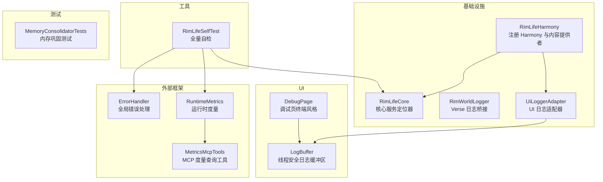
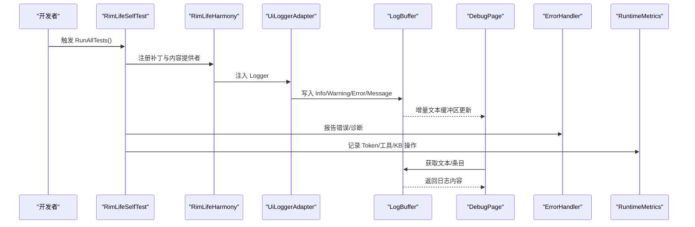
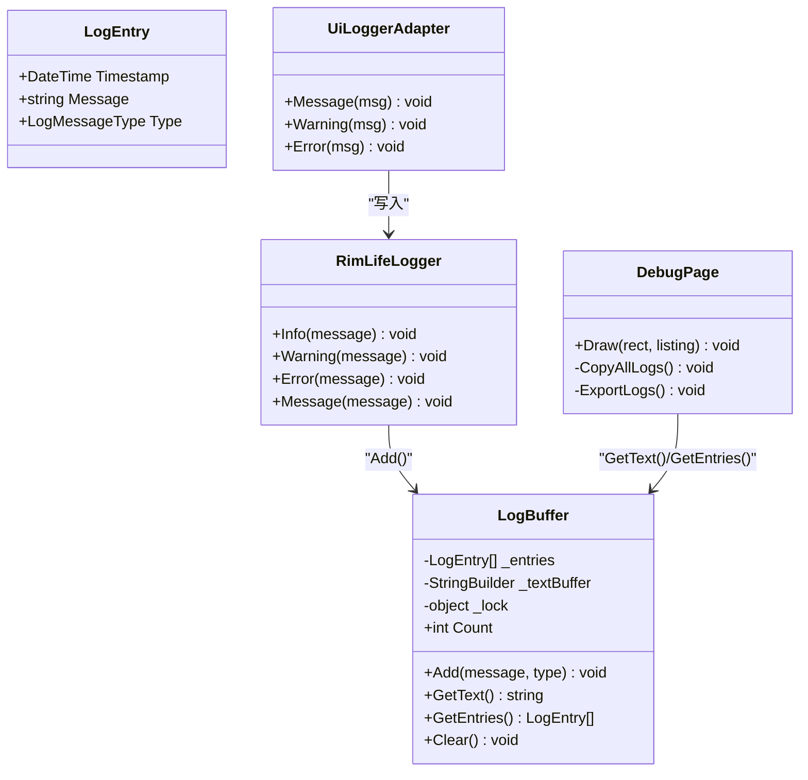
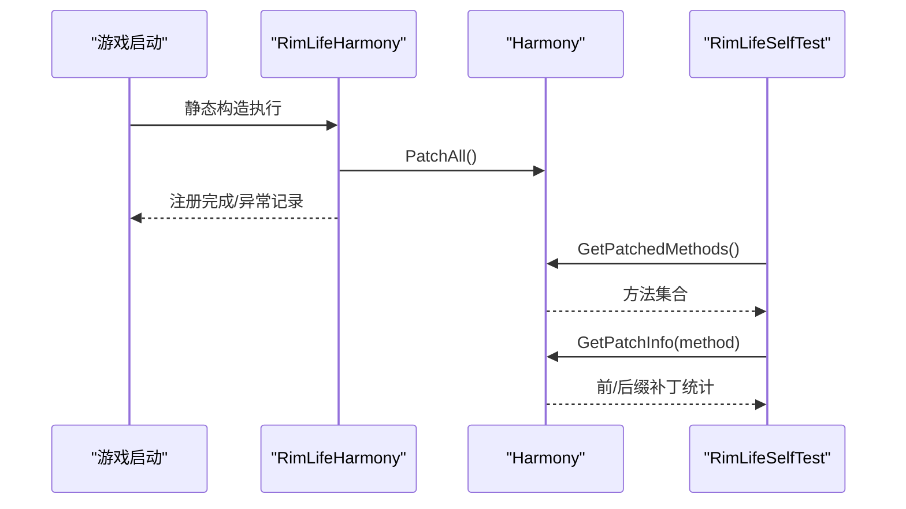
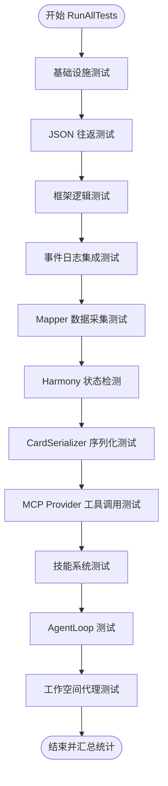
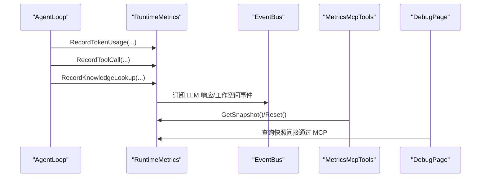
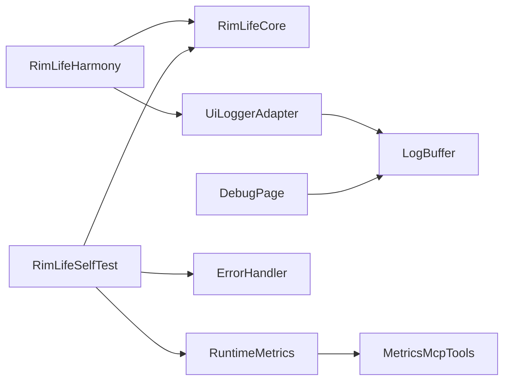

# 调试与故障排除

<cite>
**本文引用的文件**
- [RimWorldLogger.cs](file://Source/Infrastructure/RimWorldLogger.cs)
- [LogBuffer.cs](file://Source/UI/LogBuffer.cs)
- [UiLoggerAdapter.cs](file://Source/Infrastructure/UiLoggerAdapter.cs)
- [RimLifeHarmony.cs](file://Source/Infrastructure/RimLifeHarmony.cs)
- [RimLifeCore.cs](file://Source/Infrastructure/RimLifeCore.cs)
- [DebugPage.cs](file://Source/UI/Pages/DebugPage.cs)
- [RimLifeSelfTest.cs](file://Source/Tool/RimLifeSelfTest.cs)
- [MemoryConsolidatorTests.cs](file://RimLife.Tests/Memory/MemoryConsolidatorTests.cs)
- [ErrorHandler.cs](file://ext/NPCLife/src/NPCLife/Framework/ErrorHandler.cs)
- [RuntimeMetrics.cs](file://ext/NPCLife/src/NPCLife/Framework/RuntimeMetrics.cs)
- [MetricsMcpTools.cs](file://ext/NPCLife/src/NPCLife/Framework/Mcp/MetricsMcpTools.cs)
</cite>

## 目录
1. [简介](#简介)
2. [项目结构](#项目结构)
3. [核心组件](#核心组件)
4. [架构总览](#架构总览)
5. [详细组件分析](#详细组件分析)
6. [依赖关系分析](#依赖关系分析)
7. [性能考虑](#性能考虑)
8. [故障排除指南](#故障排除指南)
9. [结论](#结论)
10. [附录](#附录)

## 简介
本指南面向开发者，聚焦于 RimLife 项目的调试与故障排除实践。内容涵盖：
- Visual Studio 调试器设置与断点技巧
- 日志系统与 RimLifeLogger 的使用、日志级别与缓冲机制
- 实时日志查看与导出流程
- 常见问题诊断：Harmony 补丁冲突、内存泄漏与性能问题
- 自我测试工具与自动化测试流程
- 性能分析与内存监控最佳实践
- 错误码与异常处理对照与建议

## 项目结构
RimLife 采用分层与模块化组织，关键调试与日志相关模块分布如下：
- 基础设施层：日志桥接、Harmony 注册、核心服务定位器
- UI 层：调试页面、日志缓冲区与实时查看
- 工具层：自检测试工具
- 测试层：内存巩固逻辑单元测试
- 外部框架：错误处理、运行时度量

**图表来源**
- [RimLifeHarmony.cs:11-58](file://Source/Infrastructure/RimLifeHarmony.cs#L11-L58)
- [RimLifeCore.cs:24-185](file://Source/Infrastructure/RimLifeCore.cs#L24-L185)
- [RimWorldLogger.cs:8-14](file://Source/Infrastructure/RimWorldLogger.cs#L8-L14)
- [UiLoggerAdapter.cs:10-26](file://Source/Infrastructure/UiLoggerAdapter.cs#L10-L26)
- [LogBuffer.cs:39-141](file://Source/UI/LogBuffer.cs#L39-L141)
- [DebugPage.cs:14-79](file://Source/UI/Pages/DebugPage.cs#L14-L79)
- [RimLifeSelfTest.cs:33-133](file://Source/Tool/RimLifeSelfTest.cs#L33-L133)
- [MemoryConsolidatorTests.cs:12-187](file://RimLife.Tests/Memory/MemoryConsolidatorTests.cs#L12-L187)
- [ErrorHandler.cs:22-181](file://ext/NPCLife/src/NPCLife/Framework/ErrorHandler.cs#L22-L181)
- [RuntimeMetrics.cs:29-365](file://ext/NPCLife/src/NPCLife/Framework/RuntimeMetrics.cs#L29-L365)
- [MetricsMcpTools.cs:28-55](file://ext/NPCLife/src/NPCLife/Framework/Mcp/MetricsMcpTools.cs#L28-L55)

**章节来源**
- [RimLifeHarmony.cs:11-58](file://Source/Infrastructure/RimLifeHarmony.cs#L11-L58)
- [RimLifeCore.cs:24-185](file://Source/Infrastructure/RimLifeCore.cs#L24-L185)
- [LogBuffer.cs:39-141](file://Source/UI/LogBuffer.cs#L39-L141)
- [DebugPage.cs:14-79](file://Source/UI/Pages/DebugPage.cs#L14-L79)
- [RimLifeSelfTest.cs:33-133](file://Source/Tool/RimLifeSelfTest.cs#L33-L133)
- [MemoryConsolidatorTests.cs:12-187](file://RimLife.Tests/Memory/MemoryConsolidatorTests.cs#L12-L187)
- [ErrorHandler.cs:22-181](file://ext/NPCLife/src/NPCLife/Framework/ErrorHandler.cs#L22-L181)
- [RuntimeMetrics.cs:29-365](file://ext/NPCLife/src/NPCLife/Framework/RuntimeMetrics.cs#L29-L365)
- [MetricsMcpTools.cs:28-55](file://ext/NPCLife/src/NPCLife/Framework/Mcp/MetricsMcpTools.cs#L28-L55)

## 核心组件
- 日志系统
  - RimWorldLogger：将 ILogger 桥接到 Verse.Log，便于统一日志输出。
  - UiLoggerAdapter：将框架日志重定向至 UI 调试窗口的 LogBuffer。
  - LogBuffer：线程安全日志缓冲区，维护结构化条目列表与增量文本缓冲区，支持最大容量限制与自动重建。
  - DebugPage：终端风格日志查看器，支持自动滚动、复制与导出。

- Harmony 管理
  - RimLifeHarmony：集中注册 Harmony 补丁与内容提供者，捕获启动期异常并记录错误日志。

- 核心服务定位器
  - RimLifeCore：提供全局配置、事件日志、工作空间、LLM 访问、脚本推送、度量系统等统一入口，并注入 Logger。

- 自我测试工具
  - RimLifeSelfTest：提供全量自检流程，覆盖基础设施、JSON 往返、框架逻辑、事件日志、Mapper、Harmony 状态、序列化、MCP 工具、技能系统、Agent 与工作空间等。

- 错误处理与度量
  - ErrorHandler：全局错误处理器，支持诊断模式、请求链路追踪与多处理器注册。
  - RuntimeMetrics：运行时度量容器，记录会话、Token 消耗、工具调用、KB 查询与 Agent 循环统计。
  - MetricsMcpTools：MCP 工具，提供度量查询与重置。

**章节来源**
- [RimWorldLogger.cs:8-14](file://Source/Infrastructure/RimWorldLogger.cs#L8-L14)
- [UiLoggerAdapter.cs:10-26](file://Source/Infrastructure/UiLoggerAdapter.cs#L10-L26)
- [LogBuffer.cs:39-141](file://Source/UI/LogBuffer.cs#L39-L141)
- [DebugPage.cs:14-79](file://Source/UI/Pages/DebugPage.cs#L14-L79)
- [RimLifeHarmony.cs:16-57](file://Source/Infrastructure/RimLifeHarmony.cs#L16-L57)
- [RimLifeCore.cs:24-185](file://Source/Infrastructure/RimLifeCore.cs#L24-L185)
- [RimLifeSelfTest.cs:117-133](file://Source/Tool/RimLifeSelfTest.cs#L117-L133)
- [ErrorHandler.cs:22-181](file://ext/NPCLife/src/NPCLife/Framework/ErrorHandler.cs#L22-L181)
- [RuntimeMetrics.cs:29-365](file://ext/NPCLife/src/NPCLife/Framework/RuntimeMetrics.cs#L29-L365)
- [MetricsMcpTools.cs:28-55](file://ext/NPCLife/src/NPCLife/Framework/Mcp/MetricsMcpTools.cs#L28-L55)

## 架构总览
下图展示日志与调试相关组件的交互关系，以及自检测试与度量系统的集成路径。

**图表来源**
- [RimLifeSelfTest.cs:117-133](file://Source/Tool/RimLifeSelfTest.cs#L117-L133)
- [RimLifeHarmony.cs:16-57](file://Source/Infrastructure/RimLifeHarmony.cs#L16-L57)
- [UiLoggerAdapter.cs:10-26](file://Source/Infrastructure/UiLoggerAdapter.cs#L10-L26)
- [LogBuffer.cs:49-91](file://Source/UI/LogBuffer.cs#L49-L91)
- [DebugPage.cs:44-79](file://Source/UI/Pages/DebugPage.cs#L44-L79)
- [ErrorHandler.cs:97-163](file://ext/NPCLife/src/NPCLife/Framework/ErrorHandler.cs#L97-L163)
- [RuntimeMetrics.cs:45-141](file://ext/NPCLife/src/NPCLife/Framework/RuntimeMetrics.cs#L45-L141)

## 详细组件分析

### 日志系统与缓冲区
- 结构化日志条目包含时间戳、消息与类型；增量文本缓冲区用于终端直接显示，支持颜色标签与自动重建。
- 支持 Info/Warning/Error/Message 四种级别；最大容量为 500 条，超限后移除最旧条目并重建文本缓冲区。
- UI 适配器将框架日志重定向到 LogBuffer，DebugPage 通过 GetText()/GetEntries() 实时读取并渲染。

**图表来源**
- [LogBuffer.cs:10-141](file://Source/UI/LogBuffer.cs#L10-L141)
- [UiLoggerAdapter.cs:10-26](file://Source/Infrastructure/UiLoggerAdapter.cs#L10-L26)
- [DebugPage.cs:14-79](file://Source/UI/Pages/DebugPage.cs#L14-L79)

**章节来源**
- [LogBuffer.cs:39-141](file://Source/UI/LogBuffer.cs#L39-L141)
- [UiLoggerAdapter.cs:10-26](file://Source/Infrastructure/UiLoggerAdapter.cs#L10-L26)
- [DebugPage.cs:14-79](file://Source/UI/Pages/DebugPage.cs#L14-L79)

### Harmony 补丁注册与冲突排查
- 静态构造函数集中注册补丁与内容提供者，捕获异常并记录错误日志。
- 自检测试包含 Harmony 状态检测，列出已注册方法及其前/后缀补丁数量，便于快速定位冲突或重复注册。

**图表来源**
- [RimLifeHarmony.cs:16-57](file://Source/Infrastructure/RimLifeHarmony.cs#L16-L57)
- [RimLifeSelfTest.cs:593-621](file://Source/Tool/RimLifeSelfTest.cs#L593-L621)

**章节来源**
- [RimLifeHarmony.cs:16-57](file://Source/Infrastructure/RimLifeHarmony.cs#L16-L57)
- [RimLifeSelfTest.cs:593-621](file://Source/Tool/RimLifeSelfTest.cs#L593-L621)

### 自我测试工具与自动化测试
- 全量自检覆盖基础设施、JSON 往返、框架逻辑、事件日志、Mapper、Harmony 状态、序列化、MCP 工具、技能系统、Agent 与工作空间等。
- 使用 Stopwatch 记录耗时，统一输出“通过/失败/跳过”统计，便于自动化回归。

**图表来源**
- [RimLifeSelfTest.cs:117-133](file://Source/Tool/RimLifeSelfTest.cs#L117-L133)

**章节来源**
- [RimLifeSelfTest.cs:117-133](file://Source/Tool/RimLifeSelfTest.cs#L117-L133)

### 运行时度量与性能监控
- RuntimeMetrics 通过 MetricsInterceptor 与 EventBus 订阅驱动采集 Token 消耗、工具调用、KB 查询与 Agent 循环统计。
- MCP 工具提供 metrics_get 与 metrics_reset，便于查询与重置度量。
- DebugPage 与 LogBuffer 支持日志导出，结合度量快照可用于性能分析。

**图表来源**
- [RuntimeMetrics.cs:45-141](file://ext/NPCLife/src/NPCLife/Framework/RuntimeMetrics.cs#L45-L141)
- [MetricsMcpTools.cs:28-55](file://ext/NPCLife/src/NPCLife/Framework/Mcp/MetricsMcpTools.cs#L28-L55)
- [RimLifeCore.cs:262-302](file://Source/Infrastructure/RimLifeCore.cs#L262-L302)
- [DebugPage.cs:121-155](file://Source/UI/Pages/DebugPage.cs#L121-L155)

**章节来源**
- [RuntimeMetrics.cs:29-365](file://ext/NPCLife/src/NPCLife/Framework/RuntimeMetrics.cs#L29-L365)
- [MetricsMcpTools.cs:28-55](file://ext/NPCLife/src/NPCLife/Framework/Mcp/MetricsMcpTools.cs#L28-L55)
- [RimLifeCore.cs:262-302](file://Source/Infrastructure/RimLifeCore.cs#L262-L302)
- [DebugPage.cs:121-155](file://Source/UI/Pages/DebugPage.cs#L121-L155)

## 依赖关系分析
- 组件耦合与内聚
  - UiLoggerAdapter 与 RimLifeLogger 低耦合，仅通过接口与缓冲区交互。
  - DebugPage 依赖 LogBuffer 的只读视图，避免直接修改内部状态。
  - RimLifeHarmony 与 RimLifeCore 通过静态构造与服务注入建立强连接，便于集中初始化。
  - ErrorHandler 与 RuntimeMetrics 通过 EventBus 与 Logger 解耦，利于扩展。

**图表来源**
- [RimLifeHarmony.cs:16-57](file://Source/Infrastructure/RimLifeHarmony.cs#L16-L57)
- [RimLifeCore.cs:24-185](file://Source/Infrastructure/RimLifeCore.cs#L24-L185)
- [UiLoggerAdapter.cs:10-26](file://Source/Infrastructure/UiLoggerAdapter.cs#L10-L26)
- [LogBuffer.cs:39-141](file://Source/UI/LogBuffer.cs#L39-L141)
- [DebugPage.cs:14-79](file://Source/UI/Pages/DebugPage.cs#L14-L79)
- [RimLifeSelfTest.cs:117-133](file://Source/Tool/RimLifeSelfTest.cs#L117-L133)
- [ErrorHandler.cs:22-181](file://ext/NPCLife/src/NPCLife/Framework/ErrorHandler.cs#L22-L181)
- [RuntimeMetrics.cs:29-365](file://ext/NPCLife/src/NPCLife/Framework/RuntimeMetrics.cs#L29-L365)
- [MetricsMcpTools.cs:28-55](file://ext/NPCLife/src/NPCLife/Framework/Mcp/MetricsMcpTools.cs#L28-L55)

**章节来源**
- [RimLifeHarmony.cs:16-57](file://Source/Infrastructure/RimLifeHarmony.cs#L16-L57)
- [RimLifeCore.cs:24-185](file://Source/Infrastructure/RimLifeCore.cs#L24-L185)
- [UiLoggerAdapter.cs:10-26](file://Source/Infrastructure/UiLoggerAdapter.cs#L10-L26)
- [LogBuffer.cs:39-141](file://Source/UI/LogBuffer.cs#L39-L141)
- [DebugPage.cs:14-79](file://Source/UI/Pages/DebugPage.cs#L14-L79)
- [RimLifeSelfTest.cs:117-133](file://Source/Tool/RimLifeSelfTest.cs#L117-L133)
- [ErrorHandler.cs:22-181](file://ext/NPCLife/src/NPCLife/Framework/ErrorHandler.cs#L22-L181)
- [RuntimeMetrics.cs:29-365](file://ext/NPCLife/src/NPCLife/Framework/RuntimeMetrics.cs#L29-L365)
- [MetricsMcpTools.cs:28-55](file://ext/NPCLife/src/NPCLife/Framework/Mcp/MetricsMcpTools.cs#L28-L55)

## 性能考虑
- 日志缓冲区容量与重建策略
  - 最大容量 500 条，超限时移除最旧条目并重建文本缓冲区，避免内存无限增长。
  - 增量追加减少字符串拼接成本，适合高频日志场景。

- 运行时度量
  - 通过 MetricsInterceptor 与 EventBus 订阅驱动采集，避免侵入核心循环。
  - 提供 metrics_reset 重置度量，便于测试与新周期开始。

- UI 渲染优化
  - DebugPage 使用固定高度与独立滚动视图，避免布局抖动。
  - 自动滚动仅在用户接近底部时强制滚动，提升交互体验。

**章节来源**
- [LogBuffer.cs:44-68](file://Source/UI/LogBuffer.cs#L44-L68)
- [RuntimeMetrics.cs:45-141](file://ext/NPCLife/src/NPCLife/Framework/RuntimeMetrics.cs#L45-L141)
- [DebugPage.cs:25-79](file://Source/UI/Pages/DebugPage.cs#L25-L79)

## 故障排除指南

### Visual Studio 调试器设置与断点技巧
- Dev Mode 下打开自检面板
  - 选中任意角色，在角色底部 Gizmo 面板找到“RimLife 全量自检”按钮，点击弹出测试菜单。
  - 日志输出到 Dev Console，便于观察测试步骤与结果。
- 断点位置建议
  - Harmony 补丁注册：RimLifeHarmony 静态构造函数入口。
  - 日志写入：UiLoggerAdapter 的 Message/Warning/Error 方法。
  - 自检测试：RimLifeSelfTest 中各测试方法入口（如 TestInfrastructure/TestHarmonyStatus）。
  - 运行时度量：RuntimeMetrics 的 Record* 方法与 MetricsMcpTools 的查询入口。

**章节来源**
- [RimLifeSelfTest.cs:26-47](file://Source/Tool/RimLifeSelfTest.cs#L26-L47)
- [RimLifeHarmony.cs:16-57](file://Source/Infrastructure/RimLifeHarmony.cs#L16-L57)
- [UiLoggerAdapter.cs:12-25](file://Source/Infrastructure/UiLoggerAdapter.cs#L12-L25)

### 日志系统使用与实时查看
- 配置与级别
  - 通过 UiLoggerAdapter 注入 Logger，统一输出 Info/Warning/Error/Message。
  - RimWorldLogger 作为桥接，便于与 Verse.Log 对齐。
- 实时查看
  - DebugPage 从 LogBuffer.GetEntries()/GetText() 读取，支持自动滚动、复制与导出。
  - 导出为纯文本，便于粘贴到问题反馈中。

**章节来源**
- [UiLoggerAdapter.cs:10-26](file://Source/Infrastructure/UiLoggerAdapter.cs#L10-L26)
- [RimWorldLogger.cs:8-14](file://Source/Infrastructure/RimWorldLogger.cs#L8-L14)
- [DebugPage.cs:44-79](file://Source/UI/Pages/DebugPage.cs#L44-L79)

### Harmony 补丁冲突诊断
- 快速检查
  - 使用自检测试中的 TestHarmonyStatus，列出已注册方法及前后缀补丁数量。
- 常见原因
  - 多个补丁对同一方法进行前/后缀改写，导致顺序不确定或覆盖。
  - PatchAll() 重复调用导致重复注册。
- 处理建议
  - 明确补丁优先级与顺序，必要时拆分为独立 Harmony 实例。
  - 在静态构造函数中集中注册，避免重复。

**章节来源**
- [RimLifeSelfTest.cs:593-621](file://Source/Tool/RimLifeSelfTest.cs#L593-L621)
- [RimLifeHarmony.cs:16-57](file://Source/Infrastructure/RimLifeHarmony.cs#L16-L57)

### 内存泄漏与内存监控
- 内存巩固逻辑验证
  - MemoryConsolidatorTests 验证两阶段巩固：BuildRequest 与 RewriteAsync（TemplateMemoryRewriter），确保短时记忆合并为长时记忆并生成回顾。
- 监控要点
  - 关注 LogBuffer 容量上限与重建频率，避免频繁重建造成 GC 压力。
  - 使用 RuntimeMetrics 记录工具调用与 KB 查询，识别异常热点。
  - DebugPage 导出日志，结合度量快照定位异常峰值。

**章节来源**
- [MemoryConsolidatorTests.cs:12-187](file://RimLife.Tests/Memory/MemoryConsolidatorTests.cs#L12-L187)
- [LogBuffer.cs:44-68](file://Source/UI/LogBuffer.cs#L44-L68)
- [RuntimeMetrics.cs:147-178](file://ext/NPCLife/src/NPCLife/Framework/RuntimeMetrics.cs#L147-L178)

### 性能问题排查
- 采集与分析
  - 通过 RuntimeMetrics 记录 Token 消耗、工具调用与 Agent 循环统计。
  - 使用 MetricsMcpTools 的 metrics_get 查询快照，metrics_reset 重置度量。
- 优化建议
  - 降低高频日志输出，减少 LogBuffer 增量重建频率。
  - 优化序列化与 Mapper 数据采集，减少不必要的对象创建。
  - 合理设置工作空间阈值与定时器间隔，避免过度触发。

**章节来源**
- [RuntimeMetrics.cs:246-365](file://ext/NPCLife/src/NPCLife/Framework/RuntimeMetrics.cs#L246-L365)
- [MetricsMcpTools.cs:28-55](file://ext/NPCLife/src/NPCLife/Framework/Mcp/MetricsMcpTools.cs#L28-L55)
- [RimLifeCore.cs:493-543](file://Source/Infrastructure/RimLifeCore.cs#L493-L543)

### 自我测试工具与自动化测试流程
- 全量自检
  - RunAllTests 汇总基础设施、JSON 往返、框架逻辑、事件日志、Mapper、Harmony、序列化、MCP、技能、Agent 与工作空间测试。
- 自动化建议
  - 在 CI 中运行 RimLifeSelfTest，结合日志导出与度量快照生成报告。
  - 对关键路径（如序列化、事件日志、Harmony 状态）增加断言与阈值报警。

**章节来源**
- [RimLifeSelfTest.cs:117-133](file://Source/Tool/RimLifeSelfTest.cs#L117-L133)

### 错误处理与异常对照
- 全局错误处理
  - ErrorHandler 支持诊断模式、请求链路追踪与多处理器注册，便于统一上报与降级。
- 常见异常场景
  - Harmony 注册失败：检查补丁目标是否存在、版本兼容性与重复注册。
  - 序列化异常：确认输入数据结构与转义处理，参考 JSON 往返测试。
  - 事件日志异常：检查 EventPool 状态与查询条件，参考事件日志测试。
- 处理建议
  - 在 ErrorHandler 中注册处理器，捕获并记录 TraceId，便于链路追踪。
  - 对关键流程添加 Try/Catch 与日志输出，避免静默失败。

**章节来源**
- [ErrorHandler.cs:22-181](file://ext/NPCLife/src/NPCLife/Framework/ErrorHandler.cs#L22-L181)
- [RimLifeSelfTest.cs:139-178](file://Source/Tool/RimLifeSelfTest.cs#L139-L178)
- [RimLifeSelfTest.cs:184-254](file://Source/Tool/RimLifeSelfTest.cs#L184-L254)
- [RimLifeSelfTest.cs:312-399](file://Source/Tool/RimLifeSelfTest.cs#L312-L399)

## 结论
本指南提供了从日志系统、Harmony 补丁、自我测试到性能与错误处理的完整调试与故障排除路径。建议在开发与回归测试中：
- 使用 Dev Mode 下的自检工具与 DebugPage 实时观察日志
- 通过 Harmony 状态检测与度量工具定位性能瓶颈
- 借助 ErrorHandler 与 MetricsMcpTools 建立统一的诊断与上报体系
- 在 CI 中集成全量自检，保障质量与稳定性

## 附录

### 常用调试入口与路径
- 自检面板入口：角色 Gizmo 面板 → “RimLife 全量自检”
- 日志查看：调试页 → 终端风格日志窗口
- 导出日志：调试页 → “导出日志”按钮
- 度量查询：MCP 工具 metrics_get
- 度量重置：MCP 工具 metrics_reset

**章节来源**
- [RimLifeSelfTest.cs:26-47](file://Source/Tool/RimLifeSelfTest.cs#L26-L47)
- [DebugPage.cs:81-155](file://Source/UI/Pages/DebugPage.cs#L81-L155)
- [MetricsMcpTools.cs:28-55](file://ext/NPCLife/src/NPCLife/Framework/Mcp/MetricsMcpTools.cs#L28-L55)