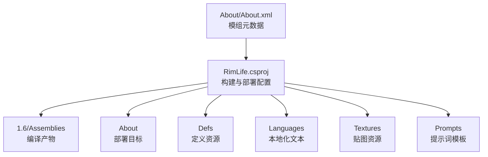
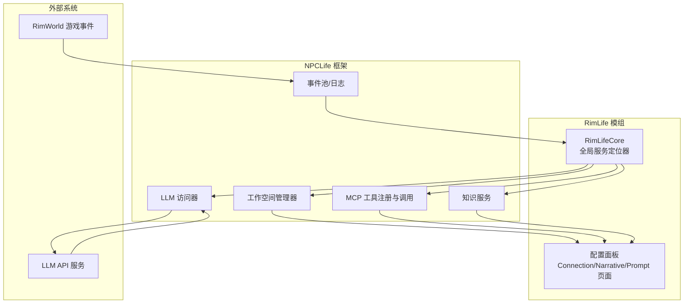
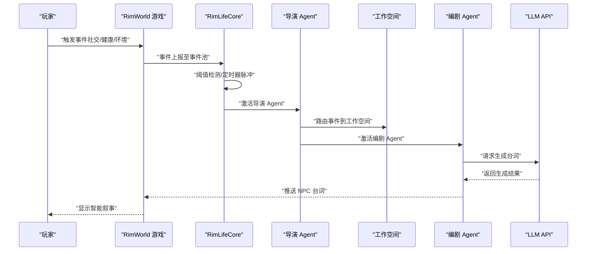
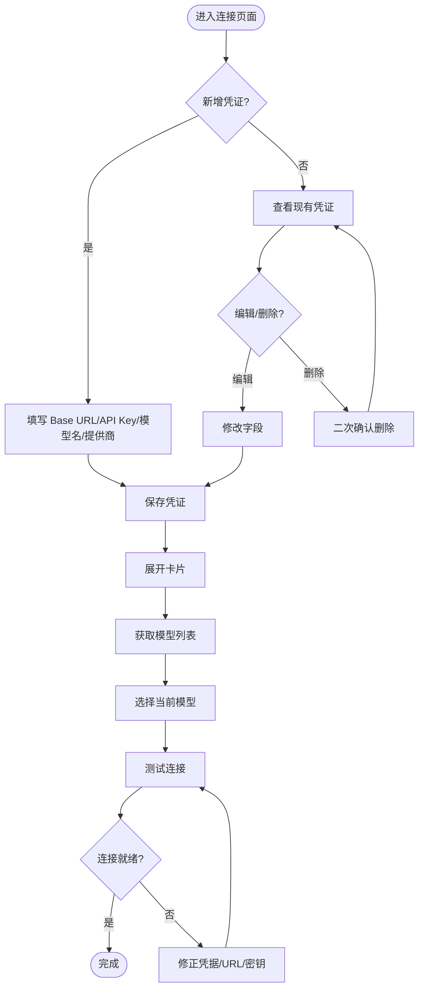
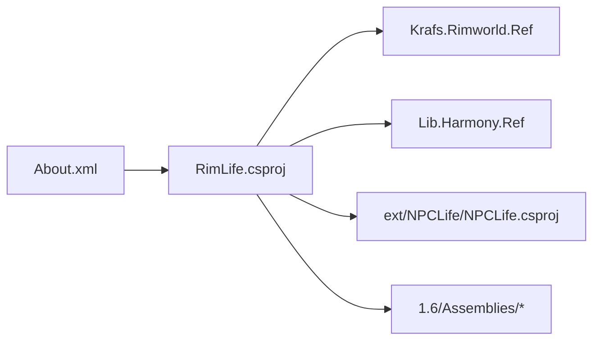

# 快速开始

<cite>
**本文引用的文件**
- [About.xml](file://About/About.xml)
- [RimLife.csproj](file://RimLife.csproj)
- [RimLifeMod.cs](file://Source/Settings/RimLifeMod.cs)
- [ConnectionPage.cs](file://Source/UI/Pages/ConnectionPage.cs)
- [NarrativePage.cs](file://Source/UI/Pages/NarrativePage.cs)
- [PromptPage.cs](file://Source/UI/Pages/PromptPage.cs)
- [RimLifeCore.cs](file://Source/Infrastructure/RimLifeCore.cs)
- [RimLifeSelfTest.cs](file://Source/Tool/RimLifeSelfTest.cs)
- [DirectorPrompt.txt](file://Prompts/DirectorPrompt.txt)
- [README.md](file://ext/NPCLife/README.md)
</cite>

## 目录
1. [简介](#简介)
2. [项目结构](#项目结构)
3. [核心组件](#核心组件)
4. [架构概览](#架构概览)
5. [详细组件分析](#详细组件分析)
6. [依赖分析](#依赖分析)
7. [性能考虑](#性能考虑)
8. [故障排除指南](#故障排除指南)
9. [结论](#结论)
10. [附录](#附录)

## 简介
本指南面向首次接触 RimLife 模组的新用户，帮助你在最短时间内完成安装、启用与基础配置，并体验模组的“智能叙事”核心功能。RimLife 基于 NPCLife 框架，通过 AI 驱动的导演、编剧与临时工角色，将 RimWorld 中的事件转化为连贯的 NPC 台词与剧情线。

## 项目结构
RimLife 作为 RimWorld 模组，遵循标准的模组目录结构：About、Defs、Languages、Textures、版本号目录（如 1.6）、以及源码工程文件。模组元数据与构建配置位于 About.xml 与 RimLife.csproj 中。

图表来源
- [About.xml:1-13](file://About/About.xml#L1-L13)
- [RimLife.csproj:1-120](file://RimLife.csproj#L1-L120)

章节来源
- [About.xml:1-13](file://About/About.xml#L1-L13)
- [RimLife.csproj:1-120](file://RimLife.csproj#L1-L120)

## 核心组件
- 模组设置与配置面板
  - 模组主类负责绘制“RimLife”设置分类下的配置面板，委托给布局类渲染各页面。
- 连接页面（LLM 凭证）
  - 管理 LLM 提供商的 BaseURL、API Key、模型名与提供商类型，支持测试连接与模型发现。
- 叙事页面（Agent 驱动参数）
  - 配置导演、临时工、编剧的事件阈值、定时器间隔与通用参数，保存后重建 Agent 生效。
- 提示词页面（系统提示词与采样参数）
  - 编辑导演、编剧、临时工提示词，设置全局风格指令与温度系数，保存后重建 Agent 生效。
- 核心服务定位器（RimLifeCore）
  - 提供工作空间、知识库、LLM 访问器、凭证管理器等全局访问点，负责 Agent 生命周期与配置持久化。

章节来源
- [RimLifeMod.cs:1-69](file://Source/Settings/RimLifeMod.cs#L1-L69)
- [ConnectionPage.cs:1-1117](file://Source/UI/Pages/ConnectionPage.cs#L1-L1117)
- [NarrativePage.cs:1-221](file://Source/UI/Pages/NarrativePage.cs#L1-L221)
- [PromptPage.cs:1-288](file://Source/UI/Pages/PromptPage.cs#L1-L288)
- [RimLifeCore.cs:1-1095](file://Source/Infrastructure/RimLifeCore.cs#L1-L1095)

## 架构概览
RimLife 的运行时架构围绕“事件池 → 导演审查 → 工作空间路由 → 编剧生成 → 台词输出”的闭环展开。NPCLife 框架提供事件日志、工作空间、MCP 工具、知识库与 LLM 访问器等基础设施，RimLifeCore 负责装配与协调。

图表来源
- [RimLifeCore.cs:1-1095](file://Source/Infrastructure/RimLifeCore.cs#L1-L1095)
- [README.md:1-93](file://ext/NPCLife/README.md#L1-L93)

## 详细组件分析

### 安装与启用（Windows/macOS）
- 系统要求
  - RimWorld 版本：1.4 / 1.5 / 1.6（见 About.xml 支持列表）
  - .NET Framework 4.8（RimLife.csproj 指定 TargetFramework net48）
- 依赖项
  - 游戏引用：Krafs.Rimworld.Ref（随 GameVersion 动态拼接）
  - 框架引用：Lib.Harmony.Ref（2.*）
  - 第三方库：JetBrains.Annotations
  - 可选：Bubbles（通过 EnableBubbles 控制）
- 部署方式
  - 通过项目构建脚本自动部署到 RimWorld Mods 目录（Windows/macOS 分别使用 robocopy/rsync）
  - 部署路径规则：$(RimWorldDir)/Mods/RimLife/
  - 部署内容：About、Defs、Languages、Textures、GameVersion/Assemblies
- 启用步骤
  1) 在 RimWorld 中打开“模组”界面
  2) 找到“RimLife”，勾选启用
  3) 重启游戏进入存档

章节来源
- [About.xml:5-9](file://About/About.xml#L5-L9)
- [RimLife.csproj:1-120](file://RimLife.csproj#L1-L120)

### 初次使用流程（从安装到第一次智能叙事）
- 步骤 1：打开模组设置
  - 在 RimWorld 主菜单的“模组”界面，找到“RimLife”分类，打开配置面板
- 步骤 2：配置 LLM 连接
  - 在“连接”页面添加凭据：填写 Base URL、API Key、模型名与提供商类型
  - 点击“测试连接”验证连通性
  - 如需模型发现，点击“获取模型列表”并选择当前模型
- 步骤 3：基础提示词与参数
  - 在“提示词”页面设置 Temperature 与全局风格指令
  - 保存并应用后，Agent 会重建
- 步骤 4：配置叙事策略
  - 在“叙事”页面设置导演/临时工/编剧的事件阈值与定时器间隔
  - 保存并应用后，Agent 会重建
- 步骤 5：观察第一次智能叙事
  - 在游戏中发生事件（如社交互动、健康变化、环境事件等）
  - 当事件池达到阈值或定时器脉冲触发时，AI 将生成 NPC 台词与剧情推进

图表来源
- [RimLifeCore.cs:488-544](file://Source/Infrastructure/RimLifeCore.cs#L488-L544)
- [NarrativePage.cs:112-136](file://Source/UI/Pages/NarrativePage.cs#L112-L136)
- [PromptPage.cs:121-136](file://Source/UI/Pages/PromptPage.cs#L121-L136)

章节来源
- [ConnectionPage.cs:1-1117](file://Source/UI/Pages/ConnectionPage.cs#L1-L1117)
- [PromptPage.cs:1-288](file://Source/UI/Pages/PromptPage.cs#L1-L288)
- [NarrativePage.cs:1-221](file://Source/UI/Pages/NarrativePage.cs#L1-L221)
- [RimLifeCore.cs:1-1095](file://Source/Infrastructure/RimLifeCore.cs#L1-L1095)

### 配置页面详解

#### 连接页面（LLM 凭证）
- 凭证卡片
  - 名称、提供商类型（OpenAI 兼容 / Anthropic）、Base URL、API Key、模型名
  - 支持显示/隐藏 API Key、测试连接、模型发现与选择
- 状态摘要
  - 显示当前激活链路与就绪状态
- 操作流程
  - 新增 → 填写字段 → 保存 → 展开卡片 → “获取模型列表” → 选择模型 → “测试连接”
  - 编辑 → 修改字段 → 保存
  - 删除 → 二次确认

图表来源
- [ConnectionPage.cs:1-1117](file://Source/UI/Pages/ConnectionPage.cs#L1-L1117)

章节来源
- [ConnectionPage.cs:1-1117](file://Source/UI/Pages/ConnectionPage.cs#L1-L1117)

#### 叙事页面（Agent 驱动参数）
- 导演策略
  - 专用事件数阈值、专用重要度阈值、定时器间隔（ticks）
- 临时工策略
  - 专用事件数阈值、专用重要度阈值、定时器间隔（ticks）
- 编剧策略
  - 专用事件数阈值、专用重要度阈值（无定时器）
- 通用设置
  - 历史缓冲区容量、Agent 最大轮数
- 操作
  - 保存并应用：写入 DriverConfig 并重建 Agent
  - 重置默认值：恢复默认配置（需保存）

章节来源
- [NarrativePage.cs:1-221](file://Source/UI/Pages/NarrativePage.cs#L1-L221)
- [RimLifeCore.cs:828-865](file://Source/Infrastructure/RimLifeCore.cs#L828-L865)

#### 提示词页面（系统提示词与采样参数）
- LLM 采样参数
  - Temperature：数值范围 0~2，越低越确定，越高越有创意
- 全局风格指令
  - 追加到所有 Agent 的提示词末尾
- 角色提示词
  - 导演、编剧、临时工提示词，支持恢复默认
- 操作
  - 保存并应用：写入 PromptConfig 并重建 Agent
  - 全部恢复默认：恢复为默认提示词与温度

章节来源
- [PromptPage.cs:1-288](file://Source/UI/Pages/PromptPage.cs#L1-L288)
- [RimLifeCore.cs:867-892](file://Source/Infrastructure/RimLifeCore.cs#L867-L892)
- [DirectorPrompt.txt:1-17](file://Prompts/DirectorPrompt.txt#L1-L17)

## 依赖分析
- 模组元数据与版本
  - About.xml 指定受支持的 RimWorld 版本（1.4/1.5/1.6）
- 构建与部署
  - RimLife.csproj 定义 .NET 4.8 目标框架、Harmony 引用、RimWorld 反射引用、Bubbles 可选依赖
  - 通过 WinDeploy/MacDeploy 目标自动部署到 Mods/RimLife
- 框架依赖
  - 项目引用 ext/NPCLife/src/NPCLife/NPCLife.csproj
  - 通过 RimLifeCore 注入日志、时间提供者、LLM 访问器、工作空间管理器等

图表来源
- [RimLife.csproj:1-120](file://RimLife.csproj#L1-L120)
- [About.xml:1-13](file://About/About.xml#L1-L13)

章节来源
- [RimLife.csproj:1-120](file://RimLife.csproj#L1-L120)
- [About.xml:1-13](file://About/About.xml#L1-L13)

## 性能考虑
- 事件阈值与定时器
  - 通过“叙事”页面的阈值与定时器减少不必要的 LLM 调用，平衡叙事质量与成本
- Agent 最大轮数
  - 控制单次激活中工具调用的最大轮数，防止死循环
- 模型选择
  - 优先选择轻量模型以降低延迟与成本
- 日志与诊断
  - 在调试模式下可开启详细日志，便于排查问题

## 故障排除指南
- 无法找到 RimWorld 目录
  - 确认已设置 RIMWORLD_DIR 环境变量或在构建命令中传入
  - 检查 WinDeploy/MacDeploy 目标输出路径
- 凭证测试失败
  - 检查 Base URL 与 API Key 是否正确
  - 确认网络可达与防火墙放行
  - 尝试“获取模型列表”以验证凭据有效性
- LLM 未就绪
  - 确认至少存在一个已激活的凭证
  - 检查“连接”页面的状态摘要
- 提示词或驱动参数未生效
  - 确认已在对应页面点击“保存并应用”
  - 重新进入存档或重启游戏以确保配置生效
- 自检测试
  - 在开发模式下可通过“RimLife 全量自检”检查基础设施、事件日志、JSON 往返、MCP 工具、Agent 等模块状态

章节来源
- [ConnectionPage.cs:1-1117](file://Source/UI/Pages/ConnectionPage.cs#L1-L1117)
- [RimLifeSelfTest.cs:1-1462](file://Source/Tool/RimLifeSelfTest.cs#L1-L1462)

## 结论
通过本快速开始指南，你已完成 RimLife 模组的安装、启用与基础配置，并理解了从事件上报到智能叙事输出的完整流程。建议在熟悉基础配置后，逐步调整提示词与叙事策略，以获得更符合你期望的 NPC 叙事体验。

## 附录

### 常用术语
- 导演（Director）：审查事件池，决定路由策略
- 编剧（Screenwriter）：为工作空间生成具体台词与叙事
- 临时工（Freelancer）：处理一次性或临时性事件
- 工作空间（Workspace）：独立的剧情线容器，维护事件池与角色集合
- 事件阈值：事件池达到数量或重要度阈值时触发 AI 处理
- 定时器脉冲：按 ticks 间隔注入 TimerPulse 事件，驱动 Agent 轮询

### 参考资料
- NPCLife 框架说明（自动剧情生成、工作流、集成要求）

章节来源
- [README.md:1-93](file://ext/NPCLife/README.md#L1-L93)