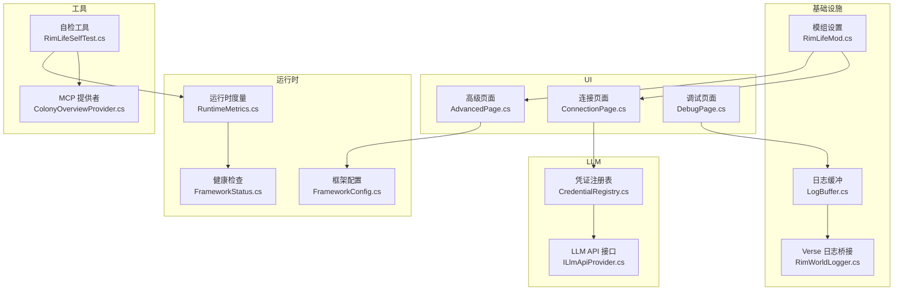
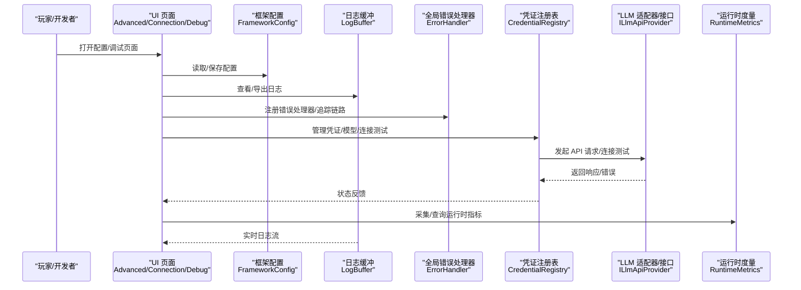
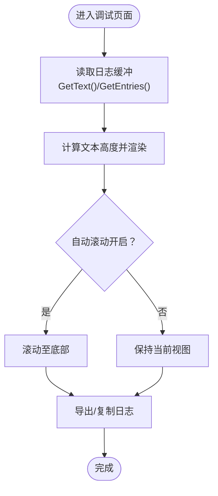
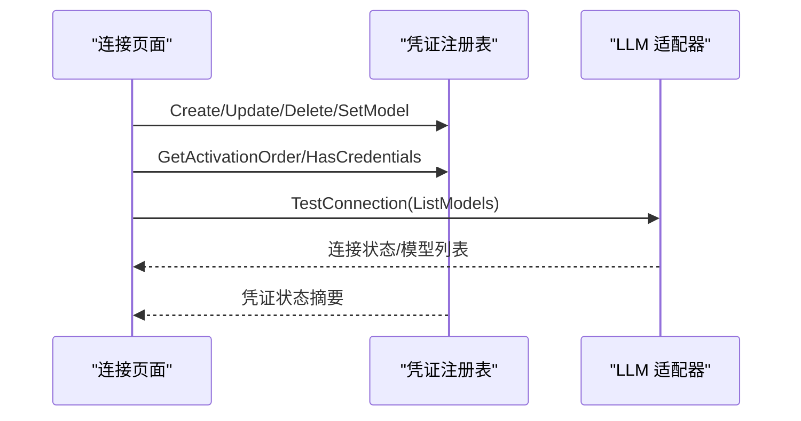
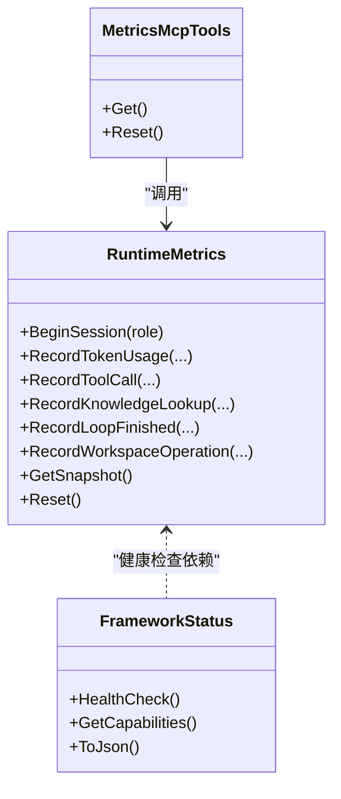
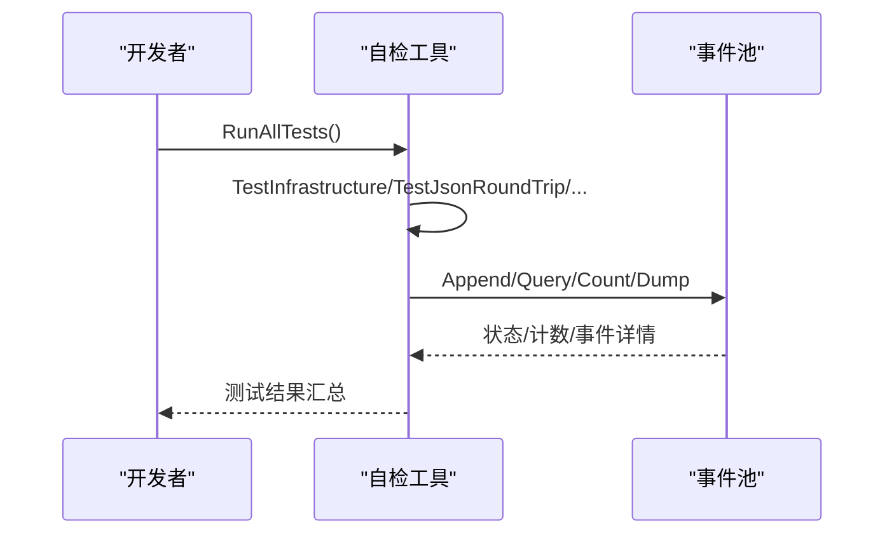
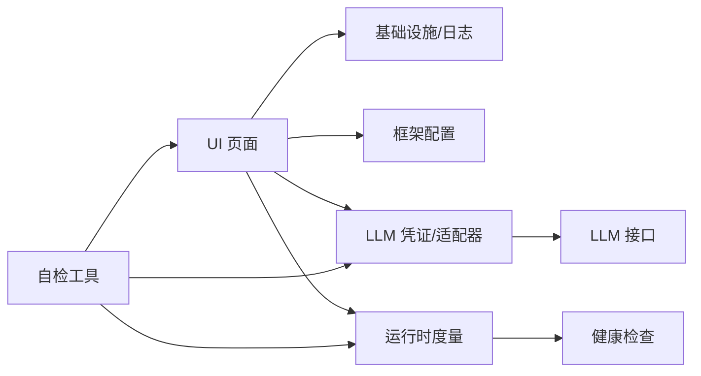

# 故障排除和常见问题

<cite>
**本文引用的文件**
- [DebugPage.cs](file://Source/UI/Pages/DebugPage.cs)
- [LogBuffer.cs](file://Source/UI/LogBuffer.cs)
- [RimWorldLogger.cs](file://Source/Infrastructure/RimWorldLogger.cs)
- [RimLifeSelfTest.cs](file://Source/Tool/RimLifeSelfTest.cs)
- [RimLifeMod.cs](file://Source/Settings/RimLifeMod.cs)
- [CredentialRegistry.cs](file://ext/NPCLife/src/NPCLife/Infrastructure/Llm/CredentialRegistry.cs)
- [ErrorHandler.cs](file://ext/NPCLife/src/NPCLife/Framework/ErrorHandler.cs)
- [RuntimeMetrics.cs](file://ext/NPCLife/src/NPCLife/Framework/RuntimeMetrics.cs)
- [FrameworkConfig.cs](file://ext/NPCLife/src/NPCLife/Framework/FrameworkConfig.cs)
- [AdvancedPage.cs](file://Source/UI/AdvancedPage.cs)
- [ConnectionPage.cs](file://Source/UI/Pages/ConnectionPage.cs)
- [NarrativePage.cs](file://Source/UI/Pages/NarrativePage.cs)
- [ColonyOverviewProvider.cs](file://Source/Infrastructure/Mcp/ColonyOverviewProvider.cs)
- [FrameworkStatus.cs](file://ext/NPCLife/src/NPCLife/Framework/FrameworkStatus.cs)
- [ILlmApiProvider.cs](file://ext/NPCLife/src/NPCLife/Core/ILlmApiProvider.cs)
- [LlmRequest.cs](file://ext/NPCLife/src/NPCLife/Framework/Llm/LlmRequest.cs)
- [LlmResponse.cs](file://ext/NPCLife/src/NPCLife/Framework/Llm/LlmResponse.cs)
</cite>

## 目录
1. [简介](#简介)
2. [项目结构](#项目结构)
3. [核心组件](#核心组件)
4. [架构总览](#架构总览)
5. [详细组件分析](#详细组件分析)
6. [依赖分析](#依赖分析)
7. [性能考虑](#性能考虑)
8. [故障排除指南](#故障排除指南)
9. [结论](#结论)
10. [附录](#附录)

## 简介
本文件面向 RimLife 用户与维护者，聚焦“故障排除与常见问题”。内容涵盖：
- 常见问题与解决方案
- 性能优化建议（内存、CPU、LLM API）
- 系统化故障排除流程（日志分析、错误码解释、问题定位）
- 调试工具使用（调试页面、自检工具、运行时度量）
- 配置问题与修复（LLM 凭证、代理参数、事件阈值）
- 性能监控与健康检查
- 社区支持与问题报告模板

## 项目结构
RimLife 采用 RimWorld Mod 架构，核心分为：
- UI 配置与调试页面（高级、连接、调试）
- 基础设施与日志（日志缓冲、Verse 日志桥接）
- LLM 凭证与适配（凭证注册表、适配器、API 接口）
- 运行时度量与健康检查（指标采集、MCP 工具）
- 自检工具（游戏内全量自检）

图表来源
- [AdvancedPage.cs:13-242](file://Source/UI/AdvancedPage.cs#L13-L242)
- [ConnectionPage.cs:22-1117](file://Source/UI/Pages/ConnectionPage.cs#L22-L1117)
- [DebugPage.cs:14-175](file://Source/UI/Pages/DebugPage.cs#L14-L175)
- [LogBuffer.cs:39-182](file://Source/UI/LogBuffer.cs#L39-L182)
- [RimWorldLogger.cs:8-15](file://Source/Infrastructure/RimWorldLogger.cs#L8-L15)
- [RimLifeMod.cs:47-69](file://Source/Settings/RimLifeMod.cs#L47-L69)
- [CredentialRegistry.cs:19-329](file://ext/NPCLife/src/NPCLife/Infrastructure/Llm/CredentialRegistry.cs#L19-L329)
- [ILlmApiProvider.cs:12-36](file://ext/NPCLife/src/NPCLife/Core/ILlmApiProvider.cs#L12-L36)
- [RuntimeMetrics.cs:29-649](file://ext/NPCLife/src/NPCLife/Framework/RuntimeMetrics.cs#L29-L649)
- [FrameworkConfig.cs:17-248](file://ext/NPCLife/src/NPCLife/Framework/FrameworkConfig.cs#L17-L248)
- [FrameworkStatus.cs:139-212](file://ext/NPCLife/src/NPCLife/Framework/FrameworkStatus.cs#L139-L212)
- [RimLifeSelfTest.cs:33-1462](file://Source/Tool/RimLifeSelfTest.cs#L33-L1462)
- [ColonyOverviewProvider.cs:42-125](file://Source/Infrastructure/Mcp/ColonyOverviewProvider.cs#L42-L125)

章节来源
- [AdvancedPage.cs:13-242](file://Source/UI/AdvancedPage.cs#L13-L242)
- [ConnectionPage.cs:22-1117](file://Source/UI/Pages/ConnectionPage.cs#L22-L1117)
- [DebugPage.cs:14-175](file://Source/UI/Pages/DebugPage.cs#L14-L175)
- [LogBuffer.cs:39-182](file://Source/UI/LogBuffer.cs#L39-L182)
- [RimWorldLogger.cs:8-15](file://Source/Infrastructure/RimWorldLogger.cs#L8-L15)
- [RimLifeMod.cs:47-69](file://Source/Settings/RimLifeMod.cs#L47-L69)
- [CredentialRegistry.cs:19-329](file://ext/NPCLife/src/NPCLife/Infrastructure/Llm/CredentialRegistry.cs#L19-L329)
- [ILlmApiProvider.cs:12-36](file://ext/NPCLife/src/NPCLife/Core/ILlmApiProvider.cs#L12-L36)
- [RuntimeMetrics.cs:29-649](file://ext/NPCLife/src/NPCLife/Framework/RuntimeMetrics.cs#L29-L649)
- [FrameworkConfig.cs:17-248](file://ext/NPCLife/src/NPCLife/Framework/FrameworkConfig.cs#L17-L248)
- [FrameworkStatus.cs:139-212](file://ext/NPCLife/src/NPCLife/Framework/FrameworkStatus.cs#L139-L212)
- [RimLifeSelfTest.cs:33-1462](file://Source/Tool/RimLifeSelfTest.cs#L33-L1462)
- [ColonyOverviewProvider.cs:42-125](file://Source/Infrastructure/Mcp/ColonyOverviewProvider.cs#L42-L125)

## 核心组件
- 调试页面与日志系统：提供终端风格日志查看、自动滚动、复制/导出日志能力，支撑问题定位与复现。
- 凭证与 LLM 集成：集中管理 LLM 凭证、激活顺序、模型发现与连接测试，保障 API 调用稳定性。
- 运行时度量与健康检查：采集 Token 消耗、工具调用、知识库命中率、Agent 循环状态，支持健康检查与性能评估。
- 自检工具：游戏内一键全量自检，覆盖基础设施、JSON 往返、框架逻辑、MCP 工具、事件池等。

章节来源
- [DebugPage.cs:14-175](file://Source/UI/Pages/DebugPage.cs#L14-L175)
- [LogBuffer.cs:39-182](file://Source/UI/LogBuffer.cs#L39-L182)
- [CredentialRegistry.cs:19-329](file://ext/NPCLife/src/NPCLife/Infrastructure/Llm/CredentialRegistry.cs#L19-L329)
- [RuntimeMetrics.cs:29-649](file://ext/NPCLife/src/NPCLife/Framework/RuntimeMetrics.cs#L29-L649)
- [FrameworkStatus.cs:139-212](file://ext/NPCLife/src/NPCLife/Framework/FrameworkStatus.cs#L139-L212)
- [RimLifeSelfTest.cs:33-1462](file://Source/Tool/RimLifeSelfTest.cs#L33-L1462)

## 架构总览
下图展示从 UI 到基础设施、LLM、度量与健康检查的关键交互路径。

图表来源
- [AdvancedPage.cs:39-242](file://Source/UI/AdvancedPage.cs#L39-L242)
- [ConnectionPage.cs:77-1117](file://Source/UI/Pages/ConnectionPage.cs#L77-L1117)
- [DebugPage.cs:27-175](file://Source/UI/Pages/DebugPage.cs#L27-L175)
- [FrameworkConfig.cs:56-194](file://ext/NPCLife/src/NPCLife/Framework/FrameworkConfig.cs#L56-L194)
- [LogBuffer.cs:49-182](file://Source/UI/LogBuffer.cs#L49-L182)
- [ErrorHandler.cs:22-181](file://ext/NPCLife/src/NPCLife/Framework/ErrorHandler.cs#L22-L181)
- [CredentialRegistry.cs:57-329](file://ext/NPCLife/src/NPCLife/Infrastructure/Llm/CredentialRegistry.cs#L57-L329)
- [ILlmApiProvider.cs:12-36](file://ext/NPCLife/src/NPCLife/Core/ILlmApiProvider.cs#L12-L36)
- [RuntimeMetrics.cs:45-365](file://ext/NPCLife/src/NPCLife/Framework/RuntimeMetrics.cs#L45-L365)

## 详细组件分析

### 调试页面与日志系统
- 终端风格日志查看：固定高度滚动区域、智能自动滚动、无过滤重建，适合实时观察。
- 日志导出：支持复制纯文本与导出结构化日志，便于问题上报。
- 线程安全与容量控制：日志缓冲上限 500 条，超出时重建文本缓冲，兼顾性能与可观测性。

图表来源
- [DebugPage.cs:27-105](file://Source/UI/Pages/DebugPage.cs#L27-L105)
- [LogBuffer.cs:74-117](file://Source/UI/LogBuffer.cs#L74-L117)

章节来源
- [DebugPage.cs:27-105](file://Source/UI/Pages/DebugPage.cs#L27-L105)
- [LogBuffer.cs:74-117](file://Source/UI/LogBuffer.cs#L74-L117)

### 凭证与 LLM 集成
- 凭证管理：支持创建/更新/删除、激活顺序、模型设置、持久化。
- 连接测试：工作线程同步调用，返回连接状态与错误信息。
- 模型发现：基于凭证进行模型列表拉取与选择。

图表来源
- [ConnectionPage.cs:77-1117](file://Source/UI/Pages/ConnectionPage.cs#L77-L1117)
- [CredentialRegistry.cs:57-329](file://ext/NPCLife/src/NPCLife/Infrastructure/Llm/CredentialRegistry.cs#L57-L329)
- [ILlmApiProvider.cs:12-36](file://ext/NPCLife/src/NPCLife/Core/ILlmApiProvider.cs#L12-L36)

章节来源
- [ConnectionPage.cs:77-1117](file://Source/UI/Pages/ConnectionPage.cs#L77-L1117)
- [CredentialRegistry.cs:57-329](file://ext/NPCLife/src/NPCLife/Infrastructure/Llm/CredentialRegistry.cs#L57-L329)
- [ILlmApiProvider.cs:12-36](file://ext/NPCLife/src/NPCLife/Core/ILlmApiProvider.cs#L12-L36)

### 运行时度量与健康检查
- 度量采集：Token 消耗、工具调用、知识库命中、Agent 循环、工作空间操作。
- 健康检查：组件可用性、能力查询、序列化为 JSON。
- MCP 工具：metrics_get/metrics_reset，支持运行时查询与重置。

图表来源
- [RuntimeMetrics.cs:29-649](file://ext/NPCLife/src/NPCLife/Framework/RuntimeMetrics.cs#L29-L649)
- [FrameworkStatus.cs:139-212](file://ext/NPCLife/src/NPCLife/Framework/FrameworkStatus.cs#L139-L212)

章节来源
- [RuntimeMetrics.cs:29-649](file://ext/NPCLife/src/NPCLife/Framework/RuntimeMetrics.cs#L29-L649)
- [FrameworkStatus.cs:139-212](file://ext/NPCLife/src/NPCLife/Framework/FrameworkStatus.cs#L139-L212)

### 自检工具
- 全量自检：覆盖基础设施、JSON 往返、框架逻辑、事件日志、Mapper、MCP 工具、技能系统、Agent 循环、工作空间等。
- 事件池阈值触发测试：验证 OnThresholdReached 回调在数量/重要度阈值满足时的行为。

图表来源
- [RimLifeSelfTest.cs:117-1245](file://Source/Tool/RimLifeSelfTest.cs#L117-L1245)
- [FrameworkStatus.cs:139-212](file://ext/NPCLife/src/NPCLife/Framework/FrameworkStatus.cs#L139-L212)

章节来源
- [RimLifeSelfTest.cs:117-1245](file://Source/Tool/RimLifeSelfTest.cs#L117-L1245)

## 依赖分析
- UI 依赖基础设施（日志、配置）、LLM（凭证管理）、运行时（度量、健康检查）。
- 凭证注册表依赖 LLM 接口与适配器，提供统一凭据生命周期管理。
- 错误处理器与日志系统解耦，支持诊断模式与链路追踪。
- 自检工具贯穿多个子系统，作为回归与集成测试的抓手。

图表来源
- [AdvancedPage.cs:39-242](file://Source/UI/AdvancedPage.cs#L39-L242)
- [ConnectionPage.cs:77-1117](file://Source/UI/Pages/ConnectionPage.cs#L77-L1117)
- [LogBuffer.cs:49-182](file://Source/UI/LogBuffer.cs#L49-L182)
- [CredentialRegistry.cs:57-329](file://ext/NPCLife/src/NPCLife/Infrastructure/Llm/CredentialRegistry.cs#L57-L329)
- [RuntimeMetrics.cs:45-365](file://ext/NPCLife/src/NPCLife/Framework/RuntimeMetrics.cs#L45-L365)
- [RimLifeSelfTest.cs:117-1245](file://Source/Tool/RimLifeSelfTest.cs#L117-L1245)

章节来源
- [AdvancedPage.cs:39-242](file://Source/UI/AdvancedPage.cs#L39-L242)
- [ConnectionPage.cs:77-1117](file://Source/UI/Pages/ConnectionPage.cs#L77-L1117)
- [LogBuffer.cs:49-182](file://Source/UI/LogBuffer.cs#L49-L182)
- [CredentialRegistry.cs:57-329](file://ext/NPCLife/src/NPCLife/Infrastructure/Llm/CredentialRegistry.cs#L57-L329)
- [RuntimeMetrics.cs:45-365](file://ext/NPCLife/src/NPCLife/Framework/RuntimeMetrics.cs#L45-L365)
- [RimLifeSelfTest.cs:117-1245](file://Source/Tool/RimLifeSelfTest.cs#L117-L1245)

## 性能考虑
- 内存使用优化
  - 日志缓冲上限 500 条，超出时重建文本缓冲，避免无限增长。
  - 运行时度量按角色与会话聚合，定期重置可回收内存。
- CPU 性能调优
  - 关闭详细日志与工具调用追踪可显著降低 CPU 开销。
  - 合理设置事件阈值，减少不必要的 Agent 激活与 MCP 工具调用。
- LLM API 调优
  - 使用合适的温度与模型，避免过度生成导致 Token 消耗上升。
  - 通过连接测试与模型发现，确保 API 可用与模型列表有效。
  - 合理设置超时与重试策略，避免阻塞主线程。

章节来源
- [LogBuffer.cs:44-68](file://Source/UI/LogBuffer.cs#L44-L68)
- [RuntimeMetrics.cs:45-365](file://ext/NPCLife/src/NPCLife/Framework/RuntimeMetrics.cs#L45-L365)
- [FrameworkConfig.cs:101-118](file://ext/NPCLife/src/NPCLife/Framework/FrameworkConfig.cs#L101-L118)
- [ConnectionPage.cs:380-398](file://Source/UI/Pages/ConnectionPage.cs#L380-L398)

## 故障排除指南

### 日志分析方法
- 使用调试页面查看实时日志，关注错误/警告类别与时间戳。
- 导出日志并复制到剪贴板，附带到问题报告中。
- 若日志为空，确认“详细日志”开关已开启，或检查错误处理器是否注册。

章节来源
- [DebugPage.cs:27-105](file://Source/UI/Pages/DebugPage.cs#L27-L105)
- [LogBuffer.cs:108-182](file://Source/UI/LogBuffer.cs#L108-L182)

### 错误代码与处理
- 全局错误处理器支持链路追踪与多处理器叠加，便于定位来源模块与上下文。
- 常见错误来源：Agent 循环、LLM 请求、MCP 工具调用、事件池阈值触发。
- 建议：开启诊断模式，结合 TraceId 定位具体环节。

章节来源
- [ErrorHandler.cs:22-181](file://ext/NPCLife/src/NPCLife/Framework/ErrorHandler.cs#L22-181)

### 问题定位技巧
- 使用自检工具快速验证基础设施、事件池、MCP 工具与 JSON 往返。
- 通过健康检查报告识别不可用组件与能力缺失。
- 检查凭证激活顺序与模型列表，确保首个凭证可用且模型有效。

章节来源
- [RimLifeSelfTest.cs:117-1245](file://Source/Tool/RimLifeSelfTest.cs#L117-L1245)
- [FrameworkStatus.cs:139-212](file://ext/NPCLife/src/NPCLife/Framework/FrameworkStatus.cs#L139-L212)
- [CredentialRegistry.cs:171-228](file://ext/NPCLife/src/NPCLife/Infrastructure/Llm/CredentialRegistry.cs#L171-L228)

### 调试页面功能
- 控制栏：清空日志、切换自动滚动、复制全部、导出日志。
- 底部状态行：显示日志总数与缓冲区占用。
- 适合在问题复现时开启自动滚动，便于观察最新日志。

章节来源
- [DebugPage.cs:81-175](file://Source/UI/Pages/DebugPage.cs#L81-L175)

### 配置问题与修复
- LLM 凭证配置
  - 确认 Base URL、API Key、模型名称与提供商类型正确。
  - 使用“测试连接”验证连通性，失败时检查网络与代理设置。
  - 通过“获取模型列表”校验模型可用性。
- 代理参数设置
  - Base URL 应指向正确的 API 网关或代理地址。
  - 如使用本地模型（如 Ollama/vLLM），确保服务可达与端口正确。
- 事件阈值调整
  - 导演/编剧/Freelancer 阈值影响 Agent 激活频率，过高会导致延迟，过低可能导致频繁触发。
  - 建议从小范围调整，结合运行时度量观察 Token 与工具调用变化。

章节来源
- [ConnectionPage.cs:77-1117](file://Source/UI/Pages/ConnectionPage.cs#L77-L1117)
- [NarrativePage.cs:69-89](file://Source/UI/Pages/NarrativePage.cs#L69-L89)
- [AdvancedPage.cs:40-179](file://Source/UI/AdvancedPage.cs#L40-L179)

### 性能监控与健康检查
- 运行时度量
  - 查询 Token 消耗、工具调用次数、知识库命中率与 Agent 循环状态。
  - 使用 metrics_get/metrics_reset MCP 工具进行查询与重置。
- 健康检查
  - 通过 FrameworkStatus.HealthCheck 生成健康报告，识别不可用组件与能力缺失。
  - 建议在问题复现前后各做一次健康检查，对比差异。

章节来源
- [RuntimeMetrics.cs:246-365](file://ext/NPCLife/src/NPCLife/Framework/RuntimeMetrics.cs#L246-L365)
- [FrameworkStatus.cs:139-212](file://ext/NPCLife/src/NPCLife/Framework/FrameworkStatus.cs#L139-L212)
- [ColonyOverviewProvider.cs:42-125](file://Source/Infrastructure/Mcp/ColonyOverviewProvider.cs#L42-L125)

### 社区支持与帮助渠道
- 仓库与文档：参考项目 README 与相关模块注释。
- 问题报告：使用附录中的标准格式，附带导出日志与健康检查结果。

## 结论
通过调试页面、日志系统、凭证管理、运行时度量与健康检查，RimLife 提供了完善的故障排除与性能优化手段。建议在日常维护中：
- 启用必要的诊断与度量开关，定期导出日志与健康报告。
- 合理设置事件阈值与 LLM 参数，平衡体验与成本。
- 使用自检工具进行回归验证，确保关键路径稳定。

## 附录

### 问题报告标准格式
- 标题：简述问题现象（如“LLM 连接失败”）
- 版本：RimLife 与框架版本
- 环境：RimWorld 版本、模组列表、操作系统
- 复现步骤：最小可复现步骤
- 期望行为：期望的结果
- 实际行为：实际发生的问题
- 日志：导出的调试日志（含时间戳与 TraceId）
- 健康检查：FrameworkStatus.ToJson() 输出
- 配置：FrameworkConfig.ToJson() 输出（脱敏敏感信息）
- 其他：屏幕截图、视频、附加说明

章节来源
- [FrameworkStatus.cs:189-212](file://ext/NPCLife/src/NPCLife/Framework/FrameworkStatus.cs#L189-L212)
- [AdvancedPage.cs:140-179](file://Source/UI/AdvancedPage.cs#L140-L179)
- [DebugPage.cs:121-155](file://Source/UI/Pages/DebugPage.cs#L121-L155)