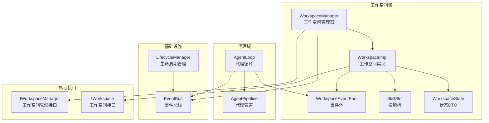
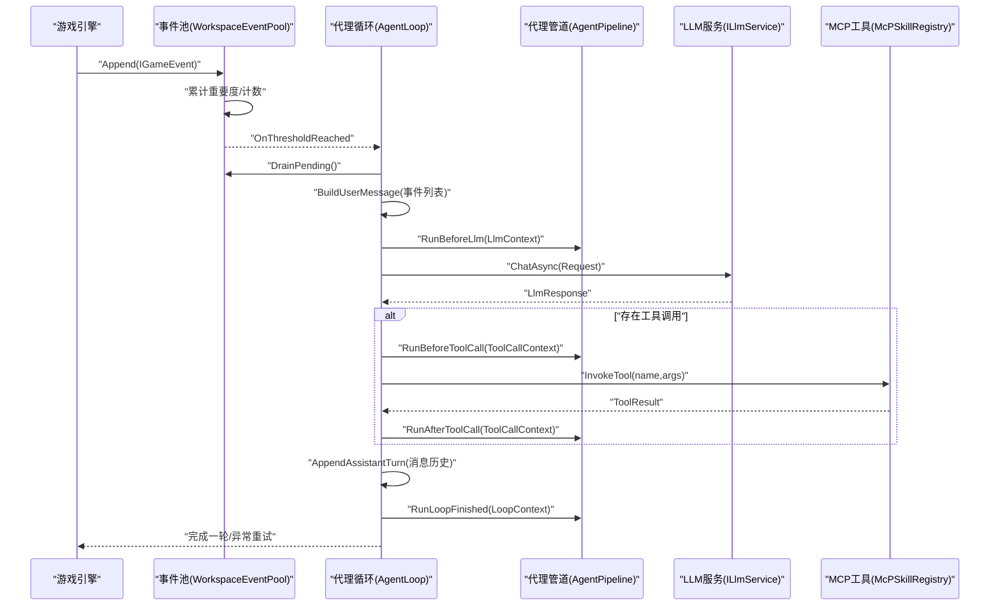
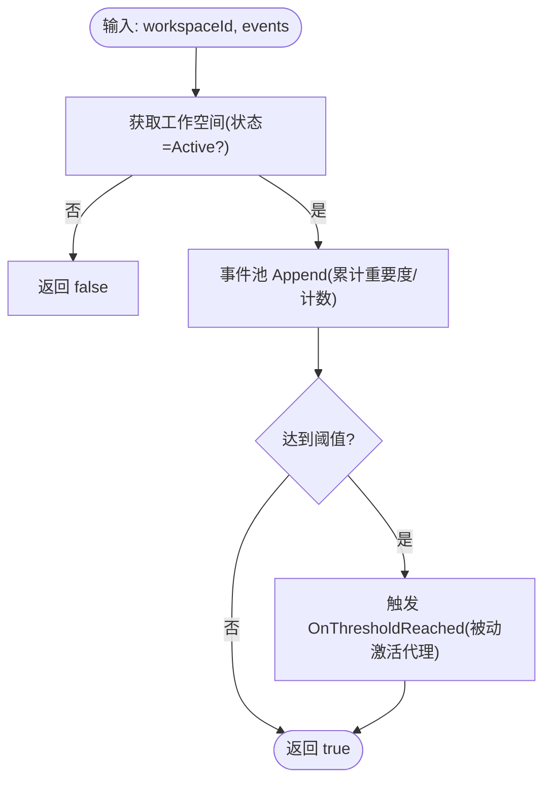
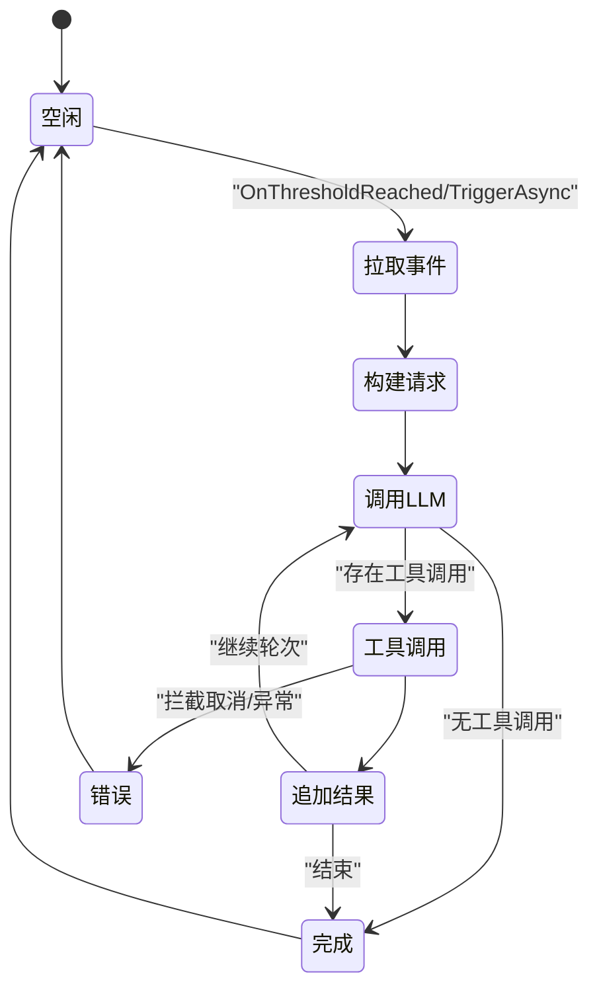
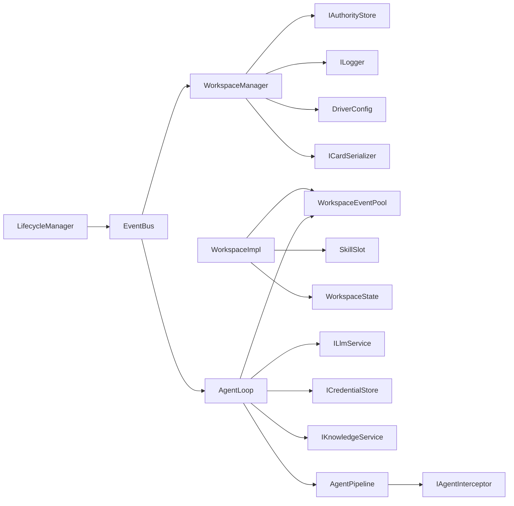

# 代理协调机制

<cite>
**本文引用的文件**
- [WorkspaceManager.cs](file://ext\NPCLife\src\NPCLife\Workspace\WorkspaceManager.cs)
- [AgentPipeline.cs](file://ext\NPCLife\src\NPCLife\Framework\AgentPipeline.cs)
- [IWorkspace.cs](file://ext\NPCLife\src\NPCLife\Workspace\IWorkspace.cs)
- [WorkspaceImpl.cs](file://ext\NPCLife\src\NPCLife\Workspace\WorkspaceImpl.cs)
- [IWorkspaceManager.cs](file://ext\NPCLife\src\NPCLife\Core\IWorkspaceManager.cs)
- [WorkspaceEventPool.cs](file://ext\NPCLife\src\NPCLife\Workspace\WorkspaceEventPool.cs)
- [SkillSlot.cs](file://ext\NPCLife\src\NPCLife\Workspace\SkillSlot.cs)
- [AgentLoop.cs](file://ext\NPCLife\src\NPCLife\Agent\AgentLoop.cs)
- [EventBus.cs](file://ext\NPCLife\src\NPCLife\Framework\EventBus.cs)
- [WorkspaceState.cs](file://ext\NPCLife\src\NPCLife\Workspace\WorkspaceState.cs)
- [RoleSkillProfile.cs](file://ext\NPCLife\src\NPCLife\Workspace\RoleSkillProfile.cs)
- [LifecycleManager.cs](file://ext\NPCLife\src\NPCLife\Framework\LifecycleManager.cs)
- [StorylineSignal.cs](file://ext\NPCLife\src\NPCLife\Workspace\StorylineSignal.cs)
- [RimLifeCore.cs](file://Source\Infrastructure\RimLifeCore.cs)
- [RimWorldSaveStore.cs](file://Source\Infrastructure\RimWorldSaveStore.cs)
</cite>

## 目录
1. [简介](#简介)
2. [项目结构](#项目结构)
3. [核心组件](#核心组件)
4. [架构总览](#架构总览)
5. [详细组件分析](#详细组件分析)
6. [依赖分析](#依赖分析)
7. [性能考虑](#性能考虑)
8. [故障排查指南](#故障排查指南)
9. [结论](#结论)
10. [附录](#附录)

## 简介
本文件系统性阐述“代理协调机制”的设计与实现，围绕多代理协作（导演、编剧、自由职业者）展开，重点说明：
- 工作空间管理器如何协调不同代理的工作，包括事件路由、优先级处理与资源分配
- 代理管道（AgentPipeline）的拦截点与执行流程
- 事件传递机制与冲突解决策略
- 权限控制与安全机制
- 状态同步与一致性保障
- 常见协调问题与性能优化建议

## 项目结构
本项目采用分层与功能域结合的组织方式：
- Workspace：工作空间域（状态、事件池、技能槽、分支/合并）
- Agent：代理执行域（AgentLoop、事件驱动、工具调用）
- Framework：基础设施（事件总线、生命周期、拦截管道）
- Core：抽象接口与契约
- Source：RimWorld集成（存档、凭证、UI）

图表来源
- [WorkspaceManager.cs:1-622](file://ext\NPCLife\src\NPCLife\Workspace\WorkspaceManager.cs#L1-L622)
- [WorkspaceImpl.cs:1-199](file://ext\NPCLife\src\NPCLife\Workspace\WorkspaceImpl.cs#L1-L199)
- [WorkspaceEventPool.cs:1-186](file://ext\NPCLife\src\NPCLife\Workspace\WorkspaceEventPool.cs#L1-L186)
- [SkillSlot.cs:1-61](file://ext\NPCLife\src\NPCLife\Workspace\SkillSlot.cs#L1-L61)
- [AgentLoop.cs:1-680](file://ext\NPCLife\src\NPCLife\Agent\AgentLoop.cs#L1-L680)
- [AgentPipeline.cs:1-248](file://ext\NPCLife\src\NPCLife\Framework\AgentPipeline.cs#L1-L248)
- [EventBus.cs:1-243](file://ext\NPCLife\src\NPCLife\Framework\EventBus.cs#L1-L243)
- [IWorkspaceManager.cs:1-58](file://ext\NPCLife\src\NPCLife\Core\IWorkspaceManager.cs#L1-L58)
- [IWorkspace.cs:1-57](file://ext\NPCLife\src\NPCLife\Workspace\IWorkspace.cs#L1-L57)

章节来源
- [WorkspaceManager.cs:1-622](file://ext\NPCLife\src\NPCLife\Workspace\WorkspaceManager.cs#L1-L622)
- [AgentLoop.cs:1-680](file://ext\NPCLife\src\NPCLife\Agent\AgentLoop.cs#L1-L680)

## 核心组件
- 工作空间管理器（WorkspaceManager）：负责工作空间的创建、查询、状态变更、分支/合并、事件路由与持久化；通过事件总线广播状态变更。
- 工作空间实现（WorkspaceImpl）：封装 WorkspaceState，暴露事件池与技能槽；提供台词推送与回合结束能力；校验调用方角色权限。
- 事件池（WorkspaceEventPool）：双层缓冲（持久化 pending + 内存 recent），阈值触发；支持 DrainPending 与查询。
- 技能槽（SkillSlot）：管理激活的 MCP 技能集合，与注册表交互，触发更新回调。
- 代理循环（AgentLoop）：被动激活（订阅事件池阈值）、显式状态机、工具调用循环、统一错误与重试路径。
- 代理管道（AgentPipeline）：拦截器链（BeforePrompt/BeforeLlm/BeforeToolCall/AfterToolCall/LoopFinished），按优先级执行。
- 事件总线（EventBus）：命名空间事件名、优先级排序、错误隔离、统一发布/订阅。
- 生命周期管理（LifecycleManager）：组件注册、初始化/销毁钩子、存档切换重置。

章节来源
- [WorkspaceManager.cs:1-622](file://ext\NPCLife\src\NPCLife\Workspace\WorkspaceManager.cs#L1-L622)
- [WorkspaceImpl.cs:1-199](file://ext\NPCLife\src\NPCLife\Workspace\WorkspaceImpl.cs#L1-L199)
- [WorkspaceEventPool.cs:1-186](file://ext\NPCLife\src\NPCLife\Workspace\WorkspaceEventPool.cs#L1-L186)
- [SkillSlot.cs:1-61](file://ext\NPCLife\src\NPCLife\Workspace\SkillSlot.cs#L1-L61)
- [AgentLoop.cs:1-680](file://ext\NPCLife\src\NPCLife\Agent\AgentLoop.cs#L1-L680)
- [AgentPipeline.cs:1-248](file://ext\NPCLife\src\NPCLife\Framework\AgentPipeline.cs#L1-L248)
- [EventBus.cs:1-243](file://ext\NPCLife\src\NPCLife\Framework\EventBus.cs#L1-L243)
- [LifecycleManager.cs:1-264](file://ext\NPCLife\src\NPCLife\Framework\LifecycleManager.cs#L1-L264)

## 架构总览
多代理协作围绕“工作空间”展开，导演负责结构决策（分支/合并/关闭），编剧负责叙事创作（台词推送/回合结束），自由职业者负责临时事件响应。事件从游戏侧进入事件池，达到阈值后由代理循环驱动，通过工具调用与知识服务完成创作闭环。

图表来源
- [WorkspaceEventPool.cs:1-186](file://ext\NPCLife\src\NPCLife\Workspace\WorkspaceEventPool.cs#L1-L186)
- [AgentLoop.cs:1-680](file://ext\NPCLife\src\NPCLife\Agent\AgentLoop.cs#L1-L680)
- [AgentPipeline.cs:1-248](file://ext\NPCLife\src\NPCLife\Framework\AgentPipeline.cs#L1-L248)

## 详细组件分析

### 工作空间管理器（WorkspaceManager）
- 职责与边界
  - CRUD：创建、查询、列表、状态更新
  - 结构操作：分支（仅导演）、合并（仅导演）
  - 事件路由：将事件写入目标工作空间的事件池
  - 持久化：统一序列化/反序列化并写入存储
- 并发与一致性
  - 读写锁保护内存工作空间列表
  - 状态转换严格校验（Active/Suspended 可互转；Completed/Abandoned 不可逆）
- 事件广播
  - 创建/更新/关闭工作空间均通过事件总线广播，便于 UI 与其它组件响应

图表来源
- [WorkspaceManager.cs:382-392](file://ext\NPCLife\src\NPCLife\Workspace\WorkspaceManager.cs#L382-L392)
- [WorkspaceEventPool.cs:49-90](file://ext\NPCLife\src\NPCLife\Workspace\WorkspaceEventPool.cs#L49-L90)

章节来源
- [WorkspaceManager.cs:1-622](file://ext\NPCLife\src\NPCLife\Workspace\WorkspaceManager.cs#L1-L622)

### 工作空间实现（WorkspaceImpl）
- 角色权限
  - PushLine/FinishRound 仅允许 Screenwriter/Freelancer 调用
  - 状态必须为 Active
- 台词推送与回合结束
  - PushLine 立即发布 ScriptLineReady 事件，交由脚本投递服务逐行显示
  - FinishRound 归档回合、更新 CurrentRecap/Outcome/DirectorMessage，并发布 ScriptReady
- 技能槽与事件池
  - 通过 SkillSlot 管理激活技能，变更时触发更新回调
  - 事件池提供 DrainPending、查询与阈值检测

章节来源
- [WorkspaceImpl.cs:1-199](file://ext\NPCLife\src\NPCLife\Workspace\WorkspaceImpl.cs#L1-L199)

### 事件池（WorkspaceEventPool）
- 双层缓冲
  - pending：持久化到 WorkspaceState（EventCache/PendingEventIds/PendingImportance）
  - recent：内存缓存（RecentHistoryCapacity），支持查询与最小重要度淘汰
- 阈值触发
  - 基于 DriverConfig 的有效计数/重要度阈值，达到后触发 OnThresholdReached
- DrainPending
  - 将 pending 清空并返回事件列表，供代理循环使用

章节来源
- [WorkspaceEventPool.cs:1-186](file://ext\NPCLife\src\NPCLife\Workspace\WorkspaceEventPool.cs#L1-L186)

### 技能槽（SkillSlot）
- 激活/停用技能
  - 系统技能不可停用；激活时返回工具定义 JSON
  - 修改后通过回调通知上层更新
- 与注册表交互
  - 通过 McpSkillRegistry 获取工具定义与执行结果

章节来源
- [SkillSlot.cs:1-61](file://ext\NPCLife\src\NPCLife\Workspace\SkillSlot.cs#L1-L61)

### 代理循环（AgentLoop）
- 被动激活
  - 订阅事件池 OnThresholdReached，避免轮询
- 显式状态机
  - Idle → DrainingEvents → BuildingRequest → CallingLlm → ExecutingTools → AppendingToolResults → Finishing
- 工具调用循环
  - 每轮 LLM 响应后遍历 ToolCalls，支持拦截器 Before/After
- 统一错误与重试
  - 失败路径：回灌已 drain 的事件，重新排队
- 凭证解析
  - 优先使用模型引用列表，当前选中模型置前，回退到全局激活凭证

图表来源
- [AgentLoop.cs:1-680](file://ext\NPCLife\src\NPCLife\Agent\AgentLoop.cs#L1-L680)

章节来源
- [AgentLoop.cs:1-680](file://ext\NPCLife\src\NPCLife\Agent\AgentLoop.cs#L1-L680)

### 代理管道（AgentPipeline）
- 拦截点
  - OnBeforePrompt：修改事件列表/上下文
  - OnBeforeLlm：调整 LLM 请求（消息、工具、温度等）
  - OnBeforeToolCall：审查参数、可取消、改写参数
  - OnAfterToolCall：审查/改写工具返回
  - OnLoopFinished：统计/审计/清理
- 优先级与执行
  - 按 priority 升序执行；任一拦截器取消工具调用可提前终止

章节来源
- [AgentPipeline.cs:1-248](file://ext\NPCLife\src\NPCLife\Framework\AgentPipeline.cs#L1-L248)

### 事件总线（EventBus）与生命周期（LifecycleManager）
- 事件总线
  - 命名空间事件名、优先级排序、错误隔离
  - 预定义框架事件常量（Agent/LLM/Workspace/Script 等）
- 生命周期管理
  - 初始化/销毁钩子、组件注册、存档切换重置
  - 与事件总线配合，确保组件有序启停

章节来源
- [EventBus.cs:1-243](file://ext\NPCLife\src\NPCLife\Framework\EventBus.cs#L1-L243)
- [LifecycleManager.cs:1-264](file://ext\NPCLife\src\NPCLife\Framework\LifecycleManager.cs#L1-L264)

### 角色与权限、状态与信号
- 角色与权限
  - Director：分支/合并/关闭；不参与叙事
  - Screenwriter/Freelancer：叙事创作；台词推送/回合结束
- 状态与信号
  - WorkspaceStatus：Active/Suspended/Completed/Abandoned
  - StorylineSignal：Progressing/StorylineComplete/NeedsBranch/Stuck/ReadyForMerge
- 角色技能预设
  - 不同角色默认激活不同技能集，影响工具调用能力

章节来源
- [WorkspaceState.cs:1-162](file://ext\NPCLife\src\NPCLife\Workspace\WorkspaceState.cs#L1-L162)
- [RoleSkillProfile.cs:1-74](file://ext\NPCLife\src\NPCLife\Workspace\RoleSkillProfile.cs#L1-L74)
- [StorylineSignal.cs:1-46](file://ext\NPCLife\src\NPCLife\Workspace\StorylineSignal.cs#L1-L46)

## 依赖分析
- 组件耦合
  - WorkspaceManager 依赖 IAuthorityStore、ILogger、DriverConfig、ICardSerializer
  - WorkspaceImpl 依赖 WorkspaceState、DriverConfig、ICardSerializer、SkillSlot、EventPool
  - AgentLoop 依赖 IEventLog、ILlmService、ICredentialStore、IKnowledgeService、AgentPipeline
  - AgentPipeline 依赖拦截器接口与静态调度
  - EventBus/LifecycleManager 为纯静态基础设施
- 外部集成
  - 存档：IAuthorityStore（RimWorldSaveStore 实现）
  - 凭证：CredentialRegistry（RimLifeCore 中管理）
  - UI/日志：UiLoggerAdapter/RimLifeCore

图表来源
- [WorkspaceManager.cs:1-622](file://ext\NPCLife\src\NPCLife\Workspace\WorkspaceManager.cs#L1-L622)
- [AgentLoop.cs:1-680](file://ext\NPCLife\src\NPCLife\Agent\AgentLoop.cs#L1-L680)
- [AgentPipeline.cs:1-248](file://ext\NPCLife\src\NPCLife\Framework\AgentPipeline.cs#L1-L248)
- [EventBus.cs:1-243](file://ext\NPCLife\src\NPCLife\Framework\EventBus.cs#L1-L243)
- [LifecycleManager.cs:1-264](file://ext\NPCLife\src\NPCLife\Framework\LifecycleManager.cs#L1-L264)
- [RimWorldSaveStore.cs:1-100](file://Source\Infrastructure\RimWorldSaveStore.cs#L1-L100)
- [RimLifeCore.cs:1-1200](file://Source\Infrastructure\RimLifeCore.cs#L1-L1200)

章节来源
- [WorkspaceManager.cs:1-622](file://ext\NPCLife\src\NPCLife\Workspace\WorkspaceManager.cs#L1-L622)
- [AgentLoop.cs:1-680](file://ext\NPCLife\src\NPCLife\Agent\AgentLoop.cs#L1-L680)
- [RimLifeCore.cs:1-1200](file://Source\Infrastructure\RimLifeCore.cs#L1-L1200)

## 性能考虑
- 事件池阈值与批处理
  - 通过阈值聚合事件，减少 LLM 调用频次，提升吞吐
  - 建议根据场景调整 DriverConfig 的有效计数/重要度阈值
- 工具调用循环
  - 单轮多工具调用需注意消息历史长度与 Token 消耗，必要时拆轮
- 并发与锁
  - WorkspaceManager 使用读写锁，避免热点竞争；序列化/反序列化批量处理
- 缓存与淘汰
  - recent 历史按最小重要度淘汰，平衡内存占用与查询效率
- 代理循环防抖
  - 通过信号量防止并发重入，CancellationToken 串联失败路径

## 故障排查指南
- 代理未被激活
  - 检查事件池是否达到阈值（PendingCount/TotalImportance）
  - 确认 WorkspaceStatus 为 Active
- 工具调用被拦截取消
  - 检查拦截器优先级与取消标志位
- LLM 调用失败
  - 查看事件总线中的 LlmError 事件与错误日志
  - 核对凭证解析（模型引用/当前选中模型）
- 工作空间状态异常
  - 校验状态转换合法性（Active/Suspended 可互转；Completed/Abandoned 不可逆）
- 权限拒绝
  - PushLine/FinishRound 仅允许 Screenwriter/Freelancer；Director 无此权限

章节来源
- [WorkspaceEventPool.cs:81-90](file://ext\NPCLife\src\NPCLife\Workspace\WorkspaceEventPool.cs#L81-L90)
- [WorkspaceImpl.cs:85-125](file://ext\NPCLife\src\NPCLife\Workspace\WorkspaceImpl.cs#L85-L125)
- [AgentLoop.cs:326-399](file://ext\NPCLife\src\NPCLife\Agent\AgentLoop.cs#L326-L399)
- [EventBus.cs:186-242](file://ext\NPCLife\src\NPCLife\Framework\EventBus.cs#L186-L242)
- [WorkspaceManager.cs:406-423](file://ext\NPCLife\src\NPCLife\Workspace\WorkspaceManager.cs#L406-L423)

## 结论
该代理协调机制以“工作空间”为核心载体，通过事件池阈值驱动与代理管道拦截实现多代理协作。导演、编剧、自由职业者各司其职，权限与状态严格约束，事件总线与生命周期管理确保系统可观测与可维护。通过合理的阈值、工具调用策略与并发控制，可在保证一致性的同时获得良好性能。

## 附录

### 代理协调配置与调试要点
- 配置项参考
  - DriverConfig：阈值、最近历史容量、最大轮次等
  - AgentPipeline：拦截器优先级与注册
  - WorkspaceManager：持久化存储键、时间提供器、日志器
- 调试建议
  - 订阅框架事件：agent.activated、agent.round_complete、agent.loop_finished、llm.request_sent、llm.response_received、tool.invoking、tool.invoked、workspace.created/updated/closed、script.line_ready/script.ready
  - 使用 LifecycleManager 的 OnInit/OnDestroy 钩子进行组件级诊断
  - 通过 EventBus.SubscriberCount 与已订阅事件列表定位订阅泄漏

章节来源
- [EventBus.cs:186-242](file://ext\NPCLife\src\NPCLife\Framework\EventBus.cs#L186-L242)
- [LifecycleManager.cs:107-149](file://ext\NPCLife\src\NPCLife\Framework\LifecycleManager.cs#L107-L149)

### 权限控制与安全机制
- 角色权限
  - PushLine/FinishRound 仅允许 Screenwriter/Freelancer
  - 分支/合并/关闭仅允许 Director
- 系统技能保护
  - 系统技能不可停用，避免破坏基础能力
- 凭证安全
  - 凭证解析优先使用模型引用列表，当前选中模型置前，回退到全局激活凭证
  - 存档集成：IAuthorityStore（RimWorldSaveStore）保障数据持久化

章节来源
- [WorkspaceImpl.cs:90-100](file://ext\NPCLife\src\NPCLife\Workspace\WorkspaceImpl.cs#L90-L100)
- [WorkspaceImpl.cs:130-140](file://ext\NPCLife\src\NPCLife\Workspace\WorkspaceImpl.cs#L130-L140)
- [SkillSlot.cs:29-31](file://ext\NPCLife\src\NPCLife\Workspace\SkillSlot.cs#L29-L31)
- [AgentLoop.cs:569-607](file://ext\NPCLife\src\NPCLife\Agent\AgentLoop.cs#L569-L607)
- [RimWorldSaveStore.cs:1-100](file://Source\Infrastructure\RimWorldSaveStore.cs#L1-L100)