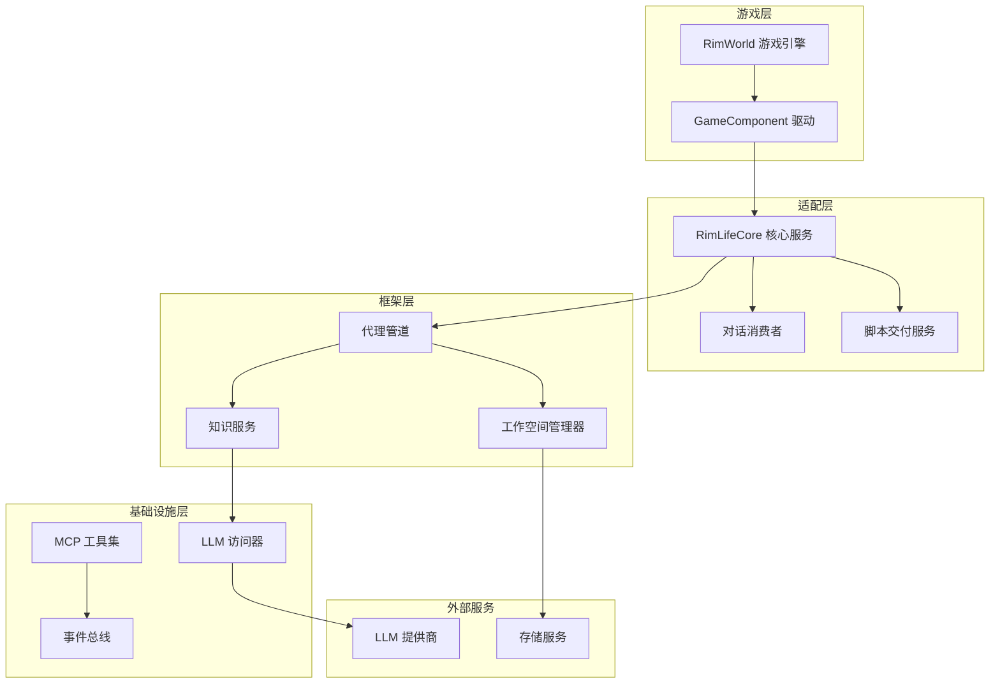
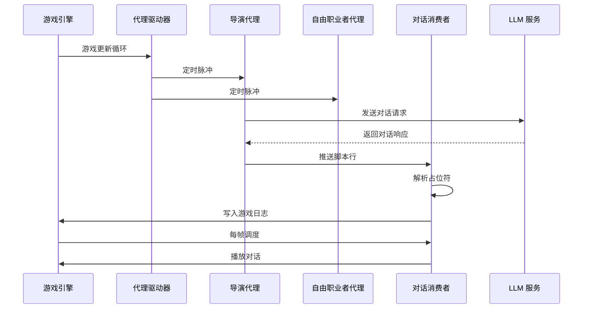
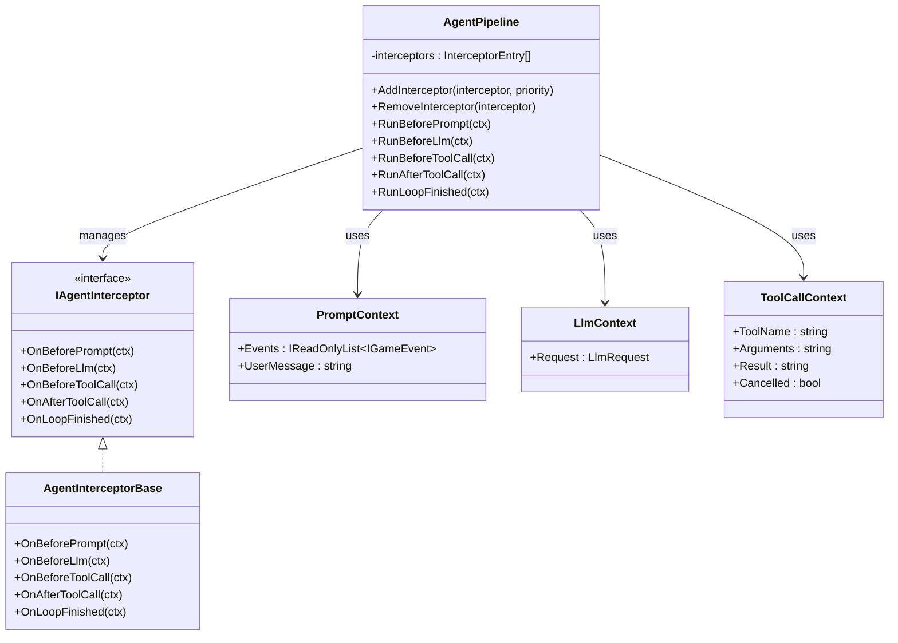
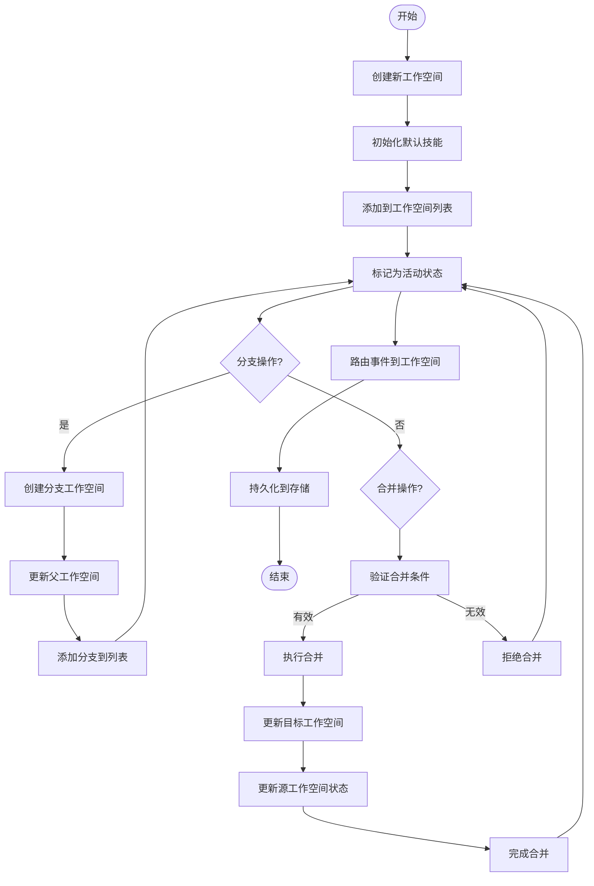
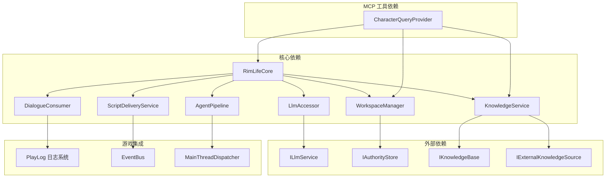

# 对话系统

<cite>
**本文档引用的文件**
- [RimLifeCore.cs](file://Source/Infrastructure/RimLifeCore.cs)
- [DialogueConsumer.cs](file://Source/Infrastructure/DialogueConsumer.cs)
- [RimWorldAgentDriver.cs](file://Source/Infrastructure/RimWorldAgentDriver.cs)
- [ScriptDeliveryService.cs](file://ext/npclife/src/npclife/infrastructure/scriptdeliveryservice.cs)
- [KnowledgeService.cs](file://ext/npclife/src/npclife/core/knowledgeservice.cs)
- [AgentPipeline.cs](file://ext/npclife/src/npclife/framework/agentpipeline.cs)
- [LlmAccessor.cs](file://ext/npclife/src/npclife/infrastructure/lmm/llmaccesor.cs)
- [WorkspaceManager.cs](file://ext/npclife/src/npclife/workspace/workspacemanager.cs)
- [CharacterQueryProvider.cs](file://Source/Infrastructure/Mcp/CharacterQueryProvider.cs)
- [ScriptLine.cs](file://ext/npclife/src/npclife/framework/script/scriptline.cs)
- [ScriptFormat.cs](file://ext/npclife/src/npclife/framework/script/scriptformat.cs)
- [ILlmService.cs](file://ext/npclife/src/npclife/core/illmservice.cs)
</cite>

## 目录
1. [简介](#简介)
2. [项目结构](#项目结构)
3. [核心组件](#核心组件)
4. [架构概览](#架构概览)
5. [详细组件分析](#详细组件分析)
6. [依赖关系分析](#依赖关系分析)
7. [性能考虑](#性能考虑)
8. [故障排除指南](#故障排除指南)
9. [结论](#结论)

## 简介

这是一个基于 RimWorld 的 AI 对话系统，集成了大语言模型（LLM）和智能代理技术，为游戏提供动态叙事体验。系统通过 MCP（Model Context Protocol）工具集成为 RimWorld 提供丰富的查询和操作能力，同时实现了复杂的事件驱动架构来管理对话流程。

该系统的核心目标是在 RimWorld 游戏环境中创造更加生动和连贯的 NPC 对话体验，通过 AI 驱动的叙事生成和实时对话管理，让玩家能够体验到更具沉浸感的游戏故事。

## 项目结构

系统采用分层架构设计，主要分为以下几个层次：



**图表来源**
- [RimLifeCore.cs:18-364](file://Source/Infrastructure/RimLifeCore.cs#L18-L364)
- [WorkspaceManager.cs:19-40](file://ext/npclife/src/npclife/workspace/workspacemanager.cs#L19-L40)

**章节来源**
- [RimLifeCore.cs:18-364](file://Source/Infrastructure/RimLifeCore.cs#L18-L364)
- [WorkspaceManager.cs:19-40](file://ext/npclife/src/npclife/workspace/workspacemanager.cs#L19-L40)

## 核心组件

### RimLifeCore - 核心服务定位器

RimLifeCore 是整个系统的核心协调器，负责管理所有子系统的生命周期和配置。它提供了以下关键功能：

- **全局配置管理**：集中管理框架配置、提示词附加项和驱动配置
- **组件生命周期管理**：负责所有核心组件的初始化、更新和销毁
- **事件系统集成**：维护事件缓冲区和事件总线
- **MCP 工具注册**：动态注册和管理各种 MCP 工具

### 对话消费者 - DialogueConsumer

DialogueConsumer 负责接收来自 AI 代理的对话内容，并将其正确地呈现给 RimWorld 游戏环境：

- **时间调度**：基于游戏时间轴精确控制对话播放时机
- **多线程安全**：通过主线程调度器确保 UI 线程安全
- **日志记录**：为说话者和听众创建相应的游戏日志条目
- **内存管理**：智能管理对话数据的内存使用

### 脚本交付服务 - ScriptDeliveryService

脚本交付服务是 AI 代理与游戏系统之间的桥梁，负责将 AI 生成的对话内容转换为游戏可识别的格式：

- **事件监听**：订阅 AI 代理发出的脚本事件
- **格式转换**：将 AI 输出转换为标准的 ScriptLine 结构
- **占位符解析**：将 pawnId 等占位符解析为实际的游戏对象
- **批量处理**：支持单行和整轮对话的批量处理模式

**章节来源**
- [RimLifeCore.cs:24-364](file://Source/Infrastructure/RimLifeCore.cs#L24-L364)
- [DialogueConsumer.cs:24-304](file://Source/Infrastructure/DialogueConsumer.cs#L24-L304)
- [ScriptDeliveryService.cs:19-225](file://ext/npclife/src/npclife/infrastructure/scriptdeliveryservice.cs#L19-L225)

## 架构概览

系统采用事件驱动的异步架构，通过多个代理角色协同工作来实现复杂的对话管理：



**图表来源**
- [RimWorldAgentDriver.cs:13-37](file://Source/Infrastructure/RimWorldAgentDriver.cs#L13-L37)
- [DialogueConsumer.cs:111-133](file://Source/Infrastructure/DialogueConsumer.cs#L111-L133)
- [LlmAccessor.cs:47-71](file://ext/npclife/src/npclife/infrastructure/lmm/llmaccesor.cs#L47-L71)

## 详细组件分析

### 代理管道系统

AgentPipeline 提供了一个强大的拦截器机制，允许在 AI 代理的处理流程中插入自定义逻辑：



**图表来源**
- [AgentPipeline.cs:18-248](file://ext/npclife/src/npclife/framework/agentpipeline.cs#L18-L248)

### 工作空间管理系统

工作空间管理器负责维护 AI 代理的工作环境和状态：



**图表来源**
- [WorkspaceManager.cs:91-138](file://ext/npclife/src/npclife/workspace/workspacemanager.cs#L91-L138)
- [WorkspaceManager.cs:193-263](file://ext/npclife/src/npclife/workspace/workspacemanager.cs#L193-L263)
- [WorkspaceManager.cs:269-376](file://ext/npclife/src/npclife/workspace/workspacemanager.cs#L269-L376)

### 知识服务架构

知识服务提供了统一的知识查询接口，整合了内部缓存和外部知识源：

```mermaid
graph LR
subgraph "查询接口"
Lookup[Lookup(term)]
Store[Store(entry)]
Delete[Delete(term)]
ListAll[ListAll()]
ListByTags[ListByTags(tags)]
ListByPrefix[ListByPrefix(prefix)]
end
subgraph "内部缓存"
Cache[IKnowledgeBase]
CacheData[缓存数据]
end
subgraph "外部知识源"
External1[IExternalKnowledgeSource #1]
External2[IExternalKnowledgeSource #2]
ExternalN[IExternalKnowledgeSource #N]
end
Lookup --> Cache
Lookup --> External1
Lookup --> External2
Lookup --> ExternalN
Store --> Cache
Delete --> Cache
ListAll --> Cache
ListByTags --> Cache
ListByPrefix --> Cache
```

**图表来源**
- [KnowledgeService.cs:28-64](file://ext/npclife/src/npclife/core/knowledgeservice.cs#L28-L64)

**章节来源**
- [AgentPipeline.cs:18-248](file://ext/npclife/src/npclife/framework/agentpipeline.cs#L18-L248)
- [WorkspaceManager.cs:91-376](file://ext/npclife/src/npclife/workspace/workspacemanager.cs#L91-L376)
- [KnowledgeService.cs:13-64](file://ext/npclife/src/npclife/core/knowledgeservice.cs#L13-L64)

## 依赖关系分析

系统采用了松耦合的设计原则，通过接口和事件实现组件间的解耦：



**图表来源**
- [RimLifeCore.cs:24-364](file://Source/Infrastructure/RimLifeCore.cs#L24-L364)
- [CharacterQueryProvider.cs:17-31](file://Source/Infrastructure/Mcp/CharacterQueryProvider.cs#L17-L31)
- [ILlmService.cs:17-51](file://ext/npclife/src/npclife/core/illmservice.cs#L17-L51)

**章节来源**
- [RimLifeCore.cs:24-364](file://Source/Infrastructure/RimLifeCore.cs#L24-L364)
- [CharacterQueryProvider.cs:17-31](file://Source/Infrastructure/Mcp/CharacterQueryProvider.cs#L17-L31)
- [ILlmService.cs:17-51](file://ext/npclife/src/npclife/core/illmservice.cs#L17-L51)

## 性能考虑

系统在设计时充分考虑了性能优化：

### 时间复杂度优化
- **事件缓冲**：通过事件缓冲减少频繁的事件处理开销
- **优先队列**：使用优先队列实现 O(log n) 的对话调度
- **缓存策略**：知识服务采用多级缓存减少重复查询

### 内存管理
- **垃圾回收友好**：大量使用值类型和轻量级对象
- **内存池**：对频繁创建的对象使用内存池技术
- **及时释放**：确保长时间运行的任务能够及时释放资源

### 并发处理
- **异步编程**：全面采用 async/await 模式避免阻塞
- **线程安全**：关键数据结构采用并发安全设计
- **锁粒度优化**：最小化锁的范围和持有时间

## 故障排除指南

### 常见问题诊断

**对话不显示问题**
1. 检查 ScriptDeliveryService 是否正确初始化
2. 验证 EventBus 是否正常工作
3. 确认 IScriptConsumer 是否正确注册

**性能问题**
1. 检查事件缓冲是否过大
2. 监控 AgentPipeline 的拦截器数量
3. 验证 LLM 调用频率

**内存泄漏**
1. 确认所有 IDisposable 对象都正确释放
2. 检查事件订阅是否正确取消
3. 验证缓存策略的有效性

### 调试技巧

系统提供了完善的日志记录机制，可以通过以下方式启用详细调试：

1. **配置诊断模式**：在 FrameworkConfig 中启用详细日志
2. **监控事件流**：使用 FrameworkStatus 报告器查看系统状态
3. **性能分析**：利用 RuntimeMetrics 追踪性能指标

**章节来源**
- [RimLifeCore.cs:145-168](file://Source/Infrastructure/RimLifeCore.cs#L145-L168)
- [DialogueConsumer.cs:97-132](file://Source/Infrastructure/DialogueConsumer.cs#L97-L132)

## 结论

这个对话系统展现了现代 AI 驱动游戏开发的最佳实践，通过精心设计的架构实现了高度的模块化和可扩展性。系统的核心优势包括：

1. **架构清晰**：分层设计使得各个组件职责明确，易于维护和扩展
2. **性能优秀**：通过多种优化技术确保了良好的运行效率
3. **功能强大**：支持复杂的对话管理和实时叙事生成
4. **易于集成**：提供了标准化的接口和协议，便于与其他系统集成

该系统为 RimWorld 游戏提供了强大的 AI 对话能力，为玩家创造了更加丰富和沉浸的游戏体验。随着技术的不断发展，系统还具备良好的扩展性，可以支持更多先进的 AI 功能。