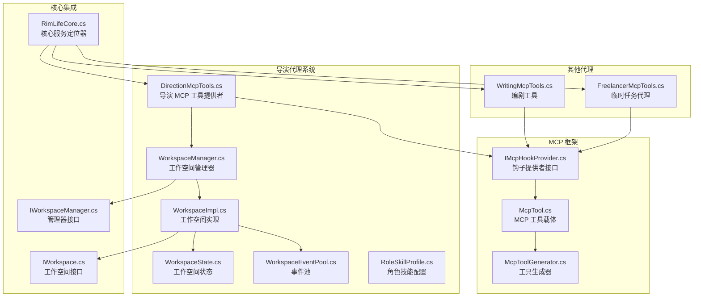
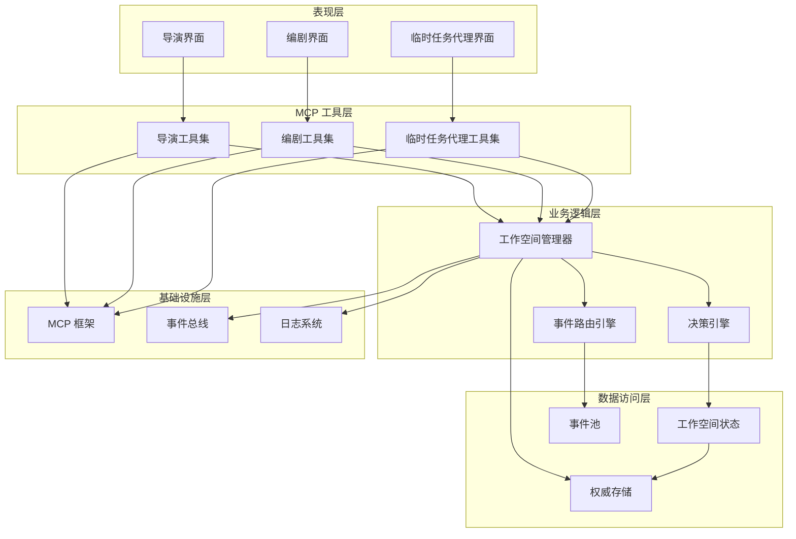
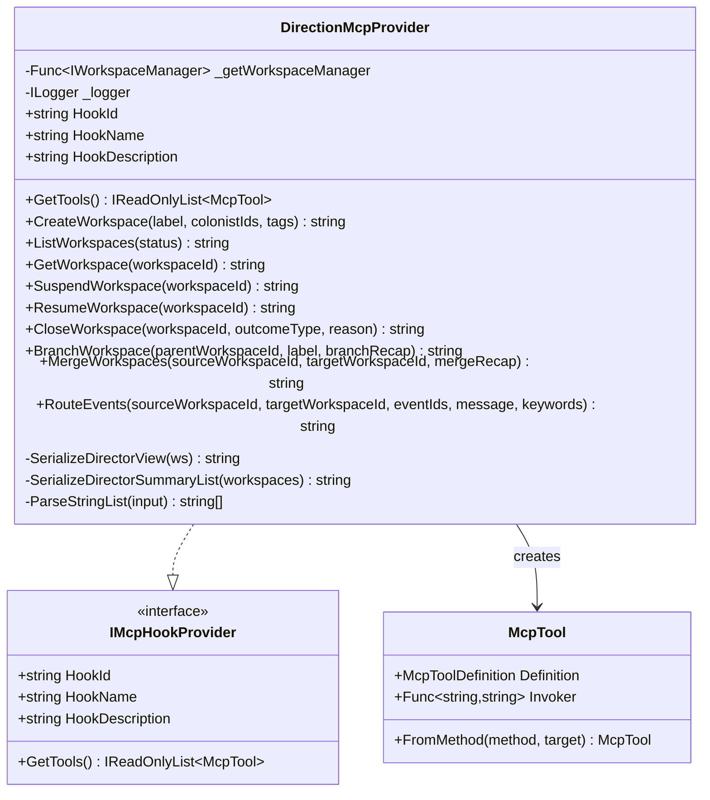
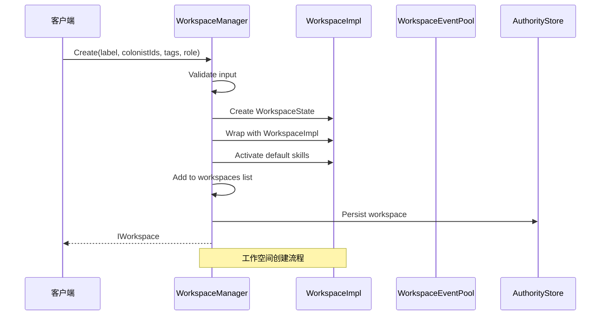
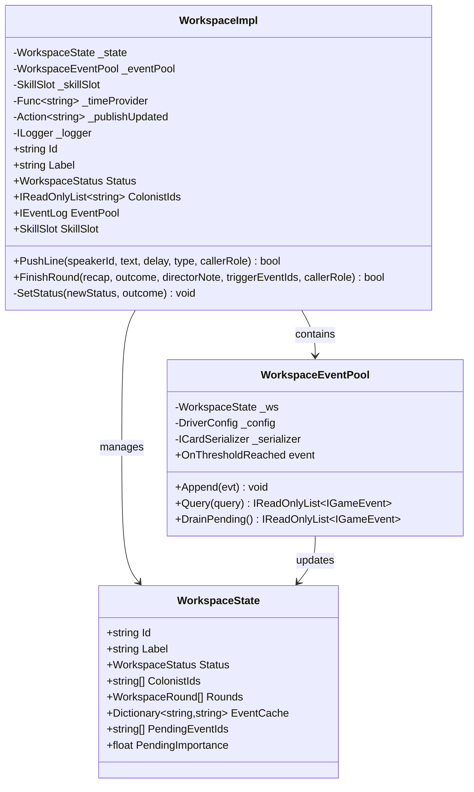
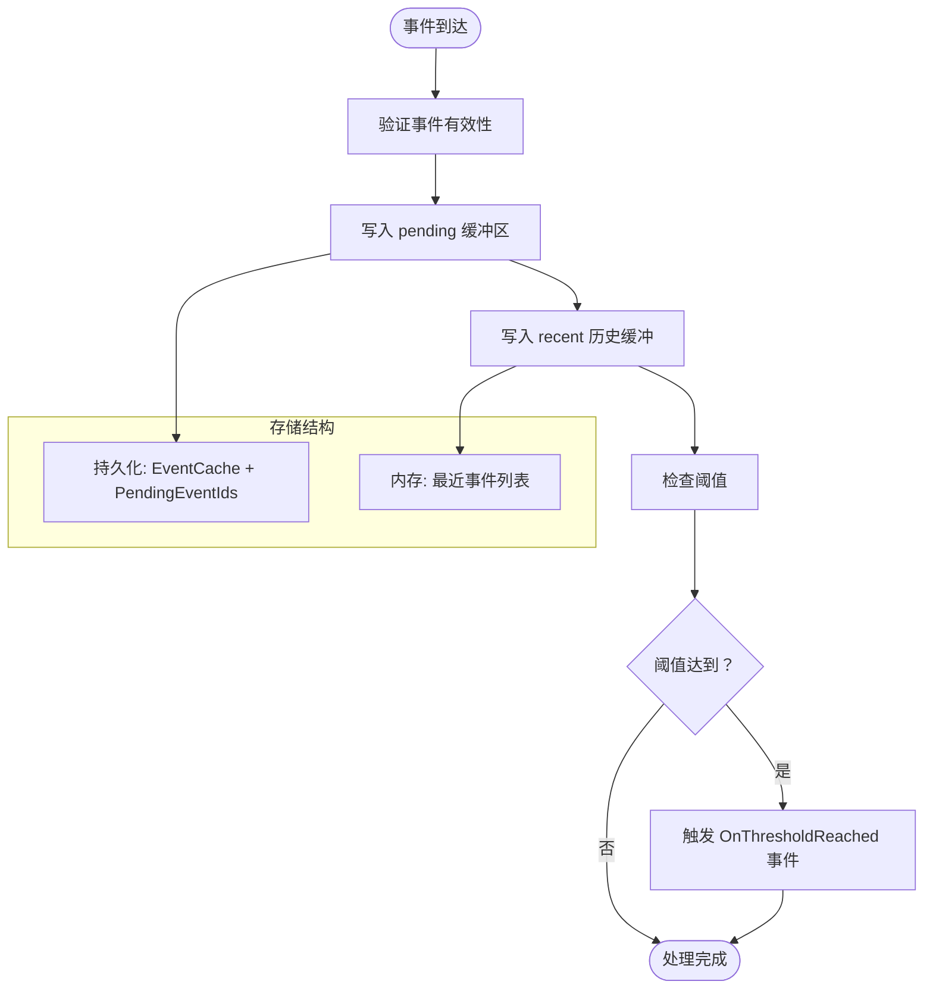
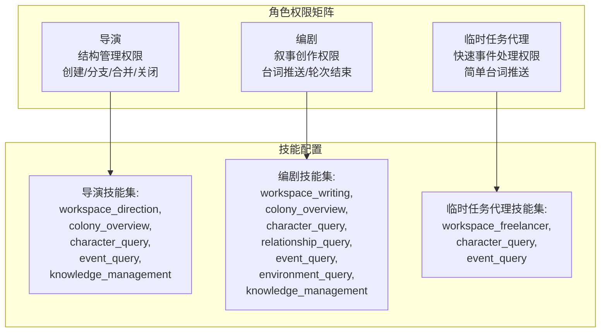
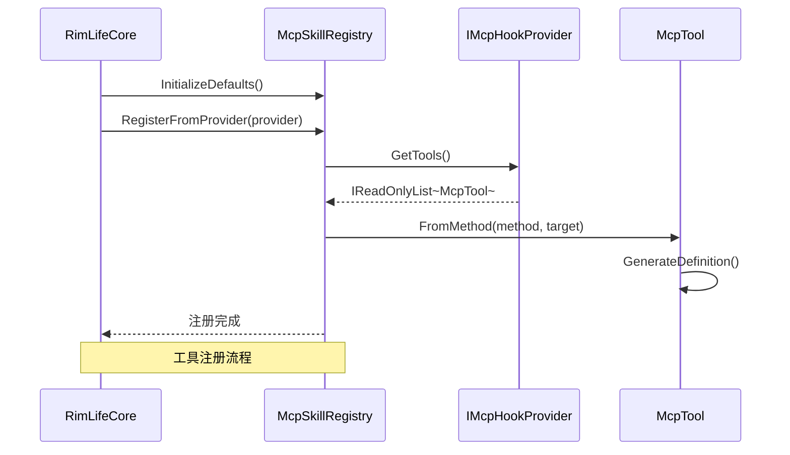

# 导演代理系统

<cite>
**本文档引用的文件**
- [DirectionMcpTools.cs](file://ext\NPCLife\src\NPCLife\Workspace\DirectionMcpTools.cs)
- [IWorkspace.cs](file://ext\NPCLife\src\NPCLife\Workspace\IWorkspace.cs)
- [WorkspaceImpl.cs](file://ext\NPCLife\src\NPCLife\Workspace\WorkspaceImpl.cs)
- [WorkspaceManager.cs](file://ext\NPCLife\src\NPCLife\Workspace\WorkspaceManager.cs)
- [WorkspaceState.cs](file://ext\NPCLife\src\NPCLife\Workspace\WorkspaceState.cs)
- [WorkspaceEventPool.cs](file://ext\NPCLife\src\NPCLife\Workspace\WorkspaceEventPool.cs)
- [RoleSkillProfile.cs](file://ext\NPCLife\src\NPCLife\Workspace\RoleSkillProfile.cs)
- [WritingMcpTools.cs](file://ext\NPCLife\src\NPCLife\Workspace\WritingMcpTools.cs)
- [FreelancerMcpTools.cs](file://ext\NPCLife\src\NPCLife\Workspace\FreelancerMcpTools.cs)
- [IMcpHookProvider.cs](file://ext\NPCLife\src\NPCLife\Framework\Mcp\IMcpHookProvider.cs)
- [McpTool.cs](file://ext\NPCLife\src\NPCLife\Framework\Mcp\McpTool.cs)
- [McpToolGenerator.cs](file://ext\NPCLife\src\NPCLife\Framework\Mcp\McpToolGenerator.cs)
- [IWorkspaceManager.cs](file://ext\NPCLife\src\NPCLife\Core\IWorkspaceManager.cs)
- [RimLifeCore.cs](file://Source\Infrastructure\RimLifeCore.cs)
</cite>

## 目录
1. [简介](#简介)
2. [项目结构](#项目结构)
3. [核心组件](#核心组件)
4. [架构概览](#架构概览)
5. [详细组件分析](#详细组件分析)
6. [依赖关系分析](#依赖关系分析)
7. [性能考虑](#性能考虑)
8. [故障排除指南](#故障排除指南)
9. [结论](#结论)
10. [附录](#附录)

## 简介
导演代理系统是 RimLife 项目中负责剧情线工作空间管理的核心模块。该系统通过 MCP（Model Context Protocol）工具提供者模式，实现了导演、编剧和临时任务代理之间的协作机制。系统支持工作空间的创建、分支、合并、生命周期管理，并提供了事件路由决策功能。

导演代理系统采用零静态耦合的设计理念，通过 IMcpHookProvider 接口注入依赖，实现了高度模块化的架构设计。系统不仅支持传统的线性叙事，还支持复杂的分支合并机制，为游戏提供了丰富的剧情创作工具。

## 项目结构
导演代理系统位于 ext\NPCLife\src\NPCLife\Workspace 目录下，主要包含以下核心文件：

**图表来源**
- [DirectionMcpTools.cs:1-460](file://ext\NPCLife\src\NPCLife\Workspace\DirectionMcpTools.cs#L1-L460)
- [WorkspaceManager.cs:1-622](file://ext\NPCLife\src\NPCLife\Workspace\WorkspaceManager.cs#L1-L622)
- [IMcpHookProvider.cs:1-38](file://ext\NPCLife\src\NPCLife\Framework\Mcp\IMcpHookProvider.cs#L1-L38)

**章节来源**
- [DirectionMcpTools.cs:10-460](file://ext\NPCLife\src\NPCLife\Workspace\DirectionMcpTools.cs#L10-L460)
- [WorkspaceManager.cs:14-622](file://ext\NPCLife\src\NPCLife\Workspace\WorkspaceManager.cs#L14-L622)

## 核心组件
导演代理系统由多个相互协作的组件构成，每个组件都有明确的职责分工：

### 工作空间管理器 (WorkspaceManager)
工作空间管理器是系统的核心控制器，负责所有工作空间的 CRUD 操作、分支合并结构操作和事件路由。它实现了 IWorkspaceManager 接口，提供了线程安全的工作空间管理能力。

### 工作空间实现 (WorkspaceImpl)
工作空间实现封装了 WorkspaceState，提供了对外的 IWorkspace 接口。它管理事件池、技能槽等内部组件，并处理叙事操作如台词推送和轮次结束。

### 事件池 (WorkspaceEventPool)
事件池实现了 IEventLog 接口，提供了双层结构的事件存储机制：持久化的 pending 缓冲区和内存中的 recent 历史缓冲。支持阈值检测和事件查询功能。

### MCP 工具提供者
系统提供了三种 MCP 工具提供者：
- DirectionMcpProvider：导演专用工具，负责工作空间的结构管理
- WritingMcpProvider：编剧专用工具，负责叙事创作
- FreelancerMcpProvider：临时任务代理工具，负责快速事件处理

**章节来源**
- [WorkspaceManager.cs:19-622](file://ext\NPCLife\src\NPCLife\Workspace\WorkspaceManager.cs#L19-L622)
- [WorkspaceImpl.cs:16-199](file://ext\NPCLife\src\NPCLife\Workspace\WorkspaceImpl.cs#L16-L199)
- [WorkspaceEventPool.cs:21-186](file://ext\NPCLife\src\NPCLife\Workspace\WorkspaceEventPool.cs#L21-L186)

## 架构概览
导演代理系统采用了分层架构设计，通过清晰的职责分离实现了高度模块化：

**图表来源**
- [RimLifeCore.cs:192-309](file://Source\Infrastructure\RimLifeCore.cs#L192-L309)
- [DirectionMcpTools.cs:16-45](file://ext\NPCLife\src\NPCLife\Workspace\DirectionMcpTools.cs#L16-L45)

系统的核心设计理念包括：

1. **零静态耦合**：通过 IMcpHookProvider 接口实现依赖注入，避免编译时依赖
2. **职责分离**：导演负责结构管理，编剧负责叙事创作，临时代理处理快速事件
3. **事件驱动**：基于事件总线的异步处理机制
4. **持久化支持**：完整的存档和恢复机制

## 详细组件分析

### 导演 MCP 工具提供者 (DirectionMcpProvider)
导演 MCP 工具提供者是系统中最复杂的组件，提供了全面的工作空间管理功能：

**图表来源**
- [DirectionMcpTools.cs:16-45](file://ext\NPCLife\src\NPCLife\Workspace\DirectionMcpTools.cs#L16-L45)
- [IMcpHookProvider.cs:23-36](file://ext\NPCLife\src\NPCLife\Framework\Mcp\IMcpHookProvider.cs#L23-L36)
- [McpTool.cs:14-38](file://ext\NPCLife\src\NPCLife\Framework\Mcp\McpTool.cs#L14-L38)

#### 核心功能详解

**工作空间创建 (CreateWorkspace)**
导演可以创建新的剧情线工作空间，指定标签、关联殖民者和语义标签。创建时固定角色为 Director，系统会自动生成唯一的 ID 和时间戳。

**生命周期管理**
- 挂起 (SuspendWorkspace)：暂停工作空间但保留数据
- 恢复 (ResumeWorkspace)：重新激活已挂起的工作空间
- 关闭 (CloseWorkspace)：标记为已完成或废弃状态

**分支与合并**
- 分支 (BranchWorkspace)：从现有工作空间创建子工作空间，复制轮次历史
- 合并 (MergeWorkspaces)：将源工作空间的数据合并到目标工作空间

**事件路由 (RouteEvents)**
这是导演代理的核心决策功能，允许导演将事件从一个工作空间路由到另一个工作空间。系统支持：
- 多事件批量路由
- 附加留言和知识库查询关键词
- 自动去重和状态验证

**章节来源**
- [DirectionMcpTools.cs:50-361](file://ext\NPCLife\src\NPCLife\Workspace\DirectionMcpTools.cs#L50-L361)

### 工作空间管理器 (WorkspaceManager)
工作空间管理器是系统的核心控制器，实现了所有工作空间操作：

**图表来源**
- [WorkspaceManager.cs:91-138](file://ext\NPCLife\src\NPCLife\Workspace\WorkspaceManager.cs#L91-L138)

#### 关键特性

**线程安全**
使用 ReaderWriterLockSlim 确保多线程环境下的数据一致性。

**状态管理**
严格的生命周期状态转换验证，防止非法状态变更。

**持久化机制**
通过 IAuthorityStore 实现工作空间状态的持久化存储。

**事件路由**
提供统一的事件路由接口，支持跨工作空间的数据传输。

**章节来源**
- [WorkspaceManager.cs:19-622](file://ext\NPCLife\src\NPCLife\Workspace\WorkspaceManager.cs#L19-L622)

### 工作空间实现 (WorkspaceImpl)
工作空间实现提供了对外的 IWorkspace 接口，封装了内部状态和组件：

**图表来源**
- [WorkspaceImpl.cs:16-77](file://ext\NPCLife\src\NPCLife\Workspace\WorkspaceImpl.cs#L16-L77)
- [WorkspaceState.cs:94-160](file://ext\NPCLife\src\NPCLife\Workspace\WorkspaceState.cs#L94-L160)
- [WorkspaceEventPool.cs:21-43](file://ext\NPCLife\src\NPCLife\Workspace\WorkspaceEventPool.cs#L21-L43)

#### 叙事操作
工作空间实现支持两种主要的叙事操作：

**台词推送 (PushLine)**
- 支持多种台词类型：对话、旁白、动作、停顿
- 立即投递到游戏侧显示
- 严格的角色权限验证

**轮次结束 (FinishRound)**
- 归档前情提要和剧情发展结果
- 生成导演留言
- 触发后续事件处理

**章节来源**
- [WorkspaceImpl.cs:83-184](file://ext\NPCLife\src\NPCLife\Workspace\WorkspaceImpl.cs#L83-L184)

### 事件池 (WorkspaceEventPool)
事件池实现了高效的事件存储和检索机制：

**图表来源**
- [WorkspaceEventPool.cs:49-90](file://ext\NPCLife\src\NPCLife\Workspace\WorkspaceEventPool.cs#L49-L90)

#### 双层存储架构
事件池采用双层存储设计：
- **持久化层**：EventCache + PendingEventIds + PendingImportance
- **内存层**：最近事件列表，支持快速查询

**阈值检测机制**
根据工作空间角色动态调整阈值，支持不同角色的事件处理需求。

**章节来源**
- [WorkspaceEventPool.cs:21-186](file://ext\NPCLife\src\NPCLife\Workspace\WorkspaceEventPool.cs#L21-L186)

## 依赖关系分析

### 角色权限体系
系统通过 WorkspaceRole 枚举定义了三种角色及其权限：

**图表来源**
- [WorkspaceState.cs:9-20](file://ext\NPCLife\src\NPCLife\Workspace\WorkspaceState.cs#L9-L20)
- [RoleSkillProfile.cs:19-51](file://ext\NPCLife\src\NPCLife\Workspace\RoleSkillProfile.cs#L19-L51)

### MCP 工具注册机制
系统通过 McpSkillRegistry 实现 MCP 工具的动态注册：

**图表来源**
- [RimLifeCore.cs:204-208](file://Source\Infrastructure\RimLifeCore.cs#L204-L208)
- [McpTool.cs:28-37](file://ext\NPCLife\src\NPCLife\Framework\Mcp\McpTool.cs#L28-L37)

**章节来源**
- [RoleSkillProfile.cs:13-74](file://ext\NPCLife\src\NPCLife\Workspace\RoleSkillProfile.cs#L13-L74)
- [IMcpHookProvider.cs:14-36](file://ext\NPCLife\src\NPCLife\Framework\Mcp\IMcpHookProvider.cs#L14-L36)

## 性能考虑
导演代理系统在设计时充分考虑了性能优化：

### 内存管理
- **事件池优化**：使用最近事件列表限制内存占用
- **延迟加载**：工作空间按需创建和销毁
- **对象池**：重复使用的对象进行池化管理

### 并发处理
- **读写锁**：使用 ReaderWriterLockSlim 提高并发性能
- **异步操作**：事件处理采用异步模式
- **批处理**：支持批量事件处理减少开销

### 存储优化
- **增量持久化**：只保存变更的工作空间状态
- **压缩存储**：事件数据进行压缩存储
- **懒加载**：非活跃工作空间延迟加载

## 故障排除指南

### 常见配置问题

**工作空间创建失败**
- 检查 WorkspaceManager 是否正确初始化
- 验证角色权限是否正确
- 确认存档存储是否可用

**事件路由异常**
- 验证源和目标工作空间 ID 是否有效
- 检查工作空间状态是否为 Active
- 确认事件 ID 是否存在于事件池中

**MCP 工具不可用**
- 检查 McpSkillRegistry 是否正确初始化
- 验证 HookProvider 是否正确注册
- 确认工具定义是否正确生成

### 调试技巧
- 启用详细日志记录
- 使用事件总线监控系统状态
- 检查内存使用情况
- 监控并发访问冲突

**章节来源**
- [DirectionMcpTools.cs:73-77](file://ext\NPCLife\src\NPCLife\Workspace\DirectionMcpTools.cs#L73-L77)
- [WorkspaceManager.cs:170-186](file://ext\NPCLife\src\NPCLife\Workspace\WorkspaceManager.cs#L170-L186)

## 结论
导演代理系统通过精心设计的架构实现了高度模块化和可扩展的剧情管理系统。系统的核心优势包括：

1. **零静态耦合**：通过接口注入实现松耦合设计
2. **职责清晰**：三种角色各司其职，避免功能重叠
3. **事件驱动**：基于事件总线的异步处理机制
4. **持久化支持**：完整的存档和恢复能力
5. **性能优化**：多层存储架构和并发优化

该系统为 RimLife 项目提供了强大的剧情创作工具，支持复杂的分支合并机制和灵活的事件路由功能，为玩家创造了丰富的游戏体验。

## 附录

### 配置示例
系统支持多种配置模式，包括默认配置、用户自定义配置和运行时配置。

### 最佳实践
- 合理使用工作空间生命周期管理
- 有效利用事件路由机制
- 注意权限控制和安全机制
- 监控系统性能指标

### 扩展指南
系统提供了完善的扩展点，支持自定义 HookProvider 和 MCP 工具的开发。