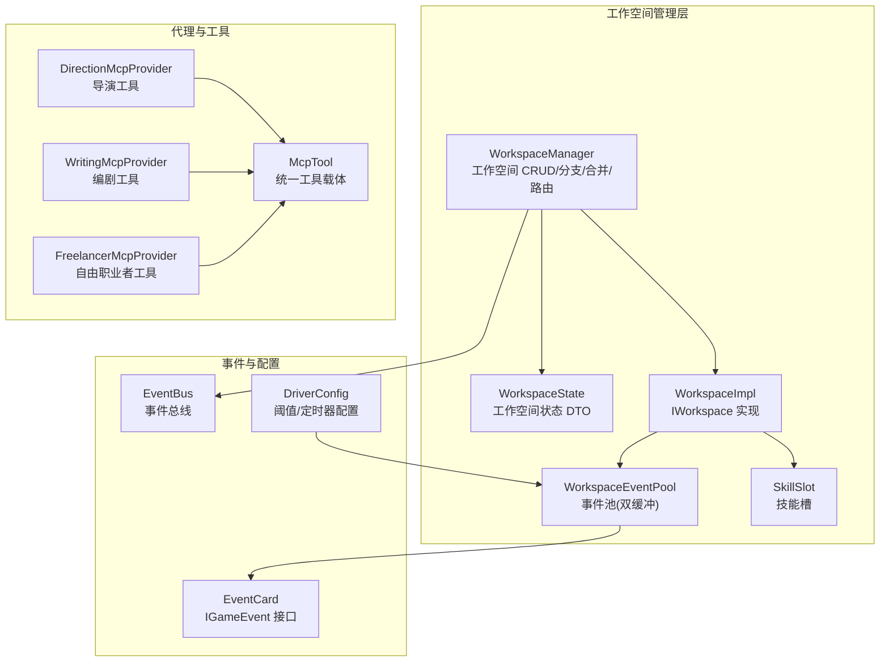
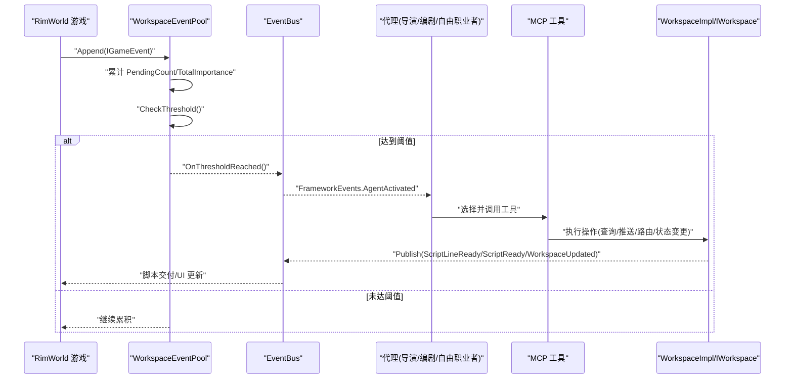
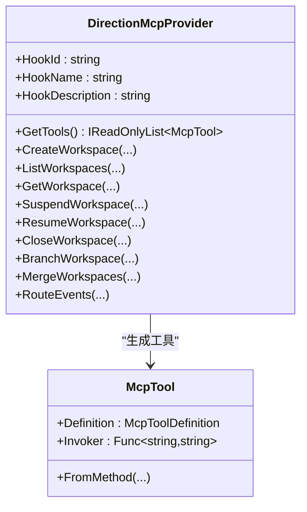
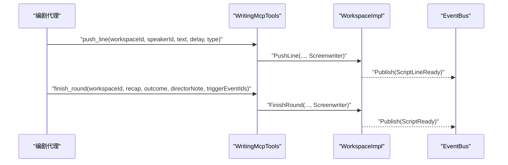
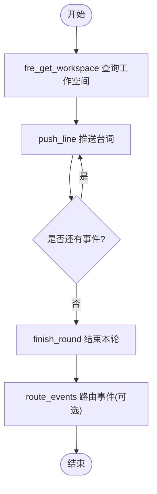
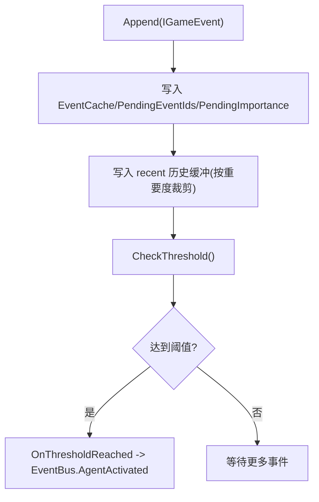
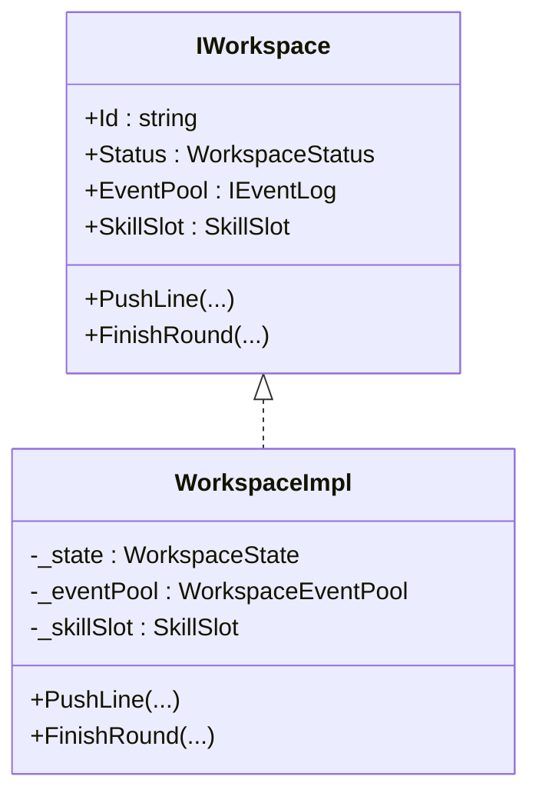
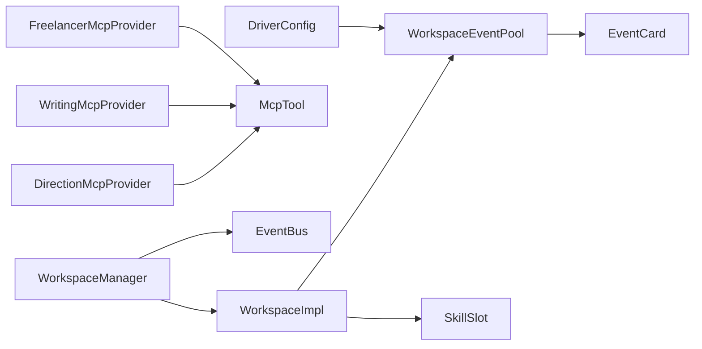

# 智能叙事系统

<cite>
**本文引用的文件**
- [WorkspaceImpl.cs](file://ext\NPCLife\src\NPCLife\Workspace\WorkspaceImpl.cs)
- [WorkspaceManager.cs](file://ext\NPCLife\src\NPCLife\Workspace\WorkspaceManager.cs)
- [DirectionMcpTools.cs](file://ext\NPCLife\src\NPCLife\Workspace\DirectionMcpTools.cs)
- [WritingMcpTools.cs](file://ext\NPCLife\src\NPCLife\Workspace\WritingMcpTools.cs)
- [FreelancerMcpTools.cs](file://ext\NPCLife\src\NPCLife\Workspace\FreelancerMcpTools.cs)
- [WorkspaceState.cs](file://ext\NPCLife\src\NPCLife\Workspace\WorkspaceState.cs)
- [WorkspaceEventPool.cs](file://ext\NPCLife\src\NPCLife\Workspace\WorkspaceEventPool.cs)
- [SkillSlot.cs](file://ext\NPCLife\src\NPCLife\Workspace\SkillSlot.cs)
- [IWorkspace.cs](file://ext\NPCLife\src\NPCLife\Workspace\IWorkspace.cs)
- [DriverConfig.cs](file://ext\NPCLife\src\NPCLife\Driver\DriverConfig.cs)
- [EventBus.cs](file://ext\NPCLife\src\NPCLife\Framework\EventBus.cs)
- [EventCard.cs](file://ext\NPCLife\src\NPCLife\Cards\EventCard.cs)
- [RoleSkillProfile.cs](file://ext\NPCLife\src\NPCLife\Workspace\RoleSkillProfile.cs)
- [McpTool.cs](file://ext\NPCLife\src\NPCLife\Framework\Mcp\McpTool.cs)
</cite>

## 目录
1. [简介](#简介)
2. [项目结构](#项目结构)
3. [核心组件](#核心组件)
4. [架构总览](#架构总览)
5. [详细组件分析](#详细组件分析)
6. [依赖关系分析](#依赖关系分析)
7. [性能考量](#性能考量)
8. [故障排查指南](#故障排查指南)
9. [结论](#结论)
10. [附录](#附录)

## 简介
本文件面向“智能叙事系统”的多代理协作机制，围绕导演代理、编剧代理与自由职业者代理的职责边界、工作机制与 MCP 工具实现进行系统化阐述。文档覆盖事件审查与路由决策、叙事内容创作流程、日常对话处理、代理间通信协议、事件传递机制与冲突解决策略，并给出参数配置、触发阈值与定时器脉冲配置说明，以及与 RimWorld 事件系统的集成方式。内容兼顾初学者易懂与资深开发者所需的技术深度。

## 项目结构
系统采用“工作空间”为中心的多代理协作架构，围绕 IWorkspace 接口与 WorkspaceManager 管理器组织，配合事件池、技能槽、事件总线与 MCP 工具提供者实现跨角色协同与自动化驱动。

图表来源
- [WorkspaceManager.cs:19-622](file://ext\NPCLife\src\NPCLife\Workspace\WorkspaceManager.cs#L19-L622)
- [WorkspaceImpl.cs:16-199](file://ext\NPCLife\src\NPCLife\Workspace\WorkspaceImpl.cs#L16-L199)
- [WorkspaceEventPool.cs:21-186](file://ext\NPCLife\src\NPCLife\Workspace\WorkspaceEventPool.cs#L21-L186)
- [DirectionMcpTools.cs:16-460](file://ext\NPCLife\src\NPCLife\Workspace\DirectionMcpTools.cs#L16-L460)
- [WritingMcpTools.cs:16-313](file://ext\NPCLife\src\NPCLife\Workspace\WritingMcpTools.cs#L16-L313)
- [FreelancerMcpTools.cs:21-274](file://ext\NPCLife\src\NPCLife\Workspace\FreelancerMcpTools.cs#L21-L274)
- [EventBus.cs:17-243](file://ext\NPCLife\src\NPCLife\Framework\EventBus.cs#L17-L243)
- [DriverConfig.cs:9-107](file://ext\NPCLife\src\NPCLife\Driver\DriverConfig.cs#L9-L107)
- [EventCard.cs:11-126](file://ext\NPCLife\src\NPCLife\Cards\EventCard.cs#L11-L126)

章节来源
- [WorkspaceManager.cs:19-622](file://ext\NPCLife\src\NPCLife\Workspace\WorkspaceManager.cs#L19-L622)
- [WorkspaceImpl.cs:16-199](file://ext\NPCLife\src\NPCLife\Workspace\WorkspaceImpl.cs#L16-L199)
- [WorkspaceEventPool.cs:21-186](file://ext\NPCLife\src\NPCLife\Workspace\WorkspaceEventPool.cs#L21-L186)
- [DirectionMcpTools.cs:16-460](file://ext\NPCLife\src\NPCLife\Workspace\DirectionMcpTools.cs#L16-L460)
- [WritingMcpTools.cs:16-313](file://ext\NPCLife\src\NPCLife\Workspace\WritingMcpTools.cs#L16-L313)
- [FreelancerMcpTools.cs:21-274](file://ext\NPCLife\src\NPCLife\Workspace\FreelancerMcpTools.cs#L21-L274)
- [EventBus.cs:17-243](file://ext\NPCLife\src\NPCLife\Framework\EventBus.cs#L17-L243)
- [DriverConfig.cs:9-107](file://ext\NPCLife\src\NPCLife\Driver\DriverConfig.cs#L9-L107)
- [EventCard.cs:11-126](file://ext\NPCLife\src\NPCLife\Cards\EventCard.cs#L11-L126)

## 核心组件
- 工作空间管理层
  - WorkspaceManager：负责工作空间的创建、查询、状态变更、分支/合并、事件路由与持久化；通过 WorkspaceImpl 暴露 IWorkspace 接口。
  - WorkspaceState：工作空间状态 DTO，包含元数据、轮次列表、事件缓存、待处理事件队列与累积重要度等。
  - WorkspaceImpl：IWorkspace 实现，封装事件池、技能槽、叙事操作（PushLine/FinishRound）与状态变更。
  - WorkspaceEventPool：事件池，采用“pending 缓冲区 + recent 历史缓冲”的双层结构，支持阈值检测与被动激活。
  - SkillSlot：技能槽，封装激活/停用技能与工具集合的交互。
- 代理与工具
  - DirectionMcpProvider：导演工具集，提供工作空间生命周期管理、分支/合并、事件路由等。
  - WritingMcpProvider：编剧工具集，提供工作空间视图、逐句台词推送、结束轮次与事件路由。
  - FreelancerMcpProvider：自由职业者工具集，提供轻量视图、逐句台词推送、结束轮次与事件路由。
  - McpTool：统一的 MCP 工具载体，承载工具定义与调用委托。
- 事件与配置
  - EventCard：IGameEvent 接口及可序列化实现，承载事件元数据与查询关键词。
  - EventBus：事件总线，提供发布/订阅、优先级排序与错误隔离。
  - DriverConfig：驱动配置，控制事件池阈值、定时器脉冲与历史缓冲容量等。

章节来源
- [WorkspaceManager.cs:19-622](file://ext\NPCLife\src\NPCLife\Workspace\WorkspaceManager.cs#L19-L622)
- [WorkspaceState.cs:94-161](file://ext\NPCLife\src\NPCLife\Workspace\WorkspaceState.cs#L94-L161)
- [WorkspaceImpl.cs:16-199](file://ext\NPCLife\src\NPCLife\Workspace\WorkspaceImpl.cs#L16-L199)
- [WorkspaceEventPool.cs:21-186](file://ext\NPCLife\src\NPCLife\Workspace\WorkspaceEventPool.cs#L21-L186)
- [SkillSlot.cs:11-61](file://ext\NPCLife\src\NPCLife\Workspace\SkillSlot.cs#L11-L61)
- [DirectionMcpTools.cs:16-460](file://ext\NPCLife\src\NPCLife\Workspace\DirectionMcpTools.cs#L16-L460)
- [WritingMcpTools.cs:16-313](file://ext\NPCLife\src\NPCLife\Workspace\WritingMcpTools.cs#L16-L313)
- [FreelancerMcpTools.cs:21-274](file://ext\NPCLife\src\NPCLife\Workspace\FreelancerMcpTools.cs#L21-L274)
- [McpTool.cs:14-40](file://ext\NPCLife\src\NPCLife\Framework\Mcp\McpTool.cs#L14-L40)
- [EventCard.cs:11-126](file://ext\NPCLife\src\NPCLife\Cards\EventCard.cs#L11-L126)
- [EventBus.cs:17-243](file://ext\NPCLife\src\NPCLife\Framework\EventBus.cs#L17-L243)
- [DriverConfig.cs:9-107](file://ext\NPCLife\src\NPCLife\Driver\DriverConfig.cs#L9-L107)

## 架构总览
系统以“工作空间”为核心单元，不同角色代理通过 MCP 工具对工作空间进行只读查询、状态变更与事件路由。事件池负责聚合 RimWorld 事件，达到阈值后通过事件总线触发代理激活，形成“事件驱动 + 工具调用”的闭环。

图表来源
- [WorkspaceEventPool.cs:49-90](file://ext\NPCLife\src\NPCLife\Workspace\WorkspaceEventPool.cs#L49-L90)
- [EventBus.cs:86-113](file://ext\NPCLife\src\NPCLife\Framework\EventBus.cs#L86-L113)
- [WorkspaceImpl.cs:85-125](file://ext\NPCLife\src\NPCLife\Workspace\WorkspaceImpl.cs#L85-L125)
- [WritingMcpTools.cs:77-109](file://ext\NPCLife\src\NPCLife\Workspace\WritingMcpTools.cs#L77-L109)
- [DirectionMcpTools.cs:291-361](file://ext\NPCLife\src\NPCLife\Workspace\DirectionMcpTools.cs#L291-L361)

## 详细组件分析

### 导演代理（DirectionMcpProvider）
- 职责
  - 创建/查询/更新工作空间状态（挂起/恢复/关闭）
  - 分支与合并工作空间，维护结构完整性
  - 路由事件至其他工作空间，支持关键词增强
- 关键工具
  - create_workspace、list_workspaces、get_workspace
  - suspend/resume/close_workspace
  - branch_workspace、merge_workspaces
  - route_events
- 机制要点
  - 严格的角色校验：仅 Director 可调用分支/合并/生命周期管理
  - 路由事件时可深拷贝事件并附加关键词，便于知识库检索
  - 返回导演视图（不含叙事内容），用于全局概览

图表来源
- [DirectionMcpTools.cs:16-460](file://ext\NPCLife\src\NPCLife\Workspace\DirectionMcpTools.cs#L16-L460)
- [McpTool.cs:14-40](file://ext\NPCLife\src\NPCLife\Framework\Mcp\McpTool.cs#L14-L40)

章节来源
- [DirectionMcpTools.cs:16-460](file://ext\NPCLife\src\NPCLife\Workspace\DirectionMcpTools.cs#L16-L460)

### 编剧代理（WritingMcpProvider）
- 职责
  - 查看工作空间完整内容（含轮次与叙事）
  - 推送逐句台词（dialogue/narration/action/pause）
  - 结束轮次，归档 recap/outcome 并向导演留言
  - 路由事件至其他工作空间
- 关键工具
  - get_workspace
  - push_line、finish_round
  - route_events
- 机制要点
  - PushLine 立即发布 ScriptLineReady，交由脚本投递服务逐行显示
  - FinishRound 归档当前轮次并发布 ScriptReady
  - 仅 Screenwriter/自由职业者可调用推送与结束轮次

图表来源
- [WritingMcpTools.cs:77-152](file://ext\NPCLife\src\NPCLife\Workspace\WritingMcpTools.cs#L77-L152)
- [WorkspaceImpl.cs:85-125](file://ext\NPCLife\src\NPCLife\Workspace\WorkspaceImpl.cs#L85-L125)
- [EventBus.cs:232-237](file://ext\NPCLife\src\NPCLife\Framework\EventBus.cs#L232-L237)

章节来源
- [WritingMcpTools.cs:16-313](file://ext\NPCLife\src\NPCLife\Workspace\WritingMcpTools.cs#L16-L313)
- [WorkspaceImpl.cs:85-125](file://ext\NPCLife\src\NPCLife\Workspace\WorkspaceImpl.cs#L85-L125)

### 自由职业者代理（FreelancerMcpProvider）
- 职责
  - 处理日常对话与突发独立事件
  - 轻量视图查询与事件路由
  - 逐句台词推送与结束轮次
- 关键工具
  - fre_get_workspace（轻量视图）
  - push_line、finish_round
  - route_events
- 机制要点
  - 无剧情上下文，不维护轮次历史
  - 与编剧同构的推送/结束流程，但无 outcome/directorNote

图表来源
- [FreelancerMcpTools.cs:55-154](file://ext\NPCLife\src\NPCLife\Workspace\FreelancerMcpTools.cs#L55-L154)

章节来源
- [FreelancerMcpTools.cs:21-274](file://ext\NPCLife\src\NPCLife\Workspace\FreelancerMcpTools.cs#L21-L274)

### 事件池与阈值机制
- 双层结构
  - pending 缓冲区：持久化到 WorkspaceState（EventCache/PendingEventIds/PendingImportance）
  - recent 历史缓冲：仅内存，按重要度裁剪，保留近期事件供查询
- 阈值检测
  - 按角色配置的事件数与重要度阈值，达到后触发 OnThresholdReached
  - 通过事件总线发布 FrameworkEvents.AgentActivated，被动激活代理
- DrainPending
  - 清空 pending 并重置累积重要度，供代理消费

图表来源
- [WorkspaceEventPool.cs:49-90](file://ext\NPCLife\src\NPCLife\Workspace\WorkspaceEventPool.cs#L49-L90)
- [EventBus.cs:203-208](file://ext\NPCLife\src\NPCLife\Framework\EventBus.cs#L203-L208)

章节来源
- [WorkspaceEventPool.cs:21-186](file://ext\NPCLife\src\NPCLife\Workspace\WorkspaceEventPool.cs#L21-L186)
- [DriverConfig.cs:54-101](file://ext\NPCLife\src\NPCLife\Driver\DriverConfig.cs#L54-L101)

### 代理间通信协议与冲突解决
- 通信协议
  - 通过 McpTool 统一承载工具定义与调用委托
  - 通过 EventBus 发布/订阅事件，确保解耦与错误隔离
- 冲突解决
  - 角色权限约束：Director 专属分支/合并/生命周期管理；Screenwriter/Freelancer 专属推送/结束轮次
  - 状态机约束：仅 Active 状态可进行推送与路由；Suspended 仅允许查询与恢复
  - 事件路由：支持关键词增强与深拷贝，避免污染源事件

图表来源
- [IWorkspace.cs:11-57](file://ext\NPCLife\src\NPCLife\Workspace\IWorkspace.cs#L11-L57)
- [WorkspaceImpl.cs:16-199](file://ext\NPCLife\src\NPCLife\Workspace\WorkspaceImpl.cs#L16-L199)

章节来源
- [IWorkspace.cs:11-57](file://ext\NPCLife\src\NPCLife\Workspace\IWorkspace.cs#L11-L57)
- [WorkspaceImpl.cs:16-199](file://ext\NPCLife\src\NPCLife\Workspace\WorkspaceImpl.cs#L16-L199)

### 与 RimWorld 事件系统的集成
- 事件注入
  - 通过 WorkspaceEventPool.Append 将 IGameEvent 注入工作空间事件池
  - 事件包含标签、关键词、重要度、实体引用与地图提示等元数据
- 事件查询
  - 支持按标签集合、时间范围、实体、最小重要度等条件查询
  - 最终事件由 DrainingPending 提供给代理消费
- 定时器脉冲
  - DriverConfig 支持按角色配置定时器脉冲间隔（ticks），周期性注入 TimerPulse 事件

章节来源
- [WorkspaceEventPool.cs:49-124](file://ext\NPCLife\src\NPCLife\Workspace\WorkspaceEventPool.cs#L49-L124)
- [EventCard.cs:11-126](file://ext\NPCLife\src\NPCLife\Cards\EventCard.cs#L11-L126)
- [DriverConfig.cs:35-101](file://ext\NPCLife\src\NPCLife\Driver\DriverConfig.cs#L35-L101)

## 依赖关系分析
- 组件耦合
  - WorkspaceManager 与 WorkspaceImpl 低耦合：前者管理生命周期与持久化，后者封装业务操作
  - 事件池与配置解耦：通过 DriverConfig 动态计算阈值，避免硬编码
  - MCP 工具与提供者解耦：通过 McpTool 与反射生成工具定义
- 外部依赖
  - 事件总线提供跨模块解耦与可观测性
  - ICardSerializer 用于事件序列化，支持事件缓存与持久化

图表来源
- [WorkspaceManager.cs:19-622](file://ext\NPCLife\src\NPCLife\Workspace\WorkspaceManager.cs#L19-L622)
- [WorkspaceImpl.cs:16-199](file://ext\NPCLife\src\NPCLife\Workspace\WorkspaceImpl.cs#L16-L199)
- [WorkspaceEventPool.cs:21-186](file://ext\NPCLife\src\NPCLife\Workspace\WorkspaceEventPool.cs#L21-L186)
- [DirectionMcpTools.cs:16-460](file://ext\NPCLife\src\NPCLife\Workspace\DirectionMcpTools.cs#L16-L460)
- [WritingMcpTools.cs:16-313](file://ext\NPCLife\src\NPCLife\Workspace\WritingMcpTools.cs#L16-L313)
- [FreelancerMcpTools.cs:21-274](file://ext\NPCLife\src\NPCLife\Workspace\FreelancerMcpTools.cs#L21-L274)
- [EventBus.cs:17-243](file://ext\NPCLife\src\NPCLife\Framework\EventBus.cs#L17-L243)
- [DriverConfig.cs:9-107](file://ext\NPCLife\src\NPCLife\Driver\DriverConfig.cs#L9-L107)
- [EventCard.cs:11-126](file://ext\NPCLife\src\NPCLife\Cards\EventCard.cs#L11-L126)

章节来源
- [WorkspaceManager.cs:19-622](file://ext\NPCLife\src\NPCLife\Workspace\WorkspaceManager.cs#L19-L622)
- [WorkspaceImpl.cs:16-199](file://ext\NPCLife\src\NPCLife\Workspace\WorkspaceImpl.cs#L16-L199)
- [WorkspaceEventPool.cs:21-186](file://ext\NPCLife\src\NPCLife\Workspace\WorkspaceEventPool.cs#L21-L186)
- [DirectionMcpTools.cs:16-460](file://ext\NPCLife\src\NPCLife\Workspace\DirectionMcpTools.cs#L16-L460)
- [WritingMcpTools.cs:16-313](file://ext\NPCLife\src\NPCLife\Workspace\WritingMcpTools.cs#L16-L313)
- [FreelancerMcpTools.cs:21-274](file://ext\NPCLife\src\NPCLife\Workspace\FreelancerMcpTools.cs#L21-L274)
- [EventBus.cs:17-243](file://ext\NPCLife\src\NPCLife\Framework\EventBus.cs#L17-L243)
- [DriverConfig.cs:9-107](file://ext\NPCLife\src\NPCLife\Driver\DriverConfig.cs#L9-L107)
- [EventCard.cs:11-126](file://ext\NPCLife\src\NPCLife\Cards\EventCard.cs#L11-L126)

## 性能考量
- 事件池阈值
  - 合理设置分角色阈值，避免过早或过晚触发导致的抖动与延迟
  - 重要度阈值结合事件重要度分布，平衡吞吐与质量
- 历史缓冲
  - RecentHistoryCapacity 控制内存占用与查询效率，建议根据场景调整
- 工具调用轮数
  - MaxAgentRounds 防止代理陷入多轮工具调用死循环
- 序列化与持久化
  - 事件缓存与 JSON 序列化需关注大事件负载下的内存与 CPU 开销

## 故障排查指南
- 工作空间状态异常
  - 检查状态转换合法性（Active/Suspended/Completed/Abandoned）
  - 确认 WorkspaceManager.UpdateStatus 的调用路径与返回值
- 事件路由失败
  - 核对源/目标工作空间是否存在且处于 Active 状态
  - 检查事件 ID 是否存在于源工作空间事件池
- 工具调用失败
  - 查看 McpToolInvoker 的调用日志与异常信息
  - 确认角色权限与调用身份（callerRole）
- 事件阈值不触发
  - 检查 DriverConfig 中对应角色的阈值配置
  - 确认事件重要度累加与 pending 队列状态

章节来源
- [WorkspaceManager.cs:165-187](file://ext\NPCLife\src\NPCLife\Workspace\WorkspaceManager.cs#L165-L187)
- [WorkspaceImpl.cs:85-125](file://ext\NPCLife\src\NPCLife\Workspace\WorkspaceImpl.cs#L85-L125)
- [WritingMcpTools.cs:77-152](file://ext\NPCLife\src\NPCLife\Workspace\WritingMcpTools.cs#L77-L152)
- [DirectionMcpTools.cs:291-361](file://ext\NPCLife\src\NPCLife\Workspace\DirectionMcpTools.cs#L291-L361)
- [EventBus.cs:104-112](file://ext\NPCLife\src\NPCLife\Framework\EventBus.cs#L104-L112)

## 结论
本系统通过“工作空间 + 事件池 + MCP 工具 + 事件总线”的组合，实现了导演、编剧与自由职业者三类代理的清晰分工与高效协作。导演负责全局结构与生命周期，编剧专注叙事创作，自由职业者处理日常与突发事件。通过可配置的阈值与定时器脉冲，系统能够灵活适配不同节奏的叙事需求，并与 RimWorld 事件系统无缝集成，为复杂模组叙事提供了稳健的基础设施。

## 附录
- 角色默认技能集
  - 导演：全局视图 + 结构管理
  - 编剧：完整叙事创作工具集
  - 自由职业者：轻量查询 + 快速输出
- 使用模式建议
  - 在创建工作空间时依据角色预激活相应技能
  - 通过 route_events 在代理间传递事件，必要时附加关键词增强
  - 合理设置阈值与定时器，平衡实时性与资源消耗

章节来源
- [RoleSkillProfile.cs:13-74](file://ext\NPCLife\src\NPCLife\Workspace\RoleSkillProfile.cs#L13-L74)
- [DriverConfig.cs:54-101](file://ext\NPCLife\src\NPCLife\Driver\DriverConfig.cs#L54-L101)