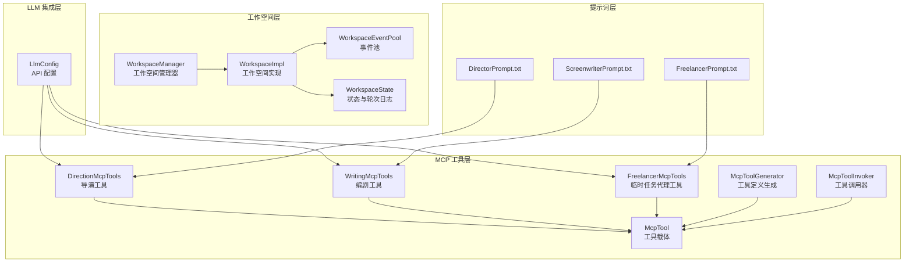
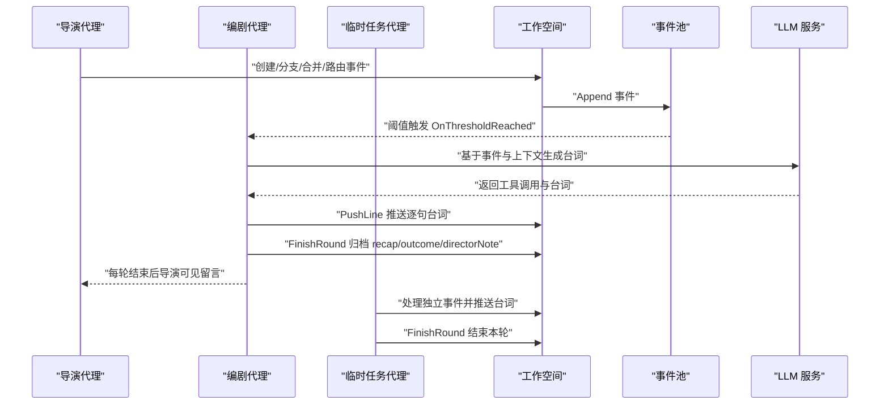
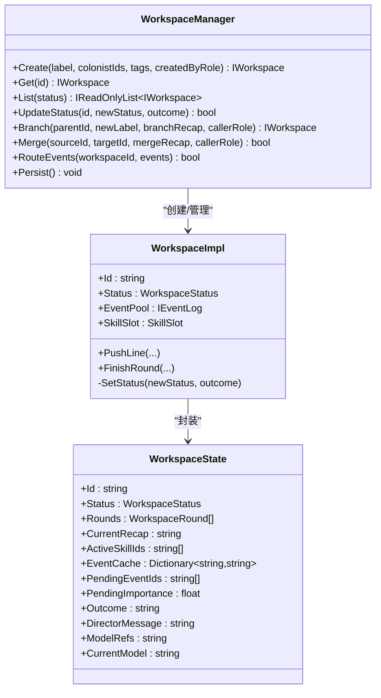
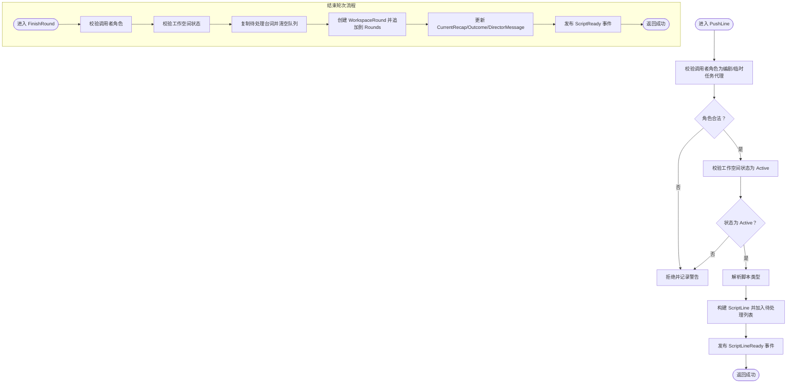
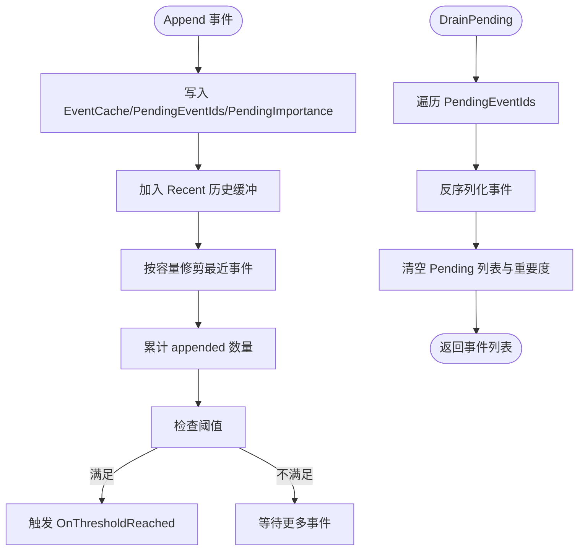
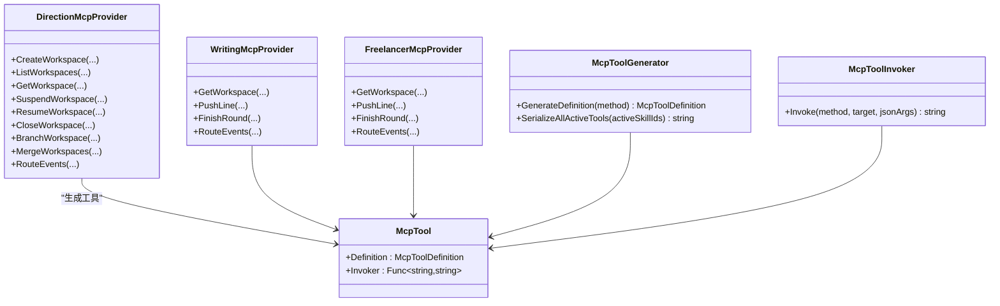
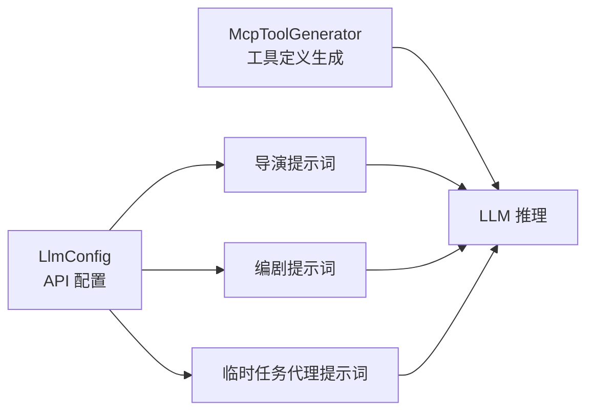
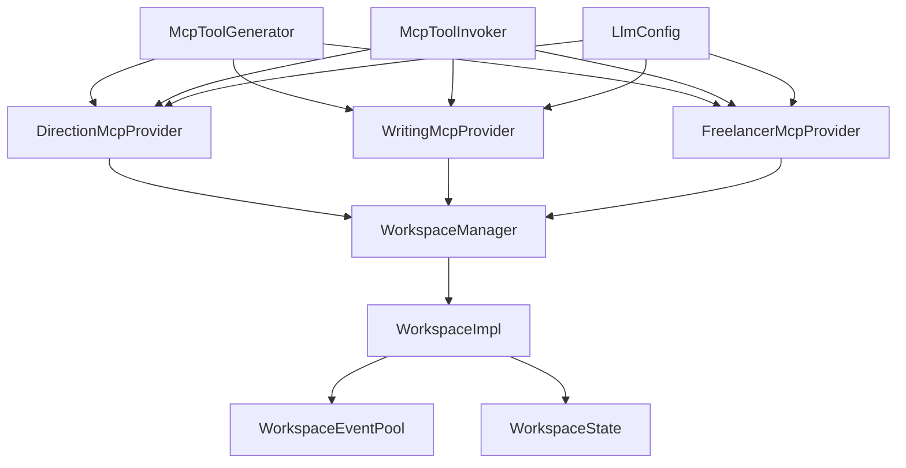

# 编剧代理系统

<cite>
**本文档引用的文件**
- [WorkspaceImpl.cs](file://ext\NPCLife\src\NPCLife\Workspace\WorkspaceImpl.cs)
- [WorkspaceManager.cs](file://ext\NPCLife\src\NPCLife\Workspace\WorkspaceManager.cs)
- [WritingMcpTools.cs](file://ext\NPCLife\src\NPCLife\Workspace\WritingMcpTools.cs)
- [FreelancerMcpTools.cs](file://ext\NPCLife\src\NPCLife\Workspace\FreelancerMcpTools.cs)
- [DirectionMcpTools.cs](file://ext\NPCLife\src\NPCLife\Workspace\DirectionMcpTools.cs)
- [WorkspaceState.cs](file://ext\NPCLife\src\NPCLife\Workspace\WorkspaceState.cs)
- [WorkspaceEventPool.cs](file://ext\NPCLife\src\NPCLife\Workspace\WorkspaceEventPool.cs)
- [IWorkspace.cs](file://ext\NPCLife\src\NPCLife\Workspace\IWorkspace.cs)
- [McpTool.cs](file://ext\NPCLife\src\NPCLife\Framework\Mcp\McpTool.cs)
- [McpToolGenerator.cs](file://ext\NPCLife\src\NPCLife\Framework\Mcp\McpToolGenerator.cs)
- [McpToolInvoker.cs](file://ext\NPCLife\src\NPCLife\Framework\Mcp\McpToolInvoker.cs)
- [LlmConfig.cs](file://ext\NPCLife\src\NPCLife\Framework\Llm\LlmConfig.cs)
- [ScreenwriterPrompt.txt](file://Prompts\ScreenwriterPrompt.txt)
- [DirectorPrompt.txt](file://ext\NPCLife\src\NPCLife\Prompts\DirectorPrompt.txt)
- [FreelancerPrompt.txt](file://ext\NPCLife\src\NPCLife\Prompts\FreelancerPrompt.txt)
</cite>

## 目录
1. [简介](#简介)
2. [项目结构](#项目结构)
3. [核心组件](#核心组件)
4. [架构总览](#架构总览)
5. [详细组件分析](#详细组件分析)
6. [依赖关系分析](#依赖关系分析)
7. [性能考虑](#性能考虑)
8. [故障排除指南](#故障排除指南)
9. [结论](#结论)
10. [附录](#附录)

## 简介
本系统围绕“编剧代理”构建，旨在通过 MCP 工具链与 LLM 服务协作，在 RimWorld 游戏世界中生成高质量、连贯且富有创意的叙事内容。编剧代理负责：
- 审查工作空间内的事件
- 通过工具查询角色、环境与记忆上下文
- 逐句生成台词（dialogue/narration/action/pause）
- 在每轮结束后归档前情提要、剧情结果与导演留言
- 与导演代理协作进行工作空间的创建、分支、合并与生命周期管理
- 与临时任务代理协作处理突发性、独立性事件

系统通过统一的事件池与轮次日志，确保叙事的可追溯性与可控性，并通过提示词工程与采样参数配置保障输出质量。

## 项目结构
系统采用分层与模块化设计：
- 工作空间层：管理事件池、轮次日志、状态与元数据
- MCP 工具层：为不同角色（导演、编剧、临时任务代理）提供标准化工具接口
- LLM 集成层：抽象不同提供商的 API 配置与调用
- 提示词层：为各角色提供明确的职责边界与工作原则

**图表来源**
- [WorkspaceManager.cs:1-622](file://ext\NPCLife\src\NPCLife\Workspace\WorkspaceManager.cs#L1-L622)
- [WorkspaceImpl.cs:1-199](file://ext\NPCLife\src\NPCLife\Workspace\WorkspaceImpl.cs#L1-L199)
- [WorkspaceEventPool.cs:1-186](file://ext\NPCLife\src\NPCLife\Workspace\WorkspaceEventPool.cs#L1-L186)
- [DirectionMcpTools.cs:1-460](file://ext\NPCLife\src\NPCLife\Workspace\DirectionMcpTools.cs#L1-L460)
- [WritingMcpTools.cs:1-313](file://ext\NPCLife\src\NPCLife\Workspace\WritingMcpTools.cs#L1-L313)
- [FreelancerMcpTools.cs:1-274](file://ext\NPCLife\src\NPCLife\Workspace\FreelancerMcpTools.cs#L1-L274)
- [McpTool.cs:1-40](file://ext\NPCLife\src\NPCLife\Framework\Mcp\McpTool.cs#L1-L40)
- [McpToolGenerator.cs:1-214](file://ext\NPCLife\src\NPCLife\Framework\Mcp\McpToolGenerator.cs#L1-L214)
- [McpToolInvoker.cs:1-238](file://ext\NPCLife\src\NPCLife\Framework\Mcp\McpToolInvoker.cs#L1-L238)
- [LlmConfig.cs:1-69](file://ext\NPCLife\src\NPCLife\Framework\Llm\LlmConfig.cs#L1-L69)
- [DirectorPrompt.txt:1-18](file://ext\NPCLife\src\NPCLife\Prompts\DirectorPrompt.txt#L1-L18)
- [ScreenwriterPrompt.txt:1-16](file://Prompts\ScreenwriterPrompt.txt#L1-L16)
- [FreelancerPrompt.txt:1-18](file://ext\NPCLife\src\NPCLife\Prompts\FreelancerPrompt.txt#L1-L18)

**章节来源**
- [WorkspaceManager.cs:1-622](file://ext\NPCLife\src\NPCLife\Workspace\WorkspaceManager.cs#L1-L622)
- [WorkspaceImpl.cs:1-199](file://ext\NPCLife\src\NPCLife\Workspace\WorkspaceImpl.cs#L1-L199)
- [WorkspaceEventPool.cs:1-186](file://ext\NPCLife\src\NPCLife\Workspace\WorkspaceEventPool.cs#L1-L186)
- [DirectionMcpTools.cs:1-460](file://ext\NPCLife\src\NPCLife\Workspace\DirectionMcpTools.cs#L1-L460)
- [WritingMcpTools.cs:1-313](file://ext\NPCLife\src\NPCLife\Workspace\WritingMcpTools.cs#L1-L313)
- [FreelancerMcpTools.cs:1-274](file://ext\NPCLife\src\NPCLife\Workspace\FreelancerMcpTools.cs#L1-L274)
- [McpTool.cs:1-40](file://ext\NPCLife\src\NPCLife\Framework\Mcp\McpTool.cs#L1-L40)
- [McpToolGenerator.cs:1-214](file://ext\NPCLife\src\NPCLife\Framework\Mcp\McpToolGenerator.cs#L1-L214)
- [McpToolInvoker.cs:1-238](file://ext\NPCLife\src\NPCLife\Framework\Mcp\McpToolInvoker.cs#L1-L238)
- [LlmConfig.cs:1-69](file://ext\NPCLife\src\NPCLife\Framework\Llm\LlmConfig.cs#L1-L69)
- [DirectorPrompt.txt:1-18](file://ext\NPCLife\src\NPCLife\Prompts\DirectorPrompt.txt#L1-L18)
- [ScreenwriterPrompt.txt:1-16](file://Prompts\ScreenwriterPrompt.txt#L1-L16)
- [FreelancerPrompt.txt:1-18](file://ext\NPCLife\src\NPCLife\Prompts\FreelancerPrompt.txt#L1-L18)

## 核心组件
- 工作空间管理器（WorkspaceManager）：负责工作空间的创建、分支、合并、状态更新与持久化；协调事件路由与生命周期事件发布。
- 工作空间实现（WorkspaceImpl）：封装 WorkspaceState，暴露事件池与技能槽；提供推词与结束轮次能力；发布事件与状态变更。
- 事件池（WorkspaceEventPool）：双层缓冲（持久化 pending 与内存 recent），阈值触发，支持查询与批量提取。
- MCP 工具提供者：
  - 导演工具（DirectionMcpTools）：创建工作空间、列出/获取、挂起/恢复/关闭、分支/合并、事件路由。
  - 编剧工具（WritingMcpTools）：获取工作空间、推送单句台词、结束轮次、事件路由。
  - 临时任务代理工具（FreelancerMcpTools）：轻量视图、推送单句台词、结束轮次、事件路由。
- LLM 配置（LlmConfig）：统一管理提供商类型、基础 URL、API Key、模型名与超时等。
- 提示词（Prompt）：明确各角色职责边界与工作原则，指导工具调用与输出规范。

**章节来源**
- [WorkspaceManager.cs:1-622](file://ext\NPCLife\src\NPCLife\Workspace\WorkspaceManager.cs#L1-L622)
- [WorkspaceImpl.cs:1-199](file://ext\NPCLife\src\NPCLife\Workspace\WorkspaceImpl.cs#L1-L199)
- [WorkspaceEventPool.cs:1-186](file://ext\NPCLife\src\NPCLife\Workspace\WorkspaceEventPool.cs#L1-L186)
- [DirectionMcpTools.cs:1-460](file://ext\NPCLife\src\NPCLife\Workspace\DirectionMcpTools.cs#L1-L460)
- [WritingMcpTools.cs:1-313](file://ext\NPCLife\src\NPCLife\Workspace\WritingMcpTools.cs#L1-L313)
- [FreelancerMcpTools.cs:1-274](file://ext\NPCLife\src\NPCLife\Workspace\FreelancerMcpTools.cs#L1-L274)
- [LlmConfig.cs:1-69](file://ext\NPCLife\src\NPCLife\Framework\Llm\LlmConfig.cs#L1-L69)
- [ScreenwriterPrompt.txt:1-16](file://Prompts\ScreenwriterPrompt.txt#L1-L16)
- [DirectorPrompt.txt:1-18](file://ext\NPCLife\src\NPCLife\Prompts\DirectorPrompt.txt#L1-L18)
- [FreelancerPrompt.txt:1-18](file://ext\NPCLife\src\NPCLife\Prompts\FreelancerPrompt.txt#L1-L18)

## 架构总览
系统通过“导演-编剧-临时任务代理”的角色分工与 MCP 工具链，形成闭环的叙事生成流程。导演负责事件筛选与工作空间治理，编剧负责具体叙事创作，临时任务代理处理突发事件。事件在工作空间内沉淀为轮次日志，支持回溯与质量审计。

**图表来源**
- [DirectionMcpTools.cs:1-460](file://ext\NPCLife\src\NPCLife\Workspace\DirectionMcpTools.cs#L1-L460)
- [WritingMcpTools.cs:1-313](file://ext\NPCLife\src\NPCLife\Workspace\WritingMcpTools.cs#L1-L313)
- [FreelancerMcpTools.cs:1-274](file://ext\NPCLife\src\NPCLife\Workspace\FreelancerMcpTools.cs#L1-L274)
- [WorkspaceEventPool.cs:1-186](file://ext\NPCLife\src\NPCLife\Workspace\WorkspaceEventPool.cs#L1-L186)
- [WorkspaceImpl.cs:1-199](file://ext\NPCLife\src\NPCLife\Workspace\WorkspaceImpl.cs#L1-L199)

## 详细组件分析

### 工作空间管理器（WorkspaceManager）
职责与机制：
- CRUD：创建工作空间并自动激活默认技能集；按状态过滤列出；获取与更新状态。
- 分支/合并：复制轮次历史并追加结构轮；合并时去重并记录来源。
- 事件路由：将事件从源工作空间推送到目标工作空间，支持附加关键词与留言。
- 持久化：序列化工作空间状态与轮次，保存至存储后端；加载时重建内存状态并触发就绪事件。

**图表来源**
- [WorkspaceManager.cs:1-622](file://ext\NPCLife\src\NPCLife\Workspace\WorkspaceManager.cs#L1-L622)
- [WorkspaceImpl.cs:1-199](file://ext\NPCLife\src\NPCLife\Workspace\WorkspaceImpl.cs#L1-L199)
- [WorkspaceState.cs:1-162](file://ext\NPCLife\src\NPCLife\Workspace\WorkspaceState.cs#L1-L162)

**章节来源**
- [WorkspaceManager.cs:1-622](file://ext\NPCLife\src\NPCLife\Workspace\WorkspaceManager.cs#L1-L622)
- [WorkspaceImpl.cs:1-199](file://ext\NPCLife\src\NPCLife\Workspace\WorkspaceImpl.cs#L1-L199)
- [WorkspaceState.cs:1-162](file://ext\NPCLife\src\NPCLife\Workspace\WorkspaceState.cs#L1-L162)

### 工作空间实现（WorkspaceImpl）
职责与机制：
- 元数据只读代理到 WorkspaceState，确保外部只能通过受控接口修改状态。
- 推送单句台词（PushLine）：校验调用者角色与工作空间状态，解析脚本类型，立即发布事件并投递给游戏侧显示。
- 结束轮次（FinishRound）：归档当前轮次的 recap、outcome、directorNote，清空待处理台词并发布轮次完成事件。

**图表来源**
- [WorkspaceImpl.cs:83-184](file://ext\NPCLife\src\NPCLife\Workspace\WorkspaceImpl.cs#L83-L184)

**章节来源**
- [WorkspaceImpl.cs:1-199](file://ext\NPCLife\src\NPCLife\Workspace\WorkspaceImpl.cs#L1-L199)

### 事件池（WorkspaceEventPool）
职责与机制：
- 双层缓冲：pending（持久化）与 recent（内存）两套结构，支持阈值触发与高效查询。
- 阈值检测：根据角色与配置计算有效计数与重要度阈值，达到阈值时触发 OnThresholdReached。
- 查询与提取：支持标签、时间戳、角色、最小重要度等条件过滤；DrainPending 清空并返回事件列表。

**图表来源**
- [WorkspaceEventPool.cs:49-183](file://ext\NPCLife\src\NPCLife\Workspace\WorkspaceEventPool.cs#L49-L183)

**章节来源**
- [WorkspaceEventPool.cs:1-186](file://ext\NPCLife\src\NPCLife\Workspace\WorkspaceEventPool.cs#L1-L186)

### MCP 工具链（导演/编剧/临时任务代理）
职责与机制：
- 导演工具：创建工作空间、列出/获取、挂起/恢复/关闭、分支/合并、事件路由。
- 编剧工具：获取工作空间（含轮次与叙事内容）、推送单句台词、结束轮次（含 outcome 与 directorNote）、事件路由。
- 临时任务代理工具：获取轻量工作空间信息、推送单句台词、结束轮次（无 outcome 与 directorNote）、事件路由。
- 工具定义与调用：通过特性标注生成工具定义，运行时将 JSON 参数反序列化并反射调用目标方法，返回 JSON 结果。

**图表来源**
- [DirectionMcpTools.cs:31-45](file://ext\NPCLife\src\NPCLife\Workspace\DirectionMcpTools.cs#L31-L45)
- [WritingMcpTools.cs:31-40](file://ext\NPCLife\src\NPCLife\Workspace\WritingMcpTools.cs#L31-L40)
- [FreelancerMcpTools.cs:36-44](file://ext\NPCLife\src\NPCLife\Workspace\FreelancerMcpTools.cs#L36-L44)
- [McpTool.cs:14-39](file://ext\NPCLife\src\NPCLife\Framework\Mcp\McpTool.cs#L14-L39)
- [McpToolGenerator.cs:19-78](file://ext\NPCLife\src\NPCLife\Framework\Mcp\McpToolGenerator.cs#L19-L78)
- [McpToolInvoker.cs:24-72](file://ext\NPCLife\src\NPCLife\Framework\Mcp\McpToolInvoker.cs#L24-L72)

**章节来源**
- [DirectionMcpTools.cs:1-460](file://ext\NPCLife\src\NPCLife\Workspace\DirectionMcpTools.cs#L1-L460)
- [WritingMcpTools.cs:1-313](file://ext\NPCLife\src\NPCLife\Workspace\WritingMcpTools.cs#L1-L313)
- [FreelancerMcpTools.cs:1-274](file://ext\NPCLife\src\NPCLife\Workspace\FreelancerMcpTools.cs#L1-L274)
- [McpTool.cs:1-40](file://ext\NPCLife\src\NPCLife\Framework\Mcp\McpTool.cs#L1-L40)
- [McpToolGenerator.cs:1-214](file://ext\NPCLife\src\NPCLife\Framework\Mcp\McpToolGenerator.cs#L1-L214)
- [McpToolInvoker.cs:1-238](file://ext\NPCLife\src\NPCLife\Framework\Mcp\McpToolInvoker.cs#L1-L238)

### LLM 集成与提示词工程
- LLM 配置：统一管理提供商类型、基础 URL、API Key、模型名与超时；验证配置有效性。
- 提示词工程：为导演、编剧、临时任务代理分别提供职责边界与工作原则，指导工具调用与输出规范，确保叙事一致性与质量。
- 工具定义注入：通过工具生成器将已激活技能的工具定义序列化为 LLM 的 tools 字段，增强推理能力。

**图表来源**
- [LlmConfig.cs:23-67](file://ext\NPCLife\src\NPCLife\Framework\Llm\LlmConfig.cs#L23-L67)
- [McpToolGenerator.cs:153-156](file://ext\NPCLife\src\NPCLife\Framework\Mcp\McpToolGenerator.cs#L153-L156)
- [DirectorPrompt.txt:1-18](file://ext\NPCLife\src\NPCLife\Prompts\DirectorPrompt.txt#L1-L18)
- [ScreenwriterPrompt.txt:1-16](file://Prompts\ScreenwriterPrompt.txt#L1-L16)
- [FreelancerPrompt.txt:1-18](file://ext\NPCLife\src\NPCLife\Prompts\FreelancerPrompt.txt#L1-L18)

**章节来源**
- [LlmConfig.cs:1-69](file://ext\NPCLife\src\NPCLife\Framework\Llm\LlmConfig.cs#L1-L69)
- [McpToolGenerator.cs:1-214](file://ext\NPCLife\src\NPCLife\Framework\Mcp\McpToolGenerator.cs#L1-L214)
- [DirectorPrompt.txt:1-18](file://ext\NPCLife\src\NPCLife\Prompts\DirectorPrompt.txt#L1-L18)
- [ScreenwriterPrompt.txt:1-16](file://Prompts\ScreenwriterPrompt.txt#L1-L16)
- [FreelancerPrompt.txt:1-18](file://ext\NPCLife\src\NPCLife\Prompts\FreelancerPrompt.txt#L1-L18)

## 依赖关系分析
- 组件耦合与内聚：
  - WorkspaceManager 与 WorkspaceImpl 低耦合：通过接口 IWorkspace 暴露能力，内部状态由 WorkspaceImpl 封装。
  - 事件池与工作空间状态解耦：事件池仅依赖 WorkspaceState 的持久化字段，不直接参与业务逻辑。
  - MCP 工具提供者与 WorkspaceManager 通过函数式依赖注入，零静态耦合，便于扩展与测试。
- 外部依赖与集成点：
  - LLM 适配器：通过 LlmConfig 抽象不同提供商（OpenAI/Anthropic），便于切换与扩展。
  - 存储后端：通过 IAuthorityStore 接口持久化工作空间状态，支持热重启与恢复。
- 循环依赖风险：
  - 工具定义与调用器之间为纯静态工具，无循环依赖；角色工具与工作空间管理器通过接口交互，避免循环引用。

**图表来源**
- [WorkspaceManager.cs:1-622](file://ext\NPCLife\src\NPCLife\Workspace\WorkspaceManager.cs#L1-L622)
- [WorkspaceImpl.cs:1-199](file://ext\NPCLife\src\NPCLife\Workspace\WorkspaceImpl.cs#L1-L199)
- [WorkspaceEventPool.cs:1-186](file://ext\NPCLife\src\NPCLife\Workspace\WorkspaceEventPool.cs#L1-L186)
- [DirectionMcpTools.cs:1-460](file://ext\NPCLife\src\NPCLife\Workspace\DirectionMcpTools.cs#L1-L460)
- [WritingMcpTools.cs:1-313](file://ext\NPCLife\src\NPCLife\Workspace\WritingMcpTools.cs#L1-L313)
- [FreelancerMcpTools.cs:1-274](file://ext\NPCLife\src\NPCLife\Workspace\FreelancerMcpTools.cs#L1-L274)
- [McpToolGenerator.cs:1-214](file://ext\NPCLife\src\NPCLife\Framework\Mcp\McpToolGenerator.cs#L1-L214)
- [McpToolInvoker.cs:1-238](file://ext\NPCLife\src\NPCLife\Framework\Mcp\McpToolInvoker.cs#L1-L238)
- [LlmConfig.cs:1-69](file://ext\NPCLife\src\NPCLife\Framework\Llm\LlmConfig.cs#L1-L69)

**章节来源**
- [WorkspaceManager.cs:1-622](file://ext\NPCLife\src\NPCLife\Workspace\WorkspaceManager.cs#L1-L622)
- [WorkspaceImpl.cs:1-199](file://ext\NPCLife\src\NPCLife\Workspace\WorkspaceImpl.cs#L1-L199)
- [WorkspaceEventPool.cs:1-186](file://ext\NPCLife\src\NPCLife\Workspace\WorkspaceEventPool.cs#L1-L186)
- [DirectionMcpTools.cs:1-460](file://ext\NPCLife\src\NPCLife\Workspace\DirectionMcpTools.cs#L1-L460)
- [WritingMcpTools.cs:1-313](file://ext\NPCLife\src\NPCLife\Workspace\WritingMcpTools.cs#L1-L313)
- [FreelancerMcpTools.cs:1-274](file://ext\NPCLife\src\NPCLife\Workspace\FreelancerMcpTools.cs#L1-L274)
- [McpToolGenerator.cs:1-214](file://ext\NPCLife\src\NPCLife\Framework\Mcp\McpToolGenerator.cs#L1-L214)
- [McpToolInvoker.cs:1-238](file://ext\NPCLife\src\NPCLife\Framework\Mcp\McpToolInvoker.cs#L1-L238)
- [LlmConfig.cs:1-69](file://ext\NPCLife\src\NPCLife\Framework\Llm\LlmConfig.cs#L1-L69)

## 性能考虑
- 事件池阈值触发：通过配置化的计数与重要度阈值，避免频繁小批量处理带来的开销；在达到阈值时一次性处理，提升吞吐。
- 事件池内存修剪：限制 recent 历史容量，按最小重要度淘汰，平衡查询效率与内存占用。
- 工具调用批量化：编剧可并行调用多个 push_line，减少往返次数；同时注意 LLM 的并发与限流策略。
- 序列化与反序列化：使用高效的 JSON 写入器与解析器，避免不必要的字符串拼接与装箱。
- 状态持久化：批量序列化工作空间列表，减少磁盘 IO；在异常情况下记录警告并继续运行。

[本节为通用性能讨论，不直接分析具体文件]

## 故障排除指南
常见问题与定位：
- 工具调用失败：检查工具定义生成与调用器参数转换逻辑，确认必填参数缺失时的默认值策略。
- 工作空间状态异常：核对状态转换合法性与事件发布逻辑，确保状态变更后正确触发相关事件。
- 事件路由失败：确认源工作空间存在、目标工作空间处于 Active 状态、事件 ID 有效；检查路由数量与警告信息。
- LLM 配置无效：验证 BaseUrl、ApiKey、ModelName 是否齐全，提供商类型是否正确；检查超时设置与网络可达性。

**章节来源**
- [McpToolInvoker.cs:57-72](file://ext\NPCLife\src\NPCLife\Framework\Mcp\McpToolInvoker.cs#L57-L72)
- [WorkspaceManager.cs:165-187](file://ext\NPCLife\src\NPCLife\Workspace\WorkspaceManager.cs#L165-L187)
- [WritingMcpTools.cs:100-109](file://ext\NPCLife\src\NPCLife\Workspace\WritingMcpTools.cs#L100-L109)
- [DirectionMcpTools.cs:308-311](file://ext\NPCLife\src\NPCLife\Workspace\DirectionMcpTools.cs#L308-L311)
- [LlmConfig.cs:46-51](file://ext\NPCLife\src\NPCLife\Framework\Llm\LlmConfig.cs#L46-L51)

## 结论
编剧代理系统通过清晰的角色分工与标准化的 MCP 工具链，实现了从事件采集到叙事生成再到质量控制的全链路自动化。工作空间层提供稳定的上下文与轮次日志，导演代理负责宏观治理，编剧代理专注于微观创作，临时任务代理处理突发事件。结合 LLM 提示词工程与配置化参数，系统在保证质量的同时具备良好的扩展性与可维护性。

[本节为总结性内容，不直接分析具体文件]

## 附录

### 编剧代理配置与使用模式
- 创建工作空间：导演通过工具创建新的剧情线工作空间，自动激活默认技能集。
- 事件路由：导演将事件路由到合适的编剧工作空间，未被路由的事件将被丢弃。
- 编剧创作：编剧审查事件、查询上下文、逐句推送台词、结束轮次并提交导演留言。
- 临时任务代理：处理独立事件，不维护剧情延续性，必要时将事件推回导演。
- LLM 集成：通过 LlmConfig 配置提供商与模型，利用工具定义增强推理能力。

**章节来源**
- [DirectionMcpTools.cs:53-78](file://ext\NPCLife\src\NPCLife\Workspace\DirectionMcpTools.cs#L53-L78)
- [WritingMcpTools.cs:48-68](file://ext\NPCLife\src\NPCLife\Workspace\WritingMcpTools.cs#L48-L68)
- [FreelancerMcpTools.cs:55-75](file://ext\NPCLife\src\NPCLife\Workspace\FreelancerMcpTools.cs#L55-L75)
- [LlmConfig.cs:23-67](file://ext\NPCLife\src\NPCLife\Framework\Llm\LlmConfig.cs#L23-L67)

### 创意控制与质量保证策略
- 角色职责边界：通过提示词明确各角色职责，避免越界操作导致叙事混乱。
- 工具调用约束：通过工具定义与参数 schema 限制输入范围，减少无效调用。
- 轮次日志审计：每轮结束归档 recap/outcome/directorNote，便于回溯与质量评估。
- 事件阈值控制：通过阈值触发批量处理，平衡实时性与性能。
- 错误处理与告警：在工具调用与状态变更处记录详细日志，便于定位问题。

**章节来源**
- [ScreenwriterPrompt.txt:1-16](file://Prompts\ScreenwriterPrompt.txt#L1-L16)
- [DirectorPrompt.txt:1-18](file://ext\NPCLife\src\NPCLife\Prompts\DirectorPrompt.txt#L1-L18)
- [FreelancerPrompt.txt:1-18](file://ext\NPCLife\src\NPCLife\Prompts\FreelancerPrompt.txt#L1-L18)
- [WorkspaceImpl.cs:85-125](file://ext\NPCLife\src\NPCLife\Workspace\WorkspaceImpl.cs#L85-L125)
- [WorkspaceEventPool.cs:81-90](file://ext\NPCLife\src\NPCLife\Workspace\WorkspaceEventPool.cs#L81-L90)