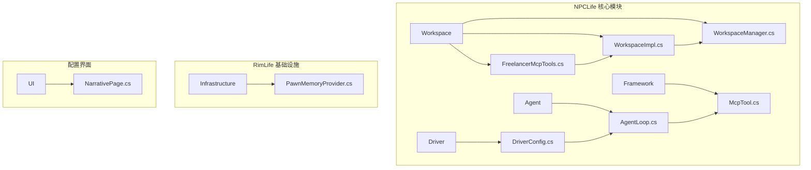
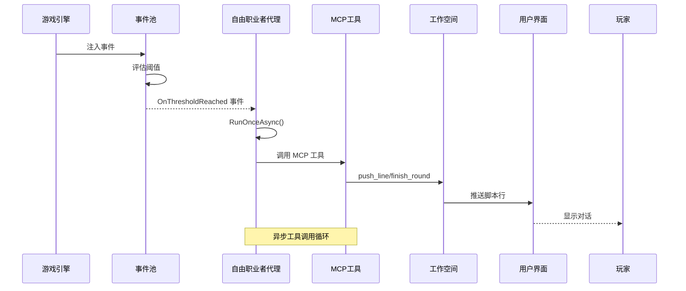
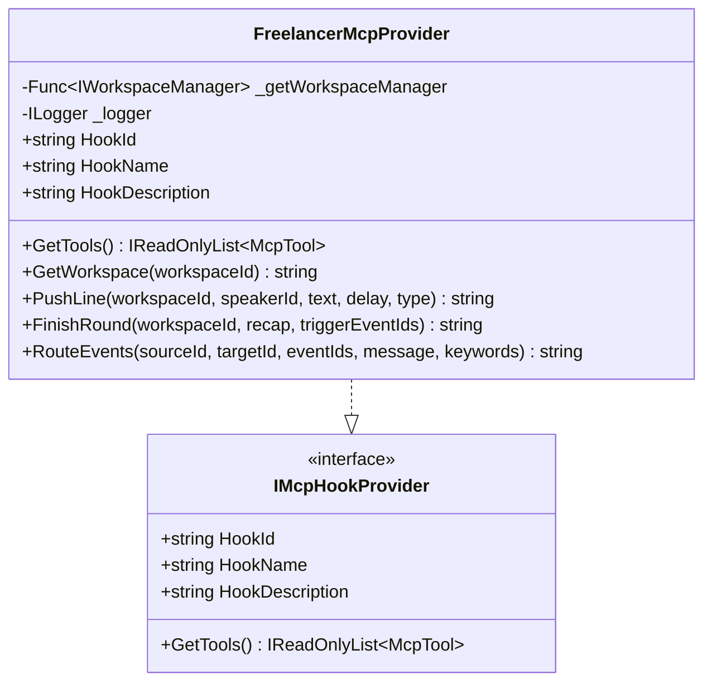
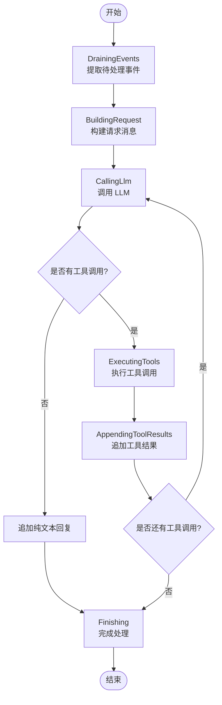
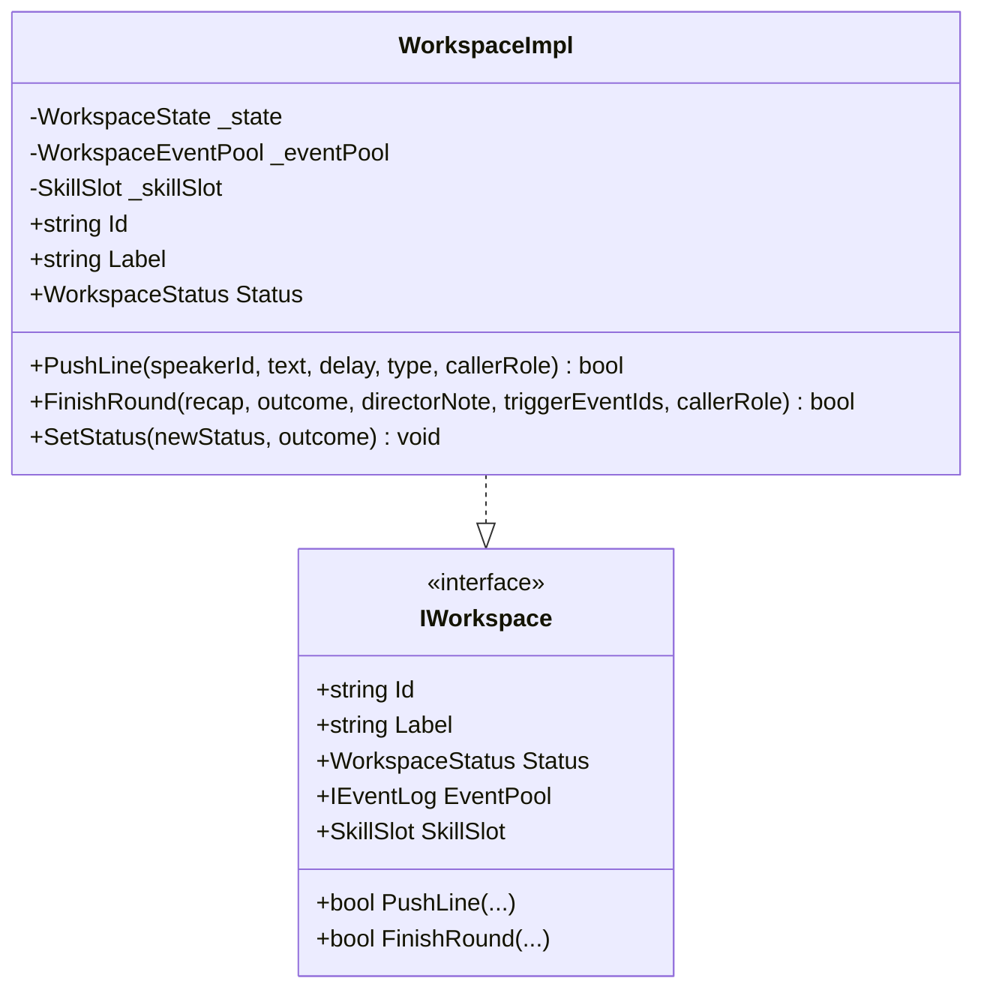
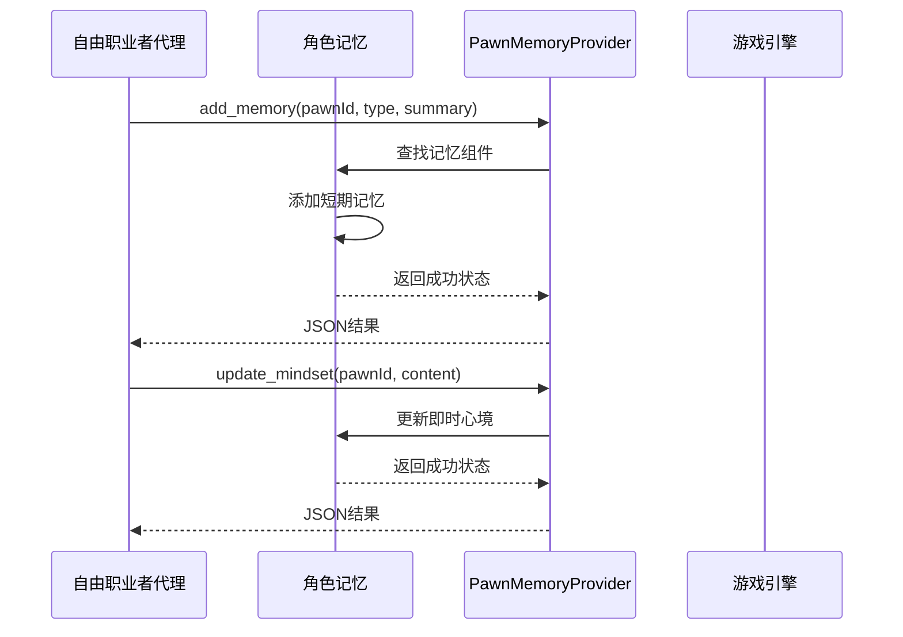
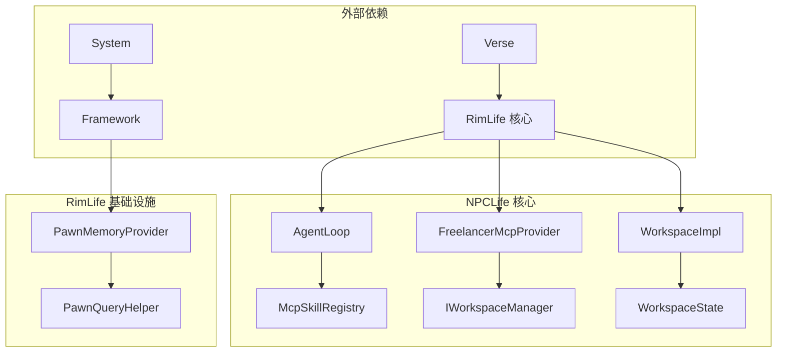

# 自由职业者代理系统

<cite>
**本文档引用的文件**
- [FreelancerMcpTools.cs](file://ext\NPCLife\src\NPCLife\Workspace\FreelancerMcpTools.cs)
- [FreelancerPrompt.txt](file://ext\NPCLife\Prompts\FreelancerPrompt.txt)
- [PawnMemoryProvider.cs](file://Source\Infrastructure\Mcp\PawnMemoryProvider.cs)
- [AgentLoop.cs](file://ext\NPCLife\src\NPCLife\Agent\AgentLoop.cs)
- [WorkspaceImpl.cs](file://ext\NPCLife\src\NPCLife\Workspace\WorkspaceImpl.cs)
- [WorkspaceManager.cs](file://ext\NPCLife\src\NPCLife\Workspace\WorkspaceManager.cs)
- [WorkspaceState.cs](file://ext\NPCLife\src\NPCLife\Workspace\WorkspaceState.cs)
- [IWorkspaceManager.cs](file://ext\NPCLife\src\NPCLife\Core\IWorkspaceManager.cs)
- [McpTool.cs](file://ext\NPCLife\src\NPCLife\Framework\Mcp\McpTool.cs)
- [DriverConfig.cs](file://ext\NPCLife\src\NPCLife\Driver\DriverConfig.cs)
- [WorkspaceEventPool.cs](file://ext\NPCLife\src\NPCLife\Workspace\WorkspaceEventPool.cs)
- [EventCard.cs](file://ext\NPCLife\src\NPCLife\Cards\EventCard.cs)
- [NarrativePage.cs](file://Source\UI\Pages\NarrativePage.cs)
- [FrameworkConfig.cs](file://ext\NPCLife\src\NPCLife\Framework\FrameworkConfig.cs)
- [WritingMcpTools.cs](file://ext\NPCLife\src\NPCLife\Workspace\WritingMcpTools.cs)
</cite>

## 目录
1. [简介](#简介)
2. [项目结构](#项目结构)
3. [核心组件](#核心组件)
4. [架构概览](#架构概览)
5. [详细组件分析](#详细组件分析)
6. [依赖关系分析](#依赖关系分析)
7. [性能考虑](#性能考虑)
8. [故障排除指南](#故障排除指南)
9. [结论](#结论)

## 简介

自由职业者代理系统是 RimLife 项目中的一个关键组件，专门负责处理日常对话和临时性事件响应。该系统通过 MCP（Model Context Protocol）工具提供者实现，能够独立于主线剧情进行即时性的角色互动和对话生成。

系统的核心职责包括：
- 处理突发性、独立性的事件（日常对话、随机遭遇、环境变化等）
- 不维护跨轮次的剧情上下文
- 调用角色查询、环境感知等工具获取当前状态
- 使用 push_line 工具逐句输出台词
- 在完成叙事后调用 finish_round 收尾

## 项目结构

自由职业者代理系统主要分布在以下目录结构中：

**图表来源**
- [FreelancerMcpTools.cs:1-274](file://ext\NPCLife\src\NPCLife\Workspace\FreelancerMcpTools.cs#L1-L274)
- [AgentLoop.cs:1-680](file://ext\NPCLife\src\NPCLife\Agent\AgentLoop.cs#L1-L680)
- [DriverConfig.cs:1-107](file://ext\NPCLife\src\NPCLife\Driver\DriverConfig.cs#L1-L107)

**章节来源**
- [FreelancerMcpTools.cs:1-274](file://ext\NPCLife\src\NPCLife\Workspace\FreelancerMcpTools.cs#L1-L274)
- [AgentLoop.cs:1-680](file://ext\NPCLife\src\NPCLife\Agent\AgentLoop.cs#L1-L680)
- [DriverConfig.cs:1-107](file://ext\NPCLife\src\NPCLife\Driver\DriverConfig.cs#L1-L107)

## 核心组件

### 自由职业者 MCP 工具提供者

自由职业者 MCP 工具提供者是系统的核心组件，实现了 IMcpHookProvider 接口，提供以下四个主要工具：

1. **fre_get_workspace**: 获取工作空间轻量信息
2. **push_line**: 推送单句台词到工作空间
3. **finish_round**: 结束本轮叙事
4. **route_events**: 将事件从当前工作空间推送到目标工作空间

### 工作空间管理系统

工作空间管理系统负责管理所有活动的工作空间，包括：
- 工作空间的创建、查询、列表和状态更新
- 分支和合并操作
- 事件路由功能
- 持久化机制

### 事件池系统

事件池系统实现了 IEventLog 接口，提供：
- 事件的追加、查询和计数功能
- 阈值激活机制（基于事件数量和重要度）
- 最近事件缓冲区管理

**章节来源**
- [FreelancerMcpTools.cs:36-45](file://ext\NPCLife\src\NPCLife\Workspace\FreelancerMcpTools.cs#L36-L45)
- [WorkspaceManager.cs:14-57](file://ext\NPCLife\src\NPCLife\Workspace\WorkspaceManager.cs#L14-L57)
- [WorkspaceEventPool.cs:21-38](file://ext\NPCLife\src\NPCLife\Workspace\WorkspaceEventPool.cs#L21-L38)

## 架构概览

自由职业者代理系统采用分层架构设计，通过事件驱动的方式实现异步处理：

**图表来源**
- [AgentLoop.cs:174-340](file://ext\NPCLife\src\NPCLife\Agent\AgentLoop.cs#L174-L340)
- [WorkspaceImpl.cs:85-125](file://ext\NPCLife\src\NPCLife\Workspace\WorkspaceImpl.cs#L85-L125)

## 详细组件分析

### 自由职业者 MCP 工具提供者

自由职业者 MCP 工具提供者实现了特定的工具集，专门为临时任务代理设计：

**图表来源**
- [FreelancerMcpTools.cs:21-45](file://ext\NPCLife\src\NPCLife\Workspace\FreelancerMcpTools.cs#L21-L45)

#### 工具功能详解

1. **GetWorkspace 工具**：返回工作空间的元数据信息，包括标签、关联角色、事件池摘要等，但不包含完整的轮次历史。

2. **PushLine 工具**：推送单句台词到工作空间，支持多种类型：
   - dialogue：角色对话
   - narration：旁白/环境描写
   - action：动作描写
   - pause：纯停顿

3. **FinishRound 工具**：结束本轮叙事，生成本轮摘要。

4. **RouteEvents 工具**：将事件从源工作空间路由到目标工作空间。

**章节来源**
- [FreelancerMcpTools.cs:55-75](file://ext\NPCLife\src\NPCLife\Workspace\FreelancerMcpTools.cs#L55-L75)
- [FreelancerMcpTools.cs:87-115](file://ext\NPCLife\src\NPCLife\Workspace\FreelancerMcpTools.cs#L87-L115)
- [FreelancerMcpTools.cs:127-154](file://ext\NPCLife\src\NPCLife\Workspace\FreelancerMcpTools.cs#L127-L154)
- [FreelancerMcpTools.cs:165-232](file://ext\NPCLife\src\NPCLife\Workspace\FreelancerMcpTools.cs#L165-L232)

### 自由职业者代理循环

自由职业者代理循环实现了完整的事件驱动处理流程：

**图表来源**
- [AgentLoop.cs:174-340](file://ext\NPCLife\src\NPCLife\Agent\AgentLoop.cs#L174-L340)

#### 关键特性

1. **显式状态机**：使用 AgentRunState 枚举管理运行状态
2. **防重入机制**：通过 SemaphoreSlim 防止并发执行
3. **工具调用循环**：支持多轮工具调用直到达到最大轮数限制
4. **错误处理**：统一的异常捕获和重试机制

**章节来源**
- [AgentLoop.cs:19-29](file://ext\NPCLife\src\NPCLife\Agent\AgentLoop.cs#L19-L29)
- [AgentLoop.cs:61-67](file://ext\NPCLife\src\NPCLife\Agent\AgentLoop.cs#L61-L67)
- [AgentLoop.cs:214-321](file://ext\NPCLife\src\NPCLife\Agent\AgentLoop.cs#L214-L321)

### 工作空间实现

工作空间实现提供了完整的叙事功能：

**图表来源**
- [WorkspaceImpl.cs:16-77](file://ext\NPCLife\src\NPCLife\Workspace\WorkspaceImpl.cs#L16-L77)

#### 核心功能

1. **脚本行推送**：支持多种类型的脚本行（对话、旁白、动作、停顿）
2. **轮次管理**：跟踪叙事轮次和摘要
3. **状态控制**：管理工作空间的生命周期状态
4. **事件路由**：将事件从一个工作空间路由到另一个

**章节来源**
- [WorkspaceImpl.cs:85-125](file://ext\NPCLife\src\NPCLife\Workspace\WorkspaceImpl.cs#L85-L125)
- [WorkspaceImpl.cs:127-184](file://ext\NPCLife\src\NPCLife\Workspace\WorkspaceImpl.cs#L127-L184)

### 角色记忆系统集成

自由职业者代理系统与角色记忆系统的集成通过 PawnMemoryProvider 实现：

**图表来源**
- [PawnMemoryProvider.cs:32-61](file://Source\Infrastructure\Mcp\PawnMemoryProvider.cs#L32-L61)
- [PawnMemoryProvider.cs:68-91](file://Source\Infrastructure\Mcp\PawnMemoryProvider.cs#L68-L91)

#### 记忆功能

1. **短期记忆追加**：手动为角色追加短期记忆
2. **即时心境更新**：更新角色的凌驾层心理状态
3. **类型化记忆**：支持 Interaction、Event、Combat、Observation、Milestone 等类型

**章节来源**
- [PawnMemoryProvider.cs:29-61](file://Source\Infrastructure\Mcp\PawnMemoryProvider.cs#L29-L61)
- [PawnMemoryProvider.cs:63-91](file://Source\Infrastructure\Mcp\PawnMemoryProvider.cs#L63-L91)

## 依赖关系分析

系统采用松耦合的设计，通过接口和依赖注入实现模块间的解耦：

**图表来源**
- [AgentLoop.cs:43-57](file://ext\NPCLife\src\NPCLife\Agent\AgentLoop.cs#L43-L57)
- [FreelancerMcpTools.cs:23-30](file://ext\NPCLife\src\NPCLife\Workspace\FreelancerMcpTools.cs#L23-L30)
- [WorkspaceImpl.cs:18-23](file://ext\NPCLife\src\NPCLife\Workspace\WorkspaceImpl.cs#L18-L23)

### 关键依赖关系

1. **事件驱动**：AgentLoop 通过 IEventLog 接口订阅事件池
2. **工具注册**：McpSkillRegistry 管理所有可用的 MCP 工具
3. **工作空间管理**：WorkspaceManager 提供工作空间的 CRUD 操作
4. **配置注入**：DriverConfig 提供运行时配置参数

**章节来源**
- [IWorkspaceManager.cs:14-57](file://ext\NPCLife\src\NPCLife\Core\IWorkspaceManager.cs#L14-L57)
- [McpTool.cs:14-39](file://ext\NPCLife\src\NPCLife\Framework\Mcp\McpTool.cs#L14-L39)

## 性能考虑

### 触发条件和频率控制

系统通过多种机制控制触发频率和资源消耗：

1. **阈值控制**：基于事件数量和重要度的双阈值机制
2. **定时器脉冲**：可配置的定时器间隔（0表示禁用）
3. **最大轮数限制**：防止无限工具调用循环
4. **信号量防重入**：确保单实例运行

### 内存管理

1. **事件池缓冲**：区分 pending 缓冲区和 recent 历史缓冲
2. **环形缓冲区**：RecentHistoryCapacity 控制内存使用
3. **增量持久化**：仅在必要时进行持久化操作

### 并发控制

1. **信号量机制**：SemaphoreSlim 防止并发执行
2. **取消令牌**：贯穿整个调用链的取消支持
3. **状态机管理**：明确的运行状态转换

**章节来源**
- [DriverConfig.cs:19-46](file://ext\NPCLife\src\NPCLife\Driver\DriverConfig.cs#L19-L46)
- [WorkspaceEventPool.cs:27-28](file://ext\NPCLife\src\NPCLife\Workspace\WorkspaceEventPool.cs#L27-L28)
- [AgentLoop.cs:61-67](file://ext\NPCLife\src\NPCLife\Agent\AgentLoop.cs#L61-L67)

## 故障排除指南

### 常见问题诊断

1. **工具调用失败**
   - 检查 MCP 工具注册状态
   - 验证参数格式和必需字段
   - 查看日志中的详细错误信息

2. **工作空间状态异常**
   - 确认工作空间处于 Active 状态
   - 检查 CallerRole 权限
   - 验证工作空间 ID 的有效性

3. **事件路由失败**
   - 确认源工作空间存在且激活
   - 检查目标工作空间的路由权限
   - 验证事件 ID 的有效性

### 性能优化建议

1. **阈值调优**：根据游戏负载调整触发阈值
2. **工具选择**：合理选择激活的技能工具集
3. **内存监控**：定期检查事件池大小和内存使用
4. **日志级别**：在生产环境中降低日志详细程度

**章节来源**
- [FreelancerMcpTools.cs:110-115](file://ext\NPCLife\src\NPCLife\Workspace\FreelancerMcpTools.cs#L110-L115)
- [WorkspaceImpl.cs:96-100](file://ext\NPCLife\src\NPCLife\Workspace\WorkspaceImpl.cs#L96-L100)
- [AgentLoop.cs:373-399](file://ext\NPCLife\src\NPCLife\Agent\AgentLoop.cs#L373-L399)

## 结论

自由职业者代理系统通过精心设计的架构实现了高效、灵活的临时性事件处理机制。系统的主要优势包括：

1. **事件驱动架构**：通过阈值机制实现智能触发
2. **工具化设计**：MCP 工具提供标准化的交互接口
3. **状态管理**：清晰的工作空间状态和生命周期管理
4. **性能优化**：多层控制机制确保系统稳定性
5. **扩展性**：模块化设计支持功能扩展和定制

该系统能够在不影响主线剧情的情况下，为游戏体验提供丰富的即时性内容，通过日常对话和临时事件增强游戏的沉浸感和可玩性。