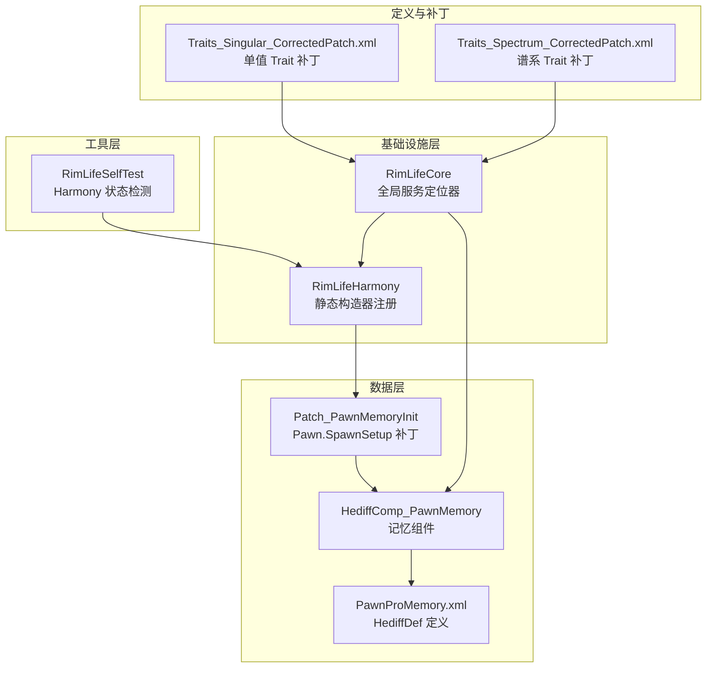
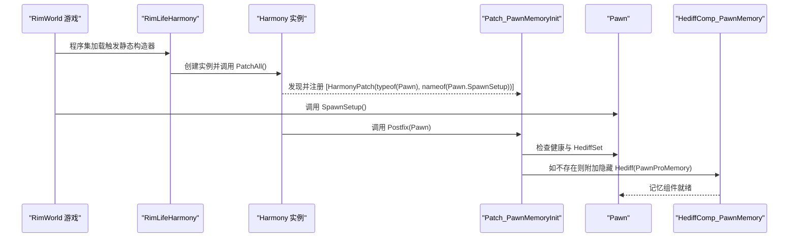
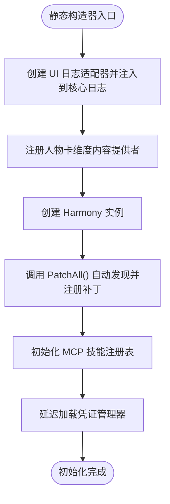
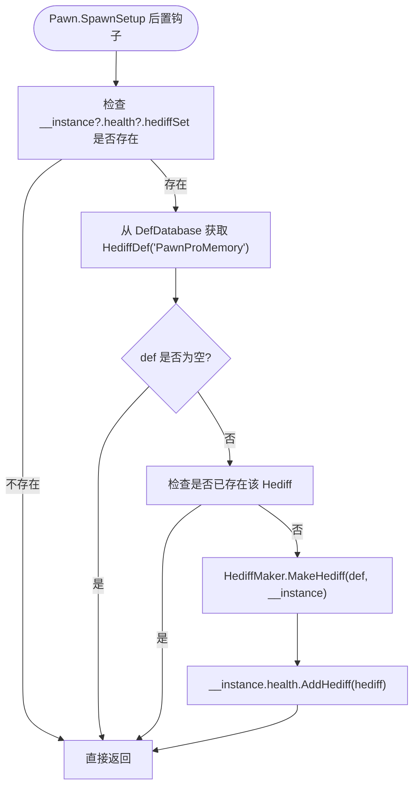
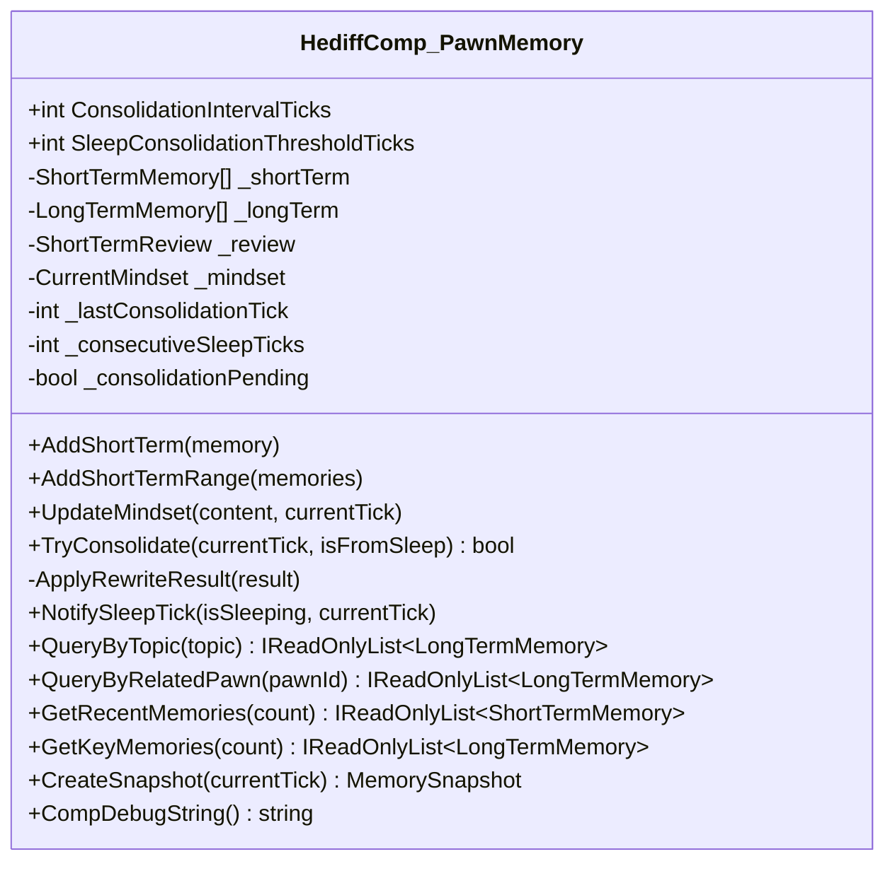
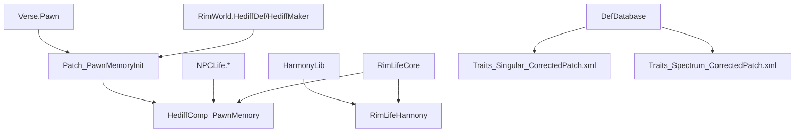

# Harmony 补丁系统

<cite>
**本文档引用的文件**
- [RimLifeHarmony.cs](file://Source/Infrastructure/RimLifeHarmony.cs)
- [Patch_PawnMemoryInit.cs](file://Source/Data/PawnPro/Memory/Patch_PawnMemoryInit.cs)
- [HediffComp_PawnMemory.cs](file://Source/Data/PawnPro/Memory/HediffComp_PawnMemory.cs)
- [RimLifeCore.cs](file://Source/Infrastructure/RimLifeCore.cs)
- [PawnProMemory.xml](file://Defs/Core/PawnProMemory.xml)
- [Traits_Singular_CorrectedPatch.xml](file://Patches/Traits_Singular_CorrectedPatch.xml)
- [Traits_Spectrum_CorrectedPatch.xml](file://Patches/Traits_Spectrum_CorrectedPatch.xml)
- [RimLifeSelfTest.cs](file://Source/Tool/RimLifeSelfTest.cs)
</cite>

## 目录
1. [简介](#简介)
2. [项目结构](#项目结构)
3. [核心组件](#核心组件)
4. [架构概览](#架构概览)
5. [详细组件分析](#详细组件分析)
6. [依赖关系分析](#依赖关系分析)
7. [性能考虑](#性能考虑)
8. [故障排除指南](#故障排除指南)
9. [结论](#结论)
10. [附录](#附录)

## 简介
本文件面向 RimLife 的 Harmony 补丁系统，系统性阐述 Harmony 库在 RimLife 中的应用方式、补丁注册机制、初始化流程与补丁管理策略。重点覆盖 PawnMemoryInit 补丁的作用与影响范围，解释补丁优先级、执行顺序与冲突处理机制，并提供补丁开发最佳实践、性能影响分析与优化策略、版本兼容性处理以及自定义补丁开发指南与调试技巧。

## 项目结构
RimLife 的补丁系统主要分布在以下位置：
- 基础设施层：集中管理 Harmony 补丁注册与初始化
- 数据层：Pawn 记忆系统的补丁与组件实现
- 定义与补丁：Trait 人格维度扩展的 XML 补丁
- 工具层：自检与调试工具，支持 Harmony 状态检测

**图表来源**
- [RimLifeHarmony.cs:1-60](file://Source/Infrastructure/RimLifeHarmony.cs#L1-L60)
- [Patch_PawnMemoryInit.cs:1-38](file://Source/Data/PawnPro/Memory/Patch_PawnMemoryInit.cs#L1-L38)
- [HediffComp_PawnMemory.cs:1-408](file://Source/Data/PawnPro/Memory/HediffComp_PawnMemory.cs#L1-L408)
- [PawnProMemory.xml:1-22](file://Defs/Core/PawnProMemory.xml#L1-L22)
- [Traits_Singular_CorrectedPatch.xml:1-635](file://Patches/Traits_Singular_CorrectedPatch.xml#L1-L635)
- [Traits_Spectrum_CorrectedPatch.xml:1-305](file://Patches/Traits_Spectrum_CorrectedPatch.xml#L1-L305)
- [RimLifeSelfTest.cs:593-621](file://Source/Tool/RimLifeSelfTest.cs#L593-L621)

**章节来源**
- [RimLifeHarmony.cs:1-60](file://Source/Infrastructure/RimLifeHarmony.cs#L1-L60)
- [Patch_PawnMemoryInit.cs:1-38](file://Source/Data/PawnPro/Memory/Patch_PawnMemoryInit.cs#L1-L38)
- [HediffComp_PawnMemory.cs:1-408](file://Source/Data/PawnPro/Memory/HediffComp_PawnMemory.cs#L1-L408)
- [PawnProMemory.xml:1-22](file://Defs/Core/PawnProMemory.xml#L1-L22)
- [Traits_Singular_CorrectedPatch.xml:1-635](file://Patches/Traits_Singular_CorrectedPatch.xml#L1-L635)
- [Traits_Spectrum_CorrectedPatch.xml:1-305](file://Patches/Traits_Spectrum_CorrectedPatch.xml#L1-L305)
- [RimLifeSelfTest.cs:593-621](file://Source/Tool/RimLifeSelfTest.cs#L593-L621)

## 核心组件
- RimLifeHarmony：集中管理所有 Harmony 补丁注册，使用静态构造器在程序集加载时自动发现并注册 [HarmonyPatch] 类型，创建 Harmony 实例并调用 PatchAll()。
- Patch_PawnMemoryInit：在 Pawn.SpawnSetup 后置阶段自动附加隐藏 Hediff（PawnProMemory），确保每个 Pawn 都具备记忆系统。
- HediffComp_PawnMemory：Pawn 个体记忆的 Hediff 组件，负责短期/长期记忆的持久化、巩固与查询。
- RimLifeCore：全局服务定位器，提供日志、配置、工作空间、知识库、LLM 访问等统一入口，并初始化 MCP 技能注册表。
- Trait XML 补丁：通过 XML Patch 为 TraitDef 添加 PersonalityExtension，映射到 OCEAN 五大人格维度。

**章节来源**
- [RimLifeHarmony.cs:7-40](file://Source/Infrastructure/RimLifeHarmony.cs#L7-L40)
- [Patch_PawnMemoryInit.cs:7-36](file://Source/Data/PawnPro/Memory/Patch_PawnMemoryInit.cs#L7-L36)
- [HediffComp_PawnMemory.cs:11-44](file://Source/Data/PawnPro/Memory/HediffComp_PawnMemory.cs#L11-L44)
- [RimLifeCore.cs:24-81](file://Source/Infrastructure/RimLifeCore.cs#L24-L81)
- [Traits_Singular_CorrectedPatch.xml:4-20](file://Patches/Traits_Singular_CorrectedPatch.xml#L4-L20)
- [Traits_Spectrum_CorrectedPatch.xml:4-28](file://Patches/Traits_Spectrum_CorrectedPatch.xml#L4-L28)

## 架构概览
Harmony 补丁系统采用“静态构造器 + PatchAll 自动发现”的模式，确保补丁在模块初始化阶段被集中注册。Pawn 记忆补丁通过后置钩子在 Pawn spawn 时附加隐藏 Hediff，随后由记忆组件进行序列化与巩固管理。Trait XML 补丁在游戏定义加载阶段生效，为 Trait 提供人格维度扩展。

**图表来源**
- [RimLifeHarmony.cs:16-40](file://Source/Infrastructure/RimLifeHarmony.cs#L16-L40)
- [Patch_PawnMemoryInit.cs:12-36](file://Source/Data/PawnPro/Memory/Patch_PawnMemoryInit.cs#L12-L36)

**章节来源**
- [RimLifeHarmony.cs:16-40](file://Source/Infrastructure/RimLifeHarmony.cs#L16-L40)
- [Patch_PawnMemoryInit.cs:12-36](file://Source/Data/PawnPro/Memory/Patch_PawnMemoryInit.cs#L12-L36)

## 详细组件分析

### RimLifeHarmony 初始化与补丁注册
- 静态构造器在程序集加载时执行，创建 UI 日志适配器并将日志注入到 RimLifeCore.Logger 与 MainThreadDispatcher.Logger。
- 注册多种人物卡维度内容提供者（健康、情绪、技能、需求、活动、装备、背景、社交、心理、视角、记忆），为后续序列化与展示提供数据源。
- 创建 Harmony 实例并调用 PatchAll()，自动发现程序集中所有带有 [HarmonyPatch] 的类型并注册。
- 初始化 MCP 技能注册表，扫描工具类建立 Skill → Tool 映射。
- 触发凭证管理器延迟加载，从 ModSettings 加载持久化状态。

**图表来源**
- [RimLifeHarmony.cs:16-47](file://Source/Infrastructure/RimLifeHarmony.cs#L16-L47)

**章节来源**
- [RimLifeHarmony.cs:16-47](file://Source/Infrastructure/RimLifeHarmony.cs#L16-L47)

### PawnMemoryInit 补丁详解
- 目标方法：Pawn.SpawnSetup 的后置钩子（Postfix）。
- 功能：在 Pawn spawn 时检查其健康与 HediffSet，若不存在名为 PawnProMemory 的隐藏 Hediff，则创建并附加到 Pawn。
- 安全性：包含空引用检查与异常捕获，避免在缺失健康或 HediffSet 时抛出异常。
- 影响范围：确保每个 Pawn 都具备记忆系统，为后续记忆组件的序列化与巩固提供基础。

**图表来源**
- [Patch_PawnMemoryInit.cs:15-35](file://Source/Data/PawnPro/Memory/Patch_PawnMemoryInit.cs#L15-L35)

**章节来源**
- [Patch_PawnMemoryInit.cs:7-36](file://Source/Data/PawnPro/Memory/Patch_PawnMemoryInit.cs#L7-L36)

### HediffComp_PawnMemory 组件
- 生命周期：随 Pawn 添加而添加，随 Pawn 销毁而清理。
- 序列化：通过 Scribe 自动持久化短期记忆、长期记忆、短期回顾与即时心境。
- 记忆巩固：提供 TryConsolidate 方法，周期性或由睡眠触发将短期记忆重写为长期记忆，并在主线程回写结果。
- 查询接口：支持按主题标签与关联角色筛选长期记忆，支持获取近期与关键记忆快照。
- 睡眠状态通知：NotifySleepTick 累积连续睡眠 tick，达到阈值时触发巩固。

**图表来源**
- [HediffComp_PawnMemory.cs:20-405](file://Source/Data/PawnPro/Memory/HediffComp_PawnMemory.cs#L20-L405)

**章节来源**
- [HediffComp_PawnMemory.cs:11-405](file://Source/Data/PawnPro/Memory/HediffComp_PawnMemory.cs#L11-L405)

### Trait XML 补丁
- 单值 Trait 补丁：为单一数值的 Trait（如 Nudist、Bloodlust、Kind 等）添加 PersonalityExtension，映射到 OCEAN 五大人格维度的具体数值。
- 谱系 Trait 补丁：为具有多个等级的 Trait（如 SpeedOffset、DrugDesire、NaturalMood 等）提供多条数据，每条数据对应不同等级的维度值。
- 生效时机：在游戏定义加载阶段通过 XML Patch 生效，无需重启即可影响 Trait 的人格维度表现。

**章节来源**
- [Traits_Singular_CorrectedPatch.xml:4-635](file://Patches/Traits_Singular_CorrectedPatch.xml#L4-L635)
- [Traits_Spectrum_CorrectedPatch.xml:4-305](file://Patches/Traits_Spectrum_CorrectedPatch.xml#L4-L305)

### 补丁状态检测与调试
- 自检工具：RimLifeSelfTest 提供 TestHarmonyStatus 方法，通过 Harmony 实例枚举已注册补丁的方法与前后缀数量，便于验证补丁是否正确注册。
- 使用建议：在调试阶段调用该方法输出已注册补丁清单，确认补丁数量与类型符合预期。

**章节来源**
- [RimLifeSelfTest.cs:593-621](file://Source/Tool/RimLifeSelfTest.cs#L593-L621)

## 依赖关系分析
- RimLifeHarmony 依赖 HarmonyLib 进行补丁注册，依赖 RimLifeCore 进行日志与内容提供者注册。
- Patch_PawnMemoryInit 依赖 Verse.Pawn 与 RimWorld.HediffDef、HediffMaker，最终依赖 HediffComp_PawnMemory。
- HediffComp_PawnMemory 依赖 NPCLife.Cards、NPCLife.Framework、RimLife.Cards 等命名空间，用于序列化与持久化。
- Trait XML 补丁依赖 RimWorld.DefDatabase 与 PersonalityExtension 扩展。
- RimLifeCore 作为全局服务定位器，协调日志、配置、工作空间、知识库与 LLM 访问。

**图表来源**
- [RimLifeHarmony.cs:1-60](file://Source/Infrastructure/RimLifeHarmony.cs#L1-L60)
- [Patch_PawnMemoryInit.cs:1-38](file://Source/Data/PawnPro/Memory/Patch_PawnMemoryInit.cs#L1-L38)
- [HediffComp_PawnMemory.cs:1-408](file://Source/Data/PawnPro/Memory/HediffComp_PawnMemory.cs#L1-L408)
- [Traits_Singular_CorrectedPatch.xml:1-635](file://Patches/Traits_Singular_CorrectedPatch.xml#L1-L635)
- [Traits_Spectrum_CorrectedPatch.xml:1-305](file://Patches/Traits_Spectrum_CorrectedPatch.xml#L1-L305)

**章节来源**
- [RimLifeHarmony.cs:1-60](file://Source/Infrastructure/RimLifeHarmony.cs#L1-L60)
- [Patch_PawnMemoryInit.cs:1-38](file://Source/Data/PawnPro/Memory/Patch_PawnMemoryInit.cs#L1-L38)
- [HediffComp_PawnMemory.cs:1-408](file://Source/Data/PawnPro/Memory/HediffComp_PawnMemory.cs#L1-L408)
- [Traits_Singular_CorrectedPatch.xml:1-635](file://Patches/Traits_Singular_CorrectedPatch.xml#L1-L635)
- [Traits_Spectrum_CorrectedPatch.xml:1-305](file://Patches/Traits_Spectrum_CorrectedPatch.xml#L1-L305)

## 性能考虑
- 补丁数量与开销：PatchAll() 会扫描程序集并注册所有 [HarmonyPatch] 类型，建议控制补丁数量与复杂度，避免在热路径上引入过多逻辑。
- 记忆巩固的异步化：HediffComp_PawnMemory 的 TryConsolidate 采用异步任务执行重写，并通过主线程调度器回写结果，减少主线程压力。
- 序列化成本：记忆组件的 Scribe 序列化涉及大量短/长期记忆列表，建议在存档保存时进行批量处理，避免频繁 IO。
- 睡眠触发阈值：通过连续睡眠 tick 阈值与强制触发间隔平衡巩固频率，防止过度触发导致性能抖动。
- 日志与诊断：启用详细日志会增加 I/O 成本，建议仅在调试阶段开启，生产环境关闭冗余日志。

[本节为通用性能指导，无需特定文件引用]

## 故障排除指南
- 补丁未注册：使用 RimLifeSelfTest.TestHarmonyStatus 检查已注册补丁数量与类型，确认 PatchAll() 是否正常执行。
- Pawn 记忆未附加：检查 Patch_PawnMemoryInit 的异常捕获日志，确认是否存在健康或 HediffSet 缺失的情况。
- 记忆组件异常：查看 HediffComp_PawnMemory 的异常日志，关注 TryConsolidate 与 ApplyRewriteResult 的错误信息。
- 日志注入问题：确认 RimLifeHarmony 静态构造器中日志适配器是否正确注入到 RimLifeCore.Logger 与 MainThreadDispatcher.Logger。
- 版本兼容性：Harmony 补丁通常与 RimWorld 版本无关，但若目标方法签名变更（如 Pawn.SpawnSetup），需更新补丁声明。

**章节来源**
- [RimLifeSelfTest.cs:593-621](file://Source/Tool/RimLifeSelfTest.cs#L593-L621)
- [Patch_PawnMemoryInit.cs:31-35](file://Source/Data/PawnPro/Memory/Patch_PawnMemoryInit.cs#L31-L35)
- [HediffComp_PawnMemory.cs:264-277](file://Source/Data/PawnPro/Memory/HediffComp_PawnMemory.cs#L264-L277)
- [RimLifeHarmony.cs:21-23](file://Source/Infrastructure/RimLifeHarmony.cs#L21-L23)

## 结论
RimLife 的 Harmony 补丁系统通过静态构造器集中注册、PatchAll 自动发现与后置钩子机制，实现了对 Pawn 记忆系统的无缝集成。PawnMemoryInit 补丁确保每个 Pawn 都具备记忆组件，HediffComp_PawnMemory 则提供了完整的记忆持久化与巩固能力。配合 Trait XML 补丁，系统在不修改核心代码的前提下扩展了人格维度表现。通过合理的性能优化与完善的日志诊断，补丁系统能够在保证稳定性的同时满足复杂叙事需求。

[本节为总结性内容，无需特定文件引用]

## 附录

### 补丁开发最佳实践
- 安全检查：始终进行空引用检查与异常捕获，避免在热路径上抛出异常。
- 前后缀选择：优先使用 Postfix 进行副作用增强，避免使用 Prefix 修改核心逻辑。
- 并发与主线程：异步任务完成后通过主线程调度器回写结果，确保 UI 与游戏状态一致性。
- 日志与诊断：在关键节点记录日志，便于调试与性能分析；生产环境关闭冗余日志。
- 回滚机制：在补丁中保留幂等性设计，必要时提供回滚或降级方案。

[本节为通用最佳实践，无需特定文件引用]

### 补丁优先级与执行顺序
- Harmony 默认按注册顺序执行补丁，同一方法的前后缀在同一链路内遵循固定顺序。建议通过补丁设计避免相互依赖，必要时在补丁内部进行条件判断以降低耦合。

[本节为通用概念说明，无需特定文件引用]

### 版本兼容性处理
- Harmony 补丁通常与 RimWorld 主版本兼容，但需关注目标方法签名变化。若发生变更，应及时更新补丁声明与实现。
- Trait XML 补丁依赖 RimWorld 的 DefDatabase 与 Patch 机制，一般不受主版本影响，但需注意新增或移除的 TraitDef 名称变化。

[本节为通用兼容性指导，无需特定文件引用]

### 自定义补丁开发指南
- 定义补丁类：使用 [HarmonyPatch] 标注目标类型与方法，选择合适的前/后缀钩子。
- 实现补丁逻辑：在补丁方法中进行必要的安全检查与异常处理，避免对核心逻辑产生副作用。
- 注册与测试：确保补丁类位于可被 PatchAll() 扫描的程序集内，并通过自检工具验证补丁注册状态。
- 调试技巧：利用日志输出与断点调试定位问题；在复杂场景下分步骤验证补丁行为。

[本节为通用开发指导，无需特定文件引用]