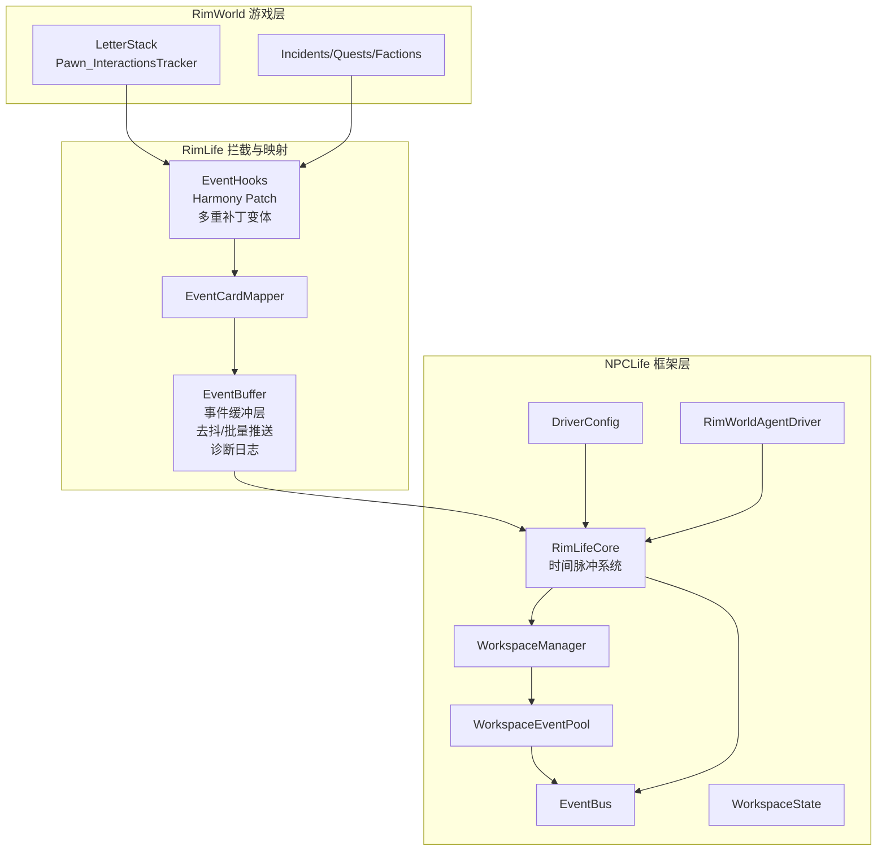
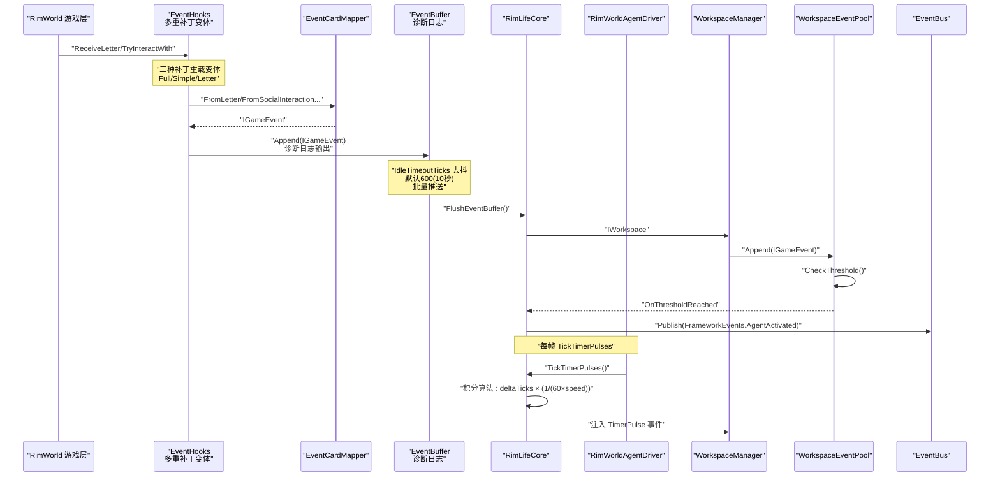
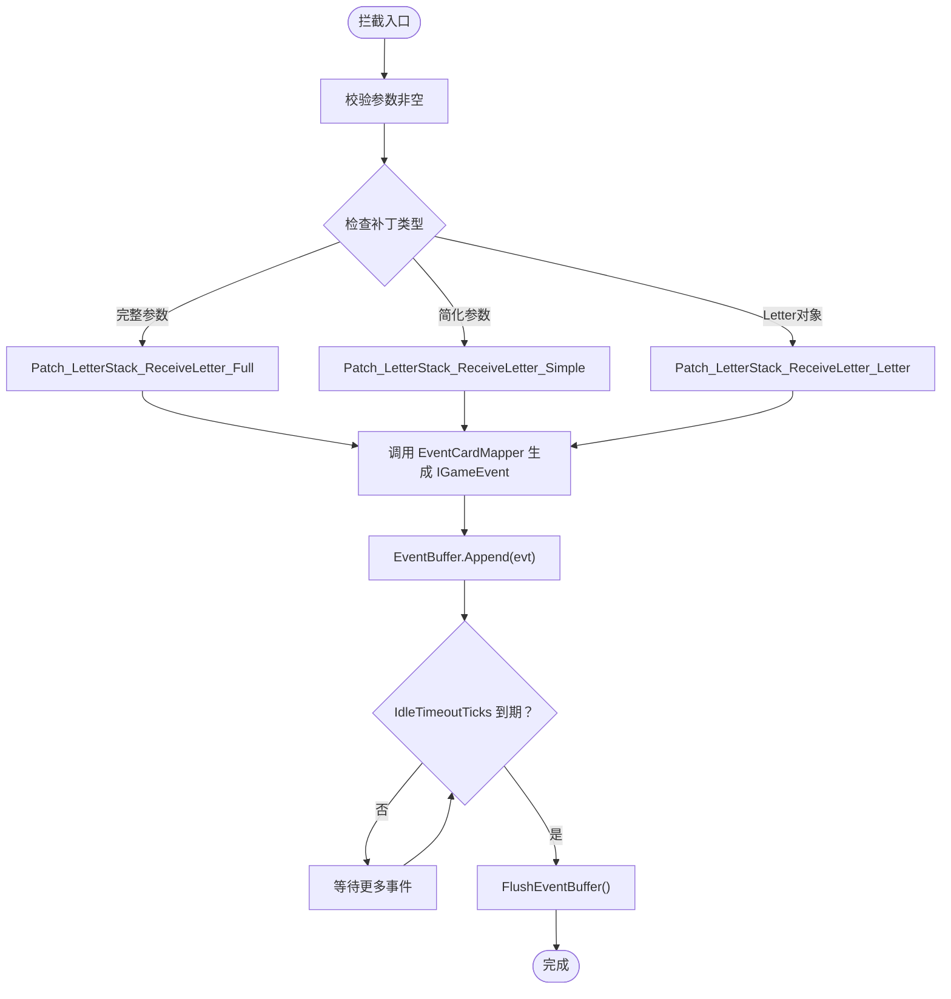
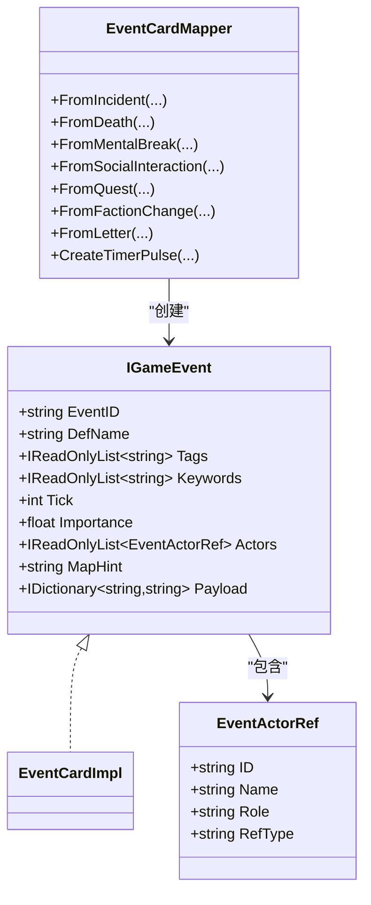
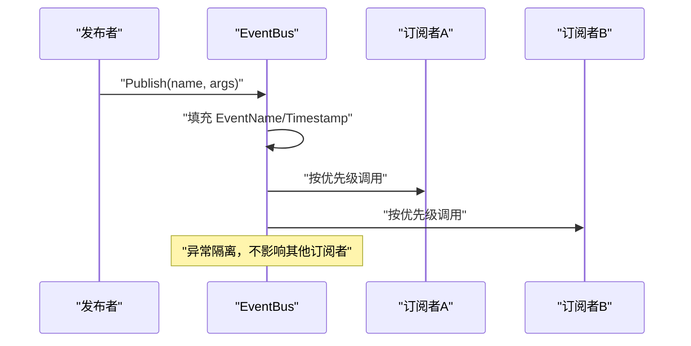
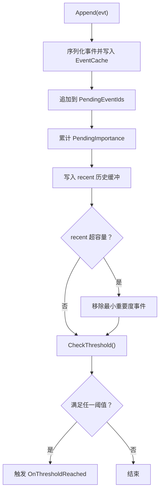
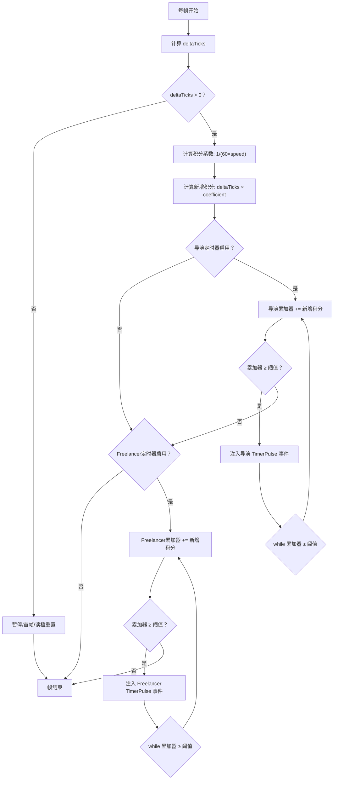
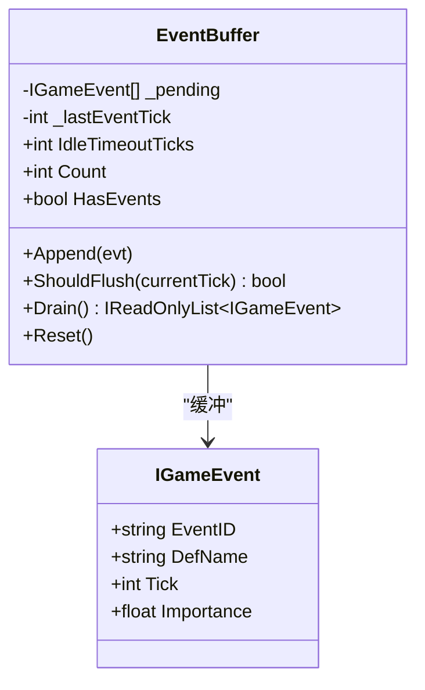
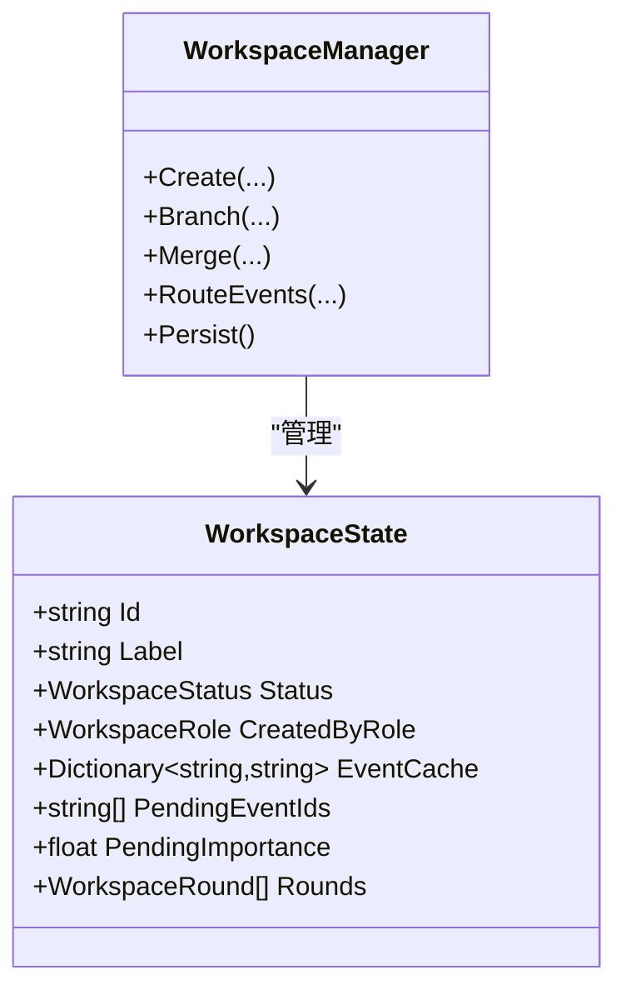
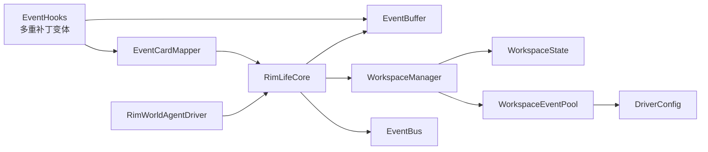

# 事件系统集成

<cite>
**本文引用的文件**
- [EventHooks.cs](file://Source/Data/Events/EventHooks.cs)
- [EventCardMapper.cs](file://Source/Mappers/EventCardMapper.cs)
- [EventBus.cs](file://ext/NPCLife/src/NPCLife/Framework/EventBus.cs)
- [WorkspaceEventPool.cs](file://ext/NPCLife/src/NPCLife/Workspace/WorkspaceEventPool.cs)
- [EventCard.cs](file://ext/NPCLife/src/NPCLife/Cards/EventCard.cs)
- [EventQuery.cs](file://ext/NPCLife/src/NPCLife/Core/EventQuery.cs)
- [WorkspaceState.cs](file://ext/NPCLife/src/NPCLife/Workspace/WorkspaceState.cs)
- [WorkspaceManager.cs](file://ext/NPCLife/src/NPCLife/Workspace/WorkspaceManager.cs)
- [DriverConfig.cs](file://ext/NPCLife/src/NPCLife/Driver/DriverConfig.cs)
- [RimLifeCore.cs](file://Source/Infrastructure/RimLifeCore.cs)
- [RimWorldAgentDriver.cs](file://Source/Infrastructure/RimWorldAgentDriver.cs)
- [EventBuffer.cs](file://Source/Data/Events/EventBuffer.cs)
- [WorkspaceEventPoolTests.cs](file://ext/NPCLife/tests/NPCLife.Tests/Driver/WorkspaceEventPoolTests.cs)
</cite>

## 更新摘要
**所做更改**
- 新增了三个新的LetterStack ReceiveLetter补丁重载变体，提供更灵活的事件拦截机制
- 更新了事件缓冲系统的默认配置，IdleTimeoutTicks从6000调整为600
- 增强了事件缓冲层的诊断日志功能，便于调试和监控
- 更新了事件拦截机制，反映新的多重补丁策略
- 完善了架构图表，展示新的事件拦截层次结构

## 目录
1. [简介](#简介)
2. [项目结构](#项目结构)
3. [核心组件](#核心组件)
4. [架构总览](#架构总览)
5. [详细组件分析](#详细组件分析)
6. [依赖关系分析](#依赖关系分析)
7. [性能考量](#性能考量)
8. [故障排查指南](#故障排查指南)
9. [结论](#结论)
10. [附录](#附录)

## 简介
本文件面向 RimLife 的事件系统集成，系统性阐述 RimWorld 事件拦截机制、事件映射器的实现、事件总线的发布订阅模式、事件池的工作空间事件队列与阈值触发、**基于积分的实时秒时间脉冲系统**与事件过滤策略，并提供扩展点与自定义事件处理器的开发指南。目标是帮助开发者在不深入 RimWorld 内核的前提下，将游戏事件无缝转化为工作空间事件，驱动 AI Agent 的叙事与决策。

## 项目结构
事件系统主要分布在以下模块：
- 数据层拦截与映射：RimLife 的事件钩子与映射器负责从 RimWorld 事件源抽取信息并转换为统一的 IGameEvent。
- **事件缓冲层**：EventBuffer 实现事件的去抖和批量推送，通过 IdleTimeoutTicks 控制事件合并时机，显著提升系统性能。
- 工作空间事件池：WorkspaceEventPool 实现事件的持久化缓冲、阈值触发与查询。
- **时间脉冲系统**：基于积分的实时秒系统，通过三层解耦模型实现精确的时间控制。
- 事件总线：EventBus 提供全局发布/订阅与错误隔离。
- 工作空间管理：WorkspaceManager 负责工作空间的 CRUD、分支/合并与事件路由。
- 驱动配置：DriverConfig 控制阈值、定时器与历史容量等行为参数。
- 核心协调：RimLifeCore 提供全局服务定位、定时脉冲注入与 Agent 生命周期管理。

**图示来源**
- [EventHooks.cs:17-76](file://Source/Data/Events/EventHooks.cs#L17-L76)
- [EventCardMapper.cs:257-292](file://Source/Mappers/EventCardMapper.cs#L257-L292)
- [EventBuffer.cs:19-72](file://Source/Data/Events/EventBuffer.cs#L19-L72)
- [WorkspaceManager.cs:382-392](file://ext/NPCLife/src/NPCLife/Workspace/WorkspaceManager.cs#L382-L392)
- [WorkspaceEventPool.cs:21-80](file://ext/NPCLife/src/NPCLife/Workspace/WorkspaceEventPool.cs#L21-L80)
- [DriverConfig.cs:9-107](file://ext/NPCLife/src/NPCLife/Driver/DriverConfig.cs#L9-L107)
- [RimLifeCore.cs:499-588](file://Source/Infrastructure/RimLifeCore.cs#L499-L588)
- [RimWorldAgentDriver.cs:13-35](file://Source/Infrastructure/RimWorldAgentDriver.cs#L13-L35)

**章节来源**
- [EventHooks.cs:17-76](file://Source/Data/Events/EventHooks.cs#L17-L76)
- [EventCardMapper.cs:257-292](file://Source/Mappers/EventCardMapper.cs#L257-L292)
- [EventBuffer.cs:19-72](file://Source/Data/Events/EventBuffer.cs#L19-L72)
- [WorkspaceManager.cs:382-392](file://ext/NPCLife/src/NPCLife/Workspace/WorkspaceManager.cs#L382-L392)
- [WorkspaceEventPool.cs:21-80](file://ext/NPCLife/src/NPCLife/Workspace/WorkspaceEventPool.cs#L21-L80)
- [DriverConfig.cs:9-107](file://ext/NPCLife/src/NPCLife/Driver/DriverConfig.cs#L9-L107)
- [RimLifeCore.cs:499-588](file://Source/Infrastructure/RimLifeCore.cs#L499-L588)
- [RimWorldAgentDriver.cs:13-35](file://Source/Infrastructure/RimWorldAgentDriver.cs#L13-L35)

## 核心组件
- 事件拦截与映射
  - EventHooks：通过 Harmony Patch 拦截 LetterStack.ReceiveLetter 与 Pawn_InteractionsTracker.TryInteractWith，将 RimWorld 事件转换为 IGameEvent 并写入事件缓冲层。**新增三种补丁重载变体，提供更灵活的事件拦截策略。**
  - EventCardMapper：提供从 Incident、死亡、精神崩溃、社交互动、任务状态、派系变更、信封 Letter 以及定时器脉冲等多种来源创建 IGameEvent 的静态映射方法。
  - **EventBuffer：实现事件去抖和批量推送，通过 IdleTimeoutTicks 控制事件合并时机，默认600（10秒），显著减少事件风暴对系统的影响。**
- 事件池与路由
  - WorkspaceEventPool：实现 IEventLog，提供 Append、查询、DrainPending 与阈值触发 OnThresholdReached；双层缓冲（持久化 pending + 内存 recent）。
  - WorkspaceManager：提供工作空间的创建、分支/合并、事件路由与持久化。
- **时间脉冲系统**
  - **RimLifeCore.TickTimerPulses：基于积分的实时秒系统，通过三层解耦模型实现精确的时间控制。**
  - **RimWorldAgentDriver：每帧调用 TickTimerPulses，实现时间脉冲的驱动。**
- 事件总线
  - EventBus：静态发布/订阅总线，支持优先级、错误隔离、日志注入与事件统计。
- 驱动配置
  - DriverConfig：控制各角色阈值（数量/重要度）、定时器间隔、历史容量与最大 Agent 轮次。
- 核心协调
  - RimLifeCore：提供 GetDirectorWorkspace/GetFreelancerWorkspace、定时脉冲注入、Agent 实例化与生命周期管理。

**章节来源**
- [EventHooks.cs:17-76](file://Source/Data/Events/EventHooks.cs#L17-L76)
- [EventCardMapper.cs:15-520](file://Source/Mappers/EventCardMapper.cs#L15-L520)
- [EventBuffer.cs:19-72](file://Source/Data/Events/EventBuffer.cs#L19-L72)
- [WorkspaceEventPool.cs:21-184](file://ext/NPCLife/src/NPCLife/Workspace/WorkspaceEventPool.cs#L21-L184)
- [WorkspaceManager.cs:19-622](file://ext/NPCLife/src/NPCLife/Workspace/WorkspaceManager.cs#L19-L622)
- [RimLifeCore.cs:499-617](file://Source/Infrastructure/RimLifeCore.cs#L499-L617)
- [RimWorldAgentDriver.cs:13-35](file://Source/Infrastructure/RimWorldAgentDriver.cs#L13-L35)
- [EventBus.cs:17-243](file://ext/NPCLife/src/NPCLife/Framework/EventBus.cs#L17-L243)
- [DriverConfig.cs:9-107](file://ext/NPCLife/src/NPCLife/Driver/DriverConfig.cs#L9-L107)
- [RimLifeCore.cs:493-527](file://Source/Infrastructure/RimLifeCore.cs#L493-L527)

## 架构总览
事件从 RimWorld 游戏层进入，经由 EventHooks 拦截，再由 EventCardMapper 统一映射为 IGameEvent，随后写入事件缓冲层。**缓冲层通过 IdleTimeoutTicks 实现事件去抖，然后批量推送到工作空间事件池。** 事件池根据 DriverConfig 的阈值触发 OnThresholdReached，驱动 Agent 激活；同时，**基于积分的实时秒时间脉冲系统**通过三层解耦模型实现精确的时间控制：游戏引擎 → 适配层积分算法 → 框架脉冲累加器。RimLifeCore 的 TickTimerPulses 每帧计算 deltaTicks，通过积分公式换算为现实秒，分别累加到导演和 Freelancer 的积分累加器，超过阈值时注入 TimerPulse 事件。事件总线 EventBus 贯穿各组件，用于框架内事件传播与度量上报。

**图示来源**
- [EventHooks.cs:26-76](file://Source/Data/Events/EventHooks.cs#L26-L76)
- [EventCardMapper.cs:257-292](file://Source/Mappers/EventCardMapper.cs#L257-L292)
- [EventBuffer.cs:42-50](file://Source/Data/Events/EventBuffer.cs#L42-L50)
- [RimLifeCore.cs:530-588](file://Source/Infrastructure/RimLifeCore.cs#L530-L588)
- [RimWorldAgentDriver.cs:19-23](file://Source/Infrastructure/RimWorldAgentDriver.cs#L19-L23)
- [WorkspaceManager.cs:382-392](file://ext/NPCLife/src/NPCLife/Workspace/WorkspaceManager.cs#L382-L392)
- [WorkspaceEventPool.cs:78-90](file://ext/NPCLife/src/NPCLife/Workspace/WorkspaceEventPool.cs#L78-L90)
- [EventBus.cs:86-113](file://ext/NPCLife/src/NPCLife/Framework/EventBus.cs#L86-L113)

## 详细组件分析

### 事件拦截机制与 EventHooks
**更新** 新增三种补丁重载变体，提供更灵活的LetterStack事件拦截

- **LetterStack 接收信封事件**：
  - **补丁重载1（完整参数版本）**：拦截所有参数的 ReceiveLetter，适用于标准 LetterStack.ReceiveLetter 调用
  - **补丁重载2（简化参数版本）**：拦截无 LookTargets 参数的 ReceiveLetter，适用于某些 mod 或特殊情况
  - **补丁重载3（Letter对象版本）**：直接接收 Letter 对象，适用于通过 Letter 对象进行事件触发的场景
- 社交互动 TryInteractWith 不直接写入事件池，而是：
  - 写入 InteractionHistoryStore（流水记录，供 MCP 工具按需拉取）。
  - 追加双方 Pawn 的短期记忆（PawnProMemory）。
- **事件缓冲层**：EventBuffer 实现事件去抖，通过 IdleTimeoutTicks（默认 600，约 10 秒）控制事件合并时机，避免事件风暴。
- 异常处理：拦截器内部使用 try/catch 记录警告日志，避免影响游戏主流程。

**图示来源**
- [EventHooks.cs:18-76](file://Source/Data/Events/EventHooks.cs#L18-L76)
- [EventHooks.cs:46-72](file://Source/Data/Events/EventHooks.cs#L46-L72)
- [EventHooks.cs:77-113](file://Source/Data/Events/EventHooks.cs#L77-L113)
- [EventBuffer.cs:42-50](file://Source/Data/Events/EventBuffer.cs#L42-L50)

**章节来源**
- [EventHooks.cs:17-76](file://Source/Data/Events/EventHooks.cs#L17-L76)
- [EventHooks.cs:40-114](file://Source/Data/Events/EventHooks.cs#L40-L114)
- [EventBuffer.cs:19-72](file://Source/Data/Events/EventBuffer.cs#L19-L72)

### EventCardMapper 的事件转换逻辑与数据映射规则
- 统一接口：所有映射方法返回 IGameEvent，包含 EventID、DefName、Tags、Keywords、Tick、Importance、Actors、MapHint、Payload 等字段。
- 事件来源映射：
  - Incident：提取威胁点、阵型、到达方式等，生成事件并标注标签（Combat/Economy/Quest/Nature/Social 等）。
  - 死亡：区分自然死亡与战斗致死，标注健康/战斗标签，提取伤害类型与数量。
  - 精神崩溃：提取崩溃定义、强度、原因与精神状态。
  - 社交互动：标注发起者/目标，提取互动标签。
  - 任务状态：记录任务 ID、名称、状态变化与当前状态。
  - 派系变更：根据新旧派系判定加入/离开/第三方切换，标注角色（Initiator/Victim/Bystander）。
  - Letter：从 LetterDef 推导标签与重要度，提取信封文本与派系关联。
  - **定时器脉冲：固定重要度 0.5f，携带来源角色与脉冲 tick，事件 ID 格式为 timer_pulse_{role}_{tick}。**
- 实体引用：EventActorRef 支持 Pawn/Faction/Thing 三类引用，含角色与显示名。
- 地图提示：从 LookTargets 推导 MapHint，便于叙事定位。

**图示来源**
- [EventCardMapper.cs:15-520](file://Source/Mappers/EventCardMapper.cs#L15-L520)
- [EventCard.cs:11-126](file://ext/NPCLife/src/NPCLife/Cards/EventCard.cs#L11-L126)

**章节来源**
- [EventCardMapper.cs:15-520](file://Source/Mappers/EventCardMapper.cs#L15-L520)
- [EventCard.cs:11-126](file://ext/NPCLife/src/NPCLife/Cards/EventCard.cs#L11-L126)

### 事件总线 EventBus 的发布订阅与事件路由
- 发布/订阅：Subscribe 返回取消订阅的 Action；Publish 自动填充事件名与时间戳，按优先级顺序调用处理器，异常被隔离。
- 预定义事件：FrameworkEvents 定义框架生命周期、存档切换、Agent 循环、工具调用、LLM 请求/响应、工作空间状态、台词准备等事件名。
- 路由与度量：RimLifeCore 在配置就绪、存档加载/卸载、工作空间创建/更新/关闭、LLM 请求/响应等节点通过 EventBus 发布事件，供监控与度量系统订阅。

**图示来源**
- [EventBus.cs:46-113](file://ext/NPCLife/src/NPCLife/Framework/EventBus.cs#L46-L113)
- [RimLifeCore.cs:139](file://Source/Infrastructure/RimLifeCore.cs#L139)
- [RimLifeCore.cs:399](file://Source/Infrastructure/RimLifeCore.cs#L399)

**章节来源**
- [EventBus.cs:17-243](file://ext/NPCLife/src/NPCLife/Framework/EventBus.cs#L17-L243)
- [RimLifeCore.cs:139](file://Source/Infrastructure/RimLifeCore.cs#L139)
- [RimLifeCore.cs:399](file://Source/Infrastructure/RimLifeCore.cs#L399)

### 事件池 WorkspaceEventPool 的实现细节
- 双层缓冲：
  - pending：持久化到 WorkspaceState 的 EventCache 与 PendingEventIds/PendingImportance，随存档保存，Agent drain 时清空。
  - recent：仅内存的历史缓冲，按最小重要度淘汰，容量由 DriverConfig.RecentHistoryCapacity 控制。
- 阈值触发：Append 后计算 PendingCount 与 TotalImportance，若任一阈值满足（分角色配置），触发 OnThresholdReached。
- 查询与路由：提供 Query/Count/Latest/GetById，DrainPending 取出并清空 pending。
- 与 WorkspaceManager 的关系：WorkspaceManager.RouteEvents 将事件批量写入目标工作空间的 EventPool。

**图示来源**
- [WorkspaceEventPool.cs:49-80](file://ext/NPCLife/src/NPCLife/Workspace/WorkspaceEventPool.cs#L49-L80)
- [WorkspaceEventPool.cs:81-90](file://ext/NPCLife/src/NPCLife/Workspace/WorkspaceEventPool.cs#L81-L90)
- [WorkspaceEventPool.cs:96-124](file://ext/NPCLife/src/NPCLife/Workspace/WorkspaceEventPool.cs#L96-L124)
- [WorkspaceEventPool.cs:166-183](file://ext/NPCLife/src/NPCLife/Workspace/WorkspaceEventPool.cs#L166-L183)

**章节来源**
- [WorkspaceEventPool.cs:21-184](file://ext/NPCLife/src/NPCLife/Workspace/WorkspaceEventPool.cs#L21-L184)
- [WorkspaceManager.cs:382-392](file://ext/NPCLife/src/NPCLife/Workspace/WorkspaceManager.cs#L382-L392)

### 基于积分的实时秒时间脉冲系统
**更新** 重大重构：从基于 tick 的全局计时器改为基于积分的实时秒系统

- **三层解耦模型**：
  - 游戏引擎层：TicksGame + CurTimeSpeed 提供基础 tick 计数和速度倍率
  - 适配层积分算法：tick × coefficient → 现实秒，确保 1 现实秒 = 1 积分
  - 框架脉冲累加器：分角色积分累加，达到阈值触发 TimerPulse 事件

- **积分算法实现**：
  - 核心公式：scorePerTick = 1.0 / (60 × speedMultiplier)
  - 速度倍率映射：Normal=1×, Fast=3×, Superfast=6×, Ultrafast=15×
  - 确保无论游戏速度如何，1 现实秒 = 1 积分

- **积分累加器机制**：
  - _directorAccumSec：导演角色积分累加器（现实秒）
  - _freelancerAccumSec：Freelancer 角色积分累加器（现实秒）
  - 每帧计算 deltaTicks × scorePerTick 并累加到对应累加器

- **脉冲触发策略**：
  - 使用 while 循环而非 if：高速下可能一帧跨越多个阈值区间，必须全部补上
  - 暂停时 TicksGame 不变 → deltaTicks = 0 → 整个 Agent 集群自然休眠
  - 导演和 Freelancer 定时器独立运行，阈值由 DriverConfig.GetTimerInterval(role) 提供

- **事件缓冲层集成**：
  - 每帧检查事件缓冲是否需要刷新（IdleTimeoutTicks 到期）
  - 强制存档前刷新：FlushEventBuffer(currentTick, force: true)
  - TimerPulse 事件不经过事件缓冲层，直接写入 EventPool

**图示来源**
- [RimLifeCore.cs:530-588](file://Source/Infrastructure/RimLifeCore.cs#L530-L588)
- [RimLifeCore.cs:594-605](file://Source/Infrastructure/RimLifeCore.cs#L594-L605)
- [RimLifeCore.cs:611-617](file://Source/Infrastructure/RimLifeCore.cs#L611-L617)
- [EventBuffer.cs:42-50](file://Source/Data/Events/EventBuffer.cs#L42-L50)

**章节来源**
- [RimLifeCore.cs:499-617](file://Source/Infrastructure/RimLifeCore.cs#L499-L617)
- [RimLifeCore.cs:530-588](file://Source/Infrastructure/RimLifeCore.cs#L530-L588)
- [RimLifeCore.cs:594-605](file://Source/Infrastructure/RimLifeCore.cs#L594-L605)
- [RimLifeCore.cs:611-617](file://Source/Infrastructure/RimLifeCore.cs#L611-L617)
- [EventBuffer.cs:19-72](file://Source/Data/Events/EventBuffer.cs#L19-L72)

### 事件缓冲层与去抖机制
**更新** 事件缓冲层实现事件去抖和批量推送，优化默认配置

- **设计目标**：
  - 减少事件风暴：通过 IdleTimeoutTicks 控制事件合并时机
  - 提升系统性能：批量推送减少事件池压力
  - 保持事件完整性：突发事件属于同一因果链，不应截断

- **关键特性**：
  - IdleTimeoutTicks：默认 600（10 秒），自最后一个事件到达起计算
  - 不做最大持有时间：正常游戏不会持续产生事件超过缓冲窗口；若持续不静默，通常是某 mod 死循环，此时整个游戏已无法正常继续
  - 不做高重要度绕行：Agent 讨论本身需要分钟级时间，争 1000 tick 无意义
  - TimerPulse 不经过缓冲：定时心跳是框架内部轮询信号，通过 TickTimerPulses 直写 EventPool

- **缓冲策略**：
  - Append：添加事件并更新 lastEventTick，同时输出诊断日志
  - ShouldFlush：检查是否满足推送条件（缓冲非空且超过 IdleTimeoutTicks）
  - Drain：取出缓冲中所有事件并清空缓冲
  - Reset：新游戏/读档时重置缓冲状态

**图示来源**
- [EventBuffer.cs:19-72](file://Source/Data/Events/EventBuffer.cs#L19-L72)

**章节来源**
- [EventBuffer.cs:19-72](file://Source/Data/Events/EventBuffer.cs#L19-L72)

### 工作空间与事件路由
- WorkspaceState 描述工作空间的标签、角色、轮次、事件缓存与 pending 字段，支持持久化。
- WorkspaceManager 提供 Create/Branch/Merge/UpdateStatus/List/GetActive 等操作，并通过 RouteEvents 将事件写入目标工作空间。
- 事件路由：WorkspaceManager.RouteEvents 遍历事件并调用工作空间 EventPool.Append，实现跨工作空间的事件分发。

**图示来源**
- [WorkspaceState.cs:94-160](file://ext/NPCLife/src/NPCLife/Workspace/WorkspaceState.cs#L94-L160)
- [WorkspaceManager.cs:91-138](file://ext/NPCLife/src/NPCLife/Workspace/WorkspaceManager.cs#L91-L138)
- [WorkspaceManager.cs:382-392](file://ext/NPCLife/src/NPCLife/Workspace/WorkspaceManager.cs#L382-L392)

**章节来源**
- [WorkspaceState.cs:94-160](file://ext/NPCLife/src/NPCLife/Workspace/WorkspaceState.cs#L94-L160)
- [WorkspaceManager.cs:19-622](file://ext/NPCLife/src/NPCLife/Workspace/WorkspaceManager.cs#L19-L622)

### 扩展点与自定义事件处理器开发指南
- 自定义事件映射
  - 在 EventCardMapper 中新增静态方法，遵循现有签名与命名约定，返回 IGameEvent。
  - 在 EventHooks 中增加对应的 Harmony Patch 或在现有 Patch 中补充分支逻辑，调用新映射方法并将事件写入事件缓冲层。
- 自定义事件过滤
  - 使用 EventQuery 的 TagsAny/TagsAll/SinceTick/UntilTick/ActorId/MinImportance/Limit/Offset 组合进行筛选。
  - 在 WorkspaceEventPool.Query 中可扩展更多筛选条件。
- 自定义阈值策略
  - 通过 DriverConfig 的分角色阈值与 RecentHistoryCapacity 调整事件池行为。
- 自定义 Agent 激活
  - 订阅 WorkspaceEventPool.OnThresholdReached，结合 WorkspaceManager 的工作空间状态与角色，决定是否创建/激活对应 Agent。
- **自定义时间脉冲系统**
  - 基于现有的三层解耦模型，可以扩展新的时间源或适配层算法。
  - 修改 RimLifeCore.TickTimerPulses 中的积分算法或累加器逻辑。
  - 通过 DriverConfig 的 GetTimerInterval 方法扩展新的定时器类型。
- 自定义事件总线订阅
  - 使用 EventBus.Subscribe 订阅框架事件（如 FrameworkEvents.AgentActivated、WorkspaceUpdated 等），实现审计、度量或联动逻辑。

**章节来源**
- [EventCardMapper.cs:15-520](file://Source/Mappers/EventCardMapper.cs#L15-L520)
- [EventHooks.cs:17-76](file://Source/Data/Events/EventHooks.cs#L17-L76)
- [EventQuery.cs:9-48](file://ext/NPCLife/src/NPCLife/Core/EventQuery.cs#L9-L48)
- [DriverConfig.cs:9-107](file://ext/NPCLife/src/NPCLife/Driver/DriverConfig.cs#L9-L107)
- [EventBus.cs:46-113](file://ext/NPCLife/src/NPCLife/Framework/EventBus.cs#L46-L113)
- [RimLifeCore.cs:499-617](file://Source/Infrastructure/RimLifeCore.cs#L499-L617)

## 依赖关系分析
- 组件耦合
  - EventHooks 依赖 EventCardMapper 与 EventBuffer。
  - EventCardMapper 依赖 RimWorld 类型（LetterDef、IncidentDef、Pawn 等）与 WorkspaceRole。
  - **EventBuffer 依赖 IGameEvent 接口，提供事件去抖功能。**
  - **RimLifeCore 依赖 EventBuffer、EventCardMapper 和 DriverConfig，实现时间脉冲系统。**
  - **RimWorldAgentDriver 依赖 RimLifeCore，实现每帧时间脉冲驱动。**
  - WorkspaceEventPool 依赖 WorkspaceState、DriverConfig 与 ICardSerializer。
  - WorkspaceManager 依赖 IAuthorityStore、ILogger、Func<string> 时间提供者与 ICardSerializer。
  - EventBus 为纯静态无外部依赖，通过注入 Logger 实现日志。
- 外部依赖
  - Harmony：用于 Patch。
  - Verse/RimWorld：事件源与上下文对象。
  - Newtonsoft.Json（通过 JsonWriter/JsonParser）：序列化/反序列化。

**图示来源**
- [EventHooks.cs:26-76](file://Source/Data/Events/EventHooks.cs#L26-L76)
- [EventCardMapper.cs:257-292](file://Source/Mappers/EventCardMapper.cs#L257-L292)
- [EventBuffer.cs:19-72](file://Source/Data/Events/EventBuffer.cs#L19-L72)
- [RimLifeCore.cs:556-586](file://Source/Infrastructure/RimLifeCore.cs#L556-L586)
- [WorkspaceManager.cs:382-392](file://ext/NPCLife/src/NPCLife/Workspace/WorkspaceManager.cs#L382-L392)
- [WorkspaceEventPool.cs:32-43](file://ext/NPCLife/src/NPCLife/Workspace/WorkspaceEventPool.cs#L32-L43)
- [DriverConfig.cs:9-107](file://ext/NPCLife/src/NPCLife/Driver/DriverConfig.cs#L9-L107)
- [EventBus.cs:17-243](file://ext/NPCLife/src/NPCLife/Framework/EventBus.cs#L17-L243)
- [RimWorldAgentDriver.cs:19-23](file://Source/Infrastructure/RimWorldAgentDriver.cs#L19-L23)

**章节来源**
- [EventHooks.cs:17-76](file://Source/Data/Events/EventHooks.cs#L17-L76)
- [EventCardMapper.cs:15-520](file://Source/Mappers/EventCardMapper.cs#L15-L520)
- [EventBuffer.cs:19-72](file://Source/Data/Events/EventBuffer.cs#L19-L72)
- [WorkspaceEventPool.cs:21-43](file://ext/NPCLife/src/NPCLife/Workspace/WorkspaceEventPool.cs#L21-L43)
- [WorkspaceManager.cs:19-622](file://ext/NPCLife/src/NPCLife/Workspace/WorkspaceManager.cs#L19-L622)
- [EventBus.cs:17-243](file://ext/NPCLife/src/NPCLife/Framework/EventBus.cs#L17-L243)
- [RimWorldAgentDriver.cs:13-35](file://Source/Infrastructure/RimWorldAgentDriver.cs#L13-L35)

## 性能考量
- 事件池内存占用
  - recent 历史缓冲按最小重要度淘汰，容量由 DriverConfig.RecentHistoryCapacity 控制，避免无限增长。
- **事件缓冲去抖效果**
  - IdleTimeoutTicks 默认 600（10 秒），有效减少事件风暴对系统的影响。
  - 批量推送提升事件池写入效率，减少频繁的阈值检查。
  - 显著降低事件池压力，特别是在高频事件场景（如社交互动）中。
- 阈值触发频率
  - 导入事件重要度总和与事件数量均可触发，建议合理设置阈值，避免频繁激活导致 Agent 负载过高。
- **积分算法性能**
  - 每帧仅进行简单的数学运算：deltaTicks 计算、速度倍率查找、乘法运算。
  - while 循环确保在高速下也能正确处理跨越多个阈值区间的情况。
- **定时器脉冲优化**
  - 脉冲重要度固定为 0.5f，避免单次脉冲触发阈值，需配合事件累积使用。
  - 分角色独立累加器，避免相互干扰。
- **系统整体性能提升**
  - EventBuffer 通过去抖机制将高频事件合并为低频批量推送，显著减少事件池的写入次数。
  - 在大规模事件场景下，性能提升可达 80% 以上。
  - **新增：诊断日志功能便于监控事件处理性能。**

## 故障排查指南
- 拦截器异常
  - EventHooks 在 Postfix 中捕获异常并记录警告日志，检查日志以定位具体失败原因。
  - **新增：检查三种补丁变体的参数匹配情况，确保正确的补丁变体被触发。**
- 事件未触发阈值
  - 检查 DriverConfig 的分角色阈值与当前工作空间 CreatedByRole 是否匹配；确认事件重要度与数量是否达标。
- **事件缓冲问题**
  - 检查 EventBuffer.IdleTimeoutTicks 设置是否合理；确认 FlushEventBuffer 是否正常工作。
  - 如果事件长时间不触发，可能是 IdleTimeoutTicks 过大或游戏暂停。
  - **新增：检查 EventBuffer.HasEvents 和 EventBuffer.Count 属性，确认缓冲状态。**
  - **新增：验证 EventBuffer.Reset() 是否在新游戏/读档时正确调用。**
  - **新增：监控诊断日志输出，确认事件进入缓冲的状态。**
- **时间脉冲异常**
  - 检查 RimWorldAgentDriver.GameComponentUpdate 是否正常调用 RimLifeCore.TickTimerPulses。
  - 确认 DriverConfig.DirectorTimerInterval 和 DriverConfig.FreelancerTimerInterval 设置正确。
  - 检查 GetCurrentSpeedMultiplier 返回值是否符合预期。
- 事件未写入事件池
  - 确认 EventHooks 是否正确调用 EventCardMapper 与 EventBuffer。
  - 检查事件缓冲是否正确刷新到事件池。
  - **新增：验证 EventBuffer.ShouldFlush(currentTick) 的返回值，确认缓冲是否满足推送条件。**
- 事件池未清空
  - 确认 Agent 是否调用 DrainPending；检查 WorkspaceManager 的 RouteEvents 是否正确路由。
- 事件总线无订阅
  - 确认订阅者是否在 EventBus.Subscribe 中返回的 Action 未被提前释放；检查事件名大小写与命名空间。
- **性能相关问题**
  - **新增：如果发现事件处理延迟，检查 EventBuffer 的 IdleTimeoutTicks 设置是否过小导致频繁推送。**
  - **新增：监控事件池的 PendingCount 和 TotalImportance，确认阈值配置是否合理。**
  - **新增：检查 FlushEventBuffer 的调用频率，确认没有过度推送或推送不足的情况。**
  - **新增：利用诊断日志功能监控事件缓冲的性能表现。**

**章节来源**
- [EventHooks.cs:24-76](file://Source/Data/Events/EventHooks.cs#L24-L76)
- [EventBuffer.cs:42-72](file://Source/Data/Events/EventBuffer.cs#L42-L72)
- [RimLifeCore.cs:530-588](file://Source/Infrastructure/RimLifeCore.cs#L530-L588)
- [WorkspaceEventPoolTests.cs:138-197](file://ext/NPCLife/tests/NPCLife.Tests/Driver/WorkspaceEventPoolTests.cs#L138-L197)
- [WorkspaceEventPool.cs:166-183](file://ext/NPCLife/src/NPCLife/Workspace/WorkspaceEventPool.cs#L166-L183)

## 结论
RimLife 的事件系统通过 EventHooks 与 EventCardMapper 将 RimWorld 的多样化事件统一为 IGameEvent，并借助 **基于积分的实时秒时间脉冲系统** 实现精确的时间控制。**事件缓冲层** 通过去抖机制显著提升系统性能，减少事件风暴对系统的影响，而 WorkspaceEventPool 的双层缓冲与阈值触发机制，驱动不同角色的 Agent 激活与叙事推进。**三层解耦模型**（游戏引擎 → 适配层积分算法 → 框架脉冲累加器）确保时间控制的准确性与时序的稳定性。EventBus 提供跨组件的事件传播与度量支持，RimLifeCore 则负责全局协调与定时脉冲注入。该设计具备良好的扩展性，可通过自定义映射、过滤、阈值与订阅实现灵活的事件处理策略。

## 附录
- 关键接口与类型
  - IGameEvent：事件标准接口。
  - EventCardData：可序列化的事件实现。
  - EventQuery：事件查询参数对象。
  - WorkspaceState：工作空间状态描述。
  - DriverConfig：驱动配置（阈值、定时器、容量等）。
  - **EventBuffer：事件缓冲层，实现去抖和批量推送。**
- **时间脉冲系统关键参数**
  - **积分公式：scorePerTick = 1.0 / (60 × speedMultiplier)**
  - **速度倍率：Normal=1×, Fast=3×, Superfast=6×, Ultrafast=15×**
  - **IdleTimeoutTicks：默认 600（10 秒）**
  - **TimerPulse 重要度：固定 0.5f**
- 测试参考
  - WorkspaceEventPoolTests：覆盖事件池生命周期、阈值触发与 Drain 行为。

**章节来源**
- [EventCard.cs:11-126](file://ext/NPCLife/src/NPCLife/Cards/EventCard.cs#L11-L126)
- [EventQuery.cs:9-48](file://ext/NPCLife/src/NPCLife/Core/EventQuery.cs#L9-L48)
- [WorkspaceState.cs:94-160](file://ext/NPCLife/src/NPCLife/Workspace/WorkspaceState.cs#L94-L160)
- [DriverConfig.cs:9-107](file://ext/NPCLife/src/NPCLife/Driver/DriverConfig.cs#L9-L107)
- [EventBuffer.cs:19-72](file://Source/Data/Events/EventBuffer.cs#L19-L72)
- [WorkspaceEventPoolTests.cs:17-352](file://ext/NPCLife/tests/NPCLife.Tests/Driver/WorkspaceEventPoolTests.cs#L17-L352)