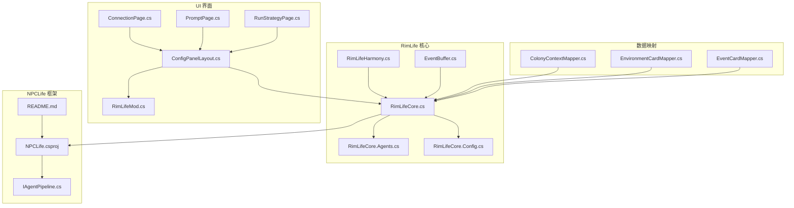
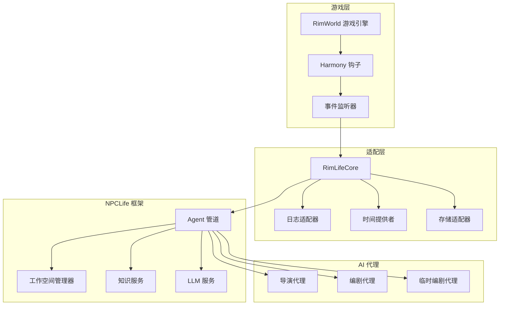
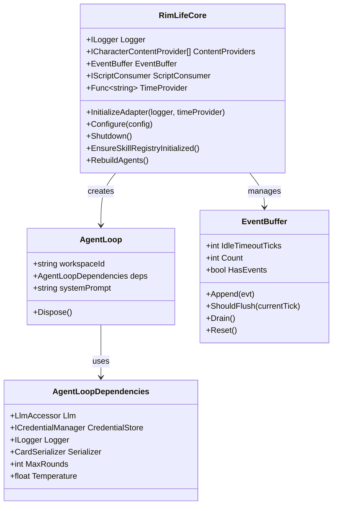
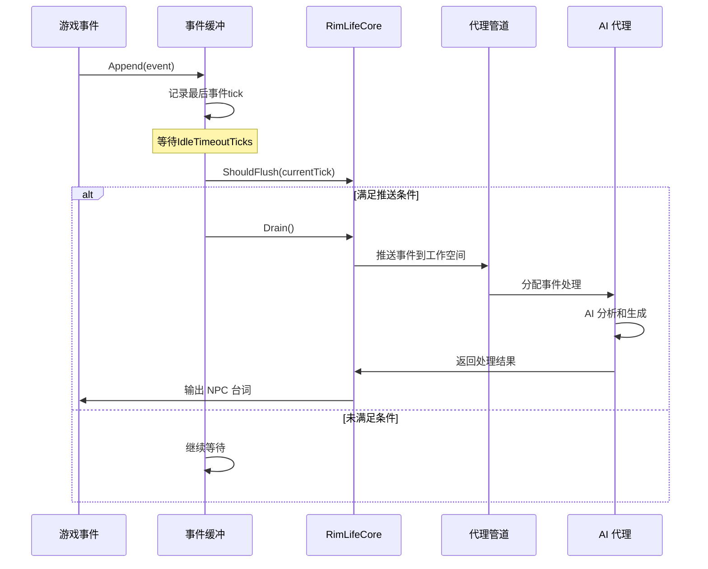
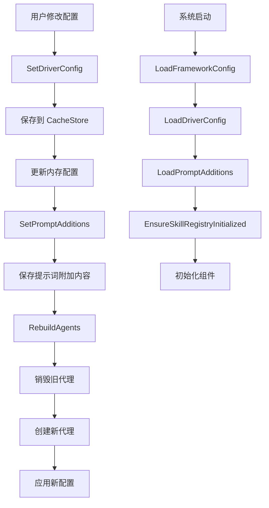
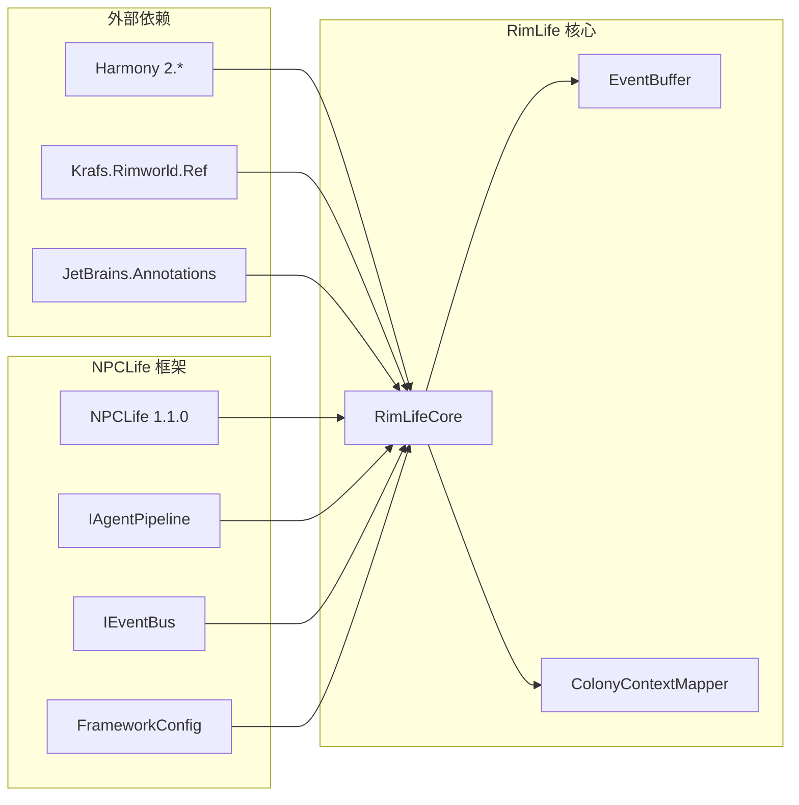

# 代理系统改进

<cite>
**本文档引用的文件**
- [RimLife.csproj](file://RimLife.csproj)
- [README.md](file://ext/NPCLife/README.md)
- [NPCLife.csproj](file://ext/NPCLife/src/NPCLife/NPCLife.csproj)
- [RimLifeCore.cs](file://Source/Infrastructure/RimLifeCore.cs)
- [RimLifeCore.Agents.cs](file://Source/Infrastructure/RimLifeCore.Agents.cs)
- [RimLifeCore.Config.cs](file://Source/Infrastructure/RimLifeCore.Config.cs)
- [RimLifeHarmony.cs](file://Source/Infrastructure/RimLifeHarmony.cs)
- [EventBuffer.cs](file://Source/Data/Events/EventBuffer.cs)
- [ConfigPanelLayout.cs](file://Source/UI/ConfigPanelLayout.cs)
- [ColonyContextMapper.cs](file://Source/Mappers/ColonyContextMapper.cs)
- [RimLifeMod.cs](file://Source/Settings/RimLifeMod.cs)
</cite>

## 目录
1. [简介](#简介)
2. [项目结构](#项目结构)
3. [核心组件](#核心组件)
4. [架构概览](#架构概览)
5. [详细组件分析](#详细组件分析)
6. [依赖关系分析](#依赖关系分析)
7. [性能考虑](#性能考虑)
8. [故障排除指南](#故障排除指南)
9. [结论](#结论)

## 简介

代理系统改进项目是对 RimLife 模组的全面升级，基于 NPCLife 框架构建了一个强大的 LLM 驱动的 NPC 剧情生成系统。该系统能够在 RimWorld 游戏环境中自动产生动态、有因果关系的叙事，为玩家提供沉浸式的角色扮演体验。

### 主要特性

- **自动剧情生成**：游戏事件触发 AI 驱动的剧情发展
- **多角色协作**：导演、编剧、临时编剧三种 AI 角色协同工作
- **工作空间管理**：支持剧情线的分支、合并和独立生命周期
- **MCP 工具协议**：集成多种游戏内查询和操作工具
- **事件缓冲机制**：优化事件处理和性能表现

## 项目结构

**图表来源**
- [RimLifeCore.cs:1-693](file://Source/Infrastructure/RimLifeCore.cs#L1-L693)
- [RimLifeHarmony.cs:1-63](file://Source/Infrastructure/RimLifeHarmony.cs#L1-L63)
- [ConfigPanelLayout.cs:1-304](file://Source/UI/ConfigPanelLayout.cs#L1-L304)

**章节来源**
- [RimLife.csproj:1-116](file://RimLife.csproj#L1-L116)
- [README.md:1-93](file://ext/NPCLife/README.md#L1-L93)

## 核心组件

### RimLifeCore 核心服务定位器

RimLifeCore 是整个系统的核心服务定位器，提供了统一的组件管理和配置入口。它负责：

- **组件生命周期管理**：协调各个子系统的初始化和销毁
- **配置管理**：处理框架配置、提示词附加内容和驱动配置
- **适配器注入**：提供日志、时间提供者等必需的适配器
- **事件缓冲**：管理游戏事件的收集和分发

### 代理管理系统

系统实现了三种角色的智能代理：

- **导演代理**：负责事件审查和工作空间路由
- **编剧代理**：生成具体的 NPC 台词和叙事内容
- **临时编剧代理**：处理一次性或临时性事件

### 事件缓冲机制

EventBuffer 实现了智能的事件收集和去抖机制：

- **空闲超时检测**：600 tick（10秒）的空闲超时
- **批量推送**：减少 API 调用频率和成本
- **事件合并**：将相关的事件合并处理

**章节来源**
- [RimLifeCore.cs:32-245](file://Source/Infrastructure/RimLifeCore.cs#L32-L245)
- [RimLifeCore.Agents.cs:16-144](file://Source/Infrastructure/RimLifeCore.Agents.cs#L16-L144)
- [EventBuffer.cs:19-75](file://Source/Data/Events/EventBuffer.cs#L19-L75)

## 架构概览

**图表来源**
- [RimLifeCore.cs:107-132](file://Source/Infrastructure/RimLifeCore.cs#L107-L132)
- [RimLifeHarmony.cs:12-62](file://Source/Infrastructure/RimLifeHarmony.cs#L12-L62)

## 详细组件分析

### 代理系统架构

**图表来源**
- [RimLifeCore.cs:32-121](file://Source/Infrastructure/RimLifeCore.cs#L32-L121)
- [RimLifeCore.Agents.cs:29-40](file://Source/Infrastructure/RimLifeCore.Agents.cs#L29-L40)
- [EventBuffer.cs:19-75](file://Source/Data/Events/EventBuffer.cs#L19-L75)

### 事件处理流程

**图表来源**
- [EventBuffer.cs:48-65](file://Source/Data/Events/EventBuffer.cs#L48-L65)
- [RimLifeCore.cs:57-65](file://Source/Infrastructure/RimLifeCore.cs#L57-L65)

### 配置管理系统

**图表来源**
- [RimLifeCore.Config.cs:36-62](file://Source/Infrastructure/RimLifeCore.Config.cs#L36-L62)
- [RimLifeCore.Agents.cs:328-360](file://Source/Infrastructure/RimLifeCore.Agents.cs#L328-L360)

**章节来源**
- [RimLifeCore.cs:169-192](file://Source/Infrastructure/RimLifeCore.cs#L169-L192)
- [RimLifeCore.Config.cs:68-137](file://Source/Infrastructure/RimLifeCore.Config.cs#L68-L137)

### UI 配置界面

ConfigPanelLayout 提供了完整的配置管理界面：

- **三区布局**：侧栏导航 + 内容区域 + 状态栏
- **多页面管理**：连接设置、提示词配置、运行策略、知识管理
- **导入导出功能**：支持配置的 JSON 导入和导出
- **实时状态显示**：LLM 配置状态和会话信息

**章节来源**
- [ConfigPanelLayout.cs:46-66](file://Source/UI/ConfigPanelLayout.cs#L46-L66)
- [ConfigPanelLayout.cs:178-231](file://Source/UI/ConfigPanelLayout.cs#L178-L231)

## 依赖关系分析

**图表来源**
- [RimLife.csproj:50-54](file://RimLife.csproj#L50-L54)
- [NPCLife.csproj:1-38](file://ext/NPCLife/src/NPCLife/NPCLife.csproj#L1-L38)

**章节来源**
- [RimLife.csproj:44-46](file://RimLife.csproj#L44-L46)
- [RimLifeHarmony.cs:41-46](file://Source/Infrastructure/RimLifeHarmony.cs#L41-L46)

## 性能考虑

### 事件处理优化

1. **去抖机制**：通过 600 tick 的空闲超时避免频繁的 API 调用
2. **批量处理**：将相关事件合并处理，减少处理开销
3. **智能调度**：根据事件重要度和数量阈值触发 AI 处理

### 内存管理

1. **延迟初始化**：组件按需创建，避免不必要的内存占用
2. **对象池模式**：代理实例在不需要时及时释放
3. **缓存策略**：合理使用 CacheStore 减少重复计算

### 并发安全

1. **线程同步**：使用锁机制保护共享资源
2. **不可变配置**：配置冻结后避免并发修改问题
3. **异步处理**：UI 操作通过 MainThreadDispatcher 调度

## 故障排除指南

### 常见问题及解决方案

**代理无法创建**
- 检查 SaveStore 是否正确初始化
- 确认 LLM 凭证是否配置正确
- 验证工作空间管理器状态

**事件处理异常**
- 查看 EventBuffer 的计数和状态
- 检查 IdleTimeoutTicks 设置是否合理
- 确认事件缓冲是否正确刷新

**UI 配置问题**
- 验证配置导入的 JSON 格式
- 检查 ModSettings 的持久化状态
- 确认配置面板的渲染是否正常

**章节来源**
- [RimLifeCore.cs:198-245](file://Source/Infrastructure/RimLifeCore.cs#L198-L245)
- [EventBuffer.cs:67-75](file://Source/Data/Events/EventBuffer.cs#L67-L75)

## 结论

代理系统改进项目成功地将 NPCLife 框架与 RimWorld 游戏环境深度集成，创建了一个功能强大、性能优异的 LLM 驱动叙事系统。通过合理的架构设计和优化策略，系统能够在保持高性能的同时提供丰富的 AI 剧情体验。

### 主要成就

1. **模块化设计**：清晰的组件分离和职责划分
2. **性能优化**：智能的事件处理和资源管理
3. **扩展性**：灵活的 MCP 工具集成和配置管理
4. **用户体验**：直观的配置界面和状态反馈

### 未来发展方向

1. **更多 MCP 工具集成**：扩展游戏内查询和操作能力
2. **高级 AI 功能**：引入更复杂的叙事生成算法
3. **性能监控**：增强系统性能指标和诊断能力
4. **社区贡献**：开放更多扩展点供社区开发