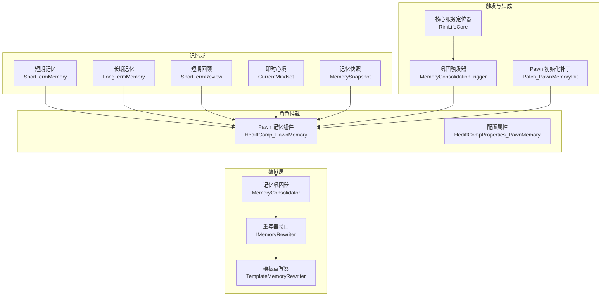
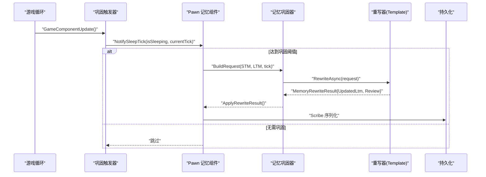
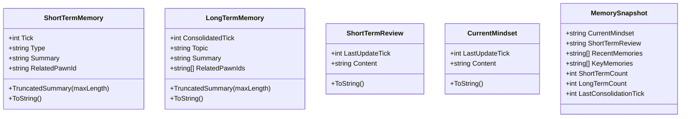
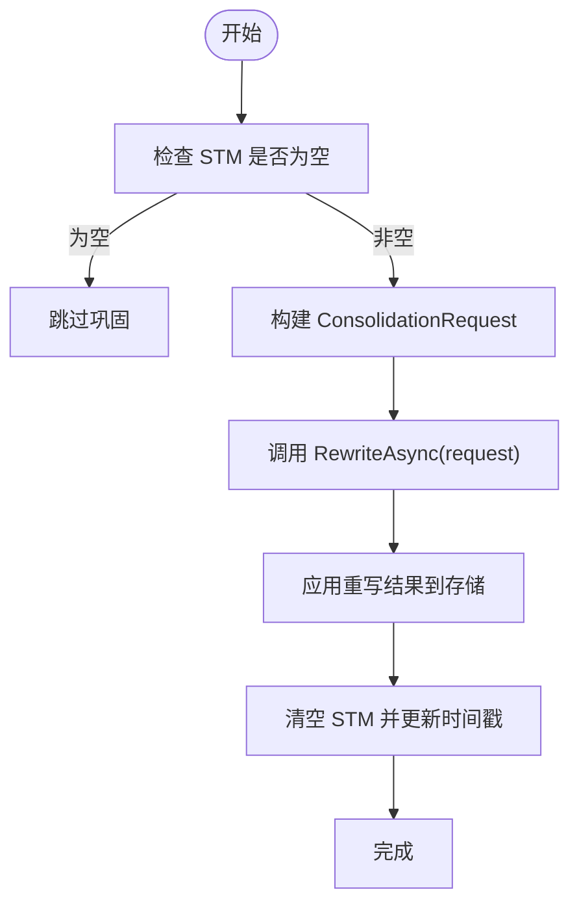
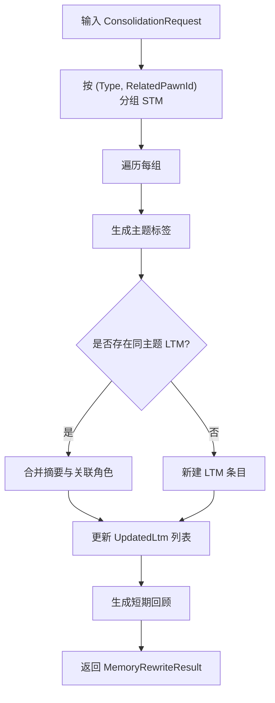
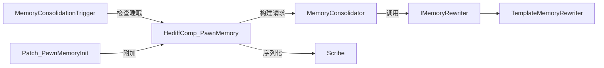

# 内存系统设计

<cite>
**本文引用的文件**
- [IMemoryRewriter.cs](file://Source/Data/PawnPro/Memory/IMemoryRewriter.cs)
- [ShortTermMemory.cs](file://Source/Data/PawnPro/Memory/ShortTermMemory.cs)
- [LongTermMemory.cs](file://Source/Data/PawnPro/Memory/LongTermMemory.cs)
- [MemoryConsolidator.cs](file://Source/Data/PawnPro/Memory/MemoryConsolidator.cs)
- [TemplateMemoryRewriter.cs](file://Source/Data/PawnPro/Memory/TemplateMemoryRewriter.cs)
- [ShortTermReview.cs](file://Source/Data/PawnPro/Memory/ShortTermReview.cs)
- [MemorySnapshot.cs](file://Source/Data/PawnPro/Memory/MemorySnapshot.cs)
- [HediffComp_PawnMemory.cs](file://Source/Data/PawnPro/Memory/HediffComp_PawnMemory.cs)
- [HediffCompProperties_PawnMemory.cs](file://Source/Data/PawnPro/Memory/HediffCompProperties_PawnMemory.cs)
- [MemoryConsolidationTrigger.cs](file://Source/Data/PawnPro/Memory/MemoryConsolidationTrigger.cs)
- [Patch_PawnMemoryInit.cs](file://Source/Data/PawnPro/Memory/Patch_PawnMemoryInit.cs)
- [CurrentMindset.cs](file://Source/Data/PawnPro/Memory/CurrentMindset.cs)
- [MemoryConsolidatorTests.cs](file://RimLife.Tests/Memory/MemoryConsolidatorTests.cs)
- [PawnMemoryDataStructureTests.cs](file://RimLife.Tests/Memory/PawnMemoryDataStructureTests.cs)
- [RimLifeCore.cs](file://Source/Infrastructure/RimLifeCore.cs)
</cite>

## 目录
1. [引言](#引言)
2. [项目结构](#项目结构)
3. [核心组件](#核心组件)
4. [架构总览](#架构总览)
5. [详细组件分析](#详细组件分析)
6. [依赖关系分析](#依赖关系分析)
7. [性能考量](#性能考量)
8. [故障排查指南](#故障排查指南)
9. [结论](#结论)
10. [附录](#附录)

## 引言
本文件面向 RimLife 的角色记忆系统，围绕基于 RimWorld 事件的记忆架构进行系统化技术文档化。重点涵盖短期记忆与长期记忆的数据结构与实现差异、记忆巩固器的两阶段巩固流程、TemplateMemoryRewriter 的模板重写机制、持久化与序列化/反序列化、记忆查询接口与检索算法、与角色代理的集成与一致性保障，以及扩展点与自定义重写器的开发指南。

## 项目结构
记忆系统位于 Source/Data/PawnPro/ 内部，采用“领域对象 + 组件 + 触发器 + 补丁”的分层组织：
- 数据模型：ShortTermMemory、LongTermMemory、ShortTermReview、CurrentMindset、MemorySnapshot
- 核心编排：MemoryConsolidator、IMemoryRewriter、TemplateMemoryRewriter
- 角色挂载：HediffComp_PawnMemory（作为隐藏 Hediff 挂在每个 Pawn 上）
- 触发机制：MemoryConsolidationTrigger（GameComponent 周期性检查睡眠状态）
- 初始化补丁：Patch_PawnMemoryInit（Pawn.SpawnSetup 时自动附加记忆 Hediff）

图表来源
- [HediffComp_PawnMemory.cs:20-408](file://Source/Data/PawnPro/Memory/HediffComp_PawnMemory.cs#L20-L408)
- [MemoryConsolidator.cs:12-61](file://Source/Data/PawnPro/Memory/MemoryConsolidator.cs#L12-L61)
- [TemplateMemoryRewriter.cs:13-152](file://Source/Data/PawnPro/Memory/TemplateMemoryRewriter.cs#L13-L152)
- [MemoryConsolidationTrigger.cs:15-79](file://Source/Data/PawnPro/Memory/MemoryConsolidationTrigger.cs#L15-L79)
- [Patch_PawnMemoryInit.cs:12-38](file://Source/Data/PawnPro/Memory/Patch_PawnMemoryInit.cs#L12-L38)
- [RimLifeCore.cs:24-1095](file://Source/Infrastructure/RimLifeCore.cs#L24-L1095)

章节来源
- [HediffComp_PawnMemory.cs:20-408](file://Source/Data/PawnPro/Memory/HediffComp_PawnMemory.cs#L20-L408)
- [MemoryConsolidator.cs:12-61](file://Source/Data/PawnPro/Memory/MemoryConsolidator.cs#L12-L61)
- [TemplateMemoryRewriter.cs:13-152](file://Source/Data/PawnPro/Memory/TemplateMemoryRewriter.cs#L13-L152)
- [MemoryConsolidationTrigger.cs:15-79](file://Source/Data/PawnPro/Memory/MemoryConsolidationTrigger.cs#L15-L79)
- [Patch_PawnMemoryInit.cs:12-38](file://Source/Data/PawnPro/Memory/Patch_PawnMemoryInit.cs#L12-L38)
- [RimLifeCore.cs:24-1095](file://Source/Infrastructure/RimLifeCore.cs#L24-L1095)

## 核心组件
- 短期记忆 STM：纯 DTO，记录近期内发生的事件流水，具备时间戳、类型、摘要与关联角色，序列化由组件处理。
- 长期记忆 LTM：纯 DTO，记录经 LLM 或模板重写后的叙述性记忆，包含主题标签、摘要与关联角色集合。
- 短期回顾 REV：LLM 对近期 STM 的客观摘要，严格限制字数。
- 即时心境 MS：第一人称心理状态描述，优先级高于所有记忆区，由 LLM 主动写入。
- 记忆快照 SNAP：面向消费者（CharacterCard/AI prompt）的只读视图，按层级优先读取。
- 记忆巩固器 CONS：两阶段流程（同步构建请求 + 异步重写），默认使用模板重写器。
- 重写器接口 REWR：抽象出 RewriteAsync，支持模板或 LLM 实现。
- 模板重写器 TMR：无 LLM 降级方案，按类型+关联角色分组，合并旧 LTM 与新 STM。
- 组件 COMP：承载四区数据，负责序列化、触发巩固、应用重写结果、查询与快照。
- 触发器 TRIG：周期性检查睡眠状态，满足阈值时触发巩固。
- 补丁 PATCH：Pawn spawn 时自动附加记忆 Hediff。

章节来源
- [ShortTermMemory.cs:9-48](file://Source/Data/PawnPro/Memory/ShortTermMemory.cs#L9-L48)
- [LongTermMemory.cs:10-53](file://Source/Data/PawnPro/Memory/LongTermMemory.cs#L10-L53)
- [ShortTermReview.cs:8-32](file://Source/Data/PawnPro/Memory/ShortTermReview.cs#L8-L32)
- [CurrentMindset.cs:10-34](file://Source/Data/PawnPro/Memory/CurrentMindset.cs#L10-L34)
- [MemorySnapshot.cs:12-36](file://Source/Data/PawnPro/Memory/MemorySnapshot.cs#L12-L36)
- [IMemoryRewriter.cs:11-54](file://Source/Data/PawnPro/Memory/IMemoryRewriter.cs#L11-L54)
- [MemoryConsolidator.cs:12-61](file://Source/Data/PawnPro/Memory/MemoryConsolidator.cs#L12-L61)
- [TemplateMemoryRewriter.cs:13-152](file://Source/Data/PawnPro/Memory/TemplateMemoryRewriter.cs#L13-L152)
- [HediffComp_PawnMemory.cs:20-408](file://Source/Data/PawnPro/Memory/HediffComp_PawnMemory.cs#L20-L408)
- [MemoryConsolidationTrigger.cs:15-79](file://Source/Data/PawnPro/Memory/MemoryConsolidationTrigger.cs#L15-L79)
- [Patch_PawnMemoryInit.cs:12-38](file://Source/Data/PawnPro/Memory/Patch_PawnMemoryInit.cs#L12-L38)

## 架构总览
记忆系统围绕“事件驱动 + 两阶段巩固 + 模板/LLM 重写”的主干流程展开。事件以 STM 形式进入短期记忆，周期性触发巩固，模板重写器将 STM 与现有 LTM 按主题合并，生成新的 LTM 列表与短期回顾，并清空 STM。消费者通过 MemorySnapshot 获取优先级视图，即时心境优先于所有记忆区。

图表来源
- [MemoryConsolidationTrigger.cs:28-70](file://Source/Data/PawnPro/Memory/MemoryConsolidationTrigger.cs#L28-L70)
- [HediffComp_PawnMemory.cs:232-328](file://Source/Data/PawnPro/Memory/HediffComp_PawnMemory.cs#L232-L328)
- [MemoryConsolidator.cs:28-58](file://Source/Data/PawnPro/Memory/MemoryConsolidator.cs#L28-L58)
- [TemplateMemoryRewriter.cs:15-70](file://Source/Data/PawnPro/Memory/TemplateMemoryRewriter.cs#L15-L70)
- [HediffComp_PawnMemory.cs:50-176](file://Source/Data/PawnPro/Memory/HediffComp_PawnMemory.cs#L50-L176)

## 详细组件分析

### 数据模型与差异
- 短期记忆 STM
  - 字段：时间戳、类型、摘要、关联角色
  - 特性：自然上限通过巩固清空，时间窗口 ≤ 24h；摘要截断用于控制 prompt token
- 长期记忆 LTM
  - 字段：最后重写时间、主题标签、摘要、关联角色集合
  - 特性：重要度通过篇幅自然体现，无需显式打分字段
- 短期回顾 REV
  - 字段：最后更新时间、内容
  - 特性：严格限制字数，用于客观摘要
- 即时心境 MS
  - 字段：最后更新时间、内容
  - 特性：优先级最高，由 LLM 主动写入

图表来源
- [ShortTermMemory.cs:9-48](file://Source/Data/PawnPro/Memory/ShortTermMemory.cs#L9-L48)
- [LongTermMemory.cs:10-53](file://Source/Data/PawnPro/Memory/LongTermMemory.cs#L10-L53)
- [ShortTermReview.cs:8-32](file://Source/Data/PawnPro/Memory/ShortTermReview.cs#L8-L32)
- [CurrentMindset.cs:10-34](file://Source/Data/PawnPro/Memory/CurrentMindset.cs#L10-L34)
- [MemorySnapshot.cs:12-36](file://Source/Data/PawnPro/Memory/MemorySnapshot.cs#L12-L36)

章节来源
- [ShortTermMemory.cs:9-48](file://Source/Data/PawnPro/Memory/ShortTermMemory.cs#L9-L48)
- [LongTermMemory.cs:10-53](file://Source/Data/PawnPro/Memory/LongTermMemory.cs#L10-L53)
- [ShortTermReview.cs:8-32](file://Source/Data/PawnPro/Memory/ShortTermReview.cs#L8-L32)
- [CurrentMindset.cs:10-34](file://Source/Data/PawnPro/Memory/CurrentMindset.cs#L10-L34)
- [MemorySnapshot.cs:12-36](file://Source/Data/PawnPro/Memory/MemorySnapshot.cs#L12-L36)

### MemoryConsolidator 两阶段巩固
- 阶段一（同步）：构建 ConsolidationRequest，打包当前 STM、既有 LTM、Pawn 名称与上下文、当前 tick
- 阶段二（异步）：调用 IMemoryRewriter.RewriteAsync，完成后在主线程回写结果
- 默认重写器：TemplateMemoryRewriter（可替换为 LLM 实现）

图表来源
- [MemoryConsolidator.cs:28-58](file://Source/Data/PawnPro/Memory/MemoryConsolidator.cs#L28-L58)
- [HediffComp_PawnMemory.cs:244-301](file://Source/Data/PawnPro/Memory/HediffComp_PawnMemory.cs#L244-L301)

章节来源
- [MemoryConsolidator.cs:12-61](file://Source/Data/PawnPro/Memory/MemoryConsolidator.cs#L12-L61)
- [HediffComp_PawnMemory.cs:232-301](file://Source/Data/PawnPro/Memory/HediffComp_PawnMemory.cs#L232-L301)

### TemplateMemoryRewriter 模板重写机制
- 分组策略：按 (Type, RelatedPawnId) 分组 STM，生成主题标签
- 合并策略：若存在相同主题的旧 LTM，则合并摘要与关联角色；否则新增 LTM 条目
- 短期回顾：对最近若干 STM 做客观摘要，限制字数
- 截断规则：LTM 摘要 ≤ 500 字，REV ≤ 300 字，STM 摘要 ≤ 200 字

图表来源
- [TemplateMemoryRewriter.cs:15-70](file://Source/Data/PawnPro/Memory/TemplateMemoryRewriter.cs#L15-L70)
- [TemplateMemoryRewriter.cs:75-149](file://Source/Data/PawnPro/Memory/TemplateMemoryRewriter.cs#L75-L149)

章节来源
- [TemplateMemoryRewriter.cs:13-152](file://Source/Data/PawnPro/Memory/TemplateMemoryRewriter.cs#L13-L152)

### 持久化、序列化与反序列化
- 使用 RimWorld Scribe 自动序列化四区数据：STM 列表、LTM 列表、短期回顾、即时心境
- 关键点：
  - STM：保存数量与逐项字段（tick、type、summary、related）
  - LTM：保存数量、逐项字段与关联角色列表（以特殊分隔符拼接/拆分）
  - Review/Mindset：保存时间戳与内容
- 触发时机：保存存档时由 Scribe 自动调用；加载时恢复

章节来源
- [HediffComp_PawnMemory.cs:50-176](file://Source/Data/PawnPro/Memory/HediffComp_PawnMemory.cs#L50-L176)

### 记忆查询接口与检索算法
- 按主题标签筛选：QueryByTopic
- 按关联角色筛选：QueryByRelatedPawn
- 获取最近 STM：GetRecentMemories（按 Tick 降序取前 N）
- 获取关键 LTM：GetKeyMemories（按 ConsolidatedTick 降序取前 N）
- 快照生成：CreateSnapshot，按层级优先读取（Mindset → Review → STM/LTM 摘要）

章节来源
- [HediffComp_PawnMemory.cs:337-398](file://Source/Data/PawnPro/Memory/HediffComp_PawnMemory.cs#L337-L398)

### 与角色代理的集成与一致性
- 角色挂载：Pawn spawn 时自动附加记忆 Hediff（隐藏）
- 触发机制：GameComponent 周期性检查睡眠状态，达到阈值触发巩固
- 一致性保障：
  - 异步重写在主线程回写，避免并发冲突
  - 防重入标志防止并发巩固
  - 24h 强制触发与睡眠阈值双重保障
  - 即时心境优先级最高，覆盖下层记忆

章节来源
- [Patch_PawnMemoryInit.cs:15-35](file://Source/Data/PawnPro/Memory/Patch_PawnMemoryInit.cs#L15-L35)
- [MemoryConsolidationTrigger.cs:28-70](file://Source/Data/PawnPro/Memory/MemoryConsolidationTrigger.cs#L28-L70)
- [HediffComp_PawnMemory.cs:232-328](file://Source/Data/PawnPro/Memory/HediffComp_PawnMemory.cs#L232-L328)

### 扩展点与自定义重写器开发指南
- 实现 IMemoryRewriter 接口，提供 RewriteAsync(request) 的 LLM 或高级模板实现
- 替换默认重写器：MemoryConsolidator.Rewriter = new YourRewriter()
- 注意事项：
  - 输入 ConsolidationRequest 包含新 STM 与既有 LTM，输出 MemoryRewriteResult 包含 UpdatedLtm 与 Review
  - 控制摘要长度，遵循 LTM(500)、REV(300)、STM(200) 的截断策略
  - 保持幂等与可重复性，避免重复合并

章节来源
- [IMemoryRewriter.cs:11-54](file://Source/Data/PawnPro/Memory/IMemoryRewriter.cs#L11-L54)
- [MemoryConsolidator.cs:17](file://Source/Data/PawnPro/Memory/MemoryConsolidator.cs#L17)

## 依赖关系分析
- 组件耦合
  - HediffComp_PawnMemory 依赖 MemoryConsolidator 与 Scribe
  - MemoryConsolidator 依赖 IMemoryRewriter，默认依赖 TemplateMemoryRewriter
  - MemoryConsolidationTrigger 依赖 GameComponent 与 Pawn 集合
  - Patch_PawnMemoryInit 依赖 Harmony 与 DefDatabase
- 外部依赖
  - RimWorld API（Hediff、Scribe、TickManager、Maps、Pawns）
  - NPCLife 框架（用于 MCP 工具与工作空间集成）

图表来源
- [MemoryConsolidationTrigger.cs:43-70](file://Source/Data/PawnPro/Memory/MemoryConsolidationTrigger.cs#L43-L70)
- [Patch_PawnMemoryInit.cs:15-35](file://Source/Data/PawnPro/Memory/Patch_PawnMemoryInit.cs#L15-L35)
- [HediffComp_PawnMemory.cs:244-301](file://Source/Data/PawnPro/Memory/HediffComp_PawnMemory.cs#L244-L301)
- [MemoryConsolidator.cs:28-58](file://Source/Data/PawnPro/Memory/MemoryConsolidator.cs#L28-L58)
- [TemplateMemoryRewriter.cs:15-70](file://Source/Data/PawnPro/Memory/TemplateMemoryRewriter.cs#L15-L70)

章节来源
- [MemoryConsolidationTrigger.cs:15-79](file://Source/Data/PawnPro/Memory/MemoryConsolidationTrigger.cs#L15-L79)
- [Patch_PawnMemoryInit.cs:12-38](file://Source/Data/PawnPro/Memory/Patch_PawnMemoryInit.cs#L12-L38)
- [HediffComp_PawnMemory.cs:20-408](file://Source/Data/PawnPro/Memory/HediffComp_PawnMemory.cs#L20-L408)
- [MemoryConsolidator.cs:12-61](file://Source/Data/PawnPro/Memory/MemoryConsolidator.cs#L12-L61)
- [TemplateMemoryRewriter.cs:13-152](file://Source/Data/PawnPro/Memory/TemplateMemoryRewriter.cs#L13-L152)

## 性能考量
- 时间窗口与上限
  - STM 自然上限：巩固后清空，时间窗口 ≤ 24h
  - 截断策略：LTM(500)、REV(300)、STM(200)，降低 prompt token 消耗
- 触发频率
  - 检查间隔：约 1 游戏小时（250 ticks），平衡性能与及时性
  - 强制触发：24h（60000 ticks），睡眠阈值：3h（7500 ticks）
- 异步与回写
  - 重写异步执行，主线程回写，避免 UI 卡顿
  - 防重入标志避免并发巩固
- 查询复杂度
  - 按主题/角色筛选为 O(n) 线性扫描，建议配合索引字段（当前为字符串匹配）
- 序列化成本
  - Scribe 逐项保存/恢复，注意字段数量与字符串长度

[本节为通用性能讨论，不直接分析具体文件]

## 故障排查指南
- 巩固未触发
  - 检查 STM 是否为空、距离上次巩固是否小于阈值、睡眠阈值是否满足
  - 确认 MemoryConsolidationTrigger 是否正常运行
- 重写失败
  - 查看日志警告信息，确认重写器实现正确
  - 检查 ConsolidationRequest 参数（PawnName、NewEvents、ExistingLtm、CurrentTick）
- 序列化异常
  - 确认 Scribe 分支逻辑与字段名称一致
  - 关注关联角色列表的分隔符处理
- 快照为空
  - 检查 Mindset/Review/STM/LTM 是否存在
  - 确认消费者是否按层级优先读取

章节来源
- [HediffComp_PawnMemory.cs:264-278](file://Source/Data/PawnPro/Memory/HediffComp_PawnMemory.cs#L264-L278)
- [MemoryConsolidationTrigger.cs:28-70](file://Source/Data/PawnPro/Memory/MemoryConsolidationTrigger.cs#L28-L70)
- [MemoryConsolidatorTests.cs:14-188](file://RimLife.Tests/Memory/MemoryConsolidatorTests.cs#L14-L188)
- [PawnMemoryDataStructureTests.cs:17-192](file://RimLife.Tests/Memory/PawnMemoryDataStructureTests.cs#L17-L192)

## 结论
RimLife 的记忆系统以事件驱动为核心，通过两阶段巩固将 STM 融合进 LTM，并提供模板与 LLM 两种重写路径。系统以 DTO 为中心，结合 Scribe 自动序列化与 GameComponent 触发机制，实现了稳定、可扩展且可测试的记忆架构。通过明确的查询接口与快照层级，消费者可高效获取所需信息；通过可插拔的重写器，系统支持进一步的智能化升级。

[本节为总结性内容，不直接分析具体文件]

## 附录
- 测试覆盖
  - MemoryConsolidatorTests：验证 BuildRequest 与 Template 重写行为
  - PawnMemoryDataStructureTests：验证数据结构构造、截断与属性访问
- 相关集成
  - RimLifeCore：提供 MCP 工具注册与工作空间集成，PawnMemoryProvider 作为 Hook 提供者之一

章节来源
- [MemoryConsolidatorTests.cs:14-188](file://RimLife.Tests/Memory/MemoryConsolidatorTests.cs#L14-L188)
- [PawnMemoryDataStructureTests.cs:17-192](file://RimLife.Tests/Memory/PawnMemoryDataStructureTests.cs#L17-L192)
- [RimLifeCore.cs:215](file://Source/Infrastructure/RimLifeCore.cs#L215)