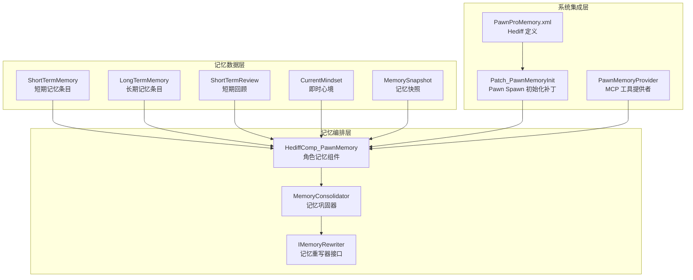
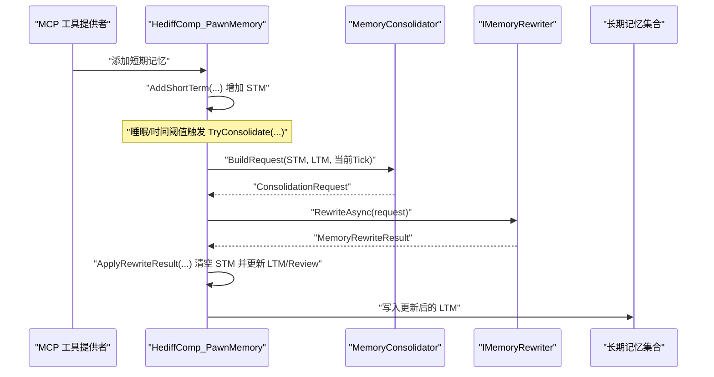
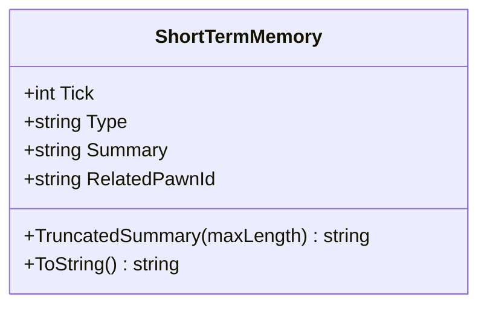
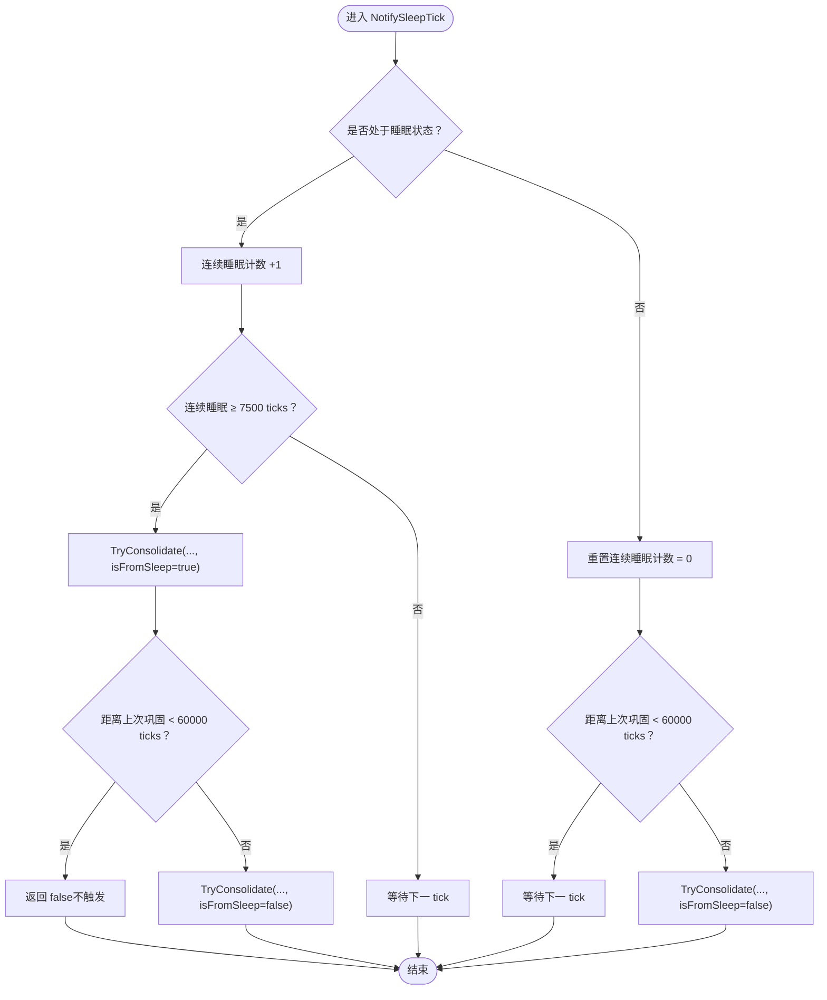
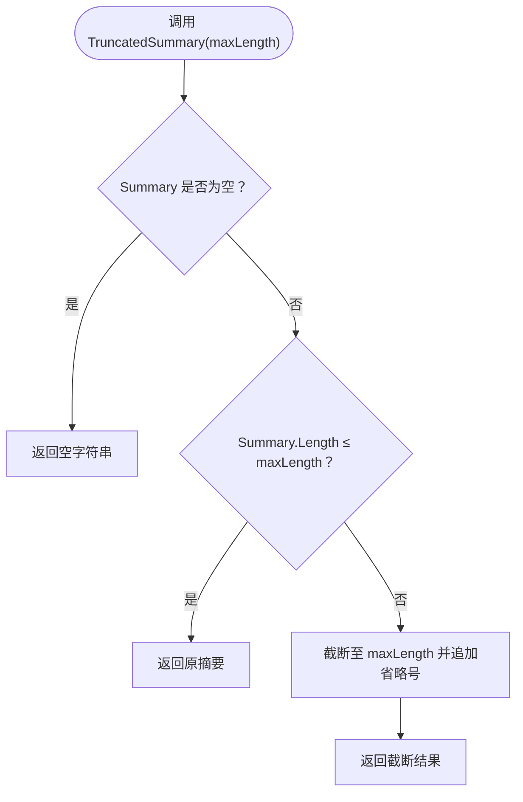
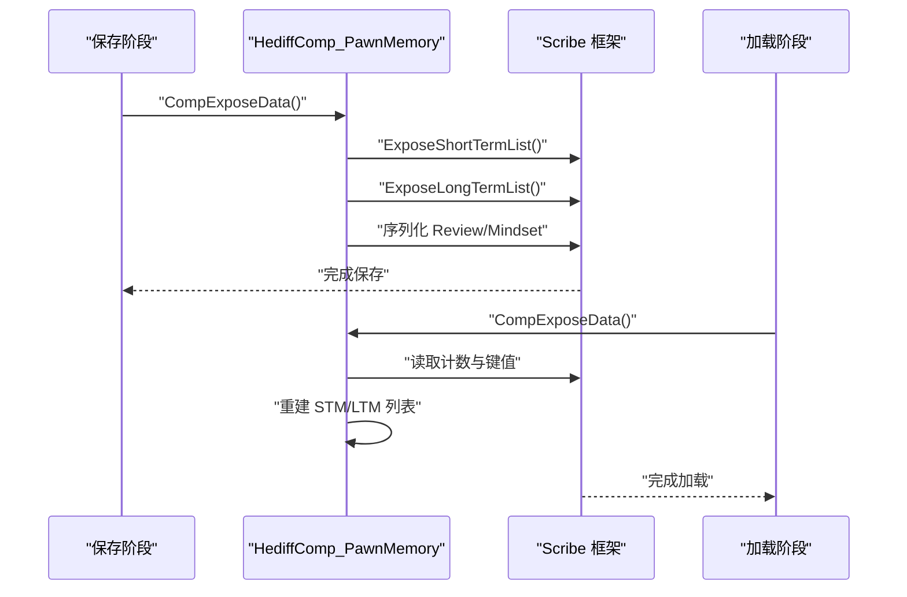
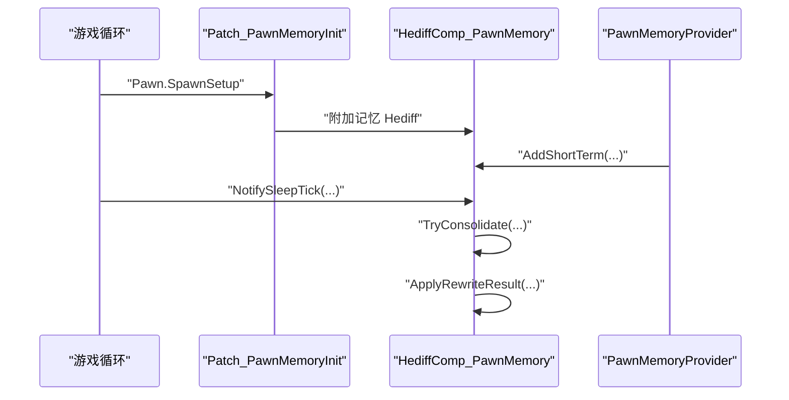
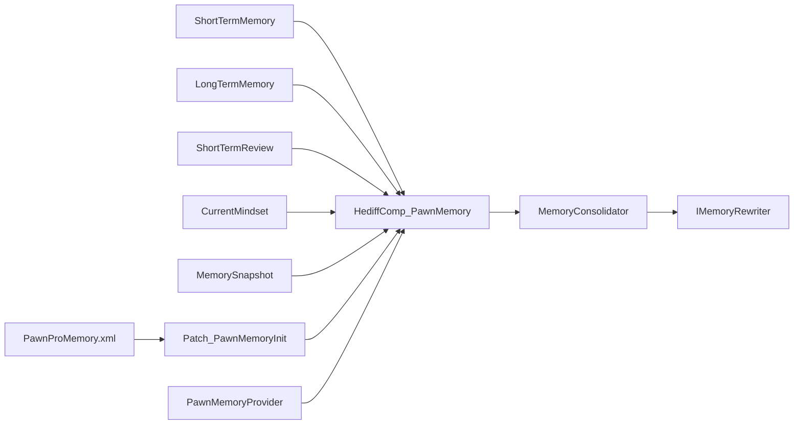

# 短期记忆实现

<cite>
**本文引用的文件**
- [ShortTermMemory.cs](file://Source/Data/PawnPro/Memory/ShortTermMemory.cs)
- [HediffComp_PawnMemory.cs](file://Source/Data/PawnPro/Memory/HediffComp_PawnMemory.cs)
- [MemoryConsolidator.cs](file://Source/Data/PawnPro/Memory/MemoryConsolidator.cs)
- [LongTermMemory.cs](file://Source/Data/PawnPro/Memory/LongTermMemory.cs)
- [IMemoryRewriter.cs](file://Source/Data/PawnPro/Memory/IMemoryRewriter.cs)
- [ShortTermReview.cs](file://Source/Data/PawnPro/Memory/ShortTermReview.cs)
- [CurrentMindset.cs](file://Source/Data/PawnPro/Memory/CurrentMindset.cs)
- [MemorySnapshot.cs](file://Source/Data/PawnPro/Memory/MemorySnapshot.cs)
- [Patch_PawnMemoryInit.cs](file://Source/Data/PawnPro/Memory/Patch_PawnMemoryInit.cs)
- [PawnMemoryProvider.cs](file://Source/Infrastructure/Mcp/PawnMemoryProvider.cs)
- [PawnProMemory.xml](file://Defs/Core/PawnProMemory.xml)
- [PawnMemoryDataStructureTests.cs](file://RimLife.Tests/Memory/PawnMemoryDataStructureTests.cs)
</cite>

## 目录
1. [简介](#简介)
2. [项目结构](#项目结构)
3. [核心组件](#核心组件)
4. [架构总览](#架构总览)
5. [详细组件分析](#详细组件分析)
6. [依赖关系分析](#依赖关系分析)
7. [性能考量](#性能考量)
8. [故障排查指南](#故障排查指南)
9. [结论](#结论)
10. [附录](#附录)

## 简介
本文件面向短期记忆实现（ShortTermMemory）的技术文档，围绕其数据结构设计、生命周期管理、摘要截断算法、序列化与反序列化、与记忆整合器（MemoryConsolidator）及角色记忆组件（HediffComp_PawnMemory）的集成方式进行系统化阐述。短期记忆作为纯 DTO（数据传输对象），具备零外部依赖、轻量、可序列化的特性，并通过“自然上限”和“时间窗口 ≤24小时”的机制避免无限膨胀；其摘要截断方法（TruncatedSummary）用于在注入提示词时控制 token 消耗，确保 LLM 输入规模可控。

## 项目结构
短期记忆相关代码位于 Source/Data/PawnPro/Memory 目录，配合基础设施层的 MCP 工具与补丁机制，形成从事件采集、记忆巩固到序列化的完整闭环。

图表来源
- [ShortTermMemory.cs:1-48](file://Source/Data/PawnPro/Memory/ShortTermMemory.cs#L1-L48)
- [HediffComp_PawnMemory.cs:1-408](file://Source/Data/PawnPro/Memory/HediffComp_PawnMemory.cs#L1-L408)
- [MemoryConsolidator.cs:1-61](file://Source/Data/PawnPro/Memory/MemoryConsolidator.cs#L1-L61)
- [IMemoryRewriter.cs:1-54](file://Source/Data/PawnPro/Memory/IMemoryRewriter.cs#L1-L54)
- [PawnProMemory.xml:1-23](file://Defs/Core/PawnProMemory.xml#L1-L23)
- [Patch_PawnMemoryInit.cs:1-38](file://Source/Data/PawnPro/Memory/Patch_PawnMemoryInit.cs#L1-L38)
- [PawnMemoryProvider.cs:1-94](file://Source/Infrastructure/Mcp/PawnMemoryProvider.cs#L1-L94)

章节来源
- [ShortTermMemory.cs:1-48](file://Source/Data/PawnPro/Memory/ShortTermMemory.cs#L1-L48)
- [HediffComp_PawnMemory.cs:1-408](file://Source/Data/PawnPro/Memory/HediffComp_PawnMemory.cs#L1-L408)
- [PawnProMemory.xml:1-23](file://Defs/Core/PawnProMemory.xml#L1-L23)

## 核心组件
- ShortTermMemory：短期记忆条目，包含时间戳、类型标签、摘要与关联角色标识符，提供摘要截断能力。
- HediffComp_PawnMemory：挂载于每个角色的隐藏 Hediff 组件，负责短期记忆的增删改查、序列化、巩固触发与结果应用。
- MemoryConsolidator：两阶段巩固流程的编排器，负责构建请求与异步调用重写器。
- IMemoryRewriter 及其实现：定义重写器接口与请求/结果模型，支持模板与 LLM 两种重写路径。
- ShortTermReview、CurrentMindset、MemorySnapshot：短期回顾、即时心境与记忆快照，分别承担客观摘要、第一人称心理状态与只读视图输出。
- Patch_PawnMemoryInit：Pawn Spawn 时自动附加记忆 Hediff 的补丁。
- PawnMemoryProvider：MCP 工具提供者，暴露“添加短期记忆”和“更新即时心境”的工具。

章节来源
- [ShortTermMemory.cs:9-46](file://Source/Data/PawnPro/Memory/ShortTermMemory.cs#L9-L46)
- [HediffComp_PawnMemory.cs:20-406](file://Source/Data/PawnPro/Memory/HediffComp_PawnMemory.cs#L20-L406)
- [MemoryConsolidator.cs:12-61](file://Source/Data/PawnPro/Memory/MemoryConsolidator.cs#L12-L61)
- [IMemoryRewriter.cs:11-54](file://Source/Data/PawnPro/Memory/IMemoryRewriter.cs#L11-L54)
- [ShortTermReview.cs:8-31](file://Source/Data/PawnPro/Memory/ShortTermReview.cs#L8-L31)
- [CurrentMindset.cs:10-34](file://Source/Data/PawnPro/Memory/CurrentMindset.cs#L10-L34)
- [MemorySnapshot.cs:12-36](file://Source/Data/PawnPro/Memory/MemorySnapshot.cs#L12-L36)
- [Patch_PawnMemoryInit.cs:12-38](file://Source/Data/PawnPro/Memory/Patch_PawnMemoryInit.cs#L12-L38)
- [PawnMemoryProvider.cs:14-94](file://Source/Infrastructure/Mcp/PawnMemoryProvider.cs#L14-L94)

## 架构总览
短期记忆的生命周期与数据流如下：
- 事件采集：通过 MCP 工具或内部逻辑向角色追加短期记忆。
- 记忆存储：短期记忆保存在角色记忆组件的列表中。
- 触发巩固：基于睡眠与时间阈值（24小时强制触发）决定是否发起巩固。
- 重写与合并：MemoryConsolidator 构建请求并异步调用重写器，生成新的长期记忆与短期回顾。
- 结果应用：在主线程回写，清空短期记忆并更新相关计数与时间戳。
- 序列化：使用 Scribe 自动序列化短期/长期记忆、短期回顾与即时心境。

图表来源
- [PawnMemoryProvider.cs:29-61](file://Source/Infrastructure/Mcp/PawnMemoryProvider.cs#L29-L61)
- [HediffComp_PawnMemory.cs:232-301](file://Source/Data/PawnPro/Memory/HediffComp_PawnMemory.cs#L232-L301)
- [MemoryConsolidator.cs:28-58](file://Source/Data/PawnPro/Memory/MemoryConsolidator.cs#L28-L58)
- [IMemoryRewriter.cs:45-52](file://Source/Data/PawnPro/Memory/IMemoryRewriter.cs#L45-L52)

## 详细组件分析

### ShortTermMemory 数据结构与职责
- 字段与含义
  - Tick：事件发生时刻（游戏 tick），用于排序与时间窗口判定。
  - Type：类型标签，支持 Interaction、Event、Combat、Observation、Milestone 等，未提供时默认为 Observation。
  - Summary：简短摘要，建议 ≤200 字，用于注入提示词时的 token 控制。
  - RelatedPawnId：关联角色 ThingID（可选），用于后续查询与主题聚合。
- 设计理念
  - 纯 DTO：无外部依赖，便于序列化与跨模块传递。
  - 轻量存储：仅承载原始事件流水，不携带重要度等上层语义。
- 截断算法
  - TruncatedSummary(maxLength)：当摘要为空返回空字符串；否则若长度不超过阈值直接返回，否则截断至 maxLength 并追加省略号。
  - 该方法在获取近期记忆摘要、记忆快照生成等场景中被广泛使用，确保输入长度可控。

图表来源
- [ShortTermMemory.cs:9-46](file://Source/Data/PawnPro/Memory/ShortTermMemory.cs#L9-L46)

章节来源
- [ShortTermMemory.cs:11-40](file://Source/Data/PawnPro/Memory/ShortTermMemory.cs#L11-L40)
- [PawnMemoryDataStructureTests.cs:17-74](file://RimLife.Tests/Memory/PawnMemoryDataStructureTests.cs#L17-L74)

### 生命周期管理与自然上限机制
- 自然上限
  - 短期记忆在每次巩固后被清空，避免无限增长。
  - 通过 MemoryConsolidator 的重写结果应用阶段完成清空。
- 时间窗口限制
  - 强制触发：每 60000 ticks（约 24 小时）强制触发一次巩固。
  - 睡眠触发：累计连续睡眠达到 7500 ticks（约 3 小时）时触发巩固。
  - 以上阈值在角色记忆组件中以常量形式定义，并在每 tick 的睡眠状态通知中进行判定。
- 自动清理策略
  - 巩固成功后清空短期记忆列表，重置连续睡眠计数，更新最后巩固 tick。
  - 通过主线程回写确保线程安全与一致性。

图表来源
- [HediffComp_PawnMemory.cs:307-328](file://Source/Data/PawnPro/Memory/HediffComp_PawnMemory.cs#L307-L328)

章节来源
- [HediffComp_PawnMemory.cs:22-26](file://Source/Data/PawnPro/Memory/HediffComp_PawnMemory.cs#L22-L26)
- [HediffComp_PawnMemory.cs:232-301](file://Source/Data/PawnPro/Memory/HediffComp_PawnMemory.cs#L232-L301)
- [HediffComp_PawnMemory.cs:307-328](file://Source/Data/PawnPro/Memory/HediffComp_PawnMemory.cs#L307-L328)

### TruncatedSummary 摘要截断算法与 token 控制
- 算法要点
  - 空摘要返回空字符串，避免无效输出。
  - 若长度小于等于阈值，直接返回原文。
  - 否则截断至 maxLength，并追加省略号，保证输出长度为 maxLength+1。
- 使用场景
  - 获取近期记忆摘要（默认截断至 120 字）。
  - 获取关键长期记忆摘要（默认截断至 300 字）。
  - 记忆快照生成时统一控制长度，降低 LLM 输入 token 开销。
- 测试验证
  - 单元测试覆盖了“不超过限制”、“超过限制”、“默认类型处理”等边界条件。

图表来源
- [ShortTermMemory.cs:36-40](file://Source/Data/PawnPro/Memory/ShortTermMemory.cs#L36-L40)
- [LongTermMemory.cs:41-45](file://Source/Data/PawnPro/Memory/LongTermMemory.cs#L41-L45)

章节来源
- [ShortTermMemory.cs:36-40](file://Source/Data/PawnPro/Memory/ShortTermMemory.cs#L36-L40)
- [LongTermMemory.cs:41-45](file://Source/Data/PawnPro/Memory/LongTermMemory.cs#L41-L45)
- [PawnMemoryDataStructureTests.cs:40-56](file://RimLife.Tests/Memory/PawnMemoryDataStructureTests.cs#L40-L56)

### 序列化与反序列化实现
- 序列化策略
  - 使用 RimWorld 的 Scribe 框架，HediffComp_PawnMemory 在 CompExposeData 中统一处理短期/长期记忆、短期回顾与即时心境的序列化。
  - 短期记忆列表采用“计数 + 逐项键值”的方式保存，键名包含索引，加载时重建列表。
  - 长期记忆列表保存主题、摘要与关联角色 ID（以特殊分隔符连接，加载时拆分）。
- 反序列化策略
  - 加载时根据键名恢复 Tick、Type、Summary、RelatedPawnId 等字段。
  - 对于空内容进行容错处理，避免异常。
- 与记忆快照的关系
  - MemorySnapshot 是只读视图，不参与持久化，但其字段来源于短期/长期记忆与短期回顾的摘要截断结果。

图表来源
- [HediffComp_PawnMemory.cs:50-176](file://Source/Data/PawnPro/Memory/HediffComp_PawnMemory.cs#L50-L176)

章节来源
- [HediffComp_PawnMemory.cs:50-176](file://Source/Data/PawnPro/Memory/HediffComp_PawnMemory.cs#L50-L176)

### 与 HediffComp_PawnMemory 的集成方式
- 角色初始化
  - Patch_PawnMemoryInit 在 Pawn.SpawnSetup 后自动检查并附加记忆 Hediff（PawnProMemory），确保每个角色都具备记忆系统。
- 记忆追加
  - 通过 MCP 工具（PawnMemoryProvider）或内部逻辑调用 AddShortTerm/AddShortTermRange 进行批量追加。
- 查询与展示
  - 提供 GetRecentMemories、GetKeyMemories 等方法，结合 TruncatedSummary 控制输出长度。
  - CreateSnapshot 生成 MemorySnapshot，供角色卡片与提示词注入使用。
- 生命期管理
  - TryConsolidate 根据睡眠与时间阈值触发巩固；ApplyRewriteResult 应用结果并清空短期记忆。

图表来源
- [Patch_PawnMemoryInit.cs:15-35](file://Source/Data/PawnPro/Memory/Patch_PawnMemoryInit.cs#L15-L35)
- [PawnMemoryProvider.cs:46-54](file://Source/Infrastructure/Mcp/PawnMemoryProvider.cs#L46-L54)
- [HediffComp_PawnMemory.cs:307-328](file://Source/Data/PawnPro/Memory/HediffComp_PawnMemory.cs#L307-L328)
- [HediffComp_PawnMemory.cs:232-301](file://Source/Data/PawnPro/Memory/HediffComp_PawnMemory.cs#L232-L301)

章节来源
- [Patch_PawnMemoryInit.cs:12-38](file://Source/Data/PawnPro/Memory/Patch_PawnMemoryInit.cs#L12-L38)
- [PawnMemoryProvider.cs:29-61](file://Source/Infrastructure/Mcp/PawnMemoryProvider.cs#L29-L61)
- [HediffComp_PawnMemory.cs:182-218](file://Source/Data/PawnPro/Memory/HediffComp_PawnMemory.cs#L182-L218)
- [HediffComp_PawnMemory.cs:357-375](file://Source/Data/PawnPro/Memory/HediffComp_PawnMemory.cs#L357-L375)
- [HediffComp_PawnMemory.cs:382-398](file://Source/Data/PawnPro/Memory/HediffComp_PawnMemory.cs#L382-L398)

### 角色代理中的使用模式与性能优化策略
- 使用模式
  - 导演/编剧通过 MCP 工具主动注入短期记忆，用于引导叙事或角色体验。
  - 角色代理在需要上下文时优先读取 MemorySnapshot，按层级顺序：CurrentMindset → ShortTermReview → RecentMemories/KeyMemories。
- 性能优化
  - 截断策略：在获取摘要时统一截断，减少 LLM 输入规模，提升推理效率。
  - 批量追加：AddShortTermRange 支持批量插入，降低调用开销。
  - 主线程回写：重写结果在主线程回写，避免并发问题。
  - 自然上限：巩固后清空短期记忆，避免内存膨胀。
  - 时间窗口：24 小时强制触发与睡眠阈值触发相结合，平衡时效性与资源消耗。

章节来源
- [PawnMemoryProvider.cs:29-61](file://Source/Infrastructure/Mcp/PawnMemoryProvider.cs#L29-L61)
- [HediffComp_PawnMemory.cs:194-218](file://Source/Data/PawnPro/Memory/HediffComp_PawnMemory.cs#L194-L218)
- [HediffComp_PawnMemory.cs:382-398](file://Source/Data/PawnPro/Memory/HediffComp_PawnMemory.cs#L382-L398)

## 依赖关系分析
短期记忆实现遵循“纯 DTO + 组件编排”的分层设计：
- ShortTermMemory/LongTermMemory/ShortTermReview/CurrentMindset：纯 DTO，零外部依赖，仅承载数据与简单行为。
- HediffComp_PawnMemory：集中管理短期/长期记忆、短期回顾与即时心境的生命周期与序列化。
- MemoryConsolidator：两阶段巩固流程的编排器，依赖 IMemoryRewriter 接口实现可插拔重写。
- Patch_PawnMemoryInit：系统初始化阶段的补丁，确保每个角色具备记忆组件。
- PawnMemoryProvider：MCP 工具提供者，负责对外暴露“添加短期记忆”和“更新即时心境”的能力。

图表来源
- [ShortTermMemory.cs:9-46](file://Source/Data/PawnPro/Memory/ShortTermMemory.cs#L9-L46)
- [LongTermMemory.cs:10-53](file://Source/Data/PawnPro/Memory/LongTermMemory.cs#L10-L53)
- [ShortTermReview.cs:8-31](file://Source/Data/PawnPro/Memory/ShortTermReview.cs#L8-L31)
- [CurrentMindset.cs:10-34](file://Source/Data/PawnPro/Memory/CurrentMindset.cs#L10-L34)
- [MemorySnapshot.cs:12-36](file://Source/Data/PawnPro/Memory/MemorySnapshot.cs#L12-L36)
- [HediffComp_PawnMemory.cs:20-406](file://Source/Data/PawnPro/Memory/HediffComp_PawnMemory.cs#L20-L406)
- [MemoryConsolidator.cs:12-61](file://Source/Data/PawnPro/Memory/MemoryConsolidator.cs#L12-L61)
- [IMemoryRewriter.cs:11-54](file://Source/Data/PawnPro/Memory/IMemoryRewriter.cs#L11-L54)
- [PawnProMemory.xml:11-20](file://Defs/Core/PawnProMemory.xml#L11-L20)
- [Patch_PawnMemoryInit.cs:12-38](file://Source/Data/PawnPro/Memory/Patch_PawnMemoryInit.cs#L12-L38)
- [PawnMemoryProvider.cs:14-94](file://Source/Infrastructure/Mcp/PawnMemoryProvider.cs#L14-L94)

章节来源
- [IMemoryRewriter.cs:11-54](file://Source/Data/PawnPro/Memory/IMemoryRewriter.cs#L11-L54)
- [MemoryConsolidator.cs:12-61](file://Source/Data/PawnPro/Memory/MemoryConsolidator.cs#L12-L61)
- [HediffComp_PawnMemory.cs:20-406](file://Source/Data/PawnPro/Memory/HediffComp_PawnMemory.cs#L20-L406)

## 性能考量
- 截断控制：在获取摘要时统一截断，避免过长文本导致 token 超限与推理延迟。
- 批量操作：AddShortTermRange 支持批量插入，减少多次调用的开销。
- 主线程回写：重写结果在主线程回写，避免并发访问带来的复杂性。
- 自然上限与时间窗口：通过巩固清空短期记忆与 24 小时强制触发，防止内存与计算资源过度占用。
- 序列化成本：Scribe 的键值序列化方式简洁高效，适合频繁保存/加载的场景。

## 故障排查指南
- 记忆未持久化
  - 检查角色是否正确附加记忆 Hediff（PawnSpawn 时自动附加）。
  - 确认 CompExposeData 是否被调用，键名与计数是否一致。
- 巩固未触发
  - 检查睡眠阈值与时间阈值是否满足；确认 NotifySleepTick 是否被周期性调用。
  - 查看 TryConsolidate 返回值与日志输出，确认是否因 pending 或阈值不足而未触发。
- 截断结果异常
  - 确认传入的 maxLength 是否合理；检查摘要是否为空。
  - 单元测试可作为参考：验证“不超过限制”“超过限制”“默认类型”等场景。
- MCP 工具调用失败
  - 检查参数合法性（如摘要必填、角色 ID 存在）；查看返回的错误信息。

章节来源
- [Patch_PawnMemoryInit.cs:15-35](file://Source/Data/PawnPro/Memory/Patch_PawnMemoryInit.cs#L15-L35)
- [HediffComp_PawnMemory.cs:232-301](file://Source/Data/PawnPro/Memory/HediffComp_PawnMemory.cs#L232-L301)
- [PawnMemoryDataStructureTests.cs:40-56](file://RimLife.Tests/Memory/PawnMemoryDataStructureTests.cs#L40-L56)
- [PawnMemoryProvider.cs:46-61](file://Source/Infrastructure/Mcp/PawnMemoryProvider.cs#L46-L61)

## 结论
短期记忆实现以“纯 DTO + 组件编排”的方式实现了轻量、可序列化且可控的事件存储。通过自然上限与时间窗口机制，有效避免了短期记忆无限膨胀；TruncatedSummary 截断算法确保了 LLM 输入规模的可控性。与 MemoryConsolidator 的两阶段巩固流程、MCP 工具与角色初始化补丁的集成，形成了从事件采集到记忆巩固与序列化的完整闭环。该设计在保持低耦合的同时，提供了良好的扩展性与可维护性。

## 附录
- 相关定义文件：PawnProMemory.xml 定义了隐藏的 Hediff，作为记忆系统的基础载体。
- 测试用例：PawnMemoryDataStructureTests 覆盖了短期/长期记忆、短期回顾与即时心境的构造、属性访问与截断行为。

章节来源
- [PawnProMemory.xml:11-20](file://Defs/Core/PawnProMemory.xml#L11-L20)
- [PawnMemoryDataStructureTests.cs:11-192](file://RimLife.Tests/Memory/PawnMemoryDataStructureTests.cs#L11-L192)