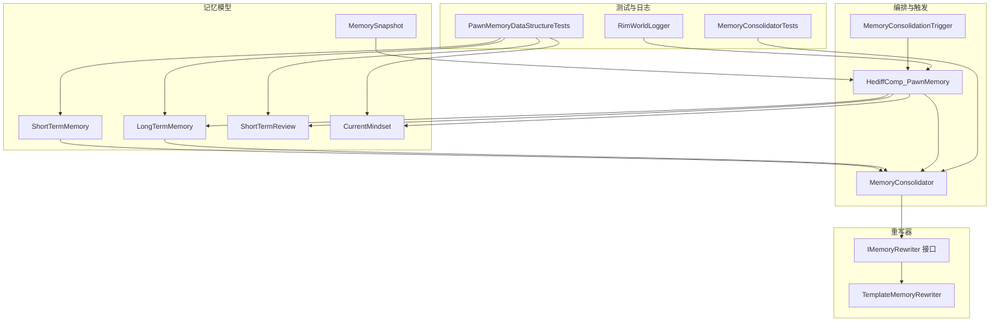
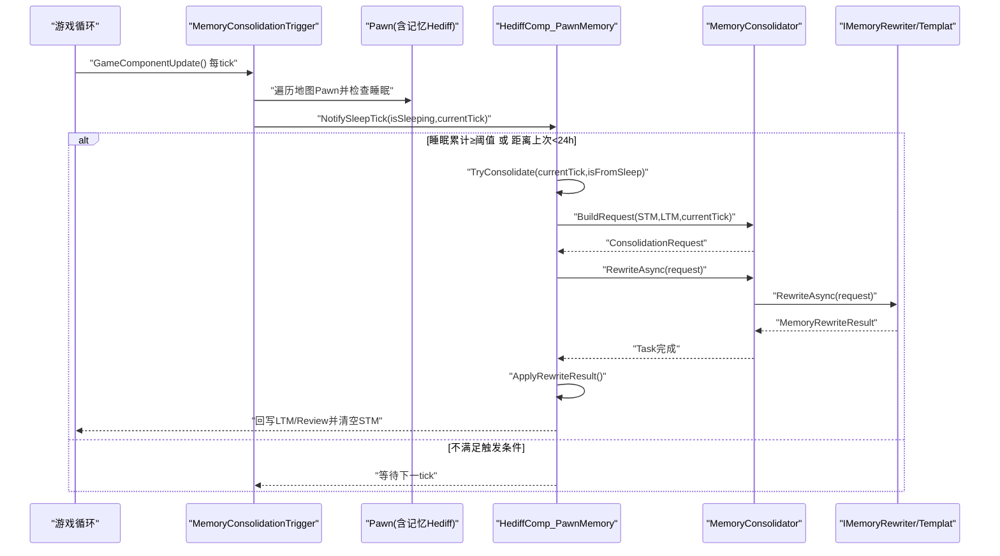
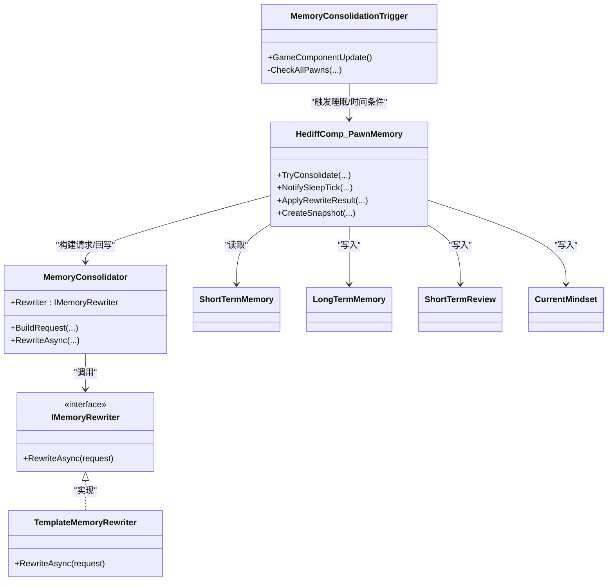

# 记忆巩固机制

<cite>
**本文引用的文件**
- [MemoryConsolidator.cs](file://Source/Data/PawnPro/Memory/MemoryConsolidator.cs)
- [MemoryConsolidationTrigger.cs](file://Source/Data/PawnPro/Memory/MemoryConsolidationTrigger.cs)
- [IMemoryRewriter.cs](file://Source/Data/PawnPro/Memory/IMemoryRewriter.cs)
- [TemplateMemoryRewriter.cs](file://Source/Data/PawnPro/Memory/TemplateMemoryRewriter.cs)
- [HediffComp_PawnMemory.cs](file://Source/Data/PawnPro/Memory/HediffComp_PawnMemory.cs)
- [ShortTermMemory.cs](file://Source/Data/PawnPro/Memory/ShortTermMemory.cs)
- [LongTermMemory.cs](file://Source/Data/PawnPro/Memory/LongTermMemory.cs)
- [ShortTermReview.cs](file://Source/Data/PawnPro/Memory/ShortTermReview.cs)
- [CurrentMindset.cs](file://Source/Data/PawnPro/Memory/CurrentMindset.cs)
- [MemorySnapshot.cs](file://Source/Data/PawnPro/Memory/MemorySnapshot.cs)
- [MemoryConsolidatorTests.cs](file://RimLife.Tests/Memory/MemoryConsolidatorTests.cs)
- [PawnMemoryDataStructureTests.cs](file://RimLife.Tests/Memory/PawnMemoryDataStructureTests.cs)
- [RimWorldLogger.cs](file://Source/Infrastructure/RimWorldLogger.cs)
</cite>

## 目录
1. [引言](#引言)
2. [项目结构](#项目结构)
3. [核心组件](#核心组件)
4. [架构总览](#架构总览)
5. [详细组件分析](#详细组件分析)
6. [依赖关系分析](#依赖关系分析)
7. [性能考量](#性能考量)
8. [故障排查指南](#故障排查指南)
9. [结论](#结论)
10. [附录](#附录)

## 引言
本文件系统性阐述 RimLife 中“记忆巩固机制”的设计与实现，重点覆盖以下方面：
- MemoryConsolidator 的两阶段巩固流程：Phase 1（同步）构建 ConsolidationRequest，Phase 2（异步）通过 IMemoryRewriter 生成 MemoryRewriteResult。
- 时间衰减与重要性评估：通过模板重写器的分组与合并策略，自然形成重要性权重与主题聚合。
- 记忆整合策略：基于类型与关联角色的分组、主题标签映射、摘要截断与合并。
- 触发条件与执行时机：由 MemoryConsolidationTrigger 周期性检查睡眠状态与强制间隔，驱动 HediffComp_PawnMemory 的 TryConsolidate。
- 数据转换：短期记忆（ShortTermMemory）到长期记忆（LongTermMemory）的格式转换与语义保持。
- 质量控制：冗余过滤（去重关联角色）、冲突解决（同主题合并）、一致性验证（截断与长度约束）。
- 性能优化：异步执行、主线程回写、队列大小限制、检查频率折中。
- 对叙事质量的影响与最佳实践：短期回顾与即时心境的优先级、主题标签的检索与过滤。
- 监控指标与调试工具：日志输出、单元测试覆盖点。

## 项目结构
围绕记忆巩固的相关代码主要位于 Source/Data/PawnPro/Memory 目录，配合测试用例与基础设施日志适配器，形成清晰的职责分离：
- 数据模型层：ShortTermMemory、LongTermMemory、ShortTermReview、CurrentMindset、MemorySnapshot
- 重写器接口与实现：IMemoryRewriter、TemplateMemoryRewriter
- 巩固编排：MemoryConsolidator
- 触发器：MemoryConsolidationTrigger
- 记忆组件：HediffComp_PawnMemory（负责序列化、触发、回写）
- 测试：MemoryConsolidatorTests、PawnMemoryDataStructureTests
- 日志：RimWorldLogger

图表来源
- [MemoryConsolidator.cs:1-61](file://Source/Data/PawnPro/Memory/MemoryConsolidator.cs#L1-L61)
- [MemoryConsolidationTrigger.cs:1-79](file://Source/Data/PawnPro/Memory/MemoryConsolidationTrigger.cs#L1-L79)
- [IMemoryRewriter.cs:1-54](file://Source/Data/PawnPro/Memory/IMemoryRewriter.cs#L1-L54)
- [TemplateMemoryRewriter.cs:1-152](file://Source/Data/PawnPro/Memory/TemplateMemoryRewriter.cs#L1-L152)
- [HediffComp_PawnMemory.cs:1-408](file://Source/Data/PawnPro/Memory/HediffComp_PawnMemory.cs#L1-L408)
- [ShortTermMemory.cs:1-48](file://Source/Data/PawnPro/Memory/ShortTermMemory.cs#L1-L48)
- [LongTermMemory.cs:1-53](file://Source/Data/PawnPro/Memory/LongTermMemory.cs#L1-L53)
- [ShortTermReview.cs:1-32](file://Source/Data/PawnPro/Memory/ShortTermReview.cs#L1-L32)
- [CurrentMindset.cs:1-34](file://Source/Data/PawnPro/Memory/CurrentMindset.cs#L1-L34)
- [MemorySnapshot.cs:1-36](file://Source/Data/PawnPro/Memory/MemorySnapshot.cs#L1-L36)
- [MemoryConsolidatorTests.cs:1-188](file://RimLife.Tests/Memory/MemoryConsolidatorTests.cs#L1-L188)
- [PawnMemoryDataStructureTests.cs:1-192](file://RimLife.Tests/Memory/PawnMemoryDataStructureTests.cs#L1-L192)
- [RimWorldLogger.cs:1-15](file://Source/Infrastructure/RimWorldLogger.cs#L1-L15)

章节来源
- [MemoryConsolidator.cs:1-61](file://Source/Data/PawnPro/Memory/MemoryConsolidator.cs#L1-L61)
- [MemoryConsolidationTrigger.cs:1-79](file://Source/Data/PawnPro/Memory/MemoryConsolidationTrigger.cs#L1-L79)
- [IMemoryRewriter.cs:1-54](file://Source/Data/PawnPro/Memory/IMemoryRewriter.cs#L1-L54)
- [TemplateMemoryRewriter.cs:1-152](file://Source/Data/PawnPro/Memory/TemplateMemoryRewriter.cs#L1-L152)
- [HediffComp_PawnMemory.cs:1-408](file://Source/Data/PawnPro/Memory/HediffComp_PawnMemory.cs#L1-L408)
- [ShortTermMemory.cs:1-48](file://Source/Data/PawnPro/Memory/ShortTermMemory.cs#L1-L48)
- [LongTermMemory.cs:1-53](file://Source/Data/PawnPro/Memory/LongTermMemory.cs#L1-L53)
- [ShortTermReview.cs:1-32](file://Source/Data/PawnPro/Memory/ShortTermReview.cs#L1-L32)
- [CurrentMindset.cs:1-34](file://Source/Data/PawnPro/Memory/CurrentMindset.cs#L1-L34)
- [MemorySnapshot.cs:1-36](file://Source/Data/PawnPro/Memory/MemorySnapshot.cs#L1-L36)
- [MemoryConsolidatorTests.cs:1-188](file://RimLife.Tests/Memory/MemoryConsolidatorTests.cs#L1-L188)
- [PawnMemoryDataStructureTests.cs:1-192](file://RimLife.Tests/Memory/PawnMemoryDataStructureTests.cs#L1-L192)
- [RimWorldLogger.cs:1-15](file://Source/Infrastructure/RimWorldLogger.cs#L1-L15)

## 核心组件
- MemoryConsolidator：静态编排器，负责 Phase 1 构建 ConsolidationRequest，并将请求交给 IMemoryRewriter 执行 Phase 2 的异步重写。
- IMemoryRewriter 与 TemplateMemoryRewriter：定义重写契约与模板实现，按类型与关联角色分组，生成主题标签，合并摘要并产出短期回顾。
- HediffComp_PawnMemory：Pawn 记忆载体，维护 STM/LTM/Review/Mindset，负责触发与回写，序列化与查询。
- MemoryConsolidationTrigger：GameComponent，周期性扫描地图上的 Pawn，依据睡眠与时间间隔触发巩固。
- 数据模型：ShortTermMemory、LongTermMemory、ShortTermReview、CurrentMindset、MemorySnapshot，均为轻量 DTO，便于持久化与跨模块传输。

章节来源
- [MemoryConsolidator.cs:12-59](file://Source/Data/PawnPro/Memory/MemoryConsolidator.cs#L12-L59)
- [IMemoryRewriter.cs:11-53](file://Source/Data/PawnPro/Memory/IMemoryRewriter.cs#L11-L53)
- [TemplateMemoryRewriter.cs:13-151](file://Source/Data/PawnPro/Memory/TemplateMemoryRewriter.cs#L13-L151)
- [HediffComp_PawnMemory.cs:20-328](file://Source/Data/PawnPro/Memory/HediffComp_PawnMemory.cs#L20-L328)
- [MemoryConsolidationTrigger.cs:15-79](file://Source/Data/PawnPro/Memory/MemoryConsolidationTrigger.cs#L15-L79)
- [ShortTermMemory.cs:9-47](file://Source/Data/PawnPro/Memory/ShortTermMemory.cs#L9-L47)
- [LongTermMemory.cs:10-52](file://Source/Data/PawnPro/Memory/LongTermMemory.cs#L10-L52)
- [ShortTermReview.cs:8-31](file://Source/Data/PawnPro/Memory/ShortTermReview.cs#L8-L31)
- [CurrentMindset.cs:10-34](file://Source/Data/PawnPro/Memory/CurrentMindset.cs#L10-L34)
- [MemorySnapshot.cs:12-35](file://Source/Data/PawnPro/Memory/MemorySnapshot.cs#L12-L35)

## 架构总览
记忆巩固采用“事件驱动 + 两阶段编排”的架构：
- 触发阶段：MemoryConsolidationTrigger 周期性检查 Pawn 的睡眠状态与时间间隔，满足条件后调用 HediffComp_PawnMemory.TryConsolidate。
- 编排阶段：HediffComp_PawnMemory 构建 ConsolidationRequest（Phase 1），交由 MemoryConsolidator.RewriteAsync（Phase 2）异步执行。
- 结果阶段：异步完成后通过主线程调度回写 LTM、Review、清空 STM，并更新计数器。

图表来源
- [MemoryConsolidationTrigger.cs:28-70](file://Source/Data/PawnPro/Memory/MemoryConsolidationTrigger.cs#L28-L70)
- [HediffComp_PawnMemory.cs:232-328](file://Source/Data/PawnPro/Memory/HediffComp_PawnMemory.cs#L232-L328)
- [MemoryConsolidator.cs:28-58](file://Source/Data/PawnPro/Memory/MemoryConsolidator.cs#L28-L58)
- [IMemoryRewriter.cs:11-18](file://Source/Data/PawnPro/Memory/IMemoryRewriter.cs#L11-L18)
- [TemplateMemoryRewriter.cs:15-70](file://Source/Data/PawnPro/Memory/TemplateMemoryRewriter.cs#L15-L70)

## 详细组件分析

### MemoryConsolidator（两阶段编排）
- Phase 1（同步）：BuildRequest 将当前 STM 与既有 LTM 包装为 ConsolidationRequest，包含 PawnName、PawnContext、NewEvents、ExistingLtm、CurrentTick。
- Phase 2（异步）：RewriteAsync 将请求交给当前 IMemoryRewriter 实例（默认 TemplateMemoryRewriter），返回 Task<MemoryRewriteResult>。
- 设计要点：通过静态 Rewriter 可插拔替换（例如注册 LlmMemoryRewriter），实现模板降级与 LLM 扩展。

章节来源
- [MemoryConsolidator.cs:12-59](file://Source/Data/PawnPro/Memory/MemoryConsolidator.cs#L12-L59)
- [IMemoryRewriter.cs:23-53](file://Source/Data/PawnPro/Memory/IMemoryRewriter.cs#L23-L53)

### MemoryConsolidationTrigger（事件驱动触发器）
- 周期性检查：每 250 ticks 检查一次，避免高频扫描。
- 触发条件：
  - 睡眠触发：连续深度睡眠达到 7500 ticks（约 3 小时）。
  - 定时触发：距离上次巩固至少 60000 ticks（约 24 小时）。
- 执行路径：遍历地图上所有 Pawn，查找 PawnProMemory Hediff，调用其 NotifySleepTick。

章节来源
- [MemoryConsolidationTrigger.cs:15-79](file://Source/Data/PawnPro/Memory/MemoryConsolidationTrigger.cs#L15-L79)
- [HediffComp_PawnMemory.cs:307-328](file://Source/Data/PawnPro/Memory/HediffComp_PawnMemory.cs#L307-L328)

### TemplateMemoryRewriter（模板重写器）
- 分组策略：按 (Type, RelatedPawnId) 分组 STM，生成主题标签（relationship:、combat、colony_events、milestones、social、observations）。
- 合并策略：若存在相同 Topic 的旧 LTM，则合并摘要并去重关联角色；否则新增 LTM 条目。
- 截断策略：单条 STM 摘要截断至 500 字，合并后仍不超过 500 字；短期回顾截断至 300 字。
- 短期回顾：对近期 STM 做客观摘要，最多取 8 条，总长度不超过 300 字。

章节来源
- [TemplateMemoryRewriter.cs:13-151](file://Source/Data/PawnPro/Memory/TemplateMemoryRewriter.cs#L13-L151)
- [IMemoryRewriter.cs:45-52](file://Source/Data/PawnPro/Memory/IMemoryRewriter.cs#L45-L52)

### HediffComp_PawnMemory（记忆组件）
- 触发与回写：
  - TryConsolidate：检查 STM 是否为空、是否正在巩固、是否满足睡眠或时间间隔条件；构建 ConsolidationRequest 并异步执行 RewriteAsync；完成后在主线程回写结果。
  - ApplyRewriteResult：替换 LTM、更新 Review、清空 STM、重置睡眠计数、更新 lastConsolidationTick。
- 序列化：通过 Scribe 持久化 STM/LTM、Review、Mindset、lastConsolidationTick、consecutiveSleepTicks。
- 查询与快照：按 Topic/RelatedPawn 查询 LTM；生成 MemorySnapshot 供 CharacterCard 使用。

章节来源
- [HediffComp_PawnMemory.cs:232-328](file://Source/Data/PawnPro/Memory/HediffComp_PawnMemory.cs#L232-L328)
- [HediffComp_PawnMemory.cs:287-301](file://Source/Data/PawnPro/Memory/HediffComp_PawnMemory.cs#L287-L301)
- [HediffComp_PawnMemory.cs:50-176](file://Source/Data/PawnPro/Memory/HediffComp_PawnMemory.cs#L50-L176)
- [HediffComp_PawnMemory.cs:337-398](file://Source/Data/PawnPro/Memory/HediffComp_PawnMemory.cs#L337-L398)

### 数据模型与转换
- ShortTermMemory → LongTermMemory：
  - 输入：STM 列表（含 Tick、Type、Summary、RelatedPawnId）。
  - 输出：LTM 列表（含 ConsolidatedTick、Topic、Summary、RelatedPawnIds）。
  - 转换规则：按分组生成 Topic；合并摘要并去重 RelatedPawnIds；统一截断长度。
- 语义保持：通过 RelatedPawnId 维持人物关系链；通过 Topic 维持主题维度；通过 ConsolidatedTick 记录整合时间。

章节来源
- [ShortTermMemory.cs:9-47](file://Source/Data/PawnPro/Memory/ShortTermMemory.cs#L9-L47)
- [LongTermMemory.cs:10-52](file://Source/Data/PawnPro/Memory/LongTermMemory.cs#L10-L52)
- [TemplateMemoryRewriter.cs:23-70](file://Source/Data/PawnPro/Memory/TemplateMemoryRewriter.cs#L23-L70)

### 质量控制机制
- 冗余过滤：RelatedPawnIds 去重，避免重复关联同一角色。
- 冲突解决：同 Topic 的 LTM 合并摘要，保留最新 ConsolidatedTick。
- 一致性验证：所有摘要均进行截断，确保 LTM≤500 字、Review≤300 字、STM/LTM ToString 预览长度合理。

章节来源
- [TemplateMemoryRewriter.cs:47-56](file://Source/Data/PawnPro/Memory/TemplateMemoryRewriter.cs#L47-L56)
- [ShortTermMemory.cs:36-45](file://Source/Data/PawnPro/Memory/ShortTermMemory.cs#L36-L45)
- [LongTermMemory.cs:41-50](file://Source/Data/PawnPro/Memory/LongTermMemory.cs#L41-L50)
- [ShortTermReview.cs:18-29](file://Source/Data/PawnPro/Memory/ShortTermReview.cs#L18-L29)
- [CurrentMindset.cs:20-31](file://Source/Data/PawnPro/Memory/CurrentMindset.cs#L20-L31)

### 性能优化策略
- 异步执行：RewriteAsync 在 Task 中执行，避免阻塞主线程。
- 主线程回写：通过 MainThreadDispatcher.Enqueue 将回写操作切回主线程，保证 RimWorld 安全性。
- 队列容量限制：MainThreadDispatcher 内部队列最大长度限制，防止积压过大。
- 触发频率折中：CheckIntervalTicks=250，兼顾及时性与性能。
- 防重入：_consolidationPending 标志避免并发巩固。

章节来源
- [HediffComp_PawnMemory.cs:255-281](file://Source/Data/PawnPro/Memory/HediffComp_PawnMemory.cs#L255-L281)
- [HediffComp_PawnMemory.cs:287-301](file://Source/Data/PawnPro/Memory/HediffComp_PawnMemory.cs#L287-L301)
- [MainThreadDispatcher.cs:13-38](file://ext/NPCLife/src/NPCLife/Framework/MainThreadDispatcher.cs#L13-L38)
- [MemoryConsolidationTrigger.cs:17-36](file://Source/Data/PawnPro/Memory/MemoryConsolidationTrigger.cs#L17-L36)

### 对叙事质量的影响与最佳实践
- 心境优先：CurrentMindset 为最高层级，优先于 Review/STM/LTM；短期回顾用于客观汇总，长期记忆用于主题沉淀。
- 主题检索：通过 Topic 进行快速检索与过滤，支持按关系、战斗、事件、里程碑、社交、观察等维度组织故事。
- 关联角色：通过 RelatedPawnIds 维系人物关系网络，便于后续角色卡与叙事扩展。
- 最佳实践：
  - 控制 STM 生成速率，避免过载导致 Review 过长。
  - 合理设置触发阈值，平衡巩固频率与叙事连贯性。
  - 使用 MemorySnapshot 为角色卡提供稳定输入。

章节来源
- [CurrentMindset.cs:10-34](file://Source/Data/PawnPro/Memory/CurrentMindset.cs#L10-L34)
- [ShortTermReview.cs:8-31](file://Source/Data/PawnPro/Memory/ShortTermReview.cs#L8-L31)
- [HediffComp_PawnMemory.cs:337-398](file://Source/Data/PawnPro/Memory/HediffComp_PawnMemory.cs#L337-L398)
- [MemorySnapshot.cs:12-35](file://Source/Data/PawnPro/Memory/MemorySnapshot.cs#L12-L35)

## 依赖关系分析
- MemoryConsolidator 依赖 IMemoryRewriter，默认使用 TemplateMemoryRewriter。
- HediffComp_PawnMemory 依赖 MemoryConsolidator 与 MainThreadDispatcher，负责触发与回写。
- MemoryConsolidationTrigger 依赖 RimWorld 游戏循环与地图 Pawn 集合，间接驱动记忆组件。
- 数据模型之间为纯 DTO 关系，无外部依赖，便于序列化与跨模块传递。

图表来源
- [MemoryConsolidator.cs:12-59](file://Source/Data/PawnPro/Memory/MemoryConsolidator.cs#L12-L59)
- [IMemoryRewriter.cs:11-18](file://Source/Data/PawnPro/Memory/IMemoryRewriter.cs#L11-L18)
- [TemplateMemoryRewriter.cs:13-151](file://Source/Data/PawnPro/Memory/TemplateMemoryRewriter.cs#L13-L151)
- [HediffComp_PawnMemory.cs:232-398](file://Source/Data/PawnPro/Memory/HediffComp_PawnMemory.cs#L232-L398)
- [MemoryConsolidationTrigger.cs:28-70](file://Source/Data/PawnPro/Memory/MemoryConsolidationTrigger.cs#L28-L70)
- [ShortTermMemory.cs:9-47](file://Source/Data/PawnPro/Memory/ShortTermMemory.cs#L9-L47)
- [LongTermMemory.cs:10-52](file://Source/Data/PawnPro/Memory/LongTermMemory.cs#L10-L52)
- [ShortTermReview.cs:8-31](file://Source/Data/PawnPro/Memory/ShortTermReview.cs#L8-L31)
- [CurrentMindset.cs:10-34](file://Source/Data/PawnPro/Memory/CurrentMindset.cs#L10-L34)

## 性能考量
- 异步与回写：通过 Task 异步执行重写，完成后在主线程回写，避免 UI 卡顿。
- 队列容量：MainThreadDispatcher 内置队列上限，防止突发大量巩固造成内存压力。
- 触发频率：CheckIntervalTicks=250，既保证响应速度，又避免过度扫描。
- 防重入：_consolidationPending 防止并发巩固导致的数据竞争。
- 截断策略：统一的摘要截断减少 Token 消耗与序列化体积。

章节来源
- [HediffComp_PawnMemory.cs:255-281](file://Source/Data/PawnPro/Memory/HediffComp_PawnMemory.cs#L255-L281)
- [HediffComp_PawnMemory.cs:287-301](file://Source/Data/PawnPro/Memory/HediffComp_PawnMemory.cs#L287-L301)
- [TemplateMemoryRewriter.cs:93-120](file://Source/Data/PawnPro/Memory/TemplateMemoryRewriter.cs#L93-L120)
- [MemoryConsolidationTrigger.cs:17-36](file://Source/Data/PawnPro/Memory/MemoryConsolidationTrigger.cs#L17-L36)
- [MainThreadDispatcher.cs:13-38](file://ext/NPCLife/src/NPCLife/Framework/MainThreadDispatcher.cs#L13-L38)

## 故障排查指南
- 日志定位：HediffComp_PawnMemory 在发起与应用巩固时会输出消息与警告日志，便于追踪失败原因。
- 单元测试：MemoryConsolidatorTests 与 PawnMemoryDataStructureTests 覆盖关键场景，可用于回归验证。
- 常见问题：
  - 无 STM：TryConsolidate 返回 false，不触发巩固。
  - 正在巩固中：_consolidationPending=true，跳过本轮。
  - 触发条件未满足：睡眠不足或时间间隔未到。
  - 重写失败：Task.IsFaulted 或结果为空，记录警告并释放防重入标志。

章节来源
- [HediffComp_PawnMemory.cs:264-281](file://Source/Data/PawnPro/Memory/HediffComp_PawnMemory.cs#L264-L281)
- [MemoryConsolidatorTests.cs:14-187](file://RimLife.Tests/Memory/MemoryConsolidatorTests.cs#L14-L187)
- [PawnMemoryDataStructureTests.cs:17-191](file://RimLife.Tests/Memory/PawnMemoryDataStructureTests.cs#L17-L191)
- [RimWorldLogger.cs:8-15](file://Source/Infrastructure/RimWorldLogger.cs#L8-L15)

## 结论
记忆巩固机制以简洁可靠的两阶段编排为核心，结合事件驱动触发与模板重写策略，在不引入复杂时间衰减模型的前提下，实现了自然的重要性评估与主题聚合。通过严格的截断与去重策略，保障了叙事质量与性能平衡。未来可通过替换 Rewriter 为 LLM 实现进一步提升语义质量，并在高负载场景下优化触发频率与队列容量参数。

## 附录
- 监控指标建议：
  - 巩固发起次数与成功率（基于日志统计）。
  - STM/LTM 数量趋势、Review 长度分布。
  - 主线程回写延迟与队列积压。
- 调试工具使用：
  - 启用并查看 RimLife.PawnMemory 相关日志。
  - 使用单元测试快速验证数据结构与重写逻辑。
  - 在 MemoryConsolidationTrigger 的 CheckAllPawns 路径设置断点，观察 Pawn 集合与睡眠状态。