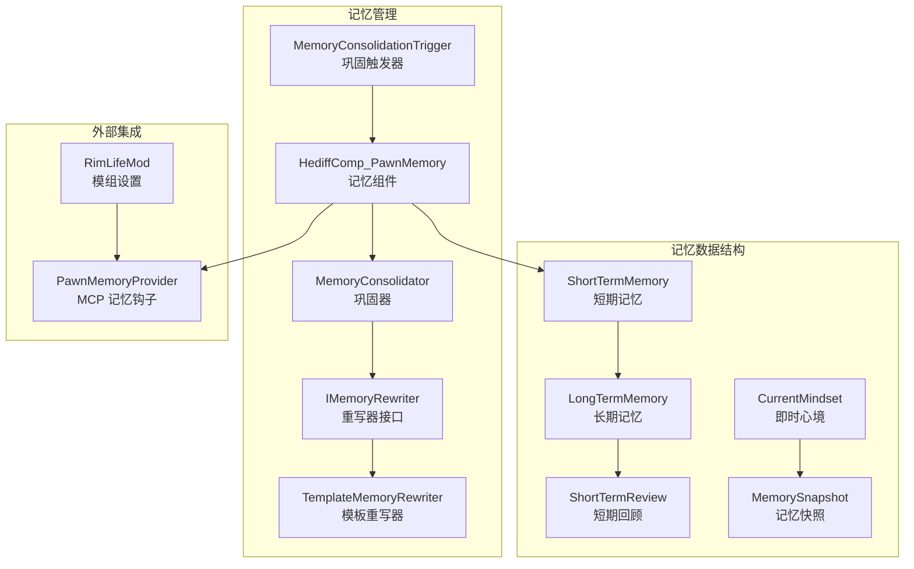
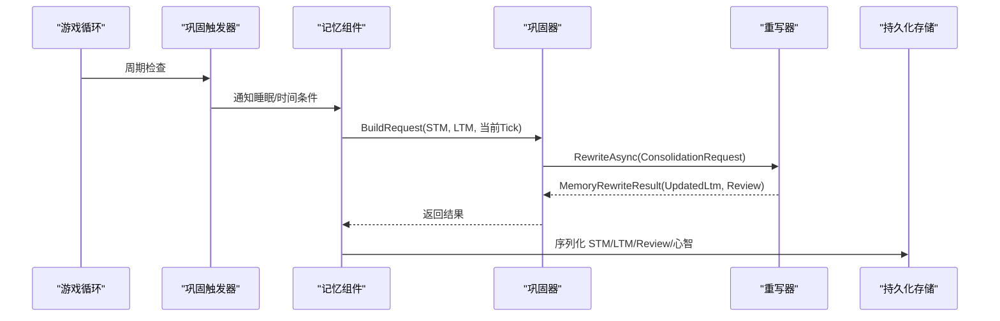
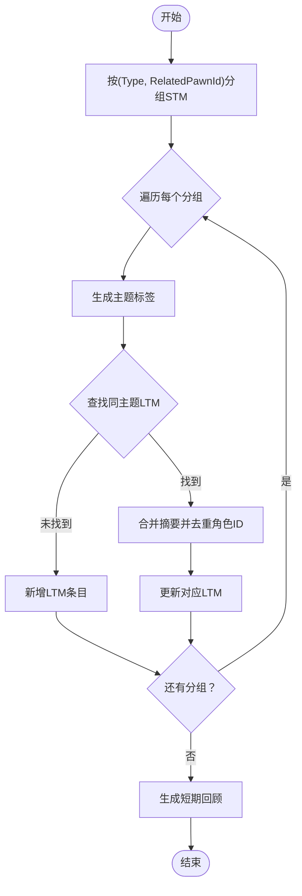
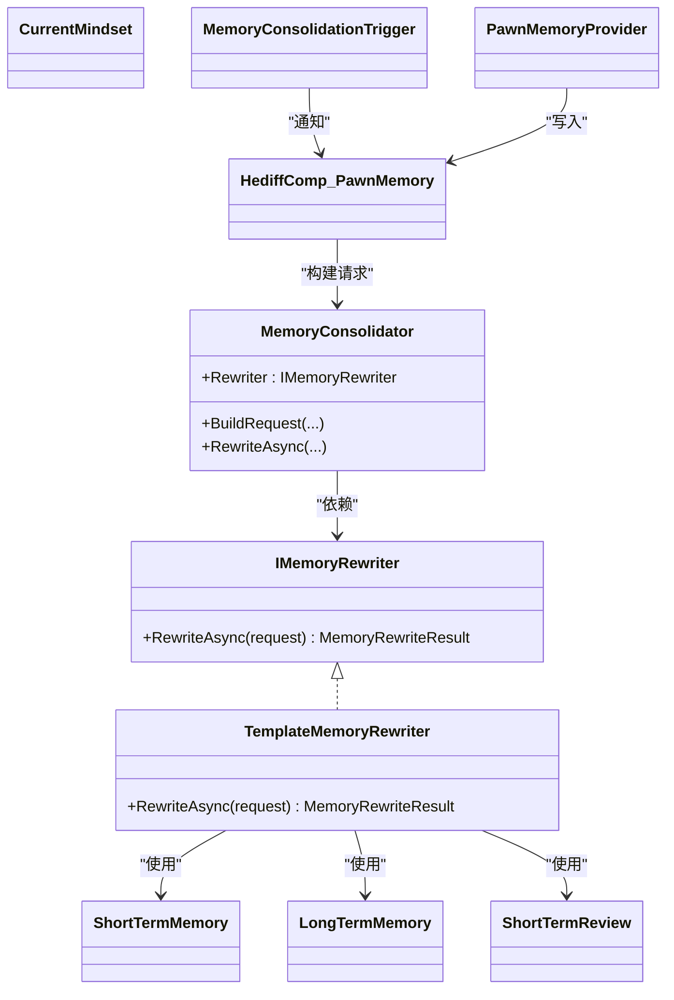

# 记忆重写系统

<cite>
**本文引用的文件**
- [IMemoryRewriter.cs](file://Source/Data/PawnPro/Memory/IMemoryRewriter.cs)
- [TemplateMemoryRewriter.cs](file://Source/Data/PawnPro/Memory/TemplateMemoryRewriter.cs)
- [MemoryConsolidator.cs](file://Source/Data/PawnPro/Memory/MemoryConsolidator.cs)
- [LongTermMemory.cs](file://Source/Data/PawnPro/Memory/LongTermMemory.cs)
- [ShortTermMemory.cs](file://Source/Data/PawnPro/Memory/ShortTermMemory.cs)
- [ShortTermReview.cs](file://Source/Data/PawnPro/Memory/ShortTermReview.cs)
- [CurrentMindset.cs](file://Source/Data/PawnPro/Memory/CurrentMindset.cs)
- [MemoryConsolidationTrigger.cs](file://Source/Data/PawnPro/Memory/MemoryConsolidationTrigger.cs)
- [HediffComp_PawnMemory.cs](file://Source/Data/PawnPro/Memory/HediffComp_PawnMemory.cs)
- [PawnMemoryProvider.cs](file://Source/Infrastructure/Mcp/PawnMemoryProvider.cs)
- [MemoryConsolidatorTests.cs](file://RimLife.Tests/Memory/MemoryConsolidatorTests.cs)
- [PawnMemoryDataStructureTests.cs](file://RimLife.Tests/Memory/PawnMemoryDataStructureTests.cs)
- [RimLifeMod.cs](file://Source/Settings/RimLifeMod.cs)
- [MemorySnapshot.cs](file://Source/Data/PawnPro/Memory/MemorySnapshot.cs)
</cite>

## 目录
1. [简介](#简介)
2. [项目结构](#项目结构)
3. [核心组件](#核心组件)
4. [架构总览](#架构总览)
5. [详细组件分析](#详细组件分析)
6. [依赖关系分析](#依赖关系分析)
7. [性能考量](#性能考量)
8. [故障排除指南](#故障排除指南)
9. [结论](#结论)
10. [附录](#附录)

## 简介
本文件面向“记忆重写系统”的设计与实现，聚焦以下目标：
- 解释 IMemoryRewriter 接口的设计理念与扩展机制
- 深入解析 TemplateMemoryRewriter 的模板重写算法（模式匹配、语义理解与上下文感知）
- 文档化记忆重写的优化策略（去重、压缩、语义归一化）
- 说明记忆重写在提升叙事质量与降低 token 消耗方面的机制
- 提供自定义记忆重写器的开发指南（接口实现、测试策略、性能评估）
- 说明记忆重写与 LLM 的集成协同工作方式
- 提供配置项、参数调优与效果监控方法
- 提供故障排除与调试技巧

## 项目结构
记忆重写系统位于 RimLife 的 PawnPro 记忆子系统中，围绕短期记忆（STM）到长期记忆（LTM）的两阶段巩固流程展开，并通过 MCP 工具链与 LLM 协作。

图表来源
- [MemoryConsolidationTrigger.cs:15-79](file://Source/Data/PawnPro/Memory/MemoryConsolidationTrigger.cs#L15-L79)
- [HediffComp_PawnMemory.cs:20-200](file://Source/Data/PawnPro/Memory/HediffComp_PawnMemory.cs#L20-L200)
- [MemoryConsolidator.cs:12-61](file://Source/Data/PawnPro/Memory/MemoryConsolidator.cs#L12-L61)
- [IMemoryRewriter.cs:11-53](file://Source/Data/PawnPro/Memory/IMemoryRewriter.cs#L11-L53)
- [TemplateMemoryRewriter.cs:13-152](file://Source/Data/PawnPro/Memory/TemplateMemoryRewriter.cs#L13-L152)
- [PawnMemoryProvider.cs:14-94](file://Source/Infrastructure/Mcp/PawnMemoryProvider.cs#L14-L94)
- [RimLifeMod.cs:47-69](file://Source/Settings/RimLifeMod.cs#L47-L69)

章节来源
- [MemoryConsolidationTrigger.cs:15-79](file://Source/Data/PawnPro/Memory/MemoryConsolidationTrigger.cs#L15-L79)
- [HediffComp_PawnMemory.cs:20-200](file://Source/Data/PawnPro/Memory/HediffComp_PawnMemory.cs#L20-L200)
- [MemoryConsolidator.cs:12-61](file://Source/Data/PawnPro/Memory/MemoryConsolidator.cs#L12-L61)
- [IMemoryRewriter.cs:11-53](file://Source/Data/PawnPro/Memory/IMemoryRewriter.cs#L11-L53)
- [TemplateMemoryRewriter.cs:13-152](file://Source/Data/PawnPro/Memory/TemplateMemoryRewriter.cs#L13-L152)
- [PawnMemoryProvider.cs:14-94](file://Source/Infrastructure/Mcp/PawnMemoryProvider.cs#L14-L94)
- [RimLifeMod.cs:47-69](file://Source/Settings/RimLifeMod.cs#L47-L69)

## 核心组件
- IMemoryRewriter：定义记忆重写协议，输入为 ConsolidationRequest，输出为 MemoryRewriteResult。支持模板与 LLM 两种实现路径。
- TemplateMemoryRewriter：无 LLM 降级实现，按 (Type, RelatedPawnId) 分组 STM，基于主题标签合并/新增 LTM，并生成短期回顾。
- MemoryConsolidator：两阶段巩固编排器，Phase 1 构建 ConsolidationRequest，Phase 2 调用 IMemoryRewriter。
- 数据结构：ShortTermMemory、LongTermMemory、ShortTermReview、CurrentMindset、MemorySnapshot。
- 触发与持久化：MemoryConsolidationTrigger 周期检查睡眠与时间阈值，HediffComp_PawnMemory 负责序列化与状态管理。
- MCP 集成：PawnMemoryProvider 提供 add_memory 与 update_mindset 工具，驱动记忆注入与心境写入。

章节来源
- [IMemoryRewriter.cs:11-53](file://Source/Data/PawnPro/Memory/IMemoryRewriter.cs#L11-L53)
- [TemplateMemoryRewriter.cs:13-152](file://Source/Data/PawnPro/Memory/TemplateMemoryRewriter.cs#L13-L152)
- [MemoryConsolidator.cs:12-61](file://Source/Data/PawnPro/Memory/MemoryConsolidator.cs#L12-L61)
- [ShortTermMemory.cs:9-48](file://Source/Data/PawnPro/Memory/ShortTermMemory.cs#L9-L48)
- [LongTermMemory.cs:10-53](file://Source/Data/PawnPro/Memory/LongTermMemory.cs#L10-L53)
- [ShortTermReview.cs:8-32](file://Source/Data/PawnPro/Memory/ShortTermReview.cs#L8-L32)
- [CurrentMindset.cs:10-34](file://Source/Data/PawnPro/Memory/CurrentMindset.cs#L10-L34)
- [MemorySnapshot.cs:12-36](file://Source/Data/PawnPro/Memory/MemorySnapshot.cs#L12-L36)
- [MemoryConsolidationTrigger.cs:15-79](file://Source/Data/PawnPro/Memory/MemoryConsolidationTrigger.cs#L15-L79)
- [HediffComp_PawnMemory.cs:20-200](file://Source/Data/PawnPro/Memory/HediffComp_PawnMemory.cs#L20-L200)
- [PawnMemoryProvider.cs:14-94](file://Source/Infrastructure/Mcp/PawnMemoryProvider.cs#L14-L94)

## 架构总览
记忆重写系统采用“触发-巩固-重写-持久化”的闭环：
- 触发：MemoryConsolidationTrigger 周期性检查睡眠与时间阈值，通知记忆组件。
- 巩固：HediffComp_PawnMemory 收集 STM，MemoryConsolidator.BuildRequest 生成 ConsolidationRequest。
- 重写：MemoryConsolidator.RewriteAsync 调用 IMemoryRewriter（默认 TemplateMemoryRewriter）。
- 输出：更新 LTM 列表与短期回顾；CurrentMindset 由 LLM 通过 MCP 工具写入。
- 消费：MemorySnapshot 为上层叙事与提示词提供统一视图。

图表来源
- [MemoryConsolidationTrigger.cs:28-70](file://Source/Data/PawnPro/Memory/MemoryConsolidationTrigger.cs#L28-L70)
- [HediffComp_PawnMemory.cs:185-200](file://Source/Data/PawnPro/Memory/HediffComp_PawnMemory.cs#L185-L200)
- [MemoryConsolidator.cs:28-58](file://Source/Data/PawnPro/Memory/MemoryConsolidator.cs#L28-L58)
- [IMemoryRewriter.cs:16-17](file://Source/Data/PawnPro/Memory/IMemoryRewriter.cs#L16-L17)
- [TemplateMemoryRewriter.cs:15-70](file://Source/Data/PawnPro/Memory/TemplateMemoryRewriter.cs#L15-L70)

## 详细组件分析

### IMemoryRewriter 接口与扩展机制
- 设计理念
  - 明确职责分离：接口仅定义“如何将 STM 与现有 LTM 融合”，具体实现可选择模板或 LLM。
  - 结果解耦：MemoryRewriteResult 同时产出 UpdatedLtm 与 Review，便于后续消费。
  - 可插拔：MemoryConsolidator.Rewriter 可在运行时替换为 LLM 实现。
- 扩展点
  - 实现类需处理分组、主题映射、摘要合并与截断。
  - 保持幂等与可重复：相同输入应产生稳定输出，避免重复合并。

章节来源
- [IMemoryRewriter.cs:11-53](file://Source/Data/PawnPro/Memory/IMemoryRewriter.cs#L11-L53)
- [MemoryConsolidator.cs:17](file://Source/Data/PawnPro/Memory/MemoryConsolidator.cs#L17)

### TemplateMemoryRewriter：模板重写算法
- 分组与主题映射
  - 按 (Type, RelatedPawnId) 分组 STM，形成候选 LTM 主题。
  - 无关联角色时，根据 Type 映射到固定主题（如 combat、colony_events、milestones、social、observations）。
  - 有角色关联时，主题统一为 relationship:{id}，便于社交叙事聚合。
- 合并与去重
  - 若存在同主题 LTM，则合并摘要并并集去重 RelatedPawnIds。
  - 合并后仍受长度限制，超出则截断。
- 摘要压缩与语义归一化
  - BuildSummary：保留首个 STM 摘要，并补充“同期还发生了 N 件相关事件”信息，控制在 500 字以内。
  - MergeSummaries：拼接旧/新摘要，同样限制长度。
  - 截断策略：统一使用“…”，确保边界可识别。
- 短期回顾生成
  - 对最近若干 STM 做客观摘要，限制在 300 字以内，超过数量时给出概要统计。

图表来源
- [TemplateMemoryRewriter.cs:23-70](file://Source/Data/PawnPro/Memory/TemplateMemoryRewriter.cs#L23-L70)
- [TemplateMemoryRewriter.cs:75-149](file://Source/Data/PawnPro/Memory/TemplateMemoryRewriter.cs#L75-L149)

章节来源
- [TemplateMemoryRewriter.cs:13-152](file://Source/Data/PawnPro/Memory/TemplateMemoryRewriter.cs#L13-L152)

### MemoryConsolidator：两阶段巩固编排
- Phase 1（同步）：BuildRequest 将 STM 与现有 LTM 包装为 ConsolidationRequest，含 PawnName、PawnContext、CurrentTick 等上下文。
- Phase 2（异步）：RewriteAsync 调用当前 Rewriter（默认 TemplateMemoryRewriter）执行重写。
- 可替换性：通过静态 Rewriter 属性注入自定义实现（如 LLMMemoryRewriter）。

章节来源
- [MemoryConsolidator.cs:12-61](file://Source/Data/PawnPro/Memory/MemoryConsolidator.cs#L12-L61)

### 数据模型与序列化
- ShortTermMemory：记录事件时间、类型、摘要与关联角色，提供截断能力。
- LongTermMemory：记录 ConsolidatedTick、Topic、Summary、RelatedPawnIds，支持截断与打印预览。
- ShortTermReview：记录 Review 的 LastUpdateTick 与 Content。
- CurrentMindset：记录凌驾层的心境描述，供上层优先消费。
- MemorySnapshot：为上层叙事提供统一视图（CurrentMindset、ShortTermReview、RecentMemories、KeyMemories 等）。
- 序列化：HediffComp_PawnMemory 使用 Scribe 对上述结构进行保存/加载，保证跨存档持久化。

章节来源
- [ShortTermMemory.cs:9-48](file://Source/Data/PawnPro/Memory/ShortTermMemory.cs#L9-L48)
- [LongTermMemory.cs:10-53](file://Source/Data/PawnPro/Memory/LongTermMemory.cs#L10-L53)
- [ShortTermReview.cs:8-32](file://Source/Data/PawnPro/Memory/ShortTermReview.cs#L8-L32)
- [CurrentMindset.cs:10-34](file://Source/Data/PawnPro/Memory/CurrentMindset.cs#L10-L34)
- [MemorySnapshot.cs:12-36](file://Source/Data/PawnPro/Memory/MemorySnapshot.cs#L12-L36)
- [HediffComp_PawnMemory.cs:50-176](file://Source/Data/PawnPro/Memory/HediffComp_PawnMemory.cs#L50-L176)

### 触发与持久化：巩固触发器与记忆组件
- 触发条件：连续深度睡眠超过阈值或达到强制时间间隔。
- 检查频率：按固定间隔轮询地图上所有 Pawn，检查其记忆组件并通知睡眠状态。
- 持久化：HediffComp_PawnMemory 负责序列化 STM/LTM/Review/心智，确保数据一致性。

章节来源
- [MemoryConsolidationTrigger.cs:15-79](file://Source/Data/PawnPro/Memory/MemoryConsolidationTrigger.cs#L15-L79)
- [HediffComp_PawnMemory.cs:20-200](file://Source/Data/PawnPro/Memory/HediffComp_PawnMemory.cs#L20-L200)

### 与 LLM 的集成与 MCP 工具
- MCP 注入：PawnMemoryProvider 提供 add_memory 与 update_mindset 两个工具，前者向 STM 追加事件，后者写入 CurrentMindset。
- 心境优先：CurrentMindset 作为凌驾层，优先被消费者读取，细节需求再向下钻取。
- 设置入口：RimLifeMod 暴露配置面板，持久化 LLM 凭证等全局设置。

章节来源
- [PawnMemoryProvider.cs:14-94](file://Source/Infrastructure/Mcp/PawnMemoryProvider.cs#L14-L94)
- [CurrentMindset.cs:10-34](file://Source/Data/PawnPro/Memory/CurrentMindset.cs#L10-L34)
- [RimLifeMod.cs:47-69](file://Source/Settings/RimLifeMod.cs#L47-L69)

## 依赖关系分析
- 组件耦合
  - MemoryConsolidator 与 IMemoryRewriter 通过接口耦合，支持运行时替换。
  - TemplateMemoryRewriter 依赖 ShortTermMemory/LongTermMemory/ShortTermReview 的数据结构。
  - MemoryConsolidationTrigger 与 HediffComp_PawnMemory 通过游戏框架交互。
- 外部依赖
  - MCP 工具链与 LLM 适配器（在 NPCLife 模块中），本仓库提供 PawnMemoryProvider 作为写入入口。
- 循环依赖
  - 未见直接循环依赖；接口与实现分离清晰。

图表来源
- [IMemoryRewriter.cs:11-53](file://Source/Data/PawnPro/Memory/IMemoryRewriter.cs#L11-L53)
- [TemplateMemoryRewriter.cs:13-152](file://Source/Data/PawnPro/Memory/TemplateMemoryRewriter.cs#L13-L152)
- [MemoryConsolidator.cs:12-61](file://Source/Data/PawnPro/Memory/MemoryConsolidator.cs#L12-L61)
- [MemoryConsolidationTrigger.cs:15-79](file://Source/Data/PawnPro/Memory/MemoryConsolidationTrigger.cs#L15-L79)
- [HediffComp_PawnMemory.cs:20-200](file://Source/Data/PawnPro/Memory/HediffComp_PawnMemory.cs#L20-L200)
- [PawnMemoryProvider.cs:14-94](file://Source/Infrastructure/Mcp/PawnMemoryProvider.cs#L14-L94)

## 性能考量
- 时间复杂度
  - 分组：O(N)，N 为 STM 数量。
  - 合并：对每个主题查找/更新 LTM，最坏 O(T×L)，T 为主题数，L 为 LTM 数。
  - 摘要合并与截断：O(M)，M 为合并文本长度。
- 空间复杂度
  - 输出列表与临时缓冲 O(N+T)。
- 截断与 token 控制
  - STM 摘要在注入提示词前截断至合理长度，LTM/LTM 摘要限制在 500 字以内，Review 限制在 300 字以内，有效控制 LLM 输入规模。
- 触发频率与批处理
  - MemoryConsolidationTrigger 以固定间隔检查，避免高频写入；每次巩固批量处理 STM，减少碎片化。

章节来源
- [TemplateMemoryRewriter.cs:23-70](file://Source/Data/PawnPro/Memory/TemplateMemoryRewriter.cs#L23-L70)
- [ShortTermMemory.cs:36-40](file://Source/Data/PawnPro/Memory/ShortTermMemory.cs#L36-L40)
- [LongTermMemory.cs:41-45](file://Source/Data/PawnPro/Memory/LongTermMemory.cs#L41-L45)
- [ShortTermReview.cs:18-22](file://Source/Data/PawnPro/Memory/ShortTermReview.cs#L18-L22)
- [MemoryConsolidationTrigger.cs:17-18](file://Source/Data/PawnPro/Memory/MemoryConsolidationTrigger.cs#L17-L18)

## 故障排除指南
- 巩固未触发
  - 检查 MemoryConsolidationTrigger 的检查间隔与下一检查 tick 是否正确推进。
  - 确认 Pawn 是否存在记忆组件且处于睡眠状态。
- 重写结果异常
  - 核对 ConsolidationRequest 的 NewEvents 与 ExistingLtm 是否为空或格式错误。
  - 验证 TemplateMemoryRewriter 的主题映射是否符合预期（无关联角色时的默认主题）。
- 序列化问题
  - 检查 HediffComp_PawnMemory 的 Scribe 逻辑，确认字段顺序与分隔符一致。
- MCP 写入失败
  - 核对 add_memory 与 update_mindset 的参数合法性与 PawnId 是否存在。
  - 查看日志警告信息，定位异常原因。

章节来源
- [MemoryConsolidationTrigger.cs:28-70](file://Source/Data/PawnPro/Memory/MemoryConsolidationTrigger.cs#L28-L70)
- [HediffComp_PawnMemory.cs:50-176](file://Source/Data/PawnPro/Memory/HediffComp_PawnMemory.cs#L50-L176)
- [PawnMemoryProvider.cs:41-60](file://Source/Infrastructure/Mcp/PawnMemoryProvider.cs#L41-L60)
- [PawnMemoryProvider.cs:72-91](file://Source/Infrastructure/Mcp/PawnMemoryProvider.cs#L72-L91)

## 结论
记忆重写系统通过接口抽象与模板实现，提供了稳定、可扩展的记忆巩固能力。TemplateMemoryRewriter 在无 LLM 场景下仍能生成连贯的叙述与回顾；结合 MCP 工具与 CurrentMindset，系统实现了从事件流到叙事结构的高效转换。通过严格的截断与去重策略，系统在保证叙事质量的同时显著降低了 token 消耗。未来可通过引入 LLMMemoryRewriter 替换默认实现，进一步提升语义理解与上下文感知能力。

## 附录

### 自定义记忆重写器开发指南
- 接口实现
  - 实现 IMemoryRewriter.RewriteAsync，接收 ConsolidationRequest，返回 MemoryRewriteResult。
  - 处理分组、主题映射、摘要合并与截断，确保输出符合 LTM/Review 的长度约束。
- 测试策略
  - 使用 MemoryConsolidatorTests 与 PawnMemoryDataStructureTests 的断言风格验证：
    - BuildRequest 的空输入返回 null。
    - RewriteAsync 的单条输入创建一条 LTM。
    - 同类型同角色合并为一条 LTM。
    - 不同类型产生多条 LTM。
    - 已有 LTM 与新 STM 合并。
    - 生成 Review 的内容与时间戳。
- 性能评估
  - 以 STM 数量为变量，测量分组、合并与截断的耗时，关注 O(N) 与 O(T×L) 的增长趋势。
  - 对比不同主题映射策略对 T 的影响，评估缓存命中率。

章节来源
- [IMemoryRewriter.cs:16-17](file://Source/Data/PawnPro/Memory/IMemoryRewriter.cs#L16-L17)
- [MemoryConsolidatorTests.cs:14-188](file://RimLife.Tests/Memory/MemoryConsolidatorTests.cs#L14-L188)
- [PawnMemoryDataStructureTests.cs:17-192](file://RimLife.Tests/Memory/PawnMemoryDataStructureTests.cs#L17-L192)

### 配置选项、参数调优与效果监控
- 配置入口
  - RimLifeMod 暴露设置面板，持久化 LLM 凭证等全局配置。
- 关键参数
  - 巩固触发：睡眠阈值、强制间隔、检查间隔。
  - 截断长度：STM 摘要（默认 200）、LTM 摘要（默认 500）、Review（默认 300）、Mindset（默认 200）。
- 调优建议
  - 根据服务器/客户端性能调整检查间隔，平衡实时性与开销。
  - 在高社交密度场景下，适当放宽 RelatedPawnIds 去重策略，增强关系主题的覆盖。
- 效果监控
  - 通过 MemorySnapshot 的 KeyMemories 与 RecentMemories 观察叙事连贯性。
  - 统计 Review 的生成频率与平均长度，评估事件密度与提示词成本。

章节来源
- [RimLifeMod.cs:28-40](file://Source/Settings/RimLifeMod.cs#L28-L40)
- [MemoryConsolidationTrigger.cs:17-18](file://Source/Data/PawnPro/Memory/MemoryConsolidationTrigger.cs#L17-L18)
- [ShortTermMemory.cs:36-40](file://Source/Data/PawnPro/Memory/ShortTermMemory.cs#L36-L40)
- [LongTermMemory.cs:41-45](file://Source/Data/PawnPro/Memory/LongTermMemory.cs#L41-L45)
- [ShortTermReview.cs:18-22](file://Source/Data/PawnPro/Memory/ShortTermReview.cs#L18-L22)
- [CurrentMindset.cs:20-24](file://Source/Data/PawnPro/Memory/CurrentMindset.cs#L20-L24)
- [MemorySnapshot.cs:14-33](file://Source/Data/PawnPro/Memory/MemorySnapshot.cs#L14-L33)