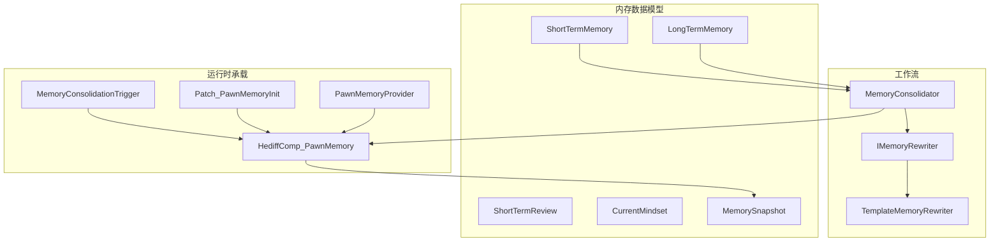
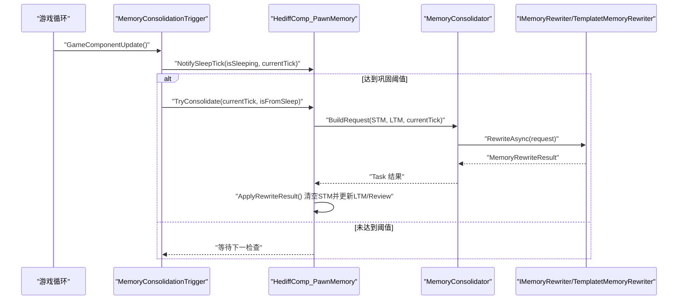
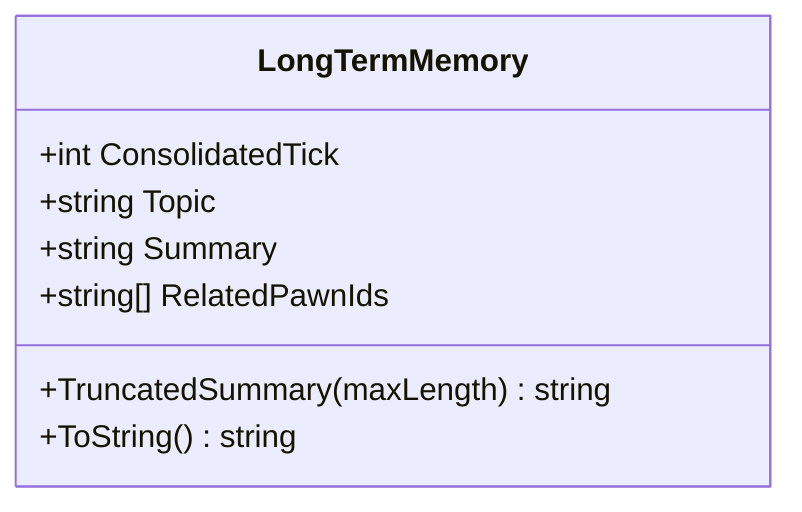
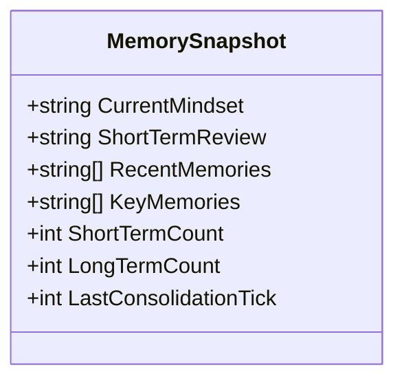
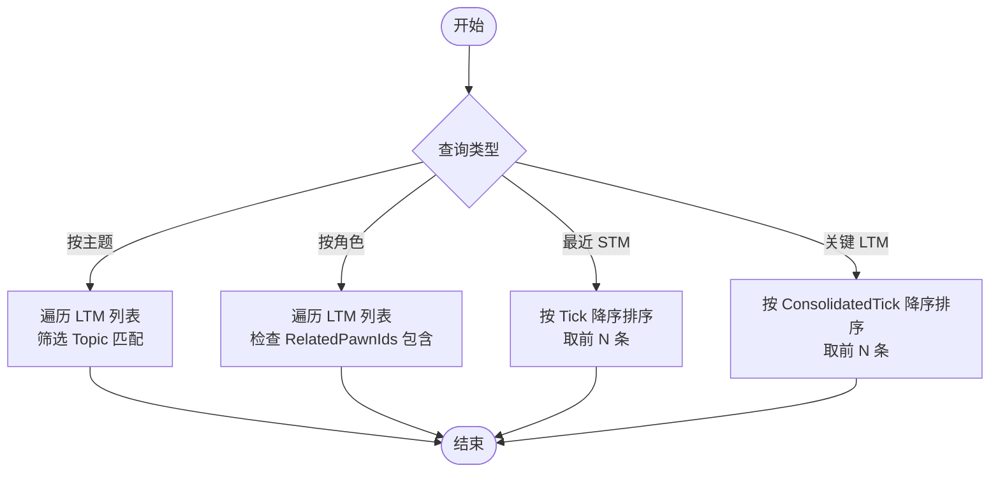
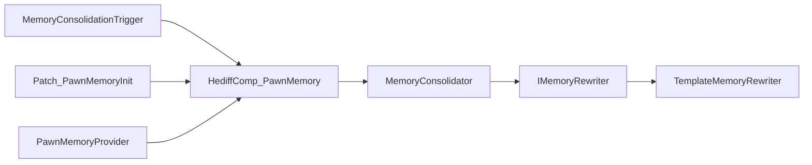

# 长期记忆实现

<cite>
**本文档引用的文件**
- [LongTermMemory.cs](file://Source/Data/PawnPro/Memory/LongTermMemory.cs)
- [ShortTermMemory.cs](file://Source/Data/PawnPro/Memory/ShortTermMemory.cs)
- [ShortTermReview.cs](file://Source/Data/PawnPro/Memory/ShortTermReview.cs)
- [CurrentMindset.cs](file://Source/Data/PawnPro/Memory/CurrentMindset.cs)
- [MemorySnapshot.cs](file://Source/Data/PawnPro/Memory/MemorySnapshot.cs)
- [IMemoryRewriter.cs](file://Source/Data/PawnPro/Memory/IMemoryRewriter.cs)
- [MemoryConsolidator.cs](file://Source/Data/PawnPro/Memory/MemoryConsolidator.cs)
- [TemplateMemoryRewriter.cs](file://Source/Data/PawnPro/Memory/TemplateMemoryRewriter.cs)
- [HediffComp_PawnMemory.cs](file://Source/Data/PawnPro/Memory/HediffComp_PawnMemory.cs)
- [MemoryConsolidationTrigger.cs](file://Source/Data/PawnPro/Memory/MemoryConsolidationTrigger.cs)
- [Patch_PawnMemoryInit.cs](file://Source/Data/PawnPro/Memory/Patch_PawnMemoryInit.cs)
- [PawnMemoryProvider.cs](file://Source/Infrastructure/Mcp/PawnMemoryProvider.cs)
- [PawnMemoryDataStructureTests.cs](file://RimLife.Tests/Memory/PawnMemoryDataStructureTests.cs)
</cite>

## 目录
1. [简介](#简介)
2. [项目结构](#项目结构)
3. [核心组件](#核心组件)
4. [架构总览](#架构总览)
5. [详细组件分析](#详细组件分析)
6. [依赖关系分析](#依赖关系分析)
7. [性能考虑](#性能考虑)
8. [故障排查指南](#故障排查指南)
9. [结论](#结论)
10. [附录](#附录)

## 简介
本文件面向长期记忆实现，围绕 RimLife 项目中的 Pawn 记忆系统，系统化阐述长期记忆（LTM）的数据结构设计、持久化存储格式、数据完整性保障机制，以及与短期记忆（STM）的差异与协作。文档同时覆盖记忆快照（MemorySnapshot）机制、检索与查询接口、序列化规范与版本兼容策略、在角色发展与叙事连续性中的作用，以及性能优化策略（索引、缓存、批量操作等）。

## 项目结构
长期记忆实现位于 Source/Data/PawnPro/Memory 目录，核心文件包括：
- 数据模型：LongTermMemory、ShortTermMemory、ShortTermReview、CurrentMindset、MemorySnapshot
- 工作流：IMemoryRewriter 接口及其实现（TemplateMemoryRewriter）、MemoryConsolidator（两阶段巩固）
- 运行时承载：HediffComp_PawnMemory（记忆容器与序列化）
- 触发与生命周期：MemoryConsolidationTrigger（睡眠/定时触发）、Patch_PawnMemoryInit（Pawn Spawn 初始化）
- 外部集成：PawnMemoryProvider（MCP 工具：追加记忆、更新心境）

图表来源
- [HediffComp_PawnMemory.cs:20-408](file://Source/Data/PawnPro/Memory/HediffComp_PawnMemory.cs#L20-L408)
- [MemoryConsolidator.cs:12-61](file://Source/Data/PawnPro/Memory/MemoryConsolidator.cs#L12-L61)
- [TemplateMemoryRewriter.cs:13-152](file://Source/Data/PawnPro/Memory/TemplateMemoryRewriter.cs#L13-L152)
- [MemoryConsolidationTrigger.cs:15-79](file://Source/Data/PawnPro/Memory/MemoryConsolidationTrigger.cs#L15-L79)
- [Patch_PawnMemoryInit.cs:12-38](file://Source/Data/PawnPro/Memory/Patch_PawnMemoryInit.cs#L12-L38)
- [PawnMemoryProvider.cs:14-94](file://Source/Infrastructure/Mcp/PawnMemoryProvider.cs#L14-L94)

章节来源
- [HediffComp_PawnMemory.cs:20-408](file://Source/Data/PawnPro/Memory/HediffComp_PawnMemory.cs#L20-L408)
- [MemoryConsolidator.cs:12-61](file://Source/Data/PawnPro/Memory/MemoryConsolidator.cs#L12-L61)
- [TemplateMemoryRewriter.cs:13-152](file://Source/Data/PawnPro/Memory/TemplateMemoryRewriter.cs#L13-L152)
- [MemoryConsolidationTrigger.cs:15-79](file://Source/Data/PawnPro/Memory/MemoryConsolidationTrigger.cs#L15-L79)
- [Patch_PawnMemoryInit.cs:12-38](file://Source/Data/PawnPro/Memory/Patch_PawnMemoryInit.cs#L12-L38)
- [PawnMemoryProvider.cs:14-94](file://Source/Infrastructure/Mcp/PawnMemoryProvider.cs#L14-L94)

## 核心组件
- 长期记忆（LongTermMemory）：纯 DTO，包含主题标签、叙述摘要、关联角色集合、最后巩固时刻。支持摘要截断与字符串表示。
- 短期记忆（ShortTermMemory）：纯 DTO，包含发生时刻、类型标签、摘要、关联角色。支持摘要截断与字符串表示。
- 短期回顾（ShortTermReview）：纯 DTO，包含最后更新时刻与客观摘要。
- 即时心境（CurrentMindset）：纯 DTO，包含最后更新时刻与第一人称心理描述。
- 记忆快照（MemorySnapshot）：纯 DTO，提供当前心境、短期回顾、近期短期记忆摘要、关键长期记忆摘要、计数与最后巩固时刻。
- 记忆巩固器（MemoryConsolidator）：两阶段流程协调者，Phase 1 构建 ConsolidationRequest，Phase 2 异步调用 IMemoryRewriter。
- 记忆重写器（IMemoryRewriter/TemplateMemoryRewriter）：将 STM 与现有 LTM 融合，生成新的 LTM 列表与短期回顾。
- 记忆承载组件（HediffComp_PawnMemory）：作为隐藏 Hediff 挂载在每个 Pawn 上，负责序列化四区记忆、触发巩固、查询与快照生成。
- 触发器（MemoryConsolidationTrigger）：周期性检查睡眠状态与时间阈值，驱动巩固。
- 初始化补丁（Patch_PawnMemoryInit）：Pawn Spawn 时自动附加记忆 Hediff。
- MCP 工具（PawnMemoryProvider）：提供追加短期记忆与更新即时心境的工具。

章节来源
- [LongTermMemory.cs:10-51](file://Source/Data/PawnPro/Memory/LongTermMemory.cs#L10-L51)
- [ShortTermMemory.cs:9-47](file://Source/Data/PawnPro/Memory/ShortTermMemory.cs#L9-L47)
- [ShortTermReview.cs:8-31](file://Source/Data/PawnPro/Memory/ShortTermReview.cs#L8-L31)
- [CurrentMindset.cs:10-33](file://Source/Data/PawnPro/Memory/CurrentMindset.cs#L10-L33)
- [MemorySnapshot.cs:12-35](file://Source/Data/PawnPro/Memory/MemorySnapshot.cs#L12-L35)
- [IMemoryRewriter.cs:11-54](file://Source/Data/PawnPro/Memory/IMemoryRewriter.cs#L11-L54)
- [MemoryConsolidator.cs:12-61](file://Source/Data/PawnPro/Memory/MemoryConsolidator.cs#L12-L61)
- [TemplateMemoryRewriter.cs:13-152](file://Source/Data/PawnPro/Memory/TemplateMemoryRewriter.cs#L13-L152)
- [HediffComp_PawnMemory.cs:20-408](file://Source/Data/PawnPro/Memory/HediffComp_PawnMemory.cs#L20-L408)
- [MemoryConsolidationTrigger.cs:15-79](file://Source/Data/PawnPro/Memory/MemoryConsolidationTrigger.cs#L15-L79)
- [Patch_PawnMemoryInit.cs:12-38](file://Source/Data/PawnPro/Memory/Patch_PawnMemoryInit.cs#L12-L38)
- [PawnMemoryProvider.cs:14-94](file://Source/Infrastructure/Mcp/PawnMemoryProvider.cs#L14-L94)

## 架构总览
长期记忆系统采用“短期记忆 → 长期记忆”的两阶段巩固流程。短期记忆作为原始事件流水，按时间窗口与睡眠状态触发巩固；巩固阶段由 MemoryConsolidator 协调，使用 IMemoryRewriter（默认 TemplateMemoryRewriter）进行融合与重写，生成新的长期记忆与短期回顾，并清空短期记忆池。序列化通过 RimWorld 的 Scribe 机制完成，持久化四区记忆。

图表来源
- [MemoryConsolidationTrigger.cs:28-70](file://Source/Data/PawnPro/Memory/MemoryConsolidationTrigger.cs#L28-L70)
- [HediffComp_PawnMemory.cs:232-328](file://Source/Data/PawnPro/Memory/HediffComp_PawnMemory.cs#L232-L328)
- [MemoryConsolidator.cs:28-58](file://Source/Data/PawnPro/Memory/MemoryConsolidator.cs#L28-L58)
- [TemplateMemoryRewriter.cs:15-70](file://Source/Data/PawnPro/Memory/TemplateMemoryRewriter.cs#L15-L70)

## 详细组件分析

### 长期记忆数据结构设计
- 字段与职责
  - ConsolidatedTick：最后重写时刻（游戏 tick），用于排序与检索。
  - Topic：主题标签，如 relationship:ThingID、combat、colony_events 等，用于分组与过滤。
  - Summary：叙述正文（≤500 字），由 LLM 或模板重写器生成。
  - RelatedPawnIds：关联角色 ThingID 列表，支持多角色合并。
- 设计特点
  - 纯 DTO，零外部依赖，便于序列化与跨模块传输。
  - 重要度通过篇幅自然体现，避免显式打分字段。
  - 提供 TruncatedSummary 截断方法，统一长度控制。
- 数据完整性
  - 构造函数对空值进行安全处理，初始化集合为空列表。
  - 序列化时对 RelatedPawnIds 使用分隔符存储，加载时重建列表。

图表来源
- [LongTermMemory.cs:10-51](file://Source/Data/PawnPro/Memory/LongTermMemory.cs#L10-L51)

章节来源
- [LongTermMemory.cs:10-51](file://Source/Data/PawnPro/Memory/LongTermMemory.cs#L10-L51)

### 短期记忆与长期记忆的区别
- 数据保留策略
  - STM：自然上限为巩固后清空，时间窗口 ≤ 24h，避免无限膨胀。
  - LTM：持久化存储，按主题与关联角色组织，容量增长受主题分组与合并策略约束。
- 存储容量限制
  - STM：通过巩固触发清空，天然限界。
  - LTM：无硬性上限，但通过主题标签与摘要截断控制单条大小。
- 访问性能优化
  - 查询接口按 Topic 与 RelatedPawnId 进行过滤，返回只读列表。
  - 快照生成时对摘要进行截断，降低注入 prompt 的 token 消耗。

章节来源
- [ShortTermMemory.cs:9-47](file://Source/Data/PawnPro/Memory/ShortTermMemory.cs#L9-L47)
- [HediffComp_PawnMemory.cs:337-375](file://Source/Data/PawnPro/Memory/HediffComp_PawnMemory.cs#L337-L375)

### 记忆快照与备份策略
- 快照层级
  - 优先读 CurrentMindset（凌驾层），再读 ShortTermReview，必要时向下钻取 RecentMemories / KeyMemories。
- 快照内容
  - CurrentMindset、ShortTermReview、RecentMemories（截断至 120 字）、KeyMemories（截断至 300 字）、计数与最后巩固时刻。
- 备份策略
  - 通过 Scribe 自动序列化四区记忆，随存档持久化，实现天然备份。
  - 序列化时对列表项逐一保存，加载时重建，确保数据一致性。

图表来源
- [MemorySnapshot.cs:12-35](file://Source/Data/PawnPro/Memory/MemorySnapshot.cs#L12-L35)

章节来源
- [MemorySnapshot.cs:12-35](file://Source/Data/PawnPro/Memory/MemorySnapshot.cs#L12-L35)
- [HediffComp_PawnMemory.cs:382-398](file://Source/Data/PawnPro/Memory/HediffComp_PawnMemory.cs#L382-L398)

### 检索算法与查询接口
- 主题标签查询：按 Topic 精确匹配，返回符合条件的 LTM 列表。
- 关联角色查询：按 RelatedPawnId 包含关系匹配，返回符合条件的 LTM 列表。
- 最近 STM 获取：按 Tick 降序取前 N 条。
- 关键 LTM 获取：按 ConsolidatedTick 降序取前 N 条。
- 查询复杂度
  - Topic 查询：O(n) 线性扫描，n 为 LTM 数量。
  - RelatedPawn 查询：O(n×m) 最坏情况，m 为每条 LTM 的 RelatedPawnIds 长度。
  - 可通过索引优化（见性能考虑）。

图表来源
- [HediffComp_PawnMemory.cs:337-375](file://Source/Data/PawnPro/Memory/HediffComp_PawnMemory.cs#L337-L375)

章节来源
- [HediffComp_PawnMemory.cs:337-375](file://Source/Data/PawnPro/Memory/HediffComp_PawnMemory.cs#L337-L375)

### 序列化格式规范与版本兼容
- Scribe 序列化
  - STM：保存数量与每条的 Tick、Type、Summary、RelatedPawnId。
  - LTM：保存数量与每条的 ConsolidatedTick、Topic、Summary、RelatedPawnIds（以分隔符连接）。
  - ShortTermReview：保存 LastUpdateTick 与 Content。
  - CurrentMindset：保存 LastUpdateTick 与 Content。
- 版本兼容
  - 通过 Scribe_Values.Look 的默认值参数维持向后兼容。
  - 加载时对缺失字段使用安全默认值，避免异常。
  - RelatedPawnIds 采用固定分隔符存储，便于未来扩展或迁移。

章节来源
- [HediffComp_PawnMemory.cs:50-176](file://Source/Data/PawnPro/Memory/HediffComp_PawnMemory.cs#L50-L176)

### 角色发展与叙事连续性
- 角色发展
  - LTM 作为叙述性记忆，承载角色的核心关系与重大事件，形成稳定的叙事骨架。
  - CurrentMindset 作为第一人称心理状态，提供角色主观视角，影响后续行为与对话。
- 叙事连续性
  - ConsolidationIntervalTicks（24h）与睡眠阈值（3h）确保定期整合，维持叙事节奏。
  - TemplateMemoryRewriter 的主题标签与摘要合并逻辑，使新旧信息有机融合，避免断裂。

章节来源
- [HediffComp_PawnMemory.cs:22-26](file://Source/Data/PawnPro/Memory/HediffComp_PawnMemory.cs#L22-L26)
- [TemplateMemoryRewriter.cs:75-88](file://Source/Data/PawnPro/Memory/TemplateMemoryRewriter.cs#L75-L88)

### 性能优化策略
- 索引建立
  - 为 Topic 与 RelatedPawnId 建立哈希索引，将查询复杂度降至 O(1)/O(k)（k 为冲突链长度）。
- 缓存机制
  - 对常用查询结果（如最近 N 条）进行短期缓存，减少重复计算。
- 批量操作优化
  - AddShortTermRange 批量追加短期记忆，减少调用开销。
  - Consolidation 采用异步重写，完成后在主线程回写，避免阻塞。
- Token 控制
  - STM/Review/LTM 摘要均设置长度上限，防止 prompt 超长。

章节来源
- [HediffComp_PawnMemory.cs:194-282](file://Source/Data/PawnPro/Memory/HediffComp_PawnMemory.cs#L194-L282)
- [TemplateMemoryRewriter.cs:125-149](file://Source/Data/PawnPro/Memory/TemplateMemoryRewriter.cs#L125-L149)

## 依赖关系分析
- 组件耦合
  - HediffComp_PawnMemory 依赖 MemoryConsolidator 与 IMemoryRewriter，承担序列化与查询职责。
  - MemoryConsolidator 依赖 IMemoryRewriter，默认实现为 TemplateMemoryRewriter。
  - MemoryConsolidationTrigger 依赖 GameComponent 生命周期，周期性通知各 Pawn 的睡眠状态。
  - Patch_PawnMemoryInit 依赖 Harmony，确保 Pawn Spawn 时附加记忆 Hediff。
  - PawnMemoryProvider 通过 MCP 工具向外部暴露记忆写入能力。
- 外部依赖
  - RimWorld 的 Scribe、Hediff、TickManager 等基础设施。
  - NPCLife 的框架与工具（用于日志与 JSON 处理）。

图表来源
- [MemoryConsolidationTrigger.cs:15-79](file://Source/Data/PawnPro/Memory/MemoryConsolidationTrigger.cs#L15-L79)
- [Patch_PawnMemoryInit.cs:12-38](file://Source/Data/PawnPro/Memory/Patch_PawnMemoryInit.cs#L12-L38)
- [PawnMemoryProvider.cs:14-94](file://Source/Infrastructure/Mcp/PawnMemoryProvider.cs#L14-L94)
- [HediffComp_PawnMemory.cs:20-408](file://Source/Data/PawnPro/Memory/HediffComp_PawnMemory.cs#L20-L408)
- [MemoryConsolidator.cs:12-61](file://Source/Data/PawnPro/Memory/MemoryConsolidator.cs#L12-L61)
- [TemplateMemoryRewriter.cs:13-152](file://Source/Data/PawnPro/Memory/TemplateMemoryRewriter.cs#L13-L152)

章节来源
- [MemoryConsolidationTrigger.cs:15-79](file://Source/Data/PawnPro/Memory/MemoryConsolidationTrigger.cs#L15-L79)
- [Patch_PawnMemoryInit.cs:12-38](file://Source/Data/PawnPro/Memory/Patch_PawnMemoryInit.cs#L12-L38)
- [PawnMemoryProvider.cs:14-94](file://Source/Infrastructure/Mcp/PawnMemoryProvider.cs#L14-L94)
- [HediffComp_PawnMemory.cs:20-408](file://Source/Data/PawnPro/Memory/HediffComp_PawnMemory.cs#L20-L408)
- [MemoryConsolidator.cs:12-61](file://Source/Data/PawnPro/Memory/MemoryConsolidator.cs#L12-L61)
- [TemplateMemoryRewriter.cs:13-152](file://Source/Data/PawnPro/Memory/TemplateMemoryRewriter.cs#L13-L152)

## 性能考虑
- 时间复杂度
  - 查询：线性扫描为主，建议引入索引提升热点查询性能。
- 内存占用
  - LTM 摘要长度上限与 RelatedPawnIds 去重，控制单条与整体体积。
- I/O 与序列化
  - Scribe 逐项序列化，批量写入时注意避免频繁 IO。
- 异步与并发
  - 巩固过程异步执行，防止主线程阻塞；内部使用防重入标志避免并发问题。

## 故障排查指南
- 巩固失败
  - 现象：日志出现 Consolidation rewrite failed。
  - 排查：检查 MemoryConsolidator.RewriteAsync 返回结果与异常堆栈；确认 IMemoryRewriter 实现可用。
- 序列化异常
  - 现象：加载存档时报错或数据丢失。
  - 排查：确认 Scribe_Values.Look 的键名与默认值一致；检查 RelatedPawnIds 分隔符是否正确。
- 查询结果为空
  - 现象：按 Topic/RelatedPawn 查询无结果。
  - 排查：确认输入参数非空；检查主题标签格式与关联角色 ID 是否匹配。
- 快照内容异常
  - 现象：快照中摘要过长或为空。
  - 排查：确认 TruncatedSummary 截断逻辑；检查 ShortTermCount/LongTermCount 是否为预期。

章节来源
- [HediffComp_PawnMemory.cs:257-281](file://Source/Data/PawnPro/Memory/HediffComp_PawnMemory.cs#L257-L281)
- [PawnMemoryDataStructureTests.cs:11-192](file://RimLife.Tests/Memory/PawnMemoryDataStructureTests.cs#L11-L192)

## 结论
长期记忆系统通过短期记忆与长期记忆的清晰分工、两阶段巩固流程与严格的序列化机制，实现了稳定的角色叙事与高效的数据管理。当前实现以纯 DTO 与模板重写器为核心，具备良好的可扩展性与可维护性。建议在未来引入索引与缓存机制，进一步优化查询性能，并完善 LLM 重写器以增强叙述质量与一致性。

## 附录
- 测试验证
  - 数据结构测试覆盖 ShortTermMemory、LongTermMemory、ShortTermReview、CurrentMindset 的构造、属性与截断行为，确保实现正确性与边界处理。

章节来源
- [PawnMemoryDataStructureTests.cs:11-192](file://RimLife.Tests/Memory/PawnMemoryDataStructureTests.cs#L11-L192)