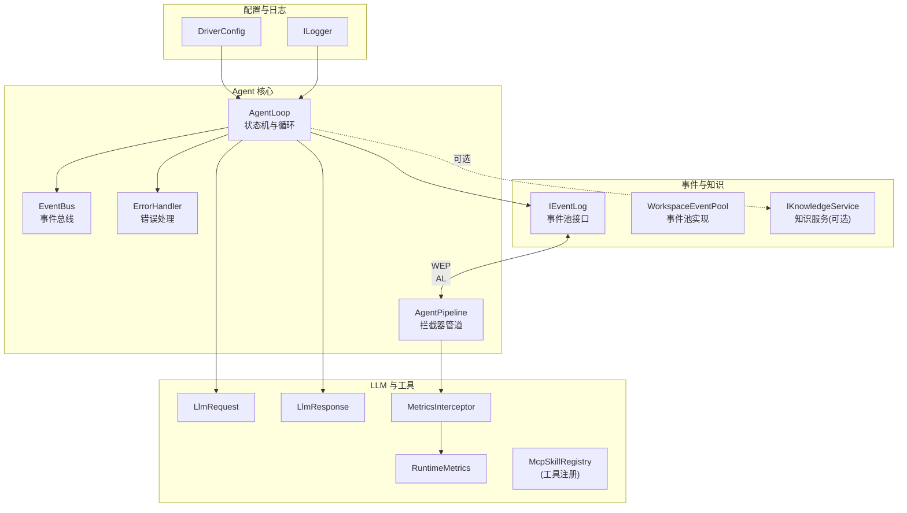
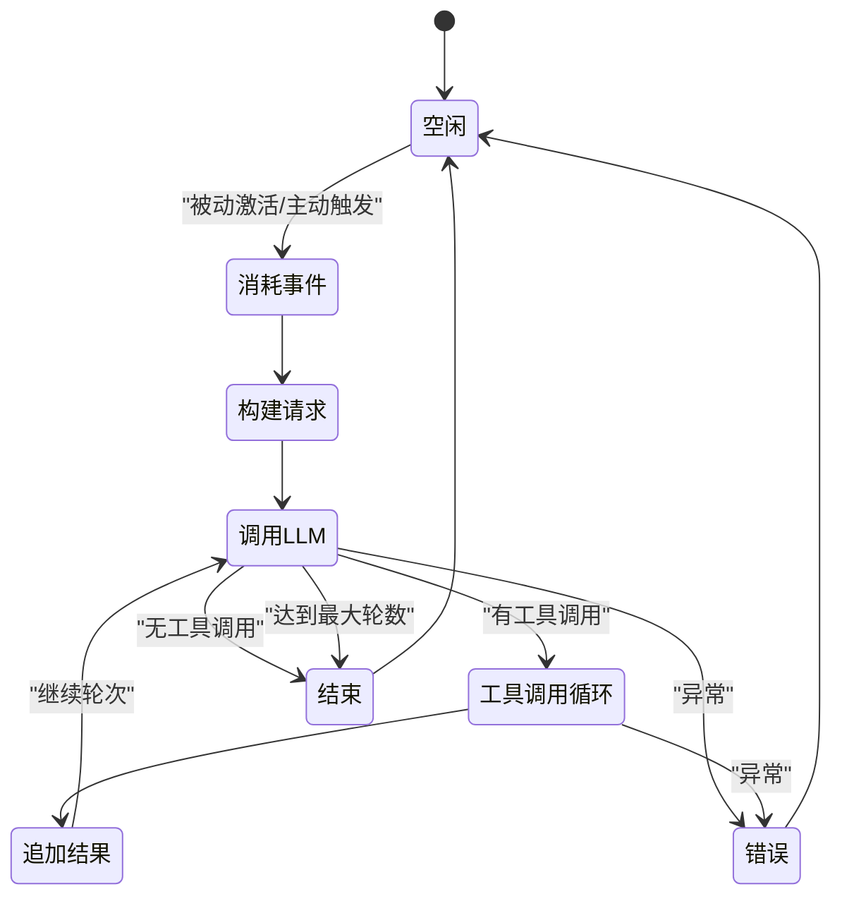
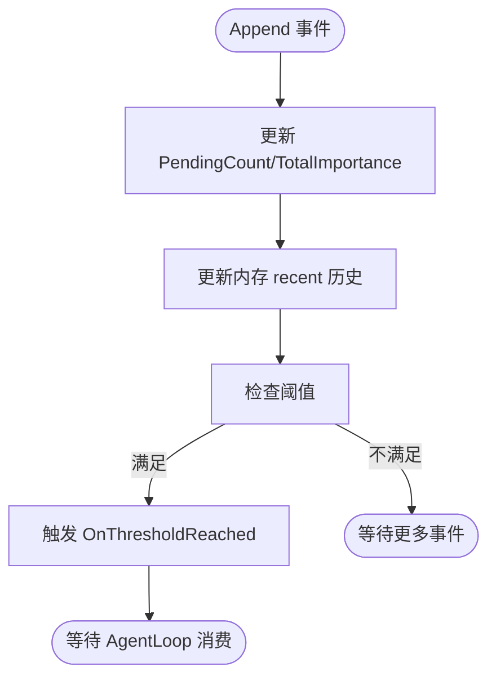
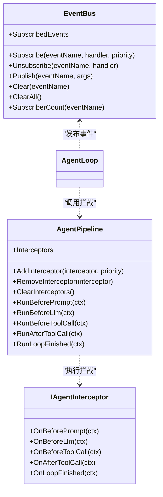
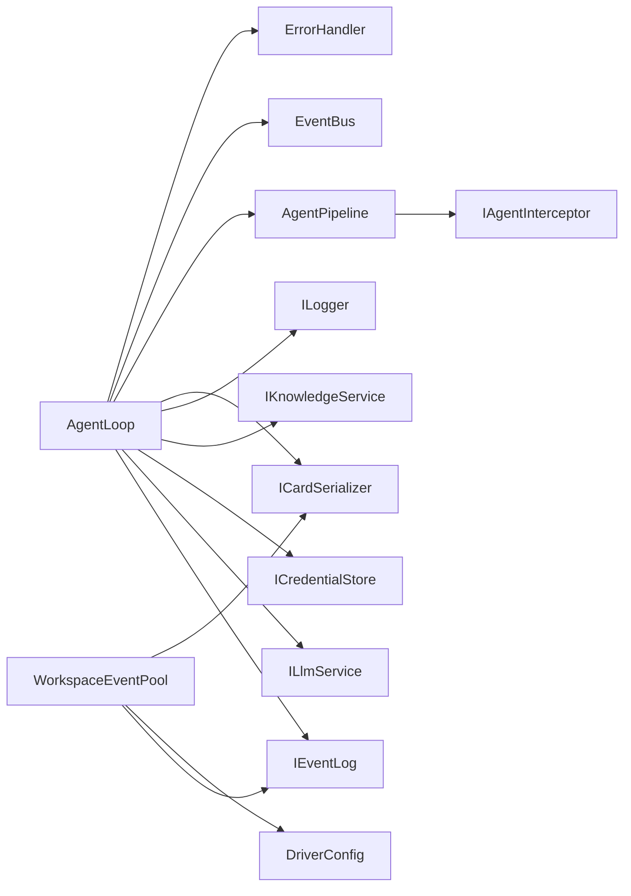

# AgentLoop 循环机制

<cite>
**本文引用的文件**
- [AgentLoop.cs](file://ext/NPCLife/src/NPCLife/Agent/AgentLoop.cs)
- [AgentPipeline.cs](file://ext/NPCLife/src/NPCLife/Framework/AgentPipeline.cs)
- [EventBus.cs](file://ext/NPCLife/src/NPCLife/Framework/EventBus.cs)
- [WorkspaceEventPool.cs](file://ext/NPCLife/src/NPCLife/Workspace/WorkspaceEventPool.cs)
- [IEventLog.cs](file://ext/NPCLife/src/NPCLife/Core/IEventLog.cs)
- [LlmRequest.cs](file://ext/NPCLife/src/NPCLife/Framework/Llm/LlmRequest.cs)
- [LlmResponse.cs](file://ext/NPCLife/src/NPCLife/Framework/Llm/LlmResponse.cs)
- [MetricsInterceptor.cs](file://ext/NPCLife/src/NPCLife/Framework/MetricsInterceptor.cs)
- [RuntimeMetrics.cs](file://ext/NPCLife/src/NPCLife/Framework/RuntimeMetrics.cs)
- [DriverConfig.cs](file://ext/NPCLife/src/NPCLife/Driver/DriverConfig.cs)
- [ErrorHandler.cs](file://ext/NPCLife/src/NPCLife/Framework/ErrorHandler.cs)
- [ILogger.cs](file://ext/NPCLife/src/NPCLife/Framework/ILogger.cs)
</cite>

## 目录
1. [简介](#简介)
2. [项目结构](#项目结构)
3. [核心组件](#核心组件)
4. [架构总览](#架构总览)
5. [详细组件分析](#详细组件分析)
6. [依赖关系分析](#依赖关系分析)
7. [性能考量](#性能考量)
8. [故障排查指南](#故障排查指南)
9. [结论](#结论)
10. [附录](#附录)

## 简介
本文件系统化阐述 AgentLoop 的循环机制与状态机实现，涵盖事件池绑定、被动激活与主动触发、LLM 集成、工具调用循环、事件总线发布订阅、拦截器管道、错误处理与度量统计，并给出配置参数说明与监控调试建议。

## 项目结构
围绕 AgentLoop 的关键文件组织如下：
- AgentLoop：核心循环与状态机，负责事件池消费、提示词构建、LLM 请求、工具调用循环、结果追加与收尾。
- AgentPipeline：拦截器管道，提供 BeforePrompt、BeforeLlm、BeforeToolCall、AfterToolCall、LoopFinished 等拦截点。
- EventBus：全局事件总线，用于发布/订阅框架事件，贯穿生命周期与工具调用。
- WorkspaceEventPool：事件池实现，基于 IEventLog 接口，支持阈值触发与 DrainPending。
- IEventLog：事件池抽象接口，定义阈值触发与事件取出语义。
- LlmRequest/LlmResponse：LLM 请求/响应的统一数据结构。
- MetricsInterceptor/RuntimeMetrics：运行时度量拦截与聚合。
- DriverConfig：驱动配置，包含事件池阈值、最大轮数等。
- ErrorHandler：全局错误处理与链路追踪。
- ILogger：日志接口抽象。



**图表来源**
- [AgentLoop.cs:1-680](file://ext/NPCLife/src/NPCLife/Agent/AgentLoop.cs#L1-L680)
- [AgentPipeline.cs:1-248](file://ext/NPCLife/src/NPCLife/Framework/AgentPipeline.cs#L1-L248)
- [EventBus.cs:1-243](file://ext/NPCLife/src/NPCLife/Framework/EventBus.cs#L1-L243)
- [WorkspaceEventPool.cs:1-186](file://ext/NPCLife/src/NPCLife/Workspace/WorkspaceEventPool.cs#L1-L186)
- [IEventLog.cs:1-52](file://ext/NPCLife/src/NPCLife/Core/IEventLog.cs#L1-L52)
- [LlmRequest.cs:1-46](file://ext/NPCLife/src/NPCLife/Framework/Llm/LlmRequest.cs#L1-L46)
- [LlmResponse.cs:1-58](file://ext/NPCLife/src/NPCLife/Framework/Llm/LlmResponse.cs#L1-L58)
- [MetricsInterceptor.cs:1-110](file://ext/NPCLife/src/NPCLife/Framework/MetricsInterceptor.cs#L1-L110)
- [RuntimeMetrics.cs:1-649](file://ext/NPCLife/src/NPCLife/Framework/RuntimeMetrics.cs#L1-L649)
- [DriverConfig.cs:1-107](file://ext/NPCLife/src/NPCLife/Driver/DriverConfig.cs#L1-L107)
- [ErrorHandler.cs:1-207](file://ext/NPCLife/src/NPCLife/Framework/ErrorHandler.cs#L1-L207)
- [ILogger.cs:1-20](file://ext/NPCLife/src/NPCLife/Framework/ILogger.cs#L1-L20)

**章节来源**
- [AgentLoop.cs:1-680](file://ext/NPCLife/src/NPCLife/Agent/AgentLoop.cs#L1-L680)
- [AgentPipeline.cs:1-248](file://ext/NPCLife/src/NPCLife/Framework/AgentPipeline.cs#L1-L248)
- [EventBus.cs:1-243](file://ext/NPCLife/src/NPCLife/Framework/EventBus.cs#L1-L243)
- [WorkspaceEventPool.cs:1-186](file://ext/NPCLife/src/NPCLife/Workspace/WorkspaceEventPool.cs#L1-L186)
- [IEventLog.cs:1-52](file://ext/NPCLife/src/NPCLife/Core/IEventLog.cs#L1-L52)
- [LlmRequest.cs:1-46](file://ext/NPCLife/src/NPCLife/Framework/Llm/LlmRequest.cs#L1-L46)
- [LlmResponse.cs:1-58](file://ext/NPCLife/src/NPCLife/Framework/Llm/LlmResponse.cs#L1-L58)
- [MetricsInterceptor.cs:1-110](file://ext/NPCLife/src/NPCLife/Framework/MetricsInterceptor.cs#L1-L110)
- [RuntimeMetrics.cs:1-649](file://ext/NPCLife/src/NPCLife/Framework/RuntimeMetrics.cs#L1-L649)
- [DriverConfig.cs:1-107](file://ext/NPCLife/src/NPCLife/Driver/DriverConfig.cs#L1-L107)
- [ErrorHandler.cs:1-207](file://ext/NPCLife/src/NPCLife/Framework/ErrorHandler.cs#L1-L207)
- [ILogger.cs:1-20](file://ext/NPCLife/src/NPCLife/Framework/ILogger.cs#L1-L20)

## 核心组件
- AgentLoop：显式状态机，包含 Idle、DrainingEvents、BuildingRequest、CallingLlm、ExecutingTools、AppendingToolResults、Finishing、Error 等状态；通过信号量防重入，CancellationToken 贯穿链路；支持被动激活（事件池阈值达到）与主动触发。
- AgentPipeline：拦截器管道，提供 BeforePrompt、BeforeLlm、BeforeToolCall、AfterToolCall、LoopFinished 五级拦截，支持优先级排序与错误隔离。
- EventBus：命名空间事件名、优先级排序、错误隔离的发布/订阅总线，贯穿 Agent 生命周期与工具调用。
- WorkspaceEventPool：实现 IEventLog，双缓冲（持久化 pending + 内存 recent），阈值触发 OnThresholdReached。
- LlmRequest/LlmResponse：统一请求/响应结构，支持工具调用、Token 消耗与错误标识。
- MetricsInterceptor/RuntimeMetrics：在关键节点采集工具调用、会话、Token 与 Agent 循环统计。
- DriverConfig：分角色阈值、最大轮数、历史缓冲容量等配置。
- ErrorHandler：全局错误处理、链路追踪与错误事件发布。
- ILogger：日志接口抽象。

**章节来源**
- [AgentLoop.cs:19-680](file://ext/NPCLife/src/NPCLife/Agent/AgentLoop.cs#L19-L680)
- [AgentPipeline.cs:18-248](file://ext/NPCLife/src/NPCLife/Framework/AgentPipeline.cs#L18-L248)
- [EventBus.cs:17-243](file://ext/NPCLife/src/NPCLife/Framework/EventBus.cs#L17-L243)
- [WorkspaceEventPool.cs:21-186](file://ext/NPCLife/src/NPCLife/Workspace/WorkspaceEventPool.cs#L21-L186)
- [IEventLog.cs:12-52](file://ext/NPCLife/src/NPCLife/Core/IEventLog.cs#L12-L52)
- [LlmRequest.cs:9-46](file://ext/NPCLife/src/NPCLife/Framework/Llm/LlmRequest.cs#L9-L46)
- [LlmResponse.cs:9-58](file://ext/NPCLife/src/NPCLife/Framework/Llm/LlmResponse.cs#L9-L58)
- [MetricsInterceptor.cs:13-110](file://ext/NPCLife/src/NPCLife/Framework/MetricsInterceptor.cs#L13-L110)
- [RuntimeMetrics.cs:29-649](file://ext/NPCLife/src/NPCLife/Framework/RuntimeMetrics.cs#L29-L649)
- [DriverConfig.cs:9-107](file://ext/NPCLife/src/NPCLife/Driver/DriverConfig.cs#L9-L107)
- [ErrorHandler.cs:22-207](file://ext/NPCLife/src/NPCLife/Framework/ErrorHandler.cs#L22-L207)
- [ILogger.cs:8-20](file://ext/NPCLife/src/NPCLife/Framework/ILogger.cs#L8-L20)

## 架构总览
AgentLoop 作为纯逻辑组件，依赖 IEventLog 获取事件，通过 AgentPipeline 在关键阶段注入行为，借助 EventBus 发布事件，使用 LlmService 与 LlmRequest/LlmResponse 协作，结合 MetricsInterceptor/RuntimeMetrics 进行度量，通过 ErrorHandler 统一错误处理。

```mermaid
sequenceDiagram
participant Pool as "事件池(IEventLog)"
participant Loop as "AgentLoop"
participant Pipe as "AgentPipeline"
participant Bus as "EventBus"
participant Llm as "ILlmService"
participant Tools as "McpSkillRegistry"
Pool-->>Loop : "OnThresholdReached"
Loop->>Loop : "进入 RunOnceAsync"
Loop->>Bus : "发布 AgentActivated"
Loop->>Pool : "DrainPending()"
Loop->>Loop : "构建消息历史"
Loop->>Pipe : "BeforeLlm"
Loop->>Bus : "发布 LlmRequestSent"
Loop->>Llm : "ChatAsync(request, credentials)"
Llm-->>Loop : "LlmResponse"
Loop->>Bus : "发布 LlmResponseReceived"
alt "有工具调用"
Loop->>Tools : "遍历 ToolCalls 并调用"
Tools-->>Loop : "工具结果(JSON)"
Loop->>Pipe : "AfterToolCall"
Loop->>Bus : "发布 ToolInvoking/ToolInvoked"
else "无工具调用"
Loop->>Loop : "追加 assistant 消息"
end
Loop->>Pipe : "LoopFinished"
Loop->>Bus : "发布 AgentLoopFinished"
Loop->>Loop : "重置状态为空闲"
```

**图表来源**
- [AgentLoop.cs:174-340](file://ext/NPCLife/src/NPCLife/Agent/AgentLoop.cs#L174-L340)
- [AgentPipeline.cs:179-236](file://ext/NPCLife/src/NPCLife/Framework/AgentPipeline.cs#L179-L236)
- [EventBus.cs:86-113](file://ext/NPCLife/src/NPCLife/Framework/EventBus.cs#L86-L113)
- [LlmRequest.cs:9-46](file://ext/NPCLife/src/NPCLife/Framework/Llm/LlmRequest.cs#L9-L46)
- [LlmResponse.cs:9-58](file://ext/NPCLife/src/NPCLife/Framework/Llm/LlmResponse.cs#L9-L58)

## 详细组件分析

### AgentLoop 状态机与生命周期
- 状态枚举：Idle、DrainingEvents、BuildingRequest、CallingLlm、ExecutingTools、AppendingToolResults、Finishing、Error。
- 主循环 RunOnceAsync：
  - DrainingEvents：发布 AgentActivated，DrainPending，若无事件则回到 Idle。
  - BuildingRequest：构建系统消息与用户消息，解析凭证。
  - CallingLlm：构建 LlmRequest，执行 BeforeLlm 拦截，发布 LlmRequestSent，调用 ChatAsync，发布 LlmResponseReceived。
  - ExecutingTools：遍历 ToolCalls，执行 BeforeToolCall/AfterToolCall 拦截，发布 ToolInvoking/ToolInvoked，调用 McpSkillRegistry。
  - AppendingToolResults：追加 assistant 与 tool results，发布 AgentRoundComplete。
  - Finishing/Error：统一成功/失败路径，发布 AgentLoopFinished，清理资源，释放信号量。
- 防重入：SemaphoreSlim(1,1)，非阻塞获取。
- 取消与销毁：CancellationTokenSource，Dispose 等待当前任务完成并清理。



**图表来源**
- [AgentLoop.cs:19-340](file://ext/NPCLife/src/NPCLife/Agent/AgentLoop.cs#L19-L340)

**章节来源**
- [AgentLoop.cs:174-340](file://ext/NPCLife/src/NPCLife/Agent/AgentLoop.cs#L174-L340)

### 事件池绑定与被动激活
- WorkspaceEventPool 实现 IEventLog，支持：
  - Append：写入持久化 pending 与内存 recent，维护 PendingCount/TotalImportance。
  - CheckThreshold：根据 DriverConfig 的分角色阈值计算有效阈值，满足任一阈值触发 OnThresholdReached。
  - DrainPending：取出并清空 pending，重置计数器。
- AgentLoop 订阅 OnThresholdReached，被动激活 RunOnceAsync。
- IEventLog 抽象定义了阈值触发与 DrainPending 语义。



**图表来源**
- [WorkspaceEventPool.cs:49-90](file://ext/NPCLife/src/NPCLife/Workspace/WorkspaceEventPool.cs#L49-L90)
- [IEventLog.cs:34-49](file://ext/NPCLife/src/NPCLife/Core/IEventLog.cs#L34-L49)
- [DriverConfig.cs:54-101](file://ext/NPCLife/src/NPCLife/Driver/DriverConfig.cs#L54-L101)

**章节来源**
- [WorkspaceEventPool.cs:21-186](file://ext/NPCLife/src/NPCLife/Workspace/WorkspaceEventPool.cs#L21-L186)
- [IEventLog.cs:12-52](file://ext/NPCLife/src/NPCLife/Core/IEventLog.cs#L12-L52)
- [DriverConfig.cs:9-107](file://ext/NPCLife/src/NPCLife/Driver/DriverConfig.cs#L9-L107)

### 主动触发接口
- TriggerAsync：仅在空闲状态下尝试获取信号量并启动 RunOnceAsync，支持外部主动触发。
- 与被动激活的区别：被动激活来自事件池阈值，主动触发来自外部调用方。

**章节来源**
- [AgentLoop.cs:148-168](file://ext/NPCLife/src/NPCLife/Agent/AgentLoop.cs#L148-L168)

### LLM 集成与工具调用循环
- 请求构建：BuildLlmRequest，设置 Messages、ToolsJson、Temperature。
- 调用前拦截：AgentPipeline.RunBeforeLlm 修改请求。
- 响应处理：验证响应是否成功，发布 LlmResponseReceived。
- 工具调用循环：
  - BeforeToolCall：可取消本次调用。
  - McpSkillRegistry.InvokeTool 执行工具。
  - AfterToolCall：可改写结果。
  - 追加 assistant 与 tool results，发布 AgentRoundComplete。
- 最大轮数：超过 _maxRounds 时仍追加 assistant 并退出。

```mermaid
sequenceDiagram
participant Loop as "AgentLoop"
participant Pipe as "AgentPipeline"
participant Llm as "ILlmService"
participant Tools as "McpSkillRegistry"
participant Bus as "EventBus"
Loop->>Loop : "BuildLlmRequest()"
Loop->>Pipe : "RunBeforeLlm(ctx)"
Loop->>Bus : "发布 LlmRequestSent"
Loop->>Llm : "ChatAsync(request, credentials)"
Llm-->>Loop : "LlmResponse"
Loop->>Bus : "发布 LlmResponseReceived"
alt "HasToolCalls"
Loop->>Loop : "遍历 ToolCalls"
Loop->>Pipe : "RunBeforeToolCall(ctx)"
alt "未取消"
Loop->>Tools : "InvokeTool(name, args)"
Tools-->>Loop : "result(JSON)"
else "已取消"
Loop->>Loop : "result = {error : cancelled}"
end
Loop->>Pipe : "RunAfterToolCall(ctx)"
Loop->>Bus : "发布 ToolInvoking/ToolInvoked"
Loop->>Loop : "追加 assistant + tool results"
else "无工具调用"
Loop->>Loop : "追加 assistant(content)"
end
```

**图表来源**
- [AgentLoop.cs:224-321](file://ext/NPCLife/src/NPCLife/Agent/AgentLoop.cs#L224-L321)
- [AgentPipeline.cs:190-236](file://ext/NPCLife/src/NPCLife/Framework/AgentPipeline.cs#L190-L236)
- [LlmRequest.cs:9-46](file://ext/NPCLife/src/NPCLife/Framework/Llm/LlmRequest.cs#L9-L46)
- [LlmResponse.cs:9-58](file://ext/NPCLife/src/NPCLife/Framework/Llm/LlmResponse.cs#L9-L58)

**章节来源**
- [AgentLoop.cs:444-452](file://ext/NPCLife/src/NPCLife/Agent/AgentLoop.cs#L444-L452)
- [AgentLoop.cs:269-321](file://ext/NPCLife/src/NPCLife/Agent/AgentLoop.cs#L269-L321)

### 事件总线发布订阅与拦截机制
- EventBus：Subscribe/Unsubscribe/Publish，支持优先级排序与错误隔离。
- 预定义事件：agent.activated、agent.round_complete、agent.loop_finished、tool.invoking、tool.invoked、llm.request_sent、llm.response_received、llm.error 等。
- AgentPipeline：RunBeforePrompt/RunBeforeLlm/RunBeforeToolCall/RunAfterToolCall/RunLoopFinished，按优先级执行，异常隔离。



**图表来源**
- [EventBus.cs:17-243](file://ext/NPCLife/src/NPCLife/Framework/EventBus.cs#L17-L243)
- [AgentPipeline.cs:18-248](file://ext/NPCLife/src/NPCLife/Framework/AgentPipeline.cs#L18-L248)

**章节来源**
- [EventBus.cs:17-243](file://ext/NPCLife/src/NPCLife/Framework/EventBus.cs#L17-L243)
- [AgentPipeline.cs:18-248](file://ext/NPCLife/src/NPCLife/Framework/AgentPipeline.cs#L18-L248)

### 错误处理策略
- 统一错误路径：FailAndRequeue，回灌已 drain 的事件，发布 AgentLoopFinished，记录错误并调用 ErrorHandler.ReportError。
- 取消处理：捕获 OperationCanceledException 并按取消处理。
- 诊断追踪：BeginTrace/EndTrace，配合 ErrorHandler.DiagnosticMode 输出详细上下文。
- 错误事件：发布 FrameworkEvents.LlmError。

**章节来源**
- [AgentLoop.cs:373-399](file://ext/NPCLife/src/NPCLife/Agent/AgentLoop.cs#L373-L399)
- [ErrorHandler.cs:22-207](file://ext/NPCLife/src/NPCLife/Framework/ErrorHandler.cs#L22-L207)

### 配置参数详解
- 最大轮数限制：DriverConfig.MaxAgentRounds（默认 10），用于防止工具调用死循环。
- 温度参数控制：AgentLoop 构造时传入 temperature（默认 0.7），随 LlmRequest 发送。
- 超时设置：通过 CancellationToken 传递至 RunOnceAsync 与 ChatAsync，支持外部取消。
- 事件池阈值：DriverConfig 分角色阈值（Director/Screenwriter/Freelancer），按 WorkspaceRole 计算有效阈值。
- 历史缓冲容量：DriverConfig.RecentHistoryCapacity（默认 200），用于内存 recent 历史裁剪。

**章节来源**
- [DriverConfig.cs:45-101](file://ext/NPCLife/src/NPCLife/Driver/DriverConfig.cs#L45-L101)
- [AgentLoop.cs:87-119](file://ext/NPCLife/src/NPCLife/Agent/AgentLoop.cs#L87-L119)
- [LlmRequest.cs:20-21](file://ext/NPCLife/src/NPCLife/Framework/Llm/LlmRequest.cs#L20-L21)

### 监控与调试示例
- 订阅生命周期事件：使用 EventBus.Subscribe 订阅 FrameworkEvents 下的事件，如 agent.activated、agent.round_complete、agent.loop_finished、llm.request_sent、llm.response_received、tool.invoking、tool.invoked。
- 订阅错误事件：订阅 llm.error，结合 ErrorHandler.CurrentTraceId 进行问题定位。
- 度量采集：通过 MetricsInterceptor 与 RuntimeMetrics 获取工具调用次数、成功率、Token 消耗、Agent 循环统计等。
- 日志输出：通过 ILogger 注入实现，结合 ErrorHandler.DiagnosticMode 输出详细链路信息。

**章节来源**
- [EventBus.cs:38-113](file://ext/NPCLife/src/NPCLife/Framework/EventBus.cs#L38-L113)
- [MetricsInterceptor.cs:13-110](file://ext/NPCLife/src/NPCLife/Framework/MetricsInterceptor.cs#L13-L110)
- [RuntimeMetrics.cs:29-649](file://ext/NPCLife/src/NPCLife/Framework/RuntimeMetrics.cs#L29-L649)
- [ErrorHandler.cs:42-71](file://ext/NPCLife/src/NPCLife/Framework/ErrorHandler.cs#L42-L71)
- [ILogger.cs:8-20](file://ext/NPCLife/src/NPCLife/Framework/ILogger.cs#L8-L20)

## 依赖关系分析
- AgentLoop 依赖：
  - IEventLog（事件池）、ILlmService（LLM 服务）、ICredentialStore（凭证）、IKnowledgeService（知识服务，可选）、ILogger（日志）、ICardSerializer（序列化）、McpSkillRegistry（工具注册）。
- AgentPipeline 依赖：
  - IAgentInterceptor（拦截器接口）、ILogger（日志，可选）。
- EventBus 与 ErrorHandler 为纯静态组件，零外部依赖。
- WorkspaceEventPool 实现 IEventLog，依赖 DriverConfig 与 ICardSerializer。



**图表来源**
- [AgentLoop.cs:43-119](file://ext/NPCLife/src/NPCLife/Agent/AgentLoop.cs#L43-L119)
- [AgentPipeline.cs:18-57](file://ext/NPCLife/src/NPCLife/Framework/AgentPipeline.cs#L18-L57)
- [WorkspaceEventPool.cs:21-43](file://ext/NPCLife/src/NPCLife/Workspace/WorkspaceEventPool.cs#L21-L43)

**章节来源**
- [AgentLoop.cs:43-119](file://ext/NPCLife/src/NPCLife/Agent/AgentLoop.cs#L43-L119)
- [AgentPipeline.cs:18-57](file://ext/NPCLife/src/NPCLife/Framework/AgentPipeline.cs#L18-L57)
- [WorkspaceEventPool.cs:21-43](file://ext/NPCLife/src/NPCLife/Workspace/WorkspaceEventPool.cs#L21-L43)

## 性能考量
- 事件池阈值：合理设置分角色阈值，避免过早或过晚触发导致频繁/低效激活。
- 最大轮数：防止工具调用死循环，平衡响应质量与成本。
- 令牌统计：通过 RuntimeMetrics 与 EventBus llm.response_received 事件统计 Token 消耗，优化提示词长度与工具调用频率。
- 知识服务：批量关键词查询与缺失词条提示可减少重复检索，提升效率。
- 拦截器链：拦截器数量与优先级排序会影响延迟，建议最小化必要拦截器。

## 故障排查指南
- 观察事件流：订阅 agent.activated、agent.round_complete、agent.loop_finished、llm.error 等事件，定位异常阶段。
- 检查凭证：ResolveCredentials 失败会导致无法调用 LLM，确认模型引用与全局凭证配置。
- 工具调用：关注 tool.invoking/tool.invoked 事件，结合 MetricsInterceptor 判断成功率与耗时。
- 取消与重试：触发取消时会 FailAndRequeue，检查 CancellationToken 传播路径。
- 诊断模式：开启 ErrorHandler.DiagnosticMode，查看 BeginTrace/EndTrace 与详细日志。

**章节来源**
- [EventBus.cs:186-242](file://ext/NPCLife/src/NPCLife/Framework/EventBus.cs#L186-L242)
- [AgentLoop.cs:569-607](file://ext/NPCLife/src/NPCLife/Agent/AgentLoop.cs#L569-L607)
- [ErrorHandler.cs:42-71](file://ext/NPCLife/src/NPCLife/Framework/ErrorHandler.cs#L42-L71)

## 结论
AgentLoop 通过显式状态机与事件驱动实现了稳定的循环机制，结合拦截器管道、事件总线与度量系统，提供了可观测、可扩展、可诊断的 Agent 执行框架。通过合理的配置与监控，可在保证稳定性的同时优化性能与成本。

## 附录
- 关键事件名参考：FrameworkEvents 下的 agent.*、tool.*、llm.*、workspace.* 等。
- 拦截器优先级：数值越小优先级越高，按顺序执行，任一 BeforeToolCall 取消可跳过工具调用。
- 提示词构建：支持动态上下文提供者与知识服务注入，增强 LLM 上下文完整性。