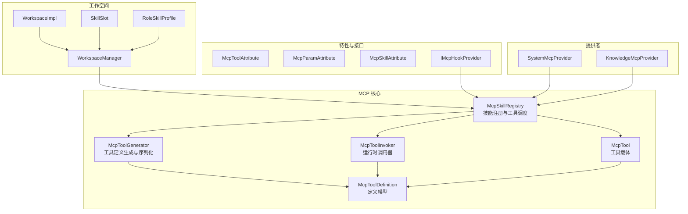
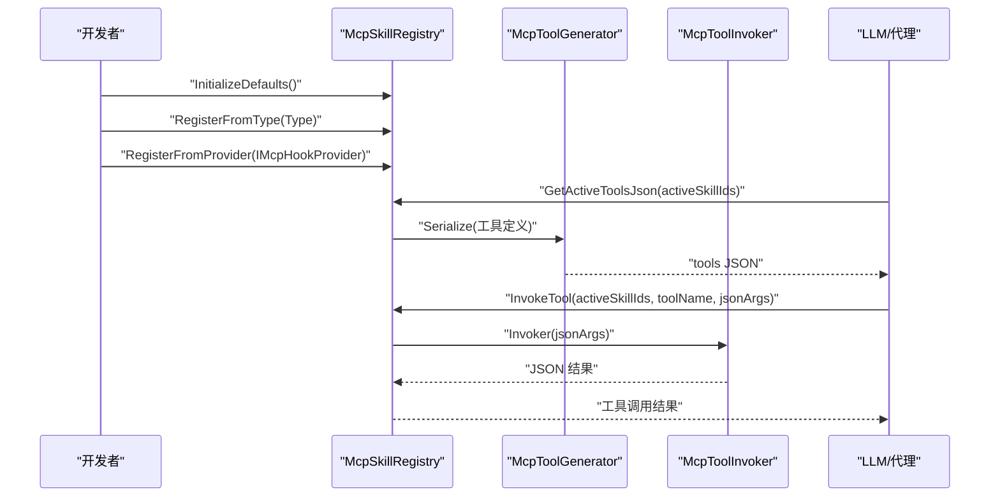
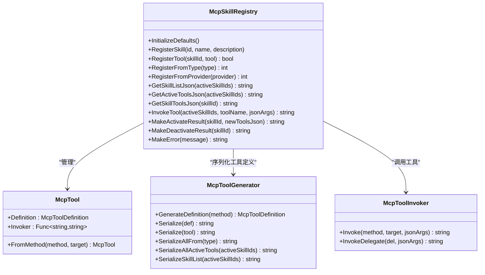
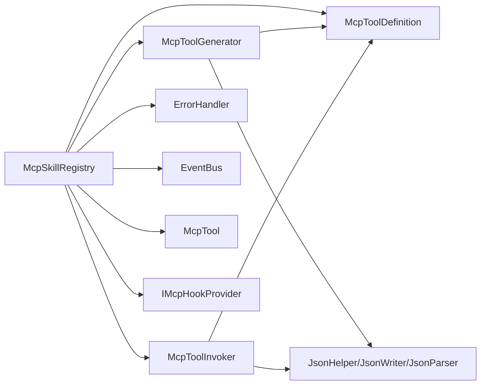
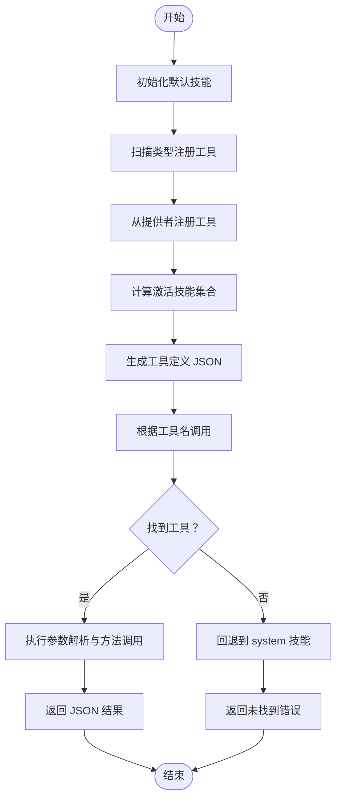

# MCP 工具系统

<cite>
**本文引用的文件**
- [McpSkillRegistry.cs](file://ext\NPCLife\src\NPCLife\Framework\Mcp\McpSkillRegistry.cs)
- [McpTool.cs](file://ext\NPCLife\src\NPCLife\Framework\Mcp\McpTool.cs)
- [McpToolGenerator.cs](file://ext\NPCLife\src\NPCLife\Framework\Mcp\McpToolGenerator.cs)
- [McpToolInvoker.cs](file://ext\NPCLife\src\NPCLife\Framework\Mcp\McpToolInvoker.cs)
- [McpToolDefinition.cs](file://ext\NPCLife\src\NPCLife\Framework\Mcp\McpToolDefinition.cs)
- [McpParamAttribute.cs](file://ext\NPCLife\src\NPCLife\Framework\Mcp\McpParamAttribute.cs)
- [McpSkillAttribute.cs](file://ext\NPCLife\src\NPCLife\Framework\Mcp\McpSkillAttribute.cs)
- [McpToolAttribute.cs](file://ext\NPCLife\src\NPCLife\Framework\Mcp\McpToolAttribute.cs)
- [IMcpHookProvider.cs](file://ext\NPCLife\src\NPCLife\Framework\Mcp\IMcpHookProvider.cs)
- [JsonHelper.cs](file://ext\NPCLife\src\NPCLife\Framework\JsonHelper.cs)
- [JsonWriter.cs](file://ext\NPCLife\src\NPCLife\Framework\JsonWriter.cs)
- [JsonParser.cs](file://ext\NPCLife\src\NPCLife\Framework\JsonParser.cs)
- [ErrorHandler.cs](file://ext\NPCLife\src\NPCLife\Framework\ErrorHandler.cs)
- [EventBus.cs](file://ext\NPCLife\src\NPCLife\Framework\EventBus.cs)
- [FrameworkEvents.cs](file://ext\NPCLife\src\NPCLife\Framework\FrameworkEvents.cs)
- [McpTypeMapper.cs](file://ext\NPCLife\src\NPCLife\Framework\Mcp\McpTypeMapper.cs)
- [DirectionMcpTools.cs](file://ext\NPCLife\src\NPCLife\Workspace\DirectionMcpTools.cs)
- [FreelancerMcpTools.cs](file://ext\NPCLife\src\NPCLife\Workspace\FreelancerMcpTools.cs)
- [WritingMcpTools.cs](file://ext\NPCLife\src\NPCLife\Workspace\WritingMcpTools.cs)
- [SkillSlot.cs](file://ext\NPCLife\src\NPCLife\Workspace\SkillSlot.cs)
- [WorkspaceManager.cs](file://ext\NPCLife\src\NPCLife\Workspace\WorkspaceManager.cs)
- [WorkspaceImpl.cs](file://ext\NPCLife\src\NPCLife\Workspace\WorkspaceImpl.cs)
- [WorkspaceState.cs](file://ext\NPCLife\src\NPCLife\Workspace\WorkspaceState.cs)
- [WorkspaceEventPool.cs](file://ext\NPCLife\src\NPCLife\Workspace\WorkspaceEventPool.cs)
- [RoleSkillProfile.cs](file://ext\NPCLife\src\NPCLife\Workspace\RoleSkillProfile.cs)
- [SystemMcpProvider.cs](file://ext\NPCLife\src\NPCLife\Infrastructure\Mcp\SystemMcpProvider.cs)
- [KnowledgeMcpProvider.cs](file://ext\NPCLife\src\NPCLife\Infrastructure\Mcp\KnowledgeMcpProvider.cs)
</cite>

## 目录
1. [简介](#简介)
2. [项目结构](#项目结构)
3. [核心组件](#核心组件)
4. [架构总览](#架构总览)
5. [详细组件分析](#详细组件分析)
6. [依赖关系分析](#依赖关系分析)
7. [性能考量](#性能考量)
8. [故障排查指南](#故障排查指南)
9. [结论](#结论)
10. [附录](#附录)

## 简介
本文件面向 MCP（Model Context Protocol）工具系统，系统性阐述工具注册机制、工具发现与调用流程，以及 McpSkillRegistry 的技能槽位管理、工具定义与动态加载机制。同时，文档化 McpTool 的属性配置、参数验证与结果处理，并解释工具生成器的自动化工具注册、元数据提取与接口适配。最后提供 MCP 工具开发最佳实践与具体示例路径，帮助开发者快速创建自定义 MCP 工具并在代理中调用。

## 项目结构
MCP 工具系统位于 NPCLife 框架的 Mcp 子模块中，围绕以下关键文件组织：
- 注册与调度：McpSkillRegistry
- 工具载体：McpTool
- 工具定义与序列化：McpToolDefinition、McpToolGenerator
- 运行时调用：McpToolInvoker
- 属性与特性：McpToolAttribute、McpParamAttribute、McpSkillAttribute
- 接口与提供者：IMcpHookProvider、SystemMcpProvider、KnowledgeMcpProvider
- 工作空间与技能槽位：WorkspaceManager、WorkspaceImpl、SkillSlot、RoleSkillProfile
- 工具实现示例：DirectionMcpTools、FreelancerMcpTools、WritingMcpTools

图表来源
- [McpSkillRegistry.cs:22-470](file://ext\NPCLife\src\NPCLife\Framework\Mcp\McpSkillRegistry.cs#L22-L470)
- [McpToolGenerator.cs:12-214](file://ext\NPCLife\src\NPCLife\Framework\Mcp\McpToolGenerator.cs#L12-L214)
- [McpToolInvoker.cs:14-238](file://ext\NPCLife\src\NPCLife\Framework\Mcp\McpToolInvoker.cs#L14-L238)
- [McpTool.cs:14-40](file://ext\NPCLife\src\NPCLife\Framework\Mcp\McpTool.cs#L14-L40)
- [McpToolDefinition.cs:5-50](file://ext\NPCLife\src\NPCLife\Framework\Mcp\McpToolDefinition.cs#L5-L50)
- [McpToolAttribute.cs:9-18](file://ext\NPCLife\src\NPCLife\Framework\Mcp\McpToolAttribute.cs#L9-L18)
- [McpParamAttribute.cs:22-34](file://ext\NPCLife\src\NPCLife\Framework\Mcp\McpParamAttribute.cs#L22-L34)
- [McpSkillAttribute.cs:11-22](file://ext\NPCLife\src\NPCLife\Framework\Mcp\McpSkillAttribute.cs#L11-L22)
- [IMcpHookProvider.cs](file://ext\NPCLife\src\NPCLife\Framework\Mcp\IMcpHookProvider.cs)
- [WorkspaceManager.cs](file://ext\NPCLife\src\NPCLife\Workspace\WorkspaceManager.cs)
- [WorkspaceImpl.cs](file://ext\NPCLife\src\NPCLife\Workspace\WorkspaceImpl.cs)
- [SkillSlot.cs](file://ext\NPCLife\src\NPCLife\Workspace\SkillSlot.cs)
- [RoleSkillProfile.cs](file://ext\NPCLife\src\NPCLife\Workspace\RoleSkillProfile.cs)
- [SystemMcpProvider.cs](file://ext\NPCLife\src\NPCLife\Infrastructure\Mcp\SystemMcpProvider.cs)
- [KnowledgeMcpProvider.cs](file://ext\NPCLife\src\NPCLife\Infrastructure\Mcp\KnowledgeMcpProvider.cs)

章节来源
- [McpSkillRegistry.cs:1-470](file://ext\NPCLife\src\NPCLife\Framework\Mcp\McpSkillRegistry.cs#L1-L470)
- [McpToolGenerator.cs:1-214](file://ext\NPCLife\src\NPCLife\Framework\Mcp\McpToolGenerator.cs#L1-L214)
- [McpToolInvoker.cs:1-238](file://ext\NPCLife\src\NPCLife\Framework\Mcp\McpToolInvoker.cs#L1-L238)
- [McpTool.cs:1-40](file://ext\NPCLife\src\NPCLife\Framework\Mcp\McpTool.cs#L1-L40)
- [McpToolDefinition.cs:1-50](file://ext\NPCLife\src\NPCLife\Framework\Mcp\McpToolDefinition.cs#L1-L50)
- [McpToolAttribute.cs:1-18](file://ext\NPCLife\src\NPCLife\Framework\Mcp\McpToolAttribute.cs#L1-L18)
- [McpParamAttribute.cs:1-34](file://ext\NPCLife\src\NPCLife\Framework\Mcp\McpParamAttribute.cs#L1-L34)
- [McpSkillAttribute.cs:1-22](file://ext\NPCLife\src\NPCLife\Framework\Mcp\McpSkillAttribute.cs#L1-L22)
- [WorkspaceManager.cs](file://ext\NPCLife\src\NPCLife\Workspace\WorkspaceManager.cs)
- [WorkspaceImpl.cs](file://ext\NPCLife\src\NPCLife\Workspace\WorkspaceImpl.cs)
- [SkillSlot.cs](file://ext\NPCLife\src\NPCLife\Workspace\SkillSlot.cs)
- [RoleSkillProfile.cs](file://ext\NPCLife\src\NPCLife\Workspace\RoleSkillProfile.cs)
- [SystemMcpProvider.cs](file://ext\NPCLife\src\NPCLife\Infrastructure\Mcp\SystemMcpProvider.cs)
- [KnowledgeMcpProvider.cs](file://ext\NPCLife\src\NPCLife\Infrastructure\Mcp\KnowledgeMcpProvider.cs)

## 核心组件
- McpSkillRegistry：静态注册表，负责技能元数据维护、工具注册、工具定义序列化、工具调用与结果封装。提供初始化默认技能、从类型/提供者注册工具、查询激活工具与技能列表、调用工具等能力。
- McpTool：统一工具载体，包含工具定义与调用委托，支持从 MethodInfo 包装或手工构造。
- McpToolGenerator：工具定义生成器，基于反射与特性提取元数据，生成标准 MCP 工具 JSON。
- McpToolInvoker：运行时调用器，负责 JSON 参数解析、类型转换、方法调用与结果序列化。
- McpToolDefinition：工具定义的数据结构，包含名称、描述与输入参数 Schema。
- 属性与接口：McpToolAttribute、McpParamAttribute、McpSkillAttribute 用于标注工具与参数；IMcpHookProvider 用于外部提供者注入工具。
- 工作空间与技能槽位：WorkspaceManager 管理激活技能集合，WorkspaceImpl/SkillSlot/RoleSkillProfile 实现技能槽位与角色配置。

章节来源
- [McpSkillRegistry.cs:22-470](file://ext\NPCLife\src\NPCLife\Framework\Mcp\McpSkillRegistry.cs#L22-L470)
- [McpTool.cs:14-40](file://ext\NPCLife\src\NPCLife\Framework\Mcp\McpTool.cs#L14-L40)
- [McpToolGenerator.cs:12-214](file://ext\NPCLife\src\NPCLife\Framework\Mcp\McpToolGenerator.cs#L12-L214)
- [McpToolInvoker.cs:14-238](file://ext\NPCLife\src\NPCLife\Framework\Mcp\McpToolInvoker.cs#L14-L238)
- [McpToolDefinition.cs:5-50](file://ext\NPCLife\src\NPCLife\Framework\Mcp\McpToolDefinition.cs#L5-L50)
- [McpToolAttribute.cs:9-18](file://ext\NPCLife\src\NPCLife\Framework\Mcp\McpToolAttribute.cs#L9-L18)
- [McpParamAttribute.cs:22-34](file://ext\NPCLife\src\NPCLife\Framework\Mcp\McpParamAttribute.cs#L22-L34)
- [McpSkillAttribute.cs:11-22](file://ext\NPCLife\src\NPCLife\Framework\Mcp\McpSkillAttribute.cs#L11-L22)
- [IMcpHookProvider.cs](file://ext\NPCLife\src\NPCLife\Framework\Mcp\IMcpHookProvider.cs)
- [WorkspaceManager.cs](file://ext\NPCLife\src\NPCLife\Workspace\WorkspaceManager.cs)
- [WorkspaceImpl.cs](file://ext\NPCLife\src\NPCLife\Workspace\WorkspaceImpl.cs)
- [SkillSlot.cs](file://ext\NPCLife\src\NPCLife\Workspace\SkillSlot.cs)
- [RoleSkillProfile.cs](file://ext\NPCLife\src\NPCLife\Workspace\RoleSkillProfile.cs)

## 架构总览
MCP 工具系统采用“注册表 + 生成器 + 调用器”的分层架构：
- 注册阶段：通过特性标注与提供者接口，将工具注册到技能映射中。
- 发现阶段：根据激活技能集合，生成工具定义 JSON，供 LLM 使用。
- 调用阶段：根据工具名在激活技能范围内查找工具，执行参数解析与方法调用，返回 JSON 结果。

图表来源
- [McpSkillRegistry.cs:52-175](file://ext\NPCLife\src\NPCLife\Framework\Mcp\McpSkillRegistry.cs#L52-L175)
- [McpToolGenerator.cs:84-121](file://ext\NPCLife\src\NPCLife\Framework\Mcp\McpToolGenerator.cs#L84-L121)
- [McpToolInvoker.cs:24-72](file://ext\NPCLife\src\NPCLife\Framework\Mcp\McpToolInvoker.cs#L24-L72)

## 详细组件分析

### McpSkillRegistry：技能注册与工具调度
- 技能元数据与映射
  - 使用字典维护技能 ID 到元数据与工具列表的映射，支持并发安全的注册与查询。
  - 提供初始化默认技能与手动注册技能的能力。
- 工具注册
  - RegisterTool：按技能 ID 注册 McpTool，按名称去重。
  - RegisterFromType：扫描类型中的 [McpTool] 方法，优先使用方法级 [McpSkill]，否则使用类级 [McpSkill]。
  - RegisterFromProvider：从 Hook 提供者批量注册工具，并确保技能元数据存在。
- 工具定义与查询
  - GetActiveToolsJson：返回激活技能下的工具定义 JSON 数组，system 技能始终包含。
  - GetSkillToolsJson：返回指定技能的工具定义 JSON 数组。
  - GetSkillListJson：返回技能列表 JSON，包含激活状态与工具数量。
- 工具调用
  - InvokeTool：在激活技能范围内查找工具，未命中时回退到 system 技能；捕获异常并返回标准化错误 JSON。
  - 事件发布：调用前后发布事件，便于可观测性与调试。

图表来源
- [McpSkillRegistry.cs:22-470](file://ext\NPCLife\src\NPCLife\Framework\Mcp\McpSkillRegistry.cs#L22-L470)
- [McpTool.cs:14-40](file://ext\NPCLife\src\NPCLife\Framework\Mcp\McpTool.cs#L14-L40)
- [McpToolGenerator.cs:12-214](file://ext\NPCLife\src\NPCLife\Framework\Mcp\McpToolGenerator.cs#L12-L214)
- [McpToolInvoker.cs:14-238](file://ext\NPCLife\src\NPCLife\Framework\Mcp\McpToolInvoker.cs#L14-L238)

章节来源
- [McpSkillRegistry.cs:22-470](file://ext\NPCLife\src\NPCLife\Framework\Mcp\McpSkillRegistry.cs#L22-L470)

### McpTool：工具载体与工厂方法
- 定义：包含 Definition（工具定义）与 Invoker（调用委托）。
- 工厂方法：FromMethod 将 MethodInfo 包装为 McpTool，自动生成 Definition 并绑定 Invoker。

章节来源
- [McpTool.cs:14-40](file://ext\NPCLife\src\NPCLife\Framework\Mcp\McpTool.cs#L14-L40)

### McpToolGenerator：工具定义生成与序列化
- GenerateDefinition：从 MethodInfo 读取 [McpTool]/[McpParam] 特性，自动推断参数必填性与类型，生成 McpToolDefinition。
- Serialize：将工具定义序列化为标准 MCP JSON（包含 type="function"），兼容 OpenAI/DeepSeek。
- SerializeAllFrom：扫描类型中所有 [McpTool] 方法，返回 JSON 数组。
- 与注册表协作：提供 SerializeAllActiveTools 与 SerializeSkillList，供注册表查询使用。

章节来源
- [McpToolGenerator.cs:12-214](file://ext\NPCLife\src\NPCLife\Framework\Mcp\McpToolGenerator.cs#L12-L214)

### McpToolInvoker：运行时调用器
- 参数解析：将 JSON 参数字符串解析为键值对，按参数名映射到方法形参。
- 类型转换：支持基础类型、枚举、数组与泛型集合的宽松转换，必要时使用默认值。
- 结果序列化：将返回值序列化为 JSON 字符串，支持集合与复杂对象。
- 异常处理：包装反射异常并返回标准化错误 JSON。

章节来源
- [McpToolInvoker.cs:14-238](file://ext\NPCLife\src\NPCLife\Framework\Mcp\McpToolInvoker.cs#L14-L238)

### 属性与接口：特性与提供者
- McpToolAttribute：标注方法为工具，可覆盖名称与描述。
- McpParamAttribute：覆盖参数名、描述与必填性（Auto/True/False）。
- McpSkillAttribute：标注方法或类所属技能 ID，方法级优先于类级。
- IMcpHookProvider：外部提供者接口，用于动态注册工具与技能元数据。

章节来源
- [McpToolAttribute.cs:9-18](file://ext\NPCLife\src\NPCLife\Framework\Mcp\McpToolAttribute.cs#L9-L18)
- [McpParamAttribute.cs:22-34](file://ext\NPCLife\src\NPCLife\Framework\Mcp\McpParamAttribute.cs#L22-L34)
- [McpSkillAttribute.cs:11-22](file://ext\NPCLife\src\NPCLife\Framework\Mcp\McpSkillAttribute.cs#L11-L22)
- [IMcpHookProvider.cs](file://ext\NPCLife\src\NPCLife\Framework\Mcp\IMcpHookProvider.cs)

### 工具实现示例与工作空间集成
- 工具实现示例：DirectionMcpTools、FreelancerMcpTools、WritingMcpTools 提供了基于特性的工具实现范例。
- 工作空间集成：WorkspaceManager 管理激活技能集合；WorkspaceImpl/SkillSlot/RoleSkillProfile 提供技能槽位与角色配置，驱动注册表的工具发现与调用。

章节来源
- [DirectionMcpTools.cs](file://ext\NPCLife\src\NPCLife\Workspace\DirectionMcpTools.cs)
- [FreelancerMcpTools.cs](file://ext\NPCLife\src\NPCLife\Workspace\FreelancerMcpTools.cs)
- [WritingMcpTools.cs](file://ext\NPCLife\src\NPCLife\Workspace\WritingMcpTools.cs)
- [WorkspaceManager.cs](file://ext\NPCLife\src\NPCLife\Workspace\WorkspaceManager.cs)
- [WorkspaceImpl.cs](file://ext\NPCLife\src\NPCLife\Workspace\WorkspaceImpl.cs)
- [SkillSlot.cs](file://ext\NPCLife\src\NPCLife\Workspace\SkillSlot.cs)
- [RoleSkillProfile.cs](file://ext\NPCLife\src\NPCLife\Workspace\RoleSkillProfile.cs)

## 依赖关系分析
- 内聚与耦合
  - 注册表与生成器/调用器之间通过 McpToolDefinition 与工具名进行解耦，降低耦合度。
  - 工具实现通过特性与提供者接口注入，保持高内聚低耦合。
- 外部依赖
  - 依赖 JsonHelper/JsonWriter/JsonParser 进行 JSON 序列化与解析。
  - 依赖 ErrorHandler 与 EventBus 进行错误报告与事件发布。
  - 依赖 McpTypeMapper 进行类型到 Schema 的映射。

图表来源
- [McpSkillRegistry.cs:360-437](file://ext\NPCLife\src\NPCLife\Framework\Mcp\McpSkillRegistry.cs#L360-L437)
- [McpToolGenerator.cs:84-121](file://ext\NPCLife\src\NPCLife\Framework\Mcp\McpToolGenerator.cs#L84-L121)
- [McpToolInvoker.cs:24-72](file://ext\NPCLife\src\NPCLife\Framework\Mcp\McpToolInvoker.cs#L24-L72)
- [ErrorHandler.cs](file://ext\NPCLife\src\NPCLife\Framework\ErrorHandler.cs)
- [EventBus.cs](file://ext\NPCLife\src\NPCLife\Framework\EventBus.cs)
- [JsonHelper.cs](file://ext\NPCLife\src\NPCLife\Framework\JsonHelper.cs)
- [JsonWriter.cs](file://ext\NPCLife\src\NPCLife\Framework\JsonWriter.cs)
- [JsonParser.cs](file://ext\NPCLife\src\NPCLife\Framework\JsonParser.cs)
- [McpTypeMapper.cs](file://ext\NPCLife\src\NPCLife\Framework\Mcp\McpTypeMapper.cs)

章节来源
- [McpSkillRegistry.cs:360-437](file://ext\NPCLife\src\NPCLife\Framework\Mcp\McpSkillRegistry.cs#L360-L437)
- [McpToolGenerator.cs:84-121](file://ext\NPCLife\src\NPCLife\Framework\Mcp\McpToolGenerator.cs#L84-L121)
- [McpToolInvoker.cs:24-72](file://ext\NPCLife\src\NPCLife\Framework\Mcp\McpToolInvoker.cs#L24-L72)
- [ErrorHandler.cs](file://ext\NPCLife\src\NPCLife\Framework\ErrorHandler.cs)
- [EventBus.cs](file://ext\NPCLife\src\NPCLife\Framework\EventBus.cs)
- [JsonHelper.cs](file://ext\NPCLife\src\NPCLife\Framework\JsonHelper.cs)
- [JsonWriter.cs](file://ext\NPCLife\src\NPCLife\Framework\JsonWriter.cs)
- [JsonParser.cs](file://ext\NPCLife\src\NPCLife\Framework\JsonParser.cs)
- [McpTypeMapper.cs](file://ext\NPCLife\src\NPCLife\Framework\Mcp\McpTypeMapper.cs)

## 性能考量
- 并发安全：注册表使用锁保护内部字典，避免并发写入冲突。
- 序列化优化：生成器与调用器使用预分配大小的缓冲区与字符串构建器，减少内存分配。
- 反射成本：工具定义生成与调用均依赖反射，建议在启动阶段完成注册与缓存，运行时尽量避免重复反射操作。
- 错误处理：异常捕获与错误 JSON 返回，避免异常传播影响主流程。

## 故障排查指南
- 工具未找到
  - 检查工具是否正确标注 [McpTool]，并已通过 RegisterFromType/RegisterFromProvider 注册。
  - 确认工具名大小写不敏感匹配是否符合预期。
- 参数解析失败
  - 检查 [McpParam] 的 Name 与 Required 设置是否与调用方一致。
  - 确认参数类型转换是否支持（基础类型、枚举、数组、集合）。
- 调用异常
  - 查看异常消息是否被标准化返回；检查内部异常堆栈是否被保留。
  - 确认 WorkspaceManager 的激活技能集合是否包含目标工具所在技能。
- 事件与日志
  - 关注工具调用前后事件，定位调用链路问题。

章节来源
- [McpSkillRegistry.cs:360-437](file://ext\NPCLife\src\NPCLife\Framework\Mcp\McpSkillRegistry.cs#L360-L437)
- [McpToolInvoker.cs:62-71](file://ext\NPCLife\src\NPCLife\Framework\Mcp\McpToolInvoker.cs#L62-L71)
- [ErrorHandler.cs](file://ext\NPCLife\src\NPCLife\Framework\ErrorHandler.cs)
- [EventBus.cs](file://ext\NPCLife\src\NPCLife\Framework\EventBus.cs)

## 结论
MCP 工具系统通过清晰的职责分离与特性驱动的自动化注册，实现了工具的动态发现与调用。注册表提供统一的工具管理与查询能力，生成器与调用器分别承担元数据提取与运行时执行，配合工作空间的技能槽位管理，形成完整的 MCP 工具生态。遵循本文最佳实践，开发者可以高效创建与集成自定义工具。

## 附录

### 工具注册与调用流程图

图表来源
- [McpSkillRegistry.cs:52-175](file://ext\NPCLife\src\NPCLife\Framework\Mcp\McpSkillRegistry.cs#L52-L175)
- [McpToolInvoker.cs:24-72](file://ext\NPCLife\src\NPCLife\Framework\Mcp\McpToolInvoker.cs#L24-L72)

### 最佳实践与示例路径
- 工具设计原则
  - 使用 [McpTool] 标注公开方法，必要时使用 [McpParam] 指定参数名、描述与必填性。
  - 保持方法签名简洁，参数类型尽量为基础类型、枚举、数组或集合。
  - 为工具与参数提供清晰的描述，提升 LLM 的理解与使用效果。
- 参数规范
  - 必填性优先使用 [McpParam(Required=True)] 明确声明；否则依据 C# 默认值自动推断。
  - 数组与集合参数需确保元素类型可被正确转换。
- 错误处理
  - 工具内部异常会被捕获并返回标准化错误 JSON；建议在工具实现中抛出语义明确的异常。
- 示例路径
  - 创建自定义工具：参考 [DirectionMcpTools.cs](file://ext\NPCLife\src\NPCLife\Workspace\DirectionMcpTools.cs)、[FreelancerMcpTools.cs](file://ext\NPCLife\src\NPCLife\Workspace\FreelancerMcpTools.cs)、[WritingMcpTools.cs](file://ext\NPCLife\src\NPCLife\Workspace\WritingMcpTools.cs)。
  - 注册工具到技能系统：参考 [McpSkillRegistry.cs:124-147](file://ext\NPCLife\src\NPCLife\Framework\Mcp\McpSkillRegistry.cs#L124-L147) 的 RegisterFromType 与 RegisterFromProvider。
  - 在代理中调用工具：参考 [McpSkillRegistry.cs:361-437](file://ext\NPCLife\src\NPCLife\Framework\Mcp\McpSkillRegistry.cs#L361-L437) 的 InvokeTool。