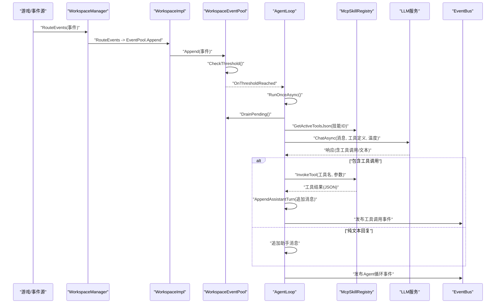
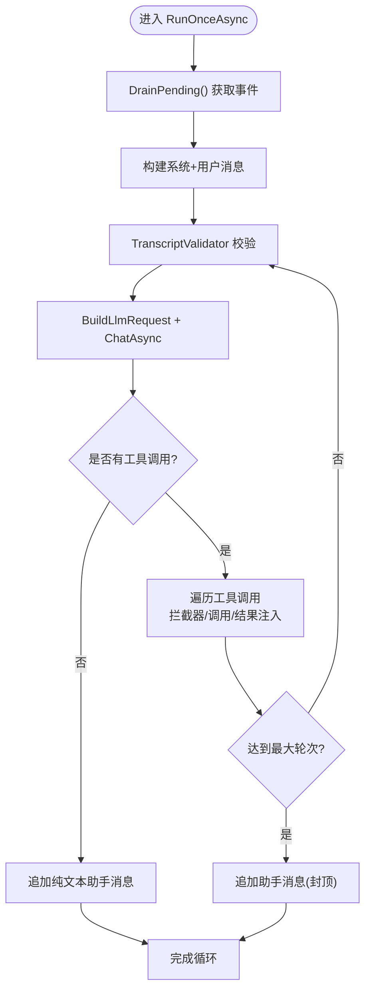
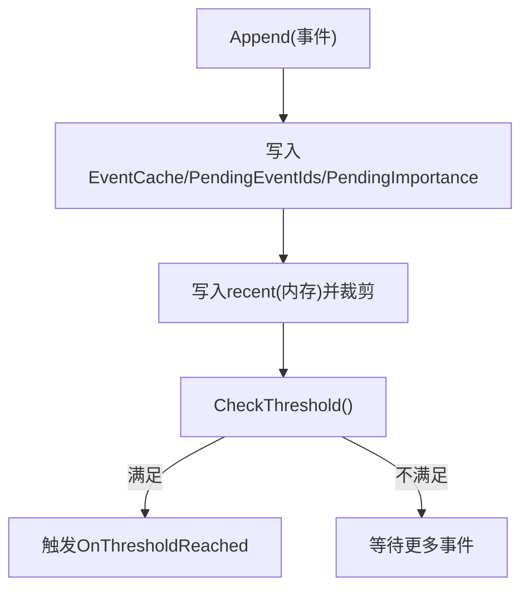
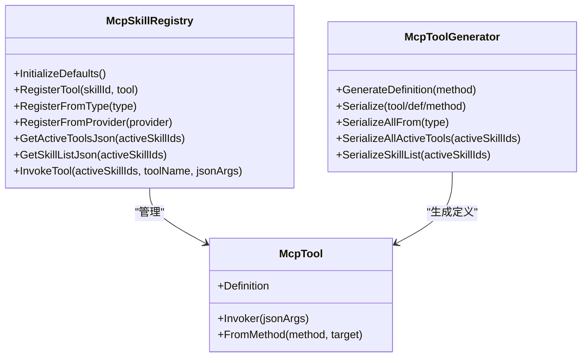
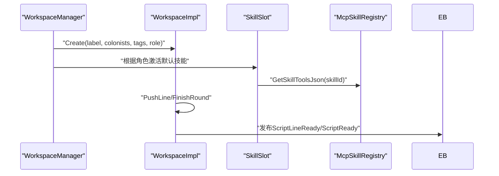
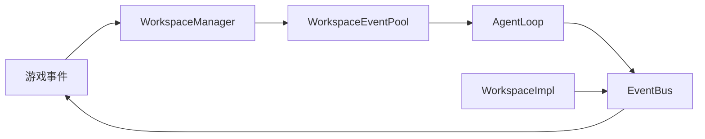
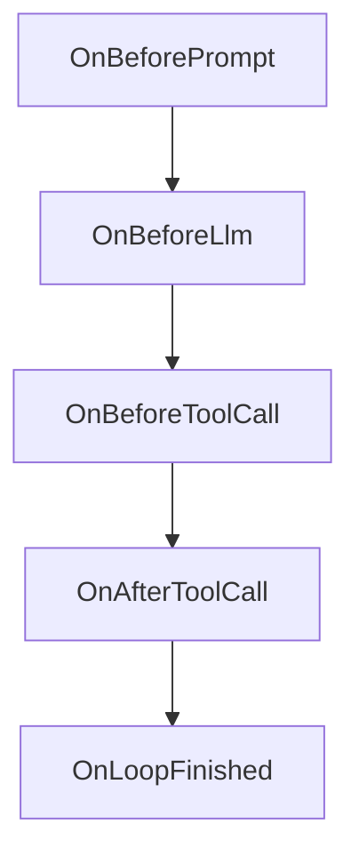
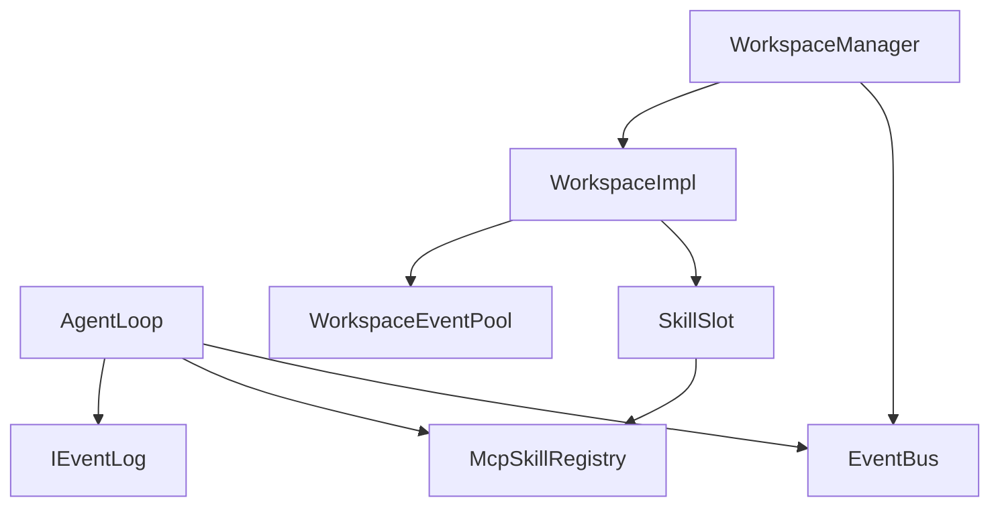

# 多代理协作架构

<cite>
**本文引用的文件**
- [AgentLoop.cs](file://ext\NPCLife\src\NPCLife\Agent\AgentLoop.cs)
- [WorkspaceImpl.cs](file://ext\NPCLife\src\NPCLife\Workspace\WorkspaceImpl.cs)
- [WorkspaceEventPool.cs](file://ext\NPCLife\src\NPCLife\Workspace\WorkspaceEventPool.cs)
- [IEventLog.cs](file://ext\NPCLife\src\NPCLife\Core\IEventLog.cs)
- [EventBus.cs](file://ext\NPCLife\src\NPCLife\Framework\EventBus.cs)
- [McpSkillRegistry.cs](file://ext\NPCLife\src\NPCLife\Framework\Mcp\McpSkillRegistry.cs)
- [SkillSlot.cs](file://ext\NPCLife\src\NPCLife\Workspace\SkillSlot.cs)
- [RoleSkillProfile.cs](file://ext\NPCLife\src\NPCLife\Workspace\RoleSkillProfile.cs)
- [WorkspaceManager.cs](file://ext\NPCLife\src\NPCLife\Workspace\WorkspaceManager.cs)
- [AgentPipeline.cs](file://ext\NPCLife\src\NPCLife\Framework\AgentPipeline.cs)
- [WorkspaceState.cs](file://ext\NPCLife\src\NPCLife\Workspace\WorkspaceState.cs)
- [McpTool.cs](file://ext\NPCLife\src\NPCLife\Framework\Mcp\McpTool.cs)
- [McpToolGenerator.cs](file://ext\NPCLife\src\NPCLife\Framework\Mcp\McpToolGenerator.cs)
- [ImproviserPrompt.txt](file://ext\NPCLife\src\NPCLife\Prompts\ImproviserPrompt.txt)
- [ScreenwriterPrompt.txt](file://ext\NPCLife\src\NPCLife\Prompts\ScreenwriterPrompt.txt)
- [DirectorPrompt.txt](file://ext\NPCLife\src\NPCLife\Prompts\DirectorPrompt.txt)
</cite>

## 更新摘要
**所做更改**
- 将"自由职业者代理系统"更新为"即兴编剧代理系统"，保持架构文档与代码实现的一致性
- 更新相关子节点引用，确保整体架构描述与新的术语保持一致
- 修正角色职责描述中的术语错误
- 更新提示词文件引用，反映即兴编剧的职责和工作原则

## 目录
1. [简介](#简介)
2. [项目结构](#项目结构)
3. [核心组件](#核心组件)
4. [架构总览](#架构总览)
5. [详细组件分析](#详细组件分析)
6. [依赖分析](#依赖分析)
7. [性能考虑](#性能考虑)
8. [故障排查指南](#故障排查指南)
9. [结论](#结论)
10. [附录](#附录)

## 简介
本文件系统性阐述 RimLife 的多代理协作架构，重点围绕"导演""编剧""即兴编剧"三类代理的职责分工与工作机制，深入解析 AgentLoop 的实现原理（事件池绑定、LLM 集成、技能系统、温度参数控制）、代理间通信与事件路由、MCP 工具注册与调用（含技能槽位与工具发现）、以及代理配置、生命周期管理与性能优化的最佳实践。文档同时提供可视化图示与代码片段路径，帮助开发者快速理解并扩展代理行为。

## 项目结构
RimLife 的多代理协作位于 ext\NPCLife 子项目中，采用"工作空间 + 事件池 + 技能系统 + LLM 管道"的分层设计：
- 工作空间层：WorkspaceManager/WorkspaceImpl/WorkspaceState 管理工作空间的创建、分支/合并、状态与事件路由。
- 事件层：WorkspaceEventPool/IEventLog 提供事件池的阈值触发与 drain 语义。
- 技能与工具层：McpSkillRegistry/SkillSlot/McpTool/McpToolGenerator 管理技能激活、工具注册与定义生成。
- 代理层：AgentLoop 实现基于事件池的循环推理与工具调用；AgentPipeline 提供请求拦截扩展点。
- 事件总线：EventBus 提供跨模块解耦的发布/订阅通道。

```mermaid
graph TB
subgraph "工作空间层"
WM["WorkspaceManager"]
WS["WorkspaceImpl"]
WSS["WorkspaceState"]
end
subgraph "事件层"
EP["WorkspaceEventPool"]
IEL["IEventLog"]
end
subgraph "技能与工具层"
MSR["McpSkillRegistry"]
SS["SkillSlot"]
MT["McpTool"]
MTG["McpToolGenerator"]
end
subgraph "代理层"
AL["AgentLoop"]
AP["AgentPipeline"]
end
subgraph "基础设施"
EB["EventBus"]
end
WM --> WS
WS --> EP
EP --> IEL
AL --> IEL
AL --> AP
AL --> MSR
SS --> MSR
MTG --> MT
EB --> AL
EB --> WM
EB --> WS
```

**图表来源**
- [WorkspaceManager.cs:19-622](file://ext\NPCLife\src\NPCLife\Workspace\WorkspaceManager.cs#L19-L622)
- [WorkspaceImpl.cs:16-199](file://ext\NPCLife\src\NPCLife\Workspace\WorkspaceImpl.cs#L16-L199)
- [WorkspaceEventPool.cs:21-186](file://ext\NPCLife\src\NPCLife\Workspace\WorkspaceEventPool.cs#L21-L186)
- [IEventLog.cs:12-52](file://ext\NPCLife\src\NPCLife\Core\IEventLog.cs#L12-L52)
- [McpSkillRegistry.cs:22-470](file://ext\NPCLife\src\NPCLife\Framework\Mcp\McpSkillRegistry.cs#L22-L470)
- [SkillSlot.cs:11-61](file://ext\NPCLife\src\NPCLife\Workspace\SkillSlot.cs#L11-L61)
- [McpTool.cs:14-40](file://ext\NPCLife\src\NPCLife\Framework\Mcp\McpTool.cs#L14-L40)
- [McpToolGenerator.cs:12-214](file://ext\NPCLife\src\NPCLife\Framework\Mcp\McpToolGenerator.cs#L12-L214)
- [AgentLoop.cs:43-680](file://ext\NPCLife\src\NPCLife\Agent\AgentLoop.cs#L43-L680)
- [AgentPipeline.cs:120-248](file://ext\NPCLife\src\NPCLife\Framework\AgentPipeline.cs#L120-L248)
- [EventBus.cs:17-243](file://ext\NPCLife\src\NPCLife\Framework\EventBus.cs#L17-L243)

**章节来源**
- [WorkspaceManager.cs:19-622](file://ext\NPCLife\src\NPCLife\Workspace\WorkspaceManager.cs#L19-L622)
- [WorkspaceImpl.cs:16-199](file://ext\NPCLife\src\NPCLife\Workspace\WorkspaceImpl.cs#L16-L199)
- [WorkspaceEventPool.cs:21-186](file://ext\NPCLife\src\NPCLife\Workspace\WorkspaceEventPool.cs#L21-L186)
- [IEventLog.cs:12-52](file://ext\NPCLife\src\NPCLife\Core\IEventLog.cs#L12-L52)
- [McpSkillRegistry.cs:22-470](file://ext\NPCLife\src\NPCLife\Framework\Mcp\McpSkillRegistry.cs#L22-L470)
- [SkillSlot.cs:11-61](file://ext\NPCLife\src\NPCLife\Workspace\SkillSlot.cs#L11-L61)
- [McpTool.cs:14-40](file://ext\NPCLife\src\NPCLife\Framework\Mcp\McpTool.cs#L14-L40)
- [McpToolGenerator.cs:12-214](file://ext\NPCLife\src\NPCLife\Framework\Mcp\McpToolGenerator.cs#L12-L214)
- [AgentLoop.cs:43-680](file://ext\NPCLife\src\NPCLife\Agent\AgentLoop.cs#L43-L680)
- [AgentPipeline.cs:120-248](file://ext\NPCLife\src\NPCLife\Framework\AgentPipeline.cs#L120-L248)
- [EventBus.cs:17-243](file://ext\NPCLife\src\NPCLife\Framework\EventBus.cs#L17-L243)

## 核心组件
- 导演（Director）
  - 职责：创建工作空间、分支/合并剧情线、管理全局视角与结构决策。
  - 技能集：全局概览、角色/事件/知识查询、工作空间方向管理。
  - 关键接口：WorkspaceManager.Create/Branch/Merge；WorkspaceState.WorkspaceRole.Director。
- 编剧（Screenwriter）
  - 职责：创作叙事内容（推送回合）、维护当前前情提要、上报推进信号。
  - 技能集：工作空间写作、角色/关系/环境/事件查询、知识管理。
  - 关键接口：WorkspaceImpl.PushLine/FinishRound；WorkspaceState.WorkspaceRole.Screenwriter。
- 即兴编剧（Improviser）
  - 职责：处理突发性、独立性的事件（日常对话、随机遭遇、环境变化等），这些事件不属于任何正在进行的剧情线，不需要维护跨轮次的剧情上下文。
  - 技能集：基础角色/事件查询，无关系查询和环境查询。
  - 关键接口：WorkspaceRole.Improviser；与编剧同构但无剧情上下文，专门处理临时事件。

**章节来源**
- [RoleSkillProfile.cs:13-74](file://ext\NPCLife\src\NPCLife\Workspace\RoleSkillProfile.cs#L13-L74)
- [WorkspaceState.cs:9-88](file://ext\NPCLife\src\NPCLife\Workspace\WorkspaceState.cs#L9-L88)
- [WorkspaceManager.cs:91-138](file://ext\NPCLife\src\NPCLife\Workspace\WorkspaceManager.cs#L91-L138)
- [WorkspaceImpl.cs:83-184](file://ext\NPCLife\src\NPCLife\Workspace\WorkspaceImpl.cs#L83-L184)
- [ImproviserPrompt.txt:1-17](file://ext\NPCLife\src\NPCLife\Prompts\ImproviserPrompt.txt#L1-L17)

## 架构总览
多代理协作以"工作空间"为中心，事件通过 WorkspaceEventPool 聚合并按阈值触发 AgentLoop。AgentLoop 通过技能系统选择工具集合，向 LLM 发送消息并在响应包含工具调用时执行，最终将结果注入消息历史并继续推理，直至达到最大轮次或无工具调用。

**图表来源**
- [WorkspaceManager.cs:382-392](file://ext\NPCLife\src\NPCLife\Workspace\WorkspaceManager.cs#L382-L392)
- [WorkspaceEventPool.cs:81-90](file://ext\NPCLife\src\NPCLife\Workspace\WorkspaceEventPool.cs#L81-L90)
- [AgentLoop.cs:174-340](file://ext\NPCLife\src\NPCLife\Agent\AgentLoop.cs#L174-L340)
- [McpSkillRegistry.cs:249-287](file://ext\NPCLife\src\NPCLife\Framework\Mcp\McpSkillRegistry.cs#L249-L287)
- [EventBus.cs:86-113](file://ext\NPCLife\src\NPCLife\Framework\EventBus.cs#L86-L113)

## 详细组件分析

### AgentLoop：事件驱动的推理循环
- 事件池绑定
  - 订阅 IEventLog.OnThresholdReached，在阈值达到时触发 RunOnceAsync。
  - 通过 DrainPending 获取事件列表，清空池内状态，保证幂等与一致性。
- LLM 集成
  - 构建 LlmRequest，注入系统提示词、用户消息、工具定义与温度参数。
  - 使用 TranscriptValidator 校验消息历史结构，防止非法状态。
- 技能系统与工具调用
  - 通过 McpSkillRegistry.GetActiveToolsJson 获取激活工具集合，注入 LLM。
  - 响应包含工具调用时，逐个执行：拦截器前置/后置、工具调用、结果注入。
- 温度参数控制
  - 通过构造函数 temperature 控制采样多样性，默认 0.7。
- 状态机与并发
  - 显式状态机 AgentRunState，SemaphoreSlim 防重入，CancellationToken 贯穿链路。
- 错误处理与回退
  - 失败时将已 drain 的事件回灌至池，保留上下文并发布完成事件。

**图表来源**
- [AgentLoop.cs:174-340](file://ext\NPCLife\src\NPCLife\Agent\AgentLoop.cs#L174-L340)
- [AgentLoop.cs:444-452](file://ext\NPCLife\src\NPCLife\Agent\AgentLoop.cs#L444-L452)
- [AgentLoop.cs:213-321](file://ext\NPCLife\src\NPCLife\Agent\AgentLoop.cs#L213-L321)

**章节来源**
- [AgentLoop.cs:43-680](file://ext\NPCLife\src\NPCLife\Agent\AgentLoop.cs#L43-L680)
- [IEventLog.cs:12-52](file://ext\NPCLife\src\NPCLife\Core\IEventLog.cs#L12-L52)

### 事件池与阈值触发：WorkspaceEventPool
- 双层缓冲：持久化的 pending 缓冲（WorkspaceState）与内存 recent 历史。
- 阈值检测：根据 DriverConfig 与 WorkspaceRole 计算有效阈值，满足任一即触发 OnThresholdReached。
- 查询与定位：支持标签、Actor、时间窗、最小重要度等过滤，Latest/ById 快速定位。

**图表来源**
- [WorkspaceEventPool.cs:49-90](file://ext\NPCLife\src\NPCLife\Workspace\WorkspaceEventPool.cs#L49-L90)
- [WorkspaceEventPool.cs:166-183](file://ext\NPCLife\src\NPCLife\Workspace\WorkspaceEventPool.cs#L166-L183)

**章节来源**
- [WorkspaceEventPool.cs:21-186](file://ext\NPCLife\src\NPCLife\Workspace\WorkspaceEventPool.cs#L21-L186)
- [IEventLog.cs:12-52](file://ext\NPCLife\src\NPCLife\Core\IEventLog.cs#L12-L52)

### 技能系统与 MCP 工具注册：McpSkillRegistry
- 技能元数据：内置系统与业务技能，支持动态注册与查询。
- 工具注册：从类型或 Hook 提供者扫描工具，建立 Skill→Tool 映射。
- 工具调用：按激活技能范围查找工具，fallback 至 system 技能；发布工具调用前后事件。
- 工具定义生成：McpToolGenerator 将 MethodInfo 转换为标准 MCP JSON，兼容 OpenAI/DeepSeek。

**图表来源**
- [McpSkillRegistry.cs:22-470](file://ext\NPCLife\src\NPCLife\Framework\Mcp\McpSkillRegistry.cs#L22-L470)
- [McpTool.cs:14-40](file://ext\NPCLife\src\NPCLife\Framework\Mcp\McpTool.cs#L14-L40)
- [McpToolGenerator.cs:12-214](file://ext\NPCLife\src\NPCLife\Framework\Mcp\McpToolGenerator.cs#L12-L214)

**章节来源**
- [McpSkillRegistry.cs:22-470](file://ext\NPCLife\src\NPCLife\Framework\Mcp\McpSkillRegistry.cs#L22-L470)
- [McpTool.cs:14-40](file://ext\NPCLife\src\NPCLife\Framework\Mcp\McpTool.cs#L14-L40)
- [McpToolGenerator.cs:12-214](file://ext\NPCLife\src\NPCLife\Framework\Mcp\McpToolGenerator.cs#L12-L214)

### 工作空间与角色：WorkspaceManager/WorkspaceImpl/SkillSlot
- WorkspaceManager
  - 负责工作空间 CRUD、分支/合并、事件路由与持久化。
  - 根据角色自动激活默认技能集。
- WorkspaceImpl
  - 包装 WorkspaceState，暴露事件池与技能槽；提供 PushLine/FinishRound 等叙事操作。
  - 通过 EventBus 发布脚本行就绪与轮次完成事件。
- SkillSlot
  - 封装 ActiveSkillIds，提供 Activate/Deactivate 与工具清单查询。

**图表来源**
- [WorkspaceManager.cs:91-138](file://ext\NPCLife\src\NPCLife\Workspace\WorkspaceManager.cs#L91-L138)
- [WorkspaceImpl.cs:83-184](file://ext\NPCLife\src\NPCLife\Workspace\WorkspaceImpl.cs#L83-L184)
- [SkillSlot.cs:24-58](file://ext\NPCLife\src\NPCLife\Workspace\SkillSlot.cs#L24-L58)
- [McpSkillRegistry.cs:249-287](file://ext\NPCLife\src\NPCLife\Framework\Mcp\McpSkillRegistry.cs#L249-L287)

**章节来源**
- [WorkspaceManager.cs:19-622](file://ext\NPCLife\src\NPCLife\Workspace\WorkspaceManager.cs#L19-L622)
- [WorkspaceImpl.cs:16-199](file://ext\NPCLife\src\NPCLife\Workspace\WorkspaceImpl.cs#L16-L199)
- [SkillSlot.cs:11-61](file://ext\NPCLife\src\NPCLife\Workspace\SkillSlot.cs#L11-L61)

### 代理间通信与事件路由
- 事件路由：WorkspaceManager.RouteEvents 将事件写入目标工作空间的事件池，触发 AgentLoop。
- 事件总线：EventBus 提供跨模块解耦的发布/订阅，涵盖 Agent 循环、工具调用、LLM 请求/响应、工作空间更新等。
- 脚本交付：WorkspaceImpl 发布 ScriptLineReady/ScriptReady，由 ScriptDeliveryService 推送到游戏侧。

**图表来源**
- [WorkspaceManager.cs:382-392](file://ext\NPCLife\src\NPCLife\Workspace\WorkspaceManager.cs#L382-L392)
- [WorkspaceEventPool.cs:81-90](file://ext\NPCLife\src\NPCLife\Workspace\WorkspaceEventPool.cs#L81-L90)
- [EventBus.cs:86-113](file://ext\NPCLife\src\NPCLife\Framework\EventBus.cs#L86-L113)
- [WorkspaceImpl.cs:115-182](file://ext\NPCLife\src\NPCLife\Workspace\WorkspaceImpl.cs#L115-L182)

**章节来源**
- [EventBus.cs:17-243](file://ext\NPCLife\src\NPCLife\Framework\EventBus.cs#L17-L243)
- [WorkspaceImpl.cs:115-182](file://ext\NPCLife\src\NPCLife\Workspace\WorkspaceImpl.cs#L115-L182)

### AgentPipeline：请求拦截与扩展点
- 拦截顺序：OnBeforePrompt → OnBeforeLlm → OnBeforeToolCall → OnAfterToolCall → OnLoopFinished。
- 优先级：按 priority 升序执行，支持动态添加/移除拦截器。
- 适用场景：日志审计、参数校验、结果清洗、策略控制（如取消工具调用）。

**图表来源**
- [AgentPipeline.cs:120-248](file://ext\NPCLife\src\NPCLife\Framework\AgentPipeline.cs#L120-L248)

**章节来源**
- [AgentPipeline.cs:18-248](file://ext\NPCLife\src\NPCLife\Framework\AgentPipeline.cs#L18-L248)

## 依赖分析
- 组件耦合
  - AgentLoop 依赖 IEventLog、ILlmService、ICredentialStore、IKnowledgeService、McpSkillRegistry、EventBus。
  - WorkspaceImpl 依赖 WorkspaceEventPool、SkillSlot、EventBus。
  - McpSkillRegistry 依赖 McpTool/McpToolGenerator，受控于 WorkspaceManager/SkillSlot 的激活状态。
- 外部依赖
  - 事件总线与 JSON 工具（JsonWriter/JsonParser）来自框架基础设施。
- 潜在风险
  - 工具调用异常需隔离，避免影响后续轮次。
  - 事件池阈值配置不当可能导致频繁/延迟触发。

**图表来源**
- [AgentLoop.cs:43-119](file://ext\NPCLife\src\NPCLife\Agent\AgentLoop.cs#L43-L119)
- [WorkspaceImpl.cs:16-77](file://ext\NPCLife\src\NPCLife\Workspace\WorkspaceImpl.cs#L16-L77)
- [WorkspaceManager.cs:19-622](file://ext\NPCLife\src\NPCLife\Workspace\WorkspaceManager.cs#L19-L622)
- [McpSkillRegistry.cs:22-470](file://ext\NPCLife\src\NPCLife\Framework\Mcp\McpSkillRegistry.cs#L22-L470)

**章节来源**
- [AgentLoop.cs:43-119](file://ext\NPCLife\src\NPCLife\Agent\AgentLoop.cs#L43-L119)
- [WorkspaceImpl.cs:16-77](file://ext\NPCLife\src\NPCLife\Workspace\WorkspaceImpl.cs#L16-L77)
- [WorkspaceManager.cs:19-622](file://ext\NPCLife\src\NPCLife\Workspace\WorkspaceManager.cs#L19-L622)
- [McpSkillRegistry.cs:22-470](file://ext\NPCLife\src\NPCLife\Framework\Mcp\McpSkillRegistry.cs#L22-L470)

## 性能考虑
- 事件池阈值
  - 根据 WorkspaceRole 与 DriverConfig 动态调整有效阈值，平衡吞吐与延迟。
- 工具调用轮次上限
  - maxRounds 防止长链路死循环，建议结合 TranscriptValidator 与日志审计。
- 消息历史管理
  - AppendAssistantTurn 保证单轮多工具调用的结构正确，避免冗余消息增长。
- 并发与防重入
  - SemaphoreSlim 与 CancellationToken 保障 AgentLoop 并发安全与优雅取消。
- 温度参数
  - 适度降低 temperature 提升确定性，适合结构化工具调用；提高 temperature 增强创意，但可能增加无效工具调用。

## 故障排查指南
- AgentLoop 失败回退
  - 失败时将已 drain 的事件回灌至池，便于重试；检查日志与 EventBus 事件定位问题。
- 工具调用异常
  - McpSkillRegistry 捕获异常并返回 error JSON；检查工具定义与参数 schema。
- 事件未触发
  - 确认 WorkspaceEventPool 的阈值计算与 OnThresholdReached 是否被订阅。
- 拦截器导致的中断
  - 检查 AgentPipeline 中拦截器是否设置 Cancelled 或抛出异常。

**章节来源**
- [AgentLoop.cs:373-399](file://ext\NPCLife\src\NPCLife\Agent\AgentLoop.cs#L373-L399)
- [McpSkillRegistry.cs:387-437](file://ext\NPCLife\src\NPCLife\Framework\Mcp\McpSkillRegistry.cs#L387-L437)
- [WorkspaceEventPool.cs:81-90](file://ext\NPCLife\src\NPCLife\Workspace\WorkspaceEventPool.cs#L81-L90)
- [AgentPipeline.cs:202-214](file://ext\NPCLife\src\NPCLife\Framework\AgentPipeline.cs#L202-L214)

## 结论
RimLife 的多代理协作以"工作空间 + 事件池 + 技能系统 + LLM 管道"为核心，通过清晰的职责划分与事件驱动机制实现导演、编剧、即兴编剧的协同。AgentLoop 的显式状态机与 AgentPipeline 的拦截扩展点提供了强大的可控性与可观测性；McpSkillRegistry 与工具生成器确保了工具注册与调用的一致性与可扩展性。即兴编剧代理系统专门处理突发性、独立性事件，与编剧形成互补，共同构建完整的叙事生态。遵循本文最佳实践，可高效构建稳定的多代理叙事系统。

## 附录
- 代理配置要点
  - 根据角色选择默认技能集；通过 SkillSlot 动态激活/停用技能。
  - 使用 RoleSkillProfile 作为参考，结合业务需求微调。
  - 即兴编剧专用技能（workspace_improviser）用于处理临时事件。
- 生命周期管理
  - WorkspaceManager 负责持久化与状态迁移；WorkspaceImpl 提供脚本行与轮次管理。
- 最佳实践
  - 合理设置阈值与温度；为关键工具编写拦截器进行参数校验与结果清洗；利用 EventBus 进行可观测性与审计。
  - 即兴编剧应专注于独立事件的快速响应，避免与主线剧情产生冲突。