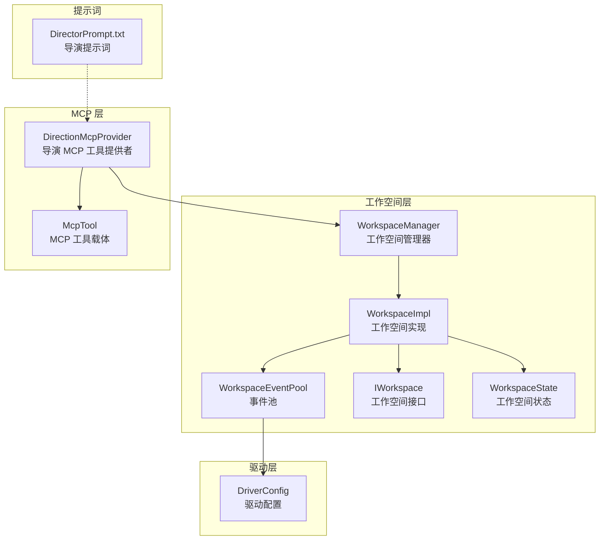
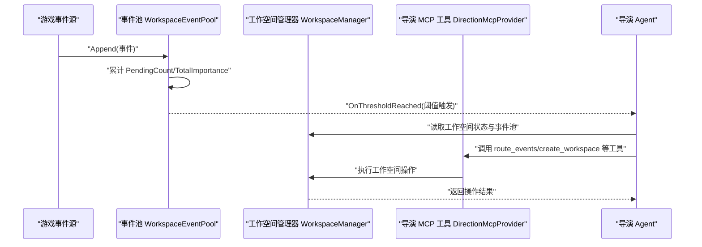
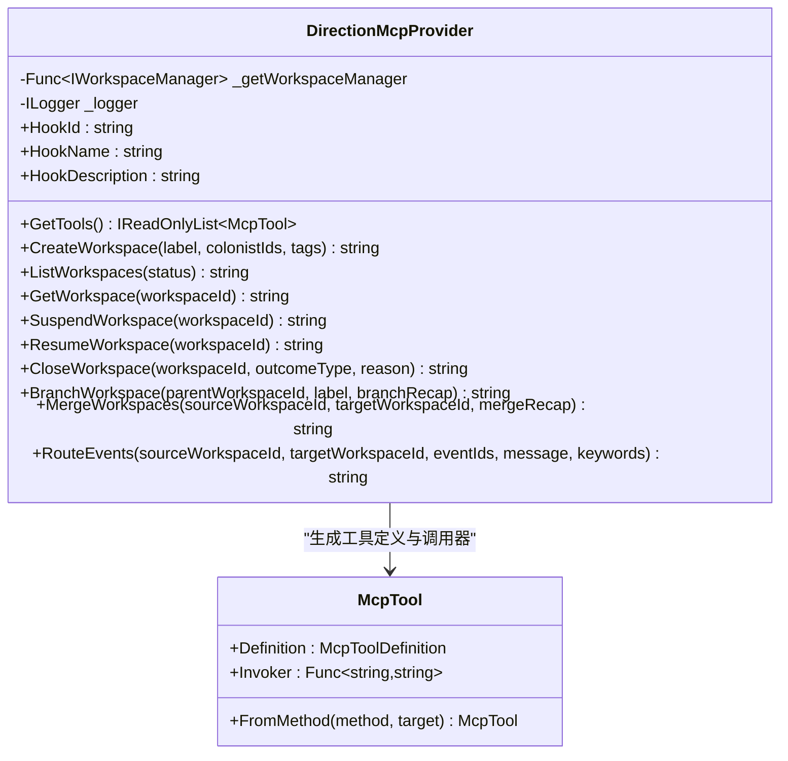
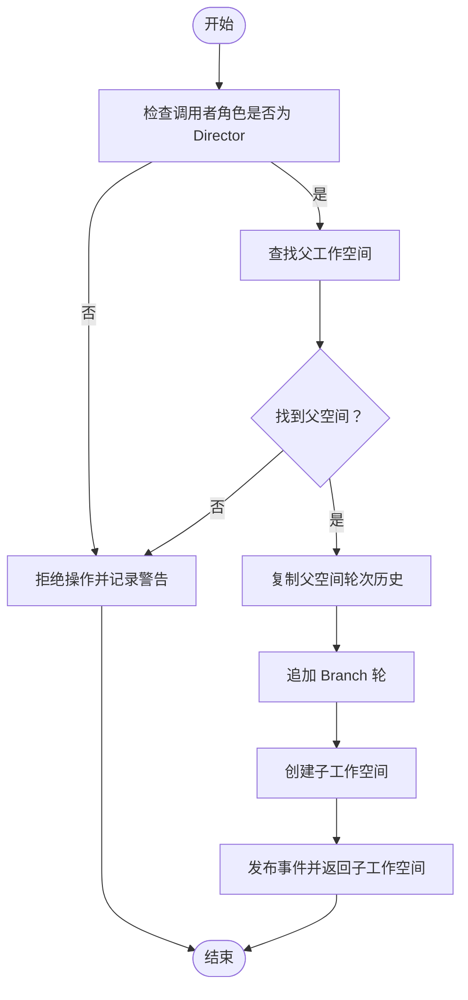
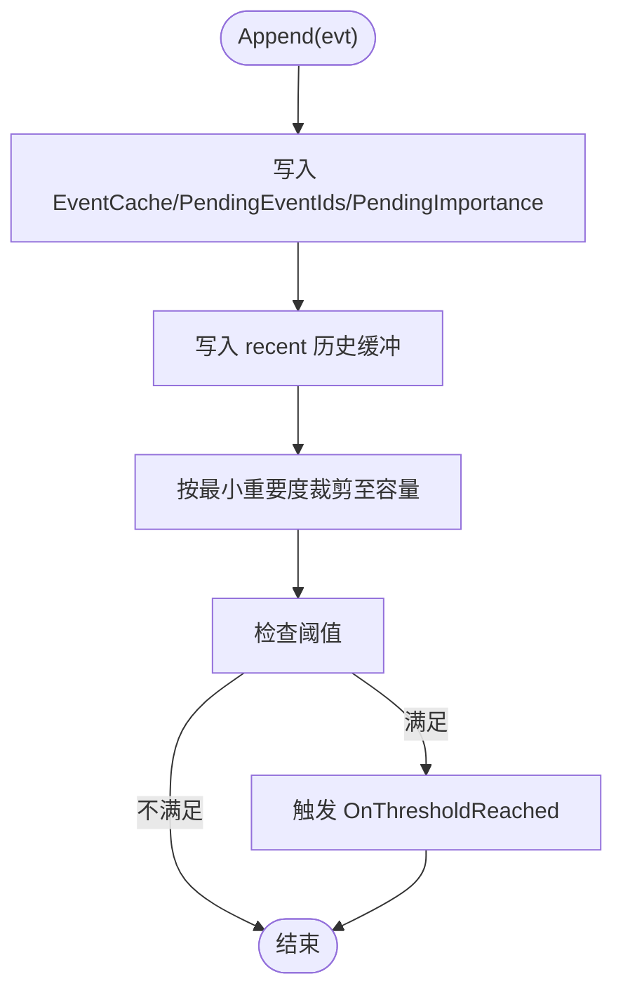
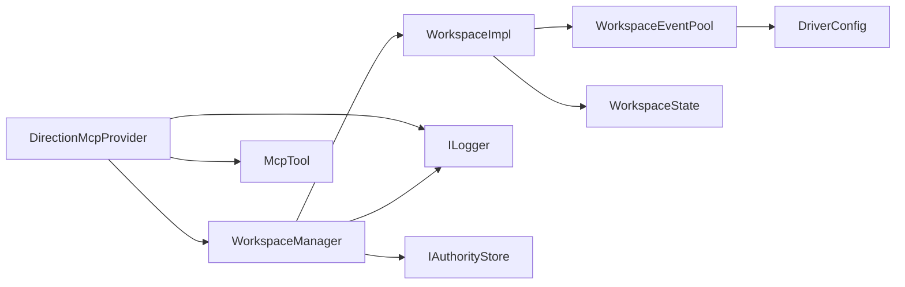

# 导演代理系统

<cite>
**本文引用的文件**
- [DirectionMcpTools.cs](file://ext\NPCLife\src\NPCLife\Workspace\DirectionMcpTools.cs)
- [WorkspaceManager.cs](file://ext\NPCLife\src\NPCLife\Workspace\WorkspaceManager.cs)
- [WorkspaceImpl.cs](file://ext\NPCLife\src\NPCLife\Workspace\WorkspaceImpl.cs)
- [WorkspaceEventPool.cs](file://ext\NPCLife\src\NPCLife\Workspace\WorkspaceEventPool.cs)
- [IWorkspace.cs](file://ext\NPCLife\src\NPCLife\Workspace\IWorkspace.cs)
- [WorkspaceState.cs](file://ext\NPCLife\src\NPCLife\Workspace\WorkspaceState.cs)
- [DriverConfig.cs](file://ext\NPCLife\src\NPCLife\Driver\DriverConfig.cs)
- [RoleSkillProfile.cs](file://ext\NPCLife\src\NPCLife\Workspace\RoleSkillProfile.cs)
- [SkillSlot.cs](file://ext\NPCLife\src\NPCLife\Workspace\SkillSlot.cs)
- [McpTool.cs](file://ext\NPCLife\src\NPCLife\Framework\Mcp\McpTool.cs)
- [DirectorPrompt.txt](file://Prompts\DirectorPrompt.txt)
- [WorkspaceEventPoolTests.cs](file://tests\NPCLife.Tests\Driver\WorkspaceEventPoolTests.cs)
</cite>

## 目录
1. [简介](#简介)
2. [项目结构](#项目结构)
3. [核心组件](#核心组件)
4. [架构概览](#架构概览)
5. [详细组件分析](#详细组件分析)
6. [依赖分析](#依赖分析)
7. [性能考虑](#性能考虑)
8. [故障排除指南](#故障排除指南)
9. [结论](#结论)
10. [附录](#附录)

## 简介
本文件面向导演代理系统（Director Agent）的使用者与扩展开发者，系统化阐述导演代理的核心职责与实现机制，包括：
- 事件审查与路由决策
- 工作空间的创建、分支、合并与生命周期管理
- 事件池的阈值驱动与激活机制
- 导演 MCP 工具的定义与调用流程
- 提示词配置、工具调用与温度参数控制
- 最佳实践与性能优化建议
- 扩展导演代理功能的参考路径

## 项目结构
导演代理系统位于 ext\NPCLife 子模块中，围绕“工作空间”（Workspace）组织核心能力：
- Workspace：工作空间管理与事件池
- Driver：驱动配置（阈值、定时器、历史容量）
- Framework.Mcp：MCP 工具定义与调用基础设施
- Prompts：提示词模板（包含导演提示词）

**图表来源**
- [DirectionMcpTools.cs:16-45](file://ext\NPCLife\src\NPCLife\Workspace\DirectionMcpTools.cs#L16-L45)
- [WorkspaceManager.cs:19-40](file://ext\NPCLife\src\NPCLife\Workspace\WorkspaceManager.cs#L19-L40)
- [WorkspaceImpl.cs:16-46](file://ext\NPCLife\src\NPCLife\Workspace\WorkspaceImpl.cs#L16-L46)
- [WorkspaceEventPool.cs:21-43](file://ext\NPCLife\src\NPCLife\Workspace\WorkspaceEventPool.cs#L21-L43)
- [DriverConfig.cs:9-106](file://ext\NPCLife\src\NPCLife\Driver\DriverConfig.cs#L9-L106)
- [McpTool.cs:14-39](file://ext\NPCLife\src\NPCLife\Framework\Mcp\McpTool.cs#L14-L39)
- [DirectorPrompt.txt:1-18](file://Prompts\DirectorPrompt.txt#L1-L18)

**章节来源**
- [DirectionMcpTools.cs:10-460](file://ext\NPCLife\src\NPCLife\Workspace\DirectionMcpTools.cs#L10-L460)
- [WorkspaceManager.cs:14-622](file://ext\NPCLife\src\NPCLife\Workspace\WorkspaceManager.cs#L14-L622)
- [WorkspaceImpl.cs:12-199](file://ext\NPCLife\src\NPCLife\Workspace\WorkspaceImpl.cs#L12-L199)
- [WorkspaceEventPool.cs:11-186](file://ext\NPCLife\src\NPCLife\Workspace\WorkspaceEventPool.cs#L11-L186)
- [DriverConfig.cs:9-107](file://ext\NPCLife\src\NPCLife\Driver\DriverConfig.cs#L9-L107)
- [McpTool.cs:6-40](file://ext\NPCLife\src\NPCLife\Framework\Mcp\McpTool.cs#L6-L40)
- [DirectorPrompt.txt:1-18](file://Prompts\DirectorPrompt.txt#L1-L18)

## 核心组件
- 导演 MCP 工具提供者：通过 IMcpHookProvider 注入 WorkspaceManager 与日志器，提供 create_workspace、list_workspaces、get_workspace、suspend_workspace、resume_workspace、close_workspace、branch_workspace、merge_workspaces、route_events 等工具。
- 工作空间管理器：负责工作空间的 CRUD、分支/合并、事件路由；通过 IAuthorityStore 持久化；线程安全（ReaderWriterLockSlim）。
- 工作空间实现：包装 WorkspaceState，暴露事件池与技能槽；控制叙事推进（PushLine、FinishRound）。
- 事件池：双缓冲结构（pending 持久化 + recent 内存），阈值触发 OnThresholdReached；支持 DrainPending 清空 pending。
- 驱动配置：按角色设定事件数与重要度阈值、定时器脉冲、历史容量等。
- 角色技能配置：为 Director/Screenwriter/Freelancer 预设默认技能集。

**章节来源**
- [DirectionMcpTools.cs:16-45](file://ext\NPCLife\src\NPCLife\Workspace\DirectionMcpTools.cs#L16-L45)
- [WorkspaceManager.cs:19-40](file://ext\NPCLife\src\NPCLife\Workspace\WorkspaceManager.cs#L19-L40)
- [WorkspaceImpl.cs:16-46](file://ext\NPCLife\src\NPCLife\Workspace\WorkspaceImpl.cs#L16-L46)
- [WorkspaceEventPool.cs:21-43](file://ext\NPCLife\src\NPCLife\Workspace\WorkspaceEventPool.cs#L21-L43)
- [DriverConfig.cs:54-101](file://ext\NPCLife\src\NPCLife\Driver\DriverConfig.cs#L54-L101)
- [RoleSkillProfile.cs:13-72](file://ext\NPCLife\src\NPCLife\Workspace\RoleSkillProfile.cs#L13-L72)

## 架构概览
导演代理以“事件驱动 + 工具调用”的方式工作：
- 事件池在每次 Append 后评估阈值，满足任一阈值即触发 OnThresholdReached。
- 导演 Agent 订阅该事件，读取工作空间的 pending 事件，进行重要性评估与路由决策。
- 通过 DirectionMcpProvider 提供的 MCP 工具执行 create/list/get/suspend/resume/close/branch/merge/route 等操作。

**图表来源**
- [WorkspaceEventPool.cs:78-90](file://ext\NPCLife\src\NPCLife\Workspace\WorkspaceEventPool.cs#L78-L90)
- [WorkspaceManager.cs:382-392](file://ext\NPCLife\src\NPCLife\Workspace\WorkspaceManager.cs#L382-L392)
- [DirectionMcpTools.cs:293-361](file://ext\NPCLife\src\NPCLife\Workspace\DirectionMcpTools.cs#L293-L361)

## 详细组件分析

### 导演 MCP 工具提供者（DirectionMcpProvider）
- 职责：为导演 Agent 提供工作空间生命周期与路由相关的 MCP 工具集合。
- 工具清单：
  - create_workspace：创建新的剧情线工作空间（固定角色为 Director）
  - list_workspaces：列出工作空间摘要（导演视图）
  - get_workspace：获取单个工作空间的导演视图
  - suspend/resume/close：挂起/恢复/关闭工作空间
  - branch_workspace：从父空间分叉子空间
  - merge_workspaces：合并两个工作空间
  - route_events：将事件从源工作空间路由到目标工作空间
- 参数与行为要点：
  - route_events 支持附加关键词，深拷贝事件并追加关键词
  - 返回统一 JSON 结构，包含 success、routed、total、message、warning 等字段
  - 异常时记录警告日志并返回错误结构

**图表来源**
- [DirectionMcpTools.cs:16-45](file://ext\NPCLife\src\NPCLife\Workspace\DirectionMcpTools.cs#L16-L45)
- [McpTool.cs:14-39](file://ext\NPCLife\src\NPCLife\Framework\Mcp\McpTool.cs#L14-L39)

**章节来源**
- [DirectionMcpTools.cs:31-45](file://ext\NPCLife\src\NPCLife\Workspace\DirectionMcpTools.cs#L31-L45)
- [DirectionMcpTools.cs:53-78](file://ext\NPCLife\src\NPCLife\Workspace\DirectionMcpTools.cs#L53-L78)
- [DirectionMcpTools.cs:87-110](file://ext\NPCLife\src\NPCLife\Workspace\DirectionMcpTools.cs#L87-L110)
- [DirectionMcpTools.cs:115-135](file://ext\NPCLife\src\NPCLife\Workspace\DirectionMcpTools.cs#L115-L135)
- [DirectionMcpTools.cs:144-163](file://ext\NPCLife\src\NPCLife\Workspace\DirectionMcpTools.cs#L144-L163)
- [DirectionMcpTools.cs:168-187](file://ext\NPCLife\src\NPCLife\Workspace\DirectionMcpTools.cs#L168-L187)
- [DirectionMcpTools.cs:192-225](file://ext\NPCLife\src\NPCLife\Workspace\DirectionMcpTools.cs#L192-L225)
- [DirectionMcpTools.cs:234-255](file://ext\NPCLife\src\NPCLife\Workspace\DirectionMcpTools.cs#L234-L255)
- [DirectionMcpTools.cs:260-282](file://ext\NPCLife\src\NPCLife\Workspace\DirectionMcpTools.cs#L260-L282)
- [DirectionMcpTools.cs:291-361](file://ext\NPCLife\src\NPCLife\Workspace\DirectionMcpTools.cs#L291-L361)

### 工作空间管理器（WorkspaceManager）
- 职责：CRUD、分支/合并、事件路由；通过 IAuthorityStore 持久化；线程安全。
- 关键操作：
  - Create：创建工作空间并激活默认技能集
  - Branch：复制父空间轮次历史并追加 Branch 轮
  - Merge：合并源空间轮次到目标空间，追加 Merge 轮，更新标签/角色/技能等
  - RouteEvents：将事件写入目标工作空间的事件池
  - UpdateStatus：状态机校验与转换

**图表来源**
- [WorkspaceManager.cs:193-263](file://ext\NPCLife\src\NPCLife\Workspace\WorkspaceManager.cs#L193-L263)

**章节来源**
- [WorkspaceManager.cs:91-138](file://ext\NPCLife\src\NPCLife\Workspace\WorkspaceManager.cs#L91-L138)
- [WorkspaceManager.cs:193-263](file://ext\NPCLife\src\NPCLife\Workspace\WorkspaceManager.cs#L193-L263)
- [WorkspaceManager.cs:269-376](file://ext\NPCLife\src\NPCLife\Workspace\WorkspaceManager.cs#L269-L376)
- [WorkspaceManager.cs:382-392](file://ext\NPCLife\src\NPCLife\Workspace\WorkspaceManager.cs#L382-L392)
- [WorkspaceManager.cs:165-187](file://ext\NPCLife\src\NPCLife\Workspace\WorkspaceManager.cs#L165-L187)

### 工作空间实现（WorkspaceImpl）
- 职责：封装 WorkspaceState，暴露事件池与技能槽；控制叙事推进（PushLine、FinishRound）。
- 关键点：
  - PushLine：仅允许 Screenwriter/Freelancer 推送；Active 状态才允许；发布 ScriptLineReady 事件。
  - FinishRound：仅允许 Screenwriter/Freelancer 完成轮次；归档脚本行、触发 ScriptReady 事件。
  - SetStatus：由 WorkspaceManager 调用更新状态与时间戳。

**章节来源**
- [WorkspaceImpl.cs:83-125](file://ext\NPCLife\src\NPCLife\Workspace\WorkspaceImpl.cs#L83-L125)
- [WorkspaceImpl.cs:127-184](file://ext\NPCLife\src\NPCLife\Workspace\WorkspaceImpl.cs#L127-L184)
- [WorkspaceImpl.cs:190-196](file://ext\NPCLife\src\NPCLife\Workspace\WorkspaceImpl.cs#L190-L196)

### 事件池（WorkspaceEventPool）
- 结构：pending（持久化）+ recent（内存）
- 阈值：根据 DriverConfig 的有效阈值（按角色）计算，满足任一即触发 OnThresholdReached
- 操作：Append、DrainPending、Query、Count、Latest、GetById
- 近期历史：按最小重要度淘汰，容量受 DriverConfig.RecentHistoryCapacity 控制

**图表来源**
- [WorkspaceEventPool.cs:49-90](file://ext\NPCLife\src\NPCLife\Workspace\WorkspaceEventPool.cs#L49-L90)
- [DriverConfig.cs:54-85](file://ext\NPCLife\src\NPCLife\Driver\DriverConfig.cs#L54-L85)

**章节来源**
- [WorkspaceEventPool.cs:49-90](file://ext\NPCLife\src\NPCLife\Workspace\WorkspaceEventPool.cs#L49-L90)
- [WorkspaceEventPool.cs:96-154](file://ext\NPCLife\src\NPCLife\Workspace\WorkspaceEventPool.cs#L96-L154)
- [WorkspaceEventPool.cs:166-183](file://ext\NPCLife\src\NPCLife\Workspace\WorkspaceEventPool.cs#L166-L183)

### 驱动配置（DriverConfig）
- 分角色阈值：Director/Screenwriter/Freelancer 各自的事件数与重要度阈值
- 定时器脉冲：Director/Freelancer 的定时器间隔（ticks）
- 通用配置：历史容量、最大 Agent 轮数
- 查询方法：按角色返回有效阈值与定时器间隔

**章节来源**
- [DriverConfig.cs:13-29](file://ext\NPCLife\src\NPCLife\Driver\DriverConfig.cs#L13-L29)
- [DriverConfig.cs:54-101](file://ext\NPCLife\src\NPCLife\Driver\DriverConfig.cs#L54-L101)

### 角色技能配置（RoleSkillProfile）
- Director：workspace_direction + colony_overview + character_query + event_query + knowledge_management
- Screenwriter：workspace_writing + colony_overview + character_query + relationship_query + event_query + environment_query + knowledge_management
- Freelancer：workspace_freelancer + character_query + event_query

**章节来源**
- [RoleSkillProfile.cs:19-51](file://ext\NPCLife\src\NPCLife\Workspace\RoleSkillProfile.cs#L19-L51)

### 技能槽（SkillSlot）
- 功能：激活/停用技能，维护 ActiveSkillIds，与 McpSkillRegistry 交互
- 约束：System 技能不可停用；重复激活返回空工具集

**章节来源**
- [SkillSlot.cs:24-58](file://ext\NPCLife\src\NPCLife\Workspace\SkillSlot.cs#L24-L58)

### MCP 工具载体（McpTool）
- 统一承载工具定义与调用委托
- FromMethod：从 MethodInfo 自动生成 Definition 并绑定 McpToolInvoker

**章节来源**
- [McpTool.cs:28-37](file://ext\NPCLife\src\NPCLife\Framework\Mcp\McpTool.cs#L28-L37)

### 导演提示词（DirectorPrompt.txt）
- 职责：事件审查、挑选值得发展的事件、使用 route_events 路由到工作空间、未被路由的事件丢弃
- 决策原则：相关事件可合并、参考编剧留言、临时事件推送给临时编剧、可用分支/合并

**章节来源**
- [DirectorPrompt.txt:1-18](file://Prompts\DirectorPrompt.txt#L1-L18)

## 依赖分析
- DirectionMcpProvider 依赖 WorkspaceManager 与 ILogger
- WorkspaceManager 依赖 IAuthorityStore、ILogger、DriverConfig、ICardSerializer、事件总线
- WorkspaceImpl 依赖 WorkspaceState、DriverConfig、ICardSerializer、事件总线
- WorkspaceEventPool 依赖 WorkspaceState、DriverConfig、ICardSerializer
- RoleSkillProfile 与 SkillSlot 共同管理技能激活

**图表来源**
- [DirectionMcpTools.cs:18-25](file://ext\NPCLife\src\NPCLife\Workspace\DirectionMcpTools.cs#L18-L25)
- [WorkspaceManager.cs:31-39](file://ext\NPCLife\src\NPCLife\Workspace\WorkspaceManager.cs#L31-L39)
- [WorkspaceImpl.cs:25-46](file://ext\NPCLife\src\NPCLife\Workspace\WorkspaceImpl.cs#L25-L46)
- [WorkspaceEventPool.cs:32-43](file://ext\NPCLife\src\NPCLife\Workspace\WorkspaceEventPool.cs#L32-L43)
- [DriverConfig.cs:9-106](file://ext\NPCLife\src\NPCLife\Driver\DriverConfig.cs#L9-L106)

**章节来源**
- [DirectionMcpTools.cs:18-25](file://ext\NPCLife\src\NPCLife\Workspace\DirectionMcpTools.cs#L18-L25)
- [WorkspaceManager.cs:31-39](file://ext\NPCLife\src\NPCLife\Workspace\WorkspaceManager.cs#L31-L39)
- [WorkspaceImpl.cs:25-46](file://ext\NPCLife\src\NPCLife\Workspace\WorkspaceImpl.cs#L25-L46)
- [WorkspaceEventPool.cs:32-43](file://ext\NPCLife\src\NPCLife\Workspace\WorkspaceEventPool.cs#L32-L43)

## 性能考虑
- 事件池阈值控制：通过 DriverConfig 的分角色阈值平衡吞吐与延迟，避免频繁触发导致过载。
- 近期历史裁剪：按最小重要度淘汰，降低内存占用与查询成本。
- 线程安全：WorkspaceManager 使用 ReaderWriterLockSlim，读多写少场景下提升并发性能。
- 工具调用幂等：DirectionMcpProvider 的工具返回统一 JSON，便于前端与上层系统处理。
- 持久化策略：WorkspaceManager 在变更时发布事件并持久化，减少重启丢失风险。

[本节为通用指导，无需特定文件引用]

## 故障排除指南
- 工具调用失败：
  - 检查 WorkspaceManager 是否可用；DirectionMcpProvider 在异常时会记录警告日志并返回空结果。
  - route_events：确认 sourceWorkspaceId 存在且目标工作空间处于 Active 状态；事件 ID 不存在时会返回 warning。
- 状态转换无效：
  - WorkspaceManager.UpdateStatus 会对状态机进行校验，非法转换会记录警告并返回 false。
- 事件未触发：
  - 确认 DriverConfig 的阈值设置是否合理；事件池需满足 PendingCount ≥ 阈值 或 TotalImportance ≥ 阈值。
- 测试验证：
  - 可参考 WorkspaceEventPoolTests 中的阈值触发与 DrainPending 行为断言，确保预期行为一致。

**章节来源**
- [DirectionMcpTools.cs:73-78](file://ext\NPCLife\src\NPCLife\Workspace\DirectionMcpTools.cs#L73-L78)
- [DirectionMcpTools.cs:302-361](file://ext\NPCLife\src\NPCLife\Workspace\DirectionMcpTools.cs#L302-L361)
- [WorkspaceManager.cs:170-187](file://ext\NPCLife\src\NPCLife\Workspace\WorkspaceManager.cs#L170-L187)
- [WorkspaceEventPoolTests.cs:149-175](file://tests\NPCLife.Tests\Driver\WorkspaceEventPoolTests.cs#L149-L175)

## 结论
导演代理系统通过“事件池阈值驱动 + MCP 工具调用”的方式，实现了对复杂事件流的审查、路由与工作空间的结构化管理。其设计强调：
- 明确的角色分工：Director 负责结构与全局视图，Screenwriter 负责叙事创作，Freelancer 负责临时事件。
- 清晰的工具边界：每个 MCP 工具职责单一，返回结构化结果，便于集成与监控。
- 可扩展的配置：通过 DriverConfig 与 RoleSkillProfile 实现灵活的阈值与技能策略。
- 稳健的运行时：事件池与工作空间管理器均具备完善的错误处理与持久化保障。

[本节为总结性内容，无需特定文件引用]

## 附录

### 导演 MCP 工具使用示例（步骤说明）
- 创建工作空间：
  - 调用 create_workspace，传入 label、colonistIds（可选）、tags（可选）
  - 返回工作空间完整信息（导演视图）
- 列出与查询：
  - 使用 list_workspaces 按状态过滤；使用 get_workspace 获取单个工作空间的导演视图
- 生命周期管理：
  - suspend_workspace：挂起工作空间
  - resume_workspace：恢复工作空间
  - close_workspace：标记为 Completed 或 Abandoned，并附带原因
- 分支与合并：
  - branch_workspace：从父空间分叉子空间，附带 branchRecap
  - merge_workspaces：将源空间合并到目标空间，附带 mergeRecap
- 事件路由：
  - route_events：从源工作空间将事件路由到目标工作空间，可附加 message 与 keywords

**章节来源**
- [DirectionMcpTools.cs:53-78](file://ext\NPCLife\src\NPCLife\Workspace\DirectionMcpTools.cs#L53-L78)
- [DirectionMcpTools.cs:87-110](file://ext\NPCLife\src\NPCLife\Workspace\DirectionMcpTools.cs#L87-L110)
- [DirectionMcpTools.cs:115-135](file://ext\NPCLife\src\NPCLife\Workspace\DirectionMcpTools.cs#L115-L135)
- [DirectionMcpTools.cs:144-163](file://ext\NPCLife\src\NPCLife\Workspace\DirectionMcpTools.cs#L144-L163)
- [DirectionMcpTools.cs:168-187](file://ext\NPCLife\src\NPCLife\Workspace\DirectionMcpTools.cs#L168-L187)
- [DirectionMcpTools.cs:192-225](file://ext\NPCLife\src\NPCLife\Workspace\DirectionMcpTools.cs#L192-L225)
- [DirectionMcpTools.cs:234-255](file://ext\NPCLife\src\NPCLife\Workspace\DirectionMcpTools.cs#L234-L255)
- [DirectionMcpTools.cs:260-282](file://ext\NPCLife\src\NPCLife\Workspace\DirectionMcpTools.cs#L260-L282)
- [DirectionMcpTools.cs:291-361](file://ext\NPCLife\src\NPCLife\Workspace\DirectionMcpTools.cs#L291-L361)

### 提示词与工具调用最佳实践
- 提示词配置：
  - 使用 DirectorPrompt.txt 作为导演 Agent 的基础提示词，明确事件审查与路由原则
  - 在 route_events 时结合 keywords，自动注入知识库查询结果
- 温度参数控制：
  - 建议在导演 Agent 的 LLM 请求中采用较低温度以增强决策一致性
- 工具调用：
  - 优先使用 branch/merge 合理组织剧情线，避免碎片化事件
  - 对临时事件使用 Freelancer 角色快速响应，保持主线清晰

**章节来源**
- [DirectorPrompt.txt:1-18](file://Prompts\DirectorPrompt.txt#L1-L18)
- [DirectionMcpTools.cs:297-300](file://ext\NPCLife\src\NPCLife\Workspace\DirectionMcpTools.cs#L297-L300)

### 性能优化建议
- 合理设置 DriverConfig 阈值，避免过低导致频繁触发，过高导致延迟过大
- 控制事件池大小与最近历史容量，平衡内存与查询效率
- 使用事件池 DrainPending 清空 pending，防止长期累积
- 对高频调用的工具增加缓存与批量处理策略（如批量 route_events）

**章节来源**
- [DriverConfig.cs:54-85](file://ext\NPCLife\src\NPCLife\Driver\DriverConfig.cs#L54-L85)
- [WorkspaceEventPool.cs:61-74](file://ext\NPCLife\src\NPCLife\Workspace\WorkspaceEventPool.cs#L61-L74)
- [WorkspaceEventPool.cs:166-183](file://ext\NPCLife\src\NPCLife\Workspace\WorkspaceEventPool.cs#L166-L183)

### 扩展导演代理功能的参考路径
- 新增 MCP 工具：
  - 参照 DirectionMcpProvider 的工具定义方式，使用 [McpTool] 与 [McpParam] 属性标注方法
  - 通过 McpTool.FromMethod 生成工具定义与调用器
- 自定义角色技能：
  - 在 RoleSkillProfile 中扩展角色的默认技能集
  - 通过 SkillSlot 的 Activate/Deactivate 管理技能启用状态
- 调整阈值策略：
  - 在 DriverConfig 中调整分角色阈值与定时器间隔，适配不同场景

**章节来源**
- [DirectionMcpTools.cs:35-44](file://ext\NPCLife\src\NPCLife\Workspace\DirectionMcpTools.cs#L35-L44)
- [McpTool.cs:28-37](file://ext\NPCLife\src\NPCLife\Framework\Mcp\McpTool.cs#L28-L37)
- [RoleSkillProfile.cs:58-71](file://ext\NPCLife\src\NPCLife\Workspace\RoleSkillProfile.cs#L58-L71)
- [SkillSlot.cs:24-58](file://ext\NPCLife\src\NPCLife\Workspace\SkillSlot.cs#L24-L58)
- [DriverConfig.cs:54-101](file://ext\NPCLife\src\NPCLife\Driver\DriverConfig.cs#L54-L101)