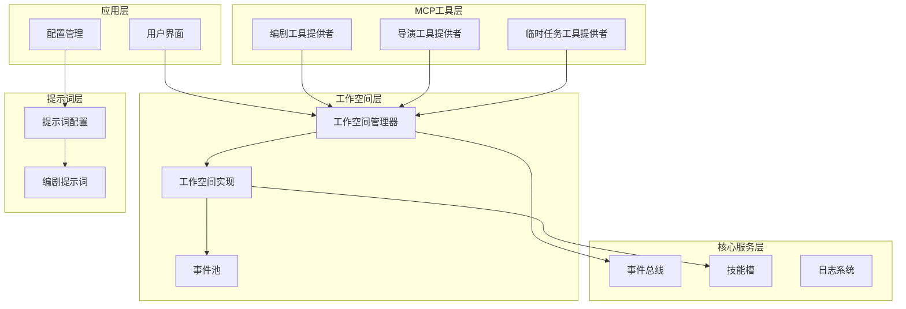
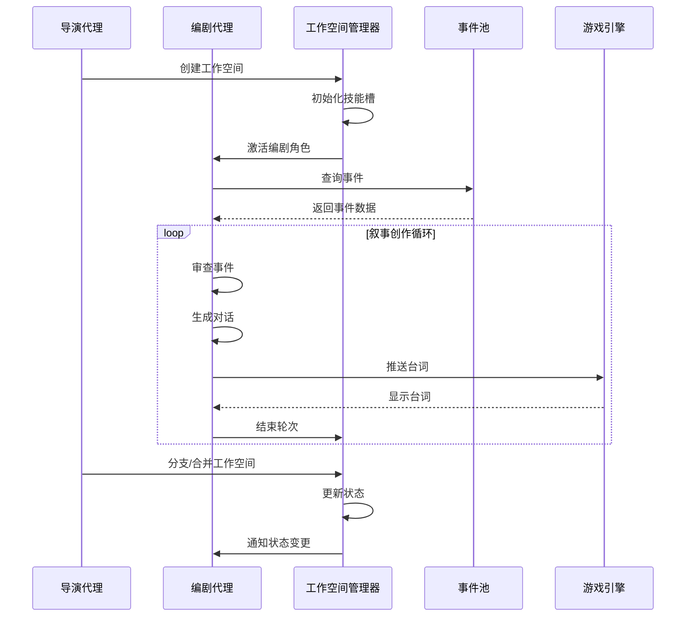
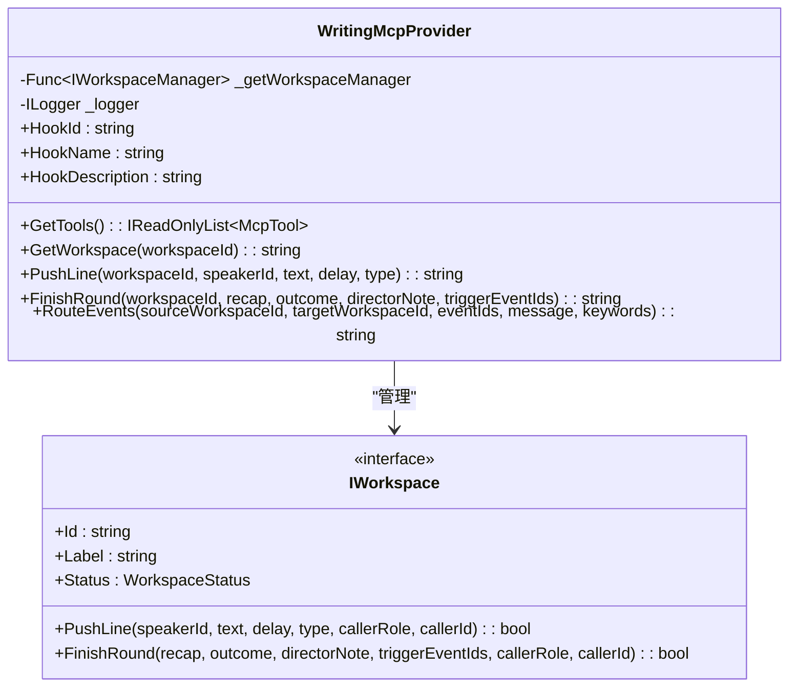
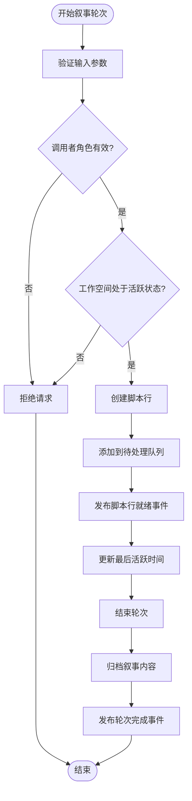
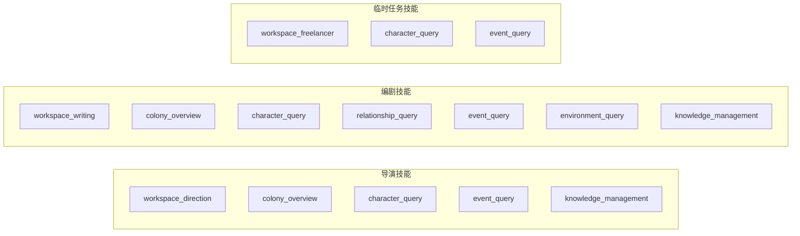
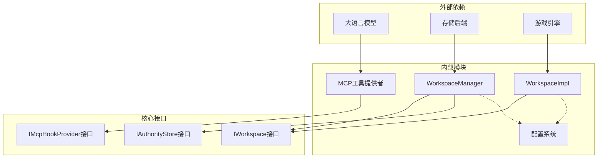

# 编剧代理系统

<cite>
**本文档引用的文件**
- [WritingMcpTools.cs](file://ext/NPCLife/src/NPCLife/Workspace/WritingMcpTools.cs)
- [DirectionMcpTools.cs](file://ext/NPCLife/src/NPCLife/Workspace/DirectionMcpTools.cs)
- [FreelancerMcpTools.cs](file://ext/NPCLife/src/NPCLife/Workspace/FreelancerMcpTools.cs)
- [WorkspaceImpl.cs](file://ext/NPCLife/src/NPCLife/Workspace/WorkspaceImpl.cs)
- [WorkspaceManager.cs](file://ext/NPCLife/src/NPCLife/Workspace/WorkspaceManager.cs)
- [WorkspaceState.cs](file://ext/NPCLife/src/NPCLife/Workspace/WorkspaceState.cs)
- [IWorkspace.cs](file://ext/NPCLife/src/NPCLife/Workspace/IWorkspace.cs)
- [RoleSkillProfile.cs](file://ext/NPCLife/src/NPCLife/Workspace/RoleSkillProfile.cs)
- [DriverConfig.cs](file://ext/NPCLife/src/NPCLife/Driver/DriverConfig.cs)
- [PromptConfig.cs](file://ext/NPCLife/src/NPCLife/Driver/PromptConfig.cs)
- [ScreenwriterPrompt.txt](file://ext/NPCLife/src/NPCLife/Prompts/ScreenwriterPrompt.txt)
- [McpTool.cs](file://ext/NPCLife/src/NPCLife/Framework/Mcp/McpTool.cs)
- [McpToolGenerator.cs](file://ext/NPCLife/src/NPCLife/Framework/Mcp/McpToolGenerator.cs)
</cite>

## 目录
1. [简介](#简介)
2. [项目结构](#项目结构)
3. [核心组件](#核心组件)
4. [架构概览](#架构概览)
5. [详细组件分析](#详细组件分析)
6. [依赖关系分析](#依赖关系分析)
7. [性能考虑](#性能考虑)
8. [故障排除指南](#故障排除指南)
9. [结论](#结论)
10. [附录](#附录)

## 简介
编剧代理系统是一个基于工作空间（Workspace）的叙事创作框架，专为 RimWorld 游戏中的角色互动和故事线发展设计。系统通过 MCP（Model Context Protocol）工具提供者，实现了导演、编剧和临时任务代理三种角色的协作机制。

系统的核心职责包括：
- **具体叙事内容创作**：通过编剧代理生成高质量的对话和场景描述
- **故事线发展**：管理剧情分支、合并和生命周期
- **角色互动**：协调角色之间的关系发展和情感变化
- **事件驱动**：基于游戏事件自动触发叙事创作

## 项目结构
系统采用分层架构设计，主要分为以下层次：

**图表来源**
- [WorkspaceManager.cs:19-622](file://ext/NPCLife/src/NPCLife/Workspace/WorkspaceManager.cs#L19-L622)
- [WritingMcpTools.cs:16-40](file://ext/NPCLife/src/NPCLife/Workspace/WritingMcpTools.cs#L16-L40)
- [PromptConfig.cs:14-164](file://ext/NPCLife/src/NPCLife/Driver/PromptConfig.cs#L14-L164)

**章节来源**
- [WorkspaceManager.cs:19-622](file://ext/NPCLife/src/NPCLife/Workspace/WorkspaceManager.cs#L19-L622)
- [WritingMcpTools.cs:10-40](file://ext/NPCLife/src/NPCLife/Workspace/WritingMcpTools.cs#L10-L40)

## 核心组件
系统包含三个核心组件，每个组件都有特定的职责和权限边界：

### 工作空间管理器（WorkspaceManager）
负责工作空间的生命周期管理和状态转换，提供CRUD操作、分支/合并功能和事件路由。

### 工作空间实现（WorkspaceImpl）
封装了工作空间的状态和行为，提供叙事创作的核心操作，包括台词推送和轮次结束。

### MCP工具提供者
通过IMcpHookProvider接口提供不同角色的MCP工具，实现角色间的协作和权限控制。

**章节来源**
- [WorkspaceManager.cs:19-622](file://ext/NPCLife/src/NPCLife/Workspace/WorkspaceManager.cs#L19-L622)
- [WorkspaceImpl.cs:16-199](file://ext/NPCLife/src/NPCLife/Workspace/WorkspaceImpl.cs#L16-L199)
- [WritingMcpTools.cs:16-40](file://ext/NPCLife/src/NPCLife/Workspace/WritingMcpTools.cs#L16-L40)

## 架构概览
系统采用事件驱动的异步架构，通过事件总线实现组件间的解耦通信：

**图表来源**
- [WorkspaceManager.cs:91-138](file://ext/NPCLife/src/NPCLife/Workspace/WorkspaceManager.cs#L91-L138)
- [WorkspaceImpl.cs:85-184](file://ext/NPCLife/src/NPCLife/Workspace/WorkspaceImpl.cs#L85-L184)
- [WritingMcpTools.cs:50-152](file://ext/NPCLife/src/NPCLife/Workspace/WritingMcpTools.cs#L50-L152)

## 详细组件分析

### 编剧MCP工具提供者
编剧MCP工具提供者实现了完整的叙事创作工具集，包括工作空间查询、台词推送和轮次管理：

**图表来源**
- [WritingMcpTools.cs:16-313](file://ext/NPCLife/src/NPCLife/Workspace/WritingMcpTools.cs#L16-L313)
- [IWorkspace.cs:11-57](file://ext/NPCLife/src/NPCLife/Workspace/IWorkspace.cs#L11-L57)

#### 工具功能详解

**工作空间查询工具**
- 功能：获取指定工作空间的完整编剧视图
- 输出：包含轮次列表、叙事内容和作者信息
- 使用场景：编剧审查当前叙事状态和历史

**台词推送工具**
- 功能：推送单句台词到工作空间
- 支持类型：对话、旁白、动作、停顿
- 并发特性：可并行调用多个推送以减少API往返

**轮次结束工具**
- 功能：结束当前叙事轮次
- 必填参数：前情提要、剧情发展结果、导演留言
- 作用：归档叙事内容并通知导演

**事件路由工具**
- 功能：将事件从源工作空间推送到目标工作空间
- 用途：不适合当前剧情线的事件退回给导演

**章节来源**
- [WritingMcpTools.cs:45-231](file://ext/NPCLife/src/NPCLife/Workspace/WritingMcpTools.cs#L45-L231)

### 工作空间实现
工作空间实现封装了叙事创作的核心逻辑，提供了安全的API访问和事件发布机制：

**图表来源**
- [WorkspaceImpl.cs:85-184](file://ext/NPCLife/src/NPCLife/Workspace/WorkspaceImpl.cs#L85-L184)

#### 核心特性
- **权限控制**：严格限制只有编剧和临时任务代理可以推送台词
- **状态管理**：确保只能在活跃状态下进行叙事操作
- **事件发布**：通过事件总线通知相关组件更新状态
- **数据持久化**：自动保存工作空间状态和叙事历史

**章节来源**
- [WorkspaceImpl.cs:85-184](file://ext/NPCLife/src/NPCLife/Workspace/WorkspaceImpl.cs#L85-L184)

### 角色技能配置
系统为不同角色配置了专门的技能集，确保每个角色都有最适合其职责的工具组合：

**图表来源**
- [RoleSkillProfile.cs:13-74](file://ext/NPCLife/src/NPCLife/Workspace/RoleSkillProfile.cs#L13-L74)

**章节来源**
- [RoleSkillProfile.cs:13-74](file://ext/NPCLife/src/NPCLife/Workspace/RoleSkillProfile.cs#L13-L74)

## 依赖关系分析
系统采用松耦合的设计模式，通过接口和事件实现组件间的解耦：

**图表来源**
- [WorkspaceManager.cs:21-40](file://ext/NPCLife/src/NPCLife/Workspace/WorkspaceManager.cs#L21-L40)
- [IWorkspace.cs:11-57](file://ext/NPCLife/src/NPCLife/Workspace/IWorkspace.cs#L11-L57)

### 关键依赖关系
- **工作空间管理器**依赖于权威存储接口进行持久化
- **工作空间实现**通过事件总线与其他组件通信
- **MCP工具提供者**通过函数工厂获取工作空间管理器实例
- **配置系统**提供统一的提示词和参数管理

**章节来源**
- [WorkspaceManager.cs:21-40](file://ext/NPCLife/src/NPCLife/Workspace/WorkspaceManager.cs#L21-L40)
- [McpTool.cs:14-39](file://ext/NPCLife/src/NPCLife/Framework/Mcp/McpTool.cs#L14-L39)

## 性能考虑
系统在设计时充分考虑了性能优化和资源管理：

### 并发处理
- **读写锁**：使用ReaderWriterLockSlim实现高并发读取
- **异步事件**：通过事件总线实现非阻塞的通知机制
- **批量操作**：支持多个MCP工具的并行调用

### 内存管理
- **对象池**：复用工作空间实例减少GC压力
- **增量序列化**：只序列化必要的状态信息
- **事件缓存**：智能缓存事件数据避免重复查询

### 网络优化
- **工具定义缓存**：预生成MCP工具定义减少反射开销
- **批量传输**：支持多个工具调用的批处理
- **连接复用**：重用LLM API连接提高效率

## 故障排除指南
系统提供了完善的错误处理和诊断机制：

### 常见问题及解决方案

**工作空间不可用**
- 症状：MCP工具调用返回空结果
- 原因：工作空间不存在或管理器未初始化
- 解决：检查工作空间ID和系统初始化状态

**权限不足**
- 症状：工具调用被拒绝并记录警告
- 原因：调用者角色没有相应权限
- 解决：确认角色配置和技能激活状态

**状态异常**
- 症状：操作失败且返回错误信息
- 原因：工作空间状态不符合操作要求
- 解决：检查工作空间状态转换逻辑

**章节来源**
- [WritingMcpTools.cs:63-107](file://ext/NPCLife/src/NPCLife/Workspace/WritingMcpTools.cs#L63-L107)
- [WorkspaceImpl.cs:90-100](file://ext/NPCLife/src/NPCLife/Workspace/WorkspaceImpl.cs#L90-L100)

## 结论
编剧代理系统通过精心设计的架构和严格的权限控制，成功实现了复杂叙事创作的自动化。系统的主要优势包括：

1. **清晰的角色分离**：导演、编剧、临时任务代理各司其职
2. **强大的扩展性**：基于MCP的插件化架构支持功能扩展
3. **高效的性能表现**：异步事件驱动和内存优化确保流畅体验
4. **可靠的稳定性**：完善的错误处理和状态管理机制

该系统为RimWorld游戏提供了强大的叙事创作能力，能够生成丰富、连贯且具有创意的故事内容。

## 附录

### 最佳实践指南

**提示词配置最佳实践**
- 保持提示词简洁明确，突出核心职责
- 使用具体的示例指导AI理解期望输出格式
- 定期更新提示词以适应新的创作需求

**角色一致性维护**
- 为每个角色建立专门的技能配置文件
- 使用事件驱动的方式保持角色行为的一致性
- 建立角色档案管理系统跟踪角色发展轨迹

**故事连贯性保证**
- 利用工作空间的CurrentRecap作为上下文窗口
- 通过事件路由机制确保重要情节的传递
- 建立故事线监控系统跟踪叙事发展方向

**章节来源**
- [PromptConfig.cs:14-164](file://ext/NPCLife/src/NPCLife/Driver/PromptConfig.cs#L14-L164)
- [RoleSkillProfile.cs:13-74](file://ext/NPCLife/src/NPCLife/Workspace/RoleSkillProfile.cs#L13-L74)
- [DriverConfig.cs:9-107](file://ext/NPCLife/src/NPCLife/Driver/DriverConfig.cs#L9-L107)