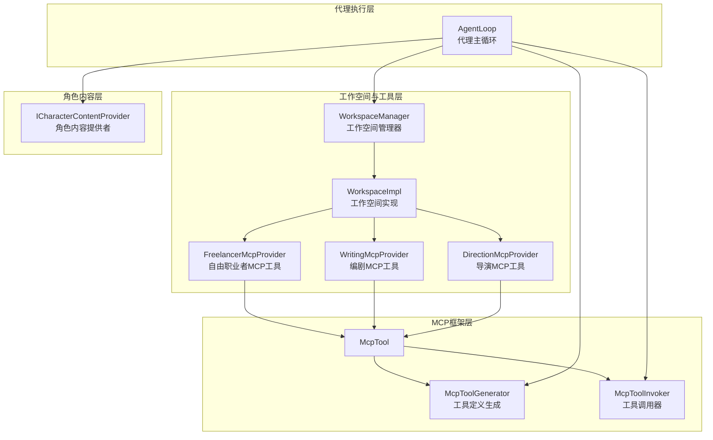
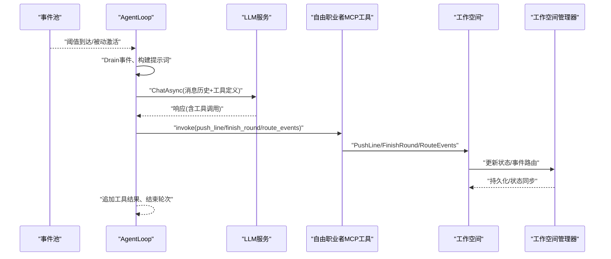
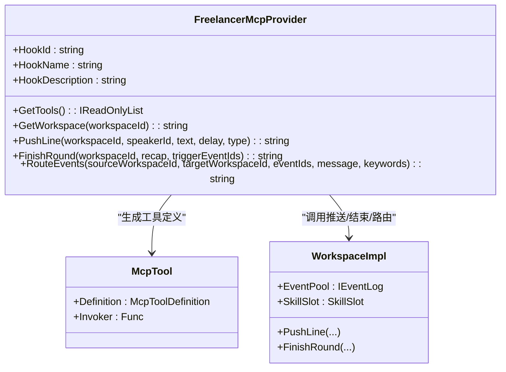
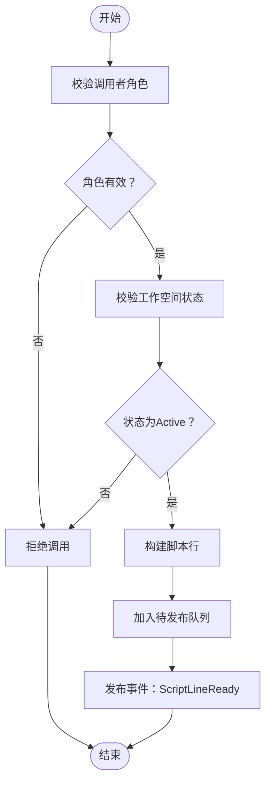
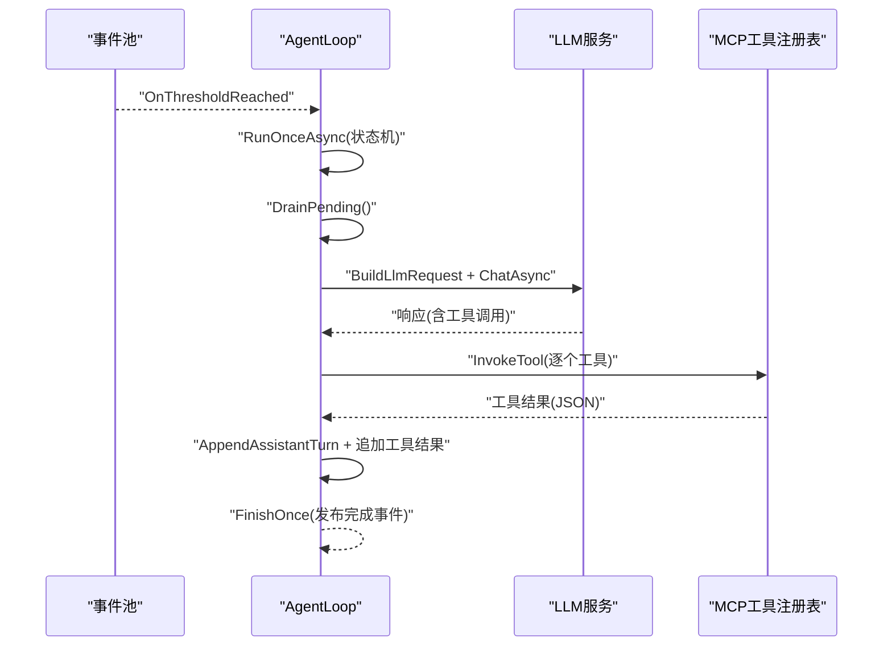
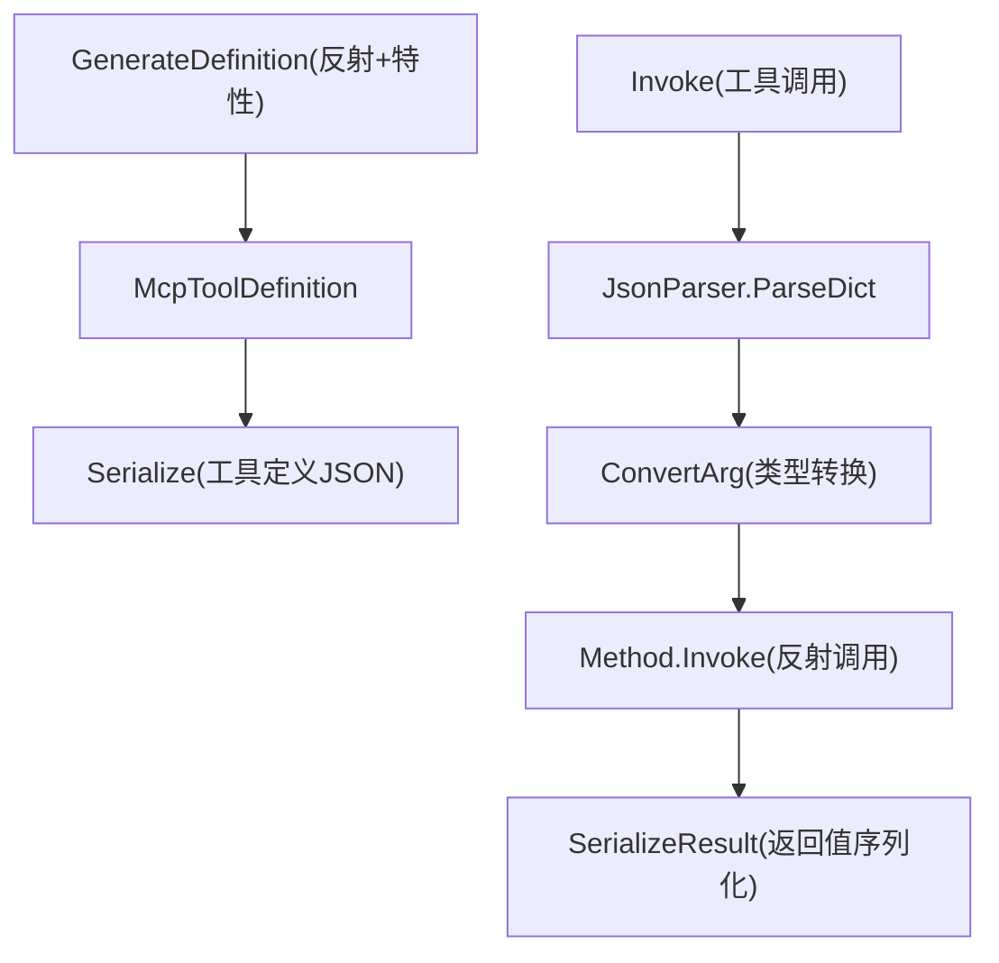
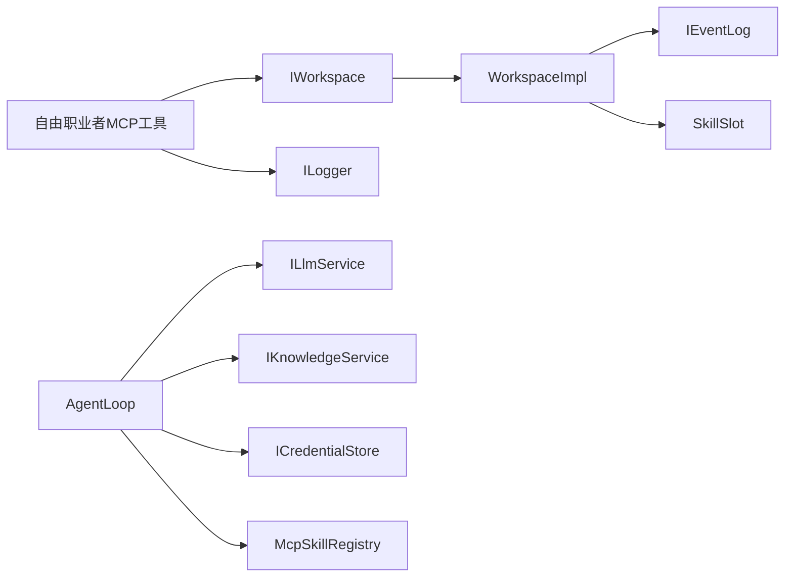

# 自由职业者代理系统

<cite>
**本文档引用的文件**
- [FreelancerMcpTools.cs](file://ext\NPCLife\src\NPCLife\Workspace\FreelancerMcpTools.cs)
- [FreelancerPrompt.txt](file://ext\NPCLife\src\NPCLife\Prompts\FreelancerPrompt.txt)
- [DirectionMcpTools.cs](file://ext\NPCLife\src\NPCLife\Workspace\DirectionMcpTools.cs)
- [WritingMcpTools.cs](file://ext\NPCLife\src\NPCLife\Workspace\WritingMcpTools.cs)
- [ICharacterContentProvider.cs](file://ext\NPCLife\src\NPCLife\Core\ICharacterContentProvider.cs)
- [McpTool.cs](file://ext\NPCLife\src\NPCLife\Framework\Mcp\McpTool.cs)
- [McpToolGenerator.cs](file://ext\NPCLife\src\NPCLife\Framework\Mcp\McpToolGenerator.cs)
- [McpToolInvoker.cs](file://ext\NPCLife\src\NPCLife\Framework\Mcp\McpToolInvoker.cs)
- [IWorkspace.cs](file://ext\NPCLife\src\NPCLife\Workspace\IWorkspace.cs)
- [WorkspaceImpl.cs](file://ext\NPCLife\src\NPCLife\Workspace\WorkspaceImpl.cs)
- [WorkspaceManager.cs](file://ext\NPCLife\src\NPCLife\Workspace\WorkspaceManager.cs)
- [AgentLoop.cs](file://ext\NPCLife\src\NPCLife\Agent\AgentLoop.cs)
</cite>

## 目录
1. [简介](#简介)
2. [项目结构](#项目结构)
3. [核心组件](#核心组件)
4. [架构总览](#架构总览)
5. [详细组件分析](#详细组件分析)
6. [依赖关系分析](#依赖关系分析)
7. [性能考虑](#性能考虑)
8. [故障排除指南](#故障排除指南)
9. [结论](#结论)
10. [附录](#附录)

## 简介
本文件面向“自由职业者代理系统”，系统性阐述自由职业者（临时任务代理）在 RimLife 中的职责边界、触发机制、响应策略与协作方式。自由职业者代理专注于处理突发性、独立性的日常事件，不维护跨轮次的剧情上下文，通过 MCP 工具进行即时叙事输出，并在必要时将事件路由至导演或编剧工作空间。

## 项目结构
围绕自由职业者代理的关键模块包括：
- 工作空间与工具层：工作空间管理器、工作空间实现、三类 MCP 工具提供者（导演、编剧、自由职业者）
- 代理执行层：AgentLoop 主循环，负责被动激活、请求构建、工具调用与结果追加
- MCP 框架层：工具定义生成、调用器、类型映射与序列化
- 角色内容提供层：角色视图层级与内容聚合

**图表来源**
- [WorkspaceManager.cs:19-622](file://ext\NPCLife\src\NPCLife\Workspace\WorkspaceManager.cs#L19-L622)
- [WorkspaceImpl.cs:16-199](file://ext\NPCLife\src\NPCLife\Workspace\WorkspaceImpl.cs#L16-L199)
- [FreelancerMcpTools.cs:21-274](file://ext\NPCLife\src\NPCLife\Workspace\FreelancerMcpTools.cs#L21-L274)
- [WritingMcpTools.cs:16-313](file://ext\NPCLife\src\NPCLife\Workspace\WritingMcpTools.cs#L16-L313)
- [DirectionMcpTools.cs:16-460](file://ext\NPCLife\src\NPCLife\Workspace\DirectionMcpTools.cs#L16-L460)
- [AgentLoop.cs:43-680](file://ext\NPCLife\src\NPCLife\Agent\AgentLoop.cs#L43-L680)
- [McpTool.cs:14-40](file://ext\NPCLife\src\NPCLife\Framework\Mcp\McpTool.cs#L14-L40)
- [McpToolGenerator.cs:12-214](file://ext\NPCLife\src\NPCLife\Framework\Mcp\McpToolGenerator.cs#L12-L214)
- [McpToolInvoker.cs:14-238](file://ext\NPCLife\src\NPCLife\Framework\Mcp\McpToolInvoker.cs#L14-L238)
- [ICharacterContentProvider.cs:21-38](file://ext\NPCLife\src\NPCLife\Core\ICharacterContentProvider.cs#L21-L38)

**章节来源**
- [WorkspaceManager.cs:19-622](file://ext\NPCLife\src\NPCLife\Workspace\WorkspaceManager.cs#L19-L622)
- [WorkspaceImpl.cs:16-199](file://ext\NPCLife\src\NPCLife\Workspace\WorkspaceImpl.cs#L16-L199)
- [FreelancerMcpTools.cs:21-274](file://ext\NPCLife\src\NPCLife\Workspace\FreelancerMcpTools.cs#L21-L274)
- [WritingMcpTools.cs:16-313](file://ext\NPCLife\src\NPCLife\Workspace\WritingMcpTools.cs#L16-L313)
- [DirectionMcpTools.cs:16-460](file://ext\NPCLife\src\NPCLife\Workspace\DirectionMcpTools.cs#L16-L460)
- [AgentLoop.cs:43-680](file://ext\NPCLife\src\NPCLife\Agent\AgentLoop.cs#L43-L680)
- [McpTool.cs:14-40](file://ext\NPCLife\src\NPCLife\Framework\Mcp\McpTool.cs#L14-L40)
- [McpToolGenerator.cs:12-214](file://ext\NPCLife\src\NPCLife\Framework\Mcp\McpToolGenerator.cs#L12-L214)
- [McpToolInvoker.cs:14-238](file://ext\NPCLife\src\NPCLife\Framework\Mcp\McpToolInvoker.cs#L14-L238)
- [ICharacterContentProvider.cs:21-38](file://ext\NPCLife\src\NPCLife\Core\ICharacterContentProvider.cs#L21-L38)

## 核心组件
- 自由职业者 MCP 工具提供者：提供工作空间查询、逐句台词推送、结束本轮、事件路由等工具，专用于日常对话与突发事件的即时叙事输出。
- 工作空间管理器：负责工作空间的创建、状态变更、分支/合并、事件路由与持久化。
- 工作空间实现：封装状态、事件池、技能槽与叙事操作（推送台词、结束轮次）。
- 代理主循环：基于事件池阈值被动激活，构建提示词，调用 LLM 并执行 MCP 工具，最终完成叙事轮次。
- MCP 框架：统一工具定义、参数转换与调用流程，支持特性驱动的工具声明与序列化。

**章节来源**
- [FreelancerMcpTools.cs:36-45](file://ext\NPCLife\src\NPCLife\Workspace\FreelancerMcpTools.cs#L36-L45)
- [WorkspaceManager.cs:91-138](file://ext\NPCLife\src\NPCLife\Workspace\WorkspaceManager.cs#L91-L138)
- [WorkspaceImpl.cs:85-184](file://ext\NPCLife\src\NPCLife\Workspace\WorkspaceImpl.cs#L85-L184)
- [AgentLoop.cs:174-340](file://ext\NPCLife\src\NPCLife\Agent\AgentLoop.cs#L174-L340)
- [McpToolGenerator.cs:19-78](file://ext\NPCLife\src\NPCLife\Framework\Mcp\McpToolGenerator.cs#L19-L78)

## 架构总览
自由职业者代理在系统中的定位与交互如下：

**图表来源**
- [AgentLoop.cs:174-340](file://ext\NPCLife\src\NPCLife\Agent\AgentLoop.cs#L174-L340)
- [FreelancerMcpTools.cs:87-154](file://ext\NPCLife\src\NPCLife\Workspace\FreelancerMcpTools.cs#L87-L154)
- [WorkspaceImpl.cs:85-184](file://ext\NPCLife\src\NPCLife\Workspace\WorkspaceImpl.cs#L85-L184)
- [WorkspaceManager.cs:382-392](file://ext\NPCLife\src\NPCLife\Workspace\WorkspaceManager.cs#L382-L392)

## 详细组件分析

### 自由职业者 MCP 工具提供者
- 职责边界：处理日常对话、临时事件与即时互动；不维护剧情上下文；可将不适合的事件路由回导演工作空间。
- 工具清单：
  - 获取工作空间：返回元数据、关联角色、标签、事件池摘要与轮次统计。
  - 推送台词：逐句输出，支持多种类型（对话、旁白、动作、停顿）。
  - 结束本轮：归档本轮摘要，无需 outcome/directorNote。
  - 事件路由：将事件从源工作空间推送到目标工作空间，支持附加留言与关键词注入。
- 角色约束：仅允许自由职业者身份调用推送与结束轮次。

**图表来源**
- [FreelancerMcpTools.cs:21-274](file://ext\NPCLife\src\NPCLife\Workspace\FreelancerMcpTools.cs#L21-L274)
- [McpTool.cs:14-40](file://ext\NPCLife\src\NPCLife\Framework\Mcp\McpTool.cs#L14-L40)
- [WorkspaceImpl.cs:85-184](file://ext\NPCLife\src\NPCLife\Workspace\WorkspaceImpl.cs#L85-L184)

**章节来源**
- [FreelancerMcpTools.cs:36-45](file://ext\NPCLife\src\NPCLife\Workspace\FreelancerMcpTools.cs#L36-L45)
- [FreelancerMcpTools.cs:55-75](file://ext\NPCLife\src\NPCLife\Workspace\FreelancerMcpTools.cs#L55-L75)
- [FreelancerMcpTools.cs:87-115](file://ext\NPCLife\src\NPCLife\Workspace\FreelancerMcpTools.cs#L87-L115)
- [FreelancerMcpTools.cs:127-154](file://ext\NPCLife\src\NPCLife\Workspace\FreelancerMcpTools.cs#L127-L154)
- [FreelancerMcpTools.cs:165-232](file://ext\NPCLife\src\NPCLife\Workspace\FreelancerMcpTools.cs#L165-L232)

### 工作空间管理器与实现
- 管理器职责：CRUD、状态变更、分支/合并、事件路由与持久化。
- 实现职责：封装状态与组件，提供推送台词、结束轮次等操作；校验调用者角色与工作空间状态；发布事件以驱动脚本交付。
- 事件路由：将事件批量追加到目标工作空间的事件池，支持关键词注入与状态校验。

**图表来源**
- [WorkspaceImpl.cs:85-125](file://ext\NPCLife\src\NPCLife\Workspace\WorkspaceImpl.cs#L85-L125)

**章节来源**
- [WorkspaceManager.cs:91-138](file://ext\NPCLife\src\NPCLife\Workspace\WorkspaceManager.cs#L91-L138)
- [WorkspaceManager.cs:382-392](file://ext\NPCLife\src\NPCLife\Workspace\WorkspaceManager.cs#L382-L392)
- [WorkspaceImpl.cs:85-184](file://ext\NPCLife\src\NPCLife\Workspace\WorkspaceImpl.cs#L85-L184)

### 代理主循环（被动触发与工具调用）
- 触发机制：事件池达到阈值时被动激活；也可外部主动触发。
- 执行流程：Drain事件 → 构建提示词 → LLM请求 → 工具调用循环（最多N轮）→ 追加工具结果 → 结束轮次。
- 错误处理：异常时回灌事件并发布错误事件；支持取消令牌与状态机防重入。

**图表来源**
- [AgentLoop.cs:174-340](file://ext\NPCLife\src\NPCLife\Agent\AgentLoop.cs#L174-L340)
- [McpToolInvoker.cs:24-72](file://ext\NPCLife\src\NPCLife\Framework\Mcp\McpToolInvoker.cs#L24-L72)

**章节来源**
- [AgentLoop.cs:125-168](file://ext\NPCLife\src\NPCLife\Agent\AgentLoop.cs#L125-L168)
- [AgentLoop.cs:214-321](file://ext\NPCLife\src\NPCLife\Agent\AgentLoop.cs#L214-L321)
- [AgentLoop.cs:346-399](file://ext\NPCLife\src\NPCLife\Agent\AgentLoop.cs#L346-L399)

### MCP 工具定义与调用
- 工具定义：通过特性标注方法生成工具定义，包含名称、描述与参数 Schema；支持数组元素类型推断与必填项判定。
- 工具调用：将 JSON 参数反序列化为强类型参数，反射调用目标方法并序列化返回值；异常包装为 JSON 错误。

**图表来源**
- [McpToolGenerator.cs:19-78](file://ext\NPCLife\src\NPCLife\Framework\Mcp\McpToolGenerator.cs#L19-L78)
- [McpToolGenerator.cs:84-102](file://ext\NPCLife\src\NPCLife\Framework\Mcp\McpToolGenerator.cs#L84-L102)
- [McpToolInvoker.cs:24-72](file://ext\NPCLife\src\NPCLife\Framework\Mcp\McpToolInvoker.cs#L24-L72)
- [McpToolInvoker.cs:87-132](file://ext\NPCLife\src\NPCLife\Framework\Mcp\McpToolInvoker.cs#L87-L132)
- [McpToolInvoker.cs:177-226](file://ext\NPCLife\src\NPCLife\Framework\Mcp\McpToolInvoker.cs#L177-L226)

**章节来源**
- [McpToolGenerator.cs:12-214](file://ext\NPCLife\src\NPCLife\Framework\Mcp\McpToolGenerator.cs#L12-L214)
- [McpToolInvoker.cs:14-238](file://ext\NPCLife\src\NPCLife\Framework\Mcp\McpToolInvoker.cs#L14-L238)

### 角色内容提供者与视图层级
- 角色视图层级：static（客观属性）、dynamic（含视角/记忆快照）、full（含记忆流水）。
- 内容聚合：框架收集所有 Provider 的产出后按 SectionName 组装为结构化 JSON，便于提示词注入。

**章节来源**
- [ICharacterContentProvider.cs:6-38](file://ext\NPCLife\src\NPCLife\Core\ICharacterContentProvider.cs#L6-L38)

## 依赖关系分析
- 组件耦合：
  - 自由职业者 MCP 工具依赖工作空间接口与日志接口，通过注入获取 WorkspaceManager。
  - 代理主循环依赖事件池、LLM 服务、凭证存储、知识服务与 MCP 工具注册表。
  - 工作空间实现依赖事件池、技能槽与事件总线，向外部暴露只读元数据与操作。
- 外部集成点：
  - LLM 适配器（如 OpenAI/Anthropic）通过 ILlmService 注入。
  - 知识服务通过 IKnowledgeService 注入，支持关键词检索与提示词增强。
  - 存储后端通过 IAuthorityStore 注入，实现工作空间持久化。

**图表来源**
- [FreelancerMcpTools.cs:23-30](file://ext\NPCLife\src\NPCLife\Workspace\FreelancerMcpTools.cs#L23-L30)
- [WorkspaceImpl.cs:18-46](file://ext\NPCLife\src\NPCLife\Workspace\WorkspaceImpl.cs#L18-L46)
- [AgentLoop.cs:45-58](file://ext\NPCLife\src\NPCLife\Agent\AgentLoop.cs#L45-L58)

**章节来源**
- [FreelancerMcpTools.cs:23-30](file://ext\NPCLife\src\NPCLife\Workspace\FreelancerMcpTools.cs#L23-L30)
- [WorkspaceImpl.cs:18-46](file://ext\NPCLife\src\NPCLife\Workspace\WorkspaceImpl.cs#L18-L46)
- [AgentLoop.cs:45-58](file://ext\NPCLife\src\NPCLife\Agent\AgentLoop.cs#L45-L58)

## 性能考虑
- 响应速度优化
  - 批量推送：在一次响应中并行调用多个 push_line，减少往返延迟。
  - 事件批处理：AgentLoop 在一轮中一次性 Drain 事件，降低频繁激活开销。
  - 工具调用限制：通过最大轮次上限防止无限工具调用循环。
- 对话质量控制
  - 采样温度可控：AgentLoop 支持温度参数，平衡创造性与稳定性。
  - 知识服务注入：基于事件关键词去重查询知识库，提升上下文准确性。
- 情感智能应用
  - 角色视图层级：dynamic/full 提供更丰富的心理与记忆上下文，有助于生成更具情感深度的台词。
  - 事件路由：将不适合当前线的事件推回导演工作空间，避免情感与主题偏离。

[本节为通用指导，无需特定文件引用]

## 故障排除指南
- 工具调用失败
  - 检查调用者角色与工作空间状态：仅允许自由职业者/编剧身份调用推送与结束轮次，且工作空间需处于 Active 状态。
  - 查看日志警告：工具提供者与工作空间实现均会记录警告信息，定位失败原因。
- 事件未被消费
  - 确认事件池阈值是否达到；检查 AgentLoop 是否处于 Idle 状态。
  - 检查事件路由：确认目标工作空间存在且处于 Active 状态。
- LLM 调用异常
  - 检查凭证配置与模型引用；确认工具定义 JSON 正确注入到提示词。
  - 关注工具调用拦截器：工具调用前后拦截器可能取消或修改调用结果。

**章节来源**
- [WorkspaceImpl.cs:90-100](file://ext\NPCLife\src\NPCLife\Workspace\WorkspaceImpl.cs#L90-L100)
- [WorkspaceImpl.cs:130-140](file://ext\NPCLife\src\NPCLife\Workspace\WorkspaceImpl.cs#L130-L140)
- [AgentLoop.cs:373-399](file://ext\NPCLife\src\NPCLife\Agent\AgentLoop.cs#L373-L399)

## 结论
自由职业者代理系统通过明确的角色分工与严格的工具调用约束，实现了对突发性与独立性事件的高效处理。其与导演、编剧工作空间的协作机制确保了叙事的一致性与扩展性。结合 MCP 框架的工具定义与调用能力，系统在响应速度、对话质量与情感智能方面具备良好的可配置性与可扩展性。

[本节为总结，无需特定文件引用]

## 附录

### 自由职业者代理的日常行为模式配置示例（步骤说明）
- 创建工作空间
  - 使用自由职业者工具获取工作空间摘要，确认事件池与标签状态。
  - 参考：[GetWorkspace:57-69](file://ext\NPCLife\src\NPCLife\Workspace\FreelancerMcpTools.cs#L57-L69)
- 推送台词
  - 逐句调用 push_line，设置说话者、文本、延迟与类型；支持多句并行调用。
  - 参考：[PushLine:87-115](file://ext\NPCLife\src\NPCLife\Workspace\FreelancerMcpTools.cs#L87-L115)
- 结束本轮
  - 在推送完所有台词后调用 finish_round，提供本轮摘要与触发事件列表。
  - 参考：[FinishRound:127-154](file://ext\NPCLife\src\NPCLife\Workspace\FreelancerMcpTools.cs#L127-L154)
- 事件路由
  - 将不适合当前线的事件路由至导演或编剧工作空间，可附加留言与关键词。
  - 参考：[RouteEvents:165-232](file://ext\NPCLife\src\NPCLife\Workspace\FreelancerMcpTools.cs#L165-L232)

### 自由职业者代理提示词要点
- 职责边界：处理突发性、独立性事件，不维护剧情延续性。
- 叙事风格：轻快、即兴、快速响应；每轮仅处理当前批次事件。
- 工具使用：严格遵循 push_line → finish_round 流程；必要时使用 route_events。
- 参考：[FreelancerPrompt.txt:1-18](file://ext\NPCLife\src\NPCLife\Prompts\FreelancerPrompt.txt#L1-L18)