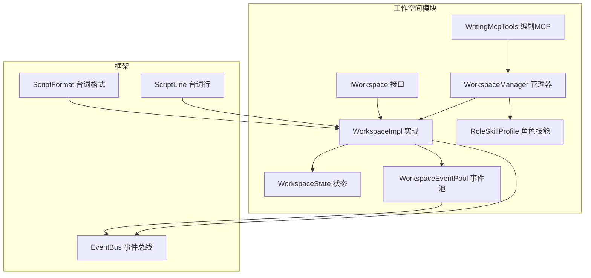
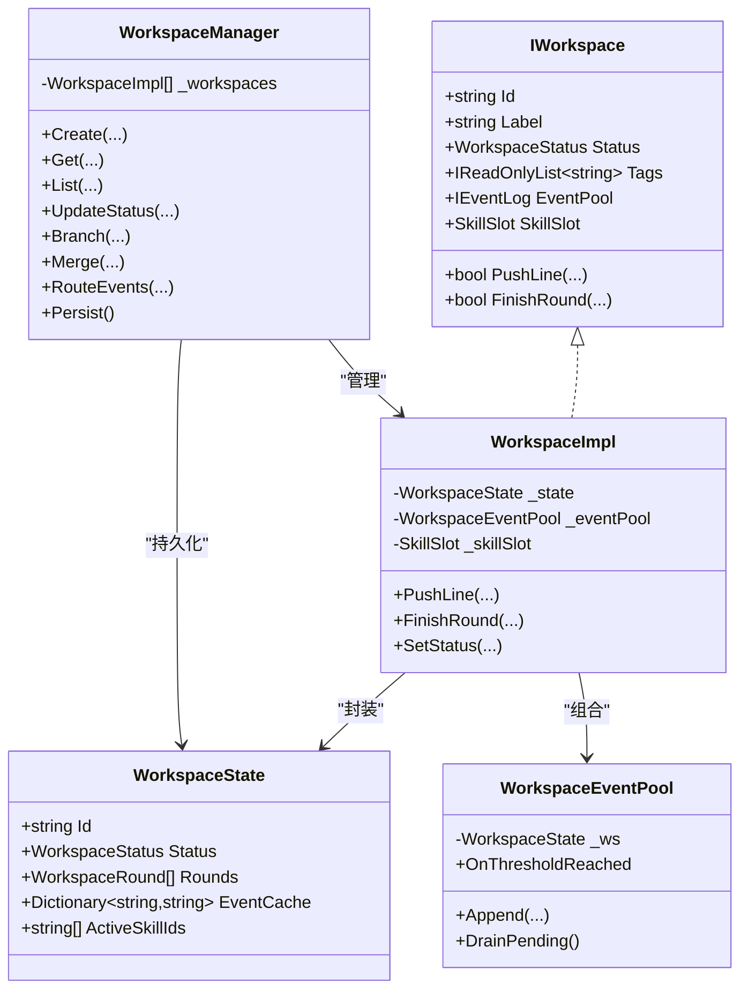
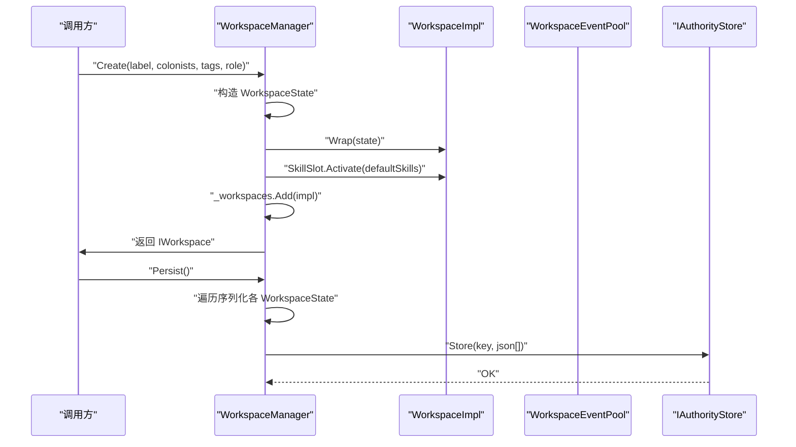
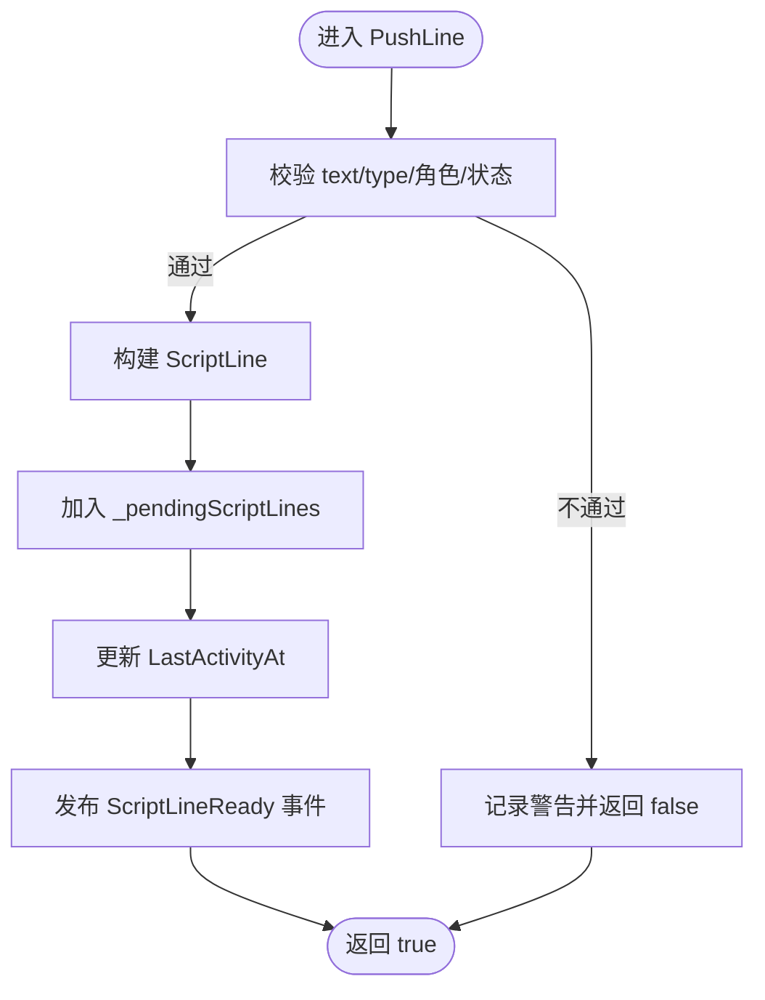
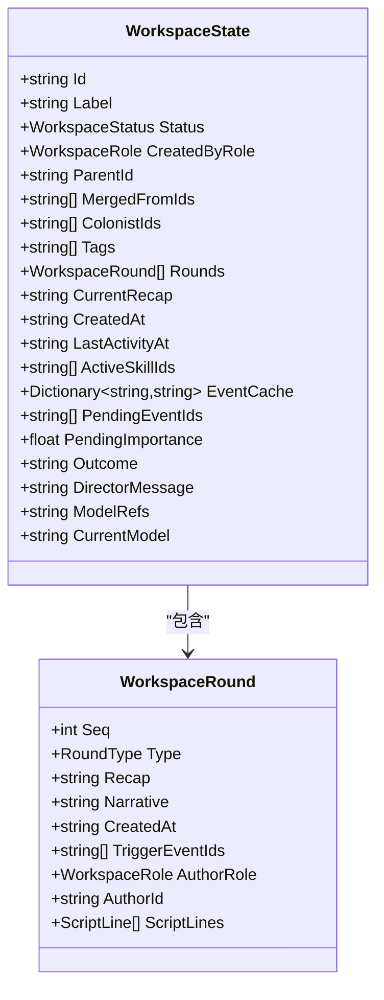
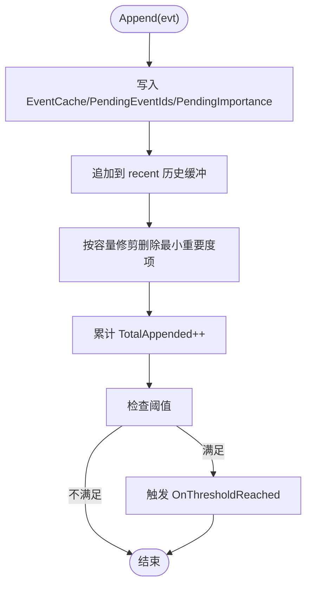
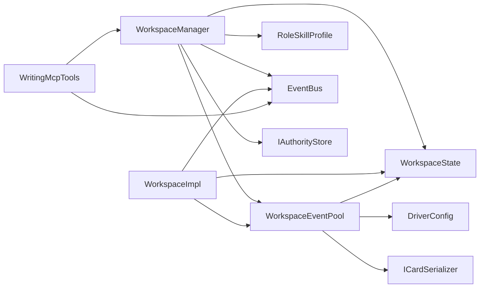

# 工作空间管理系统

<cite>
**本文引用的文件**
- [IWorkspace.cs](file://ext\NPCLife\src\NPCLife\Workspace\IWorkspace.cs)
- [WorkspaceImpl.cs](file://ext\NPCLife\src\NPCLife\Workspace\WorkspaceImpl.cs)
- [WorkspaceManager.cs](file://ext\NPCLife\src\NPCLife\Workspace\WorkspaceManager.cs)
- [WorkspaceState.cs](file://ext\NPCLife\src\NPCLife\Workspace\WorkspaceState.cs)
- [WorkspaceEventPool.cs](file://ext\NPCLife\src\NPCLife\Workspace\WorkspaceEventPool.cs)
- [IWorkspaceManager.cs](file://ext\NPCLife\src\NPCLife\Core\IWorkspaceManager.cs)
- [RoleSkillProfile.cs](file://ext\NPCLife\src\NPCLife\Workspace\RoleSkillProfile.cs)
- [WritingMcpTools.cs](file://ext\NPCLife\src\NPCLife\Workspace\WritingMcpTools.cs)
- [EventBus.cs](file://ext\NPCLife\src\NPCLife\Framework\EventBus.cs)
- [ScriptLine.cs](file://ext\NPCLife\src\NPCLife\Framework\Script\ScriptLine.cs)
- [ScriptFormat.cs](file://ext\NPCLife\src\NPCLife\Framework\Script\ScriptFormat.cs)
- [WorkspaceEventPoolTests.cs](file://ext\NPCLife\tests\NPCLife.Tests\Driver\WorkspaceEventPoolTests.cs)
</cite>

## 目录
1. [简介](#简介)
2. [项目结构](#项目结构)
3. [核心组件](#核心组件)
4. [架构总览](#架构总览)
5. [详细组件分析](#详细组件分析)
6. [依赖关系分析](#依赖关系分析)
7. [性能考虑](#性能考虑)
8. [故障排查指南](#故障排查指南)
9. [结论](#结论)
10. [附录](#附录)

## 简介
本技术文档面向“工作空间管理系统”，围绕工作空间的概念、创建、管理与销毁流程进行系统化阐述；深入解析 WorkspaceManager 的实现，涵盖工作空间的 CRUD 操作、分支与合并机制；详解 WorkspaceImpl 的内部实现，包括状态管理、事件池与生命周期控制；梳理 WorkspaceState 的状态转换与持久化机制；并补充工作空间配置、标签系统与权限控制、事件路由、并发控制与性能优化策略，以及使用示例与最佳实践。

## 项目结构
工作空间系统位于 ext\NPCLife\src\NPCLife\Workspace 下，核心文件包括：
- IWorkspace.cs：工作空间门面接口，定义元数据、内部组件与叙事操作。
- WorkspaceImpl.cs：工作空间实现，封装 WorkspaceState 并暴露组件与操作。
- WorkspaceManager.cs：工作空间管理器，负责 CRUD、分支/合并、事件路由与持久化。
- WorkspaceState.cs：工作空间状态数据结构，含角色、状态、轮次、事件缓存等。
- WorkspaceEventPool.cs：工作空间内部事件池，实现 IEventLog，支持阈值触发与持久化。
- RoleSkillProfile.cs：角色默认技能集配置。
- WritingMcpTools.cs：编剧 MCP 工具提供者，封装工作空间查询、推送台词、结束轮次与事件路由。
- IWorkspaceManager.cs：管理器接口定义。
- EventBus.cs：通用事件总线，用于跨模块事件发布/订阅。
- ScriptLine.cs 与 ScriptFormat.cs：台词数据契约与格式解析。
- WorkspaceEventPoolTests.cs：事件池单元测试，验证阈值触发与激活条件。

图表来源
- [WorkspaceManager.cs:1-622](file://ext\NPCLife\src\NPCLife\Workspace\WorkspaceManager.cs#L1-L622)
- [WorkspaceImpl.cs:1-199](file://ext\NPCLife\src\NPCLife\Workspace\WorkspaceImpl.cs#L1-L199)
- [WorkspaceState.cs:1-162](file://ext\NPCLife\src\NPCLife\Workspace\WorkspaceState.cs#L1-L162)
- [WorkspaceEventPool.cs:1-186](file://ext\NPCLife\src\NPCLife\Workspace\WorkspaceEventPool.cs#L1-L186)
- [RoleSkillProfile.cs:1-74](file://ext\NPCLife\src\NPCLife\Workspace\RoleSkillProfile.cs#L1-L74)
- [WritingMcpTools.cs:1-313](file://ext\NPCLife\src\NPCLife\Workspace\WritingMcpTools.cs#L1-L313)
- [EventBus.cs:1-243](file://ext\NPCLife\src\NPCLife\Framework\EventBus.cs#L1-L243)
- [ScriptFormat.cs:1-281](file://ext\NPCLife\src\NPCLife\Framework\Script\ScriptFormat.cs#L1-L281)
- [ScriptLine.cs:1-43](file://ext\NPCLife\src\NPCLife\Framework\Script\ScriptLine.cs#L1-L43)

章节来源
- [WorkspaceManager.cs:1-622](file://ext\NPCLife\src\NPCLife\Workspace\WorkspaceManager.cs#L1-L622)
- [WorkspaceImpl.cs:1-199](file://ext\NPCLife\src\NPCLife\Workspace\WorkspaceImpl.cs#L1-L199)
- [WorkspaceState.cs:1-162](file://ext\NPCLife\src\NPCLife\Workspace\WorkspaceState.cs#L1-L162)
- [WorkspaceEventPool.cs:1-186](file://ext\NPCLife\src\NPCLife\Workspace\WorkspaceEventPool.cs#L1-L186)
- [RoleSkillProfile.cs:1-74](file://ext\NPCLife\src\NPCLife\Workspace\RoleSkillProfile.cs#L1-L74)
- [WritingMcpTools.cs:1-313](file://ext\NPCLife\src\NPCLife\Workspace\WritingMcpTools.cs#L1-L313)
- [EventBus.cs:1-243](file://ext\NPCLife\src\NPCLife\Framework\EventBus.cs#L1-L243)
- [ScriptFormat.cs:1-281](file://ext\NPCLife\src\NPCLife\Framework\Script\ScriptFormat.cs#L1-L281)
- [ScriptLine.cs:1-43](file://ext\NPCLife\src\NPCLife\Framework\Script\ScriptLine.cs#L1-L43)

## 核心组件
- 工作空间门面接口 IWorkspace：定义只读元数据、内部组件（事件池、技能槽）与叙事操作（推送台词、结束轮次）。
- 工作空间实现 WorkspaceImpl：封装 WorkspaceState，暴露组件与操作，负责权限校验、状态变更与事件发布。
- 工作空间管理器 WorkspaceManager：负责工作空间的创建、查询、列表、状态更新、分支/合并、事件路由与持久化。
- 工作空间状态 WorkspaceState：承载工作空间的元数据、轮次、事件缓存、技能激活列表、模型引用等。
- 事件池 WorkspaceEventPool：实现 IEventLog，支持阈值触发、最近历史缓冲与持久化。
- 角色技能配置 RoleSkillProfile：根据角色自动激活默认技能集。
- 编剧 MCP 工具 WritingMcpTools：提供查询、推送台词、结束轮次与事件路由的 MCP 工具。
- 事件总线 EventBus：统一事件发布/订阅，支持优先级与错误隔离。
- 台词格式与数据 ScriptFormat/ScriptLine：定义台词输出格式与解析逻辑。

章节来源
- [IWorkspace.cs:1-57](file://ext\NPCLife\src\NPCLife\Workspace\IWorkspace.cs#L1-L57)
- [WorkspaceImpl.cs:16-199](file://ext\NPCLife\src\NPCLife\Workspace\WorkspaceImpl.cs#L16-L199)
- [WorkspaceManager.cs:19-622](file://ext\NPCLife\src\NPCLife\Workspace\WorkspaceManager.cs#L19-L622)
- [WorkspaceState.cs:94-162](file://ext\NPCLife\src\NPCLife\Workspace\WorkspaceState.cs#L94-L162)
- [WorkspaceEventPool.cs:21-186](file://ext\NPCLife\src\NPCLife\Workspace\WorkspaceEventPool.cs#L21-L186)
- [RoleSkillProfile.cs:13-74](file://ext\NPCLife\src\NPCLife\Workspace\RoleSkillProfile.cs#L13-L74)
- [WritingMcpTools.cs:16-313](file://ext\NPCLife\src\NPCLife\Workspace\WritingMcpTools.cs#L16-L313)
- [EventBus.cs:17-243](file://ext\NPCLife\src\NPCLife\Framework\EventBus.cs#L17-L243)
- [ScriptFormat.cs:13-281](file://ext\NPCLife\src\NPCLife\Framework\Script\ScriptFormat.cs#L13-L281)
- [ScriptLine.cs:25-43](file://ext\NPCLife\src\NPCLife\Framework\Script\ScriptLine.cs#L25-L43)

## 架构总览
工作空间系统采用“门面 + 实现 + 管理器”的分层设计：
- IWorkspace 作为门面，屏蔽内部实现细节；
- WorkspaceImpl 包装 WorkspaceState，暴露组件与操作；
- WorkspaceManager 统一管理内存中的工作空间集合，负责 CRUD、分支/合并、事件路由与持久化；
- WorkspaceEventPool 作为内部组件，提供事件写入、查询、阈值触发与持久化；
- RoleSkillProfile 为不同角色提供默认技能集；
- WritingMcpTools 通过 IMcpHookProvider 注入 WorkspaceManager，提供 MCP 工具；
- EventBus 用于跨模块事件通信；
- ScriptFormat/ScriptLine 定义并解析台词数据契约。

图表来源
- [IWorkspace.cs:11-57](file://ext\NPCLife\src\NPCLife\Workspace\IWorkspace.cs#L11-L57)
- [WorkspaceImpl.cs:16-199](file://ext\NPCLife\src\NPCLife\Workspace\WorkspaceImpl.cs#L16-L199)
- [WorkspaceManager.cs:19-622](file://ext\NPCLife\src\NPCLife\Workspace\WorkspaceManager.cs#L19-L622)
- [WorkspaceState.cs:94-162](file://ext\NPCLife\src\NPCLife\Workspace\WorkspaceState.cs#L94-L162)
- [WorkspaceEventPool.cs:21-186](file://ext\NPCLife\src\NPCLife\Workspace\WorkspaceEventPool.cs#L21-L186)

## 详细组件分析

### WorkspaceManager：工作空间管理与持久化
- 职责边界清晰：CRUD、分支/合并结构操作、事件路由；内部组件通过 IWorkspace 访问，管理器不关心具体实现。
- 并发控制：使用 ReaderWriterLockSlim 保护内存中的工作空间集合，读多写少场景下提升并发性能。
- 状态转换：提供状态更新方法，严格校验状态机合法性，避免非法状态流转。
- 分支/合并：复制父工作空间的轮次与技能，生成分支/合并轮次；合并时去重轮次序号并聚合标签与殖民者列表。
- 事件路由：将事件写入指定工作空间的事件池，由事件池负责阈值触发。
- 持久化：序列化所有工作空间状态为 JSON 数组，写入 IAuthorityStore；加载时反序列化并恢复状态，必要时通知就绪。

图表来源
- [WorkspaceManager.cs:91-138](file://ext\NPCLife\src\NPCLife\Workspace\WorkspaceManager.cs#L91-L138)
- [WorkspaceManager.cs:50-74](file://ext\NPCLife\src\NPCLife\Workspace\WorkspaceManager.cs#L50-L74)
- [WorkspaceManager.cs:429-457](file://ext\NPCLife\src\NPCLife\Workspace\WorkspaceManager.cs#L429-L457)

章节来源
- [WorkspaceManager.cs:19-622](file://ext\NPCLife\src\NPCLife\Workspace\WorkspaceManager.cs#L19-L622)

### WorkspaceImpl：状态管理、事件池与生命周期
- 权限控制：PushLine/FinishRound 仅允许 Screenwriter/Freelancer 调用；状态必须为 Active。
- 状态变更：SetStatus 更新状态与最后活跃时间，必要时写入 Outcome。
- 事件发布：PushLine 成功后发布 ScriptLineReady；FinishRound 成功后发布 ScriptReady。
- 内部组件：事件池与技能槽通过构造注入，技能槽变更会触发持久化通知。

图表来源
- [WorkspaceImpl.cs:85-125](file://ext\NPCLife\src\NPCLife\Workspace\WorkspaceImpl.cs#L85-L125)

章节来源
- [WorkspaceImpl.cs:16-199](file://ext\NPCLife\src\NPCLife\Workspace\WorkspaceImpl.cs#L16-L199)

### WorkspaceState：状态、轮次与持久化字段
- 角色与状态：WorkspaceRole、WorkspaceStatus、RoundType。
- 轮次结构：WorkspaceRound 包含序号、类型、前情提要、正式叙事、触发事件 ID、作者角色与 ID、解析后的台词行。
- 状态字段：Id、Label、Status、CreatedByRole、ParentId、MergedFromIds、ColonistIds、Tags、Rounds、CurrentRecap、CreatedAt、LastActivityAt、ActiveSkillIds、EventCache、PendingEventIds、PendingImportance、Outcome、DirectorMessage、ModelRefs、CurrentModel。
- 持久化：管理器负责序列化/反序列化，保持字段兼容性与默认值。

图表来源
- [WorkspaceState.cs:94-162](file://ext\NPCLife\src\NPCLife\Workspace\WorkspaceState.cs#L94-L162)
- [WorkspaceState.cs:60-88](file://ext\NPCLife\src\NPCLife\Workspace\WorkspaceState.cs#L60-L88)

章节来源
- [WorkspaceState.cs:9-162](file://ext\NPCLife\src\NPCLife\Workspace\WorkspaceState.cs#L9-L162)

### WorkspaceEventPool：事件阈值触发与持久化
- 双层结构：pending（随 WorkspaceState 持久化）与 recent（仅内存，受 DriverConfig.RecentHistoryCapacity 限制）。
- 阈值检测：基于 DriverConfig 的有效计数阈值与重要度阈值，任一满足即触发 OnThresholdReached。
- DrainPending：清空 pending 并返回事件列表，用于消费与清账。
- 查询能力：支持按标签、时间范围、演员、最小重要度等筛选，支持偏移与限制。

图表来源
- [WorkspaceEventPool.cs:49-90](file://ext\NPCLife\src\NPCLife\Workspace\WorkspaceEventPool.cs#L49-L90)
- [WorkspaceEventPool.cs:166-183](file://ext\NPCLife\src\NPCLife\Workspace\WorkspaceEventPool.cs#L166-L183)

章节来源
- [WorkspaceEventPool.cs:21-186](file://ext\NPCLife\src\NPCLife\Workspace\WorkspaceEventPool.cs#L21-L186)

### 角色与权限控制
- WorkspaceRole：Director（导演）、Screenwriter（编剧）、Freelancer（临时工）。
- 权限约束：
  - PushLine/FinishRound 仅允许 Screenwriter/Freelancer；
  - Branch/Merge 仅允许 Director；
  - 仅 Active 状态可进行叙事操作与事件路由。
- 默认技能集：根据角色自动激活相应技能，便于不同角色的上下文查询与创作。

章节来源
- [WorkspaceState.cs:9-53](file://ext\NPCLife\src\NPCLife\Workspace\WorkspaceState.cs#L9-L53)
- [WorkspaceImpl.cs:85-125](file://ext\NPCLife\src\NPCLife\Workspace\WorkspaceImpl.cs#L85-L125)
- [WorkspaceManager.cs:193-263](file://ext\NPCLife\src\NPCLife\Workspace\WorkspaceManager.cs#L193-L263)
- [RoleSkillProfile.cs:13-74](file://ext\NPCLife\src\NPCLife\Workspace\RoleSkillProfile.cs#L13-L74)

### 事件路由与生命周期事件
- 事件路由：WorkspaceManager.RouteEvents 将事件写入目标工作空间的事件池。
- 生命周期事件：管理器在创建、更新、关闭工作空间时发布框架事件，供订阅者响应。
- 事件总线：EventBus 支持优先级、错误隔离与调试统计。

章节来源
- [WorkspaceManager.cs:382-392](file://ext\NPCLife\src\NPCLife\Workspace\WorkspaceManager.cs#L382-L392)
- [WorkspaceManager.cs:134-136](file://ext\NPCLife\src\NPCLife\Workspace\WorkspaceManager.cs#L134-L136)
- [WorkspaceManager.cs:180-184](file://ext\NPCLife\src\NPCLife\Workspace\WorkspaceManager.cs#L180-L184)
- [EventBus.cs:186-242](file://ext\NPCLife\src\NPCLife\Framework\EventBus.cs#L186-L242)

### 台词格式与推送
- ScriptFormat：定义 JSON 字段 Schema，生成格式规范与解析器，支持 dialogue/narration/action/pause 类型。
- PushLine：将解析后的 ScriptLine 列表逐行发布到游戏侧显示，支持延迟与类型标注。
- FinishRound：归档当前轮次的 Recap、Narrative、Outcome 与 DirectorMessage，并发布 ScriptReady 事件。

章节来源
- [ScriptFormat.cs:13-281](file://ext\NPCLife\src\NPCLife\Framework\Script\ScriptFormat.cs#L13-L281)
- [ScriptLine.cs:25-43](file://ext\NPCLife\src\NPCLife\Framework\Script\ScriptLine.cs#L25-L43)
- [WorkspaceImpl.cs:85-184](file://ext\NPCLife\src\NPCLife\Workspace\WorkspaceImpl.cs#L85-L184)

### MCP 工具与编剧视图
- WritingMcpTools：提供 get_workspace、push_line、finish_round、route_events 等工具，通过 IMcpHookProvider 注入 WorkspaceManager。
- 编剧视图：序列化完整轮次列表与叙事内容，便于外部系统查看与审计。

章节来源
- [WritingMcpTools.cs:16-313](file://ext\NPCLife\src\NPCLife\Workspace\WritingMcpTools.cs#L16-L313)

## 依赖关系分析
- WorkspaceManager 依赖 WorkspaceState、WorkspaceEventPool、RoleSkillProfile、EventBus、IAuthorityStore、DriverConfig、ICardSerializer。
- WorkspaceImpl 依赖 WorkspaceState、WorkspaceEventPool、SkillSlot、EventBus、ILogger。
- WorkspaceEventPool 依赖 WorkspaceState、DriverConfig、ICardSerializer。
- WritingMcpTools 依赖 IWorkspaceManager、ILogger、IMcpHookProvider、McpTool 系统。
- EventBus 为全局静态事件总线，提供跨模块解耦。

图表来源
- [WorkspaceManager.cs:19-622](file://ext\NPCLife\src\NPCLife\Workspace\WorkspaceManager.cs#L19-L622)
- [WorkspaceImpl.cs:16-199](file://ext\NPCLife\src\NPCLife\Workspace\WorkspaceImpl.cs#L16-L199)
- [WorkspaceEventPool.cs:21-186](file://ext\NPCLife\src\NPCLife\Workspace\WorkspaceEventPool.cs#L21-L186)
- [WritingMcpTools.cs:16-313](file://ext\NPCLife\src\NPCLife\Workspace\WritingMcpTools.cs#L16-L313)
- [EventBus.cs:17-243](file://ext\NPCLife\src\NPCLife\Framework\EventBus.cs#L17-L243)

章节来源
- [WorkspaceManager.cs:19-622](file://ext\NPCLife\src\NPCLife\Workspace\WorkspaceManager.cs#L19-L622)
- [WorkspaceImpl.cs:16-199](file://ext\NPCLife\src\NPCLife\Workspace\WorkspaceImpl.cs#L16-L199)
- [WorkspaceEventPool.cs:21-186](file://ext\NPCLife\src\NPCLife\Workspace\WorkspaceEventPool.cs#L21-L186)
- [WritingMcpTools.cs:16-313](file://ext\NPCLife\src\NPCLife\Workspace\WritingMcpTools.cs#L16-L313)
- [EventBus.cs:17-243](file://ext\NPCLife\src\NPCLife\Framework\EventBus.cs#L17-L243)

## 性能考虑
- 并发控制：使用 ReaderWriterLockSlim 降低读写冲突，适合高并发读取与低频写入场景。
- 事件池阈值：通过 DriverConfig 的计数与重要度阈值，避免频繁触发与过度消费。
- 最近历史缓冲：限制 recent 历史容量，平衡内存占用与查询效率。
- 序列化开销：批量序列化工作空间状态，减少 I/O 次数；仅持久化必要字段。
- 事件发布：EventBus 错误隔离，避免单个订阅者异常影响整体性能。

## 故障排查指南
- PushLine/FinishRound 失败：
  - 检查调用角色是否为 Screenwriter/Freelancer；
  - 确认工作空间状态为 Active；
  - 查看日志警告信息定位原因。
- 事件池未触发阈值：
  - 核对 DriverConfig 的阈值配置；
  - 确认事件的重要性与数量是否达标；
  - 使用测试用例验证阈值行为。
- 持久化失败：
  - 检查 IAuthorityStore 是否可用；
  - 查看日志中的异常信息；
  - 确保 WorkspaceState 字段完整性。

章节来源
- [WorkspaceImpl.cs:85-125](file://ext\NPCLife\src\NPCLife\Workspace\WorkspaceImpl.cs#L85-L125)
- [WorkspaceEventPoolTests.cs:138-275](file://ext\NPCLife\tests\NPCLife.Tests\Driver\WorkspaceEventPoolTests.cs#L138-L275)
- [WorkspaceManager.cs:69-73](file://ext\NPCLife\src\NPCLife\Workspace\WorkspaceManager.cs#L69-L73)

## 结论
工作空间管理系统通过清晰的分层设计与严格的权限控制，实现了高效、可扩展的叙事创作与管理工作流。管理器负责全局协调与持久化，实现类封装状态与组件，事件池提供灵活的阈值触发机制，MCP 工具链打通外部调用入口。配合事件总线与配置化的阈值策略，系统在保证一致性的同时兼顾性能与可维护性。

## 附录

### 使用示例与最佳实践
- 创建工作空间：选择合适的角色（Director/Screenwriter/Freelancer），传入标签与关联殖民者，系统自动激活默认技能集。
- 推送台词：使用 PushLine 逐句推送，注意类型与延迟；完成后调用 FinishRound 归档轮次。
- 事件路由：编剧可将不适合当前线的事件路由至导演工作空间，附带关键词与留言。
- 分支/合并：导演可对活跃工作空间进行分支与合并，系统自动生成结构轮次并去重轮次序号。
- 最佳实践：
  - 为不同角色配置合适的阈值，避免过度触发；
  - 合理设置最近历史容量，平衡内存与查询；
  - 在合适时机调用 Persist，确保状态落盘；
  - 使用 EventBus 订阅工作空间生命周期事件，实现自动化流程。

章节来源
- [WorkspaceManager.cs:91-138](file://ext\NPCLife\src\NPCLife\Workspace\WorkspaceManager.cs#L91-L138)
- [WorkspaceImpl.cs:85-184](file://ext\NPCLife\src\NPCLife\Workspace\WorkspaceImpl.cs#L85-L184)
- [WritingMcpTools.cs:77-152](file://ext\NPCLife\src\NPCLife\Workspace\WritingMcpTools.cs#L77-L152)
- [WorkspaceManager.cs:193-376](file://ext\NPCLife\src\NPCLife\Workspace\WorkspaceManager.cs#L193-L376)