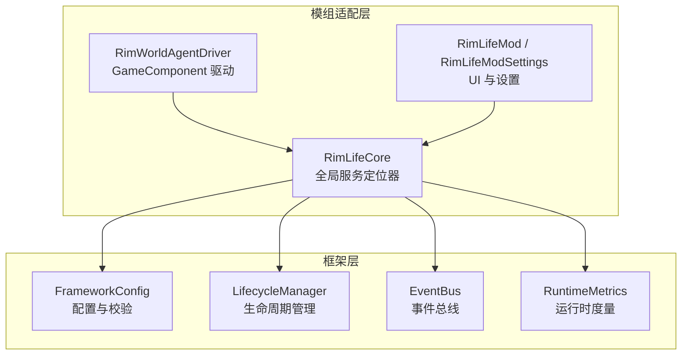
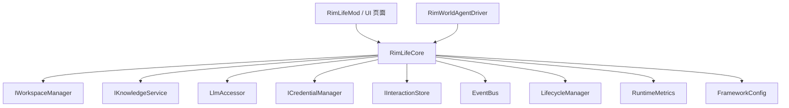
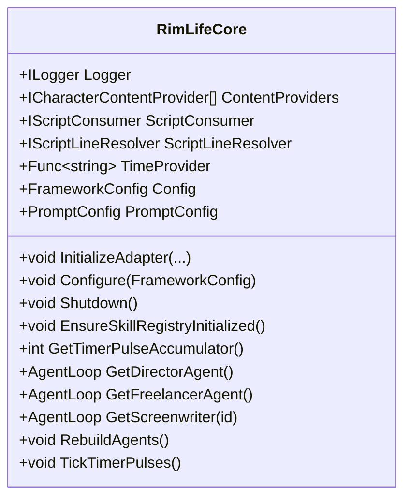
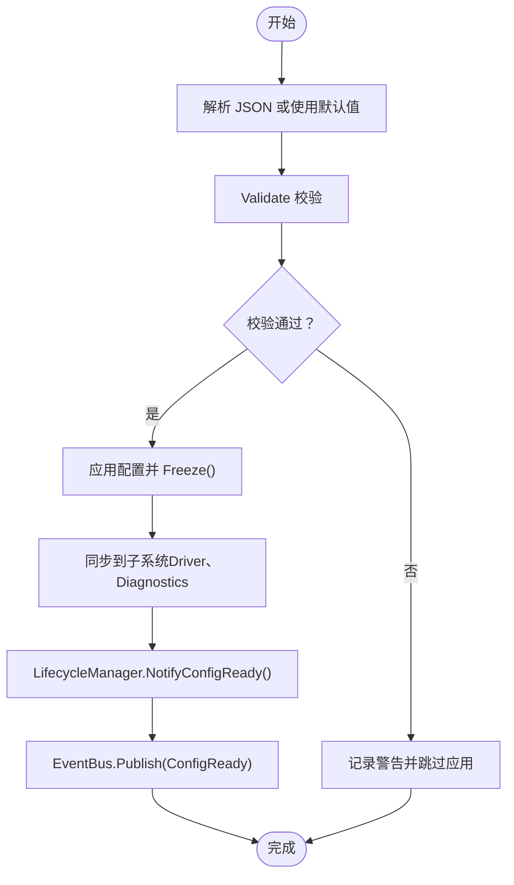
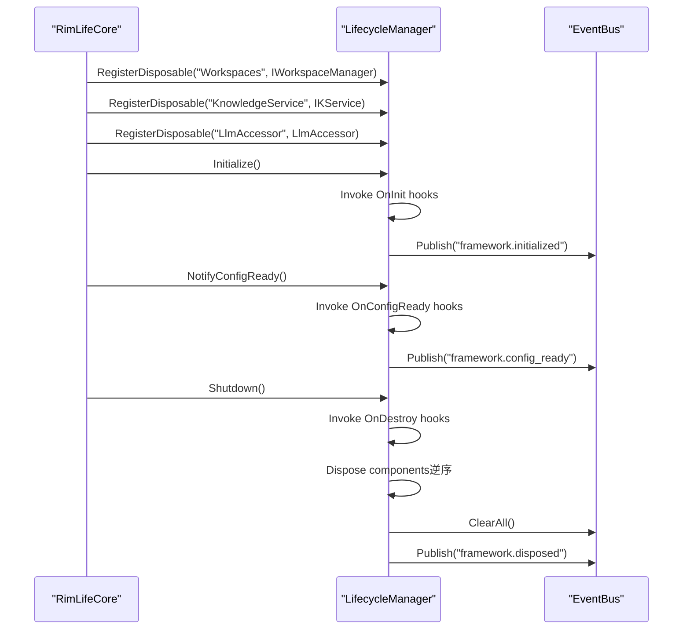
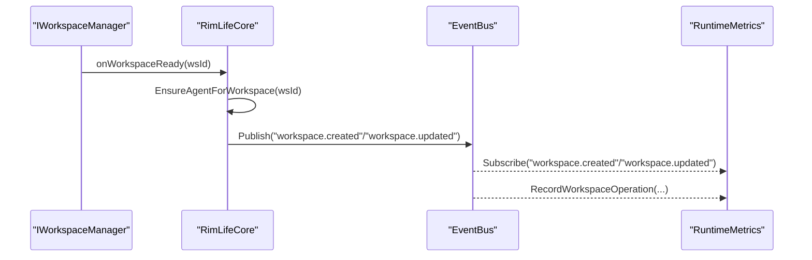
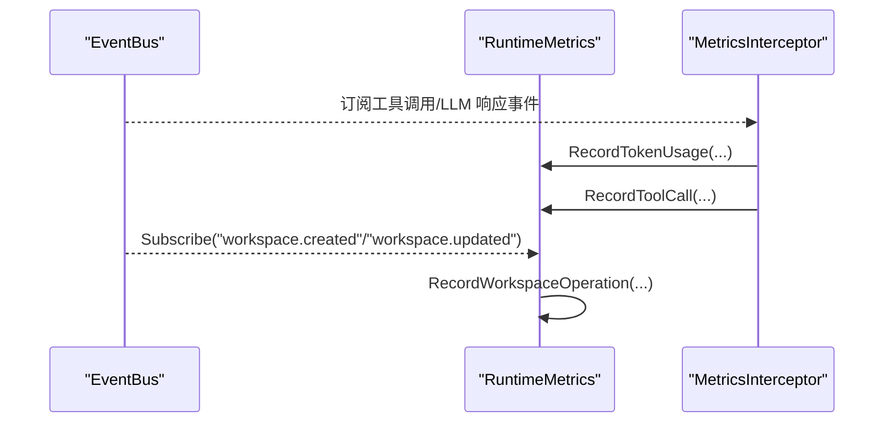
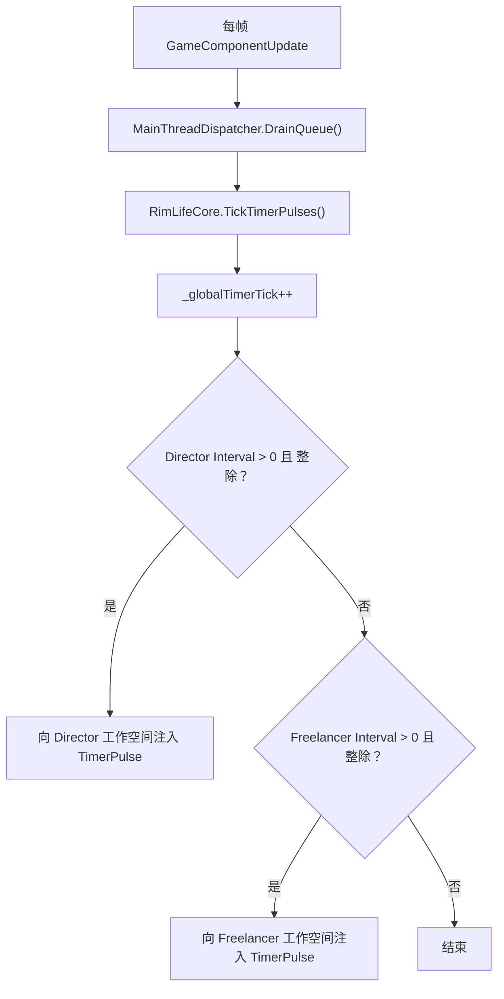
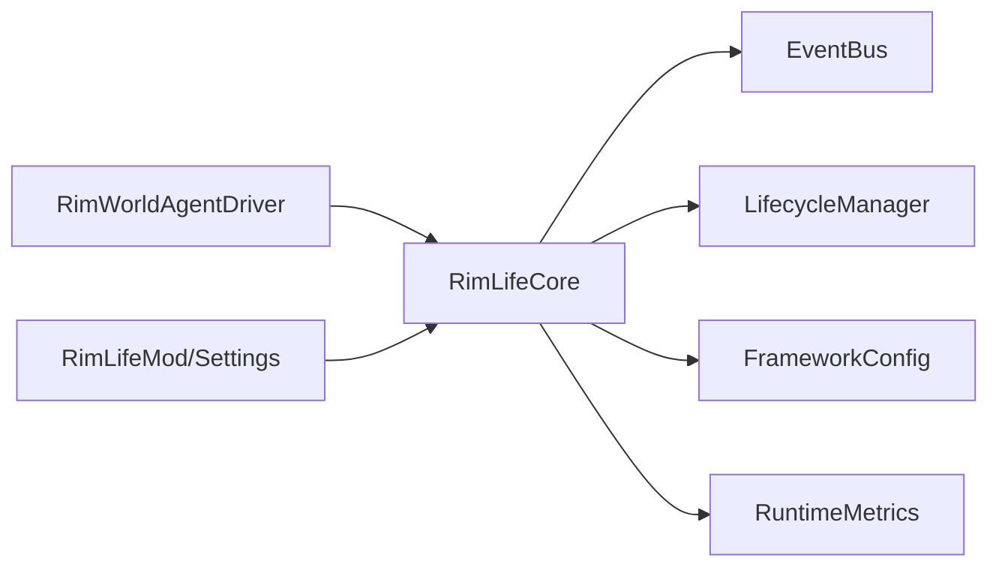

# 服务定位器模式

<cite>
**本文引用的文件**
- [RimLifeCore.cs](file://Source/Infrastructure/RimLifeCore.cs)
- [FrameworkConfig.cs](file://ext/NPCLife/src/NPCLife/Framework/FrameworkConfig.cs)
- [LifecycleManager.cs](file://ext/NPCLife/src/NPCLife/Framework/LifecycleManager.cs)
- [EventBus.cs](file://ext/NPCLife/src/NPCLife/Framework/EventBus.cs)
- [RuntimeMetrics.cs](file://ext/NPCLife/src/NPCLife/Framework/RuntimeMetrics.cs)
- [RimWorldAgentDriver.cs](file://Source/Infrastructure/RimWorldAgentDriver.cs)
- [RimLifeMod.cs](file://Source/Settings/RimLifeMod.cs)
</cite>

## 目录
1. [引言](#引言)
2. [项目结构](#项目结构)
3. [核心组件](#核心组件)
4. [架构总览](#架构总览)
5. [详细组件分析](#详细组件分析)
6. [依赖关系分析](#依赖关系分析)
7. [性能考量](#性能考量)
8. [故障排查指南](#故障排查指南)
9. [结论](#结论)
10. [附录](#附录)

## 引言
本文件系统性阐述 RimLife 的服务定位器模式设计与实现，重点围绕 RimLifeCore 作为全局服务定位器的职责边界、服务注册与延迟加载策略、生命周期管理与优雅关闭机制，以及 FrameworkConfig 的配置管理与校验流程。同时，文档解释了 LifecycleManager 的组件生命周期控制、事件总线 EventBus 的服务间通信与状态同步、运行时度量 RuntimeMetrics 的可观测性集成，并给出在模组架构中采用服务定位器的优势与最佳实践。

## 项目结构
RimLife 将“框架层”与“模组适配层”清晰分离：
- 框架层（ext/.../NPCLife）：提供统一的配置、事件、生命周期、度量等基础设施，面向多模组复用。
- 模组适配层（Source/.../Infrastructure 与 Source/.../Settings）：负责与 RimWorld 的对接、UI 设置、存档桥接与全局服务定位器的初始化。

图表来源
- [RimLifeCore.cs:24-185](file://Source/Infrastructure/RimLifeCore.cs#L24-L185)
- [FrameworkConfig.cs:17-75](file://ext/NPCLife/src/NPCLife/Framework/FrameworkConfig.cs#L17-L75)
- [LifecycleManager.cs:23-173](file://ext/NPCLife/src/NPCLife/Framework/LifecycleManager.cs#L23-L173)
- [EventBus.cs:17-113](file://ext/NPCLife/src/NPCLife/Framework/EventBus.cs#L17-L113)
- [RuntimeMetrics.cs:29-76](file://ext/NPCLife/src/NPCLife/Framework/RuntimeMetrics.cs#L29-L76)
- [RimWorldAgentDriver.cs:12-22](file://Source/Infrastructure/RimWorldAgentDriver.cs#L12-L22)
- [RimLifeMod.cs:47-66](file://Source/Settings/RimLifeMod.cs#L47-L66)

章节来源
- [RimLifeCore.cs:18-185](file://Source/Infrastructure/RimLifeCore.cs#L18-L185)
- [FrameworkConfig.cs:17-75](file://ext/NPCLife/src/NPCLife/Framework/FrameworkConfig.cs#L17-L75)
- [LifecycleManager.cs:23-173](file://ext/NPCLife/src/NPCLife/Framework/LifecycleManager.cs#L23-L173)
- [EventBus.cs:17-113](file://ext/NPCLife/src/NPCLife/Framework/EventBus.cs#L17-L113)
- [RuntimeMetrics.cs:29-76](file://ext/NPCLife/src/NPCLife/Framework/RuntimeMetrics.cs#L29-L76)
- [RimWorldAgentDriver.cs:12-22](file://Source/Infrastructure/RimWorldAgentDriver.cs#L12-L22)
- [RimLifeMod.cs:47-66](file://Source/Settings/RimLifeMod.cs#L47-L66)

## 核心组件
- 全局服务定位器 RimLifeCore
  - 提供权威存储（SaveStore）、缓存存储（CacheStore）、工作空间管理器（Workspaces）、知识服务（KnowledgeService）、LLM 访问器（LlmAccessor）、凭证管理器（CredentialManager）、交互历史（InteractionStore）等服务的延迟加载与单例封装。
  - 提供配置入口（Configure）、提示词配置（PromptConfig）、驱动配置（DriverConfig）与全局时钟脉冲（TickTimerPulses）。
  - 提供 Agent 创建与重建（GetDirectorAgent/GetFreelancerAgent/GetScreenwriter/RebuildAgents）。
  - 提供优雅关闭（Shutdown）与状态报告（FrameworkStatus 报告器）。
- 配置管理 FrameworkConfig
  - 统一管理 Driver、Diagnostics、Features 三段配置，支持冻结（Freeze）后不可变，提供 Validate 校验与 JSON 序列化/反序列化。
- 生命周期管理 LifecycleManager
  - 统一注册/级联销毁（IDisposable），管理 OnInit/OnConfigReady/OnDestroy 钩子，提供 Initialize/Shutdown/Reset 流程。
- 事件总线 EventBus
  - 支持命名空间事件名、优先级排序、错误隔离、订阅查询与清理。
- 运行时度量 RuntimeMetrics
  - 会话级统计（Token、工具调用、KB 访问、Agent 循环、工作空间操作），提供快照聚合与 JSON 序列化。

章节来源
- [RimLifeCore.cs:24-185](file://Source/Infrastructure/RimLifeCore.cs#L24-L185)
- [FrameworkConfig.cs:17-75](file://ext/NPCLife/src/NPCLife/Framework/FrameworkConfig.cs#L17-L75)
- [LifecycleManager.cs:23-173](file://ext/NPCLife/src/NPCLife/Framework/LifecycleManager.cs#L23-L173)
- [EventBus.cs:17-113](file://ext/NPCLife/src/NPCLife/Framework/EventBus.cs#L17-L113)
- [RuntimeMetrics.cs:29-76](file://ext/NPCLife/src/NPCLife/Framework/RuntimeMetrics.cs#L29-L76)

## 架构总览
RimLife 采用“框架层 + 模组适配层”的双层架构。RimLifeCore 作为全局服务定位器，向上承载 UI/设置与 RimWorld 集成，向下提供统一的配置、事件、生命周期与度量能力。LifecycleManager 与 EventBus 作为横切关注点贯穿各服务，RuntimeMetrics 通过拦截器与事件订阅实现非侵入式观测。

图表来源
- [RimLifeCore.cs:1066-1091](file://Source/Infrastructure/RimLifeCore.cs#L1066-L1091)
- [RimWorldAgentDriver.cs:12-22](file://Source/Infrastructure/RimWorldAgentDriver.cs#L12-L22)
- [FrameworkConfig.cs:17-75](file://ext/NPCLife/src/NPCLife/Framework/FrameworkConfig.cs#L17-L75)
- [LifecycleManager.cs:23-173](file://ext/NPCLife/src/NPCLife/Framework/LifecycleManager.cs#L23-L173)
- [EventBus.cs:17-113](file://ext/NPCLife/src/NPCLife/Framework/EventBus.cs#L17-L113)
- [RuntimeMetrics.cs:29-76](file://ext/NPCLife/src/NPCLife/Framework/RuntimeMetrics.cs#L29-L76)

## 详细组件分析

### 全局服务定位器 RimLifeCore
- 设计理念
  - 以静态类提供全局访问点，内部通过延迟加载与锁保护实现幂等初始化与线程安全。
  - 将“服务注册/初始化/生命周期/配置/事件/度量”等横切能力集中管理，降低上层耦合。
- 关键职责
  - 配置与适配器注入：InitializeAdapter、Configure、EnsureSkillRegistryInitialized。
  - 存档与状态切换：SaveStore 切换时级联销毁与重置，触发 SaveLoaded/SaveUnloaded。
  - 服务延迟加载与单例：Workspaces、KnowledgeService、LlmAccessor、CredentialManager、InteractionStore。
  - Agent 生命周期：GetDirectorAgent/GetFreelancerAgent/GetScreenwriter/RebuildAgents。
  - 全局时钟与定时脉冲：TickTimerPulses、GetTimerPulseAccumulator、GetTimerPulseInterval。
  - 优雅关闭：Shutdown 清理事件总线、日志器、Agent、LLM 组件与脚本推送服务。
- 依赖注入与钩子
  - 通过 RegisterContentProvider、RegisterHookProvider 注入内容提供者与 MCP Hook 提供者。
  - 通过 EventBus.Logger、LifecycleManager.Logger、ErrorHandler.Logger 注入日志器。
- 状态报告与可观测性
  - RegisterStatusReporters 与 FrameworkStatus 报告器，结合 RuntimeMetrics 提供运行态快照。

图表来源
- [RimLifeCore.cs:24-185](file://Source/Infrastructure/RimLifeCore.cs#L24-L185)

章节来源
- [RimLifeCore.cs:24-185](file://Source/Infrastructure/RimLifeCore.cs#L24-L185)
- [RimLifeCore.cs:1066-1091](file://Source/Infrastructure/RimLifeCore.cs#L1066-L1091)

### 配置管理 FrameworkConfig
- 数据结构
  - Driver/Diagnostics/Features 三段配置，支持冻结（IsFrozen/Frozen）后禁止修改。
- 校验流程
  - Validate 返回错误列表，包含阈值与范围校验，失败时记录警告并阻止应用。
- 序列化/反序列化
  - ToJson/FromJson 支持默认值回退与字段选择性覆盖，遵循“默认值 < 配置文件 < 代码覆盖”的合并优先级。
- 冻结与应用
  - Configure 中调用 Freeze 并触发 LifecycleManager.NotifyConfigReady 与 EventBus.Publish(ConfigReady)。

图表来源
- [FrameworkConfig.cs:56-75](file://ext/NPCLife/src/NPCLife/Framework/FrameworkConfig.cs#L56-L75)
- [FrameworkConfig.cs:124-194](file://ext/NPCLife/src/NPCLife/Framework/FrameworkConfig.cs#L124-L194)
- [RimLifeCore.cs:120-142](file://Source/Infrastructure/RimLifeCore.cs#L120-L142)

章节来源
- [FrameworkConfig.cs:17-75](file://ext/NPCLife/src/NPCLife/Framework/FrameworkConfig.cs#L17-L75)
- [FrameworkConfig.cs:124-194](file://ext/NPCLife/src/NPCLife/Framework/FrameworkConfig.cs#L124-L194)
- [RimLifeCore.cs:120-142](file://Source/Infrastructure/RimLifeCore.cs#L120-L142)

### 生命周期管理 LifecycleManager
- 组件注册与销毁
  - RegisterDisposable(name, IDisposable)：支持同名替换与逆序 Dispose。
  - Shutdown：逆序销毁 + OnDestroy 钩子 + 清理订阅 + 发布 Disposed。
- 钩子机制
  - OnInit/OnConfigReady/OnDestroy：支持优先级排序，Late Init 自动触发。
  - Initialize/NotifyConfigReady/Shutdown/Reset：幂等设计，避免重复执行。
- 与 EventBus 的协作
  - Initialize/Shutdown/NotifyConfigReady 时发布框架事件，便于组件订阅。

图表来源
- [LifecycleManager.cs:77-173](file://ext/NPCLife/src/NPCLife/Framework/LifecycleManager.cs#L77-L173)
- [LifecycleManager.cs:192-240](file://ext/NPCLife/src/NPCLife/Framework/LifecycleManager.cs#L192-L240)
- [RimLifeCore.cs:236-247](file://Source/Infrastructure/RimLifeCore.cs#L236-L247)

章节来源
- [LifecycleManager.cs:23-173](file://ext/NPCLife/src/NPCLife/Framework/LifecycleManager.cs#L23-L173)
- [LifecycleManager.cs:192-240](file://ext/NPCLife/src/NPCLife/Framework/LifecycleManager.cs#L192-L240)
- [RimLifeCore.cs:236-247](file://Source/Infrastructure/RimLifeCore.cs#L236-L247)

### 事件总线 EventBus 与状态同步
- 事件模型
  - Subscribe(eventName, handler, priority) 返回取消订阅委托；Publish 自动填充 EventName/Timestamp；错误隔离。
- 预定义事件
  - 包括框架生命周期、存档切换、Agent 循环、工具调用、LLM 请求/响应/错误、工作空间创建/更新/关闭、台词就绪等。
- 与服务定位器的协作
  - RimLifeCore 在关键节点（SaveLoaded/SaveUnloaded、ConfigReady、Agent 激活/完成、LLM 响应、工作空间事件）发布事件，供度量与 UI 订阅。

图表来源
- [EventBus.cs:46-113](file://ext/NPCLife/src/NPCLife/Framework/EventBus.cs#L46-L113)
- [EventBus.cs:186-241](file://ext/NPCLife/src/NPCLife/Framework/EventBus.cs#L186-L241)
- [RimLifeCore.cs:1076-1086](file://Source/Infrastructure/RimLifeCore.cs#L1076-L1086)
- [RuntimeMetrics.cs:229-237](file://ext/NPCLife/src/NPCLife/Framework/RuntimeMetrics.cs#L229-L237)

章节来源
- [EventBus.cs:17-113](file://ext/NPCLife/src/NPCLife/Framework/EventBus.cs#L17-L113)
- [EventBus.cs:186-241](file://ext/NPCLife/src/NPCLife/Framework/EventBus.cs#L186-L241)
- [RimLifeCore.cs:1076-1086](file://Source/Infrastructure/RimLifeCore.cs#L1076-L1086)
- [RuntimeMetrics.cs:229-237](file://ext/NPCLife/src/NPCLife/Framework/RuntimeMetrics.cs#L229-L237)

### 运行时度量 RuntimeMetrics 与拦截器
- 会话与统计
  - BeginSession/EndSession 管理会话生命周期；RecordTokenUsage/RecordToolCall/RecordKnowledgeLookup/RecordLoopFinished/RecordWorkspaceOperation 聚合指标。
- 快照与序列化
  - GetSnapshot 聚合 Token、工具、KB、Agent 循环、工作空间等指标；ToJson 输出结构化数据。
- 与 EventBus 的联动
  - 通过订阅 LlmResponseReceived、WorkspaceCreated/Closed/Updated 等事件自动采集 Token 与操作计数。

图表来源
- [RuntimeMetrics.cs:85-141](file://ext/NPCLife/src/NPCLife/Framework/RuntimeMetrics.cs#L85-L141)
- [RuntimeMetrics.cs:246-364](file://ext/NPCLife/src/NPCLife/Framework/RuntimeMetrics.cs#L246-L364)
- [RimLifeCore.cs:263-287](file://Source/Infrastructure/RimLifeCore.cs#L263-L287)

章节来源
- [RuntimeMetrics.cs:29-76](file://ext/NPCLife/src/NPCLife/Framework/RuntimeMetrics.cs#L29-L76)
- [RuntimeMetrics.cs:85-141](file://ext/NPCLife/src/NPCLife/Framework/RuntimeMetrics.cs#L85-L141)
- [RuntimeMetrics.cs:246-364](file://ext/NPCLife/src/NPCLife/Framework/RuntimeMetrics.cs#L246-L364)
- [RimLifeCore.cs:263-287](file://Source/Infrastructure/RimLifeCore.cs#L263-L287)

### 全局时钟与定时脉冲
- 全局时钟
  - _globalTimerTick 每帧自增；Director/Freelancer 的定时器基于取模判断触发。
- 脉冲注入
  - TickTimerPulses 在满足条件时向对应工作空间事件池注入 TimerPulse 事件，驱动 Agent 自动激活。

图表来源
- [RimWorldAgentDriver.cs:18-22](file://Source/Infrastructure/RimWorldAgentDriver.cs#L18-L22)
- [RimLifeCore.cs:493-527](file://Source/Infrastructure/RimLifeCore.cs#L493-L527)

章节来源
- [RimWorldAgentDriver.cs:18-22](file://Source/Infrastructure/RimWorldAgentDriver.cs#L18-L22)
- [RimLifeCore.cs:493-527](file://Source/Infrastructure/RimLifeCore.cs#L493-L527)

### 服务定位器在模组架构中的作用与优势
- 降低耦合
  - 上层 UI/设置仅依赖 RimLifeCore 的公开属性与方法，无需感知具体实现。
- 延迟加载与单例
  - 通过延迟初始化与锁保护，避免启动时不必要的资源占用，提升首帧性能。
- 可插拔与可扩展
  - RegisterContentProvider/RegisterHookProvider 支持第三方扩展注入；FrameworkStatus 报告器与 RuntimeMetrics 支持动态观测。
- 一致的生命周期与事件
  - LifecycleManager 与 EventBus 提供统一的初始化/销毁与事件发布订阅模型，简化组件协作。

章节来源
- [RimLifeCore.cs:59-63](file://Source/Infrastructure/RimLifeCore.cs#L59-L63)
- [RimLifeCore.cs:344-360](file://Source/Infrastructure/RimLifeCore.cs#L344-L360)
- [LifecycleManager.cs:77-97](file://ext/NPCLife/src/NPCLife/Framework/LifecycleManager.cs#L77-L97)
- [EventBus.cs:46-65](file://ext/NPCLife/src/NPCLife/Framework/EventBus.cs#L46-L65)

## 依赖关系分析
- 模组适配层依赖全局服务定位器
  - RimWorldAgentDriver 通过 GameComponentUpdate 驱动全局时钟与主线程队列。
  - RimLifeMod/Settings 负责 UI 与设置持久化，间接影响服务定位器的配置与凭据。
- 全局服务定位器依赖框架层组件
  - 通过 EventBus/LifecycleManager/FrameworkConfig/RuntimeMetrics 实现横切能力。
- 服务间通信与状态同步
  - 通过 EventBus 的命名空间事件进行解耦通信；通过 FrameworkStatus 与 RuntimeMetrics 提供状态可视化。

图表来源
- [RimWorldAgentDriver.cs:12-22](file://Source/Infrastructure/RimWorldAgentDriver.cs#L12-L22)
- [RimLifeMod.cs:47-66](file://Source/Settings/RimLifeMod.cs#L47-L66)
- [RimLifeCore.cs:236-247](file://Source/Infrastructure/RimLifeCore.cs#L236-L247)

章节来源
- [RimWorldAgentDriver.cs:12-22](file://Source/Infrastructure/RimWorldAgentDriver.cs#L12-L22)
- [RimLifeMod.cs:47-66](file://Source/Settings/RimLifeMod.cs#L47-L66)
- [RimLifeCore.cs:236-247](file://Source/Infrastructure/RimLifeCore.cs#L236-L247)

## 性能考量
- 延迟加载与锁粒度
  - 通过细粒度锁（如 _promptConfigLock、_driverConfigLock、_workspacesLock 等）减少竞争，避免热点阻塞。
- 幂等与去重
  - EnsureSkillRegistryInitialized、RegisterDisposable 支持幂等与同名替换，避免重复初始化。
- 事件与度量的非侵入采集
  - 通过拦截器与事件订阅采集指标，不影响核心循环性能。
- 优化建议
  - 对高频事件（如定时脉冲）尽量保持轻量处理，复杂逻辑放入事件池异步执行。
  - 控制事件订阅数量与优先级，避免长链路阻塞。

## 故障排查指南
- 配置校验失败
  - 现象：Configure 后记录警告并跳过应用。
  - 排查：检查 Driver 阈值与范围、Diagnostics/Features 是否为空。
- 服务未初始化
  - 现象：Workspaces/LlmAccessor/KnowledgeService 返回 null。
  - 排查：确认 SaveStore 已注册、配置已 Configure 并 Freeze；检查日志器注入。
- Agent 未激活
  - 现象：事件池未触发 Agent。
  - 排查：确认 DriverConfig 定时器间隔大于 0，全局时钟 TickTimerPulses 正常；检查工作空间状态。
- 事件未到达
  - 现象：订阅回调未执行。
  - 排查：确认事件名大小写、优先级排序、订阅是否被取消；查看 EventBus.Logger 警告。
- 关闭后残留
  - 现象：组件未完全释放。
  - 排查：确认 Shutdown 调用顺序与日志输出；检查 OnDestroy 钩子异常。

章节来源
- [FrameworkConfig.cs:56-75](file://ext/NPCLife/src/NPCLife/Framework/FrameworkConfig.cs#L56-L75)
- [RimLifeCore.cs:148-185](file://Source/Infrastructure/RimLifeCore.cs#L148-L185)
- [EventBus.cs:104-112](file://ext/NPCLife/src/NPCLife/Framework/EventBus.cs#L104-L112)
- [LifecycleManager.cs:192-240](file://ext/NPCLife/src/NPCLife/Framework/LifecycleManager.cs#L192-L240)

## 结论
RimLife 的服务定位器模式通过 RimLifeCore 将配置、事件、生命周期、度量与核心服务整合为统一入口，配合 FrameworkConfig 的严格校验、LifecycleManager 的幂等生命周期与 EventBus 的解耦通信，实现了在 RimWorld 模组环境下的高内聚、低耦合与可扩展架构。RuntimeMetrics 的非侵入采集进一步增强了可观测性，为性能优化与问题定位提供了坚实基础。

## 附录
- 最佳实践
  - 服务注册：在 EnsureSkillRegistryInitialized 之前完成内容提供者与 Hook 提供者的注册。
  - 配置应用：通过 Configure 完成校验与冻结，随后触发生命周期钩子与事件通知。
  - 优雅关闭：在 Mod 卸载或游戏退出时调用 Shutdown，确保组件级联销毁与事件总线清理。
  - 扩展与自定义：通过 RegisterHookProvider 注入 MCP 工具；通过 FrameworkStatus 报告器与 RuntimeMetrics 快照导出观测数据。
  - 故障处理：利用 EventBus.Logger 与 LifecycleManager.Logger 记录关键路径异常；通过 ClearAll 与 Reset 清理状态。