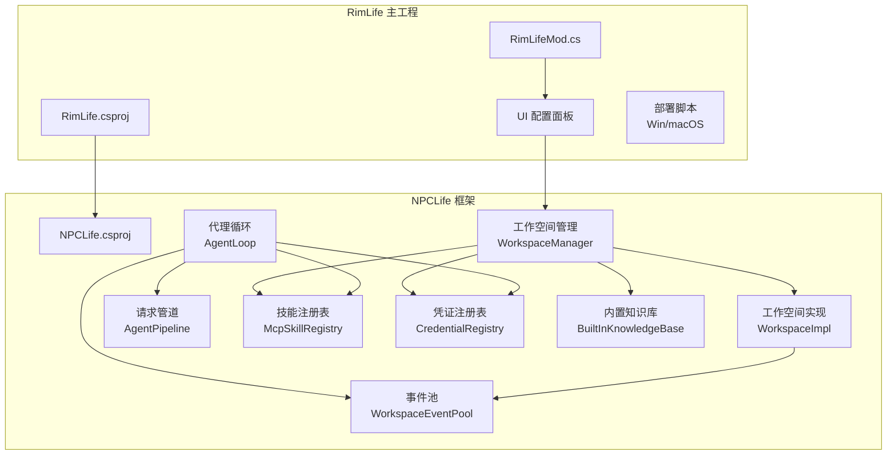
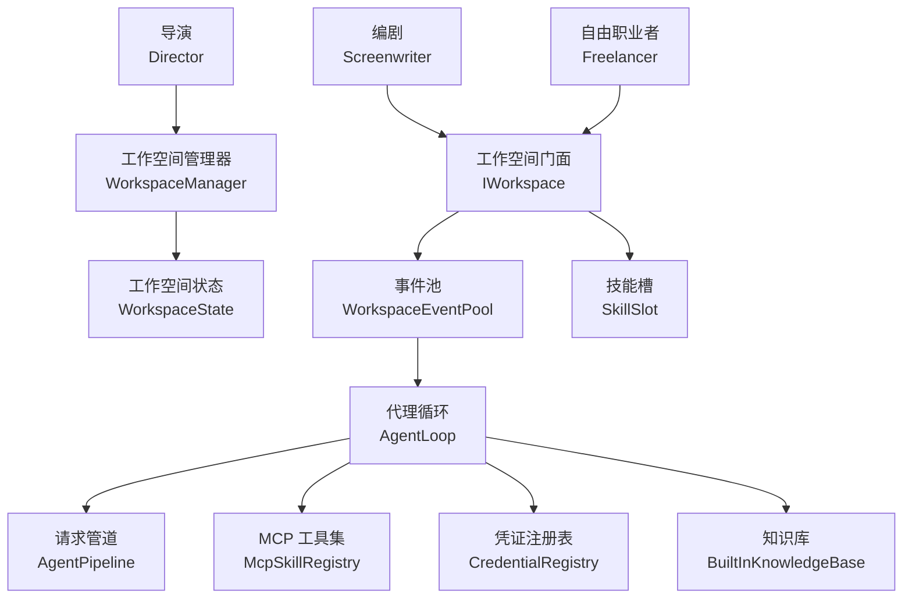
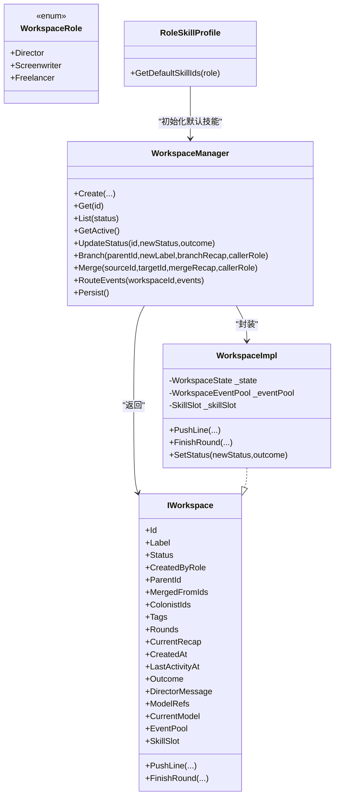
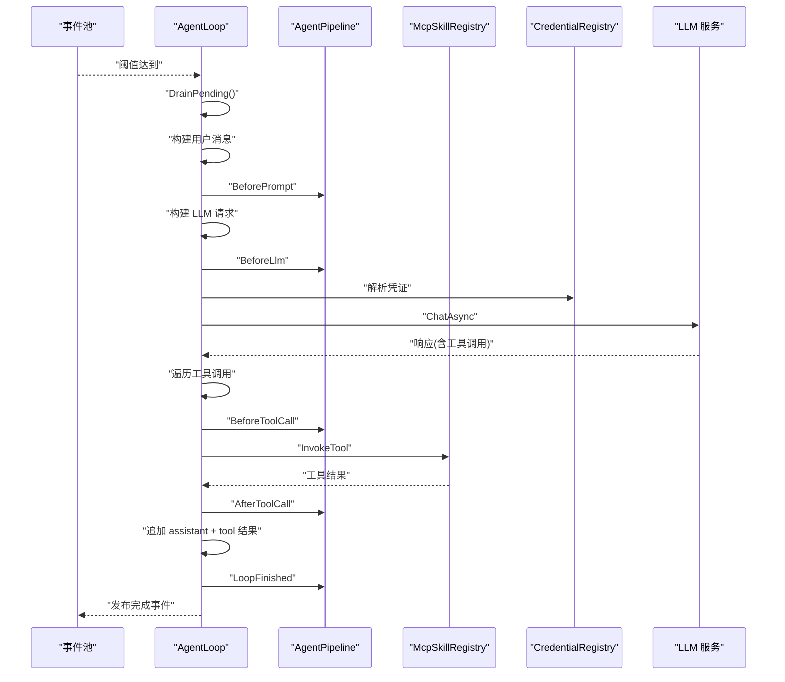
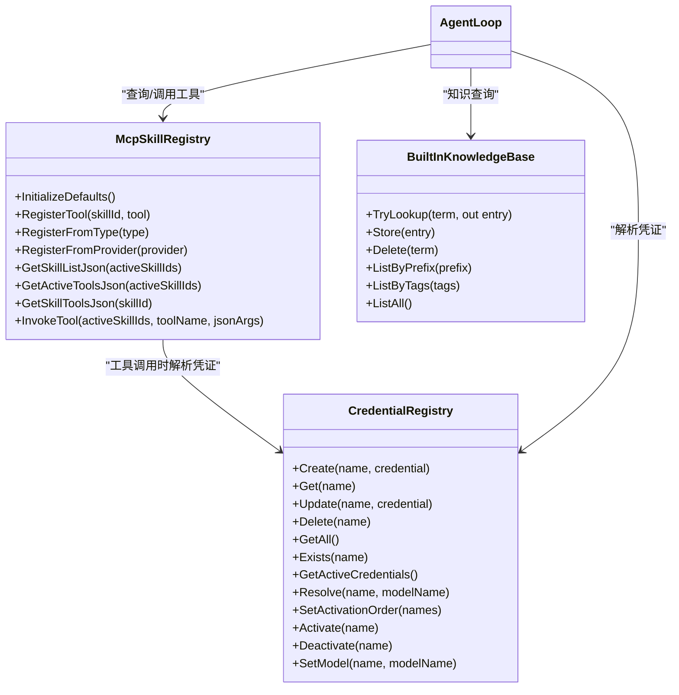
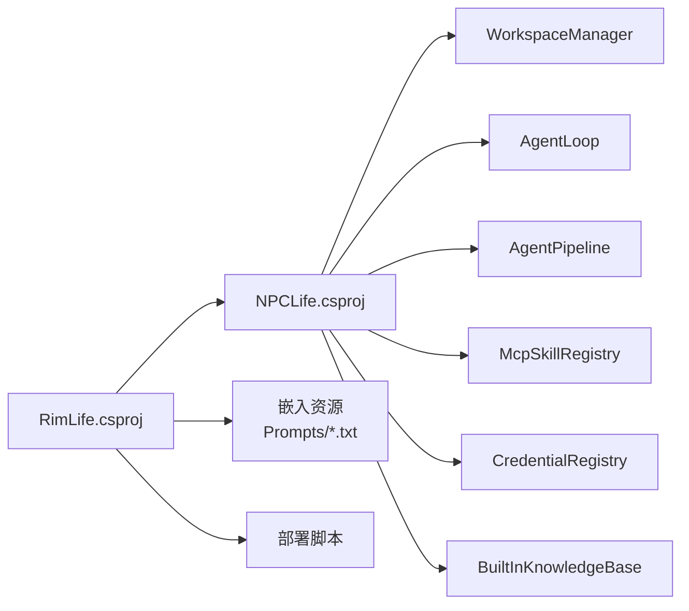

# 核心架构设计

<cite>
**本文引用的文件**
- [RimLife.csproj](file://RimLife.csproj)
- [NPCLife.csproj](file://ext\NPCLife\src\NPCLife\NPCLife.csproj)
- [RimLifeMod.cs](file://Source\Settings\RimLifeMod.cs)
- [WorkspaceManager.cs](file://ext\NPCLife\src\NPCLife\Workspace\WorkspaceManager.cs)
- [WorkspaceImpl.cs](file://ext\NPCLife\src\NPCLife\Workspace\WorkspaceImpl.cs)
- [IWorkspace.cs](file://ext\NPCLife\src\NPCLife\Workspace\IWorkspace.cs)
- [WorkspaceState.cs](file://ext\NPCLife\src\NPCLife\Workspace\WorkspaceState.cs)
- [WorkspaceEventPool.cs](file://ext\NPCLife\src\NPCLife\Workspace\WorkspaceEventPool.cs)
- [RoleSkillProfile.cs](file://ext\NPCLife\src\NPCLife\Workspace\RoleSkillProfile.cs)
- [AgentLoop.cs](file://ext\NPCLife\src\NPCLife\Agent\AgentLoop.cs)
- [AgentPipeline.cs](file://ext\NPCLife\src\NPCLife\Framework\AgentPipeline.cs)
- [McpSkillRegistry.cs](file://ext\NPCLife\src\NPCLife\Framework\Mcp\McpSkillRegistry.cs)
- [CredentialRegistry.cs](file://ext\NPCLife\src\NPCLife\Infrastructure\Llm\CredentialRegistry.cs)
- [BuiltInKnowledgeBase.cs](file://ext\NPCLife\src\NPCLife\Infrastructure\Knowledge\BuiltInKnowledgeBase.cs)
</cite>

## 目录
1. [简介](#简介)
2. [项目结构](#项目结构)
3. [核心组件](#核心组件)
4. [架构总览](#架构总览)
5. [详细组件分析](#详细组件分析)
6. [依赖关系分析](#依赖关系分析)
7. [性能考量](#性能考量)
8. [故障排查指南](#故障排查指南)
9. [结论](#结论)
10. [附录](#附录)

## 简介
本文件面向 RimLife 的核心架构，聚焦于“多代理协作”与“工作空间管理”的整体设计。系统采用“导演-编剧-自由职业者”的角色分工，结合 MCP 工具协议与事件驱动的 Agent 循环，形成可扩展、可观测、可持久化的叙事管线。工作空间作为上下文容器，承载事件池、技能槽与叙事轮次，支持创建、分支、合并与生命周期管理；并通过统一的持久化接口与存档绑定，确保跨会话一致性。

## 项目结构
RimLife 项目由 RimLife 主工程与 ext/NPCLife 框架子模块构成。主工程负责 UI、模组设置与部署脚本，NPCLife 框架提供多代理、工作空间、MCP 工具、凭证与知识库等通用能力。

图表来源
- [RimLife.csproj:48-50](file://RimLife.csproj#L48-L50)
- [NPCLife.csproj:1-38](file://ext\NPCLife\src\NPCLife\NPCLife.csproj#L1-L38)
- [WorkspaceManager.cs:19-40](file://ext\NPCLife\src\NPCLife\Workspace\WorkspaceManager.cs#L19-L40)
- [AgentLoop.cs:43-119](file://ext\NPCLife\src\NPCLife\Agent\AgentLoop.cs#L43-L119)

章节来源
- [RimLife.csproj:48-50](file://RimLife.csproj#L48-L50)
- [NPCLife.csproj:1-38](file://ext\NPCLife\src\NPCLife\NPCLife.csproj#L1-L38)

## 核心组件
- 多代理协作
  - 导演（Director）：负责工作空间的创建、分支、合并与生命周期管理，不直接参与叙事创作。
  - 编剧（Screenwriter）：负责叙事内容创作与回合推进，拥有推送台词与结束轮次的能力。
  - 自由职业者（Freelancer）：处理独立事件与日常对话，具备基础查询能力，无剧情上下文。
- 工作空间管理
  - 工作空间状态与轮次：包含元数据、轮次列表、当前前情提要、模型引用与技能激活集合。
  - 事件池：双缓冲结构（持久化 pending + 内存 recent），支持阈值触发与查询。
  - 技能槽：基于角色预设激活 MCP 技能，支持动态启用/禁用。
- 代理循环与请求管道
  - AgentLoop：被动激活、事件 drain、构建请求、调用 LLM、工具调用循环、结果注入与收尾。
  - AgentPipeline：拦截器链，支持在 Prompt 构造、LLM 请求、工具调用前后注入行为。
- MCP 工具与凭证
  - McpSkillRegistry：技能与工具注册、查询与调用，支持系统技能与业务技能。
  - CredentialRegistry：凭证管理与激活顺序控制，支持多模型与回退链路。
- 知识库
  - BuiltInKnowledgeBase：内置可写知识库，持久化缓存，支持词条查询、学习与标签筛选。

章节来源
- [WorkspaceState.cs:9-53](file://ext\NPCLife\src\NPCLife\Workspace\WorkspaceState.cs#L9-L53)
- [RoleSkillProfile.cs:13-74](file://ext\NPCLife\src\NPCLife\Workspace\RoleSkillProfile.cs#L13-L74)
- [WorkspaceEventPool.cs:21-43](file://ext\NPCLife\src\NPCLife\Workspace\WorkspaceEventPool.cs#L21-L43)
- [AgentLoop.cs:43-680](file://ext\NPCLife\src\NPCLife\Agent\AgentLoop.cs#L43-L680)
- [AgentPipeline.cs:18-248](file://ext\NPCLife\src\NPCLife\Framework\AgentPipeline.cs#L18-L248)
- [McpSkillRegistry.cs:22-470](file://ext\NPCLife\src\NPCLife\Framework\Mcp\McpSkillRegistry.cs#L22-L470)
- [CredentialRegistry.cs:19-329](file://ext\NPCLife\src\NPCLife\Infrastructure\Llm\CredentialRegistry.cs#L19-L329)
- [BuiltInKnowledgeBase.cs:13-206](file://ext\NPCLife\src\NPCLife\Infrastructure\Knowledge\BuiltInKnowledgeBase.cs#L13-L206)

## 架构总览
系统采用“工作空间为中心”的上下文叙事架构，围绕事件驱动的 Agent 循环展开。导演通过工作空间管理器进行结构操作，编剧与自由职业者通过事件池向 Agent 注入事件，Agent 通过 MCP 工具与 LLM 协作完成创作与落地。

图表来源
- [WorkspaceManager.cs:19-622](file://ext\NPCLife\src\NPCLife\Workspace\WorkspaceManager.cs#L19-L622)
- [IWorkspace.cs:11-57](file://ext\NPCLife\src\NPCLife\Workspace\IWorkspace.cs#L11-L57)
- [WorkspaceImpl.cs:16-199](file://ext\NPCLife\src\NPCLife\Workspace\WorkspaceImpl.cs#L16-L199)
- [WorkspaceEventPool.cs:21-186](file://ext\NPCLife\src\NPCLife\Workspace\WorkspaceEventPool.cs#L21-L186)
- [AgentLoop.cs:43-680](file://ext\NPCLife\src\NPCLife\Agent\AgentLoop.cs#L43-L680)
- [AgentPipeline.cs:120-248](file://ext\NPCLife\src\NPCLife\Framework\AgentPipeline.cs#L120-L248)
- [McpSkillRegistry.cs:22-470](file://ext\NPCLife\src\NPCLife\Framework\Mcp\McpSkillRegistry.cs#L22-L470)
- [CredentialRegistry.cs:19-329](file://ext\NPCLife\src\NPCLife\Infrastructure\Llm\CredentialRegistry.cs#L19-L329)
- [BuiltInKnowledgeBase.cs:13-206](file://ext\NPCLife\src\NPCLife\Infrastructure\Knowledge\BuiltInKnowledgeBase.cs#L13-L206)

## 详细组件分析

### 多代理协作与职责分工
- 导演
  - 权限：创建、分支、合并、更新状态。
  - 关注点：全局视角与结构管理，不直接创作叙事。
- 编剧
  - 权限：推送台词、结束轮次、上报信号。
  - 关注点：完整上下文与创作细节。
- 自由职业者
  - 权限：基础查询与快速叙事输出。
  - 关注点：独立事件与日常对话，无剧情上下文。

图表来源
- [WorkspaceState.cs:9-53](file://ext\NPCLife\src\NPCLife\Workspace\WorkspaceState.cs#L9-L53)
- [IWorkspace.cs:11-57](file://ext\NPCLife\src\NPCLife\Workspace\IWorkspace.cs#L11-L57)
- [WorkspaceManager.cs:19-622](file://ext\NPCLife\src\NPCLife\Workspace\WorkspaceManager.cs#L19-L622)
- [WorkspaceImpl.cs:16-199](file://ext\NPCLife\src\NPCLife\Workspace\WorkspaceImpl.cs#L16-L199)
- [RoleSkillProfile.cs:13-74](file://ext\NPCLife\src\NPCLife\Workspace\RoleSkillProfile.cs#L13-L74)

章节来源
- [WorkspaceState.cs:9-53](file://ext\NPCLife\src\NPCLife\Workspace\WorkspaceState.cs#L9-L53)
- [IWorkspace.cs:11-57](file://ext\NPCLife\src\NPCLife\Workspace\IWorkspace.cs#L11-L57)
- [WorkspaceManager.cs:19-622](file://ext\NPCLife\src\NPCLife\Workspace\WorkspaceManager.cs#L19-L622)
- [WorkspaceImpl.cs:16-199](file://ext\NPCLife\src\NPCLife\Workspace\WorkspaceImpl.cs#L16-L199)
- [RoleSkillProfile.cs:13-74](file://ext\NPCLife\src\NPCLife\Workspace\RoleSkillProfile.cs#L13-L74)

### 工作空间管理模式
- 创建
  - 输入：标签、角色列表、标签、创建者角色。
  - 输出：工作空间门面，自动激活角色默认技能。
- 分支
  - 输入：父工作空间、新标签、分支前情提要、调用者角色。
  - 输出：子工作空间，复制父轮次并在末尾追加分支轮。
- 合并
  - 输入：源工作空间、目标工作空间、合并前情提要、调用者角色。
  - 输出：目标工作空间合并源轮次与元数据，源工作空间标记为废弃。
- 生命周期
  - 状态机：Active/Suspended/Completed/Abandoned，受权限约束与状态转换规则控制。
- 事件路由
  - 管理器将事件写入工作空间事件池，由事件池根据阈值触发 Agent。

```mermaid
flowchart TD
Start(["开始"]) --> Create["创建工作空间"]
Create --> AutoSkills["按角色激活默认技能"]
AutoSkills --> Active["进入活跃态"]
Active --> BranchCheck{"是否需要分支？"}
BranchCheck --> |是| Branch["分支：复制父轮次并追加分支轮"]
BranchCheck --> |否| MergeCheck{"是否需要合并？"}
MergeCheck --> |是| Merge["合并：合并轮次与元数据，源标记废弃"]
MergeCheck --> |否| RouteEvt["路由事件到事件池"]
RouteEvt --> Threshold{"达到阈值？"}
Threshold --> |是| TriggerAgent["触发 Agent 循环"]
Threshold --> |否| Active
TriggerAgent --> FinishRound["编剧结束轮次"]
FinishRound --> Active
Active --> CloseCheck{"是否关闭？"}
CloseCheck --> |是| UpdateStatus["更新状态为 Completed/Abandoned"]
CloseCheck --> |否| Active
```

图表来源
- [WorkspaceManager.cs:91-138](file://ext\NPCLife\src\NPCLife\Workspace\WorkspaceManager.cs#L91-L138)
- [WorkspaceManager.cs:193-263](file://ext\NPCLife\src\NPCLife\Workspace\WorkspaceManager.cs#L193-L263)
- [WorkspaceManager.cs:269-376](file://ext\NPCLife\src\NPCLife\Workspace\WorkspaceManager.cs#L269-L376)
- [WorkspaceManager.cs:406-423](file://ext\NPCLife\src\NPCLife\Workspace\WorkspaceManager.cs#L406-L423)
- [WorkspaceEventPool.cs:81-90](file://ext\NPCLife\src\NPCLife\Workspace\WorkspaceEventPool.cs#L81-L90)

章节来源
- [WorkspaceManager.cs:91-138](file://ext\NPCLife\src\NPCLife\Workspace\WorkspaceManager.cs#L91-L138)
- [WorkspaceManager.cs:193-263](file://ext\NPCLife\src\NPCLife\Workspace\WorkspaceManager.cs#L193-L263)
- [WorkspaceManager.cs:269-376](file://ext\NPCLife\src\NPCLife\Workspace\WorkspaceManager.cs#L269-L376)
- [WorkspaceManager.cs:406-423](file://ext\NPCLife\src\NPCLife\Workspace\WorkspaceManager.cs#L406-L423)
- [WorkspaceEventPool.cs:81-90](file://ext\NPCLife\src\NPCLife\Workspace\WorkspaceEventPool.cs#L81-L90)

### 代理循环与请求管道
- AgentLoop
  - 状态机：Idle/DraisingEvents/BuildingRequest/CallingLlm/ExecutingTools/AppendingToolResults/Finishing/Error。
  - 主循环：事件 drain → 构建请求 → LLM 调用 → 工具调用循环 → 结果注入 → 收尾。
  - 错误处理：捕获异常并回灌事件，发布事件总线消息。
- AgentPipeline
  - 拦截点：BeforePrompt/BeforeLlm/BeforeToolCall/AfterToolCall/LoopFinished。
  - 优先级：按 priority 升序执行，支持取消工具调用。

图表来源
- [AgentLoop.cs:174-340](file://ext\NPCLife\src\NPCLife\Agent\AgentLoop.cs#L174-L340)
- [AgentLoop.cs:214-321](file://ext\NPCLife\src\NPCLife\Agent\AgentLoop.cs#L214-L321)
- [AgentPipeline.cs:180-236](file://ext\NPCLife\src\NPCLife\Framework\AgentPipeline.cs#L180-L236)
- [McpSkillRegistry.cs:361-437](file://ext\NPCLife\src\NPCLife\Framework\Mcp\McpSkillRegistry.cs#L361-L437)
- [CredentialRegistry.cs:84-91](file://ext\NPCLife\src\NPCLife\Infrastructure\Llm\CredentialRegistry.cs#L84-L91)

章节来源
- [AgentLoop.cs:174-340](file://ext\NPCLife\src\NPCLife\Agent\AgentLoop.cs#L174-L340)
- [AgentLoop.cs:214-321](file://ext\NPCLife\src\NPCLife\Agent\AgentLoop.cs#L214-L321)
- [AgentPipeline.cs:180-236](file://ext\NPCLife\src\NPCLife\Framework\AgentPipeline.cs#L180-L236)
- [McpSkillRegistry.cs:361-437](file://ext\NPCLife\src\NPCLife\Framework\Mcp\McpSkillRegistry.cs#L361-L437)
- [CredentialRegistry.cs:84-91](file://ext\NPCLife\src\NPCLife\Infrastructure\Llm\CredentialRegistry.cs#L84-L91)

### MCP 工具与凭证管理
- 技能与工具
  - 系统技能（system）始终可用，业务技能按激活集合动态组合。
  - 工具注册支持从类型扫描与 Hook 提供者注册，去重与序列化。
- 凭证
  - 支持多凭证与多模型组合，当前模型优先，回退至激活顺序。
  - 提供 CRUD、激活顺序与模型设置，持久化到存储后端。

图表来源
- [McpSkillRegistry.cs:52-470](file://ext\NPCLife\src\NPCLife\Framework\Mcp\McpSkillRegistry.cs#L52-L470)
- [CredentialRegistry.cs:19-329](file://ext\NPCLife\src\NPCLife\Infrastructure\Llm\CredentialRegistry.cs#L19-L329)
- [BuiltInKnowledgeBase.cs:13-206](file://ext\NPCLife\src\NPCLife\Infrastructure\Knowledge\BuiltInKnowledgeBase.cs#L13-L206)
- [AgentLoop.cs:444-542](file://ext\NPCLife\src\NPCLife\Agent\AgentLoop.cs#L444-L542)

章节来源
- [McpSkillRegistry.cs:52-470](file://ext\NPCLife\src\NPCLife\Framework\Mcp\McpSkillRegistry.cs#L52-L470)
- [CredentialRegistry.cs:19-329](file://ext\NPCLife\src\NPCLife\Infrastructure\Llm\CredentialRegistry.cs#L19-L329)
- [BuiltInKnowledgeBase.cs:13-206](file://ext\NPCLife\src\NPCLife\Infrastructure\Knowledge\BuiltInKnowledgeBase.cs#L13-L206)
- [AgentLoop.cs:444-542](file://ext\NPCLife\src\NPCLife\Agent\AgentLoop.cs#L444-L542)

## 依赖关系分析
- 项目依赖
  - RimLife 主工程引用 NPCLife 框架子项目，嵌入提示词资源，并通过部署脚本将资源复制到 RimWorld Mods 目录。
- 框架内聚
  - WorkspaceManager 与 WorkspaceImpl 通过 WorkspaceState 解耦，事件池与技能槽作为内部组件由门面暴露。
  - AgentLoop 与 Pipeline、Skill、Credential 等解耦，通过接口契约交互。
- 外部集成
  - LLM 服务通过 ILlmService 抽象接入，适配不同提供商。
  - 存储后端通过 IAuthorityStore/ICacheStore 接口抽象，便于替换实现。

图表来源
- [RimLife.csproj:48-50](file://RimLife.csproj#L48-L50)
- [RimLife.csproj:44-45](file://RimLife.csproj#L44-L45)
- [NPCLife.csproj:1-38](file://ext\NPCLife\src\NPCLife\NPCLife.csproj#L1-L38)

章节来源
- [RimLife.csproj:48-50](file://RimLife.csproj#L48-L50)
- [RimLife.csproj:44-45](file://RimLife.csproj#L44-L45)
- [NPCLife.csproj:1-38](file://ext\NPCLife\src\NPCLife\NPCLife.csproj#L1-L38)

## 性能考量
- 事件池阈值
  - 基于角色的有效阈值配置，避免频繁触发导致的抖动与资源浪费。
- 工具调用上限
  - AgentLoop 内置最大轮次限制，防止无限工具调用循环。
- 序列化与缓存
  - 事件池采用 JSON 序列化与内存 recent 缓冲，平衡持久化与查询性能。
- 并发与锁
  - 工作空间管理器使用 ReaderWriterLockSlim，降低读写冲突。
- 日志与可观测性
  - 事件总线贯穿关键节点，便于审计与监控。

## 故障排查指南
- 凭证问题
  - 检查 CredentialRegistry 是否存在可用凭证与正确的激活顺序。
  - 确认 ResolveCredentials 解析优先级与当前模型匹配。
- 工具调用失败
  - 查看 AgentPipeline 拦截器链是否取消了工具调用。
  - 检查 McpSkillRegistry 的工具注册与调用返回。
- 事件未触发
  - 确认 WorkspaceEventPool 的阈值计算与 OnThresholdReached 是否触发。
  - 检查 WorkspaceManager.RouteEvents 是否正确写入事件池。
- 状态转换无效
  - 校验 WorkspaceManager 的状态转换规则与调用者角色权限。

章节来源
- [CredentialRegistry.cs:57-91](file://ext\NPCLife\src\NPCLife\Infrastructure\Llm\CredentialRegistry.cs#L57-L91)
- [AgentPipeline.cs:202-214](file://ext\NPCLife\src\NPCLife\Framework\AgentPipeline.cs#L202-L214)
- [McpSkillRegistry.cs:361-437](file://ext\NPCLife\src\NPCLife\Framework\Mcp\McpSkillRegistry.cs#L361-L437)
- [WorkspaceEventPool.cs:81-90](file://ext\NPCLife\src\NPCLife\Workspace\WorkspaceEventPool.cs#L81-L90)
- [WorkspaceManager.cs:406-423](file://ext\NPCLife\src\NPCLife\Workspace\WorkspaceManager.cs#L406-L423)

## 结论
RimLife 的核心架构以“工作空间为中心”，通过导演-编剧-自由职业者的角色分工与 MCP 工具协议，实现了可扩展的多代理叙事系统。工作空间管理提供结构化与生命周期控制，事件驱动的 Agent 循环保证了创作过程的自动化与可观测性。框架通过抽象接口与插件化设计，为 LLM 与存储后端提供了灵活的集成方式，满足 RimWorld 场景下的复杂叙事需求。

## 附录
- 技术栈与版本
  - .NET 目标框架：net48
  - RimWorld 反射引用：Krafs.Rimworld.Ref
  - Harmony API：Lib.Harmony.Ref
  - 第三方：System.Net.Http
- 部署与运行
  - 通过 MSBuild 目标自动部署到 RimWorld Mods 目录（Windows/macOS）
- 安全与合规
  - 凭证存储与序列化遵循最小暴露原则，UI 层负责持久化全局配置
- 监控与审计
  - 事件总线贯穿关键节点，便于日志与指标采集
- 可扩展性
  - 插件化工具注册、拦截器链、知识库实现均可替换与扩展