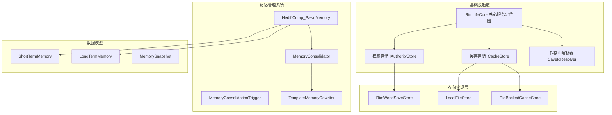
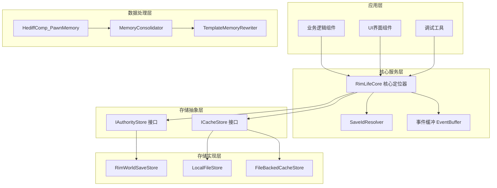
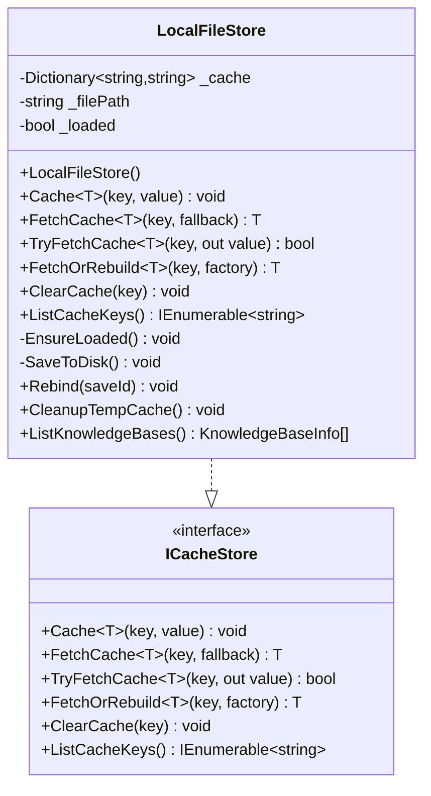
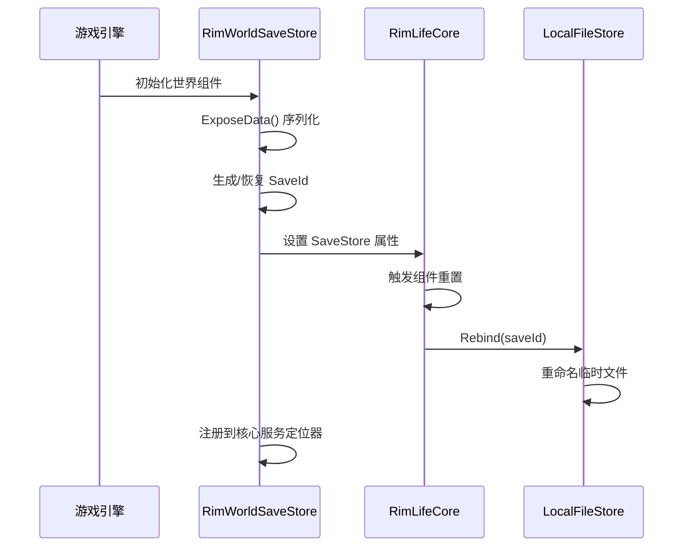
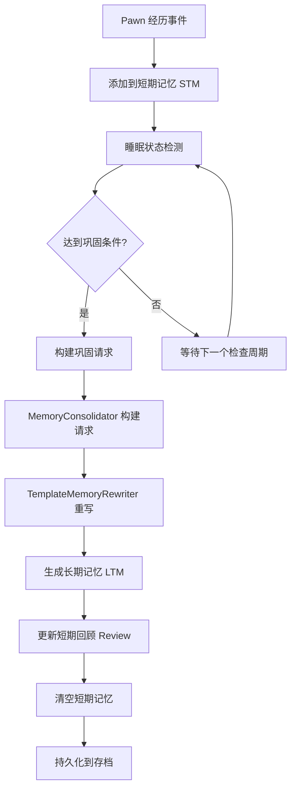
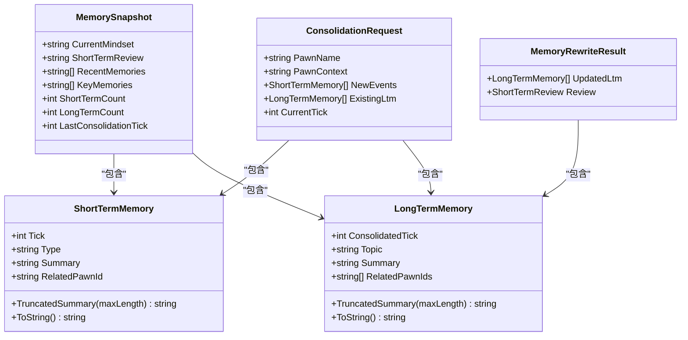
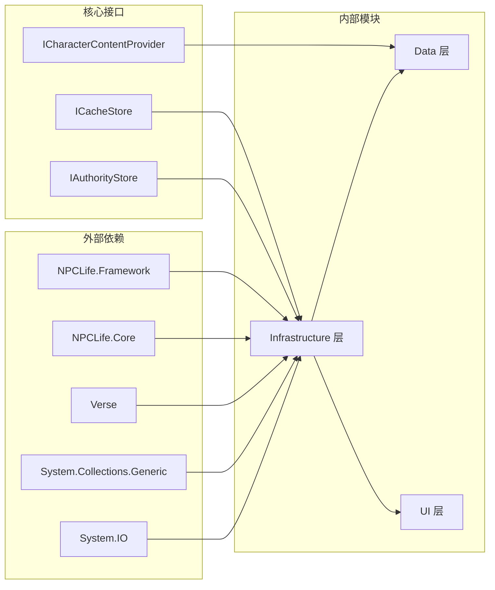

# 缓存系统增强

<cite>
**本文档引用的文件**
- [FileBackedCacheStore.cs](file://Source/Infrastructure/FileBackedCacheStore.cs)
- [LocalFileStore.cs](file://Source/Infrastructure/LocalFileStore.cs)
- [RimWorldSaveStore.cs](file://Source/Infrastructure/RimWorldSaveStore.cs)
- [RimLifeCore.cs](file://Source/Infrastructure/RimLifeCore.cs)
- [SaveIdResolver.cs](file://Source/Infrastructure/SaveIdResolver.cs)
- [IStorage.cs](file://ext/NPCLife/src/NPCLife/Core/IStorage.cs)
- [HediffComp_PawnMemory.cs](file://Source/Data/PawnPro/Memory/HediffComp_PawnMemory.cs)
- [MemoryConsolidator.cs](file://Source/Data/PawnPro/Memory/MemoryConsolidator.cs)
- [MemoryConsolidationTrigger.cs](file://Source/Data/PawnPro/Memory/MemoryConsolidationTrigger.cs)
- [LongTermMemory.cs](file://Source/Data/PawnPro/Memory/LongTermMemory.cs)
- [ShortTermMemory.cs](file://Source/Data/PawnPro/Memory/ShortTermMemory.cs)
- [MemorySnapshot.cs](file://Source/Data/PawnPro/Memory/MemorySnapshot.cs)
- [IMemoryRewriter.cs](file://Source/Data/PawnPro/Memory/IMemoryRewriter.cs)
- [TemplateMemoryRewriter.cs](file://Source/Data/PawnPro/Memory/TemplateMemoryRewriter.cs)
</cite>

## 目录
1. [简介](#简介)
2. [项目结构](#项目结构)
3. [核心组件](#核心组件)
4. [架构概览](#架构概览)
5. [详细组件分析](#详细组件分析)
6. [依赖关系分析](#依赖关系分析)
7. [性能考虑](#性能考虑)
8. [故障排除指南](#故障排除指南)
9. [结论](#结论)

## 简介

RimLife项目的缓存系统是一个多层次、分布式的存储解决方案，专门设计用于支持RimWorld模组的记忆管理和知识库持久化需求。该系统通过结合权威存储（存档文件）和缓存存储（本地文件）两种机制，实现了数据的可靠性和性能之间的最佳平衡。

缓存系统的核心目标是在保证数据安全性的前提下，提供高效的内存访问和持久化存储能力。系统特别针对NPC记忆管理进行了优化，包括短期记忆（STM）和长期记忆（LTM）的处理，以及Pawn个体记忆的完整生命周期管理。

## 项目结构

项目采用模块化的架构设计，主要分为以下几个核心区域：

**图表来源**
- [RimLifeCore.cs:1-693](file://Source/Infrastructure/RimLifeCore.cs#L1-L693)
- [IStorage.cs:1-52](file://ext/NPCLife/src/NPCLife/Core/IStorage.cs#L1-L52)

**章节来源**
- [RimLifeCore.cs:1-693](file://Source/Infrastructure/RimLifeCore.cs#L1-L693)
- [IStorage.cs:1-52](file://ext/NPCLife/src/NPCLife/Core/IStorage.cs#L1-L52)

## 核心组件

缓存系统由三个主要层次组成，每层都有其特定的职责和特性：

### 权威存储层（IAuthorityStore）

权威存储层负责最重要的数据持久化，这些数据不能丢失，必须保证完整性。当前实现为RimWorldSaveStore，通过RimWorld的世界组件机制将数据嵌入到存档文件中。

**关键特性：**
- 数据不可丢失，缺失视为异常
- 与RimWorld存档系统深度集成
- 使用GUID作为存档标识，确保稳定性
- 支持复杂对象的序列化和反序列化

### 缓存存储层（ICacheStore）

缓存存储层提供高性能的临时数据存储，允许数据丢失和重建。系统提供了多种实现：

**LocalFileStore：** 基于本地文件的缓存存储，按存档GUID命名文件，支持临时文件机制
**FileBackedCacheStore：** 单文件缓存存储，适用于主菜单等场景

**关键特性：**
- 数据可再生，缺失属于正常情况
- 支持JSON序列化和反序列化
- 自动文件I/O管理和错误处理
- 提供统一的缓存API接口

### 记忆管理系统

针对NPC记忆管理的专用系统，包括短期记忆和长期记忆的处理：

**短期记忆（STM）：** 记录Pawn近期经历的原始事件，天然上限防止无限膨胀
**长期记忆（LTM）：** 由LLM在旧存档基础上重写的叙述性记忆，纯DTO设计

**章节来源**
- [RimWorldSaveStore.cs:1-129](file://Source/Infrastructure/RimWorldSaveStore.cs#L1-L129)
- [LocalFileStore.cs:1-286](file://Source/Infrastructure/LocalFileStore.cs#L1-L286)
- [FileBackedCacheStore.cs:1-132](file://Source/Infrastructure/FileBackedCacheStore.cs#L1-L132)
- [HediffComp_PawnMemory.cs:1-408](file://Source/Data/PawnPro/Memory/HediffComp_PawnMemory.cs#L1-L408)

## 架构概览

缓存系统的整体架构采用了分层设计和依赖注入模式，确保了系统的可扩展性和维护性：

**图表来源**
- [RimLifeCore.cs:1-693](file://Source/Infrastructure/RimLifeCore.cs#L1-L693)
- [IStorage.cs:1-52](file://ext/NPCLife/src/NPCLife/Core/IStorage.cs#L1-L52)

## 详细组件分析

### LocalFileStore 缓存存储实现

LocalFileStore是缓存存储的主要实现，提供了完整的文件I/O管理和存档绑定功能：

**图表来源**
- [LocalFileStore.cs:1-286](file://Source/Infrastructure/LocalFileStore.cs#L1-L286)
- [IStorage.cs:25-51](file://ext/NPCLife/src/NPCLife/Core/IStorage.cs#L25-L51)

**关键实现特点：**

1. **智能文件管理：** 自动创建缓存目录，按存档GUID命名文件
2. **临时文件支持：** 新游戏时使用_temp.json，首次保存时重命名为正式文件
3. **错误处理：** 完善的异常捕获和日志记录机制
4. **性能优化：** 内存缓存+延迟加载策略

**章节来源**
- [LocalFileStore.cs:1-286](file://Source/Infrastructure/LocalFileStore.cs#L1-L286)

### RimWorldSaveStore 权威存储实现

RimWorldSaveStore实现了权威存储接口，与RimWorld的存档系统深度集成：

**图表来源**
- [RimWorldSaveStore.cs:66-125](file://Source/Infrastructure/RimWorldSaveStore.cs#L66-L125)
- [RimLifeCore.cs:444-487](file://Source/Infrastructure/RimLifeCore.cs#L444-L487)

**核心功能：**

1. **存档GUID管理：** 自动生成唯一的存档标识符
2. **组件生命周期管理：** 自动处理存档加载和卸载
3. **缓存存储绑定：** 自动重绑定缓存文件到正确存档
4. **数据序列化：** 支持复杂对象的JSON序列化

**章节来源**
- [RimWorldSaveStore.cs:1-129](file://Source/Infrastructure/RimWorldSaveStore.cs#L1-L129)

### 记忆巩固系统

记忆巩固系统是缓存系统的重要组成部分，专门处理Pawn记忆的转换和持久化：

**图表来源**
- [MemoryConsolidationTrigger.cs:1-79](file://Source/Data/PawnPro/Memory/MemoryConsolidationTrigger.cs#L1-L79)
- [MemoryConsolidator.cs:1-61](file://Source/Data/PawnPro/Memory/MemoryConsolidator.cs#L1-L61)
- [TemplateMemoryRewriter.cs:1-152](file://Source/Data/PawnPro/Memory/TemplateMemoryRewriter.cs#L1-L152)

**系统特性：**

1. **双触发机制：** 睡眠触发（7500 ticks）和定时触发（60000 ticks）
2. **两阶段巩固：** 同步构建请求 + 异步重写处理
3. **防重入保护：** 避免并发巩固操作冲突
4. **内存管理：** 自动清理短期记忆，防止内存泄漏

**章节来源**
- [MemoryConsolidationTrigger.cs:1-79](file://Source/Data/PawnPro/Memory/MemoryConsolidationTrigger.cs#L1-L79)
- [MemoryConsolidator.cs:1-61](file://Source/Data/PawnPro/Memory/MemoryConsolidator.cs#L1-L61)
- [HediffComp_PawnMemory.cs:232-301](file://Source/Data/PawnPro/Memory/HediffComp_PawnMemory.cs#L232-L301)

### 数据模型设计

缓存系统使用了精心设计的数据模型来表示不同类型的记忆：

**图表来源**
- [ShortTermMemory.cs:1-48](file://Source/Data/PawnPro/Memory/ShortTermMemory.cs#L1-L48)
- [LongTermMemory.cs:1-53](file://Source/Data/PawnPro/Memory/LongTermMemory.cs#L1-L53)
- [MemorySnapshot.cs:1-36](file://Source/Data/PawnPro/Memory/MemorySnapshot.cs#L1-L36)
- [IMemoryRewriter.cs:23-52](file://Source/Data/PawnPro/Memory/IMemoryRewriter.cs#L23-L52)

**数据模型特点：**

1. **纯DTO设计：** 所有数据模型都是简单的数据传输对象，零外部依赖
2. **序列化友好：** 专门为JSON序列化而设计，支持复杂对象的自动转换
3. **内存效率：** 使用适当的字段类型和截断机制，控制内存使用
4. **类型安全：** 强类型的泛型接口，提供编译时类型检查

**章节来源**
- [ShortTermMemory.cs:1-48](file://Source/Data/PawnPro/Memory/ShortTermMemory.cs#L1-L48)
- [LongTermMemory.cs:1-53](file://Source/Data/PawnPro/Memory/LongTermMemory.cs#L1-L53)
- [MemorySnapshot.cs:1-36](file://Source/Data/PawnPro/Memory/MemorySnapshot.cs#L1-L36)

## 依赖关系分析

缓存系统的依赖关系体现了清晰的分层架构和解耦设计：

**图表来源**
- [RimLifeCore.cs:1-693](file://Source/Infrastructure/RimLifeCore.cs#L1-L693)
- [IStorage.cs:1-52](file://ext/NPCLife/src/NPCLife/Core/IStorage.cs#L1-L52)

**依赖特点：**

1. **接口隔离：** 通过清晰的接口定义实现模块间解耦
2. **抽象层设计：** 基础设施层提供抽象接口，具体实现可以替换
3. **单向依赖：** 依赖关系主要从上层模块指向基础设施层
4. **最小依赖：** 外部依赖被限制在必要的范围内

**章节来源**
- [RimLifeCore.cs:1-693](file://Source/Infrastructure/RimLifeCore.cs#L1-L693)
- [IStorage.cs:1-52](file://ext/NPCLife/src/NPCLife/Core/IStorage.cs#L1-L52)

## 性能考虑

缓存系统在设计时充分考虑了性能优化，采用了多种策略来提升系统响应速度和资源利用率：

### 内存优化策略

1. **延迟加载：** 文件内容只有在首次访问时才加载到内存
2. **增量持久化：** 数据变更立即写入磁盘，避免大量内存占用
3. **智能清理：** 短期记忆在巩固后自动清理，防止内存泄漏

### I/O性能优化

1. **批量写入：** 缓存操作采用批量持久化，减少磁盘I/O次数
2. **文件系统优化：** 使用合适的文件路径和命名规则
3. **错误恢复：** 完善的异常处理确保系统稳定性

### 记忆管理优化

1. **时间窗口控制：** 短期记忆保留时间限制在24小时内
2. **分组处理：** 按类型和关联Pawn分组处理，提高处理效率
3. **异步处理：** 记忆重写采用异步方式，避免阻塞主线程

## 故障排除指南

缓存系统提供了完善的错误处理和诊断功能：

### 常见问题及解决方案

**缓存文件加载失败：**
- 检查文件权限和磁盘空间
- 验证JSON格式的有效性
- 查看日志中的具体错误信息

**存档绑定问题：**
- 确认SaveIdResolver的正确设置
- 检查临时文件是否正确重命名
- 验证存档GUID的一致性

**内存溢出问题：**
- 检查短期记忆的清理机制
- 监控长期记忆的增长趋势
- 调整记忆保留策略

### 调试和监控

系统提供了丰富的日志记录和状态报告功能：

1. **详细日志记录：** 关键操作都有相应的日志输出
2. **状态监控：** 可以查看缓存大小、命中率等指标
3. **错误诊断：** 提供详细的错误堆栈和上下文信息

**章节来源**
- [LocalFileStore.cs:115-129](file://Source/Infrastructure/LocalFileStore.cs#L115-L129)
- [FileBackedCacheStore.cs:96-113](file://Source/Infrastructure/FileBackedCacheStore.cs#L96-L113)
- [RimWorldSaveStore.cs:66-103](file://Source/Infrastructure/RimWorldSaveStore.cs#L66-L103)

## 结论

RimLife项目的缓存系统通过精心设计的分层架构和多种优化策略，成功实现了高性能、高可靠性的数据存储解决方案。系统不仅满足了RimWorld模组的特殊需求，还为未来的扩展和改进奠定了坚实的基础。

**主要成就：**

1. **架构完整性：** 清晰的分层设计和接口抽象
2. **性能优化：** 多种策略确保系统的高效运行
3. **可靠性保障：** 完善的错误处理和恢复机制
4. **可扩展性：** 模块化设计支持功能扩展
5. **用户体验：** 透明的缓存机制不影响用户操作

该缓存系统为RimLife项目提供了强大的数据持久化能力，特别是在NPC记忆管理和知识库存储方面表现卓越，为整个模组的功能实现提供了重要的技术支撑。