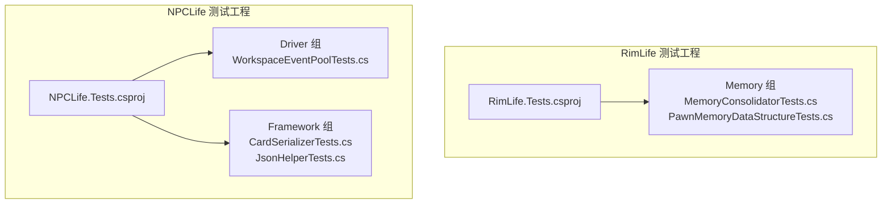
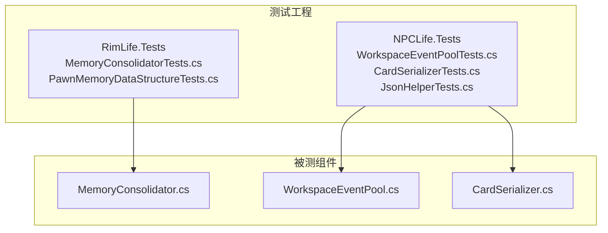
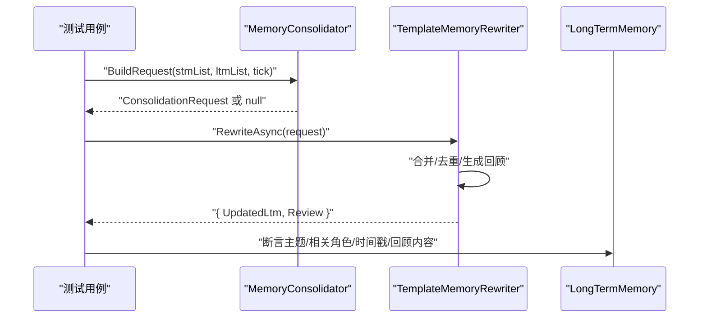
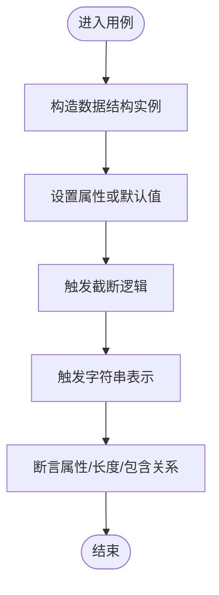
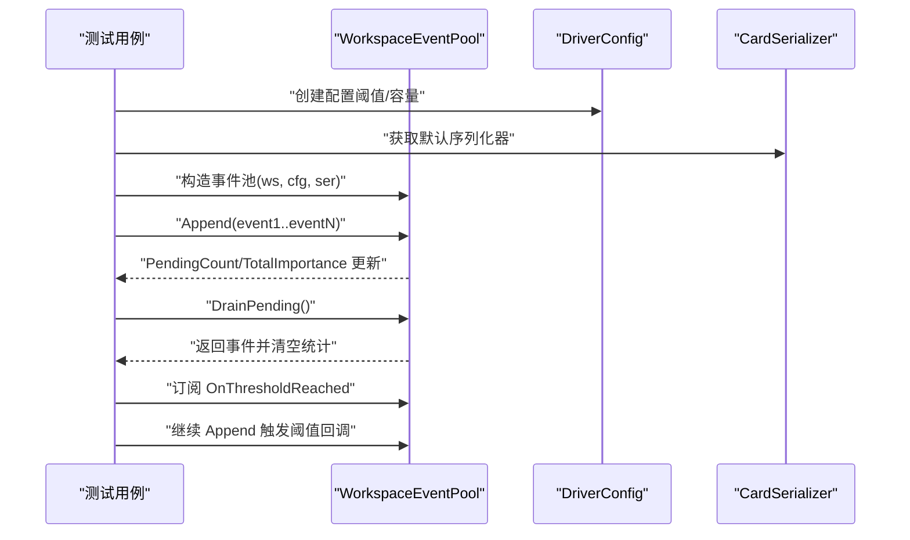
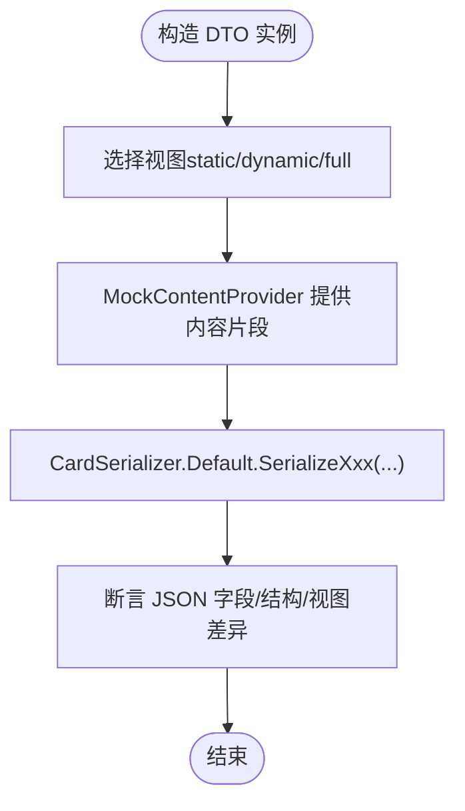
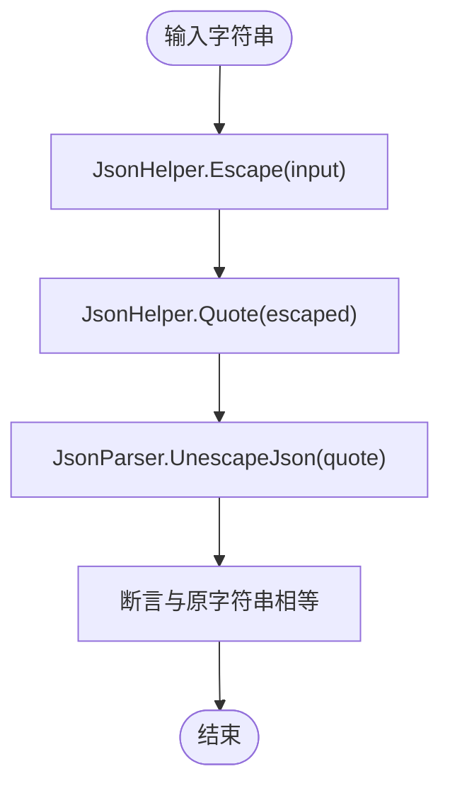
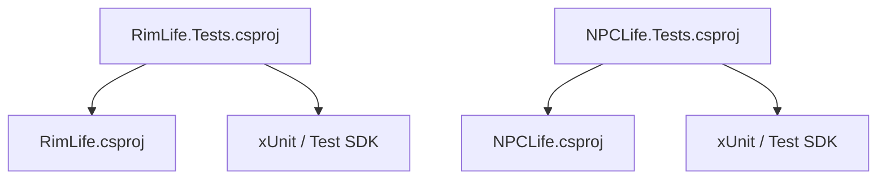

# 单元测试

<cite>
**本文引用的文件**
- [MemoryConsolidatorTests.cs](file://RimLife.Tests/Memory/MemoryConsolidatorTests.cs)
- [PawnMemoryDataStructureTests.cs](file://RimLife.Tests/Memory/PawnMemoryDataStructureTests.cs)
- [WorkspaceEventPoolTests.cs](file://ext/NPCLife/tests/NPCLife.Tests/Driver/WorkspaceEventPoolTests.cs)
- [CardSerializerTests.cs](file://ext/NPCLife/tests/NPCLife.Tests/Framework/CardSerializerTests.cs)
- [JsonHelperTests.cs](file://ext/NPCLife/tests/NPCLife.Tests/Framework/JsonHelperTests.cs)
- [NPCLife.Tests.csproj](file://ext/NPCLife/tests/NPCLife.Tests/NPCLife.Tests.csproj)
- [RimLife.Tests.csproj](file://RimLife.Tests/RimLife.Tests.csproj)
- [MemoryConsolidator.cs](file://Source/Data/PawnPro/Memory/MemoryConsolidator.cs)
- [CardSerializer.cs](file://ext/NPCLife/src/NPCLife/Framework/Mcp/CardSerializer.cs)
- [WorkspaceEventPool.cs](file://ext/NPCLife/src/NPCLife/Workspace/WorkspaceEventPool.cs)
</cite>

## 目录
1. [简介](#简介)
2. [项目结构](#项目结构)
3. [核心组件](#核心组件)
4. [架构总览](#架构总览)
5. [详细组件分析](#详细组件分析)
6. [依赖关系分析](#依赖关系分析)
7. [性能考量](#性能考量)
8. [故障排查指南](#故障排查指南)
9. [结论](#结论)
10. [附录](#附录)

## 简介
本文件面向 RimLife 及其扩展 NPCLife 的单元测试体系，系统梳理并深入解析以下测试模块：
- 记忆系统测试：MemoryConsolidatorTests、PawnMemoryDataStructureTests
- 工作空间测试：WorkspaceEventPoolTests
- 框架测试：CardSerializerTests、JsonHelperTests

文档从测试设计思路、断言策略、测试数据准备、职责边界与覆盖目标出发，结合具体测试用例路径，帮助初学者快速上手，同时为有经验的开发者提供足够的技术深度与可操作建议。

## 项目结构
RimLife 与 NPCLife 分别拥有独立的测试工程，均采用 xUnit 作为测试框架，并通过 NuGet 引入必要的 SDK 与运行器。测试工程以“按功能域分组”的方式组织，例如 Memory、Driver、Framework 等命名空间下分别存放对应领域的测试类。

图表来源
- [RimLife.Tests.csproj:1-24](file://RimLife.Tests/RimLife.Tests.csproj#L1-L24)
- [NPCLife.Tests.csproj:1-23](file://ext/NPCLife/tests/NPCLife.Tests/NPCLife.Tests.csproj#L1-L23)

章节来源
- [RimLife.Tests.csproj:1-24](file://RimLife.Tests/RimLife.Tests.csproj#L1-L24)
- [NPCLife.Tests.csproj:1-23](file://ext/NPCLife/tests/NPCLife.Tests/NPCLife.Tests.csproj#L1-L23)

## 核心组件
本节概述各测试模块的职责与覆盖目标：

- 记忆系统测试（Memory）
  - MemoryConsolidatorTests：验证两阶段巩固流程 BuildRequest + TemplateMemoryRewriter.RewriteAsync；覆盖空输入、请求构建、合并策略、既有记忆融合、回顾生成等场景。
  - PawnMemoryDataStructureTests：验证短期/长期记忆、短期回顾、当前心态的数据结构构造、默认行为、截断逻辑与字符串表示。

- 工作空间测试（Driver）
  - WorkspaceEventPoolTests：验证事件池生命周期、Append/Drain 行为、阈值回调触发、激活条件、多工作空间隔离与回调隔离。

- 框架测试（Framework）
  - CardSerializerTests：覆盖所有 Card DTO 的序列化路径，包括事件、殖民地上下文、角色卡（静态/动态/完整视图）、目标卡、环境卡、交互记录、殖民者摘要等，确保字段完整性与视图差异。
  - JsonHelperTests：覆盖转义与加引号的纯逻辑断言，含特殊字符、控制字符、混合内容、中文字符以及与解析器的往返一致性校验。

章节来源
- [MemoryConsolidatorTests.cs:12-186](file://RimLife.Tests/Memory/MemoryConsolidatorTests.cs#L12-L186)
- [PawnMemoryDataStructureTests.cs:11-190](file://RimLife.Tests/Memory/PawnMemoryDataStructureTests.cs#L11-L190)
- [WorkspaceEventPoolTests.cs:17-350](file://ext/NPCLife/tests/NPCLife.Tests/Driver/WorkspaceEventPoolTests.cs#L17-L350)
- [CardSerializerTests.cs:14-451](file://ext/NPCLife/tests/NPCLife.Tests/Framework/CardSerializerTests.cs#L14-L451)
- [JsonHelperTests.cs:10-90](file://ext/NPCLife/tests/NPCLife.Tests/Framework/JsonHelperTests.cs#L10-L90)

## 架构总览
下图展示了测试工程与其被测组件之间的依赖关系与交互模式。测试工程通过项目引用依赖被测库，使用 xUnit 断言与测试运行器执行测试。

图表来源
- [MemoryConsolidatorTests.cs:12-186](file://RimLife.Tests/Memory/MemoryConsolidatorTests.cs#L12-L186)
- [WorkspaceEventPoolTests.cs:17-350](file://ext/NPCLife/tests/NPCLife.Tests/Driver/WorkspaceEventPoolTests.cs#L17-L350)
- [CardSerializerTests.cs:14-451](file://ext/NPCLife/tests/NPCLife.Tests/Framework/CardSerializerTests.cs#L14-L451)
- [MemoryConsolidator.cs](file://Source/Data/PawnPro/Memory/MemoryConsolidator.cs)
- [WorkspaceEventPool.cs](file://ext/NPCLife/src/NPCLife/Workspace/WorkspaceEventPool.cs)
- [CardSerializer.cs](file://ext/NPCLife/src/NPCLife/Framework/Mcp/CardSerializer.cs)

## 详细组件分析

### 记忆系统测试（Memory）

#### MemoryConsolidatorTests
- 设计思路
  - 两阶段巩固：先构建 ConsolidationRequest（BuildRequest），再由 TemplateMemoryRewriter 执行 RewriteAsync 进行合并与生成回顾。
  - 覆盖边界条件（空列表、null 列表）、正常请求构建、同类型同角色合并、不同类型的分离、已有长期记忆的融合、回顾生成。
- 断言策略
  - 使用 Null/NotNull、Equal、Single、Contains、StartsWith/EndsWith、Empty/NotEmpty 等断言组合，确保请求字段、结果数量、主题标签、时间戳与回顾内容正确。
- 测试数据准备
  - 使用 ShortTermMemory、LongTermMemory、ConsolidationRequest 等模型构造最小可验证输入；通过 CurrentTick 控制时间线。
- 关键用例路径
  - 请求构建：[BuildRequest_EmptyList_ReturnsNull:14-20](file://RimLife.Tests/Memory/MemoryConsolidatorTests.cs#L14-L20)、[BuildRequest_ValidList_ReturnsRequest:30-46](file://RimLife.Tests/Memory/MemoryConsolidatorTests.cs#L30-L46)
  - 合并与回顾：[RewriteAsync_SingleEntry_CreatesOneLtm:48-73](file://RimLife.Tests/Memory/MemoryConsolidatorTests.cs#L48-L73)、[RewriteAsync_SameTypeAndPawn_MergesIntoOne:75-99](file://RimLife.Tests/Memory/MemoryConsolidatorTests.cs#L75-L99)、[RewriteAsync_DifferentTypes_ProducesSeparateLtms:101-128](file://RimLife.Tests/Memory/MemoryConsolidatorTests.cs#L101-L128)、[RewriteAsync_ExistingLtm_MergesWithExisting:130-159](file://RimLife.Tests/Memory/MemoryConsolidatorTests.cs#L130-L159)、[RewriteAsync_GeneratesReview:161-185](file://RimLife.Tests/Memory/MemoryConsolidatorTests.cs#L161-L185)

图表来源
- [MemoryConsolidatorTests.cs:30-73](file://RimLife.Tests/Memory/MemoryConsolidatorTests.cs#L30-L73)
- [MemoryConsolidator.cs](file://Source/Data/PawnPro/Memory/MemoryConsolidator.cs)

章节来源
- [MemoryConsolidatorTests.cs:12-186](file://RimLife.Tests/Memory/MemoryConsolidatorTests.cs#L12-L186)

#### PawnMemoryDataStructureTests
- 设计思路
  - 验证数据结构的构造、默认初始化、截断逻辑、字符串表示与类型默认值。
- 断言策略
  - Equal/Null/Empty、Contains、EndsWith、Length 等断言，确保属性与行为符合预期。
- 测试数据准备
  - 使用超长文本进行截断长度验证；使用 null 值验证默认行为。
- 关键用例路径
  - ShortTermMemory：[ShortTermMemory_Constructor_SetsProperties:17-26](file://RimLife.Tests/Memory/PawnMemoryDataStructureTests.cs#L17-L26)、[ShortTermMemory_TruncatedSummary_ExceedsLimit:47-56](file://RimLife.Tests/Memory/PawnMemoryDataStructureTests.cs#L47-L56)、[ShortTermMemory_NullType_DefaultsToObservation:70-74](file://RimLife.Tests/Memory/PawnMemoryDataStructureTests.cs#L70-L74)
  - LongTermMemory：[LongTermMemory_Constructor_SetsProperties:80-92](file://RimLife.Tests/Memory/PawnMemoryDataStructureTests.cs#L80-L92)、[LongTermMemory_TruncatedSummary_Works:103-116](file://RimLife.Tests/Memory/PawnMemoryDataStructureTests.cs#L103-L116)
  - ShortTermReview：[ShortTermReview_Constructor_SetsProperties:133-140](file://RimLife.Tests/Memory/PawnMemoryDataStructureTests.cs#L133-L140)、[ShortTermReview_ToString_ContainsPreview:151-158](file://RimLife.Tests/Memory/PawnMemoryDataStructureTests.cs#L151-L158)
  - CurrentMindset：[CurrentMindset_Constructor_SetsProperties:164-171](file://RimLife.Tests/Memory/PawnMemoryDataStructureTests.cs#L164-L171)、[CurrentMindset_ToString_ContainsPreview:182-189](file://RimLife.Tests/Memory/PawnMemoryDataStructureTests.cs#L182-L189)

图表来源
- [PawnMemoryDataStructureTests.cs:17-189](file://RimLife.Tests/Memory/PawnMemoryDataStructureTests.cs#L17-L189)

章节来源
- [PawnMemoryDataStructureTests.cs:11-190](file://RimLife.Tests/Memory/PawnMemoryDataStructureTests.cs#L11-L190)

### 工作空间测试（Driver）

#### WorkspaceEventPoolTests
- 设计思路
  - 验证事件池的生命周期与核心行为：Append 写入、Drain 清空、阈值回调触发、激活条件判断、多工作空间隔离。
- 断言策略
  - 使用 Equal、True/False、Count/Length 等断言，确保计数、重要性总和、回调次数与工作空间独立性。
- 测试数据准备
  - 通过辅助方法构造 DriverConfig、IGameEvent、WorkspaceState 与 WorkspaceEventPool 实例，统一管理阈值与序列化器。
- 关键用例路径
  - 初始化与 Append：[EventPool_InitialState:73-80](file://ext/NPCLife/tests/NPCLife.Tests/Driver/WorkspaceEventPoolTests.cs#L73-L80)、[Append_IncreasesPendingCount:86-96](file://ext/NPCLife/tests/NPCLife.Tests/Driver/WorkspaceEventPoolTests.cs#L86-L96)、[Append_CalculatesImportance:98-108](file://ext/NPCLife/tests/NPCLife.Tests/Driver/WorkspaceEventPoolTests.cs#L98-L108)
  - Drain 与阈值回调：[DrainPending_ReturnsEventsAndClears:119-132](file://ext/NPCLife/tests/NPCLife.Tests/Driver/WorkspaceEventPoolTests.cs#L119-L132)、[OnThresholdReached_FiresWhenCountExceeded:149-162](file://ext/NPCLife/tests/NPCLife.Tests/Driver/WorkspaceEventPoolTests.cs#L149-L162)、[OnThresholdReached_FiresWhenImportanceExceeded:164-175](file://ext/NPCLife/tests/NPCLife.Tests/Driver/WorkspaceEventPoolTests.cs#L164-L175)
  - 激活条件：[Activation_CountThreshold_Satisfied:203-213](file://ext/NPCLife/tests/NPCLife.Tests/Driver/WorkspaceEventPoolTests.cs#L203-L213)、[Activation_ImportanceThreshold_Satisfied:226-237](file://ext/NPCLife/tests/NPCLife.Tests/Driver/WorkspaceEventPoolTests.cs#L226-L237)
  - 多工作空间隔离：[MultipleWorkspaces_IndependentPools:280-292](file://ext/NPCLife/tests/NPCLife.Tests/Driver/WorkspaceEventPoolTests.cs#L280-L292)、[Callback_DoesNotCrossFireBetweenPools:317-332](file://ext/NPCLife/tests/NPCLife.Tests/Driver/WorkspaceEventPoolTests.cs#L317-L332)

图表来源
- [WorkspaceEventPoolTests.cs:63-197](file://ext/NPCLife/tests/NPCLife.Tests/Driver/WorkspaceEventPoolTests.cs#L63-L197)
- [WorkspaceEventPool.cs](file://ext/NPCLife/src/NPCLife/Workspace/WorkspaceEventPool.cs)

章节来源
- [WorkspaceEventPoolTests.cs:17-350](file://ext/NPCLife/tests/NPCLife.Tests/Driver/WorkspaceEventPoolTests.cs#L17-L350)

### 框架测试（Framework）

#### CardSerializerTests
- 设计思路
  - 对所有 Card DTO 的序列化路径进行自检，覆盖事件、殖民地上下文、角色卡（静态/动态/完整视图）、目标卡、环境卡、交互记录、殖民者摘要等。
  - 重点验证视图差异（如动态/完整视图包含的记忆详情与静态视图不包含）以及字段完整性。
- 断言策略
  - Contains/StartsWith/EndsWith/Equal/Empty 等断言，确保 JSON 包含期望字段与结构。
- 测试数据准备
  - 使用 MockContentProvider 提供不同视图下的内容片段，验证视图过滤与渲染差异。
- 关键用例路径
  - 事件：[SerializeEvent_BasicEvent_ContainsExpectedFields:20-49](file://ext/NPCLife/tests/NPCLife.Tests/Framework/CardSerializerTests.cs#L20-L49)、[SerializeEventList_Empty_ReturnsEmptyArray:51-56](file://ext/NPCLife/tests/NPCLife.Tests/Framework/CardSerializerTests.cs#L51-L56)
  - 殖民地上下文：[SerializeColonyContext_FullContext_ContainsAllSections:78-115](file://ext/NPCLife/tests/NPCLife.Tests/Framework/CardSerializerTests.cs#L78-L115)、[SerializeColonyContext_Null_ReturnsEmptyObject:117-122](file://ext/NPCLife/tests/NPCLife.Tests/Framework/CardSerializerTests.cs#L117-L122)
  - 角色卡（静态/动态/完整）：[SerializeCharacterCard_Basic_AlwaysIncludesMetadata:128-149](file://ext/NPCLife/tests/NPCLife.Tests/Framework/CardSerializerTests.cs#L128-L149)、[SerializeCharacterCard_DynamicView_IncludesPerspectiveAndMemory:151-176](file://ext/NPCLife/tests/NPCLife.Tests/Framework/CardSerializerTests.cs#L151-L176)、[SerializeCharacterCard_FullView_ContainsAllSectionsAndMemoryDetails:177-224](file://ext/NPCLife/tests/NPCLife.Tests/Framework/CardSerializerTests.cs#L177-L224)、[SerializeCharacterCard_StaticView_NoMemoryOrPerspective:226-255](file://ext/NPCLife/tests/NPCLife.Tests/Framework/CardSerializerTests.cs#L226-L255)
  - 目标卡：[SerializeObjective_Basic_ContainsFields:261-285](file://ext/NPCLife/tests/NPCLife.Tests/Framework/CardSerializerTests.cs#L261-L285)、[SerializeObjectiveList_Empty_ReturnsEmptyArray:287-292](file://ext/NPCLife/tests/NPCLife.Tests/Framework/CardSerializerTests.cs#L287-L292)
  - 环境卡：[SerializeEnvironment_Outdoors_IncludesWeather:298-323](file://ext/NPCLife/tests/NPCLife.Tests/Framework/CardSerializerTests.cs#L298-L323)、[SerializeEnvironment_Indoors_NoRoomField:325-342](file://ext/NPCLife/tests/NPCLife.Tests/Framework/CardSerializerTests.cs#L325-L342)
  - 交互记录：[SerializeInteraction_Basic_ContainsFields:348-367](file://ext/NPCLife/tests/NPCLife.Tests/Framework/CardSerializerTests.cs#L348-L367)、[SerializeInteractionList_Multiple_ReturnsArray:369-383](file://ext/NPCLife/tests/NPCLife.Tests/Framework/CardSerializerTests.cs#L369-L383)
  - 殖民者摘要：[SerializeColonistSummaryList_Multiple_ReturnsArray:389-401](file://ext/NPCLife/tests/NPCLife.Tests/Framework/CardSerializerTests.cs#L389-L401)

图表来源
- [CardSerializerTests.cs:14-451](file://ext/NPCLife/tests/NPCLife.Tests/Framework/CardSerializerTests.cs#L14-L451)
- [CardSerializer.cs](file://ext/NPCLife/src/NPCLife/Framework/Mcp/CardSerializer.cs)

章节来源
- [CardSerializerTests.cs:14-451](file://ext/NPCLife/tests/NPCLife.Tests/Framework/CardSerializerTests.cs#L14-L451)

#### JsonHelperTests
- 设计思路
  - 对 JsonHelper 的 Escape 与 Quote 方法进行纯逻辑断言，覆盖空/空字符串、普通字符串、特殊字符转义、控制字符 Unicode 编码、混合内容、中文字符处理以及与解析器的往返一致性。
- 断言策略
  - Equal、Contains、DoesNotContain 等断言，确保转义规则与输出格式正确。
- 关键用例路径
  - Escape：[Escape_NullOrEmpty_ReturnsEmpty:12-17](file://ext/NPCLife/tests/NPCLife.Tests/Framework/JsonHelperTests.cs#L12-L17)、[Escape_SpecialChars_EscapesCorrectly:25-36](file://ext/NPCLife/tests/NPCLife.Tests/Framework/JsonHelperTests.cs#L25-L36)、[Escape_ControlCharacters_EncodesUnicode:38-48](file://ext/NPCLife/tests/NPCLife.Tests/Framework/JsonHelperTests.cs#L38-L48)、[Escape_MixedContent_EscapesAll:50-57](file://ext/NPCLife/tests/NPCLife.Tests/Framework/JsonHelperTests.cs#L50-L57)、[Escape_ChineseCharacters_NotEscaped:60-64](file://ext/NPCLife/tests/NPCLife.Tests/Framework/JsonHelperTests.cs#L60-L64)
  - Quote：[Quote_WrapsInDoubleQuotes:66-72](file://ext/NPCLife/tests/NPCLife.Tests/Framework/JsonHelperTests.cs#L66-L72)、[Quote_EscapesInternalQuotes:74-79](file://ext/NPCLife/tests/NPCLife.Tests/Framework/JsonHelperTests.cs#L74-L79)
  - 往返一致性：[Escape_Quote_RoundTrip_WithParser:81-89](file://ext/NPCLife/tests/NPCLife.Tests/Framework/JsonHelperTests.cs#L81-L89)

图表来源
- [JsonHelperTests.cs:10-90](file://ext/NPCLife/tests/NPCLife.Tests/Framework/JsonHelperTests.cs#L10-L90)

章节来源
- [JsonHelperTests.cs:10-90](file://ext/NPCLife/tests/NPCLife.Tests/Framework/JsonHelperTests.cs#L10-L90)

## 依赖关系分析
- 测试工程与被测组件
  - RimLife.Tests 依赖 RimLife.csproj，覆盖记忆系统相关测试。
  - NPCLife.Tests 依赖 NPCLife.csproj，覆盖工作空间与框架相关测试。
- 测试框架与运行器
  - 两个测试工程均引入 xUnit、xUnit.Runner.VisualStudio 与 Microsoft.NET.Test.Sdk。
- 组件耦合与隔离
  - 测试之间保持高内聚、低耦合；通过构造函数参数与工厂方法注入依赖，避免全局状态影响。

图表来源
- [RimLife.Tests.csproj:1-24](file://RimLife.Tests/RimLife.Tests.csproj#L1-L24)
- [NPCLife.Tests.csproj:1-23](file://ext/NPCLife/tests/NPCLife.Tests/NPCLife.Tests.csproj#L1-L23)

章节来源
- [RimLife.Tests.csproj:1-24](file://RimLife.Tests/RimLife.Tests.csproj#L1-L24)
- [NPCLife.Tests.csproj:1-23](file://ext/NPCLife/tests/NPCLife.Tests/NPCLife.Tests.csproj#L1-L23)

## 性能考量
- 测试执行效率
  - 使用同步断言与轻量级构造，避免在单元测试中引入异步开销；仅在确有必要（如异步写入/网络）时使用异步测试。
- 数据规模与边界
  - 对于大文本截断与序列化，优先使用较小规模的测试数据，确保断言清晰且执行快速。
- 并行与隔离
  - 避免共享可变状态；必要时通过工厂方法与局部变量保证测试隔离，减少潜在竞争。

## 故障排查指南
- 断言失败定位
  - 使用明确的断言消息与最小可复现输入，逐步缩小问题范围；优先检查输入构造是否符合预期。
- 视图差异导致的失败
  - 在 CardSerializerTests 中，若动态/完整视图断言失败，检查 MockContentProvider 的视图过滤逻辑与内容提供顺序。
- 回调未触发
  - 在 WorkspaceEventPoolTests 中，确认订阅 OnThresholdReached 是否在 Append 之前完成；检查阈值配置与事件重要性总和计算。
- 转义与解析不一致
  - 在 JsonHelperTests 中，若往返测试失败，检查输入中是否包含未覆盖的控制字符或编码规则变更。

## 结论
上述测试模块围绕记忆系统、工作空间与框架层的关键路径建立了全面的单元测试覆盖。通过清晰的断言策略、严谨的测试数据准备与严格的隔离策略，有效保障了核心功能的稳定性与可维护性。建议在新增功能时遵循现有测试模式，优先补充边界与回归用例，持续提升测试覆盖率与质量。

## 附录
- 测试环境配置要点
  - 目标框架：net48；平台目标：AnyCPU/x64；语言版本：12.0（NPCLife）/ default（RimLife）。
  - 测试框架：xUnit 2.9.3；VS 运行器：xUnit.Runner.VisualStudio 3.0.2；SDK：Microsoft.NET.Test.Sdk 17.13.0。
- 模拟对象与辅助类
  - MockContentProvider：用于在不同视图下提供内容片段，便于验证视图差异。
  - TestGameEvent：用于构造 IGameEvent 的最小实现，便于事件池与序列化测试。
- 测试隔离策略
  - 通过工厂方法与局部变量构造被测对象；避免共享可变状态；在需要时使用默认序列化器或空提供程序。