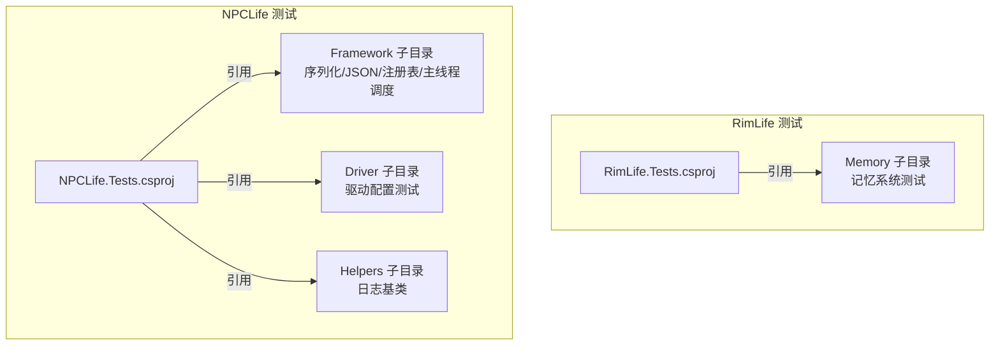
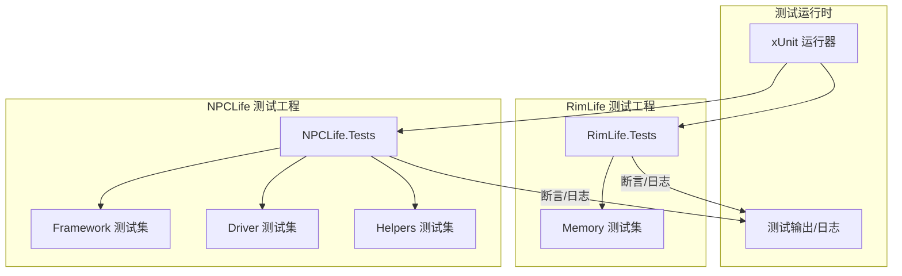
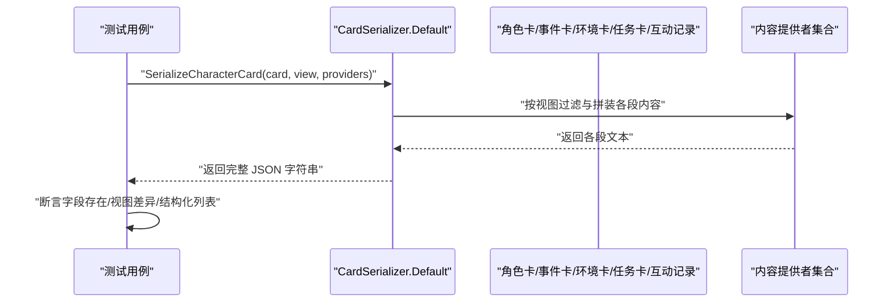
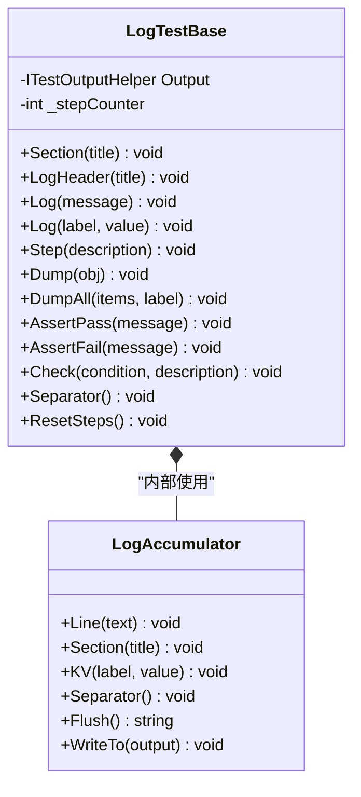
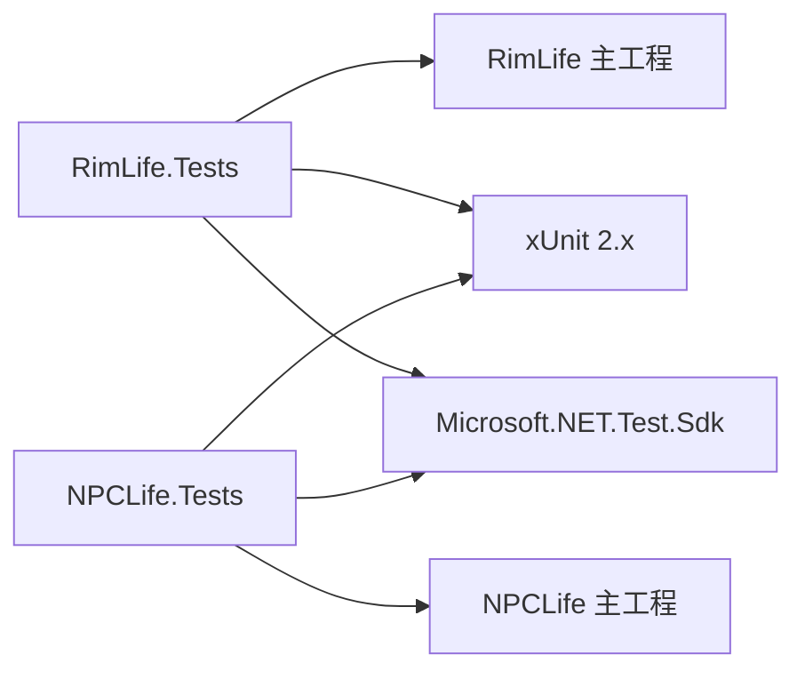

# 测试体系

<cite>
**本文引用的文件**
- [RimLife.Tests.csproj](file://RimLife.Tests/RimLife.Tests.csproj)
- [MemoryConsolidatorTests.cs](file://RimLife.Tests/Memory/MemoryConsolidatorTests.cs)
- [PawnMemoryDataStructureTests.cs](file://RimLife.Tests/Memory/PawnMemoryDataStructureTests.cs)
- [NPCLife.Tests.csproj](file://ext/NPCLife/tests/NPCLife.Tests/NPCLife.Tests.csproj)
- [CardSerializerTests.cs](file://ext/NPCLife/tests/NPCLife.Tests/Framework/CardSerializerTests.cs)
- [DriverConfigTests.cs](file://ext/NPCLife/tests/NPCLife.Tests/Driver/DriverConfigTests.cs)
- [McpSkillRegistryTests.cs](file://ext/NPCLife/tests/NPCLife.Tests/Framework/McpSkillRegistryTests.cs)
- [LogTestBase.cs](file://ext/NPCLife/tests/NPCLife.Tests/Helpers/LggTestBase.cs)
</cite>

## 目录
1. [引言](#引言)
2. [项目结构](#项目结构)
3. [核心组件](#核心组件)
4. [架构总览](#架构总览)
5. [详细组件分析](#详细组件分析)
6. [依赖关系分析](#依赖关系分析)
7. [性能考量](#性能考量)
8. [故障排查指南](#故障排查指南)
9. [结论](#结论)
10. [附录](#附录)

## 引言
本文件系统化梳理 RimLife 的测试体系，覆盖单元测试、集成测试与框架测试的组织结构与实现要点。重点围绕记忆系统、工作空间与框架能力、UI 交互支撑以及测试数据与环境配置展开，并给出测试策略、覆盖率与质量标准建议、自动化与持续集成思路、结果分析与问题定位方法，以及最佳实践与调试技巧。文档兼顾初学者可读性与资深开发者所需的技术深度。

## 项目结构
RimLife 的测试工程采用“按功能域分层”的组织方式：
- RimLife.Tests：核心模块测试，当前聚焦记忆系统（短期/长期记忆、巩固器、回顾与心智模型）。
- ext/NPCLife/tests/NPCLife.Tests：扩展模块测试，覆盖框架序列化、驱动配置、MCP 技能注册与工具调用、日志辅助基类等。

测试工程统一基于 xUnit 2.x，使用 .NET SDK 测试项目模板，分别引用主工程或扩展工程作为被测目标。

图表来源
- [RimLife.Tests.csproj:1-24](file://RimLife.Tests/RimLife.Tests.csproj#L1-L24)
- [NPCLife.Tests.csproj:1-23](file://ext/NPCLife/tests/NPCLife.Tests/NPCLife.Tests.csproj#L1-L23)

章节来源
- [RimLife.Tests.csproj:1-24](file://RimLife.Tests/RimLife.Tests.csproj#L1-L24)
- [NPCLife.Tests.csproj:1-23](file://ext/NPCLife/tests/NPCLife.Tests/NPCLife.Tests.csproj#L1-L23)

## 核心组件
- 记忆系统测试：验证短期/长期记忆数据结构、事件巩固请求构建、模板重写器的异步重写与合并逻辑、回顾生成与心智模型。
- 框架测试：验证卡片序列化（事件、角色卡、环境卡、任务卡、互动记录、殖民者摘要）的字段完整性与视图差异；验证 MCP 技能注册表的初始化、工具注册、激活状态、工具调用与错误处理；验证驱动配置的默认值与阈值查询。
- 日志辅助基类：为复杂流程提供结构化日志输出，支持分节、键值对、步骤计数、集合 Dump 与断言式日志。

章节来源
- [MemoryConsolidatorTests.cs:1-188](file://RimLife.Tests/Memory/MemoryConsolidatorTests.cs#L1-L188)
- [PawnMemoryDataStructureTests.cs:1-192](file://RimLife.Tests/Memory/PawnMemoryDataStructureTests.cs#L1-L192)
- [CardSerializerTests.cs:1-453](file://ext/NPCLife/tests/NPCLife.Tests/Framework/CardSerializerTests.cs#L1-L453)
- [DriverConfigTests.cs:1-57](file://ext/NPCLife/tests/NPCLife.Tests/Driver/DriverConfigTests.cs#L1-L57)
- [McpSkillRegistryTests.cs:1-296](file://ext/NPCLife/tests/NPCLife.Tests/Framework/McpSkillRegistryTests.cs#L1-L296)
- [LogTestBase.cs:1-154](file://ext/NPCLife/tests/NPCLife.Tests/Helpers/LogTestBase.cs#L1-L154)

## 架构总览
测试架构以“测试工程 + 被测工程”为核心，通过 xUnit 提供断言与生命周期管理，利用项目引用实现跨模块测试耦合最小化。NPCLife 的测试进一步细分为 Framework、Driver、Cards、Helpers 等子目录，形成清晰的职责边界。

图表来源
- [RimLife.Tests.csproj:1-24](file://RimLife.Tests/RimLife.Tests.csproj#L1-L24)
- [NPCLife.Tests.csproj:1-23](file://ext/NPCLife/tests/NPCLife.Tests/NPCLife.Tests.csproj#L1-L23)

## 详细组件分析

### 记忆系统测试（短期/长期记忆、巩固器）
- 数据结构测试覆盖：
  - ShortTermMemory 默认构造、属性设置、摘要截断、ToString 关键信息校验、空类型归一化。
  - LongTermMemory 默认构造、摘要截断、相关角色列表初始化。
  - ShortTermReview、CurrentMindset 的构造与字符串表示。
- 巩固器测试覆盖：
  - BuildRequest 对空/空列表输入返回空的边界条件。
  - BuildRequest 对有效输入的字段校验（名称、事件数、现有 LTM、时间戳）。
  - TemplateMemoryRewriter 的异步重写：单条事件生成一条 LTM；同类同角色合并；不同类别产生多条 LTM；与既有 LTM 合并；生成 Review 内容与时间戳。

图表来源
- [MemoryConsolidatorTests.cs:14-73](file://RimLife.Tests/Memory/MemoryConsolidatorTests.cs#L14-L73)
- [PawnMemoryDataStructureTests.cs:17-127](file://RimLife.Tests/Memory/PawnMemoryDataStructureTests.cs#L17-L127)

章节来源
- [MemoryConsolidatorTests.cs:1-188](file://RimLife.Tests/Memory/MemoryConsolidatorTests.cs#L1-L188)
- [PawnMemoryDataStructureTests.cs:1-192](file://RimLife.Tests/Memory/PawnMemoryDataStructureTests.cs#L1-L192)

### 框架测试（卡片序列化、MCP 技能注册表、驱动配置）
- 卡片序列化测试：
  - 事件卡：基础字段、标签、演员、载荷等序列化校验；空列表与数组格式。
  - 殖民地上下文：季节、人口、食物、电力、平均士气、难度、派系关系等字段存在性。
  - 角色卡：静态/动态/全量视图差异、视角与记忆片段注入、全量视图中结构化列表与语义化文本。
  - 任务卡：标题、描述、状态、步骤列表。
  - 环境卡：户外/室内差异、天气字段存在性。
  - 互动记录：发起者、接受者、互动定义、结果。
  - 殖民者摘要列表。
- MCP 技能注册表测试：
  - 初始化默认技能数量；获取技能 ID 列表；从类型注册工具；激活技能后工具 JSON 包含预期工具名；未知技能返回空；工具调用命中范围与系统工具回退；错误构造与激活/停用结果构造；与工具生成器集成。
- 驱动配置测试：
  - 默认配置阈值与容量；按角色查询有效阈值与计数阈值。

图表来源
- [CardSerializerTests.cs:128-255](file://ext/NPCLife/tests/NPCLife.Tests/Framework/CardSerializerTests.cs#L128-L255)

章节来源
- [CardSerializerTests.cs:1-453](file://ext/NPCLife/tests/NPCLife.Tests/Framework/CardSerializerTests.cs#L1-L453)
- [McpSkillRegistryTests.cs:1-296](file://ext/NPCLife/tests/NPCLife.Tests/Framework/McpSkillRegistryTests.cs#L1-L296)
- [DriverConfigTests.cs:1-57](file://ext/NPCLife/tests/NPCLife.Tests/Driver/DriverConfigTests.cs#L1-L57)

### 日志辅助基类（结构化日志与断言式日志）
- 提供分节标题、醒目标题、键值对日志、步骤计数、对象 Dump、集合 Dump、断言式日志（通过/失败）、分隔线、日志累积器等能力，便于复杂流程的可读性输出与问题定位。

图表来源
- [LogTestBase.cs:18-151](file://ext/NPCLife/tests/NPCLife.Tests/Helpers/LogTestBase.cs#L18-L151)

章节来源
- [LogTestBase.cs:1-154](file://ext/NPCLife/tests/NPCLife.Tests/Helpers/LogTestBase.cs#L1-L154)

## 依赖关系分析
- 测试工程依赖：
  - RimLife.Tests 依赖 RimLife 主工程，确保对内存与核心逻辑的直接测试。
  - NPCLife.Tests 依赖 NPCLife 主工程，确保对框架、驱动、MCP 等能力的独立测试。
- 断言与运行器：
  - 统一使用 xUnit 2.x 与 Microsoft.NET.Test.Sdk，VS 运行器支持良好。
- 测试隔离与耦合：
  - 通过 Mock/Stub（如序列化测试中的内容提供者）降低外部依赖耦合。
  - 使用纯函数接口（如 MCP 注册表）保证测试可重复性与确定性。

图表来源
- [RimLife.Tests.csproj:19-21](file://RimLife.Tests/RimLife.Tests.csproj#L19-L21)
- [NPCLife.Tests.csproj:18-20](file://ext/NPCLife/tests/NPCLife.Tests/NPCLife.Tests.csproj#L18-L20)

章节来源
- [RimLife.Tests.csproj:1-24](file://RimLife.Tests/RimLife.Tests.csproj#L1-L24)
- [NPCLife.Tests.csproj:1-23](file://ext/NPCLife/tests/NPCLife.Tests/NPCLife.Tests.csproj#L1-L23)

## 性能考量
- 测试执行性能：
  - 使用异步测试（如 TemplateMemoryRewriter 的 RewriteAsync）避免阻塞，提升吞吐。
  - 通过纯函数与轻量 Mock 减少 IO 与外部依赖，缩短测试时长。
- 覆盖率与质量：
  - 建议对关键路径（事件分类、主题合并、视图差异、工具调用命中/回退）达到高覆盖率。
  - 对边界条件（空列表、空输入、阈值边界、未知技能）进行专项覆盖。
- 资源与并发：
  - 控制并发度，避免对共享资源（如全局注册表）造成竞态。
  - 对涉及 UI 或主线程调度的场景，优先使用主线程调度器测试封装。

## 故障排查指南
- 断言失败定位：
  - 使用 LogTestBase 的结构化日志输出，逐步打印中间状态与关键字段，缩小问题范围。
  - 对序列化测试，先断言顶层字段存在性，再逐段细化。
- 工具调用失败：
  - 检查激活技能集合是否包含目标工具所在技能；确认参数 JSON 结构正确；必要时回退至系统工具。
- 阈值与配置问题：
  - 核对默认配置与角色阈值映射；对边界值（如 0、负数、极大值）进行回归测试。
- 回归与对比：
  - 对视图差异（static/dynamic/full）分别建立基准快照，变更时进行对比。

章节来源
- [LogTestBase.cs:28-116](file://ext/NPCLife/tests/NPCLife.Tests/Helpers/LogTestBase.cs#L28-L116)
- [CardSerializerTests.cs:128-255](file://ext/NPCLife/tests/NPCLife.Tests/Framework/CardSerializerTests.cs#L128-L255)
- [McpSkillRegistryTests.cs:207-244](file://ext/NPCLife/tests/NPCLife.Tests/Framework/McpSkillRegistryTests.cs#L207-L244)
- [DriverConfigTests.cs:12-54](file://ext/NPCLife/tests/NPCLife.Tests/Driver/DriverConfigTests.cs#L12-L54)

## 结论
RimLife 的测试体系以清晰的工程划分与严格的断言设计为基础，既覆盖了核心记忆系统的数据结构与流程，也扩展到框架序列化、MCP 工具链与驱动配置等关键能力。通过结构化日志与纯函数测试，提升了可维护性与可诊断性。建议在 CI 中引入覆盖率报告与自动化执行，持续完善边界与回归用例。

## 附录

### 测试策略与质量标准
- 策略
  - 单元测试：覆盖核心算法与纯函数，强调快速反馈与高内聚。
  - 集成测试：面向序列化、注册表、主线程调度等跨组件交互。
  - 框架测试：面向 DTO 与视图差异，确保对外协议稳定。
- 质量标准
  - 关键路径覆盖率不低于 80%，边界与异常路径不低于 90%。
  - 测试命名明确意图，断言信息可读，失败信息可定位。

### 测试数据准备与环境配置
- 测试数据
  - 使用构造函数与字典/列表初始化典型场景；对边界场景（空、极值、缺失字段）单独构造。
- 环境配置
  - 使用 xUnit 的 TestOutputHelper 输出日志；在复杂流程中启用 LogTestBase 的累积器模式。
  - 对异步流程使用 Task.Delay 或轻量等待，避免真实延迟影响。

### 测试执行流程与自动化
- 执行流程
  - 在 VS 中直接运行；或使用 dotnet test 命令行；结合 --logger console 与 --verbosity detailed 获取详细输出。
- 自动化与持续集成
  - 建议在 CI 中分别执行 RimLife.Tests 与 NPCLife.Tests，分别生成测试结果与覆盖率报告。
  - 对关键分支（PR/MR）强制通过所有测试，对主干推送触发全量回归。

### 测试结果分析与问题定位
- 结果分析
  - 使用测试运行器查看通过/失败统计；结合日志定位失败点。
  - 对序列化测试，对比期望与实际 JSON 片段，定位字段遗漏或格式错误。
- 问题定位
  - 从最外层断言入手，逐步深入到内部方法；对异步流程增加超时与重试策略；对注册表类问题，先验证激活集合再验证工具定义。

### 最佳实践与调试技巧
- 最佳实践
  - 保持测试用例单一职责；使用 Fact/Theory 明确测试意图；对异步方法使用 Async/Await。
  - 对复杂流程使用 LogTestBase 的分节与步骤计数，便于复盘。
- 调试技巧
  - 在断言失败处插入临时日志；对集合使用 DumpAll 输出索引与元素；对 JSON 使用分段断言，缩小范围。