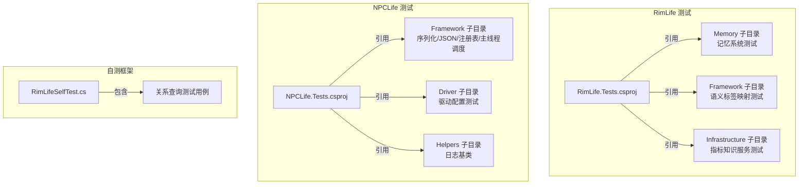
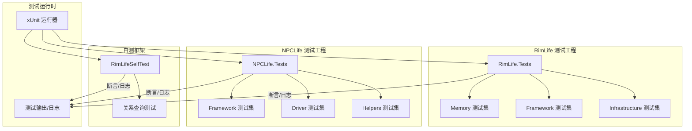
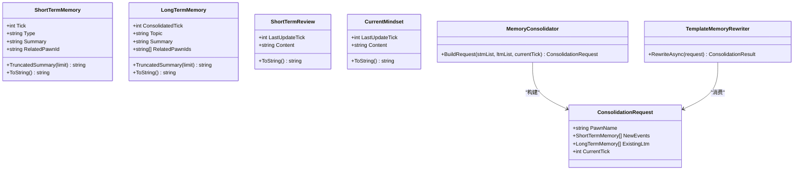
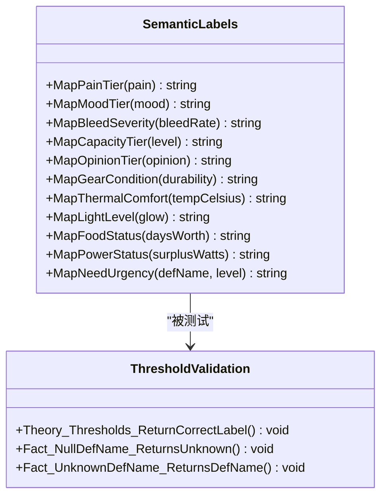
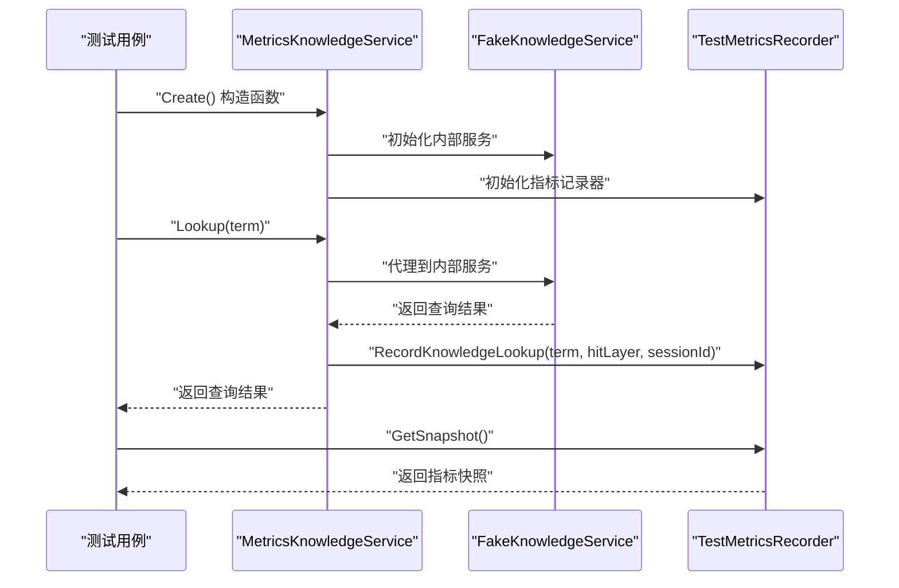
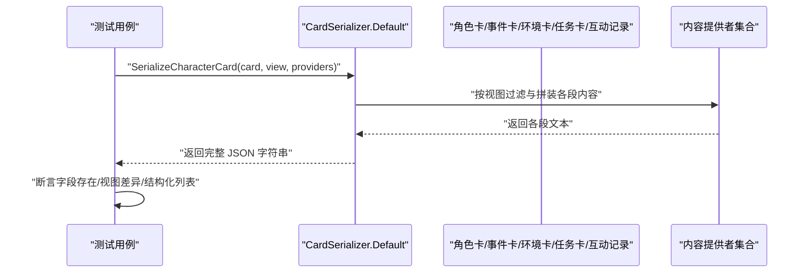
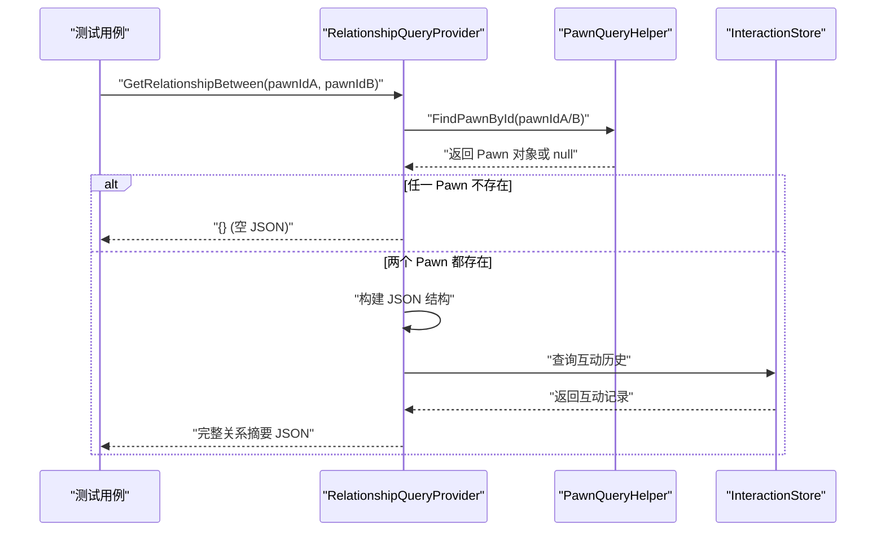
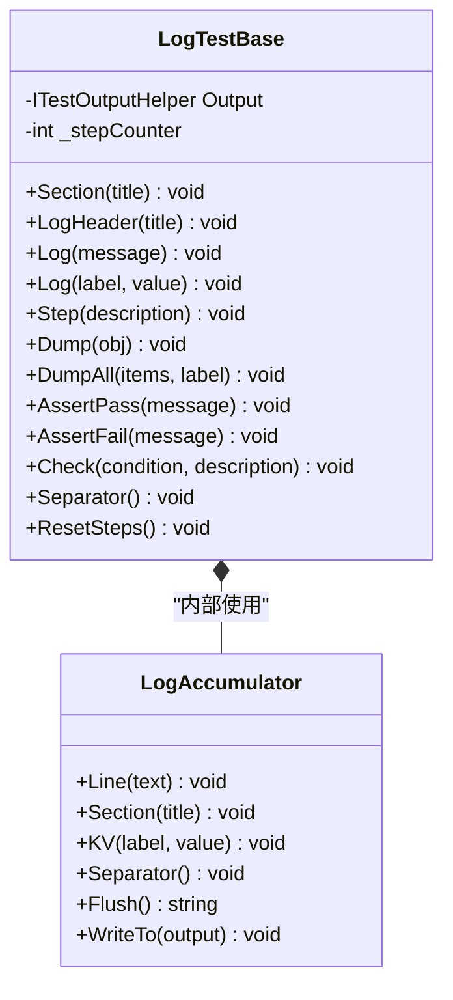
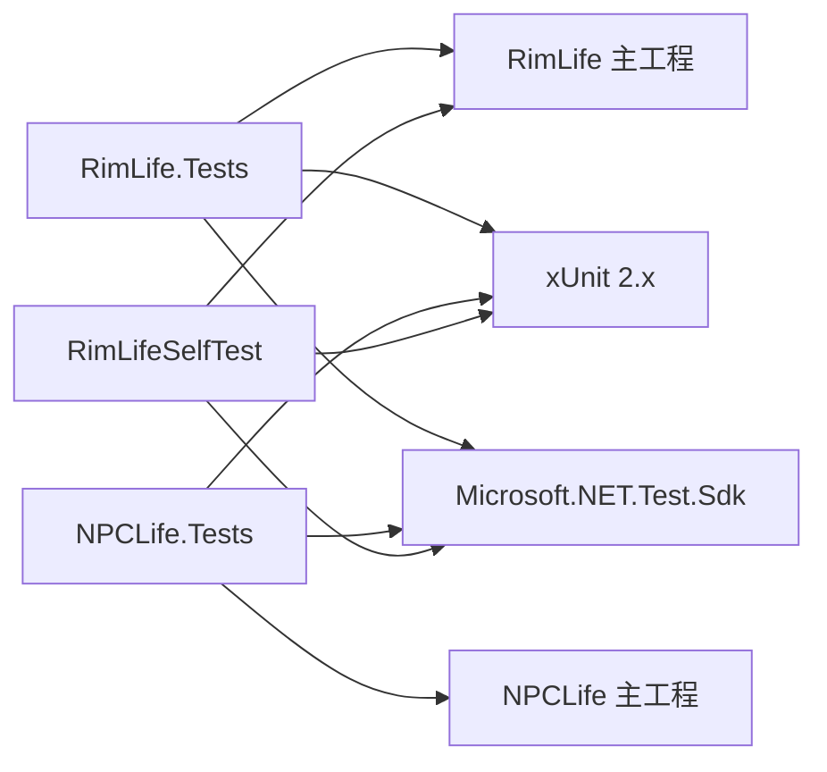

# 测试体系

<cite>
**本文引用的文件**
- [RimLife.Tests.csproj](file://RimLife.Tests/RimLife.Tests.csproj)
- [SemanticLabelsTests.cs](file://RimLife.Tests/Framework/SemanticLabelsTests.cs)
- [MetricsKnowledgeServiceTests.cs](file://RimLife.Tests/Infrastructure/MetricsKnowledgeServiceTests.cs)
- [MemoryConsolidatorTests.cs](file://RimLife.Tests/Memory/MemoryConsolidatorTests.cs)
- [PawnMemoryDataStructureTests.cs](file://RimLife.Tests/Memory/PawnMemoryDataStructureTests.cs)
- [NPCLife.Tests.csproj](file://ext/NPCLife/tests/NPCLife.Tests/NPCLife.Tests.csproj)
- [CardSerializerTests.cs](file://ext/NPCLife/tests/NPCLife.Tests/Framework/CardSerializerTests.cs)
- [DriverConfigTests.cs](file://ext/NPCLife/tests/NPCLife.Tests/Driver/DriverConfigTests.cs)
- [McpSkillRegistryTests.cs](file://ext/NPCLife/tests/NPCLife.Tests/Framework/McpSkillRegistryTests.cs)
- [LogTestBase.cs](file://ext/NPCLife/tests/NPCLife.Tests/Helpers/LogTestBase.cs)
- [RimLifeSelfTest.cs](file://Source/Tool/RimLifeSelfTest.cs)
- [RelationshipQueryProvider.cs](file://Source/Infrastructure/Mcp/RelationshipQueryProvider.cs)
- [SemanticLabels.cs](file://Source/Data/SemanticLabels.cs)
- [MetricsKnowledgeService.cs](file://Source/Infrastructure/Knowledge/MetricsKnowledgeService.cs)
- [GameDefKnowledgeBase.cs](file://Source/Infrastructure/Knowledge/GameDefKnowledgeBase.cs)
</cite>

## 更新摘要
**变更内容**
- 新增语义标签阈值映射测试章节，涵盖疼痛、心情、失血、能力、社交好感度等维度的完整阈值验证
- 新增指标知识服务测试章节，验证指标记录装饰器的正确代理和指标上报功能
- 扩展记忆系统测试，增加异步操作和边界条件测试
- 更新测试工程结构，反映新增的测试模块组织

## 目录
1. [引言](#引言)
2. [项目结构](#项目结构)
3. [核心组件](#核心组件)
4. [架构总览](#架构总览)
5. [详细组件分析](#详细组件分析)
6. [依赖关系分析](#依赖关系分析)
7. [性能考量](#性能考量)
8. [故障排查指南](#故障排查指南)
9. [结论](#结论)
10. [附录](#附录)

## 引言
本文件系统化梳理 RimLife 的测试体系，覆盖单元测试、集成测试与框架测试的组织结构与实现要点。重点围绕记忆系统、工作空间与框架能力、UI 交互支撑以及测试数据与环境配置展开，并给出测试策略、覆盖率与质量标准建议、自动化与持续集成思路、结果分析与问题定位方法，以及最佳实践与调试技巧。文档兼顾初学者可读性与资深开发者所需的技术深度。

**更新** 新增语义标签阈值映射测试和指标知识服务测试两大核心测试模块，完善了测试体系的完整性。

## 项目结构
RimLife 的测试工程采用"按功能域分层"的组织方式：
- RimLife.Tests：核心模块测试，当前聚焦记忆系统（短期/长期记忆、巩固器、回顾与心智模型）和新增的语义标签映射、指标记录功能。
- ext/NPCLife/tests/NPCLife.Tests：扩展模块测试，覆盖框架序列化、驱动配置、MCP 技能注册与工具调用、日志辅助基类等。
- Source/Tool/RimLifeSelfTest.cs：自测框架测试，包含关系查询功能的端到端测试用例。

测试工程统一基于 xUnit 2.x，使用 .NET SDK 测试项目模板，分别引用主工程或扩展工程作为被测目标。

**图表来源**
- [RimLife.Tests.csproj:1-24](file://RimLife.Tests/RimLife.Tests.csproj#L1-L24)
- [NPCLife.Tests.csproj:1-23](file://ext/NPCLife/tests/NPCLife.Tests/NPCLife.Tests.csproj#L1-L23)
- [RimLifeSelfTest.cs:916-935](file://Source/Tool/RimLifeSelfTest.cs#L916-L935)

**章节来源**
- [RimLife.Tests.csproj:1-24](file://RimLife.Tests/RimLife.Tests.csproj#L1-L24)
- [NPCLife.Tests.csproj:1-23](file://ext/NPCLife/tests/NPCLife.Tests/NPCLife.Tests.csproj#L1-L23)
- [RimLifeSelfTest.cs:916-935](file://Source/Tool/RimLifeSelfTest.cs#L916-L935)

## 核心组件
- 记忆系统测试：验证短期/长期记忆数据结构、事件巩固请求构建、模板重写器的异步重写与合并逻辑、回顾生成与心智模型。
- 语义标签映射测试：验证将数值转换为语义标签的阈值映射功能，包括疼痛等级、心情状态、失血严重度、能力等级、社交好感度、装备耐久度、热舒适度、光照等级、食物储备状态、电力状态和需求紧急程度等维度的完整阈值覆盖。
- 指标知识服务测试：验证指标记录装饰器正确代理所有 IKnowledgeService 方法，并在 Lookup 时上报 RuntimeMetrics 指标，包括命中/未命中场景的指标记录验证。
- 框架测试：验证卡片序列化（事件、角色卡、环境卡、任务卡、互动记录、殖民者摘要）的字段完整性与视图差异；验证 MCP 技能注册表的初始化、工具注册、激活状态、工具调用与错误处理；验证驱动配置的默认值与阈值查询。
- 关系查询测试：验证 `get_relationship_between` 端点的 JSON 输出格式验证，包括双向关系摘要、社交关系、牵绊、从属关系、双向好感、兼容度、互动频率等字段的正确性；验证错误处理场景，如无效 Pawn ID、空关系数据等。
- 日志辅助基类：为复杂流程提供结构化日志输出，支持分节、键值对、步骤计数、集合 Dump 与断言式日志。

**更新** 新增语义标签映射测试和指标知识服务测试两大核心组件，显著扩展了测试覆盖范围。

**章节来源**
- [MemoryConsolidatorTests.cs:1-188](file://RimLife.Tests/Memory/MemoryConsolidatorTests.cs#L1-L188)
- [PawnMemoryDataStructureTests.cs:1-192](file://RimLife.Tests/Memory/PawnMemoryDataStructureTests.cs#L1-L192)
- [SemanticLabelsTests.cs:1-222](file://RimLife.Tests/Framework/SemanticLabelsTests.cs#L1-L222)
- [MetricsKnowledgeServiceTests.cs:1-190](file://RimLife.Tests/Infrastructure/MetricsKnowledgeServiceTests.cs#L1-L190)
- [CardSerializerTests.cs:1-449](file://ext/NPCLife/tests/NPCLife.Tests/Framework/CardSerializerTests.cs#L1-L449)
- [DriverConfigTests.cs:1-57](file://ext/NPCLife/tests/NPCLife.Tests/Driver/DriverConfigTests.cs#L1-L57)
- [McpSkillRegistryTests.cs:1-296](file://ext/NPCLife/tests/NPCLife.Tests/Framework/McpSkillRegistryTests.cs#L1-L296)
- [LogTestBase.cs:1-154](file://ext/NPCLife/tests/NPCLife.Tests/Helpers/LogTestBase.cs#L1-L154)
- [RimLifeSelfTest.cs:916-935](file://Source/Tool/RimLifeSelfTest.cs#L916-L935)

## 架构总览
测试架构以"测试工程 + 被测工程"为核心，通过 xUnit 提供断言与生命周期管理，利用项目引用实现跨模块测试耦合最小化。NPCLife 的测试进一步细分为 Framework、Driver、Cards、Helpers 等子目录，形成清晰的职责边界。自测框架提供端到端的功能验证，确保关系查询功能的完整性和稳定性。新增的语义标签和指标测试模块为核心业务逻辑提供了精确的阈值验证和监控能力。

**图表来源**
- [RimLife.Tests.csproj:1-24](file://RimLife.Tests/RimLife.Tests.csproj#L1-L24)
- [NPCLife.Tests.csproj:1-23](file://ext/NPCLife/tests/NPCLife.Tests/NPCLife.Tests.csproj#L1-L23)
- [RimLifeSelfTest.cs:916-935](file://Source/Tool/RimLifeSelfTest.cs#L916-L935)

## 详细组件分析

### 记忆系统测试（短期/长期记忆、巩固器）
- 数据结构测试覆盖：
  - ShortTermMemory 默认构造、属性设置、摘要截断、ToString 关键信息校验、空类型归一化。
  - LongTermMemory 默认构造、摘要截断、相关角色列表初始化。
  - ShortTermReview、CurrentMindset 的构造与字符串表示。
- 巩固器测试覆盖：
  - BuildRequest 对空/空列表输入返回空的边界条件。
  - BuildRequest 对有效输入的字段校验（名称、事件数、现有 LTM、时间戳）。
  - TemplateMemoryRewriter 的异步重写：单条事件生成一条 LTM；同类同角色合并；不同类别产生多条 LTM；与既有 LTM 合并；生成 Review 内容与时间戳。

**图表来源**
- [MemoryConsolidatorTests.cs:14-73](file://RimLife.Tests/Memory/MemoryConsolidatorTests.cs#L14-L73)
- [PawnMemoryDataStructureTests.cs:17-127](file://RimLife.Tests/Memory/PawnMemoryDataStructureTests.cs#L17-L127)

**章节来源**
- [MemoryConsolidatorTests.cs:1-188](file://RimLife.Tests/Memory/MemoryConsolidatorTests.cs#L1-L188)
- [PawnMemoryDataStructureTests.cs:1-192](file://RimLife.Tests/Memory/PawnMemoryDataStructureTests.cs#L1-L192)

### 语义标签映射测试（阈值验证）
- 阈值映射测试覆盖：
  - 疼痛等级标签：从无痛到休克的完整阈值范围验证。
  - 心情状态标签：从绝望到繁荣的连续阈值验证。
  - 失血严重度标签：从无失血到致命的渐进阈值验证。
  - 能力等级标签：从禁用到卓越的完整能力评估。
  - 社交好感度标签：从敌对到痴迷的社交关系阈值。
  - 装备耐久度标签：从破损到完美的装备状态评估。
  - 环境舒适度标签：从致命寒冷到致命炎热的温度舒适度。
  - 光照等级标签：从漆黑到明亮的光照条件评估。
  - 食物储备状态：从饥饿到充足的生存资源评估。
  - 电力状态：从停电到稳定的能源供应评估。
  - 需求紧急程度：针对特定需求类型的定制阈值映射。
- 边界条件测试：
  - 空值处理：对 null 输入的默认返回值验证。
  - 未知需求：对未识别需求定义名的回退处理。
  - 极端数值：对阈值边界值的精确判断验证。

**图表来源**
- [SemanticLabelsTests.cs:16-219](file://RimLife.Tests/Framework/SemanticLabelsTests.cs#L16-L219)
- [SemanticLabels.cs:16-190](file://Source/Data/SemanticLabels.cs#L16-L190)

**章节来源**
- [SemanticLabelsTests.cs:1-222](file://RimLife.Tests/Framework/SemanticLabelsTests.cs#L1-L222)
- [SemanticLabels.cs:1-193](file://Source/Data/SemanticLabels.cs#L1-L193)

### 指标知识服务测试（指标记录验证）
- 装饰器功能测试：
  - 构造函数验证：对空内部服务的异常处理。
  - Lookup 代理：验证所有 IKnowledgeService 方法的正确代理。
  - 指标记录：在 Lookup 时正确上报 RuntimeMetrics 指标。
- 指标记录验证：
  - 命中场景：对存在的术语查询记录命中指标。
  - 未命中场景：对不存在的术语查询记录未命中指标。
  - 会话管理：正确处理 RuntimeMetrics 会话的开始和结束。
  - 指标聚合：验证指标快照的正确生成和查询。
- 代理行为测试：
  - Store/Delete/List：验证所有代理方法的正确转发。
  - 参数传递：确保参数和返回值的完整传递。
  - 异常传播：验证异常的正确传播机制。

**图表来源**
- [MetricsKnowledgeServiceTests.cs:20-89](file://RimLife.Tests/Infrastructure/MetricsKnowledgeServiceTests.cs#L20-L89)
- [MetricsKnowledgeService.cs:26-33](file://Source/Infrastructure/Knowledge/MetricsKnowledgeService.cs#L26-L33)

**章节来源**
- [MetricsKnowledgeServiceTests.cs:1-190](file://RimLife.Tests/Infrastructure/MetricsKnowledgeServiceTests.cs#L1-L190)
- [MetricsKnowledgeService.cs:1-41](file://Source/Infrastructure/Knowledge/MetricsKnowledgeService.cs#L1-L41)

### 框架测试（卡片序列化、MCP 技能注册表、驱动配置）
- 卡片序列化测试：
  - 事件卡：基础字段、标签、演员、载荷等序列化校验；空列表与数组格式。
  - 殖民地上下文：季节、人口、食物、电力、平均士气、难度、派系关系等字段存在性。
  - 角色卡：静态/动态/全量视图差异、视角与记忆片段注入、全量视图中结构化列表与语义化文本。
  - 任务卡：标题、描述、状态、步骤列表。
  - 环境卡：户外/室内差异、天气字段存在性。
  - 互动记录：发起者、接受者、互动定义、结果。
  - 殖民者摘要列表。
- MCP 技能注册表测试：
  - 初始化默认技能数量；获取技能 ID 列表；从类型注册工具；激活技能后工具 JSON 包含预期工具名；未知技能返回空；工具调用命中范围与系统工具回退；错误构造与激活/停用结果构造；与工具生成器集成。
- 驱动配置测试：
  - 默认配置阈值与容量；按角色查询有效阈值与计数阈值。

**图表来源**
- [CardSerializerTests.cs:128-255](file://ext/NPCLife/tests/NPCLife.Tests/Framework/CardSerializerTests.cs#L128-L255)

**章节来源**
- [CardSerializerTests.cs:1-449](file://ext/NPCLife/tests/NPCLife.Tests/Framework/CardSerializerTests.cs#L1-L449)
- [McpSkillRegistryTests.cs:1-296](file://ext/NPCLife/tests/NPCLife.Tests/Framework/McpSkillRegistryTests.cs#L1-L296)
- [DriverConfigTests.cs:1-57](file://ext/NPCLife/tests/NPCLife.Tests/Driver/DriverConfigTests.cs#L1-L57)

### 关系查询测试（get_relationship_between 端点）
- JSON 输出格式验证：
  - 双向身份标识：包含角色 A 和 B 的身份信息（ID、姓名）。
  - 社交关系：直接社交关系类型列表和互惠关系标记。
  - 牵绊关系：双向牵绊检测，标记 `bonded` 字段。
  - 从属关系：机械体监管者和下属关系检测。
  - 双向好感：`ab` 和 `ba` 字段，使用语义化等级（Great、Good、Average、Poor、Incompatible）。
  - 兼容度：语义化兼容度等级映射。
  - 互动频率：`interactions` 字段，使用频率等级（none、rare、occasional、frequent）。
  - 近期互动：`recent` 字段，包含最近互动记录摘要。
- 错误处理场景测试：
  - 无效 Pawn ID：当传入不存在的角色 ID 时，返回空 JSON 对象 `{}`。
  - 空关系数据：当角色关系数据为空时的处理。
  - 异常捕获：方法内部异常的捕获和降级处理。
  - 边界条件：空列表、null 值、极端数值的处理。

**图表来源**
- [RelationshipQueryProvider.cs:238-343](file://Source/Infrastructure/Mcp/RelationshipQueryProvider.cs#L238-L343)
- [RimLifeSelfTest.cs:916-935](file://Source/Tool/RimLifeSelfTest.cs#L916-L935)

**章节来源**
- [RelationshipQueryProvider.cs:176-365](file://Source/Infrastructure/Mcp/RelationshipQueryProvider.cs#L176-L365)
- [RimLifeSelfTest.cs:916-935](file://Source/Tool/RimLifeSelfTest.cs#L916-L935)

### 日志辅助基类（结构化日志与断言式日志）
- 提供分节标题、醒目标题、键值对日志、步骤计数、对象 Dump、集合 Dump、断言式日志（通过/失败）、分隔线、日志累积器等能力，便于复杂流程的可读性输出与问题定位。

**图表来源**
- [LogTestBase.cs:18-151](file://ext/NPCLife/tests/NPCLife.Tests/Helpers/LogTestBase.cs#L18-L151)

**章节来源**
- [LogTestBase.cs:1-154](file://ext/NPCLife/tests/NPCLife.Tests/Helpers/LogTestBase.cs#L1-L154)

## 依赖关系分析
- 测试工程依赖：
  - RimLife.Tests 依赖 RimLife 主工程，确保对内存、语义标签、指标服务等核心逻辑的直接测试。
  - NPCLife.Tests 依赖 NPCLife 主工程，确保对框架、驱动、MCP 等能力的独立测试。
  - 自测框架依赖主工程的所有核心组件，提供端到端的功能验证。
- 断言与运行器：
  - 统一使用 xUnit 2.x 与 Microsoft.NET.Test.Sdk，VS 运行器支持良好。
- 测试隔离与耦合：
  - 通过 Mock/Stub（如序列化测试中的内容提供者）降低外部依赖耦合。
  - 使用纯函数接口（如 MCP 注册表、语义标签映射）保证测试可重复性与确定性。
  - 关系查询测试通过自测框架的集成测试确保端到端功能正确性。
  - 指标知识服务测试使用专门的测试指标记录器，隔离外部依赖。

**图表来源**
- [RimLife.Tests.csproj:19-21](file://RimLife.Tests/RimLife.Tests.csproj#L19-L21)
- [NPCLife.Tests.csproj:18-20](file://ext/NPCLife/tests/NPCLife.Tests/NPCLife.Tests.csproj#L18-L20)
- [RimLifeSelfTest.cs:916-935](file://Source/Tool/RimLifeSelfTest.cs#L916-L935)

**章节来源**
- [RimLife.Tests.csproj:1-24](file://RimLife.Tests/RimLife.Tests.csproj#L1-L24)
- [NPCLife.Tests.csproj:1-23](file://ext/NPCLife/tests/NPCLife.Tests/NPCLife.Tests.csproj#L1-L23)
- [RimLifeSelfTest.cs:916-935](file://Source/Tool/RimLifeSelfTest.cs#L916-L935)

## 性能考量
- 测试执行性能：
  - 使用异步测试（如 TemplateMemoryRewriter 的 RewriteAsync）避免阻塞，提升吞吐。
  - 通过纯函数与轻量 Mock 减少 IO 与外部依赖，缩短测试时长。
  - 关系查询测试使用自测框架的集成测试，避免复杂的模拟设置。
  - 语义标签测试使用 Theory 参数化测试，提高阈值验证效率。
  - 指标知识服务测试使用专门的测试指标记录器，避免真实指标收集开销。
- 覆盖率与质量：
  - 建议对关键路径（事件分类、主题合并、视图差异、工具调用命中/回退）达到高覆盖率。
  - 对边界条件（空列表、空输入、阈值边界、未知技能、无效 Pawn ID）进行专项覆盖。
  - 关系查询测试重点关注 JSON 输出格式的完整性和错误处理的健壮性。
  - 语义标签测试要求所有阈值边界值的精确验证，覆盖率应达到 100%。
  - 指标知识服务测试验证指标记录的准确性和会话管理的正确性。
- 资源与并发：
  - 控制并发度，避免对共享资源（如全局注册表、RuntimeMetrics）造成竞态。
  - 对涉及 UI 或主线程调度的场景，优先使用主线程调度器测试封装。
  - 关系查询测试依赖游戏地图中的实际 Pawn 实例，需要适当的测试环境准备。
  - 指标测试使用内存中的测试记录器，避免并发冲突。

**更新** 新增语义标签和指标测试的性能考量，包括阈值验证效率和指标记录的资源消耗控制。

## 故障排查指南
- 断言失败定位：
  - 使用 LogTestBase 的结构化日志输出，逐步打印中间状态与关键字段，缩小问题范围。
  - 对序列化测试，先断言顶层字段存在性，再逐段细化。
  - 关系查询测试中，检查 JSON 输出的字段完整性，特别是 `ab`、`ba`、`relation` 等关键字段。
  - 语义标签测试中，验证阈值边界值的精确判断，检查理论参数与期望结果的对应关系。
  - 指标知识服务测试中，确认指标记录器的正确初始化和会话管理。
- 工具调用失败：
  - 检查激活技能集合是否包含目标工具所在技能；确认参数 JSON 结构正确；必要时回退至系统工具。
- 阈值与配置问题：
  - 核对语义标签的阈值映射是否符合预期；对边界值（如 0、负数、极大值）进行回归测试。
  - 核对默认配置与角色阈值映射；对边界值（如 0、负数、极大值）进行回归测试。
- 回归与对比：
  - 对视图差异（static/dynamic/full）分别建立基准快照，变更时进行对比。
  - 对语义标签映射，建立阈值边界值的回归测试套件。
  - 对指标记录，建立指标快照的回归测试。
- 关系查询特有问题：
  - 检查 Pawn ID 是否有效且存在于当前地图中。
  - 验证 JSON 输出格式是否符合预期，特别是语义化字段的映射关系。
  - 确认错误处理场景的降级行为是否正确（返回空 JSON 对象）。

**更新** 新增语义标签和指标测试的故障排查指南，包括阈值映射验证和指标记录问题的定位方法。

**章节来源**
- [LogTestBase.cs:28-116](file://ext/NPCLife/tests/NPCLife.Tests/Helpers/LogTestBase.cs#L28-L116)
- [CardSerializerTests.cs:128-255](file://ext/NPCLife/tests/NPCLife.Tests/Framework/CardSerializerTests.cs#L128-L255)
- [McpSkillRegistryTests.cs:207-244](file://ext/NPCLife/tests/NPCLife.Tests/Framework/McpSkillRegistryTests.cs#L207-L244)
- [DriverConfigTests.cs:12-54](file://ext/NPCLife/tests/NPCLife.Tests/Driver/DriverConfigTests.cs#L12-L54)
- [SemanticLabelsTests.cs:16-219](file://RimLife.Tests/Framework/SemanticLabelsTests.cs#L16-L219)
- [MetricsKnowledgeServiceTests.cs:26-89](file://RimLife.Tests/Infrastructure/MetricsKnowledgeServiceTests.cs#L26-L89)
- [RimLifeSelfTest.cs:916-935](file://Source/Tool/RimLifeSelfTest.cs#L916-L935)

## 结论
RimLife 的测试体系以清晰的工程划分与严格的断言设计为基础，既覆盖了核心记忆系统的数据结构与流程，也扩展到框架序列化、MCP 工具链、驱动配置等关键能力。**更新** 新增的语义标签映射测试和指标知识服务测试进一步完善了测试体系，通过精确的阈值验证和指标记录功能确保了核心业务逻辑的准确性与可观测性。这些新增测试模块不仅提高了代码质量，还为系统的监控和调试提供了重要支撑。通过结构化日志与纯函数测试，提升了可维护性与可诊断性。建议在 CI 中引入覆盖率报告与自动化执行，持续完善边界与回归用例，特别是语义标签阈值映射和指标记录功能的测试覆盖。

## 附录

### 测试策略与质量标准
- 策略
  - 单元测试：覆盖核心算法与纯函数，强调快速反馈与高内聚。
  - 集成测试：面向序列化、注册表、主线程调度等跨组件交互。
  - 框架测试：面向 DTO 与视图差异，确保对外协议稳定。
  - **更新** 语义标签测试：面向阈值映射的精确验证，确保数值到语义标签转换的准确性。
  - **更新** 指标知识服务测试：面向装饰器模式的正确代理和指标上报，确保监控功能的可靠性。
  - **更新** 关系查询测试：面向端到端功能验证，确保 JSON 输出格式的正确性和错误处理的健壮性。
- 质量标准
  - 关键路径覆盖率不低于 80%，边界与异常路径不低于 90%。
  - **更新** 语义标签测试：阈值边界值验证覆盖率 100%，包括所有边界条件和特殊值。
  - **更新** 指标知识服务测试：指标记录准确率 100%，会话管理正确性 100%。
  - **更新** 关系查询测试：JSON 输出字段完整率达到 100%，错误处理场景覆盖率达到 100%。
  - 测试命名明确意图，断言信息可读，失败信息可定位。

**更新** 新增语义标签和指标测试的质量标准，包括阈值验证和指标记录的覆盖率要求。

### 测试数据准备与环境配置
- 测试数据
  - 使用构造函数与字典/列表初始化典型场景；对边界场景（空、极值、缺失字段）单独构造。
  - **更新** 语义标签测试：准备涵盖所有阈值边界的测试数据集，包括负值、零值、极大值和边界值。
  - **更新** 指标知识服务测试：准备包含命中和未命中场景的测试数据，确保指标记录的完整性。
  - **更新** 关系查询测试：准备有效的 Pawn ID 和当前地图中的角色实例，确保测试环境的可用性。
- 环境配置
  - 使用 xUnit 的 TestOutputHelper 输出日志；在复杂流程中启用 LogTestBase 的累积器模式。
  - 对异步流程使用 Task.Delay 或轻量等待，避免真实延迟影响。
  - **更新** 语义标签测试：由于是纯函数测试，不需要特殊环境配置。
  - **更新** 指标知识服务测试：使用专门的测试指标记录器，避免真实 RuntimeMetrics 的干扰。
  - **更新** 关系查询测试：确保游戏地图中有足够的角色实例，以便验证 `get_relationship_between` 功能。

**更新** 新增语义标签和指标测试的数据准备和环境配置要求。

### 测试执行流程与自动化
- 执行流程
  - 在 VS 中直接运行；或使用 dotnet test 命令行；结合 --logger console 与 --verbosity detailed 获取详细输出。
  - **更新** 语义标签测试：通过 Theory 参数化测试自动验证所有阈值边界。
  - **更新** 指标知识服务测试：使用测试指标记录器进行隔离测试，避免真实指标收集。
  - **更新** 关系查询测试：通过自测框架的 `RimLifeSelfTest` 类执行，包含完整的端到端测试流程。
- 自动化与持续集成
  - 建议在 CI 中分别执行 RimLife.Tests 与 NPCLife.Tests，分别生成测试结果与覆盖率报告。
  - **更新** 语义标签测试：在 CI 中包含阈值映射测试，确保数值转换的准确性。
  - **更新** 指标知识服务测试：在 CI 中包含指标记录测试，验证监控功能的可靠性。
  - **更新** 关系查询测试：在 CI 中包含自测框架的执行，确保关系查询功能的持续验证。
  - 对关键分支（PR/MR）强制通过所有测试，对主干推送触发全量回归，包括新增的语义标签和指标测试功能。

**更新** 新增语义标签和指标测试的自动化执行流程和 CI 配置建议。

### 测试结果分析与问题定位
- 结果分析
  - 使用测试运行器查看通过/失败统计；结合日志定位失败点。
  - 对序列化测试，对比期望与实际 JSON 片段，定位字段遗漏或格式错误。
  - **更新** 语义标签测试：分析阈值边界值的判断逻辑，检查理论参数与期望结果的对应关系。
  - **更新** 指标知识服务测试：分析指标记录的准确性，检查命中/未命中场景的处理。
  - **更新** 关系查询测试：分析 JSON 输出的字段完整性，检查语义化映射的正确性。
- 问题定位
  - 从最外层断言入手，逐步深入到内部方法；对异步流程增加超时与重试策略；对注册表类问题，先验证激活集合再验证工具定义。
  - **更新** 语义标签测试：检查阈值函数的边界条件处理，验证理论参数的正确性。
  - **更新** 指标知识服务测试：检查装饰器的代理逻辑和指标记录器的初始化。
  - **更新** 关系查询测试：检查 Pawn ID 的有效性、JSON 输出格式的正确性、错误处理的降级行为。

**更新** 新增语义标签和指标测试的结果分析和问题定位方法。

### 最佳实践与调试技巧
- 最佳实践
  - 保持测试用例单一职责；使用 Fact/Theory 明确测试意图；对异步方法使用 Async/Await。
  - 对复杂流程使用 LogTestBase 的分节与步骤计数，便于复盘。
  - **更新** 语义标签测试：使用 Theory 参数化测试覆盖所有阈值边界，提高测试效率。
  - **更新** 指标知识服务测试：使用专门的测试指标记录器，确保测试的隔离性和可重复性。
  - **更新** 关系查询测试：使用自测框架的结构化日志输出，便于端到端功能验证。
- 调试技巧
  - 在断言失败处插入临时日志；对集合使用 DumpAll 输出索引与元素；对 JSON 使用分段断言，缩小范围。
  - **更新** 语义标签测试：利用 Theory 的参数化特性，快速定位阈值边界问题。
  - **更新** 指标知识服务测试：检查指标记录器的状态和会话管理，确保指标上报的正确性。
  - **更新** 关系查询测试：利用自测框架的预览功能查看 JSON 输出的前缀内容，快速定位问题。

**更新** 新增语义标签和指标测试的最佳实践和调试技巧。