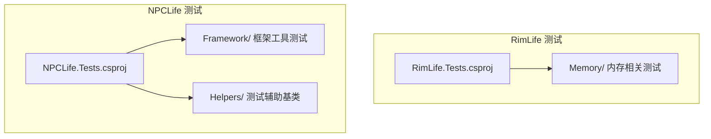
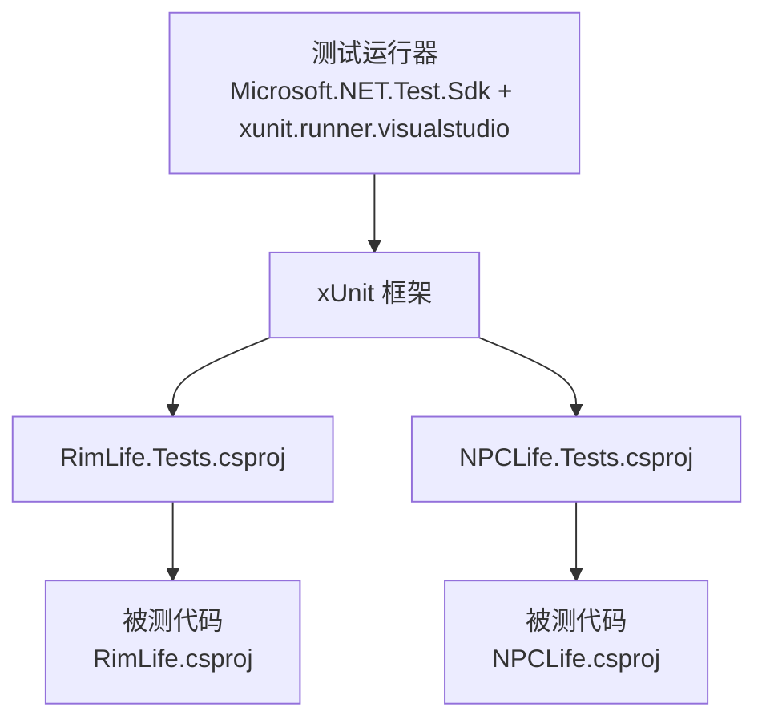
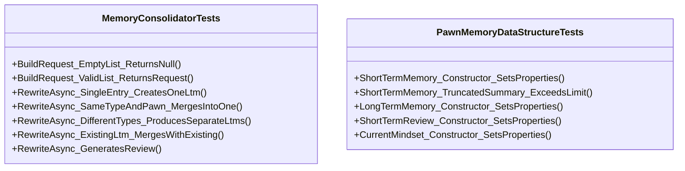
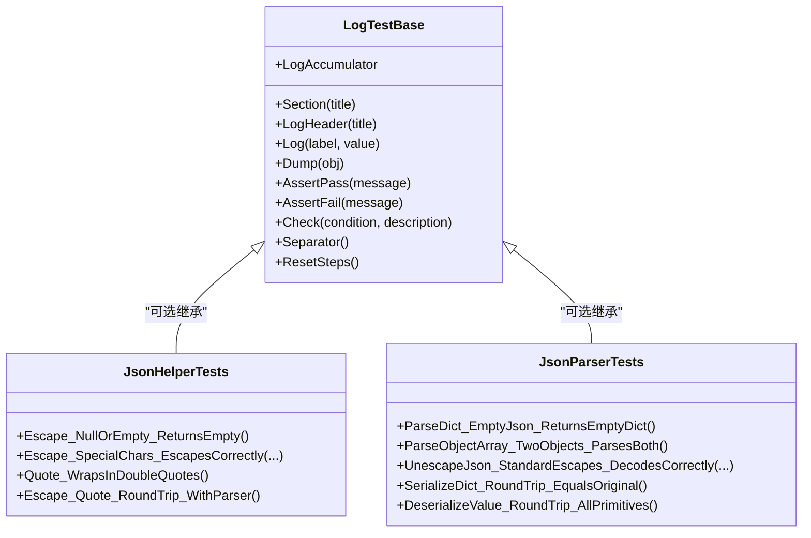
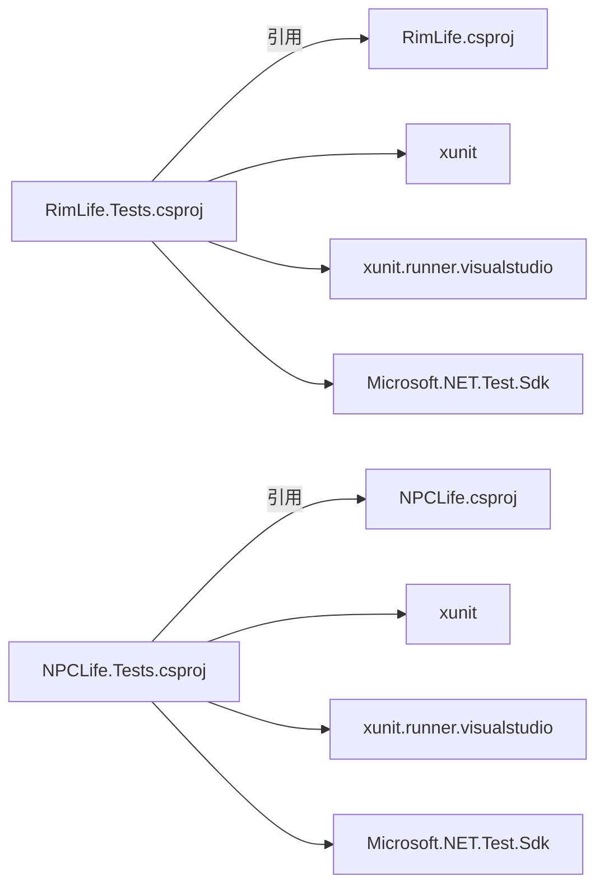

# 测试配置与工具

<cite>
**本文引用的文件**
- [RimLife.Tests.csproj](file://RimLife.Tests/RimLife.Tests.csproj)
- [NPCLife.Tests.csproj](file://ext/NPCLife/tests/NPCLife.Tests/NPCLife.Tests.csproj)
- [MemoryConsolidatorTests.cs](file://RimLife.Tests/Memory/MemoryConsolidatorTests.cs)
- [PawnMemoryDataStructureTests.cs](file://RimLife.Tests/Memory/PawnMemoryDataStructureTests.cs)
- [JsonHelperTests.cs](file://ext/NPCLife/tests/NPCLife.Tests/Framework/JsonHelperTests.cs)
- [JsonParserTests.cs](file://ext/NPCLife/tests/NPCLife.Tests/Framework/JsonParserTests.cs)
- [LogTestBase.cs](file://ext/NPCLife/tests/NPCLife.Tests/Helpers/LggTestBase.cs)
- [dotnet-tools.json](file://dotnet-tools.json)
- [nuget.config](file://nuget.config)
</cite>

## 目录
1. [引言](#引言)
2. [项目结构](#项目结构)
3. [核心组件](#核心组件)
4. [架构总览](#架构总览)
5. [详细组件分析](#详细组件分析)
6. [依赖分析](#依赖分析)
7. [性能考虑](#性能考虑)
8. [故障排除指南](#故障排除指南)
9. [结论](#结论)
10. [附录](#附录)

## 引言
本文件面向 RimLife 及其扩展模块 NPCLife 的测试配置与工具链，系统性阐述测试项目的 .csproj 配置、NuGet 包引用、测试框架选择与运行机制，并结合实际测试文件给出可操作的最佳实践。内容兼顾初学者易懂与资深开发者所需的技术深度，涵盖测试项目构建、并行执行策略、测试发现机制、覆盖率收集与报告生成、工具链安装与配置、项目结构建议与命名约定等。

## 项目结构
RimLife 仓库包含两个独立的测试项目：
- RimLife.Tests：针对主项目的内存与数据结构相关测试
- NPCLife.Tests：针对扩展模块 NPCLife 的框架与工具类测试

两者均采用 .NET Framework 目标框架，使用 xUnit 作为测试框架，并通过 Microsoft.NET.Test.Sdk 提供测试运行能力。

图表来源
- [RimLife.Tests.csproj:1-24](file://RimLife.Tests/RimLife.Tests.csproj#L1-L24)
- [NPCLife.Tests.csproj:1-23](file://ext/NPCLife/tests/NPCLife.Tests/NPCLife.Tests.csproj#L1-L23)

章节来源
- [RimLife.Tests.csproj:1-24](file://RimLife.Tests/RimLife.Tests.csproj#L1-L24)
- [NPCLife.Tests.csproj:1-23](file://ext/NPCLife/tests/NPCLife.Tests/NPCLife.Tests.csproj#L1-L23)

## 核心组件
- 测试 SDK 与框架
  - Microsoft.NET.Test.Sdk：提供测试运行器与 MSBuild 集成
  - xUnit：单元测试框架，提供 Fact/Theory 等特性
  - xunit.runner.visualstudio：VS 中的 xUnit 运行器
- 目标框架与平台
  - RimLife.Tests：net48 + x64
  - NPCLife.Tests：net48 + AnyCPU
- 项目引用
  - RimLife.Tests 引用主项目 RimLife.csproj
  - NPCLife.Tests 引用扩展模块 NPCLife.csproj

章节来源
- [RimLife.Tests.csproj:3-11](file://RimLife.Tests/RimLife.Tests.csproj#L3-L11)
- [RimLife.Tests.csproj:13-21](file://RimLife.Tests/RimLife.Tests.csproj#L13-L21)
- [NPCLife.Tests.csproj:3-10](file://ext/NPCLife/tests/NPCLife.Tests/NPCLife.Tests.csproj#L3-L10)
- [NPCLife.Tests.csproj:12-20](file://ext/NPCLife/tests/NPCLife.Tests/NPCLife.Tests.csproj#L12-L20)

## 架构总览
测试项目围绕“被测代码 + 测试代码 + 测试运行器”的三层结构组织。测试运行器通过 Test SDK 发现并执行测试；测试代码依赖 xUnit 断言与特性；被测代码来自主项目或扩展模块。

图表来源
- [RimLife.Tests.csproj:13-21](file://RimLife.Tests/RimLife.Tests.csproj#L13-L21)
- [NPCLife.Tests.csproj:12-20](file://ext/NPCLife/tests/NPCLife.Tests/NPCLife.Tests.csproj#L12-L20)

## 详细组件分析

### RimLife.Tests：内存与数据结构测试
- 组织方式
  - Memory/ 下包含与记忆巩固、数据结构相关的测试类
  - 测试覆盖短期记忆、长期记忆、短期回顾与当前心态的数据结构行为
- 典型测试模式
  - 使用 [Fact] 进行确定性断言
  - 使用 [Theory]/[InlineData] 进行参数化测试
  - 使用异步方法验证异步路径（如 RewriteAsync）
- 关键测试要点
  - 输入边界与空值处理（如空列表、null 列表）
  - 数据截断与字符串长度限制
  - 类型与主题合并规则（同类型+同角色合并为一条 LTM）
  - 回顾生成与时间戳一致性

图表来源
- [MemoryConsolidatorTests.cs:14-185](file://RimLife.Tests/Memory/MemoryConsolidatorTests.cs#L14-L185)
- [PawnMemoryDataStructureTests.cs:17-189](file://RimLife.Tests/Memory/PawnMemoryDataStructureTests.cs#L17-L189)

章节来源
- [MemoryConsolidatorTests.cs:1-188](file://RimLife.Tests/Memory/MemoryConsolidatorTests.cs#L1-L188)
- [PawnMemoryDataStructureTests.cs:1-192](file://RimLife.Tests/Memory/PawnMemoryDataStructureTests.cs#L1-L192)

### NPCLife.Tests：框架工具测试与测试基类
- 组织方式
  - Framework/ 下包含 JSON 辅助与解析工具的纯逻辑测试
  - Helpers/ 下提供测试基类，便于复杂流程的日志输出与结构化断言
- 典型测试模式
  - 使用 [Fact] 与 [Theory] 覆盖转义、引号包裹、解析与序列化等场景
  - 使用 ITestOutputHelper 输出结构化日志，便于调试与审查
- 关键测试要点
  - 特殊字符转义与 Unicode 处理
  - 嵌套对象/数组的原始 JSON 保留策略
  - 解析与序列化的往返一致性
  - 错误输入与默认值处理

图表来源
- [LogTestBase.cs:18-151](file://ext/NPCLife/tests/NPCLife.Tests/Helpers/LggTestBase.cs#L18-L151)
- [JsonHelperTests.cs:12-89](file://ext/NPCLife/tests/NPCLife.Tests/Framework/JsonHelperTests.cs#L12-L89)
- [JsonParserTests.cs:17-265](file://ext/NPCLife/tests/NPCLife.Tests/Framework/JsonParserTests.cs#L17-L265)

章节来源
- [JsonHelperTests.cs:1-92](file://ext/NPCLife/tests/NPCLife.Tests/Framework/JsonHelperTests.cs#L1-L92)
- [JsonParserTests.cs:1-268](file://ext/NPCLife/tests/NPCLife.Tests/Framework/JsonParserTests.cs#L1-L268)
- [LogTestBase.cs:1-154](file://ext/NPCLife/tests/NPCLife.Tests/Helpers/LggTestBase.cs#L1-L154)

### 测试运行与并行策略
- 测试发现机制
  - 通过 Microsoft.NET.Test.Sdk 与 xUnit runner 在编译后自动发现测试
  - 命名空间与类名遵循测试项目根命名空间约定，确保统一发现
- 并行执行策略
  - xUnit 默认允许测试方法并行执行，但同一测试类实例内的测试按顺序执行
  - 若存在共享状态，建议使用测试分类或隔离策略避免竞态
- 平台与目标框架
  - net48 保证与 RimWorld 环境兼容
  - 平台目标 x64 与 AnyCPU 分别满足不同部署需求

章节来源
- [RimLife.Tests.csproj:3-11](file://RimLife.Tests/RimLife.Tests.csproj#L3-L11)
- [NPCLife.Tests.csproj:3-10](file://ext/NPCLife/tests/NPCLife.Tests/NPCLife.Tests.csproj#L3-L10)

### 测试覆盖率收集与报告生成
- 收集方式
  - 使用 Coverlet 或其它 .NET 覆盖率工具在 CI 中集成
  - 通过 dotnet test --collect:"XPlat Code Coverage" 生成覆盖率文件
- 报告生成
  - 使用 ReportGenerator 将覆盖率文件转换为 HTML 报告
  - 在 CI 中上传覆盖率报告并与 PR 结合
- 最佳实践
  - 为关键业务路径编写高覆盖率测试
  - 对异步与边界条件进行重点覆盖
  - 将覆盖率阈值纳入 CI 策略

[本节为通用指导，无需特定文件引用]

## 依赖分析
- NuGet 包依赖
  - xunit：测试框架
  - xunit.runner.visualstudio：VS 运行器
  - Microsoft.NET.Test.Sdk：测试运行与 MSBuild 集成
- 项目引用
  - RimLife.Tests → RimLife.csproj
  - NPCLife.Tests → NPCLife.csproj
- 外部依赖
  - .NET Framework 4.8
  - Visual Studio 测试工具（可选）

图表来源
- [RimLife.Tests.csproj:13-21](file://RimLife.Tests/RimLife.Tests.csproj#L13-L21)
- [NPCLife.Tests.csproj:12-20](file://ext/NPCLife/tests/NPCLife.Tests/NPCLife.Tests.csproj#L12-L20)

章节来源
- [RimLife.Tests.csproj:13-21](file://RimLife.Tests/RimLife.Tests.csproj#L13-L21)
- [NPCLife.Tests.csproj:12-20](file://ext/NPCLife/tests/NPCLife.Tests/NPCLife.Tests.csproj#L12-L20)

## 性能考虑
- 测试执行性能
  - 合理拆分测试类，避免单个类中测试数量过大导致加载与执行时间过长
  - 对异步测试使用合理的超时与并发控制
- 资源占用
  - 避免在测试中创建大量临时对象或长时间运行的进程
  - 使用轻量级模拟或内存存储替代真实外部资源
- 并行与隔离
  - 避免跨测试类共享可变状态
  - 对需要共享状态的场景使用工厂或隔离容器

[本节为通用指导，无需特定文件引用]

## 故障排除指南
- 测试无法发现
  - 确认项目文件包含 Microsoft.NET.Test.Sdk 与 xunit 包引用
  - 确认测试类与方法符合 xUnit 命名与签名要求
- 平台不匹配
  - net48 与 x64/AnyCPU 需与目标运行环境一致
- VS 中运行异常
  - 安装 xunit.runner.visualstudio 并重启 VS
- 日志输出
  - 使用 ITestOutputHelper 输出结构化日志，便于定位问题
  - 复杂流程可参考 LogTestBase 的日志辅助能力

章节来源
- [RimLife.Tests.csproj:13-17](file://RimLife.Tests/RimLife.Tests.csproj#L13-L17)
- [NPCLife.Tests.csproj:12-16](file://ext/NPCLife/tests/NPCLife.Tests/NPCLife.Tests.csproj#L12-L16)
- [LogTestBase.cs:18-151](file://ext/NPCLife/tests/NPCLife.Tests/Helpers/LggTestBase.cs#L18-L151)

## 结论
RimLife 与 NPCLife 的测试体系以 xUnit 为核心，借助 Microsoft.NET.Test.Sdk 实现稳定的测试发现与运行。通过清晰的项目结构、明确的命名约定与可复用的测试基类，能够高效地覆盖关键业务逻辑与边界条件。建议在 CI 中引入覆盖率收集与报告生成，并持续优化测试并行策略与资源隔离，以提升整体质量与效率。

[本节为总结性内容，无需特定文件引用]

## 附录

### 测试项目结构建议与命名约定
- 结构建议
  - 按功能域划分目录（如 Memory、Framework、Infrastructure 等）
  - 每个功能域下按“被测类型”命名测试类，如 FooTests.cs
  - 复杂流程测试可继承测试基类，统一日志输出与断言风格
- 命名约定
  - 测试方法命名：被测成员_输入条件_期望结果
  - 参数化测试使用 [Theory] + [InlineData(...)] 列举关键输入
  - 异步方法使用 Async 后缀并确保 await 正确使用

[本节为通用指导，无需特定文件引用]

### 工具链安装与配置
- Visual Studio
  - 安装“.NET 桌面开发”工作负载以获得完整测试工具
  - 安装“xUnit.net 测试运行器”扩展
- 命令行
  - dotnet restore / build / test
  - dotnet tool install -g dotnet-reportgenerator-globaltool（用于报告生成）
- NuGet 源
  - 使用 nuget.config 指定官方源，确保包下载稳定

章节来源
- [dotnet-tools.json:1-5](file://dotnet-tools.json#L1-L5)
- [nuget.config:1-8](file://nuget.config#L1-L8)