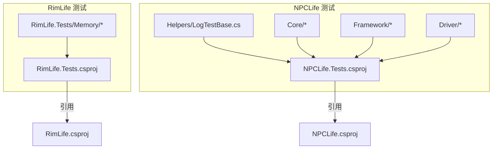
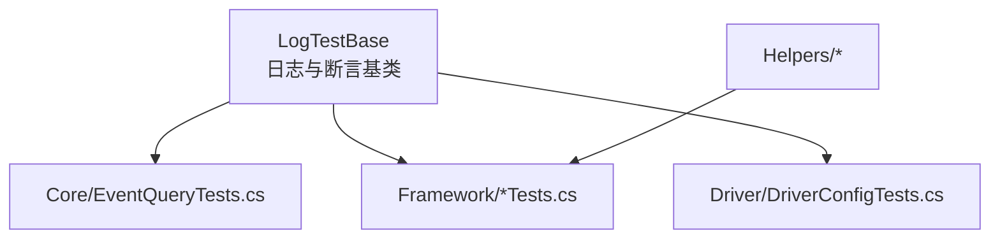
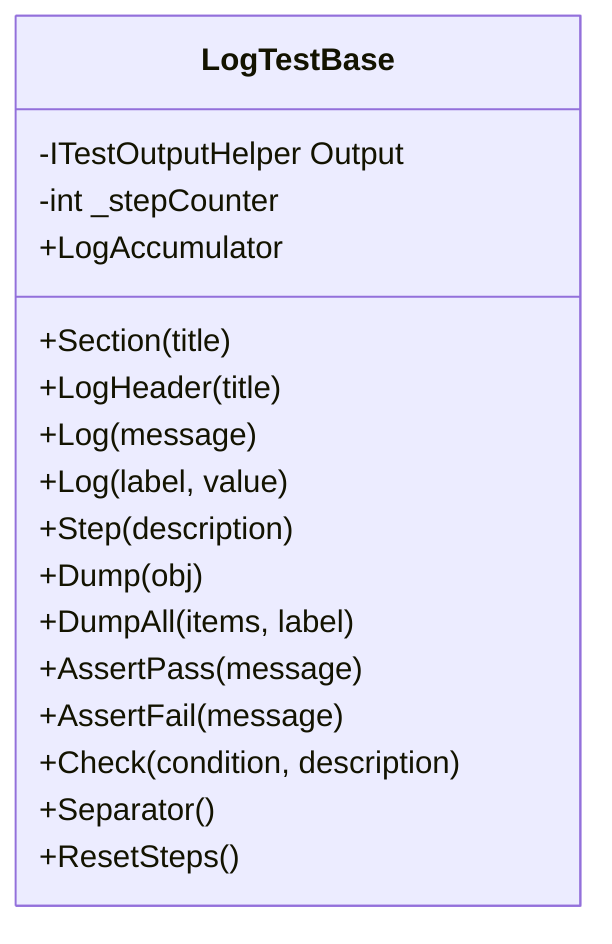
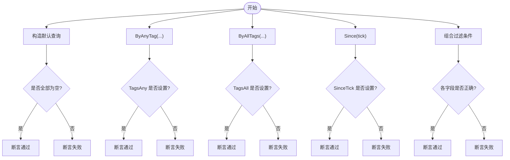
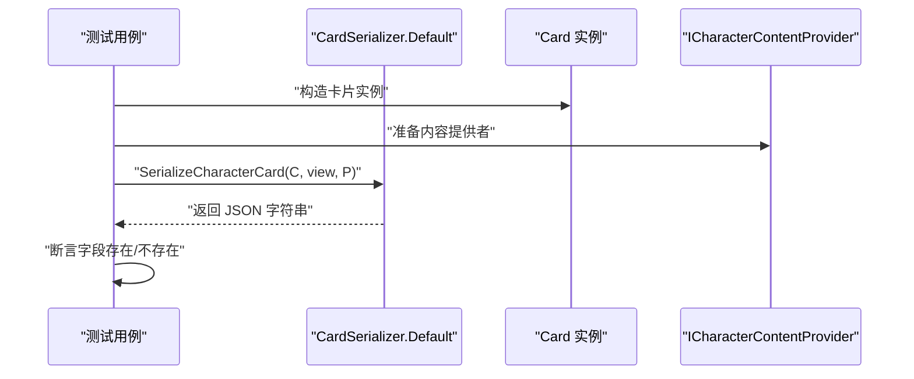
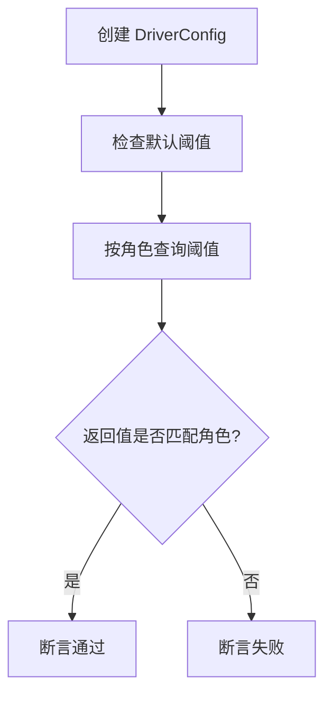
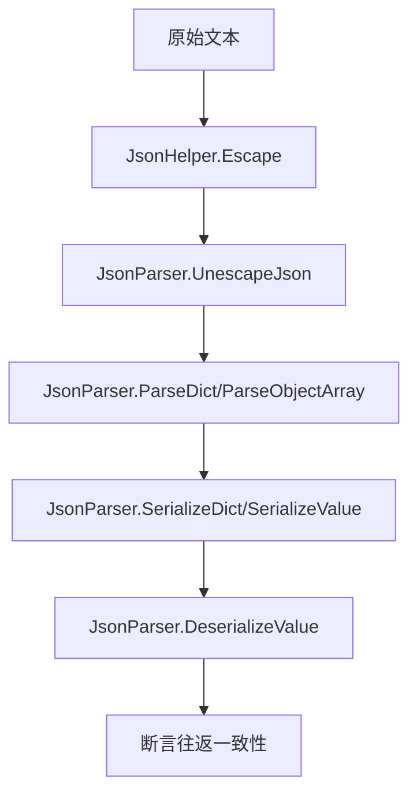
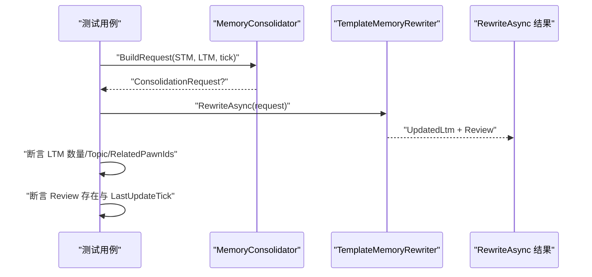
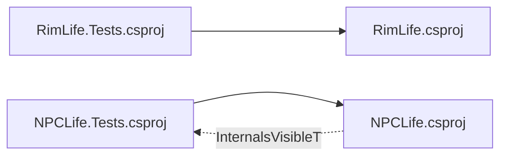

# 集成测试

<cite>
**本文引用的文件**
- [RimLife.Tests/RimLife.Tests.csproj](file://RimLife.Tests/RimLife.Tests.csproj)
- [ext/NPCLife/tests/NPCLife.Tests/NPCLife.Tests.csproj](file://ext/NPCLife/tests/NPCLife.Tests/NPCLife.Tests.csproj)
- [ext/NPCLife/src/NPCLife/NPCLife.csproj](file://ext/NPCLife/src/NPCLife/NPCLife.csproj)
- [ext/NPCLife/tests/NPCLife.Tests/Helpers/LogTestBase.cs](file://ext/NPCLife/tests/NPCLife.Tests/Helpers/LogTestBase.cs)
- [ext/NPCLife/tests/NPCLife.Tests/Core/EventQueryTests.cs](file://ext/NPCLife/tests/NPCLife.Tests/Core/EventQueryTests.cs)
- [ext/NPCLife/tests/NPCLife.Tests/Framework/CardSerializerTests.cs](file://ext/NPCLife/tests/NPCLife.Tests/Framework/CardSerializerTests.cs)
- [RimLife.Tests/Memory/PawnMemoryDataStructureTests.cs](file://RimLife.Tests/Memory/PawnMemoryDataStructureTests.cs)
- [RimLife.Tests/Memory/MemoryConsolidatorTests.cs](file://RimLife.Tests/Memory/MemoryConsolidatorTests.cs)
- [ext/NPCLife/tests/NPCLife.Tests/Driver/DriverConfigTests.cs](file://ext/NPCLife/tests/NPCLife.Tests/Driver/DriverConfigTests.cs)
- [ext/NPCLife/tests/NPCLife.Tests/Framework/JsonHelperTests.cs](file://ext/NPCLife/tests/NPCLife.Tests/Framework/JsonHelperTests.cs)
- [ext/NPCLife/tests/NPCLife.Tests/Framework/JsonParserTests.cs](file://ext/NPCLife/tests/NPCLife.Tests/Framework/JsonParserTests.cs)
- [ext/NPCLife/tests/NPCLife.Tests/Framework/JsonWriterTests.cs](file://ext/NPCLife/tests/NPCLife.Tests/Framework/JsonWriterTests.cs)
</cite>

## 目录
1. [引言](#引言)
2. [项目结构](#项目结构)
3. [核心组件](#核心组件)
4. [架构总览](#架构总览)
5. [详细组件分析](#详细组件分析)
6. [依赖关系分析](#依赖关系分析)
7. [性能考虑](#性能考虑)
8. [故障排查指南](#故障排查指南)
9. [结论](#结论)
10. [附录](#附录)

## 引言
本文件系统性阐述 RimLife 的集成测试架构与实现策略，重点覆盖 NPCLife 框架的集成测试配置与测试基类设计，并扩展到 RimLife 内部的记忆模块集成测试。文档目标是帮助初学者快速上手，同时为有经验的开发者提供足够的技术深度，涵盖以下主题：
- 集成测试的目的与范围：组件间交互、外部依赖、端到端流程
- 测试环境搭建、测试数据准备与测试场景设计
- 具体的集成测试示例：复杂业务流程与组件协作
- 测试隔离、模拟策略与稳定性保障
- 测试结果验证与性能基准建议
- 最佳实践与调试方法

## 项目结构
RimLife 仓库包含两个主要测试子项目：
- RimLife.Tests：针对 RimLife 自身功能（如记忆模块）的单元/集成测试
- ext/NPCLife/tests/NPCLife.Tests：针对 NPCLife 框架的单元/集成测试，覆盖核心模型、序列化、驱动配置与框架工具

测试项目均基于 xUnit，使用 .NET SDK，分别引用对应主工程作为被测目标。

图表来源
- [RimLife.Tests/RimLife.Tests.csproj:1-24](file://RimLife.Tests/RimLife.Tests.csproj#L1-L24)
- [ext/NPCLife/tests/NPCLife.Tests/NPCLife.Tests.csproj:1-23](file://ext/NPCLife/tests/NPCLife.Tests/NPCLife.Tests.csproj#L1-L23)
- [ext/NPCLife/src/NPCLife/NPCLife.csproj:1-38](file://ext/NPCLife/src/NPCLife/NPCLife.csproj#L1-L38)

章节来源
- [RimLife.Tests/RimLife.Tests.csproj:1-24](file://RimLife.Tests/RimLife.Tests.csproj#L1-L24)
- [ext/NPCLife/tests/NPCLife.Tests/NPCLife.Tests.csproj:1-23](file://ext/NPCLife/tests/NPCLife.Tests/NPCLife.Tests.csproj#L1-L23)
- [ext/NPCLife/src/NPCLife/NPCLife.csproj:1-38](file://ext/NPCLife/src/NPCLife/NPCLife.csproj#L1-L38)

## 核心组件
- 测试基类与日志输出：NPCLife 提供了结构化的日志输出基类，便于“人在回路”的复杂流程观测与断言报告。
- 核心模型与序列化：EventQuery、卡片序列化（CharacterCard/ColonyContext/ObjectiveCard/EnvironmentCard/InteractionRecord）等，覆盖多类 DTO 的序列化路径与字段校验。
- 驱动配置：DriverConfig 的默认值与阈值查询逻辑，确保工作空间角色的触发条件可预期。
- 框架工具：JsonHelper/JsonParser/JsonWriter 的纯逻辑断言，保证 JSON 编解码与格式化的一致性。
- 内存模块：Pawn 记忆数据结构与 MemoryConsolidator 的整合流程，验证短期记忆到长期记忆的合并与回顾生成。

章节来源
- [ext/NPCLife/tests/NPCLife.Tests/Helpers/LogTestBase.cs:1-154](file://ext/NPCLife/tests/NPCLife.Tests/Helpers/LogTestBase.cs#L1-L154)
- [ext/NPCLife/tests/NPCLife.Tests/Core/EventQueryTests.cs:1-105](file://ext/NPCLife/tests/NPCLife.Tests/Core/EventQueryTests.cs#L1-L105)
- [ext/NPCLife/tests/NPCLife.Tests/Framework/CardSerializerTests.cs:1-453](file://ext/NPCLife/tests/NPCLife.Tests/Framework/CardSerializerTests.cs#L1-L453)
- [ext/NPCLife/tests/NPCLife.Tests/Driver/DriverConfigTests.cs:1-57](file://ext/NPCLife/tests/NPCLife.Tests/Driver/DriverConfigTests.cs#L1-L57)
- [ext/NPCLife/tests/NPCLife.Tests/Framework/JsonHelperTests.cs:1-92](file://ext/NPCLife/tests/NPCLife.Tests/Framework/JsonHelperTests.cs#L1-L92)
- [ext/NPCLife/tests/NPCLife.Tests/Framework/JsonParserTests.cs:1-268](file://ext/NPCLife/tests/NPCLife.Tests/Framework/JsonParserTests.cs#L1-L268)
- [ext/NPCLife/tests/NPCLife.Tests/Framework/JsonWriterTests.cs:1-204](file://ext/NPCLife/tests/NPCLife.Tests/Framework/JsonWriterTests.cs#L1-L204)
- [RimLife.Tests/Memory/PawnMemoryDataStructureTests.cs:1-192](file://RimLife.Tests/Memory/PawnMemoryDataStructureTests.cs#L1-L192)
- [RimLife.Tests/Memory/MemoryConsolidatorTests.cs:1-188](file://RimLife.Tests/Memory/MemoryConsolidatorTests.cs#L1-L188)

## 架构总览
NPCLife 的测试架构以“测试基类 + 分层测试用例”组织：
- 测试基类：统一日志输出、断言报告与步骤计数，提升可读性与可观测性
- 分层用例：
  - Core：模型与查询逻辑（EventQuery）
  - Framework：序列化与 JSON 工具链（CardSerializer、JsonHelper/Parser/Writer）
  - Driver：驱动配置与阈值
  - Helpers：通用测试辅助

图表来源
- [ext/NPCLife/tests/NPCLife.Tests/Helpers/LogTestBase.cs:1-154](file://ext/NPCLife/tests/NPCLife.Tests/Helpers/LogTestBase.cs#L1-L154)
- [ext/NPCLife/tests/NPCLife.Tests/Core/EventQueryTests.cs:1-105](file://ext/NPCLife/tests/NPCLife.Tests/Core/EventQueryTests.cs#L1-L105)
- [ext/NPCLife/tests/NPCLife.Tests/Framework/CardSerializerTests.cs:1-453](file://ext/NPCLife/tests/NPCLife.Tests/Framework/CardSerializerTests.cs#L1-L453)
- [ext/NPCLife/tests/NPCLife.Tests/Driver/DriverConfigTests.cs:1-57](file://ext/NPCLife/tests/NPCLife.Tests/Driver/DriverConfigTests.cs#L1-L57)

## 详细组件分析

### 测试基类与日志输出（LogTestBase）
- 设计目的：为复杂流程提供结构化日志输出，支持分节、步骤编号、键值对、对象 Dump、断言报告与一次性汇总输出
- 关键能力：
  - 区块标题、醒目标题、分隔线
  - 步骤计数与重置
  - 断言通过/失败标记
  - LogAccumulator 一次性输出
- 使用建议：
  - 复杂流程优先继承该基类，简化调试与评审
  - 简单逻辑可直接使用 xUnit 断言，避免过度封装

图表来源
- [ext/NPCLife/tests/NPCLife.Tests/Helpers/LogTestBase.cs:1-154](file://ext/NPCLife/tests/NPCLife.Tests/Helpers/LogTestBase.cs#L1-L154)

章节来源
- [ext/NPCLife/tests/NPCLife.Tests/Helpers/LogTestBase.cs:1-154](file://ext/NPCLife/tests/NPCLife.Tests/Helpers/LogTestBase.cs#L1-L154)

### 核心模型与查询（EventQuery）
- 目标：验证查询对象的默认值、工厂方法与参数组合
- 覆盖要点：
  - 默认构造与 All 查询
  - 按标签 Any/All 过滤
  - 时间区间与重要性阈值
  - 组合过滤条件
- 集成测试建议：
  - 构造复杂查询对象，结合实际事件存储进行筛选验证
  - 验证边界值（空列表、空字典、极值）

图表来源
- [ext/NPCLife/tests/NPCLife.Tests/Core/EventQueryTests.cs:1-105](file://ext/NPCLife/tests/NPCLife.Tests/Core/EventQueryTests.cs#L1-L105)

章节来源
- [ext/NPCLife/tests/NPCLife.Tests/Core/EventQueryTests.cs:1-105](file://ext/NPCLife/tests/NPCLife.Tests/Core/EventQueryTests.cs#L1-L105)

### 卡片序列化（CardSerializer）
- 目标：自检所有 Card DTO 的序列化路径，确保字段完整性与视图差异
- 覆盖范围：
  - IGameEvent 列表序列化
  - ColonyContext 字段完整性
  - CharacterCard 的 static/dynamic/full 视图差异
  - ObjectiveCard 字段完整性
  - EnvironmentCard 的天气与室内/室外差异
  - InteractionRecord 列表序列化
  - ColonistSummary 列表序列化
- 集成测试建议：
  - 使用真实 Provider 与不同 view 生成完整 JSON，验证结构化字段存在且语义化
  - 对比不同视图下的字段差异，确保动态/静态视图不混入 full 专属内容

图表来源
- [ext/NPCLife/tests/NPCLife.Tests/Framework/CardSerializerTests.cs:1-453](file://ext/NPCLife/tests/NPCLife.Tests/Framework/CardSerializerTests.cs#L1-L453)

章节来源
- [ext/NPCLife/tests/NPCLife.Tests/Framework/CardSerializerTests.cs:1-453](file://ext/NPCLife/tests/NPCLife.Tests/Framework/CardSerializerTests.cs#L1-L453)

### 驱动配置（DriverConfig）
- 目标：验证配置默认值与按角色查询的有效阈值
- 覆盖要点：
  - 默认阈值与容量限制
  - 按角色查询的重要性/数量阈值
- 集成测试建议：
  - 构造不同角色阈值，验证查询返回值与角色映射一致
  - 边界值测试：最小/最大阈值与异常输入

图表来源
- [ext/NPCLife/tests/NPCLife.Tests/Driver/DriverConfigTests.cs:1-57](file://ext/NPCLife/tests/NPCLife.Tests/Driver/DriverConfigTests.cs#L1-L57)

章节来源
- [ext/NPCLife/tests/NPCLife.Tests/Driver/DriverConfigTests.cs:1-57](file://ext/NPCLife/tests/NPCLife.Tests/Driver/DriverConfigTests.cs#L1-L57)

### JSON 工具链（JsonHelper/JsonParser/JsonWriter）
- 目标：验证 JSON 编解码与格式化的一致性与健壮性
- 覆盖要点：
  - 转义规则与 Unicode 处理
  - 解析字典、数组与嵌套结构
  - 序列化/反序列化往返一致性
  - 特殊字符与格式化
- 集成测试建议：
  - 使用混合内容（中文、控制字符、转义字符）进行往返测试
  - 验证解析保留嵌套结构为原始 JSON 字符串

图表来源
- [ext/NPCLife/tests/NPCLife.Tests/Framework/JsonHelperTests.cs:1-92](file://ext/NPCLife/tests/NPCLife.Tests/Framework/JsonHelperTests.cs#L1-L92)
- [ext/NPCLife/tests/NPCLife.Tests/Framework/JsonParserTests.cs:1-268](file://ext/NPCLife/tests/NPCLife.Tests/Framework/JsonParserTests.cs#L1-L268)
- [ext/NPCLife/tests/NPCLife.Tests/Framework/JsonWriterTests.cs:1-204](file://ext/NPCLife/tests/NPCLife.Tests/Framework/JsonWriterTests.cs#L1-L204)

章节来源
- [ext/NPCLife/tests/NPCLife.Tests/Framework/JsonHelperTests.cs:1-92](file://ext/NPCLife/tests/NPCLife.Tests/Framework/JsonHelperTests.cs#L1-L92)
- [ext/NPCLife/tests/NPCLife.Tests/Framework/JsonParserTests.cs:1-268](file://ext/NPCLife/tests/NPCLife.Tests/Framework/JsonParserTests.cs#L1-L268)
- [ext/NPCLife/tests/NPCLife.Tests/Framework/JsonWriterTests.cs:1-204](file://ext/NPCLife/tests/NPCLife.Tests/Framework/JsonWriterTests.cs#L1-L204)

### 内存模块（PawnMemory 数据结构与 Consolidator）
- 目标：验证短期/长期记忆、回顾与当前心态的数据结构与整合流程
- 覆盖要点：
  - 构造函数与默认值
  - 截断逻辑与字符串表示
  - 整合请求构建与模板重写器的异步重写
  - 同类型/同角色合并、不同类型分离、已有 LTM 合并与回顾生成
- 集成测试建议：
  - 构造多种 STM 列表，验证 LTM 合并与 Topic 归类
  - 验证 Review 的生成与时间戳一致性

图表来源
- [RimLife.Tests/Memory/MemoryConsolidatorTests.cs:1-188](file://RimLife.Tests/Memory/MemoryConsolidatorTests.cs#L1-L188)
- [RimLife.Tests/Memory/PawnMemoryDataStructureTests.cs:1-192](file://RimLife.Tests/Memory/PawnMemoryDataStructureTests.cs#L1-L192)

章节来源
- [RimLife.Tests/Memory/MemoryConsolidatorTests.cs:1-188](file://RimLife.Tests/Memory/MemoryConsolidatorTests.cs#L1-L188)
- [RimLife.Tests/Memory/PawnMemoryDataStructureTests.cs:1-192](file://RimLife.Tests/Memory/PawnMemoryDataStructureTests.cs#L1-L192)

## 依赖关系分析
- 测试项目与被测项目的关系：
  - RimLife.Tests 引用 RimLife 主工程
  - NPCLife.Tests 引用 NPCLife 主工程
- 可见性控制：
  - NPCLife 主工程通过 InternalsVisibleTo 暴露内部成员给测试项目，便于测试复杂实现细节
- 外部依赖：
  - 测试框架：xUnit、Microsoft.NET.Test.Sdk、xunit.runner.visualstudio
  - NPCLife 主工程包含 System.Net.Http

图表来源
- [RimLife.Tests/RimLife.Tests.csproj:1-24](file://RimLife.Tests/RimLife.Tests.csproj#L1-L24)
- [ext/NPCLife/tests/NPCLife.Tests/NPCLife.Tests.csproj:1-23](file://ext/NPCLife/tests/NPCLife.Tests/NPCLife.Tests.csproj#L1-L23)
- [ext/NPCLife/src/NPCLife/NPCLife.csproj:32-35](file://ext/NPCLife/src/NPCLife/NPCLife.csproj#L32-L35)

章节来源
- [RimLife.Tests/RimLife.Tests.csproj:1-24](file://RimLife.Tests/RimLife.Tests.csproj#L1-L24)
- [ext/NPCLife/tests/NPCLife.Tests/NPCLife.Tests.csproj:1-23](file://ext/NPCLife/tests/NPCLife.Tests/NPCLife.Tests.csproj#L1-L23)
- [ext/NPCLife/src/NPCLife/NPCLife.csproj:32-35](file://ext/NPCLife/src/NPCLife/NPCLife.csproj#L32-L35)

## 性能考虑
- 测试执行效率：
  - 使用 xUnit 的并发执行能力，避免不必要的同步等待
  - 对于涉及 IO 或网络的场景，尽量使用内存态或本地缓存
- 序列化与 JSON 工具：
  - 避免在测试中重复构造大型对象，复用小型样例
  - 对 JSON 工具链的往返测试应覆盖典型负载大小，但避免极端大对象导致测试超时
- 内存整合：
  - 构建测试数据时注意 STM/LTM 数量级，避免 O(n^2) 场景导致测试耗时过长

## 故障排查指南
- 日志与断言：
  - 使用 LogTestBase 的结构化输出，定位失败步骤与关键字段
  - 对于复杂流程，使用 LogAccumulator 一次性输出，便于评审
- 常见问题：
  - 字段缺失：检查序列化视图与 Provider 返回值
  - JSON 不一致：核对转义规则与文化格式（小数点）
  - 阈值不匹配：确认角色映射与默认值
  - 记忆合并异常：核对 Topic 归类与 RelatedPawnIds
- 调试技巧：
  - 将断言拆分为多个小用例，缩小问题范围
  - 使用 DumpAll 输出集合内容，辅助定位差异

章节来源
- [ext/NPCLife/tests/NPCLife.Tests/Helpers/LogTestBase.cs:1-154](file://ext/NPCLife/tests/NPCLife.Tests/Helpers/LogTestBase.cs#L1-L154)

## 结论
RimLife 的集成测试体系以清晰的分层与统一的日志基类为核心，覆盖了 NPCLife 框架的关键模型、序列化与驱动配置，以及 RimLife 的记忆模块。通过结构化日志、断言报告与分层测试用例，既满足初学者的易用性，也为复杂流程提供了强大的可观测性与可维护性。建议在后续扩展中持续完善端到端场景与外部依赖模拟，进一步提升测试稳定性与覆盖率。

## 附录
- 测试环境搭建建议：
  - 使用 .NET SDK 与 xUnit 运行器
  - 为每个测试项目配置合适的 TargetFramework 与平台目标
  - 对于需要访问内部成员的测试，保持 InternalsVisibleTo 的最小化暴露
- 测试数据准备：
  - 使用小而精的样例对象，避免冗余数据
  - 对于序列化测试，准备多语言与特殊字符的混合输入
- 测试场景设计：
  - 覆盖默认值、边界值与异常输入
  - 对于异步流程（如 MemoryConsolidator），使用合理的时间戳与幂等断言
- 稳定性保障：
  - 避免依赖随机性与外部服务
  - 对于 JSON 工具链，使用往返测试确保一致性
- 性能基准建议：
  - 对序列化与 JSON 工具链进行基准测试，记录典型负载下的耗时
  - 对记忆整合流程进行压力测试，评估合并规模与性能关系