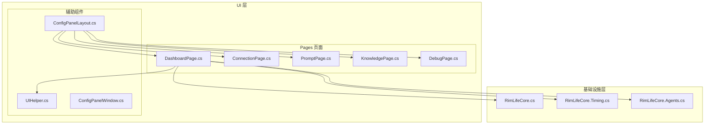
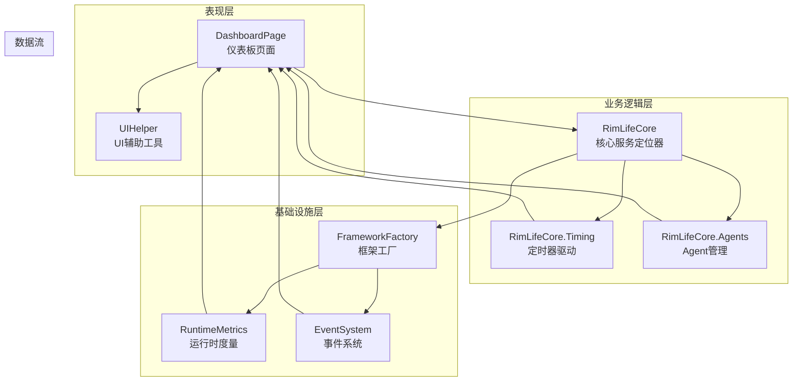
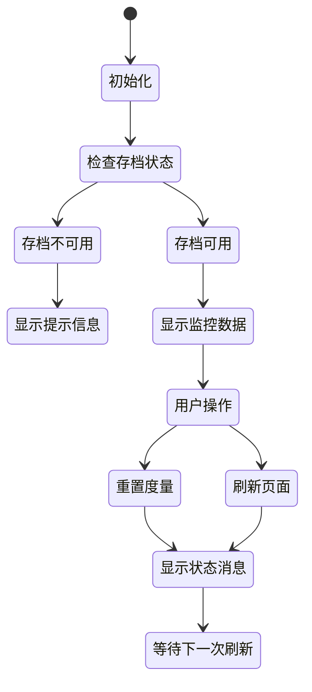
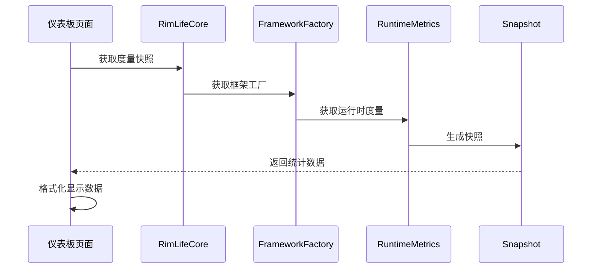
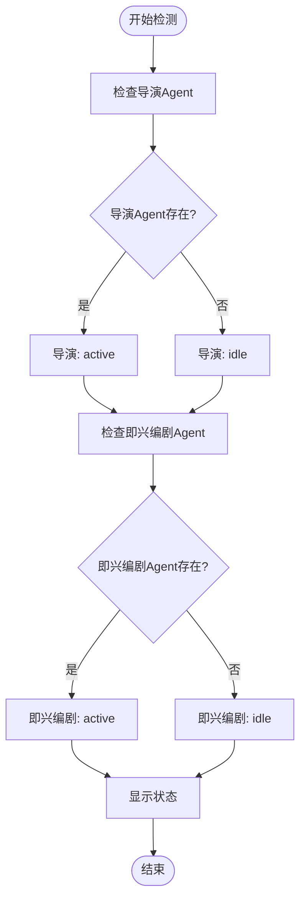
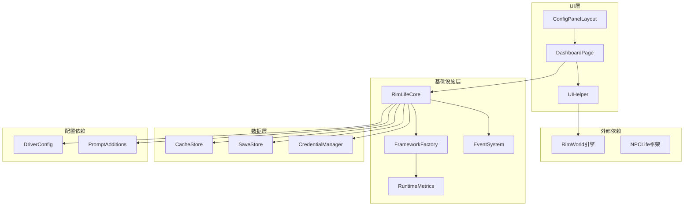

# 仪表板页面

<cite>
**本文档引用的文件**
- [DashboardPage.cs](file://Source/UI/Pages/DashboardPage.cs)
- [ConfigPanelLayout.cs](file://Source/UI/ConfigPanelLayout.cs)
- [UIHelper.cs](file://Source/UI/Helpers/UIHelper.cs)
- [RimLifeCore.cs](file://Source/Infrastructure/RimLifeCore.cs)
- [RimLifeCore.Timing.cs](file://Source/Infrastructure/RimLifeCore.Timing.cs)
- [RimLifeCore.Agents.cs](file://Source/Infrastructure/RimLifeCore.Agents.cs)
- [LogBuffer.cs](file://Source/UI/LogBuffer.cs)
- [ConfigPanelWindow.cs](file://Source/UI/ConfigPanelWindow.cs)
</cite>

## 目录
1. [简介](#简介)
2. [项目结构](#项目结构)
3. [核心组件](#核心组件)
4. [架构概览](#架构概览)
5. [详细组件分析](#详细组件分析)
6. [依赖关系分析](#依赖关系分析)
7. [性能考虑](#性能考虑)
8. [故障排除指南](#故障排除指南)
9. [结论](#结论)

## 简介

仪表板页面是 RimLife 项目中的一个关键监控组件，用于实时展示框架层的运行时统计数据和 Agent 状态。该页面提供了对 LLM 使用情况、Agent 循环统计、工具调用和知识库使用的全面监控功能。

仪表板页面采用 RimWorld 的 IMGUI 框架构建，集成了 NPCLife 框架的运行时度量系统，能够实时反映 AI Agent 的工作状态和资源消耗情况。页面设计遵循模块化原则，将不同的监控指标分为独立的区域进行展示。

## 项目结构

仪表板页面位于 UI 层的 Pages 目录中，与配置面板的其他页面共同构成了完整的设置界面：

**图表来源**
- [DashboardPage.cs:1-207](file://Source/UI/Pages/DashboardPage.cs#L1-L207)
- [ConfigPanelLayout.cs:1-304](file://Source/UI/ConfigPanelLayout.cs#L1-L304)

**章节来源**
- [DashboardPage.cs:1-207](file://Source/UI/Pages/DashboardPage.cs#L1-L207)
- [ConfigPanelLayout.cs:1-304](file://Source/UI/ConfigPanelLayout.cs#L1-L304)

## 核心组件

仪表板页面的核心功能围绕以下几个关键组件构建：

### 1. 运行时度量系统
仪表板页面通过 RimLifeCore.FrameworkFactory.Metrics 接口获取实时统计数据，包括：
- LLM 会话统计（总会话数、活跃会话数）
- Token 消耗统计（输入、输出、缓存命中）
- Agent 循环统计（激活次数、轮次统计）
- 工具调用统计
- 知识库查询统计

### 2. Agent 状态监控
页面监控三个核心 Agent 的运行状态：
- 导演 Agent (Director)
- 即兴编剧 Agent (Improviser)
- 编剧 Agent (Screenwriter)

### 3. 用户界面组件
- 统一的 UI 辅助工具 (UIHelper)
- 模块化的页面布局 (ConfigPanelLayout)
- 实时状态反馈机制

**章节来源**
- [DashboardPage.cs:48-170](file://Source/UI/Pages/DashboardPage.cs#L48-L170)
- [RimLifeCore.cs:330-385](file://Source/Infrastructure/RimLifeCore.cs#L330-L385)

## 架构概览

仪表板页面的架构体现了清晰的分层设计和职责分离：

**图表来源**
- [DashboardPage.cs:16-21](file://Source/UI/Pages/DashboardPage.cs#L16-L21)
- [RimLifeCore.cs:107-121](file://Source/Infrastructure/RimLifeCore.cs#L107-L121)

## 详细组件分析

### 仪表板页面核心实现

仪表板页面作为 IConfigPage 接口的具体实现，提供了完整的监控功能：

#### 1. 页面状态管理

**图表来源**
- [DashboardPage.cs:27-170](file://Source/UI/Pages/DashboardPage.cs#L27-L170)

#### 2. 监控数据分类展示

页面将监控数据分为四个主要区域：

##### Agent 状态区域
- 导演 Agent 状态检测
- 即兴编剧 Agent 状态检测
- 实时状态指示器

##### LLM 使用统计区域
- 总会话数和活跃会话数
- 输入/输出 Token 统计
- 缓存命中统计
- 按角色细分的使用情况

##### Agent 循环统计区域
- 总激活次数
- 总轮次数
- 平均轮次
- 处理事件总数
- 错误统计

##### 工具调用统计区域
- 工具调用次数
- 错误统计
- 限制显示数量（最多10个）

**章节来源**
- [DashboardPage.cs:37-146](file://Source/UI/Pages/DashboardPage.cs#L37-L146)

### UI 辅助工具集成

仪表板页面充分利用了 UIHelper 提供的统一 UI 组件：

#### 1. 统一的布局管理
- 标准化的间距常量 (GapTiny, GapSmall, GapMedium)
- 统一的按钮尺寸 (BtnWidthSmall, BtnWidthMedium, BtnWidthLarge)
- 标准化的颜色方案

#### 2. 信息展示组件
- DrawInfoRow：键值对信息行
- DrawStatusRow：带状态指示器的信息行
- BeginSection/EndSection：分组区域管理

#### 3. 状态消息系统
- 统一的状态消息显示机制
- 自动淡出效果 (5秒显示，1秒淡出)
- 错误状态的特殊颜色处理

**章节来源**
- [UIHelper.cs:15-464](file://Source/UI/Helpers/UIHelper.cs#L15-L464)
- [DashboardPage.cs:151-170](file://Source/UI/Pages/DashboardPage.cs#L151-L170)

### 运行时度量系统集成

仪表板页面深度集成了 RimLifeCore 的运行时度量系统：

#### 1. 度量数据获取

**图表来源**
- [DashboardPage.cs:48](file://Source/UI/Pages/DashboardPage.cs#L48)
- [RimLifeCore.cs:330-385](file://Source/Infrastructure/RimLifeCore.cs#L330-L385)

#### 2. 度量数据结构
- TotalSessions：总会话数
- ActiveSessions：活跃会话数
- Tokens：Token 统计对象
- AgentLoops：Agent 循环统计
- Tools：工具调用列表
- Knowledge：知识库统计

**章节来源**
- [DashboardPage.cs:48-102](file://Source/UI/Pages/DashboardPage.cs#L48-L102)

### Agent 状态监控机制

仪表板页面实现了对三个核心 Agent 的状态监控：

#### 1. Agent 状态检测

**图表来源**
- [DashboardPage.cs:176-184](file://Source/UI/Pages/DashboardPage.cs#L176-L184)

#### 2. 状态数据来源
- 导演 Agent：通过 RimLifeCore.GetDirectorAgent() 检查
- 即兴编剧 Agent：通过 RimLifeCore.GetImproviserAgent() 检查
- 实时状态：根据 Agent 实例的存在与否判断

**章节来源**
- [DashboardPage.cs:176-184](file://Source/UI/Pages/DashboardPage.cs#L176-L184)
- [RimLifeCore.Agents.cs:108-144](file://Source/Infrastructure/RimLifeCore.Agents.cs#L108-L144)

## 依赖关系分析

仪表板页面的依赖关系体现了清晰的层次化架构：

**图表来源**
- [DashboardPage.cs:1-207](file://Source/UI/Pages/DashboardPage.cs#L1-L207)
- [RimLifeCore.cs:107-121](file://Source/Infrastructure/RimLifeCore.cs#L107-L121)

### 关键依赖关系

#### 1. UI 层依赖
- UIHelper：提供统一的 UI 组件和样式
- ConfigPanelLayout：提供页面布局和导航
- ConfigPanelWindow：提供窗口容器

#### 2. 业务逻辑依赖
- RimLifeCore：提供核心服务和配置
- FrameworkFactory：提供框架组件工厂
- RuntimeMetrics：提供运行时统计数据

#### 3. 数据依赖
- CacheStore：提供缓存存储
- SaveStore：提供权威存储
- CredentialManager：提供凭证管理

**章节来源**
- [DashboardPage.cs:1-207](file://Source/UI/Pages/DashboardPage.cs#L1-L207)
- [ConfigPanelLayout.cs:46-66](file://Source/UI/ConfigPanelLayout.cs#L46-L66)

## 性能考虑

仪表板页面在设计时充分考虑了性能优化：

### 1. 渲染性能优化
- 使用 IMGUI 框架，避免复杂的布局计算
- 动态高度计算，减少不必要的重绘
- 按需显示数据，避免大数据集的频繁刷新

### 2. 数据获取优化
- 使用快照模式获取统计数据，避免并发访问
- 缓存最近的数据，减少重复计算
- 限制显示数量（工具调用最多10个，知识库术语最多5个）

### 3. 内存管理
- 使用静态方法和常量，减少内存分配
- 及时清理临时状态变量
- 避免创建不必要的对象

### 4. 线程安全
- 所有 UI 操作都在主线程执行
- 数据访问使用适当的锁机制
- 避免长时间运行的操作阻塞 UI

## 故障排除指南

### 常见问题及解决方案

#### 1. 仪表板页面不显示数据
**症状**：页面显示"仅在游戏内可用"的提示
**原因**：当前未加载任何存档
**解决方案**：加载现有存档或新建存档后再打开仪表板

#### 2. LLM 使用统计显示异常
**症状**：Token 统计显示为 0 或异常值
**原因**：LLM 凭证未正确配置或网络连接问题
**解决方案**：
- 检查连接页面中的 LLM 凭证配置
- 验证 API Key 和 Base URL 的正确性
- 确认网络连接正常

#### 3. Agent 状态始终显示 "idle"
**症状**：所有 Agent 状态都显示为 "idle"
**原因**：Agent 未正确初始化或配置问题
**解决方案**：
- 检查 Agent 配置参数
- 验证工作空间管理器状态
- 重启游戏以重新初始化 Agent

#### 4. 仪表板页面响应缓慢
**症状**：页面刷新或操作响应迟缓
**原因**：数据量过大或系统负载过高
**解决方案**：
- 清理不需要的监控数据
- 检查系统资源使用情况
- 重启游戏以重置状态

**章节来源**
- [DashboardPage.cs:30-35](file://Source/UI/Pages/DashboardPage.cs#L30-L35)
- [DashboardPage.cs:155-166](file://Source/UI/Pages/DashboardPage.cs#L155-L166)

## 结论

仪表板页面作为 RimLife 项目的重要监控组件，成功实现了对 AI Agent 系统的全面监控。通过清晰的架构设计、合理的数据组织和高效的 UI 实现，该页面为用户提供了直观、实时的系统状态反馈。

页面的主要优势包括：
- **全面的监控覆盖**：涵盖 LLM 使用、Agent 状态、工具调用和知识库使用
- **实时数据展示**：通过运行时度量系统提供最新的系统状态
- **友好的用户体验**：统一的 UI 设计和直观的数据展示
- **良好的性能表现**：优化的渲染和数据访问机制

未来可以考虑的改进方向：
- 增加更多的自定义过滤选项
- 提供更详细的趋势分析功能
- 支持导出监控数据
- 增强移动端的适配性

通过仪表板页面，用户可以有效地监控和管理 RimLife 系统的运行状态，确保 AI Agent 的正常工作和资源的合理使用。