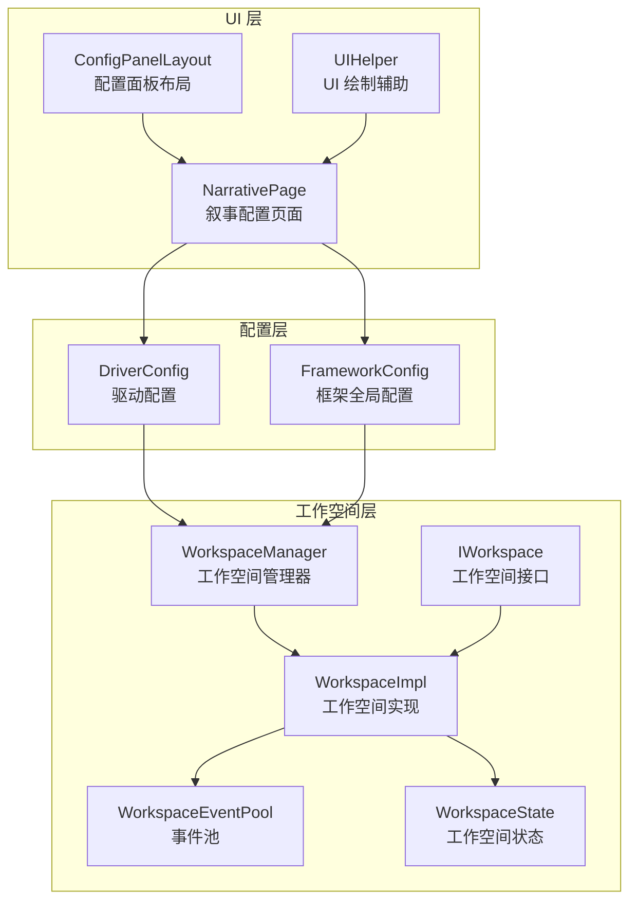
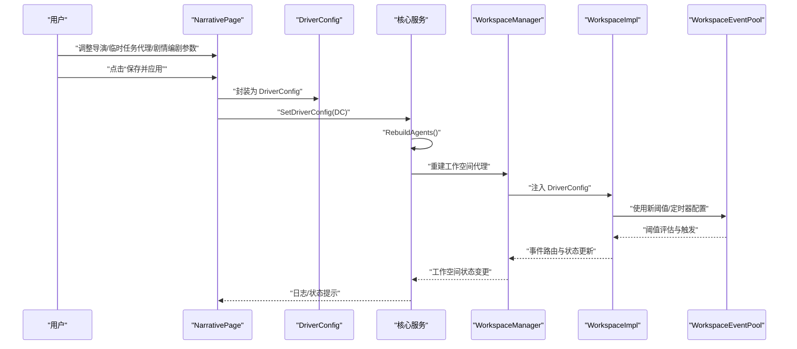
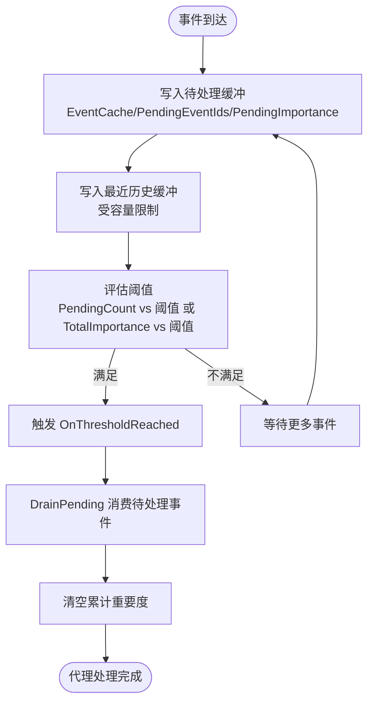
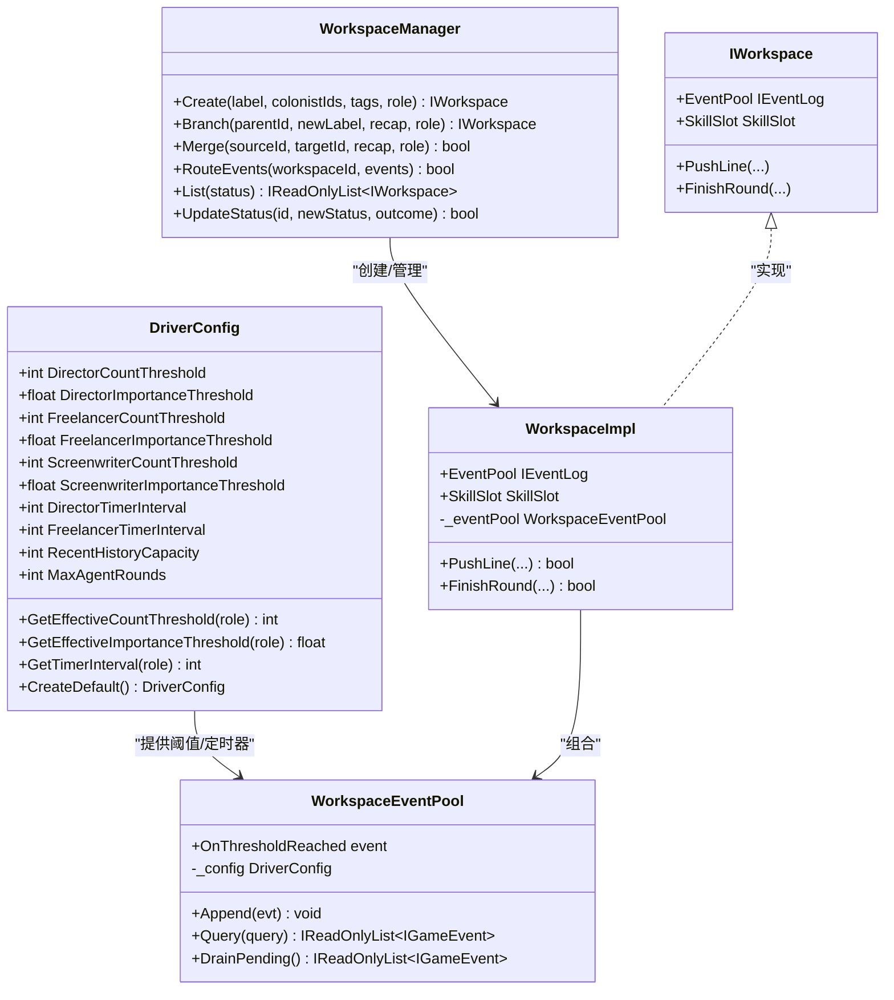
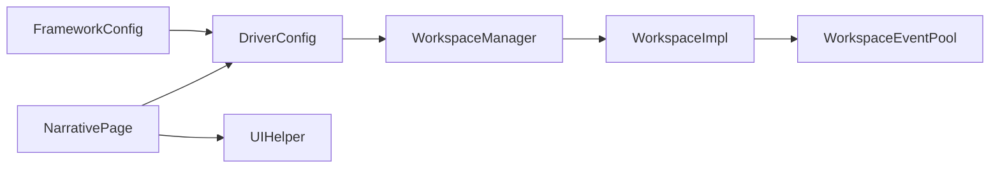

# 叙事配置页面

<cite>
**本文引用的文件**
- [NarrativePage.cs](file://Source/UI/Pages/NarrativePage.cs)
- [ConfigPanelLayout.cs](file://Source/UI/ConfigPanelLayout.cs)
- [UIHelper.cs](file://Source/UI/Helpers/UIHelper.cs)
- [RimLifeMod.cs](file://Source/Settings/RimLifeMod.cs)
- [DriverConfig.cs](file://ext/NPCLife/src/NPCLife/Driver/DriverConfig.cs)
- [FrameworkConfig.cs](file://ext/NPCLife/src/NPCLife/Framework/FrameworkConfig.cs)
- [WorkspaceManager.cs](file://ext/NPCLife/src/NPCLife/Workspace/WorkspaceManager.cs)
- [WorkspaceImpl.cs](file://ext/NPCLife/src/NPCLife/Workspace/WorkspaceImpl.cs)
- [WorkspaceEventPool.cs](file://ext/NPCLife/src/NPCLife/Workspace/WorkspaceEventPool.cs)
- [WorkspaceState.cs](file://ext/NPCLife/src/NPCLife/Workspace/WorkspaceState.cs)
- [IWorkspace.cs](file://ext/NPCLife/src/NPCLife/Workspace/IWorkspace.cs)
</cite>

## 目录
1. [简介](#简介)
2. [项目结构](#项目结构)
3. [核心组件](#核心组件)
4. [架构概览](#架构概览)
5. [详细组件分析](#详细组件分析)
6. [依赖关系分析](#依赖关系分析)
7. [性能考量](#性能考量)
8. [故障排查指南](#故障排查指南)
9. [结论](#结论)
10. [附录](#附录)

## 简介
本文件面向“叙事配置页面”，系统性阐述代理参数配置机制，涵盖导演、编剧与临时任务代理（自由职业者）的参数设置；事件阈值触发机制、定时器脉冲配置与处理频率控制；代理协作优先级、工作空间生命周期管理与事件路由规则；参数验证、默认值恢复与配置导入导出能力；以及性能优化建议与调试技巧。目标是帮助玩家与模组使用者理解并正确配置叙事驱动参数，以获得稳定、可控且高质量的叙事体验。

## 项目结构
叙事配置页面位于 RimLife 的 UI 层，作为“配置面板”中的一个子页面存在。其与底层驱动配置（DriverConfig）、框架配置（FrameworkConfig）及工作空间管理（WorkspaceManager/WorkspaceImpl/WorkspaceEventPool）紧密耦合，形成“UI → 配置 → 工作空间”的闭环。

图表来源
- [NarrativePage.cs:46-157](file://Source/UI/Pages/NarrativePage.cs#L46-L157)
- [ConfigPanelLayout.cs:40-54](file://Source/UI/ConfigPanelLayout.cs#L40-L54)
- [DriverConfig.cs:9-106](file://ext/NPCLife/src/NPCLife/Driver/DriverConfig.cs#L9-L106)
- [FrameworkConfig.cs:17-205](file://ext/NPCLife/src/NPCLife/Framework/FrameworkConfig.cs#L17-L205)
- [WorkspaceManager.cs:19-40](file://ext/NPCLife/src/NPCLife/Workspace/WorkspaceManager.cs#L19-L40)
- [WorkspaceImpl.cs:16-46](file://ext/NPCLife/src/NPCLife/Workspace/WorkspaceImpl.cs#L16-L46)
- [WorkspaceEventPool.cs:21-43](file://ext/NPCLife/src/NPCLife/Workspace/WorkspaceEventPool.cs#L21-L43)
- [WorkspaceState.cs:94-160](file://ext/NPCLife/src/NPCLife/Workspace/WorkspaceState.cs#L94-L160)
- [IWorkspace.cs:11-55](file://ext/NPCLife/src/NPCLife/Workspace/IWorkspace.cs#L11-L55)

章节来源
- [NarrativePage.cs:14-174](file://Source/UI/Pages/NarrativePage.cs#L14-L174)
- [ConfigPanelLayout.cs:15-54](file://Source/UI/ConfigPanelLayout.cs#L15-L54)

## 核心组件
- 叙事配置页面（NarrativePage）
  - 提供导演、临时任务代理、剧情编剧三类角色的阈值与定时器配置入口，并提供“保存并应用”“重置默认值”等操作。
  - 保存时将编辑值封装为 DriverConfig 并调用核心服务更新，随后重建代理以使新配置生效。
- 驱动配置（DriverConfig）
  - 定义各角色的事件数量阈值、重要度阈值、定时器脉冲间隔、历史缓冲容量与最大轮数等参数。
  - 提供按角色查询有效阈值与定时器间隔的方法。
- 框架配置（FrameworkConfig）
  - 统一管理驱动配置、诊断开关与功能开关；提供 JSON 序列化/反序列化与校验。
- 工作空间管理（WorkspaceManager/WorkspaceImpl/WorkspaceEventPool）
  - 管理工作空间的创建、分支、合并、状态转换与事件路由。
  - 事件池负责阈值评估与被动触发，支持最近事件历史缓冲与持久化的待处理事件集合。

章节来源
- [NarrativePage.cs:46-157](file://Source/UI/Pages/NarrativePage.cs#L46-L157)
- [DriverConfig.cs:9-106](file://ext/NPCLife/src/NPCLife/Driver/DriverConfig.cs#L9-L106)
- [FrameworkConfig.cs:17-205](file://ext/NPCLife/src/NPCLife/Framework/FrameworkConfig.cs#L17-L205)
- [WorkspaceManager.cs:19-40](file://ext/NPCLife/src/NPCLife/Workspace/WorkspaceManager.cs#L19-L40)
- [WorkspaceEventPool.cs:21-43](file://ext/NPCLife/src/NPCLife/Workspace/WorkspaceEventPool.cs#L21-L43)

## 架构概览
以下序列图展示了从 UI 配置到代理生效的关键流程：用户在“叙事配置页面”调整参数，保存后写入 DriverConfig，再由核心服务重建代理，从而影响工作空间事件池的阈值评估与定时器脉冲。

图表来源
- [NarrativePage.cs:118-136](file://Source/UI/Pages/NarrativePage.cs#L118-L136)
- [DriverConfig.cs:9-106](file://ext/NPCLife/src/NPCLife/Driver/DriverConfig.cs#L9-L106)
- [WorkspaceManager.cs:76-85](file://ext/NPCLife/src/NPCLife/Workspace/WorkspaceManager.cs#L76-L85)
- [WorkspaceEventPool.cs:81-90](file://ext/NPCLife/src/NPCLife/Workspace/WorkspaceEventPool.cs#L81-L90)

## 详细组件分析

### 叙事配置页面（UI）
- 页面组织
  - 分为“导演策略”“临时任务代理策略”“剧情编剧策略”“通用设置”四个区块，每个区块包含对应的阈值与定时器配置项。
  - 通用设置包含“历史缓冲区容量”“Agent 最大轮数”，用于控制事件池容量与工具调用轮次上限。
- 参数编辑与保存
  - 首次绘制时从核心服务读取 DriverConfig 初始化本地缓冲。
  - “保存并应用”将当前缓冲封装为 DriverConfig，调用核心服务更新配置并重建代理，同时显示状态提示。
  - “重置默认值”从默认配置复制到本地缓冲，提示“需保存生效”。
- UI 辅助
  - 提供统一的标签+整数输入+描述行绘制方法，支持加减按钮与文本框输入，具备最小/最大范围限制与数值校正。
  - 统一的状态消息绘制方法，支持持续显示与淡出效果。

章节来源
- [NarrativePage.cs:46-157](file://Source/UI/Pages/NarrativePage.cs#L46-L157)
- [UIHelper.cs:183-218](file://Source/UI/Helpers/UIHelper.cs#L183-L218)
- [UIHelper.cs:425-452](file://Source/UI/Helpers/UIHelper.cs#L425-L452)

### 驱动配置（DriverConfig）
- 角色阈值
  - 导演/临时任务代理/剧情编剧分别具有“事件数量阈值”和“重要度阈值”，用于评估是否触发代理激活。
  - 提供按角色查询有效阈值的方法，若角色特定阈值无效则回退至导演阈值。
- 定时器脉冲
  - 导演与临时任务代理支持“定时器脉冲间隔（ticks）”，0 表示禁用；剧情编剧不支持定时器。
  - 定时器脉冲会向事件池注入 TimerPulse 事件，驱动代理周期性处理。
- 通用配置
  - 历史缓冲容量：控制最近事件历史缓冲上限，超出时按策略移除。
  - 最大轮数：限制单次激活中工具调用的最大轮数，防止死循环。
- 默认值与查询
  - 提供默认配置工厂方法；查询方法根据角色返回对应阈值或定时器间隔。

章节来源
- [DriverConfig.cs:9-106](file://ext/NPCLife/src/NPCLife/Driver/DriverConfig.cs#L9-L106)

### 框架配置（FrameworkConfig）
- 结构与合并优先级
  - 包含驱动配置、诊断配置与功能开关三部分；合并优先级为：默认值 < 配置文件 < 代码覆盖。
  - 冻结后禁止修改，保证运行时配置不可变。
- 校验
  - 对驱动配置的关键字段进行合法性检查，返回错误列表。
- 序列化/反序列化
  - 支持将配置序列化为 JSON，也支持从 JSON 反序列化，默认值兜底。
- 功能开关
  - 控制导演代理、记忆巩固、知识库、临时任务代理与运行时度量等功能的启用状态。

章节来源
- [FrameworkConfig.cs:17-205](file://ext/NPCLife/src/NPCLife/Framework/FrameworkConfig.cs#L17-L205)

### 工作空间生命周期与事件路由
- 生命周期
  - 状态枚举：Active/Suspended/Completed/Abandoned；支持状态转换校验与事件发布。
  - 创建：根据角色自动激活默认技能集；创建时记录创建者角色与时间戳。
  - 分支：仅导演可执行，复制父空间的轮次与技能集，生成新的分支空间。
  - 合并：仅导演可执行，合并来源空间的轮次与去重，更新标签、角色与技能集。
  - 更新状态：支持完成/废弃等状态变更，并发布相应事件。
- 事件路由
  - 通过 WorkspaceManager.RouteEvents 将事件批量追加到目标工作空间的事件池。
  - 事件池在每次 Append 后评估阈值，满足条件时触发 OnThresholdReached。
- 事件池
  - 双层结构：持久化的待处理事件集合（随工作空间状态保存）与仅内存的最近事件历史缓冲。
  - 阈值检测：比较 PendingCount 与 TotalImportance 与角色阈值，任一满足即触发。
  - DrainPending：消费待处理事件并清空累计重要度，供代理拉取处理。

图表来源
- [WorkspaceEventPool.cs:49-90](file://ext/NPCLife/src/NPCLife/Workspace/WorkspaceEventPool.cs#L49-L90)
- [WorkspaceEventPool.cs:166-183](file://ext/NPCLife/src/NPCLife/Workspace/WorkspaceEventPool.cs#L166-L183)

章节来源
- [WorkspaceManager.cs:87-138](file://ext/NPCLife/src/NPCLife/Workspace/WorkspaceManager.cs#L87-L138)
- [WorkspaceManager.cs:193-263](file://ext/NPCLife/src/NPCLife/Workspace/WorkspaceManager.cs#L193-L263)
- [WorkspaceManager.cs:269-376](file://ext/NPCLife/src/NPCLife/Workspace/WorkspaceManager.cs#L269-L376)
- [WorkspaceManager.cs:382-392](file://ext/NPCLife/src/NPCLife/Workspace/WorkspaceManager.cs#L382-L392)
- [WorkspaceEventPool.cs:21-43](file://ext/NPCLife/src/NPCLife/Workspace/WorkspaceEventPool.cs#L21-L43)
- [WorkspaceEventPool.cs:81-90](file://ext/NPCLife/src/NPCLife/Workspace/WorkspaceEventPool.cs#L81-L90)
- [WorkspaceEventPool.cs:166-183](file://ext/NPCLife/src/NPCLife/Workspace/WorkspaceEventPool.cs#L166-L183)

### 类关系图（代码级）

图表来源
- [DriverConfig.cs:9-106](file://ext/NPCLife/src/NPCLife/Driver/DriverConfig.cs#L9-L106)
- [WorkspaceEventPool.cs:21-43](file://ext/NPCLife/src/NPCLife/Workspace/WorkspaceEventPool.cs#L21-L43)
- [WorkspaceImpl.cs:16-46](file://ext/NPCLife/src/NPCLife/Workspace/WorkspaceImpl.cs#L16-L46)
- [WorkspaceManager.cs:19-40](file://ext/NPCLife/src/NPCLife/Workspace/WorkspaceManager.cs#L19-L40)
- [IWorkspace.cs:11-55](file://ext/NPCLife/src/NPCLife/Workspace/IWorkspace.cs#L11-L55)

## 依赖关系分析
- UI 与配置
  - NarrativePage 依赖 DriverConfig 进行参数读写与保存；依赖 UIHelper 进行统一绘制与状态提示。
- 配置与工作空间
  - DriverConfig 作为 WorkspaceManager/WorkspaceImpl/WorkspaceEventPool 的输入，决定阈值评估与定时器行为。
- 配置与框架
  - FrameworkConfig 提供全局配置的序列化/反序列化与校验，支持配置导入导出与默认值恢复。
- 工作空间与事件
  - WorkspaceEventPool 是事件路由的核心，负责阈值评估与被动触发；WorkspaceManager 负责事件路由与工作空间生命周期管理。

图表来源
- [NarrativePage.cs:118-136](file://Source/UI/Pages/NarrativePage.cs#L118-L136)
- [DriverConfig.cs:9-106](file://ext/NPCLife/src/NPCLife/Driver/DriverConfig.cs#L9-L106)
- [WorkspaceManager.cs:76-85](file://ext/NPCLife/src/NPCLife/Workspace/WorkspaceManager.cs#L76-L85)
- [WorkspaceEventPool.cs:81-90](file://ext/NPCLife/src/NPCLife/Workspace/WorkspaceEventPool.cs#L81-L90)
- [FrameworkConfig.cs:17-205](file://ext/NPCLife/src/NPCLife/Framework/FrameworkConfig.cs#L17-L205)

章节来源
- [NarrativePage.cs:118-136](file://Source/UI/Pages/NarrativePage.cs#L118-L136)
- [FrameworkConfig.cs:17-205](file://ext/NPCLife/src/NPCLife/Framework/FrameworkConfig.cs#L17-L205)

## 性能考量
- 事件池容量与历史缓冲
  - 历史缓冲容量过大将增加内存占用与查找成本；过小可能导致近期事件丢失。建议结合存档规模与事件密度调整。
- 最大轮数限制
  - MaxAgentRounds 用于防死循环，建议保持在合理区间（例如 10–20），避免过长导致卡顿。
- 定时器脉冲频率
  - 定时器间隔越短，事件池触发越频繁，CPU 占用越高；过长则响应延迟增大。建议根据游戏节奏与事件密度折中设置。
- 阈值设置
  - 阈值过低易引发频繁激活，造成资源浪费；过高则可能错过关键事件。建议先以默认值起步，逐步微调。
- 序列化与持久化
  - 事件池的待处理事件集合随工作空间状态持久化，建议避免在短时间内产生大量事件，减少序列化压力。

## 故障排查指南
- 保存后未生效
  - 确认点击“保存并应用”后，页面显示“已保存并重建 Agent”提示；若未重建，检查核心服务日志。
- 阈值不触发
  - 检查事件是否正确路由到目标工作空间；确认事件的重要性与数量是否达到角色阈值；核对工作空间状态为 Active。
- 定时器无效
  - 确认定时器间隔大于 0；剧情编剧不支持定时器；检查角色是否为导演或临时任务代理。
- 性能异常
  - 降低历史缓冲容量、提高阈值或延长定时器间隔；减少一次性注入的事件数量；检查是否存在过多并发工作空间。
- 配置导入导出
  - 使用 FrameworkConfig 的 JSON 序列化/反序列化能力进行配置备份与迁移；导入失败时检查 JSON 格式与字段有效性。

章节来源
- [NarrativePage.cs:136-156](file://Source/UI/Pages/NarrativePage.cs#L136-L156)
- [WorkspaceEventPool.cs:81-90](file://ext/NPCLife/src/NPCLife/Workspace/WorkspaceEventPool.cs#L81-L90)
- [FrameworkConfig.cs:82-194](file://ext/NPCLife/src/NPCLife/Framework/FrameworkConfig.cs#L82-L194)

## 结论
“叙事配置页面”提供了对导演、临时任务代理与剧情编剧的精细化参数控制，配合事件阈值触发、定时器脉冲与处理频率限制，能够有效平衡叙事质量与系统性能。通过工作空间生命周期管理与事件路由规则，系统实现了稳定的叙事驱动与可控的资源消耗。建议以默认值为基础，结合实际游戏节奏与事件密度，逐步微调参数，以获得最佳叙事体验。

## 附录

### 参数验证与默认值恢复
- 参数验证
  - FrameworkConfig.Validate 对关键字段进行合法性检查，返回错误列表；建议在导入配置后调用以提前发现问题。
- 默认值恢复
  - “重置默认值”按钮将本地缓冲恢复为默认配置，提示“需保存生效”。

章节来源
- [FrameworkConfig.cs:56-75](file://ext/NPCLife/src/NPCLife/Framework/FrameworkConfig.cs#L56-L75)
- [NarrativePage.cs:138-153](file://Source/UI/Pages/NarrativePage.cs#L138-L153)

### 配置导入导出
- 导出
  - 使用 FrameworkConfig.ToJson 将当前配置序列化为 JSON 字符串，便于备份与分享。
- 导入
  - 使用 FrameworkConfig.FromJson 从 JSON 字符串反序列化配置；解析失败时返回默认配置，确保系统可用性。

章节来源
- [FrameworkConfig.cs:82-194](file://ext/NPCLife/src/NPCLife/Framework/FrameworkConfig.cs#L82-L194)