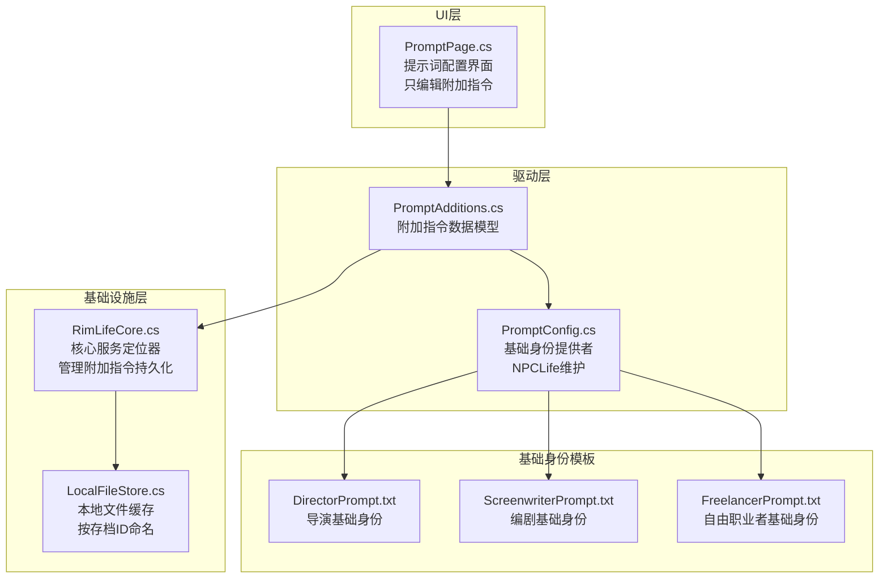
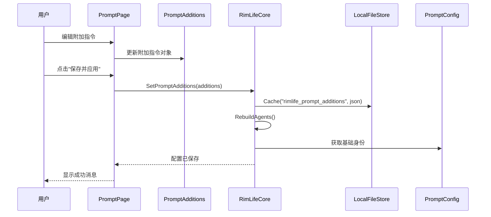
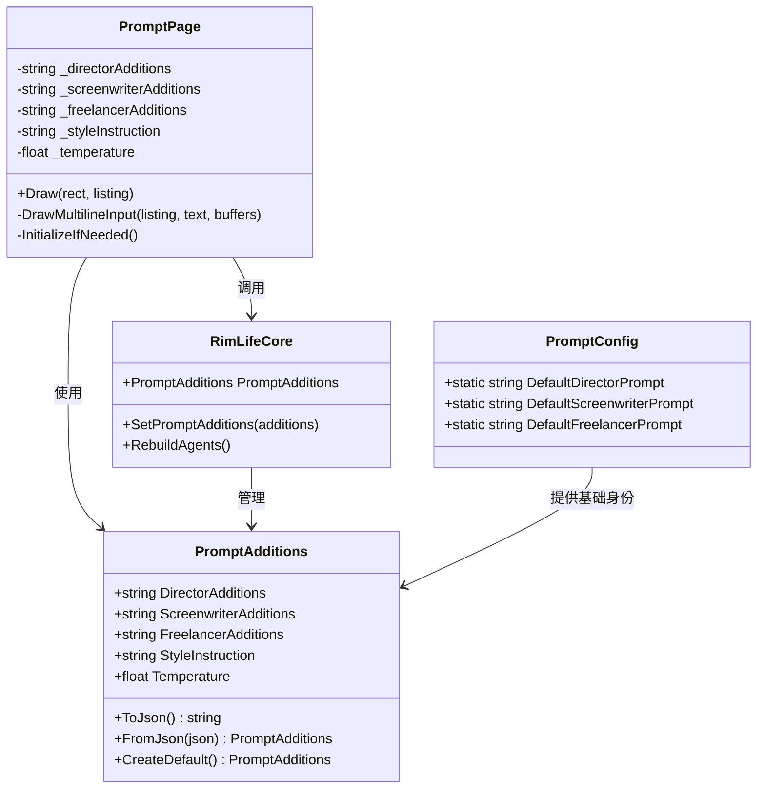
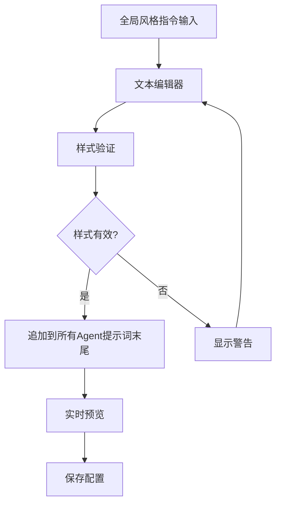
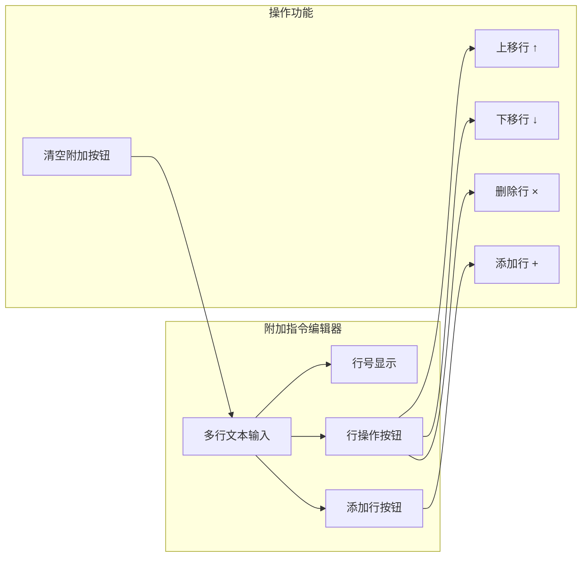
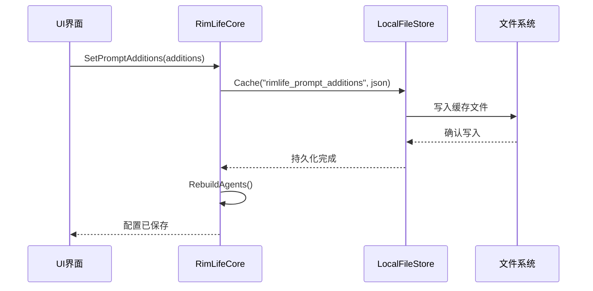
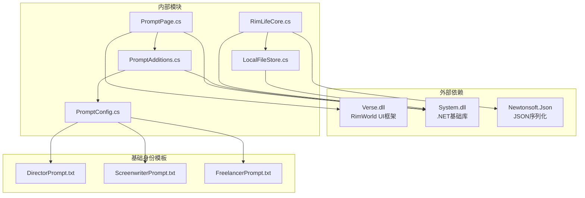

# 提示词配置页面

<cite>
**本文档引用的文件**
- [PromptPage.cs](file://Source/UI/Pages/PromptPage.cs)
- [PromptConfig.cs](file://ext/NPCLife/src/NPCLife/Driver/PromptConfig.cs)
- [PromptAdditions.cs](file://Source/Infrastructure/PromptAdditions.cs)
- [RimLifeCore.cs](file://Source/Infrastructure/RimLifeCore.cs)
- [DirectorPrompt.txt](file://ext/NPCLife/src/NPCLife/Prompts/DirectorPrompt.txt)
- [ScreenwriterPrompt.txt](file://ext/NPCLife/src/NPCLife/Prompts/ScreenwriterPrompt.txt)
- [FreelancerPrompt.txt](file://ext/NPCLife/src/NPCLife/Prompts/FreelancerPrompt.txt)
- [LocalFileStore.cs](file://Source/Infrastructure/LocalFileStore.cs)
</cite>

## 更新摘要
**变更内容**
- 完全重构提示词配置架构，从编辑完整提示词改为只编辑附加指令
- UI 文本从'恢复默认'更新为'清空附加'，强调基础身份不可编辑
- 新增 PromptAdditions 数据模型管理附加指令
- 强化基础身份保护机制，确保 NPCLife 基座身份不被覆盖

## 目录
1. [简介](#简介)
2. [项目结构](#项目结构)
3. [核心组件](#核心组件)
4. [架构概览](#架构概览)
5. [详细组件分析](#详细组件分析)
6. [依赖关系分析](#依赖关系分析)
7. [性能考虑](#性能考虑)
8. [故障排除指南](#故障排除指南)
9. [结论](#结论)

## 简介
提示词配置页面是 RimLife 系统中用于编辑和管理 AI 角色附加指令的核心界面。该页面采用全新的架构设计，只允许用户在 NPCLife 框架提供的基础身份之上追加指令，而不能直接编辑或覆盖基础身份。系统支持导演、编剧和自由职业者三种角色的附加指令编辑，提供全局风格指令设置，并允许用户调整 LLM 采样参数。所有配置均以缓存数据为准，默认值从嵌入资源文件加载。

**更新** 架构完全重构，从编辑完整提示词改为只编辑附加指令，强化了基础身份保护机制。

## 项目结构
提示词配置功能采用分层架构设计，重点突出附加指令管理：

**图表来源**
- [PromptPage.cs:1-294](file://Source/UI/Pages/PromptPage.cs#L1-L294)
- [PromptAdditions.cs:1-70](file://Source/Infrastructure/PromptAdditions.cs#L1-L70)
- [PromptConfig.cs:1-51](file://ext/NPCLife/src/NPCLife/Driver/PromptConfig.cs#L1-L51)

**章节来源**
- [PromptPage.cs:1-294](file://Source/UI/Pages/PromptPage.cs#L1-L294)
- [PromptAdditions.cs:1-70](file://Source/Infrastructure/PromptAdditions.cs#L1-L70)

## 核心组件
提示词配置系统由以下核心组件构成：

### 附加指令数据模型
- **PromptAdditions**: 管理导演、编剧、自由职业者的附加指令和全局风格指令
- **基础身份保护**: 禁止覆盖 NPCLife 提供的基础身份
- **序列化支持**: 支持 JSON 序列化和反序列化，仅保存附加部分

### UI 界面组件
- **PromptPage**: 主要配置界面，提供三组附加指令编辑器
- **样式指令编辑**: 全局风格指令的文本编辑功能
- **参数控制**: Temperature 温度参数的滑块控制
- **清空功能**: 每个角色都有独立的"清空附加"按钮

### 系统集成组件
- **RimLifeCore**: 核心服务定位器，管理附加指令的持久化和应用
- **本地缓存**: 使用 LocalFileStore 进行配置数据的持久化存储
- **基础身份提供**: 通过 PromptConfig 获取不可编辑的基础身份

**更新** 新增 PromptAdditions 数据模型，专门管理附加指令部分。

**章节来源**
- [PromptAdditions.cs:11-68](file://Source/Infrastructure/PromptAdditions.cs#L11-L68)
- [PromptPage.cs:12-170](file://Source/UI/Pages/PromptPage.cs#L12-L170)
- [RimLifeCore.cs:883-908](file://Source/Infrastructure/RimLifeCore.cs#L883-L908)

## 架构概览

**图表来源**
- [PromptPage.cs:128-143](file://Source/UI/Pages/PromptPage.cs#L128-L143)
- [RimLifeCore.cs:107-115](file://Source/Infrastructure/RimLifeCore.cs#L107-L115)
- [LocalFileStore.cs:32-38](file://Source/Infrastructure/LocalFileStore.cs#L32-L38)

系统采用分层架构设计，UI 层负责用户交互，驱动层处理业务逻辑，基础设施层提供持久化支持。关键变更：基础身份由 NPCLife 维护，RimLife 只能追加指令。

## 详细组件分析

### 附加指令管理系统

**图表来源**
- [PromptAdditions.cs:11-68](file://Source/Infrastructure/PromptAdditions.cs#L11-L68)
- [PromptPage.cs:12-170](file://Source/UI/Pages/PromptPage.cs#L12-L170)
- [RimLifeCore.cs:883-908](file://Source/Infrastructure/RimLifeCore.cs#L883-L908)
- [PromptConfig.cs:18-28](file://ext/NPCLife/src/NPCLife/Driver/PromptConfig.cs#L18-L28)

### 采样参数管理系统

系统提供以下采样参数调整功能：

#### Temperature 参数
- **范围**: 0.0 到 2.0
- **默认值**: 0.7
- **影响**: 越低越确定，越高越有创意
- **UI 控件**: 水平滑块，精度两位小数

#### 其他采样参数
虽然当前界面主要展示 Temperature 参数，但系统架构支持其他 LLM 采样参数的扩展。

**章节来源**
- [PromptPage.cs:49-53](file://Source/UI/Pages/PromptPage.cs#L49-L53)
- [PromptAdditions.cs:25](file://Source/Infrastructure/PromptAdditions.cs#L25)

### 全局风格指令系统

**图表来源**
- [PromptPage.cs:60-64](file://Source/UI/Pages/PromptPage.cs#L60-L64)
- [PromptAdditions.cs:22-23](file://Source/Infrastructure/PromptAdditions.cs#L22-L23)

全局风格指令具有以下特性：
- 运行时自动追加到所有 Agent 的提示词末尾
- 支持多行文本编辑
- 实时预览效果

**更新** 全局风格指令现在作为附加指令的一部分进行管理。

**章节来源**
- [PromptPage.cs:58-64](file://Source/UI/Pages/PromptPage.cs#L58-L64)
- [PromptAdditions.cs:22-23](file://Source/Infrastructure/PromptAdditions.cs#L22-L23)

### 角色专用附加指令模板

系统为三种 AI 角色提供专用附加指令编辑器：

#### 导演 Agent (Director)
- **职责**: 事件审查、剧情线选择、工作空间路由
- **编辑区域**: "导演 Agent (Director) — 附加指令"
- **说明**: 在框架基础身份之上追加指令，留空则不追加任何内容
- **清空按钮**: "清空附加"

#### 编剧 Agent (Screenwriter)
- **职责**: 事件审查、上下文获取、台词撰写
- **编辑区域**: "编剧 Agent (Screenwriter) — 附加指令"
- **说明**: 在框架基础身份之上追加指令，动态上下文在运行时自动追加
- **清空按钮**: "清空附加"

#### 自由职业者 Agent (Freelancer)
- **职责**: 突发事件处理、独立任务执行
- **编辑区域**: "临时工 Agent (Freelancer) — 附加指令"
- **说明**: 在框架基础身份之上追加指令，动态上下文在运行时自动追加
- **清空按钮**: "清空附加"

**更新** UI 文本从'恢复默认'更新为'清空附加'，强调基础身份不可编辑。

**章节来源**
- [PromptPage.cs:66-121](file://Source/UI/Pages/PromptPage.cs#L66-L121)

### 附加指令编辑界面

**图表来源**
- [PromptPage.cs:176-291](file://Source/UI/Pages/PromptPage.cs#L176-L291)

界面提供以下编辑功能：
- 行号显示和高亮
- 行级操作：上移、下移、删除
- 动态行数调整
- 实时状态反馈
- 每个角色独立的清空功能

**更新** 新增独立的清空附加功能，每个角色都有自己的清空按钮。

**章节来源**
- [PromptPage.cs:176-291](file://Source/UI/Pages/PromptPage.cs#L176-L291)

### 配置持久化机制

**图表来源**
- [RimLifeCore.cs:107-115](file://Source/Infrastructure/RimLifeCore.cs#L107-L115)
- [LocalFileStore.cs:32-38](file://Source/Infrastructure/LocalFileStore.cs#L32-L38)

系统采用以下持久化策略：
- JSON 格式序列化附加指令
- 按存档 ID 命名的缓存文件
- 线程安全的缓存访问
- 仅保存附加指令，不覆盖基础身份

**更新** 配置键从"rimlife_prompt_config"更新为"rimlife_prompt_additions"，专门管理附加指令。

**章节来源**
- [RimLifeCore.cs:883-908](file://Source/Infrastructure/RimLifeCore.cs#L883-L908)
- [LocalFileStore.cs:94-145](file://Source/Infrastructure/LocalFileStore.cs#L94-L145)

## 依赖关系分析

**图表来源**
- [PromptPage.cs:1-6](file://Source/UI/Pages/PromptPage.cs#L1-L6)
- [PromptAdditions.cs:1-70](file://Source/Infrastructure/PromptAdditions.cs#L1-L70)

系统依赖关系特点：
- 最小外部依赖：仅依赖 RimWorld UI 框架
- 内部模块松耦合设计
- 配置数据模型无外部依赖
- 基础身份完全由 NPCLife 提供

**更新** 新增 PromptConfig 依赖，用于提供不可编辑的基础身份。

**章节来源**
- [PromptPage.cs:1-6](file://Source/UI/Pages/PromptPage.cs#L1-L6)
- [PromptAdditions.cs:1-70](file://Source/Infrastructure/PromptAdditions.cs#L1-L70)

## 性能考虑

### 附加指令构建性能
- **懒加载策略**: 基础身份按需加载，避免启动时的 I/O 开销
- **字符串拼接优化**: 使用 StringBuilder 进行提示词构建
- **缓存机制**: 避免重复的模板文件读取
- **增量更新**: 仅在保存时重建 Agent

### UI 响应性能
- **增量更新**: 仅在保存时重建 Agent
- **异步操作**: 配置持久化在后台线程执行
- **内存管理**: 及时释放不再使用的 Agent 实例
- **行级编辑**: 支持高效的行级操作和状态反馈

### LLM 调用优化
- **温度参数**: 通过 Temperature 控制输出质量与稳定性平衡
- **会话复用**: Agent 实例复用减少初始化开销
- **批处理支持**: 支持多行台词并行输出
- **基础身份复用**: 基础身份不变，仅附加指令变化

**更新** 新增基础身份复用机制，提高性能效率。

## 故障排除指南

### 常见问题及解决方案

#### 配置无法保存
**症状**: 点击保存后配置未生效
**原因**: 
- 缓存文件写入失败
- 权限不足
- 存档 ID 无效

**解决方法**:
1. 检查 RimLife 缓存目录权限
2. 确认游戏存档正常加载
3. 重启游戏后重试

#### 附加指令未生效
**症状**: 修改附加指令后 AI 输出未变化
**原因**:
- 未点击"保存并应用"
- 需要重建 Agent
- 配置加载失败

**解决方法**:
1. 确保点击"保存并应用"按钮
2. 系统会自动重建 Agent，无需手动操作
3. 检查日志文件中的异常信息

#### UI 界面显示异常
**症状**: 编辑器控件显示错位
**原因**:
- UI 布局计算错误
- 字体渲染问题

**解决方法**:
1. 调整游戏 UI 缩放设置
2. 重启游戏客户端
3. 检查 RimWorld 版本兼容性

**更新** 新增附加指令相关故障排除指南。

**章节来源**
- [LocalFileStore.cs:127-145](file://Source/Infrastructure/LocalFileStore.cs#L127-L145)
- [RimLifeCore.cs:914-946](file://Source/Infrastructure/RimLifeCore.cs#L914-L946)

## 结论

提示词配置页面经过完全重构，提供了更安全、更清晰的 AI 角色附加指令管理功能，具有以下优势：

### 设计优势
- **模块化设计**: 清晰的分层架构便于维护和扩展
- **基础身份保护**: 强制保护 NPCLife 提供的基础身份
- **持久化机制**: 安全可靠的附加指令存储方案
- **用户体验**: 直观的编辑界面和实时反馈
- **性能优化**: 基于基础身份复用的高效架构

### 功能特性
- 支持三种角色的独立附加指令编辑
- 全局风格指令定制
- LLM 采样参数精细控制
- 实时配置预览和应用
- 独立的清空功能

### 最佳实践建议
1. **渐进式调整**: 建议逐步调整 Temperature 参数，观察输出质量变化
2. **附加指令管理**: 使用附加指令替代直接修改基础身份，便于版本追踪
3. **角色分离**: 为不同角色编写专门的附加指令，避免相互干扰
4. **定期备份**: 重要配置建议定期导出备份
5. **性能监控**: 关注 Token 消耗和响应时间指标

**更新** 强调了基础身份保护的重要性和附加指令管理的最佳实践。

该系统为 RimWorld 的 AI 叙事功能提供了强大而安全的配置支持，通过合理的附加指令设计可以显著提升 AI 输出的质量和稳定性，同时确保系统的稳定性和安全性。