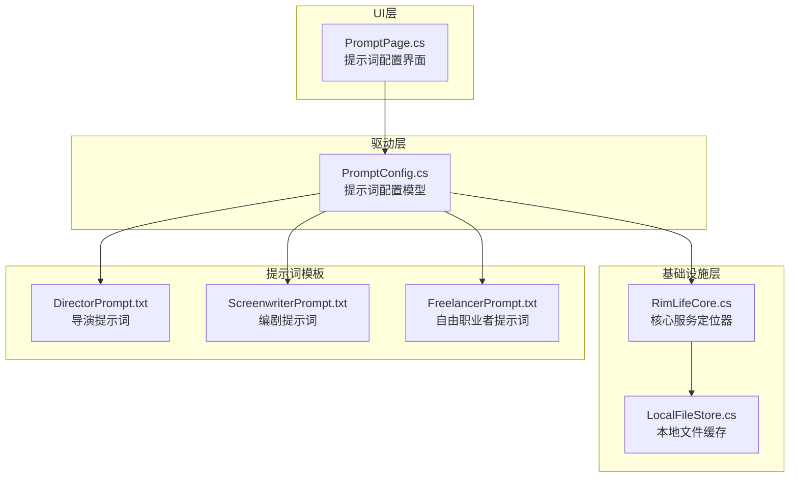
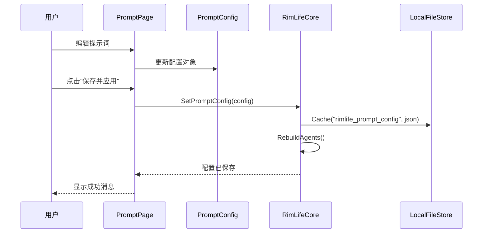
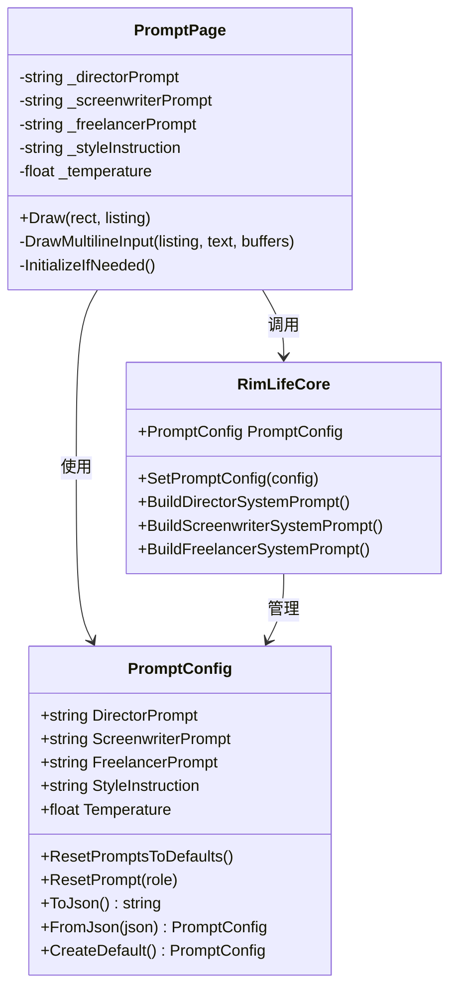
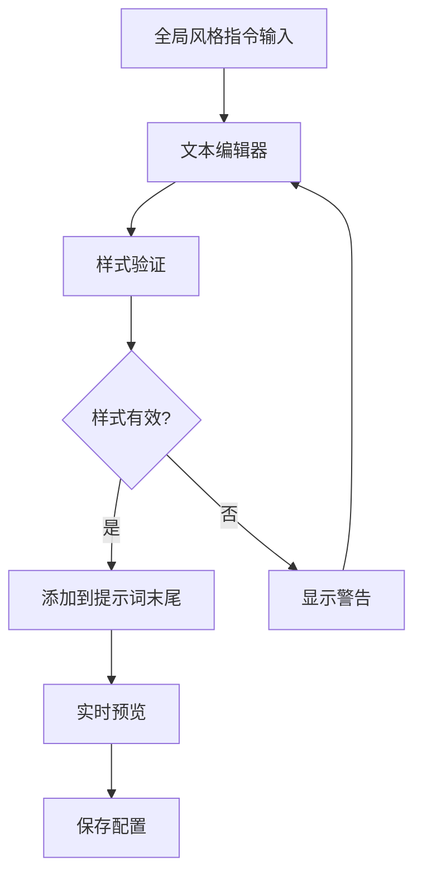
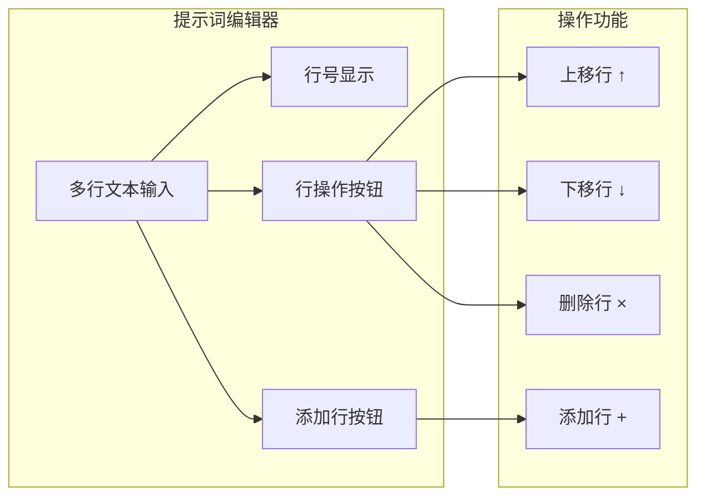
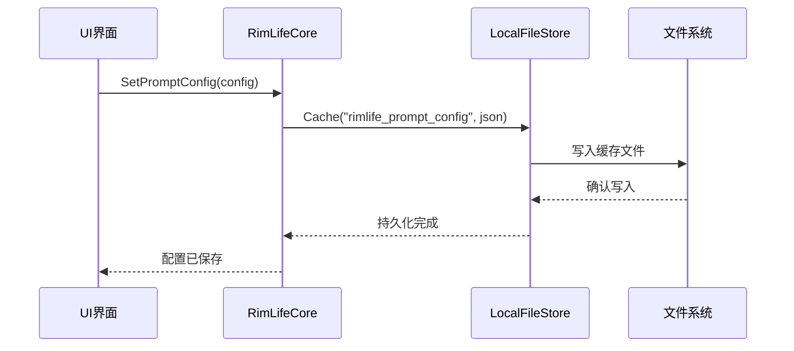
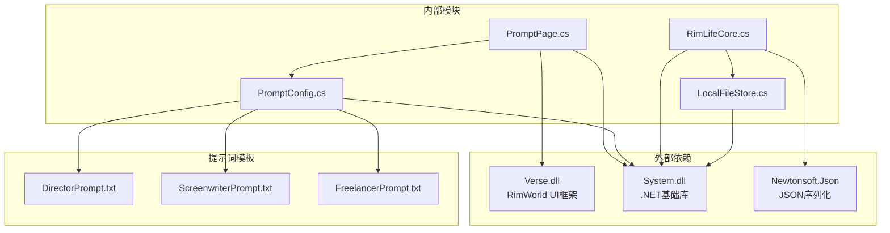

# 提示词配置页面

<cite>
**本文档引用的文件**
- [PromptPage.cs](file://Source/UI/Pages/PromptPage.cs)
- [PromptConfig.cs](file://ext/NPCLife/src/NPCLife/Driver/PromptConfig.cs)
- [RimLifeCore.cs](file://Source/Infrastructure/RimLifeCore.cs)
- [DirectorPrompt.txt](file://Prompts/DirectorPrompt.txt)
- [ScreenwriterPrompt.txt](file://Prompts/ScreenwriterPrompt.txt)
- [FreelancerPrompt.txt](file://Prompts/FreelancerPrompt.txt)
- [ScriptFormat.cs](file://ext/NPCLife/src/NPCLife/Framework/Script/ScriptFormat.cs)
- [WorkspaceImpl.cs](file://ext/NPCLife/src/NPCLife/Workspace/WorkspaceImpl.cs)
- [LocalFileStore.cs](file://Source/Infrastructure/LocalFileStore.cs)
- [LlmConfig.cs](file://ext/NPCLife/src/NPCLife/Framework/Llm/LlmConfig.cs)
</cite>

## 目录
1. [简介](#简介)
2. [项目结构](#项目结构)
3. [核心组件](#核心组件)
4. [架构概览](#架构概览)
5. [详细组件分析](#详细组件分析)
6. [依赖关系分析](#依赖关系分析)
7. [性能考虑](#性能考虑)
8. [故障排除指南](#故障排除指南)
9. [结论](#结论)

## 简介
提示词配置页面是 RimLife 系统中用于编辑和管理 AI 角色提示词的核心界面。该页面支持导演、编剧和自由职业者三种专用提示词模板的编辑，提供全局风格指令设置，并允许用户调整 LLM 采样参数。系统采用"缓存即真相"的设计理念，所有提示词以缓存数据为准，默认值从嵌入资源文件加载。

## 项目结构
提示词配置功能分布在多个层次中：

**图表来源**
- [PromptPage.cs:1-288](file://Source/UI/Pages/PromptPage.cs#L1-L288)
- [PromptConfig.cs:1-164](file://ext/NPCLife/src/NPCLife/Driver/PromptConfig.cs#L1-L164)
- [RimLifeCore.cs:1-800](file://Source/Infrastructure/RimLifeCore.cs#L1-L800)

**章节来源**
- [PromptPage.cs:1-288](file://Source/UI/Pages/PromptPage.cs#L1-L288)
- [PromptConfig.cs:1-164](file://ext/NPCLife/src/NPCLife/Driver/PromptConfig.cs#L1-L164)

## 核心组件
提示词配置系统由以下核心组件构成：

### 提示词配置模型
- **PromptConfig**: 纯 POCO 数据模型，包含三个角色的提示词和全局风格指令
- **默认提示词加载**: 从嵌入资源文件懒加载默认提示词
- **序列化支持**: 支持 JSON 序列化和反序列化

### UI 界面组件
- **PromptPage**: 主要配置界面，提供多行文本编辑器
- **样式指令编辑**: 全局风格指令的文本编辑功能
- **参数控制**: Temperature 温度参数的滑块控制

### 系统集成组件
- **RimLifeCore**: 核心服务定位器，管理配置的持久化和应用
- **本地缓存**: 使用 LocalFileStore 进行配置数据的持久化存储

**章节来源**
- [PromptConfig.cs:14-164](file://ext/NPCLife/src/NPCLife/Driver/PromptConfig.cs#L14-L164)
- [PromptPage.cs:13-164](file://Source/UI/Pages/PromptPage.cs#L13-L164)
- [RimLifeCore.cs:89-114](file://Source/Infrastructure/RimLifeCore.cs#L89-L114)

## 架构概览

**图表来源**
- [PromptPage.cs:121-136](file://Source/UI/Pages/PromptPage.cs#L121-L136)
- [RimLifeCore.cs:106-114](file://Source/Infrastructure/RimLifeCore.cs#L106-L114)
- [LocalFileStore.cs:32-38](file://Source/Infrastructure/LocalFileStore.cs#L32-L38)

系统采用分层架构设计，UI 层负责用户交互，驱动层处理业务逻辑，基础设施层提供持久化支持。

## 详细组件分析

### 提示词模板系统

**图表来源**
- [PromptConfig.cs:14-164](file://ext/NPCLife/src/NPCLife/Driver/PromptConfig.cs#L14-L164)
- [PromptPage.cs:13-164](file://Source/UI/Pages/PromptPage.cs#L13-L164)
- [RimLifeCore.cs:89-826](file://Source/Infrastructure/RimLifeCore.cs#L89-L826)

### 采样参数管理系统

系统提供以下采样参数调整功能：

#### Temperature 参数
- **范围**: 0.0 到 2.0
- **默认值**: 0.7
- **影响**: 越低越确定，越高越有创意
- **UI 控件**: 水平滑块，精度两位小数

#### 其他采样参数
虽然当前界面主要展示 Temperature 参数，但系统架构支持其他 LLM 采样参数的扩展。

**章节来源**
- [PromptPage.cs:40-52](file://Source/UI/Pages/PromptPage.cs#L40-L52)
- [PromptConfig.cs:72-73](file://ext/NPCLife/src/NPCLife/Driver/PromptConfig.cs#L72-L73)

### 全局风格指令系统

**图表来源**
- [PromptPage.cs:54-60](file://Source/UI/Pages/PromptPage.cs#L54-L60)
- [RimLifeCore.cs:817-826](file://Source/Infrastructure/RimLifeCore.cs#L817-L826)

全局风格指令具有以下特性：
- 运行时自动追加到所有 Agent 的提示词末尾
- 支持多行文本编辑
- 实时预览效果

**章节来源**
- [PromptPage.cs:54-60](file://Source/UI/Pages/PromptPage.cs#L54-L60)
- [RimLifeCore.cs:817-826](file://Source/Infrastructure/RimLifeCore.cs#L817-L826)

### 角色专用提示词模板

系统为三种 AI 角色提供专用提示词模板：

#### 导演 Agent (Director)
- **职责**: 事件审查、剧情线选择、工作空间路由
- **核心功能**: 事件路由、工作空间管理
- **模板位置**: [DirectorPrompt.txt](file://Prompts/DirectorPrompt.txt)

#### 编剧 Agent (Screenwriter)
- **职责**: 事件审查、上下文获取、台词撰写
- **核心功能**: 台词输出、轮次管理
- **模板位置**: [ScreenwriterPrompt.txt](file://Prompts/ScreenwriterPrompt.txt)

#### 自由职业者 Agent (Freelancer)
- **职责**: 突发事件处理、独立任务执行
- **核心功能**: 快速响应、临时任务
- **模板位置**: [FreelancerPrompt.txt](file://Prompts/FreelancerPrompt.txt)

**章节来源**
- [DirectorPrompt.txt:1-17](file://Prompts/DirectorPrompt.txt#L1-L17)
- [ScreenwriterPrompt.txt:1-16](file://Prompts/ScreenwriterPrompt.txt#L1-L16)
- [FreelancerPrompt.txt:1-17](file://Prompts/FreelancerPrompt.txt#L1-L17)

### 提示词编辑界面

**图表来源**
- [PromptPage.cs:170-285](file://Source/UI/Pages/PromptPage.cs#L170-L285)

界面提供以下编辑功能：
- 行号显示和高亮
- 行级操作：上移、下移、删除
- 动态行数调整
- 实时状态反馈

**章节来源**
- [PromptPage.cs:170-285](file://Source/UI/Pages/PromptPage.cs#L170-L285)

### 配置持久化机制

**图表来源**
- [RimLifeCore.cs:106-114](file://Source/Infrastructure/RimLifeCore.cs#L106-L114)
- [LocalFileStore.cs:32-38](file://Source/Infrastructure/LocalFileStore.cs#L32-L38)

系统采用以下持久化策略：
- JSON 格式序列化
- 按存档 ID 命名的缓存文件
- 线程安全的缓存访问

**章节来源**
- [RimLifeCore.cs:867-885](file://Source/Infrastructure/RimLifeCore.cs#L867-L885)
- [LocalFileStore.cs:94-141](file://Source/Infrastructure/LocalFileStore.cs#L94-L141)

## 依赖关系分析

**图表来源**
- [PromptPage.cs:1-6](file://Source/UI/Pages/PromptPage.cs#L1-L6)
- [PromptConfig.cs:1-6](file://ext/NPCLife/src/NPCLife/Driver/PromptConfig.cs#L1-L6)

系统依赖关系特点：
- 最小外部依赖：仅依赖 RimWorld UI 框架
- 内部模块松耦合设计
- 配置数据模型无外部依赖

**章节来源**
- [PromptPage.cs:1-6](file://Source/UI/Pages/PromptPage.cs#L1-L6)
- [PromptConfig.cs:1-6](file://ext/NPCLife/src/NPCLife/Driver/PromptConfig.cs#L1-L6)

## 性能考虑

### 提示词构建性能
- **懒加载策略**: 默认提示词按需加载，避免启动时的 I/O 开销
- **字符串拼接优化**: 使用 StringBuilder 进行提示词构建
- **缓存机制**: 避免重复的模板文件读取

### UI 响应性能
- **增量更新**: 仅在保存时重建 Agent
- **异步操作**: 配置持久化在后台线程执行
- **内存管理**: 及时释放不再使用的 Agent 实例

### LLM 调用优化
- **温度参数**: 通过 Temperature 控制输出质量与稳定性平衡
- **会话复用**: Agent 实例复用减少初始化开销
- **批处理支持**: 支持多行台词并行输出

## 故障排除指南

### 常见问题及解决方案

#### 配置无法保存
**症状**: 点击保存后配置未生效
**原因**: 
- 缓存文件写入失败
- 权限不足
- 存档 ID 无效

**解决方法**:
1. 检查 RimLife 缓存目录权限
2. 确认游戏存档正常加载
3. 重启游戏后重试

#### 提示词模板加载失败
**症状**: 提示词显示为空白
**原因**:
- 嵌入资源文件缺失
- Assembly 加载异常

**解决方法**:
1. 重新安装 Mod
2. 检查日志文件中的异常信息
3. 验证文件完整性

#### UI 界面显示异常
**症状**: 编辑器控件显示错位
**原因**:
- UI 布局计算错误
- 字体渲染问题

**解决方法**:
1. 调整游戏 UI 缩放设置
2. 重启游戏客户端
3. 检查 RimWorld 版本兼容性

**章节来源**
- [LocalFileStore.cs:120-141](file://Source/Infrastructure/LocalFileStore.cs#L120-L141)
- [RimLifeCore.cs:867-885](file://Source/Infrastructure/RimLifeCore.cs#L867-L885)

## 结论

提示词配置页面提供了完整的 AI 角色提示词管理功能，具有以下优势：

### 设计优势
- **模块化设计**: 清晰的分层架构便于维护和扩展
- **持久化机制**: 安全可靠的配置存储方案
- **用户体验**: 直观的编辑界面和实时反馈

### 功能特性
- 支持三种专用提示词模板
- 全局风格指令定制
- LLM 采样参数精细控制
- 实时配置预览和应用

### 最佳实践建议
1. **渐进式调整**: 建议逐步调整 Temperature 参数，观察输出质量变化
2. **模板版本管理**: 使用全局风格指令替代直接修改模板，便于版本追踪
3. **定期备份**: 重要配置建议定期导出备份
4. **性能监控**: 关注 Token 消耗和响应时间指标

该系统为 RimWorld 的 AI 叙事功能提供了强大的配置支持，通过合理的提示词设计可以显著提升 AI 输出的质量和稳定性。