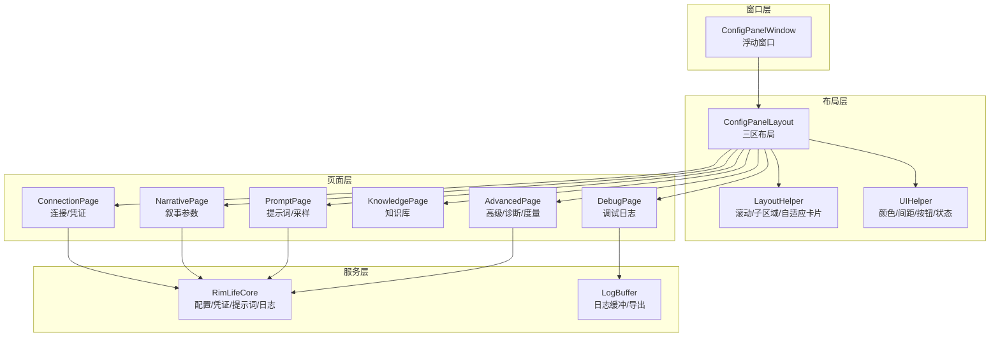
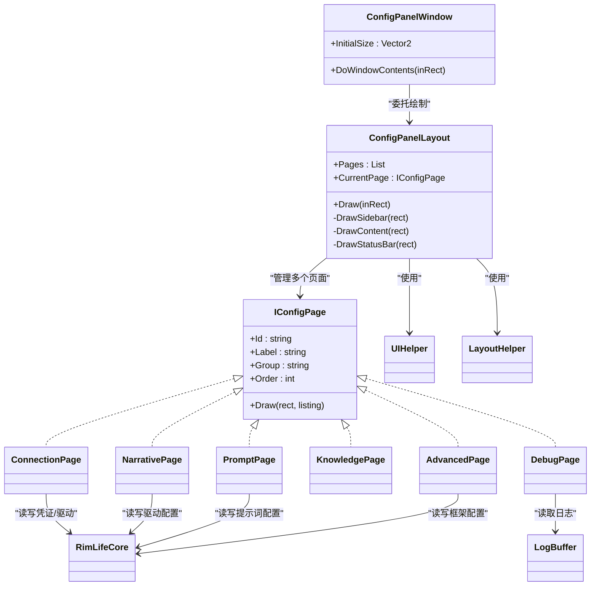
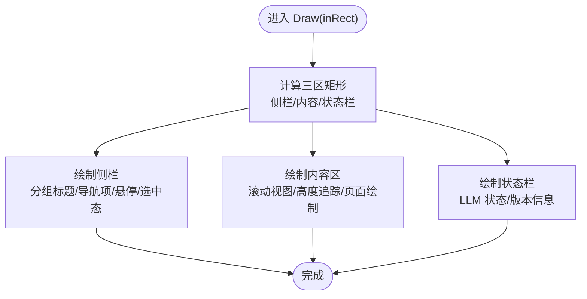
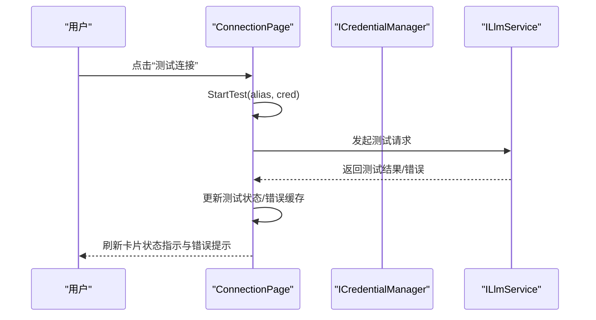
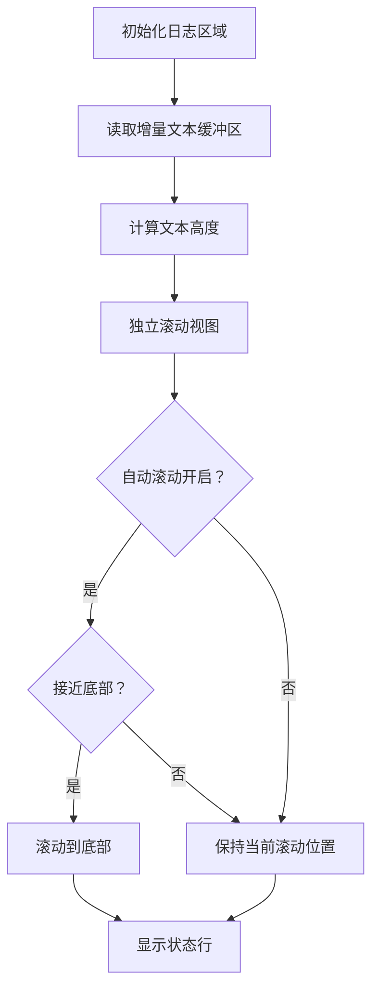
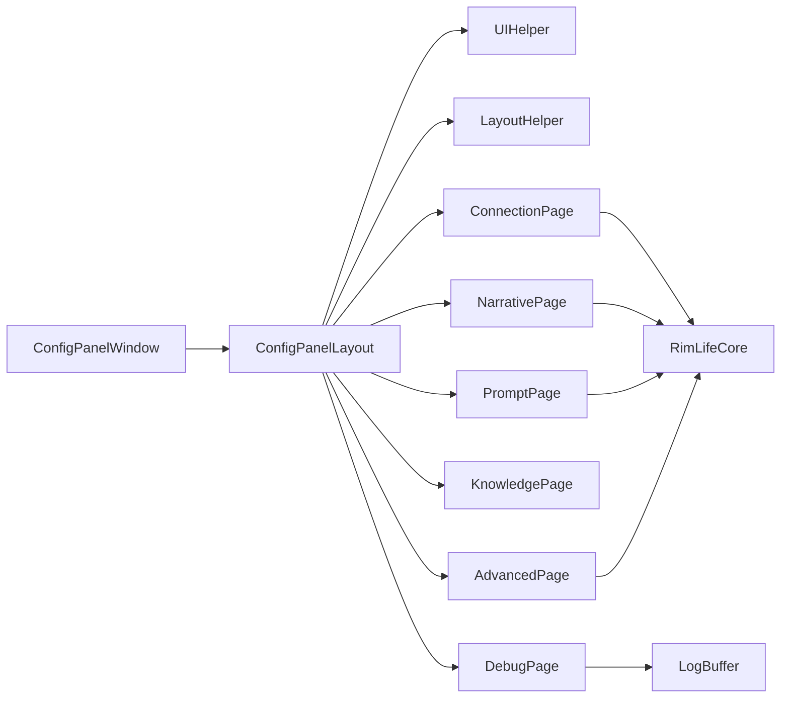

# 用户界面系统

<cite>
**本文引用的文件**
- [ConfigPanelWindow.cs](file://Source/UI/ConfigPanelWindow.cs)
- [ConfigPanelLayout.cs](file://Source/UI/ConfigPanelLayout.cs)
- [IConfigPage.cs](file://Source/UI/Pages/IConfigPage.cs)
- [ConnectionPage.cs](file://Source/UI/Pages/ConnectionPage.cs)
- [NarrativePage.cs](file://Source/UI/Pages/NarrativePage.cs)
- [PromptPage.cs](file://Source/UI/Pages/PromptPage.cs)
- [KnowledgePage.cs](file://Source/UI/Pages/KnowledgePage.cs)
- [AdvancedPage.cs](file://Source/UI/Pages/AdvancedPage.cs)
- [DebugPage.cs](file://Source/UI/Pages/DebugPage.cs)
- [UIHelper.cs](file://Source/UI/Helpers/UIHelper.cs)
- [LayoutHelper.cs](file://Source/UI/Helpers/LayoutHelper.cs)
- [LogBuffer.cs](file://Source/UI/LogBuffer.cs)
- [RimLifeCore.cs](file://Source/Infrastructure/RimLifeCore.cs)
</cite>

## 目录
1. [简介](#简介)
2. [项目结构](#项目结构)
3. [核心组件](#核心组件)
4. [架构总览](#架构总览)
5. [详细组件分析](#详细组件分析)
6. [依赖关系分析](#依赖关系分析)
7. [性能考量](#性能考量)
8. [故障排查指南](#故障排查指南)
9. [结论](#结论)
10. [附录](#附录)

## 简介
本文件面向 RimLife 的用户界面系统，聚焦于配置面板的设计与实现，涵盖三区布局（侧栏导航、内容区、状态栏）、页面导航机制、以及各配置页面的功能与使用方式。文档还解释了 UI 组件的视觉外观、行为与交互模式，响应式与可访问性实践，样式与主题支持，跨浏览器兼容性与性能优化，并给出组件组合与集成建议。

## 项目结构
UI 系统采用 RimWorld/Verse 的 IMGUI 框架，以“浮动窗口 + 共享布局”的方式实现 Mod 设置与调试功能。核心由以下层次构成：
- 窗口层：浮动窗口承载整个配置面板
- 布局层：共享三区布局，负责侧栏、内容区、状态栏的绘制与滚动
- 页面层：实现具体配置页（连接、叙事、提示词、知识库、高级、调试）
- 辅助层：UI 帮助器、布局辅助器、日志缓冲区
- 服务层：核心服务定位器，提供配置、凭证、提示词、日志等能力

图表来源
- [ConfigPanelWindow.cs:10-27](file://Source/UI/ConfigPanelWindow.cs#L10-L27)
- [ConfigPanelLayout.cs:60-69](file://Source/UI/ConfigPanelLayout.cs#L60-L69)
- [ConnectionPage.cs:22-90](file://Source/UI/Pages/ConnectionPage.cs#L22-L90)
- [NarrativePage.cs:14-157](file://Source/UI/Pages/NarrativePage.cs#L14-L157)
- [PromptPage.cs:13-152](file://Source/UI/Pages/PromptPage.cs#L13-L152)
- [KnowledgePage.cs:10-48](file://Source/UI/Pages/KnowledgePage.cs#L10-L48)
- [AdvancedPage.cs:13-179](file://Source/UI/Pages/AdvancedPage.cs#L13-L179)
- [DebugPage.cs:14-79](file://Source/UI/Pages/DebugPage.cs#L14-L79)
- [UIHelper.cs:9-463](file://Source/UI/Helpers/UIHelper.cs#L9-L463)
- [LayoutHelper.cs:11-161](file://Source/UI/Helpers/LayoutHelper.cs#L11-L161)
- [LogBuffer.cs:39-141](file://Source/UI/LogBuffer.cs#L39-L141)
- [RimLifeCore.cs:24-200](file://Source/Infrastructure/RimLifeCore.cs#L24-L200)

章节来源
- [ConfigPanelWindow.cs:10-27](file://Source/UI/ConfigPanelWindow.cs#L10-L27)
- [ConfigPanelLayout.cs:40-54](file://Source/UI/ConfigPanelLayout.cs#L40-L54)

## 核心组件
- 浮动窗口：承载配置面板，支持拖拽、调整大小、点击外部关闭
- 共享布局：三区布局（侧栏导航、内容区、状态栏），统一绘制与滚动
- 页面接口：IConfigPage 规范页面职责，便于扩展新页面
- 页面实现：连接、叙事、提示词、知识库、高级、调试六个页面
- UI 辅助：颜色、间距、按钮、状态消息、文本高度补偿、分段选择器等
- 布局辅助：滚动高度追踪、子区域分配、自适应卡片
- 日志缓冲：终端风格日志查看器，支持复制与导出

章节来源
- [ConfigPanelWindow.cs:10-27](file://Source/UI/ConfigPanelWindow.cs#L10-L27)
- [ConfigPanelLayout.cs:15-54](file://Source/UI/ConfigPanelLayout.cs#L15-L54)
- [IConfigPage.cs:10-28](file://Source/UI/Pages/IConfigPage.cs#L10-L28)
- [UIHelper.cs:9-463](file://Source/UI/Helpers/UIHelper.cs#L9-L463)
- [LayoutHelper.cs:11-161](file://Source/UI/Helpers/LayoutHelper.cs#L11-L161)
- [LogBuffer.cs:39-141](file://Source/UI/LogBuffer.cs#L39-L141)

## 架构总览
配置面板采用“窗口 + 布局 + 页面 + 辅助”的分层架构。窗口负责生命周期与尺寸，布局负责三区划分与滚动，页面负责各自业务逻辑，辅助模块提供统一的视觉与交互规范。

图表来源
- [ConfigPanelWindow.cs:10-27](file://Source/UI/ConfigPanelWindow.cs#L10-L27)
- [ConfigPanelLayout.cs:31-54](file://Source/UI/ConfigPanelLayout.cs#L31-L54)
- [IConfigPage.cs:10-28](file://Source/UI/Pages/IConfigPage.cs#L10-L28)
- [ConnectionPage.cs:22-90](file://Source/UI/Pages/ConnectionPage.cs#L22-L90)
- [NarrativePage.cs:14-157](file://Source/UI/Pages/NarrativePage.cs#L14-L157)
- [PromptPage.cs:13-152](file://Source/UI/Pages/PromptPage.cs#L13-L152)
- [KnowledgePage.cs:10-48](file://Source/UI/Pages/KnowledgePage.cs#L10-L48)
- [AdvancedPage.cs:13-179](file://Source/UI/Pages/AdvancedPage.cs#L13-L179)
- [DebugPage.cs:14-79](file://Source/UI/Pages/DebugPage.cs#L14-L79)
- [UIHelper.cs:9-463](file://Source/UI/Helpers/UIHelper.cs#L9-L463)
- [LayoutHelper.cs:11-161](file://Source/UI/Helpers/LayoutHelper.cs#L11-L161)
- [LogBuffer.cs:39-141](file://Source/UI/LogBuffer.cs#L39-L141)
- [RimLifeCore.cs:24-200](file://Source/Infrastructure/RimLifeCore.cs#L24-L200)

## 详细组件分析

### 三区布局实现
- 侧栏导航：固定宽度，按组分组显示，支持悬停高亮与选中强调；根据页面分组统计决定是否显示组标题
- 内容区：统一背景色，使用滚动视图与高度追踪器，确保内容不被截断；页面绘制后测量实际高度，供下一帧使用
- 状态栏：左侧显示 LLM 状态与会话 Token，右侧显示版本信息；状态来源于核心服务定位器的凭证管理器

图表来源
- [ConfigPanelLayout.cs:60-69](file://Source/UI/ConfigPanelLayout.cs#L60-L69)
- [ConfigPanelLayout.cs:75-144](file://Source/UI/ConfigPanelLayout.cs#L75-L144)
- [ConfigPanelLayout.cs:150-187](file://Source/UI/ConfigPanelLayout.cs#L150-L187)
- [ConfigPanelLayout.cs:193-214](file://Source/UI/ConfigPanelLayout.cs#L193-L214)

章节来源
- [ConfigPanelLayout.cs:15-54](file://Source/UI/ConfigPanelLayout.cs#L15-L54)
- [ConfigPanelLayout.cs:60-69](file://Source/UI/ConfigPanelLayout.cs#L60-L69)
- [ConfigPanelLayout.cs:75-144](file://Source/UI/ConfigPanelLayout.cs#L75-L144)
- [ConfigPanelLayout.cs:150-187](file://Source/UI/ConfigPanelLayout.cs#L150-L187)
- [ConfigPanelLayout.cs:193-214](file://Source/UI/ConfigPanelLayout.cs#L193-L214)

### 页面导航系统
- 页面集合：构造时注册六个页面，按 Order 排序；当前页面通过点击侧栏项切换
- 交互细节：选中项高亮并带强调竖条；未选中项悬停显示半透明高亮；切换页面时重置滚动高度追踪
- 分组显示：仅当某组页面数量≥2 时显示组标题；支持快速跳转到任意页面

章节来源
- [ConfigPanelLayout.cs:40-54](file://Source/UI/ConfigPanelLayout.cs#L40-L54)
- [ConfigPanelLayout.cs:75-144](file://Source/UI/ConfigPanelLayout.cs#L75-L144)

### 状态栏设计
- LLM 状态：基于凭证管理器是否存在与激活顺序判断；显示“已配置/未配置”及当前模型简述
- 版本信息：显示当前版本号
- 令牌统计：预留会话 Token 显示位

章节来源
- [ConfigPanelLayout.cs:204-213](file://Source/UI/ConfigPanelLayout.cs#L204-L213)

### 连接页面（LLM 凭证配置）
- 功能概览：凭证列表（展开/收起/编辑/删除）、新增凭证、测试连接、模型发现与选择
- UI 细节：紧凑行显示基本信息；展开后显示 BaseURL、API Key（可隐藏/显示）、当前模型；支持测试状态指示与错误提示
- 模型列表：支持正则搜索、统计摘要、固定高度滚动列表；可多选模型，首个选中模型作为当前模型
- 操作反馈：统一状态消息，错误消息以红色显示并淡出

图表来源
- [ConnectionPage.cs:380-388](file://Source/UI/Pages/ConnectionPage.cs#L380-L388)
- [ConnectionPage.cs:365-371](file://Source/UI/Pages/ConnectionPage.cs#L365-L371)

章节来源
- [ConnectionPage.cs:22-90](file://Source/UI/Pages/ConnectionPage.cs#L22-L90)
- [ConnectionPage.cs:170-222](file://Source/UI/Pages/ConnectionPage.cs#L170-L222)
- [ConnectionPage.cs:296-409](file://Source/UI/Pages/ConnectionPage.cs#L296-L409)
- [ConnectionPage.cs:413-502](file://Source/UI/Pages/ConnectionPage.cs#L413-L502)
- [ConnectionPage.cs:714-772](file://Source/UI/Pages/ConnectionPage.cs#L714-L772)
- [ConnectionPage.cs:774-800](file://Source/UI/Pages/ConnectionPage.cs#L774-L800)

### 叙事页面（代理参数配置）
- 功能概览：导演、Freelancer、编剧三类角色的触发阈值与定时器配置；通用历史缓冲与 Agent 轮次限制
- 交互细节：每个参数支持 +1/-1 与文本输入；保存后立即写入驱动配置并重建 Agent 生效
- 默认值：支持一键重置为默认配置

章节来源
- [NarrativePage.cs:14-157](file://Source/UI/Pages/NarrativePage.cs#L14-L157)
- [NarrativePage.cs:159-174](file://Source/UI/Pages/NarrativePage.cs#L159-L174)
- [NarrativePage.cs:183-218](file://Source/UI/Pages/NarrativePage.cs#L183-L218)

### 提示词页面（系统提示词编辑）
- 功能概览：全局风格指令、导演/编剧/Freelancer 提示词的多行编辑；LLM 采样温度调节
- 交互细节：多行输入支持行号、上下移动、删除、添加行；支持“恢复默认”与“全部恢复默认”
- 应用流程：保存后写入提示词配置并重建 Agent 生效

章节来源
- [PromptPage.cs:13-152](file://Source/UI/Pages/PromptPage.cs#L13-L152)
- [PromptPage.cs:154-164](file://Source/UI/Pages/PromptPage.cs#L154-L164)
- [PromptPage.cs:170-285](file://Source/UI/Pages/PromptPage.cs#L170-L285)

### 知识页面（知识库管理）
- 功能概览：自动学习统计、最近学习记录、重新扫描、导出/导入知识库（占位）
- 交互细节：查看全部词条、重新扫描 GameDef、导出/导入按钮（日志记录）

章节来源
- [KnowledgePage.cs:10-48](file://Source/UI/Pages/KnowledgePage.cs#L10-L48)

### 高级页面（性能配置）
- 功能概览：功能开关（运行时度量、导演/编剧/Freelancer Agent、知识库）、诊断开关（详细日志、工具调用追踪、事件追踪）
- 性能与诊断：运行时度量统计（会话数、Token 输入/输出/缓存命中、工具调用类型、知识库查询批次）
- 配置管理：导出/导入配置（JSON），支持重置默认值
- Agent 状态：实时显示各 Agent 状态

章节来源
- [AdvancedPage.cs:13-179](file://Source/UI/Pages/AdvancedPage.cs#L13-L179)
- [AdvancedPage.cs:181-240](file://Source/UI/Pages/AdvancedPage.cs#L181-L240)

### 调试页面（故障排除工具）
- 功能概览：终端风格日志查看器，支持清空、自动滚动、复制全部、导出日志
- 交互细节：固定高度子区域分配，独立滚动；智能自动滚动（靠近底部时滚动到底部）
- 数据来源：LogBuffer 增量文本缓冲区，支持 RichText 标签与纯文本剥离

图表来源
- [DebugPage.cs:27-79](file://Source/UI/Pages/DebugPage.cs#L27-L79)
- [DebugPage.cs:81-105](file://Source/UI/Pages/DebugPage.cs#L81-L105)
- [DebugPage.cs:107-155](file://Source/UI/Pages/DebugPage.cs#L107-L155)
- [LogBuffer.cs:49-103](file://Source/UI/LogBuffer.cs#L49-L103)

章节来源
- [DebugPage.cs:14-175](file://Source/UI/Pages/DebugPage.cs#L14-L175)
- [LogBuffer.cs:39-141](file://Source/UI/LogBuffer.cs#L39-L141)

## 依赖关系分析
- 窗口依赖布局：窗口仅负责尺寸与生命周期，具体绘制委托给布局
- 布局依赖页面：布局维护页面集合与当前页面，调用页面的 Draw 方法
- 页面依赖核心服务：各页面通过 RimLifeCore 读写配置、凭证、提示词等
- 辅助模块：UIHelper 与 LayoutHelper 为布局与页面提供统一的绘制规范与布局能力
- 日志依赖缓冲：调试页面依赖 LogBuffer 提供日志数据结构与导出能力

图表来源
- [ConfigPanelWindow.cs:10-27](file://Source/UI/ConfigPanelWindow.cs#L10-L27)
- [ConfigPanelLayout.cs:31-54](file://Source/UI/ConfigPanelLayout.cs#L31-L54)
- [UIHelper.cs:9-463](file://Source/UI/Helpers/UIHelper.cs#L9-L463)
- [LayoutHelper.cs:11-161](file://Source/UI/Helpers/LayoutHelper.cs#L11-L161)
- [ConnectionPage.cs:33-34](file://Source/UI/Pages/ConnectionPage.cs#L33-L34)
- [NarrativePage.cs:163](file://Source/UI/Pages/NarrativePage.cs#L163)
- [PromptPage.cs:158](file://Source/UI/Pages/PromptPage.cs#L158)
- [AdvancedPage.cs:189-199](file://Source/UI/Pages/AdvancedPage.cs#L189-L199)
- [DebugPage.cs:44](file://Source/UI/Pages/DebugPage.cs#L44)
- [LogBuffer.cs:39-141](file://Source/UI/LogBuffer.cs#L39-L141)

章节来源
- [RimLifeCore.cs:24-200](file://Source/Infrastructure/RimLifeCore.cs#L24-L200)

## 性能考量
- 滚动高度追踪：使用过估算因子与最小滚动倍数，避免内容截断；双帧收敛减少测量抖动
- 文本高度补偿：针对 CJK 字符高度低估进行补偿，避免自动换行后截断
- 嵌套滚动：通过父 Listing 预留固定高度，确保父 ScrollView 正确包含子区域
- 日志缓冲：增量文本缓冲区与结构化条目分离，支持最大容量限制与重建文本缓冲
- 按钮行布局：统一按钮尺寸与间距，减少布局计算复杂度

章节来源
- [LayoutHelper.cs:21-62](file://Source/UI/Helpers/LayoutHelper.cs#L21-L62)
- [UIHelper.cs:86-92](file://Source/UI/Helpers/UIHelper.cs#L86-L92)
- [UIHelper.cs:316-350](file://Source/UI/Helpers/UIHelper.cs#L316-L350)
- [LogBuffer.cs:49-103](file://Source/UI/LogBuffer.cs#L49-L103)

## 故障排查指南
- LLM 状态异常：检查凭证管理器是否初始化、激活顺序是否为空；查看连接页面的测试状态与错误提示
- 提示词/代理参数未生效：确认保存后是否重建 Agent；检查核心服务定位器的配置写入与冻结流程
- 日志缺失：确认日志监听器是否接入；检查日志缓冲区容量与重建逻辑
- 滚动截断：确认使用高度追踪器与 CJK 高度补偿；检查父 ScrollView 的 viewRect 是否包含子区域

章节来源
- [ConfigPanelLayout.cs:204-213](file://Source/UI/ConfigPanelLayout.cs#L204-L213)
- [ConnectionPage.cs:365-371](file://Source/UI/Pages/ConnectionPage.cs#L365-L371)
- [NarrativePage.cs:131-136](file://Source/UI/Pages/NarrativePage.cs#L131-L136)
- [AdvancedPage.cs:78-87](file://Source/UI/Pages/AdvancedPage.cs#L78-L87)
- [LogBuffer.cs:60-68](file://Source/UI/LogBuffer.cs#L60-L68)

## 结论
本 UI 系统通过三区布局与页面接口实现了清晰的职责分离与良好的扩展性。连接、叙事、提示词、知识库、高级与调试六大页面覆盖了从基础配置到性能诊断的完整链路。通过统一的 UI 辅助与布局辅助，系统在视觉一致性、交互流畅性与性能稳定性方面均具备良好表现。建议后续在主题与可访问性方面进一步完善，以提升跨平台与无障碍体验。

## 附录

### 视觉外观与交互模式
- 颜色体系：侧栏/内容/状态栏背景、选中项高亮、分割线、危险操作色等
- 间距体系：微/小/中/大间距常量，保证页面层级清晰
- 按钮体系：统一高度与多种宽度，支持按钮行布局与分段选择器
- 状态消息：统一淡出效果，错误消息以红色显示

章节来源
- [UIHelper.cs:98-109](file://Source/UI/Helpers/UIHelper.cs#L98-L109)
- [UIHelper.cs:15-26](file://Source/UI/Helpers/UIHelper.cs#L15-L26)
- [UIHelper.cs:316-350](file://Source/UI/Helpers/UIHelper.cs#L316-L350)
- [UIHelper.cs:425-452](file://Source/UI/Helpers/UIHelper.cs#L425-L452)

### 响应式设计与可访问性
- 响应式：三区布局在不同窗口尺寸下保持比例；滚动区域自适应内容高度
- 可访问性：颜色对比度满足基本要求；文本高度补偿避免截断；按钮行布局减少布局复杂度

章节来源
- [ConfigPanelLayout.cs:60-69](file://Source/UI/ConfigPanelLayout.cs#L60-L69)
- [UIHelper.cs:86-92](file://Source/UI/Helpers/UIHelper.cs#L86-L92)

### 样式自定义与主题支持
- 颜色常量集中管理，便于替换主题色
- 布局常量集中管理，便于调整间距与尺寸
- 建议：提供主题切换接口，允许外部 mod 或用户自定义颜色与尺寸

章节来源
- [UIHelper.cs:98-109](file://Source/UI/Helpers/UIHelper.cs#L98-L109)
- [UIHelper.cs:15-26](file://Source/UI/Helpers/UIHelper.cs#L15-L26)

### 跨浏览器兼容性与性能优化
- 跨浏览器：基于 Unity/Verse 的 IMGUI，天然跨平台
- 性能优化：滚动高度追踪、CJK 高度补偿、日志缓冲区容量控制、双帧收敛测量

章节来源
- [LayoutHelper.cs:21-62](file://Source/UI/Helpers/LayoutHelper.cs#L21-L62)
- [UIHelper.cs:86-92](file://Source/UI/Helpers/UIHelper.cs#L86-L92)
- [LogBuffer.cs:49-103](file://Source/UI/LogBuffer.cs#L49-L103)

### 组件组合模式与集成方法
- 页面组合：通过 IConfigPage 接口统一管理，新增页面只需实现接口并加入布局页面集合
- 与核心服务集成：页面通过 RimLifeCore 读写配置，保存后触发重建或冻结流程
- 与日志系统集成：调试页面通过 LogBuffer 读取日志，支持复制与导出

章节来源
- [IConfigPage.cs:10-28](file://Source/UI/Pages/IConfigPage.cs#L10-L28)
- [ConfigPanelLayout.cs:40-54](file://Source/UI/ConfigPanelLayout.cs#L40-L54)
- [RimLifeCore.cs:120-142](file://Source/Infrastructure/RimLifeCore.cs#L120-L142)
- [LogBuffer.cs:39-141](file://Source/UI/LogBuffer.cs#L39-L141)