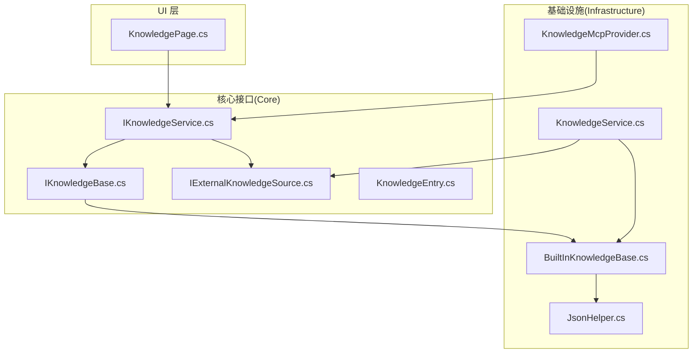
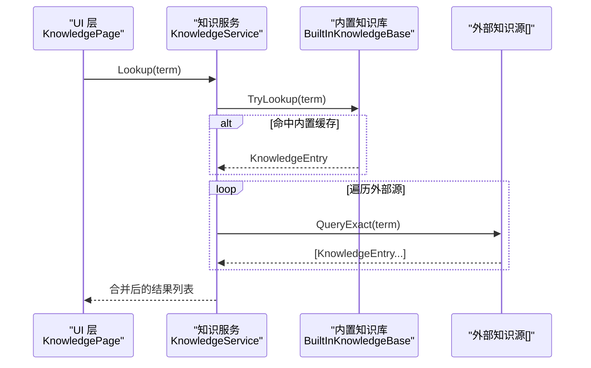
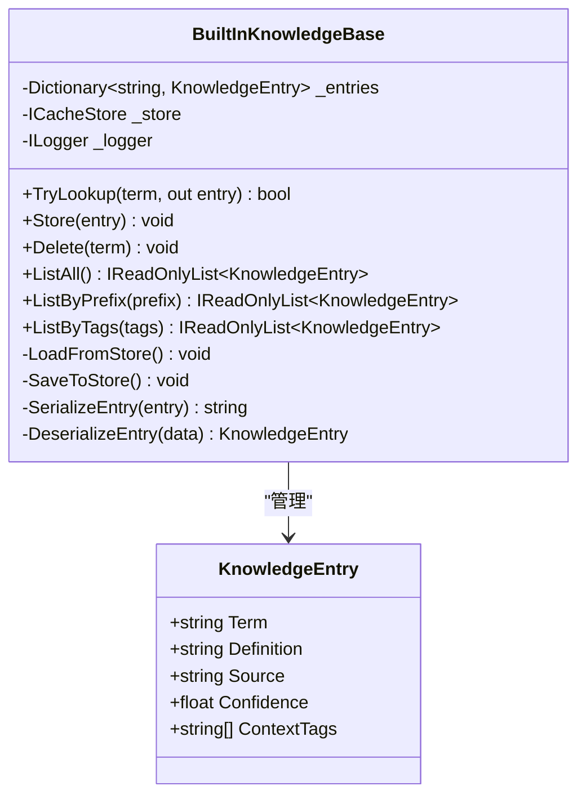
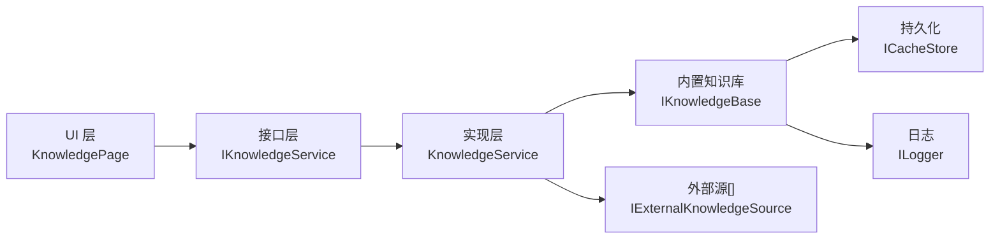

# 知识页面

<cite>
**本文档引用的文件**
- [KnowledgePage.cs](file://Source/UI/Pages/KnowledgePage.cs)
- [KnowledgeService.cs](file://ext/NPCLife/src/NPCLife/Core/KnowledgeService.cs)
- [IKnowledgeService.cs](file://ext/NPCLife/src/NPCLife/Core/IKnowledgeService.cs)
- [IKnowledgeBase.cs](file://ext/NPCLife/src/NPCLife/Core/IKnowledgeBase.cs)
- [IExternalKnowledgeSource.cs](file://ext/NPCLife/src/NPCLife/Core/IExternalKnowledgeSource.cs)
- [BuiltInKnowledgeBase.cs](file://ext/NPCLife/src/NPCLife/Infrastructure/Knowledge/BuiltInKnowledgeBase.cs)
- [KnowledgeEntry.cs](file://ext/NPCLife/src/NPCLife/Core/KnowledgeEntry.cs)
- [KnowledgeMcpProvider.cs](file://ext/NPCLife/src/NPCLife/Infrastructure/Mcp/KnowledgeMcpProvider.cs)
- [JsonHelper.cs](file://ext/NPCLife/src/NPCLife/Framework/JsonHelper.cs)
</cite>

## 目录
1. [简介](#简介)
2. [项目结构](#项目结构)
3. [核心组件](#核心组件)
4. [架构总览](#架构总览)
5. [详细组件分析](#详细组件分析)
6. [依赖关系分析](#依赖关系分析)
7. [性能考量](#性能考量)
8. [故障排查指南](#故障排查指南)
9. [结论](#结论)
10. [附录](#附录)

## 简介
本页面围绕“知识页面”展开，系统性阐述知识库管理的完整功能与使用方式，涵盖：
- 知识条目的增删改查操作与知识服务的集成方式
- 内置知识库的使用方法与持久化机制
- 自定义知识条目的创建流程与知识权重（信心度）设置
- 知识检索算法、相关性评分与知识更新策略
- 知识导入导出、备份恢复与版本控制建议
- 知识组织最佳实践与质量评估方法
- 知识系统对叙事质量提升的作用与使用技巧

## 项目结构
知识模块位于扩展工程 ext/NPCLife 中，采用清晰的分层设计：
- Core 层：定义知识服务接口与数据模型（IKnowledgeService、IKnowledgeBase、IExternalKnowledgeSource、KnowledgeEntry）
- Infrastructure 层：内置知识库实现 BuiltInKnowledgeBase，负责本地持久化与查询
- MCP 集成：KnowledgeMcpProvider 提供知识查询的 MCP 工具能力
- UI 层：KnowledgePage 为知识页面入口，承载用户交互与展示

图表来源
- [KnowledgePage.cs](file://Source/UI/Pages/KnowledgePage.cs)
- [IKnowledgeService.cs](file://ext/NPCLife/src/NPCLife/Core/IKnowledgeService.cs)
- [IKnowledgeBase.cs](file://ext/NPCLife/src/NPCLife/Core/IKnowledgeBase.cs)
- [IExternalKnowledgeSource.cs](file://ext/NPCLife/src/NPCLife/Core/IExternalKnowledgeSource.cs)
- [BuiltInKnowledgeBase.cs](file://ext/NPCLife/src/NPCLife/Infrastructure/Knowledge/BuiltInKnowledgeBase.cs)
- [KnowledgeService.cs](file://ext/NPCLife/src/NPCLife/Core/KnowledgeService.cs)
- [KnowledgeMcpProvider.cs](file://ext/NPCLife/src/NPCLife/Infrastructure/Mcp/KnowledgeMcpProvider.cs)
- [JsonHelper.cs](file://ext/NPCLife/src/NPCLife/Framework/JsonHelper.cs)

章节来源
- [KnowledgePage.cs](file://Source/UI/Pages/KnowledgePage.cs)
- [IKnowledgeService.cs](file://ext/NPCLife/src/NPCLife/Core/IKnowledgeService.cs)
- [IKnowledgeBase.cs](file://ext/NPCLife/src/NPCLife/Core/IKnowledgeBase.cs)
- [IExternalKnowledgeSource.cs](file://ext/NPCLife/src/NPCLife/Core/IExternalKnowledgeSource.cs)
- [BuiltInKnowledgeBase.cs](file://ext/NPCLife/src/NPCLife/Infrastructure/Knowledge/BuiltInKnowledgeBase.cs)
- [KnowledgeService.cs](file://ext/NPCLife/src/NPCLife/Core/KnowledgeService.cs)
- [KnowledgeMcpProvider.cs](file://ext/NPCLife/src/NPCLife/Infrastructure/Mcp/KnowledgeMcpProvider.cs)
- [JsonHelper.cs](file://ext/NPCLife/src/NPCLife/Framework/JsonHelper.cs)

## 核心组件
- 知识服务接口 IKnowledgeService：统一对外知识能力，支持查询、存储、删除、全量与按标签/前缀列举
- 内置知识库 IKnowledgeBase：唯一可写实现 BuiltInKnowledgeBase，提供 O(1) 字典查找、持久化与序列化
- 外部知识源 IExternalKnowledgeSource：只读接口，用于接入游戏定义、百科、RAG 等来源
- 知识条目 KnowledgeEntry：包含词条名、释义、来源、信心度与上下文标签
- 默认知识服务实现 KnowledgeService：聚合内置缓存与多个外部源，并行查询返回同名词条的全部释义
- MCP 集成 KnowledgeMcpProvider：将知识查询能力暴露为 MCP 工具，供 Agent 使用

章节来源
- [IKnowledgeService.cs](file://ext/NPCLife/src/NPCLife/Core/IKnowledgeService.cs)
- [IKnowledgeBase.cs](file://ext/NPCLife/src/NPCLife/Core/IKnowledgeBase.cs)
- [IExternalKnowledgeSource.cs](file://ext/NPCLife/src/NPCLife/Core/IExternalKnowledgeSource.cs)
- [KnowledgeEntry.cs](file://ext/NPCLife/src/NPCLife/Core/KnowledgeEntry.cs)
- [KnowledgeService.cs](file://ext/NPCLife/src/NPCLife/Core/KnowledgeService.cs)
- [BuiltInKnowledgeBase.cs](file://ext/NPCLife/src/NPCLife/Infrastructure/Knowledge/BuiltInKnowledgeBase.cs)
- [KnowledgeMcpProvider.cs](file://ext/NPCLife/src/NPCLife/Infrastructure/Mcp/KnowledgeMcpProvider.cs)

## 架构总览
知识系统以“服务聚合 + 内置可写 + 外部只读”的模式运行：
- UI 通过 IKnowledgeService 访问知识能力
- KnowledgeService 并行查询内置缓存与外部源，汇总结果
- BuiltInKnowledgeBase 负责本地持久化与 O(1) 查找
- 外部源通过 IExternalKnowledgeSource 注入，统一标注来源
- MCP 提供工具化调用，便于 Agent 在叙事流程中检索知识

图表来源
- [KnowledgePage.cs](file://Source/UI/Pages/KnowledgePage.cs)
- [KnowledgeService.cs](file://ext/NPCLife/src/NPCLife/Core/KnowledgeService.cs)
- [BuiltInKnowledgeBase.cs](file://ext/NPCLife/src/NPCLife/Infrastructure/Knowledge/BuiltInKnowledgeBase.cs)
- [IExternalKnowledgeSource.cs](file://ext/NPCLife/src/NPCLife/Core/IExternalKnowledgeSource.cs)

## 详细组件分析

### 组件一：内置知识库 BuiltInKnowledgeBase
- 设计要点
  - 唯一可写实现，基于字典存储，大小写不敏感键
  - 支持 O(1) 字典查找，无容量限制与淘汰策略
  - 通过 ICacheStore 进行持久化，加载时反序列化，保存时序列化为 JSON 数组
- 关键能力
  - TryLookup：按词条精确查询
  - Store：覆盖式存储；若定义为空则仅建立索引
  - Delete：按词条删除
  - ListAll/ListByPrefix/ListByTags：全量、前缀与标签过滤列举
- 序列化细节
  - 使用 JsonHelper 进行字符串转义与引用
  - 条目字段包含：词条名、释义、来源、信心度、上下文标签数组
  - 兼容旧版缓存格式（默认来源与信心度回退）

图表来源
- [BuiltInKnowledgeBase.cs](file://ext/NPCLife/src/NPCLife/Infrastructure/Knowledge/BuiltInKnowledgeBase.cs)
- [KnowledgeEntry.cs](file://ext/NPCLife/src/NPCLife/Core/KnowledgeEntry.cs)
- [JsonHelper.cs](file://ext/NPCLife/src/NPCLife/Framework/JsonHelper.cs)

章节来源
- [BuiltInKnowledgeBase.cs](file://ext/NPCLife/src/NPCLife/Infrastructure/Knowledge/BuiltInKnowledgeBase.cs)
- [KnowledgeEntry.cs](file://ext/NPCLife/src/NPCLife/Core/KnowledgeEntry.cs)
- [JsonHelper.cs](file://ext/NPCLife/src/NPCLife/Framework/JsonHelper.cs)

### 组件二：默认知识服务 KnowledgeService
- 设计要点
  - 聚合 IKnowledgeBase（可写）与 IExternalKnowledgeSource[]（只读）
  - Lookup 采用并行策略：先查内置缓存，再查所有外部源，合并返回
  - Store/Delete/List* 直接代理到 IKnowledgeBase
- 查询流程
  - 输入校验后，优先命中内置缓存
  - 遍历外部源执行精确查询，收集全部命中
  - 返回去重后的结果集合（由调用方区分来源）

图表来源
- [KnowledgeService.cs](file://ext/NPCLife/src/NPCLife/Core/KnowledgeService.cs)
- [IKnowledgeBase.cs](file://ext/NPCLife/src/NPCLife/Core/IKnowledgeBase.cs)
- [IExternalKnowledgeSource.cs](file://ext/NPCLife/src/NPCLife/Core/IExternalKnowledgeSource.cs)

章节来源
- [KnowledgeService.cs](file://ext/NPCLife/src/NPCLife/Core/KnowledgeService.cs)
- [IKnowledgeBase.cs](file://ext/NPCLife/src/NPCLife/Core/IKnowledgeBase.cs)
- [IExternalKnowledgeSource.cs](file://ext/NPCLife/src/NPCLife/Core/IExternalKnowledgeSource.cs)

### 组件三：知识条目与权重机制
- 知识条目结构
  - Term：词条名，作为索引键（大小写不敏感）
  - Definition：释义文本，可为空表示仅建立索引
  - Source：来源名称（如 LLM、GameDef、AgentDeduction、Wiki、RAG）
  - Confidence：信心度（0.0~1.0），用于相关性与可信度排序
  - ContextTags：上下文标签列表，用于按领域过滤
- 权重与相关性
  - Lookup 返回来自不同来源的结果，调用方可依据 Source 与 Confidence 进行二次排序与筛选
  - BuiltInKnowledgeBase 的 Store 行为会覆盖已有词条，适合通过更高信心度的条目进行更新

章节来源
- [KnowledgeEntry.cs](file://ext/NPCLife/src/NPCLife/Core/KnowledgeEntry.cs)
- [IKnowledgeBase.cs](file://ext/NPCLife/src/NPCLife/Core/IKnowledgeBase.cs)
- [KnowledgeService.cs](file://ext/NPCLife/src/NPCLife/Core/KnowledgeService.cs)

### 组件四：MCP 知识工具集成
- KnowledgeMcpProvider 将知识查询能力封装为 MCP 工具，供 Agent 在运行时按需检索
- 通过 IKnowledgeService 统一访问内置与外部知识源，确保工具调用的一致性与可扩展性

章节来源
- [KnowledgeMcpProvider.cs](file://ext/NPCLife/src/NPCLife/Infrastructure/Mcp/KnowledgeMcpProvider.cs)
- [IKnowledgeService.cs](file://ext/NPCLife/src/NPCLife/Core/IKnowledgeService.cs)

## 依赖关系分析
- 紧耦合点
  - KnowledgeService 依赖 IKnowledgeBase 与 IExternalKnowledgeSource[]
  - BuiltInKnowledgeBase 依赖 ICacheStore 与 ILogger
- 松耦合点
  - UI 仅依赖 IKnowledgeService，不感知具体实现
  - 外部源通过 IExternalKnowledgeSource 插拔式接入
- 可能的循环依赖
  - 当前结构为单向依赖（UI -> IKnowledgeService -> 实现），无循环

图表来源
- [KnowledgePage.cs](file://Source/UI/Pages/KnowledgePage.cs)
- [IKnowledgeService.cs](file://ext/NPCLife/src/NPCLife/Core/IKnowledgeService.cs)
- [KnowledgeService.cs](file://ext/NPCLife/src/NPCLife/Core/KnowledgeService.cs)
- [IKnowledgeBase.cs](file://ext/NPCLife/src/NPCLife/Core/IKnowledgeBase.cs)
- [IExternalKnowledgeSource.cs](file://ext/NPCLife/src/NPCLife/Core/IExternalKnowledgeSource.cs)

章节来源
- [KnowledgePage.cs](file://Source/UI/Pages/KnowledgePage.cs)
- [IKnowledgeService.cs](file://ext/NPCLife/src/NPCLife/Core/IKnowledgeService.cs)
- [KnowledgeService.cs](file://ext/NPCLife/src/NPCLife/Core/KnowledgeService.cs)
- [IKnowledgeBase.cs](file://ext/NPCLife/src/NPCLife/Core/IKnowledgeBase.cs)
- [IExternalKnowledgeSource.cs](file://ext/NPCLife/src/NPCLife/Core/IExternalKnowledgeSource.cs)

## 性能考量
- 查询性能
  - 内置知识库采用字典查找，时间复杂度 O(1)，适合高频检索
  - Lookup 并行查询外部源，整体延迟取决于最慢外部源
- 存储与序列化
  - Store/Save 触发全量序列化为 JSON 数组，条目较多时可能产生额外开销
  - 建议批量更新或定期合并后再持久化
- 内存占用
  - 无容量限制与淘汰策略，长期积累可能导致内存增长
  - 建议结合外部源与清理策略控制规模

## 故障排查指南
- 加载失败
  - 现象：启动后知识条目数量为 0 或异常警告
  - 排查：检查 ICacheStore 的 FetchCache 与 JsonParser 解析逻辑，确认 JSON 格式正确
- 保存失败
  - 现象：修改后重启丢失
  - 排查：检查 SaveToStore 异常捕获与日志输出，定位序列化/写入问题
- 查询无结果
  - 现象：Lookup 返回空列表
  - 排查：确认 term 大小写不敏感匹配；检查外部源是否可用；验证标签过滤条件

章节来源
- [BuiltInKnowledgeBase.cs](file://ext/NPCLife/src/NPCLife/Infrastructure/Knowledge/BuiltInKnowledgeBase.cs)

## 结论
知识页面通过统一的 IKnowledgeService 抽象，将内置可写知识库与外部只读知识源整合，既保证了本地可控的编辑能力，又支持多源知识的并行检索。配合 MCP 工具化集成，可在叙事流程中灵活调用知识，显著提升故事的真实感与一致性。

## 附录

### 知识导入导出与备份恢复
- 导出
  - 通过 ListAll/ListByTags/ListByPrefix 获取当前知识库快照
  - 将结果序列化为 JSON 文本，保存至外部文件
- 导入
  - 读取 JSON 文件，逐条调用 Store 进行覆盖式写入
  - 注意：导入前可先清空或保留现有条目，避免重复
- 备份恢复
  - 利用 ICacheStore 的持久化能力，定期备份缓存键值
  - 恢复时将备份数据写回缓存键，随后触发 LoadFromStore

章节来源
- [IKnowledgeService.cs](file://ext/NPCLife/src/NPCLife/Core/IKnowledgeService.cs)
- [BuiltInKnowledgeBase.cs](file://ext/NPCLife/src/NPCLife/Infrastructure/Knowledge/BuiltInKnowledgeBase.cs)

### 版本控制与演进策略
- 版本标识
  - 在 Source 字段中记录来源版本（如 GameDef_v1.6），便于追踪与回滚
- 渐进更新
  - 对高信心度条目优先更新，低信心度条目保留作为候选
- 回归测试
  - 导入前后对比关键词条的 Definition 与 Confidence，确保一致性

章节来源
- [KnowledgeEntry.cs](file://ext/NPCLife/src/NPCLife/Core/KnowledgeEntry.cs)
- [IKnowledgeBase.cs](file://ext/NPCLife/src/NPCLife/Core/IKnowledgeBase.cs)

### 知识组织最佳实践
- 分类标签
  - 使用 ContextTags 对词条进行领域划分（如 Combat、Faction、Lore、Social）
  - 按标签筛选用于特定场景的叙事素材
- 权重管理
  - 依据 Source 与 Confidence 设置优先级，优先采用 GameDef（天然高置信）与 LLM（高质量推理）
- 条目命名
  - Term 使用稳定且唯一的命名规范，避免歧义与重复

章节来源
- [IKnowledgeBase.cs](file://ext/NPCLife/src/NPCLife/Core/IKnowledgeBase.cs)
- [KnowledgeEntry.cs](file://ext/NPCLife/src/NPCLife/Core/KnowledgeEntry.cs)

### 知识质量评估方法
- 一致性检查
  - 对同一术语在不同来源的 Definition 进行比对，标记冲突项
- 完整性评估
  - 统计 Definition 为空的条目比例，逐步完善索引到释义的映射
- 准确性验证
  - 以游戏定义或权威资料为基准，对 LLM 生成内容进行人工校验与修正

章节来源
- [IKnowledgeBase.cs](file://ext/NPCLife/src/NPCLife/Core/IKnowledgeBase.cs)
- [KnowledgeEntry.cs](file://ext/NPCLife/src/NPCLife/Core/KnowledgeEntry.cs)

### 使用技巧与叙事价值
- 场景驱动
  - 在角色互动、事件触发前，先通过 ListByTags 与 ListByPrefix 检索相关知识，确保描述一致
- 动态更新
  - 将 Agent 的推理结果以高信心度写回内置知识库，形成闭环学习
- 工具化调用
  - 通过 MCP 工具在脚本中直接检索知识，减少硬编码，增强可维护性

章节来源
- [KnowledgeMcpProvider.cs](file://ext/NPCLife/src/NPCLife/Infrastructure/Mcp/KnowledgeMcpProvider.cs)
- [IKnowledgeService.cs](file://ext/NPCLife/src/NPCLife/Core/IKnowledgeService.cs)