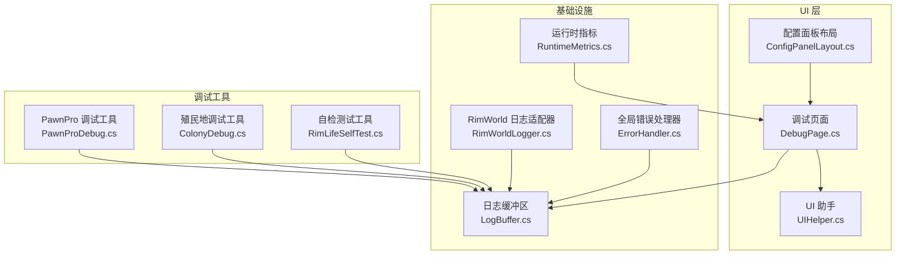
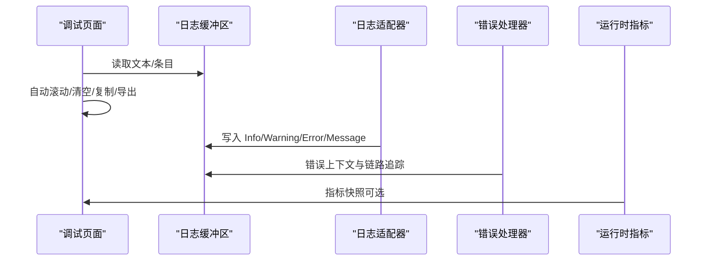
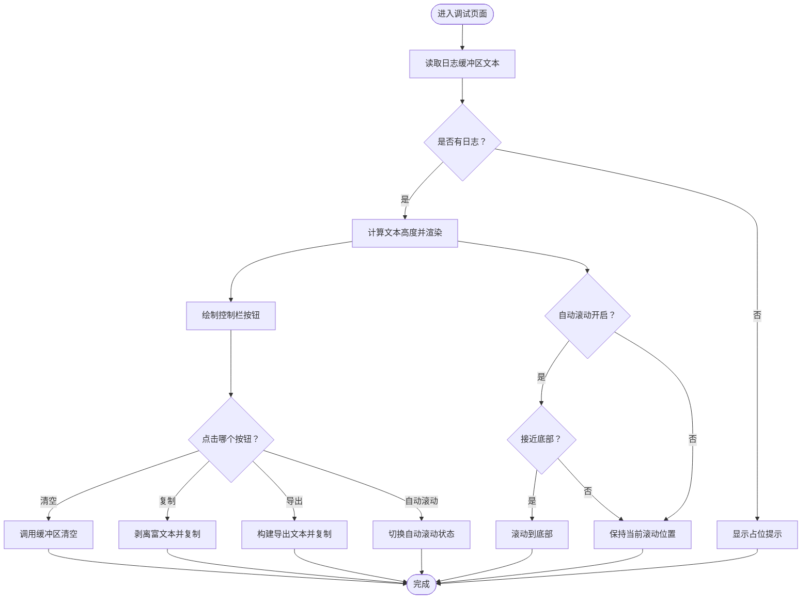
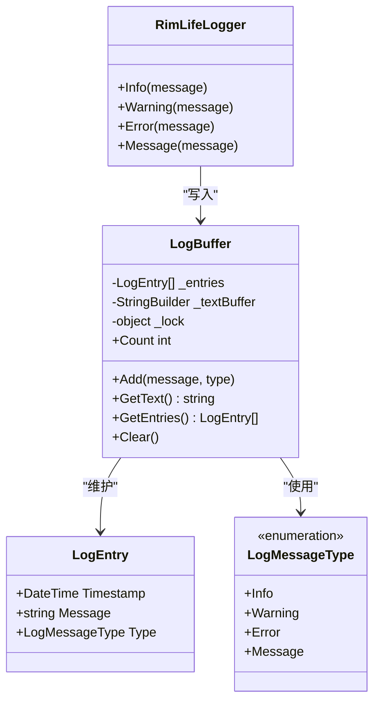
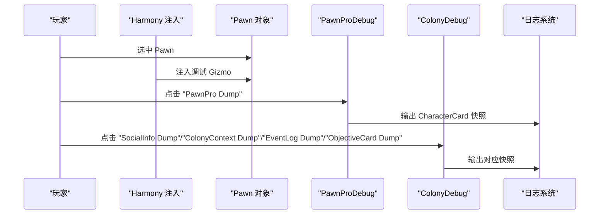
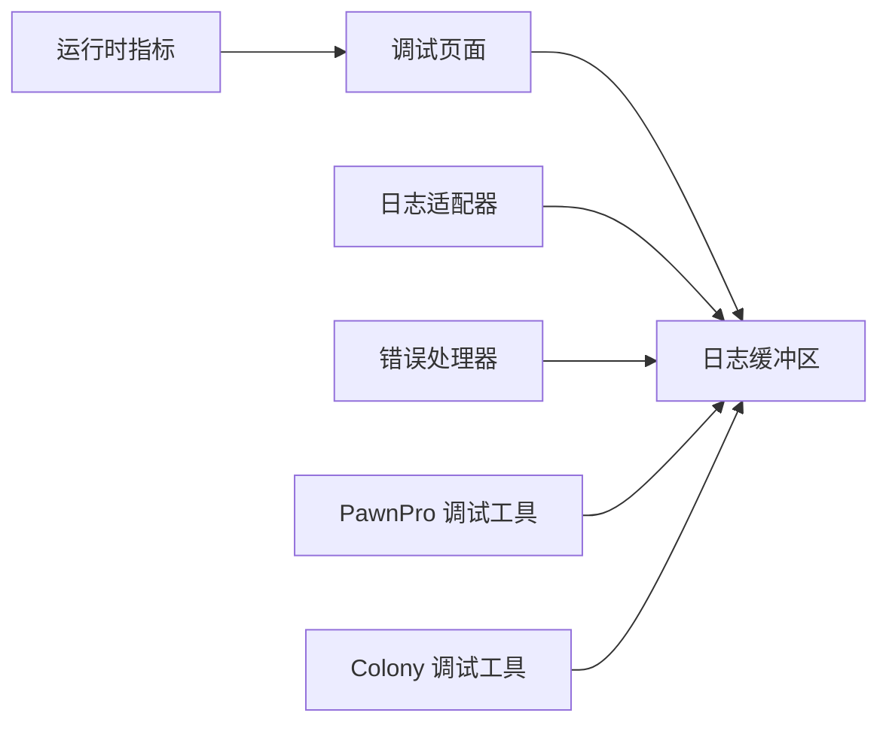

# 调试页面

<cite>
**本文引用的文件**
- [DebugPage.cs](file://Source/UI/Pages/DebugPage.cs)
- [LogBuffer.cs](file://Source/UI/LogBuffer.cs)
- [RimWorldLogger.cs](file://Source/Infrastructure/RimWorldLogger.cs)
- [PawnProDebug.cs](file://Source/Data/PawnPro/PawnProDebug.cs)
- [ColonyDebug.cs](file://Source/Data/Colony/ColonyDebug.cs)
- [RimLifeSelfTest.cs](file://Source/Tool/RimLifeSelfTest.cs)
- [ConfigPanelLayout.cs](file://Source/UI/ConfigPanelLayout.cs)
- [UIHelper.cs](file://Source/UI/Helpers/UIHelper.cs)
- [RimLifeMod.cs](file://Source/Settings/RimLifeMod.cs)
- [RuntimeMetrics.cs](file://ext/NPCLife/src/NPCLife/Framework/RuntimeMetrics.cs)
- [ErrorHandler.cs](file://ext/NPCLife/src/NPCLife/Framework/ErrorHandler.cs)
- [WorkspaceEventPool.cs](file://ext/NPCLife/src/NPCLife/Workspace/WorkspaceEventPool.cs)
</cite>

## 目录
1. [简介](#简介)
2. [项目结构](#项目结构)
3. [核心组件](#核心组件)
4. [架构概览](#架构概览)
5. [详细组件分析](#详细组件分析)
6. [依赖关系分析](#依赖关系分析)
7. [性能考量](#性能考量)
8. [故障排查指南](#故障排查指南)
9. [结论](#结论)
10. [附录](#附录)

## 简介
本文件面向开发者与高级用户，系统化阐述调试页面的功能与实现细节，涵盖实时日志查看、错误追踪、性能分析、调试模式下的特殊功能、内部状态监控与异常处理流程，并提供日志导出、问题报告模板与社区支持流程，以及常见问题的诊断步骤与解决方案。目标是帮助使用者快速定位与解决开发与运行中的问题。

## 项目结构
调试页面位于 UI 子系统中，采用“页面-布局-工具”三层组织：
- 页面层：调试页面负责日志展示与交互控制
- 布局层：配置面板布局统一承载各页面
- 工具层：日志缓冲区、UI 辅助、错误处理与性能指标

图表来源
- [DebugPage.cs:14-175](file://Source/UI/Pages/DebugPage.cs#L14-L175)
- [ConfigPanelLayout.cs:40-54](file://Source/UI/ConfigPanelLayout.cs#L40-L54)
- [LogBuffer.cs:39-141](file://Source/UI/LogBuffer.cs#L39-L141)
- [RimWorldLogger.cs:8-14](file://Source/Infrastructure/RimWorldLogger.cs#L8-L14)
- [ErrorHandler.cs:22-181](file://ext/NPCLife/src/NPCLife/Framework/ErrorHandler.cs#L22-L181)
- [RuntimeMetrics.cs:246-449](file://ext/NPCLife/src/NPCLife/Framework/RuntimeMetrics.cs#L246-L449)
- [PawnProDebug.cs:18-102](file://Source/Data/PawnPro/PawnProDebug.cs#L18-L102)
- [ColonyDebug.cs:19-236](file://Source/Data/Colony/ColonyDebug.cs#L19-L236)
- [RimLifeSelfTest.cs:33-133](file://Source/Tool/RimLifeSelfTest.cs#L33-L133)

章节来源
- [DebugPage.cs:14-175](file://Source/UI/Pages/DebugPage.cs#L14-L175)
- [ConfigPanelLayout.cs:40-54](file://Source/UI/ConfigPanelLayout.cs#L40-L54)
- [LogBuffer.cs:39-141](file://Source/UI/LogBuffer.cs#L39-L141)

## 核心组件
- 调试页面：提供终端风格的实时日志查看、自动滚动、清空、复制与导出功能
- 日志缓冲区：线程安全的双缓冲设计（结构化条目+增量文本），支持最大容量限制与重建
- 日志适配器：桥接框架日志接口到 RimWorld 日志系统
- 调试工具集：PawnPro 与 Colony 调试工具，注入到游戏内 Gizmo 面板
- 性能指标：运行时指标聚合与快照查询
- 错误处理：统一错误上报、诊断模式与链路追踪
- 配置面板：承载调试页面与其他配置页面的统一布局

章节来源
- [DebugPage.cs:27-105](file://Source/UI/Pages/DebugPage.cs#L27-L105)
- [LogBuffer.cs:39-141](file://Source/UI/LogBuffer.cs#L39-L141)
- [RimWorldLogger.cs:8-14](file://Source/Infrastructure/RimWorldLogger.cs#L8-L14)
- [PawnProDebug.cs:18-102](file://Source/Data/PawnPro/PawnProDebug.cs#L18-L102)
- [ColonyDebug.cs:19-236](file://Source/Data/Colony/ColonyDebug.cs#L19-L236)
- [RuntimeMetrics.cs:246-449](file://ext/NPCLife/src/NPCLife/Framework/RuntimeMetrics.cs#L246-L449)
- [ErrorHandler.cs:22-181](file://ext/NPCLife/src/NPCLife/Framework/ErrorHandler.cs#L22-L181)

## 架构概览
调试页面通过配置面板布局统一呈现，日志数据来自日志缓冲区；调试工具通过 Harmony 注入到游戏对象；性能与错误处理由框架层提供。

图表来源
- [DebugPage.cs:44-155](file://Source/UI/Pages/DebugPage.cs#L44-L155)
- [LogBuffer.cs:49-141](file://Source/UI/LogBuffer.cs#L49-L141)
- [RimWorldLogger.cs:10-12](file://Source/Infrastructure/RimWorldLogger.cs#L10-L12)
- [ErrorHandler.cs:97-163](file://ext/NPCLife/src/NPCLife/Framework/ErrorHandler.cs#L97-L163)
- [RuntimeMetrics.cs:246-449](file://ext/NPCLife/src/NPCLife/Framework/RuntimeMetrics.cs#L246-L449)

## 详细组件分析

### 调试页面（DebugPage）
- 功能要点
  - 终端风格日志查看：直接从增量文本缓冲区读取，无过滤、无重建，纯追加式显示
  - 控制栏：清空日志、切换自动滚动、复制全部、导出日志
  - 智能自动滚动：仅在用户处于底部附近时强制滚动到底部
  - 底部状态行：显示日志总数与缓冲区占用
- 用户交互
  - 清空：调用缓冲区清空
  - 复制：剥离富文本标签，复制纯文本
  - 导出：构建导出文本，包含时间戳、类型与消息，复制到剪贴板

图表来源
- [DebugPage.cs:27-105](file://Source/UI/Pages/DebugPage.cs#L27-L105)
- [DebugPage.cs:107-155](file://Source/UI/Pages/DebugPage.cs#L107-L155)

章节来源
- [DebugPage.cs:27-105](file://Source/UI/Pages/DebugPage.cs#L27-L105)
- [DebugPage.cs:107-155](file://Source/UI/Pages/DebugPage.cs#L107-L155)

### 日志缓冲区（LogBuffer）
- 设计特点
  - 线程安全：使用锁保护结构化条目与文本缓冲
  - 双缓冲：结构化条目列表用于导出与统计；增量文本缓冲用于终端显示
  - 容量限制：最大保留条目数，超限时移除最旧条目并重建文本缓冲
  - 类型标签：为不同日志级别生成富文本标签
- 关键方法
  - Add：写入条目并格式化增量文本
  - GetText：获取增量文本
  - GetEntries：获取条目副本（用于导出）
  - Clear：清空缓冲区
  - Count：当前条目数量

图表来源
- [LogBuffer.cs:10-141](file://Source/UI/LogBuffer.cs#L10-L141)

章节来源
- [LogBuffer.cs:39-141](file://Source/UI/LogBuffer.cs#L39-L141)

### 日志适配器（RimWorldLogger）
- 作用：将框架日志接口桥接到 RimWorld 日志系统，便于统一输出与后续重定向到调试缓冲区
- 方法映射：Message/Warn/Error 对应 Verse.Log 的对应方法

章节来源
- [RimWorldLogger.cs:8-14](file://Source/Infrastructure/RimWorldLogger.cs#L8-L14)

### 调试工具集
- PawnPro 调试工具
  - 注入：在 Dev Mode 下，对选中的 Pawn 注入“PawnPro Dump”Gizmo
  - 功能：抓取 CharacterCard 并打印结构化快照到日志
  - 安全：捕获异常并记录错误日志
- Colony 调试工具
  - 注入：在 Dev Mode 下，对选中的 Pawn 注入多项“Dump”Gizmo
  - 功能：SocialInfo、ColonyContext、EventLog、ObjectiveCard 快照输出
  - 安全：捕获异常并记录警告日志

图表来源
- [PawnProDebug.cs:23-101](file://Source/Data/PawnPro/PawnProDebug.cs#L23-L101)
- [ColonyDebug.cs:21-236](file://Source/Data/Colony/ColonyDebug.cs#L21-L236)

章节来源
- [PawnProDebug.cs:18-102](file://Source/Data/PawnPro/PawnProDebug.cs#L18-L102)
- [ColonyDebug.cs:19-236](file://Source/Data/Colony/ColonyDebug.cs#L19-L236)

### 运行时指标与性能分析
- 指标聚合：按角色、工具、术语访问、工作空间操作等维度统计
- 快照查询：提供只读快照，便于导出与分析
- 与调试页面结合：可在调试页面中展示或导出指标快照（取决于集成方式）

章节来源
- [RuntimeMetrics.cs:246-449](file://ext/NPCLife/src/NPCLife/Framework/RuntimeMetrics.cs#L246-L449)

### 错误处理与诊断模式
- 全局错误处理器：统一注册与报告错误，支持链路追踪与诊断模式
- 诊断模式：启用后输出更详细的上下文信息
- 与日志系统：在诊断模式下通过日志接口输出错误上下文

章节来源
- [ErrorHandler.cs:22-181](file://ext/NPCLife/src/NPCLife/Framework/ErrorHandler.cs#L22-L181)

### 配置面板与调试页面集成
- 配置面板布局：统一三区布局（侧栏、内容区、状态栏）
- 页面注册：调试页面作为配置面板的一个页面
- 页面切换：侧栏导航切换当前页面，内容区绘制当前页面

章节来源
- [ConfigPanelLayout.cs:40-54](file://Source/UI/ConfigPanelLayout.cs#L40-L54)
- [ConfigPanelLayout.cs:75-144](file://Source/UI/ConfigPanelLayout.cs#L75-L144)
- [ConfigPanelLayout.cs:150-187](file://Source/UI/ConfigPanelLayout.cs#L150-L187)

## 依赖关系分析
- 调试页面依赖日志缓冲区进行数据读取与状态显示
- 日志适配器与错误处理器共同向日志缓冲区写入数据
- 调试工具通过 Harmony 注入到游戏对象，间接写入日志
- 性能指标与错误处理为调试页面提供扩展能力

图表来源
- [DebugPage.cs:44-155](file://Source/UI/Pages/DebugPage.cs#L44-L155)
- [LogBuffer.cs:49-141](file://Source/UI/LogBuffer.cs#L49-L141)
- [RimWorldLogger.cs:10-12](file://Source/Infrastructure/RimWorldLogger.cs#L10-L12)
- [ErrorHandler.cs:97-163](file://ext/NPCLife/src/NPCLife/Framework/ErrorHandler.cs#L97-L163)
- [PawnProDebug.cs:37-75](file://Source/Data/PawnPro/PawnProDebug.cs#L37-L75)
- [ColonyDebug.cs:64-209](file://Source/Data/Colony/ColonyDebug.cs#L64-L209)
- [RuntimeMetrics.cs:246-449](file://ext/NPCLife/src/NPCLife/Framework/RuntimeMetrics.cs#L246-L449)

章节来源
- [DebugPage.cs:27-105](file://Source/UI/Pages/DebugPage.cs#L27-L105)
- [LogBuffer.cs:39-141](file://Source/UI/LogBuffer.cs#L39-L141)

## 性能考量
- 日志缓冲区
  - 增量文本缓冲：纯追加式，避免频繁重建
  - 容量限制：超过阈值时移除最旧条目并重建文本缓冲，平衡内存与显示效率
- UI 渲染
  - 文本高度补偿：针对 CJK 字符的高度估算偏差进行补偿，避免截断
  - 滚动优化：智能自动滚动仅在底部附近触发，减少不必要的滚动更新
- 调试工具
  - Harmony 注入：仅在 Dev Mode 下生效，避免生产环境开销
  - 异常捕获：防止调试工具抛错影响游戏主线程

章节来源
- [LogBuffer.cs:49-128](file://Source/UI/LogBuffer.cs#L49-L128)
- [UIHelper.cs:86-92](file://Source/UI/Helpers/UIHelper.cs#L86-L92)
- [DebugPage.cs:67-74](file://Source/UI/Pages/DebugPage.cs#L67-L74)
- [PawnProDebug.cs:86-100](file://Source/Data/PawnPro/PawnProDebug.cs#L86-L100)
- [ColonyDebug.cs:218-235](file://Source/Data/Colony/ColonyDebug.cs#L218-L235)

## 故障排查指南

### 常见问题与诊断步骤
- 无日志显示
  - 检查日志缓冲区是否为空：查看底部状态行日志总数
  - 确认日志写入路径：检查是否通过日志适配器或调试工具写入
  - 清空后无新增：确认日志源是否仍在活跃
- 日志过多导致卡顿
  - 观察缓冲区占用：状态行显示当前条目数与上限
  - 调整自动滚动：关闭自动滚动以减少滚动更新
  - 导出日志：复制到剪贴板以便离线分析
- 导出内容缺失
  - 确认导出前已有日志条目
  - 检查导出格式：导出文本包含时间戳、类型与消息
- 调试工具无效
  - 确认 Dev Mode 已开启
  - 确认已选中目标 Pawn
  - 查看日志输出是否包含相应 Dump 信息
- 错误未被捕获
  - 检查全局错误处理器是否注册
  - 启用诊断模式以获得更详细上下文

### 问题报告模板
- 环境信息
  - 游戏版本、模组版本、操作系统
- 复现步骤
  - 详细的操作步骤与触发条件
- 期望结果 vs 实际结果
- 日志与截图
  - 导出的调试日志（含时间戳与类型）
  - 相关截图（UI、日志、错误信息）
- 其他信息
  - 是否在 Dev Mode 下复现
  - 是否使用了特定调试工具

### 社区支持流程
- 提交 Issue
  - 在社区平台提交 Issue，附上问题报告模板
- 提供证据
  - 附带导出的调试日志与相关截图
- 跟进与验证
  - 开发者可能要求补充更多信息或复现步骤

章节来源
- [DebugPage.cs:76-79](file://Source/UI/Pages/DebugPage.cs#L76-L79)
- [DebugPage.cs:121-155](file://Source/UI/Pages/DebugPage.cs#L121-L155)
- [PawnProDebug.cs:26-35](file://Source/Data/PawnPro/PawnProDebug.cs#L26-L35)
- [ColonyDebug.cs:24-61](file://Source/Data/Colony/ColonyDebug.cs#L24-L61)
- [ErrorHandler.cs:97-163](file://ext/NPCLife/src/NPCLife/Framework/ErrorHandler.cs#L97-L163)

## 结论
调试页面提供了简洁高效的日志查看与导出能力，配合日志缓冲区、调试工具集与错误处理机制，能够满足大多数开发与运维场景下的问题定位需求。通过合理的容量控制、智能滚动与富文本标签，既保证了实时性也兼顾了可读性。建议在日常开发中结合调试工具与性能指标，形成闭环的调试与优化流程。

## 附录

### 调试工具使用场景与注意事项
- 使用场景
  - 开发阶段：快速验证日志输出与调试工具行为
  - 问题定位：通过导出日志与指标快照进行离线分析
  - 回归测试：结合自检测试工具验证核心功能
- 注意事项
  - Dev Mode 下才启用调试工具，避免影响生产环境
  - 导出日志时注意敏感信息，必要时脱敏处理
  - 高频日志场景下建议关闭自动滚动以降低 UI 更新压力

章节来源
- [RimLifeSelfTest.cs:33-133](file://Source/Tool/RimLifeSelfTest.cs#L33-L133)
- [DebugPage.cs:67-74](file://Source/UI/Pages/DebugPage.cs#L67-L74)
- [PawnProDebug.cs:26-35](file://Source/Data/PawnPro/PawnProDebug.cs#L26-L35)
- [ColonyDebug.cs:24-61](file://Source/Data/Colony/ColonyDebug.cs#L24-L61)